# Synapse A2A

**🌐 Language: [English](README.md) | [日本語](README.ja.md) | [中文](README.zh.md) | [한국어](README.ko.md) | Español | [Français](README.fr.md)**

> **Permite que los agentes colaboren en tareas sin cambiar su comportamiento**

[](https://www.python.org/downloads/)
[](LICENSE)
[](#pruebas)
[](https://deepwiki.com/s-hiraoku/synapse-a2a)

> Un framework que permite la colaboracion entre agentes mediante el Protocolo Google A2A, manteniendo los agentes CLI (Claude Code, Codex, Gemini, OpenCode, GitHub Copilot CLI) **exactamente como son**

## Objetivos del Proyecto

```text
┌─────────────────────────────────────────────────────────────────┐
│  ✅ No Invasivo: No cambia el comportamiento del agente         │
│  ✅ Colaborativo: Permite que los agentes trabajen juntos       │
│  ✅ Transparente: Mantiene los flujos de trabajo existentes     │
└─────────────────────────────────────────────────────────────────┘
```

Synapse A2A **envuelve de forma transparente** la entrada/salida de cada agente sin modificar el agente en si. Esto significa:

- **Aprovechar las fortalezas de cada agente**: Los usuarios pueden asignar libremente roles y especializaciones
- **Curva de aprendizaje cero**: Continua usando los flujos de trabajo existentes
- **A prueba de futuro**: Resistente a las actualizaciones de los agentes

Consulta [Filosofia del Proyecto](docs/project-philosophy.md) para mas detalles.


---

## Tabla de Contenidos

- [Caracteristicas](#caracteristicas)
- [Requisitos Previos](#requisitos-previos)
- [Inicio Rapido](#inicio-rapido)
- [Casos de Uso](#casos-de-uso)
- [Skills](#skills)
- [Documentacion](#documentacion)
- [Arquitectura](#arquitectura)
- [Comandos CLI](#comandos-cli)
- [Endpoints de la API](#endpoints-de-la-api)
- [Estructura de Tareas](#estructura-de-tareas)
- [Identificacion del Remitente](#identificacion-del-remitente)
- [Niveles de Prioridad](#niveles-de-prioridad)
- [Agent Card](#agent-card)
- [Registro y Gestion de Puertos](#registro-y-gestion-de-puertos)
- [Seguridad de Archivos](#seguridad-de-archivos)
- [Monitor de Agentes](#monitor-de-agentes)
- [Pruebas](#pruebas)
- [Configuracion (.synapse)](#configuracion-synapse)
- [Desarrollo y Publicacion](#desarrollo-y-publicacion)

---

## Caracteristicas

| Categoria | Caracteristica |
| --------- | -------------- |
| **Compatible con A2A** | Toda la comunicacion usa formato Message/Part + Task, descubrimiento de Agent Card |
| **Integracion CLI** | Convierte herramientas CLI existentes en agentes A2A sin modificacion |
| **synapse send** | Envia mensajes entre agentes mediante `synapse send <agente> "mensaje"` |
| **Identificacion del Remitente** | Identificacion automatica del remitente via `metadata.sender` + coincidencia de PID |
| **Interrupcion por Prioridad** | Prioridad 5 envia SIGINT antes del mensaje (parada de emergencia) |
| **Multi-Instancia** | Ejecuta multiples agentes del mismo tipo (asignacion automatica de puertos) |
| **Integracion Externa** | Comunicate con otros agentes Google A2A |
| **Seguridad de Archivos** | Previene conflictos multi-agente con bloqueo de archivos y seguimiento de cambios (visible en `synapse list`) |
| **Nombrado de Agentes** | Nombres y roles personalizados para facil identificacion (`synapse send mi-claude "hola"`) |
| **Monitor de Agentes** | Estado en tiempo real (READY/WAITING/PROCESSING/DONE), vista previa de tarea ACTUAL, salto a terminal |
| **Historial de Tareas** | Seguimiento automatico de tareas con busqueda, exportacion y estadisticas (habilitado por defecto) |

---

## Requisitos Previos

- **SO**: macOS / Linux (Windows via WSL2 recomendado)
- **Python**: 3.10+
- **Herramientas CLI**: Pre-instala y configura los agentes que desees usar:
  - [Claude Code](https://docs.anthropic.com/en/docs/claude-code)
  - [Codex CLI](https://github.com/openai/codex)
  - [Gemini CLI](https://github.com/google-gemini/gemini-cli)
  - [OpenCode](https://github.com/opencode-ai/opencode)
  - [GitHub Copilot CLI](https://docs.github.com/en/copilot/github-copilot-in-the-cli)

---

## Inicio Rapido

### 1. Instalar Synapse A2A

```bash
# Instalar desde PyPI (recomendado)
pip install synapse-a2a

# Con soporte gRPC
pip install "synapse-a2a[grpc]"
```

Para desarrolladores (editando este repositorio):

```bash
# Instalar con uv
uv sync

# O pip (editable)
pip install -e .
```

### 2. Instalar Skills (Recomendado)

**Instalar skills es altamente recomendado para aprovechar al maximo Synapse A2A.**

Los skills ayudan a Claude a entender automaticamente las funcionalidades de Synapse A2A: mensajeria @agent, Seguridad de Archivos, y mas.

```bash
# Instalar via skills.sh (https://skills.sh/)
npx skills add s-hiraoku/synapse-a2a
```

Consulta [Skills](#skills) para mas detalles.

### 3. Iniciar Agentes

```bash
# Terminal 1: Claude
synapse claude

# Terminal 2: Codex
synapse codex

# Terminal 3: Gemini
synapse gemini

# Terminal 4: OpenCode
synapse opencode

# Terminal 5: GitHub Copilot CLI
synapse copilot
```

> Nota: Si la visualizacion del scrollback del terminal esta distorsionada, prueba:
> ```bash
> uv run synapse gemini
> # o
> uv run python -m synapse.cli gemini
> ```

Los puertos se asignan automaticamente:

| Agente   | Rango de Puertos |
| -------- | ---------------- |
| Claude   | 8100-8109        |
| Gemini   | 8110-8119        |
| Codex    | 8120-8129        |
| OpenCode | 8130-8139        |
| Copilot  | 8140-8149        |

### 4. Comunicacion Entre Agentes

Usa `synapse send` para enviar mensajes entre agentes:

```bash
synapse send codex "Por favor revisa este diseno" --from synapse-claude-8100
synapse send gemini "Sugiere mejoras para la API" --from synapse-claude-8100
```

Para multiples instancias del mismo tipo, usa el formato tipo-puerto:

```bash
synapse send codex-8120 "Encarga esta tarea" --from synapse-claude-8100
synapse send codex-8121 "Encarga esa tarea" --from synapse-claude-8100
```

### 5. API HTTP

```bash
# Enviar mensaje
curl -X POST http://localhost:8100/tasks/send \
  -H "Content-Type: application/json" \
  -d '{"message": {"role": "user", "parts": [{"type": "text", "text": "Hello!"}]}}'

# Parada de emergencia (Prioridad 5)
curl -X POST "http://localhost:8100/tasks/send-priority?priority=5" \
  -H "Content-Type: application/json" \
  -d '{"message": {"role": "user", "parts": [{"type": "text", "text": "Stop!"}]}}'
```

---

## Casos de Uso

### 1. Consulta Rapida de Especificaciones (Simple)
Mientras programas con **Claude**, consulta rapidamente a **Gemini** (mejor en busquedas web) para obtener las ultimas especificaciones de librerias o informacion de errores sin cambiar de contexto.

```bash
# En la terminal de Claude:
synapse send gemini "Resume las nuevas funcionalidades de f-string en Python 3.12" --from synapse-claude-8100
```

### 2. Revision Cruzada de Disenos (Intermedio)
Obtener retroalimentacion sobre tu diseno desde agentes con diferentes perspectivas.

```bash
# Despues de que Claude redacte un diseno:
synapse send gemini "Revisa criticamente este diseno desde perspectivas de escalabilidad y mantenibilidad" --from synapse-claude-8100
```

### 3. Programacion en Parejas TDD (Intermedio)
Separar "escritor de pruebas" e "implementador" para codigo robusto.

```bash
# Terminal 1 (Codex):
Crea pruebas unitarias para auth.py - caso normal y caso de expiracion de token.

# Terminal 2 (Claude):
synapse send codex-8120 "Implementa auth.py para que pase las pruebas que creaste" --from synapse-claude-8100
```

### 4. Auditoria de Seguridad (Especializado)
Haz que un agente con rol de experto en seguridad audite tu codigo antes de hacer commit.

```bash
# Asigna un rol a Gemini:
Eres un ingeniero de seguridad. Revisa solo vulnerabilidades (SQLi, XSS, etc.)

# Despues de escribir codigo:
synapse send gemini "Audita los cambios actuales (git diff)" --from synapse-claude-8100
```

### 5. Correccion Automatica desde Logs de Error (Avanzado)
Pasa logs de error a un agente para sugerencias de correccion automatica.

```bash
# Las pruebas fallaron...
pytest > error.log

# Pedir al agente que corrija
synapse send claude "Lee error.log y corrige el problema en synapse/server.py" --from synapse-gemini-8110
```

### 6. Migracion de Lenguaje/Framework (Avanzado)
Distribuir trabajo de refactorizacion grande entre agentes.

```bash
# Terminal 1 (Claude):
Lee legacy_api.js y crea definiciones de tipos TypeScript

# Terminal 2 (Codex):
synapse send claude "Usa las definiciones de tipos que creaste para reescribir legacy_api.js a src/new_api.ts" --from synapse-codex-8121
```

### Comparacion con SSH Remoto

| Operacion | SSH | Synapse |
|-----------|-----|---------|
| Operacion CLI manual | ◎ | ◎ |
| Envio programatico de tareas | △ requiere expect etc. | ◎ API HTTP |
| Multiples clientes simultaneos | △ multiples sesiones | ◎ endpoint unico |
| Notificaciones de progreso en tiempo real | ✗ | ◎ SSE/Webhook |
| Coordinacion automatica entre agentes | ✗ | ◎ synapse send |

> **Nota**: SSH es frecuentemente suficiente para uso individual de CLI. Synapse destaca cuando necesitas automatizacion, coordinacion y colaboracion multi-agente.

---

## Skills

**Instalar skills es altamente recomendado** al usar Synapse A2A con Claude Code.

### Por que Instalar Skills?

Con los skills instalados, Claude entiende y ejecuta automaticamente:

- **synapse send**: Comunicacion entre agentes via `synapse send codex "Corrige esto" --from synapse-claude-8100`
- **Control de prioridad**: Envio de mensajes con Prioridad 1-5 (5 = parada de emergencia)
- **Seguridad de Archivos**: Previene conflictos multi-agente con bloqueo de archivos y seguimiento de cambios
- **Gestion de historial**: Busqueda, exportacion y estadisticas del historial de tareas

### Instalacion

```bash
# Instalar via skills.sh (https://skills.sh/)
npx skills add s-hiraoku/synapse-a2a
```

### Skills Incluidos

| Skill | Descripcion |
|-------|-------------|
| **synapse-a2a** | Guia completa para comunicacion entre agentes: `synapse send`, prioridad, protocolo A2A, historial, Seguridad de Archivos, configuracion |

### Estructura de Directorios

```text
plugins/
└── synapse-a2a/
    ├── .claude-plugin/plugin.json
    ├── README.md
    └── skills/
        └── synapse-a2a/SKILL.md
```

Consulta [plugins/synapse-a2a/README.md](plugins/synapse-a2a/README.md) para mas detalles.

> **Nota**: Codex y Gemini no soportan plugins, pero puedes colocar skills expandidos en el directorio `.agents/skills/` (Codex/OpenCode) o `.gemini/skills/` respectivamente para habilitar estas funcionalidades.

---

## Documentacion

- [guides/README.md](guides/README.md) - Resumen de la documentacion
- [guides/multi-agent-setup.md](guides/multi-agent-setup.md) - Guia de configuracion
- [guides/usage.md](guides/usage.md) - Comandos y patrones de uso
- [guides/settings.md](guides/settings.md) - Detalles de configuracion `.synapse`
- [guides/troubleshooting.md](guides/troubleshooting.md) - Problemas comunes y soluciones

---

## Arquitectura

### Estructura Servidor/Cliente A2A

En Synapse, **cada agente opera como un servidor A2A**. No hay servidor central; es una arquitectura P2P.

```
┌─────────────────────────────────────┐    ┌─────────────────────────────────────┐
│  synapse claude (puerto 8100)       │    │  synapse codex (puerto 8120)        │
│  ┌───────────────────────────────┐  │    │  ┌───────────────────────────────┐  │
│  │  Servidor FastAPI (Serv. A2A) │  │    │  │  Servidor FastAPI (Serv. A2A) │  │
│  │  /.well-known/agent.json      │  │    │  │  /.well-known/agent.json      │  │
│  │  /tasks/send                  │◄─┼────┼──│  A2AClient                    │  │
│  │  /tasks/{id}                  │  │    │  └───────────────────────────────┘  │
│  └───────────────────────────────┘  │    │  ┌───────────────────────────────┐  │
│  ┌───────────────────────────────┐  │    │  │  PTY + Codex CLI              │  │
│  │  PTY + Claude CLI             │  │    │  └───────────────────────────────┘  │
│  └───────────────────────────────┘  │    └─────────────────────────────────────┘
└─────────────────────────────────────┘
```

Cada agente es:

- **Servidor A2A**: Acepta solicitudes de otros agentes
- **Cliente A2A**: Envia solicitudes a otros agentes

### Componentes Principales

| Componente | Archivo | Rol |
| ---------- | ------- | --- |
| Servidor FastAPI | `synapse/server.py` | Proporciona endpoints A2A |
| Router A2A | `synapse/a2a_compat.py` | Implementacion del protocolo A2A |
| Cliente A2A | `synapse/a2a_client.py` | Comunicacion con otros agentes |
| TerminalController | `synapse/controller.py` | Gestion de PTY, deteccion READY/PROCESSING |
| InputRouter | `synapse/input_router.py` | Deteccion del patron @Agent |
| AgentRegistry | `synapse/registry.py` | Registro y busqueda de agentes |

### Secuencia de Inicio


### Flujo de Comunicacion

```mermaid
sequenceDiagram
    participant User as Usuario
    participant Claude as Claude (8100)
    participant Client as A2AClient
    participant Codex as Codex (8120)

    User->>Claude: @codex Revisa este diseno
    Claude->>Client: send_to_local()
    Client->>Codex: POST /tasks/send-priority
    Codex->>Codex: Crear Task → Escribir en PTY
    Codex-->>Client: {"task": {"id": "...", "status": "working"}}
    Client-->>Claude: [→ codex] Envio completado
```



---

## Comandos CLI

### Operaciones Basicas

```bash
# Iniciar agente (primer plano)
synapse claude
synapse codex
synapse gemini
synapse opencode
synapse copilot

# Iniciar con nombre y rol personalizado
synapse claude --name mi-claude --role "revisor de codigo"

# Saltar configuracion interactiva de nombre/rol
synapse claude --no-setup

# Especificar puerto
synapse claude --port 8105

# Pasar argumentos a la herramienta CLI
synapse claude -- --resume
```

### Nombrado de Agentes

Asigna nombres y roles personalizados a los agentes para una identificacion y gestion mas facil:

```bash
# Configuracion interactiva (por defecto al iniciar agente)
synapse claude
# → Solicita nombre y rol

# Saltar configuracion interactiva
synapse claude --no-setup

# Establecer nombre y rol via opciones CLI
synapse claude --name mi-claude --role "revisor de codigo"

# Despues de que el agente esta corriendo, cambiar nombre/rol
synapse rename synapse-claude-8100 --name mi-claude --role "escritor de pruebas"
synapse rename mi-claude --role "documentacion"  # Cambiar solo el rol
synapse rename mi-claude --clear                 # Limpiar nombre y rol
```

Una vez nombrado, usa el nombre personalizado para todas las operaciones:

```bash
synapse send mi-claude "Revisa este codigo" --from synapse-codex-8121
synapse jump mi-claude
synapse kill mi-claude
```

**Nombre vs ID:**
- **Visualizacion/Prompts**: Muestra el nombre si esta establecido, de lo contrario el ID (ej., `Kill mi-claude (PID: 1234)?`)
- **Procesamiento interno**: Siempre usa el ID del agente (`synapse-claude-8100`)
- **Resolucion de destino**: El nombre tiene la mayor prioridad al hacer coincidencia de destinos

### Lista de Comandos

| Comando | Descripcion |
| ------- | ----------- |
| `synapse <profile>` | Iniciar en primer plano |
| `synapse start <profile>` | Iniciar en segundo plano |
| `synapse stop <profile\|id>` | Detener agente (puede especificar ID) |
| `synapse kill <destino>` | Matar agente inmediatamente |
| `synapse jump <destino>` | Saltar a la terminal del agente |
| `synapse rename <destino>` | Asignar nombre/rol al agente |
| `synapse --version` | Mostrar version |
| `synapse list` | Listar agentes en ejecucion (Rich TUI con auto-actualizacion y salto a terminal) |
| `synapse logs <profile>` | Mostrar logs |
| `synapse send <destino> <mensaje>` | Enviar mensaje |
| `synapse reply <mensaje>` | Responder al ultimo mensaje A2A recibido |
| `synapse instructions show` | Mostrar contenido de instrucciones |
| `synapse instructions files` | Listar archivos de instrucciones |
| `synapse instructions send` | Reenviar instrucciones iniciales |
| `synapse history list` | Mostrar historial de tareas |
| `synapse history show <task_id>` | Mostrar detalles de tarea |
| `synapse history search` | Busqueda por palabras clave |
| `synapse history cleanup` | Eliminar datos antiguos |
| `synapse history stats` | Mostrar estadisticas |
| `synapse history export` | Exportar a JSON/CSV |
| `synapse file-safety status` | Mostrar estadisticas de seguridad de archivos |
| `synapse file-safety locks` | Listar bloqueos activos |
| `synapse file-safety lock` | Bloquear un archivo |
| `synapse file-safety unlock` | Liberar bloqueo |
| `synapse file-safety history` | Historial de cambios de archivos |
| `synapse file-safety recent` | Cambios recientes |
| `synapse file-safety record` | Registrar cambio manualmente |
| `synapse file-safety cleanup` | Eliminar datos antiguos |
| `synapse file-safety debug` | Mostrar informacion de depuracion |
| `synapse config` | Gestion de configuracion (TUI interactivo) |
| `synapse config show` | Mostrar configuracion actual |

### Modo Resume

Al reanudar una sesion existente, usa estas banderas para **omitir el envio de instrucciones iniciales** (explicacion del protocolo A2A), manteniendo tu contexto limpio:

```bash
# Reanudar sesion de Claude Code
synapse claude -- --resume

# Reanudar Gemini con historial
synapse gemini -- --resume=5

# Codex usa 'resume' como subcomando (no bandera --resume)
synapse codex -- resume --last
```

Banderas por defecto (personalizables en `settings.json`):
- **Claude**: `--resume`, `--continue`, `-r`, `-c`
- **Gemini**: `--resume`, `-r`
- **Codex**: `resume`
- **OpenCode**: `--continue`, `-c`
- **Copilot**: `--continue`, `--resume`

### Gestion de Instrucciones

Reenvia manualmente las instrucciones iniciales cuando no fueron enviadas (ej., despues del modo `--resume`):

```bash
# Mostrar contenido de instrucciones
synapse instructions show claude

# Listar archivos de instrucciones
synapse instructions files claude

# Enviar instrucciones iniciales al agente en ejecucion
synapse instructions send claude

# Vista previa antes de enviar
synapse instructions send claude --preview

# Enviar a un ID de agente especifico
synapse instructions send synapse-claude-8100
```

Util cuando:
- Necesitas informacion del protocolo A2A despues de iniciar con `--resume`
- El agente perdio/olvido instrucciones y necesita recuperacion
- Depuracion del contenido de instrucciones

### Gestion de Agentes Externos

```bash
# Registrar agente externo
synapse external add http://other-agent:9000 --alias otro

# Listar
synapse external list

# Enviar mensaje
synapse external send otro "Procesa esta tarea"
```

### Gestion del Historial de Tareas

Busca, navega y analiza resultados de ejecucion de agentes pasados.

**Nota:** El historial esta habilitado por defecto desde v0.3.13. Para deshabilitarlo:

```bash
# Deshabilitar via variable de entorno
export SYNAPSE_HISTORY_ENABLED=false
synapse claude
```

#### Operaciones Basicas

```bash
# Mostrar las ultimas 50 entradas
synapse history list

# Filtrar por agente
synapse history list --agent claude

# Limite personalizado
synapse history list --limit 100

# Mostrar detalles de tarea
synapse history show task-id-uuid
```

#### Busqueda por Palabras Clave

Busca en los campos de entrada/salida por palabra clave:

```bash
# Palabra clave unica
synapse history search "Python"

# Multiples palabras clave (logica OR)
synapse history search "Python" "Docker"

# Logica AND (todas las palabras clave deben coincidir)
synapse history search "Python" "function" --logic AND

# Con filtro de agente
synapse history search "Python" --agent claude

# Limitar resultados
synapse history search "error" --limit 20
```

#### Estadisticas

```bash
# Estadisticas generales (total, tasa de exito, desglose por agente)
synapse history stats

# Estadisticas de un agente especifico
synapse history stats --agent claude
```

#### Exportacion de Datos

```bash
# Exportar JSON (stdout)
synapse history export --format json

# Exportar CSV
synapse history export --format csv

# Guardar en archivo
synapse history export --format json --output history.json
synapse history export --format csv --agent claude > claude_history.csv
```

#### Politica de Retencion

```bash
# Eliminar datos con mas de 30 dias
synapse history cleanup --days 30

# Mantener base de datos por debajo de 100MB
synapse history cleanup --max-size 100

# Forzar (sin confirmacion)
synapse history cleanup --days 30 --force

# Ejecucion en seco
synapse history cleanup --days 30 --dry-run
```

**Almacenamiento:**

- Base de datos SQLite: `~/.synapse/history/history.db`
- Almacena: ID de tarea, nombre del agente, entrada, salida, estado, metadatos
- Indexado automatico: agent_name, timestamp, task_id

**Configuracion:**

- **Habilitado por defecto** (v0.3.13+)
- **Deshabilitar**: `SYNAPSE_HISTORY_ENABLED=false`

### Comando synapse send (Recomendado)

Usa `synapse send` para comunicacion entre agentes. Funciona en entornos sandbox.

```bash
synapse send <destino> "<mensaje>" [--from <remitente>] [--priority <1-5>] [--response | --no-response]
```

**Formatos de Destino:**

| Formato | Ejemplo | Descripcion |
|---------|---------|-------------|
| Nombre personalizado | `mi-claude` | Mayor prioridad, usar cuando el agente tiene nombre |
| Tipo de agente | `claude` | Solo funciona cuando existe una unica instancia |
| Tipo-puerto | `claude-8100` | Usar cuando hay multiples instancias del mismo tipo |
| ID completo | `synapse-claude-8100` | ID completo del agente |

Cuando hay multiples agentes del mismo tipo en ejecucion, solo el tipo (ej., `claude`) dara error. Usa `claude-8100` o `synapse-claude-8100`.

**Opciones:**

| Opcion | Corto | Descripcion |
|--------|-------|-------------|
| `--from` | `-f` | ID del agente remitente (para identificacion de respuesta) |
| `--priority` | `-p` | Prioridad 1-4: normal, 5: parada de emergencia (envia SIGINT) |
| `--response` | - | Ida y vuelta - el remitente espera, el receptor responde con `synapse reply` |
| `--no-response` | - | Solo ida - enviar y olvidar, no se necesita respuesta |

**Ejemplos:**

```bash
# Enviar mensaje (instancia unica)
synapse send claude "Hola" --priority 1 --from synapse-codex-8121

# Enviar a instancia especifica (multiples del mismo tipo)
synapse send claude-8100 "Hola" --from synapse-claude-8101

# Parada de emergencia
synapse send claude "Detente!" --priority 5 --from synapse-codex-8121

# Esperar respuesta (ida y vuelta)
synapse send gemini "Analiza esto" --response --from synapse-claude-8100
```

**Comportamiento por defecto:** Con `a2a.flow=auto` (por defecto), `synapse send` espera una respuesta a menos que se especifique `--no-response`.

**Importante:** Siempre usa `--from` con tu ID de agente (formato: `synapse-<tipo>-<puerto>`).

### Comando synapse reply

Responder al ultimo mensaje recibido:

```bash
synapse reply "<mensaje>" --from <tu_id_de_agente>
```

La bandera `--from` es requerida en entornos sandbox (como Codex).

### Herramienta A2A de Bajo Nivel

Para operaciones avanzadas:

```bash
# Listar agentes
python -m synapse.tools.a2a list

# Enviar mensaje
python -m synapse.tools.a2a send --target claude --priority 1 "Hello"

# Responder al ultimo mensaje recibido (usa seguimiento de respuestas)
python -m synapse.tools.a2a reply "Here is my response"
```

---

## Endpoints de la API

### Compatible con A2A

| Endpoint | Metodo | Descripcion |
| -------- | ------ | ----------- |
| `/.well-known/agent.json` | GET | Agent Card |
| `/tasks/send` | POST | Enviar mensaje |
| `/tasks/send-priority` | POST | Enviar con prioridad |
| `/tasks/create` | POST | Crear tarea (sin envio PTY, para `--response`) |
| `/tasks/{id}` | GET | Obtener estado de tarea |
| `/tasks` | GET | Listar tareas |
| `/tasks/{id}/cancel` | POST | Cancelar tarea |
| `/status` | GET | Estado READY/PROCESSING |

### Extensiones de Synapse

| Endpoint | Metodo | Descripcion |
| -------- | ------ | ----------- |
| `/reply-stack/get` | GET | Obtener info del remitente sin eliminar (para vista previa antes de enviar) |
| `/reply-stack/pop` | GET | Extraer info del remitente del mapa de respuestas (para `synapse reply`) |

### Agentes Externos

| Endpoint | Metodo | Descripcion |
| -------- | ------ | ----------- |
| `/external/discover` | POST | Registrar agente externo |
| `/external/agents` | GET | Listar |
| `/external/agents/{alias}` | DELETE | Eliminar |
| `/external/agents/{alias}/send` | POST | Enviar |

---

## Estructura de Tareas

En el protocolo A2A, toda la comunicacion se gestiona como **Tareas** (Tasks).

### Ciclo de Vida de una Tarea


### Objeto Task

```json
{
  "id": "550e8400-e29b-41d4-a716-446655440000",
  "context_id": "conversation-123",
  "status": "working",
  "message": {
    "role": "user",
    "parts": [{ "type": "text", "text": "Review this design" }]
  },
  "artifacts": [],
  "metadata": {
    "sender": {
      "sender_id": "synapse-claude-8100",
      "sender_type": "claude",
      "sender_endpoint": "http://localhost:8100"
    }
  },
  "created_at": "2024-01-15T10:30:00Z",
  "updated_at": "2024-01-15T10:30:05Z"
}
```

### Descripcion de Campos

| Campo | Tipo | Descripcion |
| ----- | ---- | ----------- |
| `id` | string | Identificador unico de tarea (UUID) |
| `context_id` | string? | ID de contexto de conversacion (para multi-turno) |
| `status` | string | `submitted` / `working` / `completed` / `failed` / `input_required` |
| `message` | Message | Mensaje enviado |
| `artifacts` | Artifact[] | Artefactos de salida de la tarea |
| `metadata` | object | Informacion del remitente (`metadata.sender`) |
| `created_at` | string | Marca de tiempo de creacion (ISO 8601) |
| `updated_at` | string | Marca de tiempo de actualizacion (ISO 8601) |

### Estructura del Mensaje

```json
{
  "role": "user",
  "parts": [
    { "type": "text", "text": "Message content" },
    {
      "type": "file",
      "file": {
        "name": "doc.pdf",
        "mimeType": "application/pdf",
        "bytes": "..."
      }
    }
  ]
}
```

| Tipo de Part | Descripcion |
| ------------ | ----------- |
| `text` | Mensaje de texto |
| `file` | Archivo adjunto |
| `data` | Datos estructurados |

---

## Identificacion del Remitente

El remitente de los mensajes A2A puede identificarse mediante `metadata.sender`.

### Formato de Salida PTY

Los mensajes se envian al PTY del agente con un prefijo simple `A2A:`:

```
A2A: <contenido del mensaje>
```

### Manejo de Respuestas

Synapse gestiona automaticamente el enrutamiento de respuestas. Los agentes simplemente usan `synapse reply`:

```bash
synapse reply "Aqui esta mi respuesta" --from <tu_id_de_agente>
```

El framework rastrea internamente la informacion del remitente y enruta las respuestas automaticamente.

### Verificacion de la API de Tareas (Desarrollo)

```bash
curl -s http://localhost:8120/tasks/<id> | jq '.metadata.sender'
```

Respuesta:

```json
{
  "sender_id": "synapse-claude-8100",
  "sender_type": "claude",
  "sender_endpoint": "http://localhost:8100"
}
```

### Como Funciona

1. **Al enviar**: Consulta el Registry, identifica el propio agent_id mediante coincidencia de PID
2. **Al crear Task**: Adjunta informacion del remitente a `metadata.sender`
3. **Al recibir**: Verifica mediante prefijo PTY o la API de Tareas

---

## Niveles de Prioridad

| Prioridad | Comportamiento | Caso de Uso |
| --------- | -------------- | ----------- |
| 1-4 | Escritura normal en stdin | Mensajes regulares |
| 5 | SIGINT y luego escritura | Parada de emergencia |

```bash
# Parada de emergencia
synapse send claude "Detente!" --priority 5
```

---

## Agent Card

Cada agente publica un Agent Card en `/.well-known/agent.json`.

```bash
curl http://localhost:8100/.well-known/agent.json
```

```json
{
  "name": "Synapse Claude",
  "description": "PTY-wrapped claude CLI agent with A2A communication",
  "url": "http://localhost:8100",
  "capabilities": {
    "streaming": false,
    "pushNotifications": false,
    "multiTurn": true
  },
  "skills": [
    {
      "id": "chat",
      "name": "Chat",
      "description": "Send messages to the CLI agent"
    },
    {
      "id": "interrupt",
      "name": "Interrupt",
      "description": "Interrupt current processing"
    }
  ],
  "extensions": {
    "synapse": {
      "agent_id": "synapse-claude-8100",
      "pty_wrapped": true,
      "priority_interrupt": true,
      "at_agent_syntax": true
    }
  }
}
```

### Filosofia de Diseno

El Agent Card es una "tarjeta de presentacion" que contiene solo informacion orientada al exterior:

- capabilities, skills, endpoint, etc.
- Las instrucciones internas no se incluyen (se envian via A2A Task al inicio)

---

## Registro y Gestion de Puertos

### Archivos del Registro

```
~/.a2a/registry/
├── synapse-claude-8100.json
├── synapse-claude-8101.json
└── synapse-gemini-8110.json
```

### Limpieza Automatica

Las entradas obsoletas se eliminan automaticamente durante:

- Ejecucion de `synapse list`
- Envio de mensajes (cuando el destino esta inactivo)

### Rangos de Puertos

```python
PORT_RANGES = {
    "claude": (8100, 8109),
    "gemini": (8110, 8119),
    "codex": (8120, 8129),
    "opencode": (8130, 8139),
    "copilot": (8140, 8149),
    "dummy": (8190, 8199),
}
```

### Uso Tipico de Memoria (Agentes Residentes)

En macOS, los agentes residentes inactivos son ligeros. A fecha de 25 de enero de 2026,
el RSS es de aproximadamente ~12 MB por proceso de agente en una configuracion de desarrollo tipica.

El uso real varia segun el perfil, plugins, configuracion de historial y carga de trabajo.
Ten en cuenta que `ps` reporta RSS en KB (por lo que ~12 MB corresponde a ~12,000 KB).
Para medir en tu maquina:

```bash
ps -o pid,comm,rss,vsz,etime,command -A | rg "synapse"
```

Si no tienes ripgrep:

```bash
ps -o pid,comm,rss,vsz,etime,command -A | grep "synapse"
```

---

## Seguridad de Archivos

Previene conflictos cuando multiples agentes editan los mismos archivos simultaneamente.


### Caracteristicas

| Caracteristica | Descripcion |
|----------------|-------------|
| **Bloqueo de Archivos** | Control exclusivo previene edicion simultanea |
| **Seguimiento de Cambios** | Registra quien cambio que y cuando |
| **Inyeccion de Contexto** | Proporciona historial de cambios recientes en lectura |
| **Validacion Pre-escritura** | Verifica estado del bloqueo antes de escribir |
| **Integracion con List** | Bloqueos activos visibles en la columna EDITING_FILE de `synapse list` |

### Habilitar

```bash
# Habilitar via variable de entorno
export SYNAPSE_FILE_SAFETY_ENABLED=true
synapse claude
```

### Comandos Basicos

```bash
# Mostrar estadisticas
synapse file-safety status

# Listar bloqueos activos
synapse file-safety locks

# Adquirir bloqueo
synapse file-safety lock /path/to/file.py claude --intent "Refactorizacion"

# Esperar a que se libere el bloqueo
synapse file-safety lock /path/to/file.py claude --wait --wait-timeout 60 --wait-interval 2

# Liberar bloqueo
synapse file-safety unlock /path/to/file.py claude

# Historial de cambios de archivo
synapse file-safety history /path/to/file.py

# Cambios recientes
synapse file-safety recent

# Eliminar datos antiguos
synapse file-safety cleanup --days 30
```

### API Python

```python
from synapse.file_safety import FileSafetyManager, ChangeType, LockStatus

manager = FileSafetyManager.from_env()

# Adquirir bloqueo
result = manager.acquire_lock("/path/to/file.py", "claude", intent="Refactorizacion")
if result["status"] == LockStatus.ACQUIRED:
    # Editar archivo...

    # Registrar cambio
    manager.record_modification(
        file_path="/path/to/file.py",
        agent_name="claude",
        task_id="task-123",
        change_type=ChangeType.MODIFY,
        intent="Corregir error de autenticacion"
    )

    # Liberar bloqueo
    manager.release_lock("/path/to/file.py", "claude")

# Validacion pre-escritura
validation = manager.validate_write("/path/to/file.py", "gemini")
if not validation["allowed"]:
    print(f"Escritura bloqueada: {validation['reason']}")
```

**Almacenamiento**: Por defecto es `.synapse/file_safety.db` (SQLite, relativo al directorio de trabajo). Cambiar via `SYNAPSE_FILE_SAFETY_DB_PATH` (ej., `~/.synapse/file_safety.db` para global).

Consulta [docs/file-safety.md](docs/file-safety.md) para mas detalles.

---

## Monitor de Agentes

Monitoreo en tiempo real del estado de los agentes con capacidad de salto a terminal.

### Modo Rich TUI

```bash
# Iniciar Rich TUI con auto-actualizacion (por defecto)
synapse list
```

La visualizacion se actualiza automaticamente cuando cambia el estado de los agentes (via file watcher) con un intervalo de sondeo de respaldo de 10 segundos.

### Columnas de Visualizacion

| Columna | Descripcion |
|---------|-------------|
| ID | ID del agente (ej., `synapse-claude-8100`) |
| NAME | Nombre personalizado (si esta asignado) |
| TYPE | Tipo de agente (claude, gemini, codex, etc.) |
| ROLE | Descripcion del rol del agente (si esta asignado) |
| STATUS | Estado actual (READY, WAITING, PROCESSING, DONE) |
| CURRENT | Vista previa de la tarea actual |
| TRANSPORT | Indicador de transporte de comunicacion |
| WORKING_DIR | Directorio de trabajo actual |
| EDITING_FILE | Archivo siendo editado (solo con Seguridad de Archivos habilitada) |

**Personalizar columnas** en `settings.json`:

```json
{
  "list": {
    "columns": ["ID", "NAME", "STATUS", "CURRENT", "TRANSPORT", "WORKING_DIR"]
  }
}
```

### Estados

| Estado | Color | Significado |
|--------|-------|-------------|
| **READY** | Verde | El agente esta inactivo, esperando entrada |
| **WAITING** | Cian | El agente muestra UI de seleccion, esperando decision del usuario |
| **PROCESSING** | Amarillo | El agente esta trabajando activamente |
| **DONE** | Azul | Tarea completada (transiciona automaticamente a READY despues de 10s) |

### Controles Interactivos

| Tecla | Accion |
|-------|--------|
| 1-9 | Seleccionar fila de agente (directo) |
| ↑/↓ | Navegar filas de agentes |
| **Enter** o **j** | Saltar a la terminal del agente seleccionado |
| **k** | Matar agente seleccionado (con confirmacion) |
| **/** | Filtrar por TYPE, NAME o WORKING_DIR |
| ESC | Limpiar filtro/seleccion |
| q | Salir |

**Terminales Soportadas**: iTerm2, Terminal.app, Ghostty, VS Code, tmux, Zellij

### Deteccion de WAITING

> **Nota**: La deteccion de WAITING esta actualmente deshabilitada debido a falsos positivos al inicio. Consulta [#140](https://github.com/s-hiraoku/synapse-a2a/issues/140) para mas detalles.

Cuando esta habilitada, detecta agentes esperando entrada del usuario (UI de seleccion, prompts Y/n) usando patrones regex:

- **Gemini**: UI de seleccion `● 1. Option`, prompts `Allow execution`
- **Claude**: Cursor `❯ Option`, checkboxes `☐/☑`, prompts `[Y/n]`
- **Codex**: Listas numeradas con indentacion
- **OpenCode**: Opciones numeradas, indicadores de seleccion, prompts `[y/N]`
- **Copilot**: Opciones numeradas, indicadores de seleccion, prompts `[y/N]` o `(y/n)`

---

## Pruebas

Suite de pruebas completa que verifica el cumplimiento del protocolo A2A:

```bash
# Todas las pruebas
pytest

# Categoria especifica
pytest tests/test_a2a_compat.py -v
pytest tests/test_sender_identification.py -v
```

---

## Configuracion (.synapse)

Personaliza variables de entorno e instrucciones iniciales via `.synapse/settings.json`.

### Alcances

| Alcance | Ruta | Prioridad |
|---------|------|-----------|
| Usuario | `~/.synapse/settings.json` | Baja |
| Proyecto | `./.synapse/settings.json` | Media |
| Local | `./.synapse/settings.local.json` | Alta (recomendado en gitignore) |

Las configuraciones de mayor prioridad sobreescriben las de menor prioridad.

### Configuracion

```bash
# Crear directorio .synapse/ (copia todos los archivos de plantilla)
synapse init

# ? Donde quieres crear .synapse/?
#   ❯ Alcance de usuario (~/.synapse/)
#     Alcance de proyecto (./.synapse/)
#
# ✔ Creado ~/.synapse

# Restablecer a valores por defecto
synapse reset

# Editar configuracion interactivamente (TUI)
synapse config

# Mostrar configuracion actual (solo lectura)
synapse config show
synapse config show --scope user
```

`synapse init` copia estos archivos a `.synapse/`:

| Archivo | Descripcion |
|---------|-------------|
| `settings.json` | Variables de entorno y configuracion de instrucciones iniciales |
| `default.md` | Instrucciones iniciales comunes a todos los agentes |
| `gemini.md` | Instrucciones iniciales especificas de Gemini |
| `file-safety.md` | Instrucciones de Seguridad de Archivos |

### Estructura de settings.json

```json
{
  "env": {
    "SYNAPSE_HISTORY_ENABLED": "true",
    "SYNAPSE_FILE_SAFETY_ENABLED": "true",
    "SYNAPSE_FILE_SAFETY_DB_PATH": ".synapse/file_safety.db"
  },
  "instructions": {
    "default": "[SYNAPSE INSTRUCTIONS...]\n...",
    "claude": "",
    "gemini": "",
    "codex": ""
  },
  "approvalMode": "required",
  "a2a": {
    "flow": "auto"
  }
}
```

### Variables de Entorno (env)

| Variable | Descripcion | Por defecto |
|----------|-------------|-------------|
| `SYNAPSE_HISTORY_ENABLED` | Habilitar historial de tareas | `true` |
| `SYNAPSE_FILE_SAFETY_ENABLED` | Habilitar seguridad de archivos | `true` |
| `SYNAPSE_FILE_SAFETY_DB_PATH` | Ruta de BD de seguridad de archivos | `.synapse/file_safety.db` |
| `SYNAPSE_FILE_SAFETY_RETENTION_DAYS` | Dias de retencion del historial de bloqueos | `30` |
| `SYNAPSE_AUTH_ENABLED` | Habilitar autenticacion de API | `false` |
| `SYNAPSE_API_KEYS` | Claves API (separadas por comas) | - |
| `SYNAPSE_ADMIN_KEY` | Clave de administrador | - |
| `SYNAPSE_ALLOW_LOCALHOST` | Omitir autenticacion para localhost | `true` |
| `SYNAPSE_USE_HTTPS` | Usar HTTPS | `false` |
| `SYNAPSE_WEBHOOK_SECRET` | Secreto de webhook | - |
| `SYNAPSE_WEBHOOK_TIMEOUT` | Timeout de webhook (seg) | `10` |
| `SYNAPSE_WEBHOOK_MAX_RETRIES` | Reintentos de webhook | `3` |
| `SYNAPSE_LONG_MESSAGE_THRESHOLD` | Umbral de caracteres para almacenamiento en archivo | `200` |
| `SYNAPSE_LONG_MESSAGE_TTL` | TTL para archivos de mensajes (segundos) | `3600` |
| `SYNAPSE_LONG_MESSAGE_DIR` | Directorio para archivos de mensajes | Temp del sistema |

### Configuracion de Comunicacion A2A (a2a)

| Configuracion | Valor | Descripcion |
|---------------|-------|-------------|
| `flow` | `roundtrip` | Siempre esperar resultado |
| `flow` | `oneway` | Siempre solo reenviar (no esperar) |
| `flow` | `auto` | Controlado por banderas; si se omite, espera por defecto |

### Modo de Aprobacion (approvalMode)

Controla si mostrar un prompt de confirmacion antes de enviar instrucciones iniciales.

| Configuracion | Descripcion |
|---------------|-------------|
| `required` | Mostrar prompt de aprobacion al inicio (por defecto) |
| `auto` | Enviar instrucciones automaticamente sin solicitar |

Cuando esta configurado como `required`, veras un prompt como:

```
[Synapse] Agent: synapse-claude-8100 | Port: 8100
[Synapse] Initial instructions will be sent to configure A2A communication.

Proceed? [Y/n/s(skip)]:
```

Opciones:
- **Y** (o Enter): Enviar instrucciones iniciales e iniciar agente
- **n**: Abortar inicio
- **s**: Iniciar agente sin enviar instrucciones iniciales

### Instrucciones Iniciales (instructions)

Personaliza las instrucciones enviadas al inicio del agente:

```json
{
  "instructions": {
    "default": "Instrucciones comunes para todos los agentes",
    "claude": "Instrucciones especificas de Claude (tienen prioridad sobre default)",
    "gemini": "Instrucciones especificas de Gemini",
    "codex": "Instrucciones especificas de Codex"
  }
}
```

**Prioridad**:
1. Configuracion especifica del agente (`claude`, `gemini`, `codex`, `opencode`, `copilot`) si existe
2. De lo contrario usar `default`
3. Si ambos estan vacios, no se envian instrucciones iniciales

**Placeholders**:
- `{{agent_id}}` - ID del agente (ej., `synapse-claude-8100`)
- `{{port}}` - Numero de puerto (ej., `8100`)

Consulta [guides/settings.md](guides/settings.md) para mas detalles.

---

## Desarrollo y Publicacion

### Publicar en PyPI

Al hacer push de un tag se publica automaticamente en PyPI via GitHub Actions.

```bash
# 1. Actualizar version en pyproject.toml
# version = "0.2.0"

# 2. Crear y hacer push del tag
git tag v0.2.0
git push origin v0.2.0
```

### Publicacion Manual

```bash
# Compilar y publicar con uv
uv build
uv publish
```

### Instalacion de Usuario

```bash
# pipx (recomendado)
pipx install synapse-a2a

# o pip
pip install synapse-a2a

# Ejecutar directamente con uvx
uvx synapse-a2a claude
```

---

## Limitaciones Conocidas

- **Renderizado TUI**: La visualizacion puede distorsionarse con CLIs basados en Ink
- **Limitaciones PTY**: Algunas secuencias de entrada especiales no son soportadas
- **Sandbox de Codex**: El sandbox de Codex CLI bloquea el acceso a red, requiriendo configuracion para la comunicacion entre agentes (ver abajo)

### Comunicacion Entre Agentes en Codex CLI

Codex CLI se ejecuta en un sandbox por defecto con acceso a red restringido. Para usar el patron `@agent` para comunicacion entre agentes, permite el acceso a red en `~/.codex/config.toml`.

**Configuracion Global (aplica a todos los proyectos):**

```toml
# ~/.codex/config.toml

sandbox_mode = "workspace-write"

[sandbox_workspace_write]
network_access = true
```

**Configuracion por Proyecto:**

```toml
# ~/.codex/config.toml

[projects."/path/to/your/project"]
sandbox_mode = "workspace-write"

[projects."/path/to/your/project".sandbox_workspace_write]
network_access = true
```

Consulta [guides/troubleshooting.md](guides/troubleshooting.md#codex-sandbox-network-error) para mas detalles.

---

## Funcionalidades Empresariales

Funcionalidades de seguridad, notificaciones y comunicacion de alto rendimiento para entornos de produccion.

### Autenticacion por Clave API

```bash
# Iniciar con autenticacion habilitada
export SYNAPSE_AUTH_ENABLED=true
export SYNAPSE_API_KEYS=<TU_CLAVE_API>
synapse claude

# Solicitud con Clave API
curl -H "X-API-Key: <TU_CLAVE_API>" http://localhost:8100/tasks
```

### Notificaciones Webhook

Envia notificaciones a URLs externas cuando las tareas se completan.

```bash
# Registrar webhook
curl -X POST http://localhost:8100/webhooks \
  -H "Content-Type: application/json" \
  -d '{"url": "https://your-server.com/hook", "events": ["task.completed"]}'
```

| Evento | Descripcion |
|--------|-------------|
| `task.completed` | Tarea completada exitosamente |
| `task.failed` | Tarea fallida |
| `task.canceled` | Tarea cancelada |

### Streaming SSE

Recibe la salida de tareas en tiempo real.

```bash
curl -N http://localhost:8100/tasks/{task_id}/subscribe
```

Tipos de eventos:

| Evento | Descripcion |
|--------|-------------|
| `output` | Nueva salida CLI |
| `status` | Cambio de estado |
| `done` | Tarea completada (incluye Artifact) |

### Parseo de Salida

Parseo automatico de la salida CLI para deteccion de errores, actualizaciones de estado y generacion de Artifacts.

| Funcionalidad | Descripcion |
|---------------|-------------|
| Deteccion de Errores | Detecta `command not found`, `permission denied`, etc. |
| input_required | Detecta prompts de pregunta/confirmacion |
| Parser de Salida | Estructura codigo/archivos/errores |

### Soporte gRPC

Usa gRPC para comunicacion de alto rendimiento.

```bash
# Instalar dependencias gRPC
pip install synapse-a2a[grpc]

# gRPC se ejecuta en puerto REST + 1
# REST: 8100 → gRPC: 8101
```

Consulta [guides/enterprise.md](guides/enterprise.md) para mas detalles.

---

## Documentacion

| Ruta | Contenido |
| ---- | --------- |
| [guides/usage.md](guides/usage.md) | Uso detallado |
| [guides/architecture.md](guides/architecture.md) | Detalles de arquitectura |
| [guides/enterprise.md](guides/enterprise.md) | Funcionalidades empresariales |
| [guides/troubleshooting.md](guides/troubleshooting.md) | Solucion de problemas |
| [docs/file-safety.md](docs/file-safety.md) | Prevencion de conflictos de archivos |
| [docs/project-philosophy.md](docs/project-philosophy.md) | Filosofia de diseno |

---

## Licencia

MIT License

---

## Enlaces Relacionados

- [Claude Code](https://claude.ai/code) - Agente CLI de Anthropic
- [OpenCode](https://opencode.ai/) - Agente de programacion IA de codigo abierto
- [GitHub Copilot CLI](https://docs.github.com/en/copilot/github-copilot-in-the-cli) - Asistente de programacion IA de GitHub
- [Google A2A Protocol](https://github.com/google/A2A) - Protocolo Agent-to-Agent
