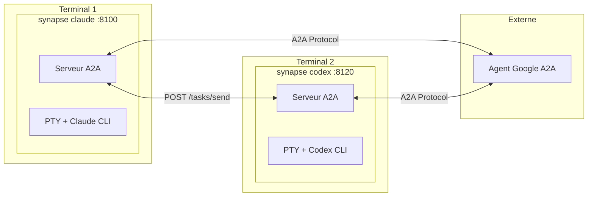
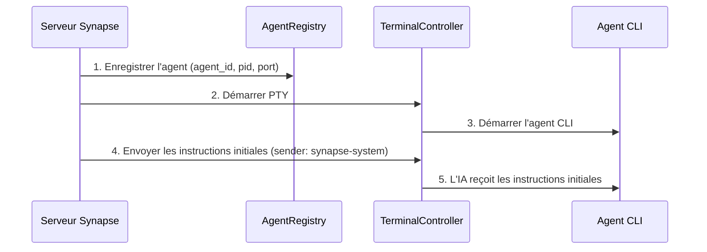
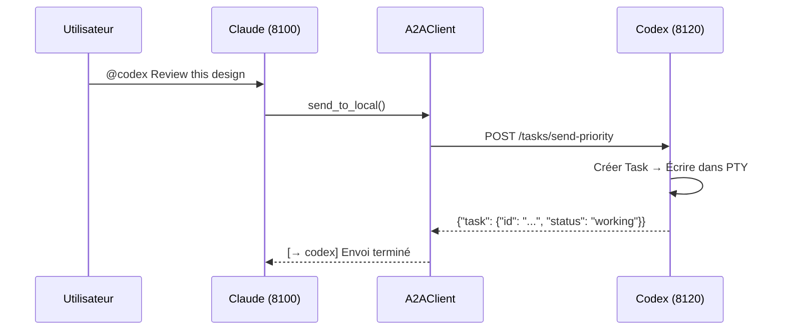
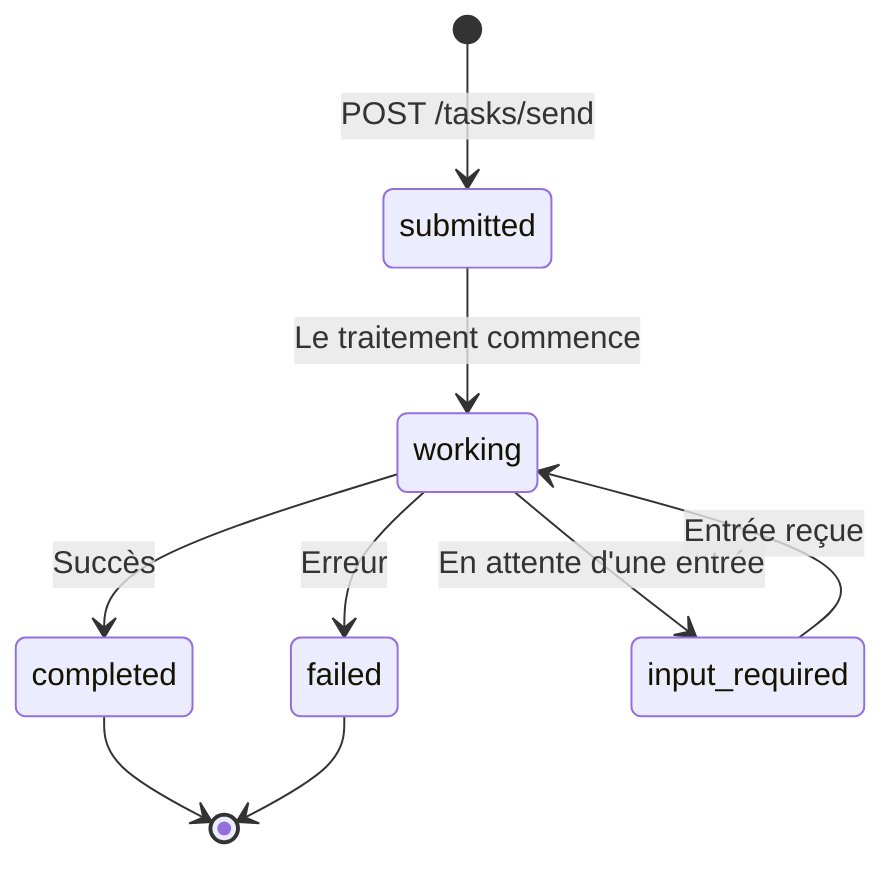
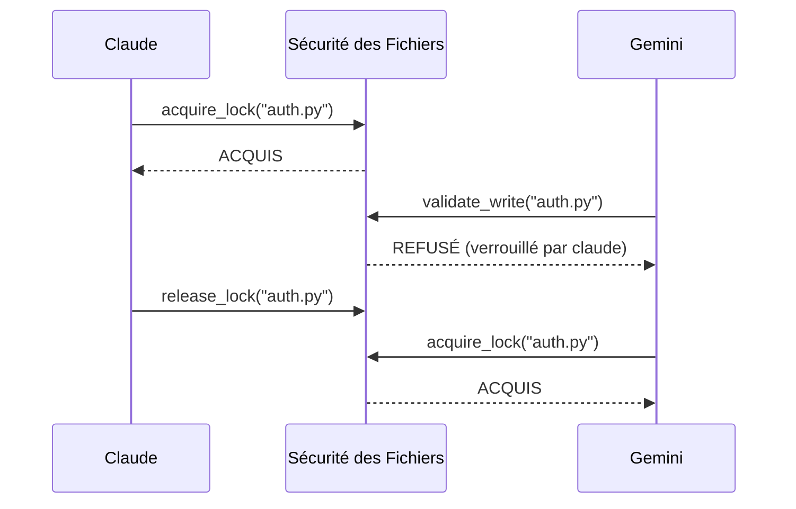

# Synapse A2A

**🌐 Language: [English](README.md) | [日本語](README.ja.md) | [中文](README.zh.md) | [한국어](README.ko.md) | [Español](README.es.md) | Français**

> **Permettre aux agents de collaborer sur des tâches sans modifier leur comportement**

[](https://www.python.org/downloads/)
[](LICENSE)
[](#tests)
[](https://deepwiki.com/s-hiraoku/synapse-a2a)

> Un framework qui permet la collaboration inter-agents via le Google A2A Protocol tout en gardant les agents CLI (Claude Code, Codex, Gemini, OpenCode, GitHub Copilot CLI) **exactement tels quels**

## Objectifs du Projet

```text
┌─────────────────────────────────────────────────────────────────┐
│  ✅ Non-Invasif : Ne pas modifier le comportement des agents    │
│  ✅ Collaboratif : Permettre aux agents de travailler ensemble  │
│  ✅ Transparent : Maintenir les workflows existants             │
└─────────────────────────────────────────────────────────────────┘
```

Synapse A2A **encapsule de manière transparente** les entrées/sorties de chaque agent sans modifier l'agent lui-même. Cela signifie :

- **Tirer parti des forces de chaque agent** : Les utilisateurs peuvent librement assigner des rôles et des spécialisations
- **Aucune courbe d'apprentissage** : Continuez à utiliser vos workflows existants
- **Pérenne** : Résistant aux mises à jour des agents

Voir [Philosophie du Projet](docs/project-philosophy.md) pour plus de détails.



---

## Table des Matières

- [Fonctionnalités](#fonctionnalités)
- [Prérequis](#prérequis)
- [Démarrage Rapide](#démarrage-rapide)
- [Cas d'Utilisation](#cas-dutilisation)
- [Skills](#skills)
- [Documentation](#documentation)
- [Architecture](#architecture)
- [Commandes CLI](#commandes-cli)
- [Points d'Accès API](#points-daccès-api)
- [Structure des Tâches](#structure-des-tâches)
- [Identification de l'Expéditeur](#identification-de-lexpéditeur)
- [Niveaux de Priorité](#niveaux-de-priorité)
- [Agent Card](#agent-card)
- [Registre et Gestion des Ports](#registre-et-gestion-des-ports)
- [Sécurité des Fichiers](#sécurité-des-fichiers)
- [Moniteur d'Agents](#moniteur-dagents)
- [Tests](#tests)
- [Configuration (.synapse)](#configuration-synapse)
- [Développement et Publication](#développement-et-publication)

---

## Fonctionnalités

| Catégorie | Fonctionnalité |
| --------- | -------------- |
| **Compatible A2A** | Toute communication utilise le format Message/Part + Task, découverte via Agent Card |
| **Intégration CLI** | Transformez les outils CLI existants en agents A2A sans modification |
| **synapse send** | Envoyez des messages entre agents via `synapse send <agent> "message"` |
| **Identification de l'Expéditeur** | Identification automatique via `metadata.sender` + correspondance PID |
| **Interruption Prioritaire** | La priorité 5 envoie SIGINT avant le message (arrêt d'urgence) |
| **Multi-Instance** | Exécutez plusieurs agents du même type (attribution automatique des ports) |
| **Intégration Externe** | Communiquez avec d'autres agents Google A2A |
| **Sécurité des Fichiers** | Prévention des conflits multi-agents avec verrouillage de fichiers et suivi des modifications (visible dans `synapse list`) |
| **Nommage d'Agents** | Noms et rôles personnalisés pour une identification facile (`synapse send my-claude "hello"`) |
| **Moniteur d'Agents** | Statut en temps réel (READY/WAITING/PROCESSING/DONE), aperçu de la tâche CURRENT, saut vers le terminal |
| **Historique des Tâches** | Suivi automatique des tâches avec recherche, export et statistiques (activé par défaut) |
| **Tableau de tâches partagé** | Coordination des tâches basée sur SQLite avec suivi des dépendances (`synapse tasks`) |
| **Portes de qualité** | Crochets configurables (`on_idle`, `on_task_completed`) contrôlant les transitions d'état |
| **Approbation de plan** | Flux de travail en mode plan avec `synapse approve/reject` pour revue humaine |
| **Arrêt gracieux** | `synapse kill` envoie une requête d'arrêt avant SIGTERM (délai de 30s) |
| **Mode délégué** | `--delegate-mode` fait d'un agent un coordinateur qui délègue au lieu d'éditer des fichiers |
| **Auto-génération de panneaux** | `synapse team start` — le 1er agent reprend le terminal actuel, les autres dans de nouveaux panneaux |

---

## Prérequis

- **OS** : macOS / Linux (Windows via WSL2 recommandé)
- **Python** : 3.10+
- **Outils CLI** : Pré-installez et configurez les agents que vous souhaitez utiliser :
  - [Claude Code](https://docs.anthropic.com/en/docs/claude-code)
  - [Codex CLI](https://github.com/openai/codex)
  - [Gemini CLI](https://github.com/google-gemini/gemini-cli)
  - [OpenCode](https://github.com/opencode-ai/opencode)
  - [GitHub Copilot CLI](https://docs.github.com/en/copilot/github-copilot-in-the-cli)

---

## Démarrage Rapide

### 1. Installer Synapse A2A

<details>
<summary><b>macOS (Homebrew)</b></summary>

```bash
# Homebrew (recommandé pour macOS)
brew tap s-hiraoku/synapse-a2a
brew install synapse-a2a

# Ou via pipx
pipx install synapse-a2a
```

</details>

<details>
<summary><b>Linux</b></summary>

```bash
# pipx (recommandé)
pipx install synapse-a2a

# Ou pip
pip install synapse-a2a

# Ou exécution directe avec uvx (sans installation)
uvx synapse-a2a claude
```

</details>

<details>
<summary><b>Windows</b></summary>

> **WSL2 est fortement recommandé.** Synapse A2A utilise `pty.spawn()`, qui nécessite un terminal de type Unix.

```bash
# Dans WSL2 - identique à Linux
pipx install synapse-a2a

# Scoop (expérimental, WSL2 reste requis pour pty)
scoop bucket add synapse-a2a https://github.com/s-hiraoku/scoop-synapse-a2a
scoop install synapse-a2a
```

</details>

<details>
<summary><b>Développeur (depuis les sources)</b></summary>

```bash
# Installation avec uv
uv sync

# Ou pip (éditable)
pip install -e .
```

</details>

**Avec support gRPC :**

```bash
pip install "synapse-a2a[grpc]"
```

### 2. Installer les Skills (Recommandé)

**L'installation des skills est fortement recommandée pour tirer le meilleur parti de Synapse A2A.**

Les skills aident Claude à comprendre automatiquement les fonctionnalités de Synapse A2A : messagerie @agent, Sécurité des Fichiers, et plus encore.

```bash
# Installation via skills.sh (https://skills.sh/)
npx skills add s-hiraoku/synapse-a2a
```

Voir [Skills](#skills) pour plus de détails.

### 3. Démarrer les Agents

```bash
# Terminal 1 : Claude
synapse claude

# Terminal 2 : Codex
synapse codex

# Terminal 3 : Gemini
synapse gemini

# Terminal 4 : OpenCode
synapse opencode

# Terminal 5 : GitHub Copilot CLI
synapse copilot
```

> Remarque : Si l'affichage du défilement du terminal est corrompu, essayez :
> ```bash
> uv run synapse gemini
> # ou
> uv run python -m synapse.cli gemini
> ```

Les ports sont attribués automatiquement :

| Agent    | Plage de Ports |
| -------- | -------------- |
| Claude   | 8100-8109      |
| Gemini   | 8110-8119      |
| Codex    | 8120-8129      |
| OpenCode | 8130-8139      |
| Copilot  | 8140-8149      |

### 4. Communication Inter-Agents

Utilisez `synapse send` pour envoyer des messages entre agents :

```bash
synapse send codex "Please review this design" --from synapse-claude-8100
synapse send gemini "Suggest API improvements" --from synapse-claude-8100
```

Pour plusieurs instances du même type, utilisez le format type-port :

```bash
synapse send codex-8120 "Handle this task" --from synapse-claude-8100
synapse send codex-8121 "Handle that task" --from synapse-claude-8100
```

### 5. API HTTP

```bash
# Envoyer un message
curl -X POST http://localhost:8100/tasks/send \
  -H "Content-Type: application/json" \
  -d '{"message": {"role": "user", "parts": [{"type": "text", "text": "Hello!"}]}}'

# Arrêt d'urgence (Priorité 5)
curl -X POST "http://localhost:8100/tasks/send-priority?priority=5" \
  -H "Content-Type: application/json" \
  -d '{"message": {"role": "user", "parts": [{"type": "text", "text": "Stop!"}]}}'
```

---

## Cas d'Utilisation

### 1. Consultation Rapide de Spécifications (Simple)
En codant avec **Claude**, interrogez rapidement **Gemini** (meilleur en recherche web) pour obtenir les dernières spécifications de bibliothèques ou informations d'erreur sans changer de contexte.

```bash
# Dans le terminal de Claude :
synapse send gemini "Summarize the new f-string features in Python 3.12" --from synapse-claude-8100
```

### 2. Revue Croisée de Conceptions (Intermédiaire)
Obtenez des retours sur votre conception de la part d'agents avec différentes perspectives.

```bash
# Après que Claude a rédigé une conception :
synapse send gemini "Critically review this design from scalability and maintainability perspectives" --from synapse-claude-8100
```

### 3. Programmation en Binôme TDD (Intermédiaire)
Séparez le « rédacteur de tests » et l'« implémenteur » pour un code robuste.

```bash
# Terminal 1 (Codex) :
Create unit tests for auth.py - normal case and token expiration case.

# Terminal 2 (Claude) :
synapse send codex-8120 "Implement auth.py to pass the tests you created" --from synapse-claude-8100
```

### 4. Audit de Sécurité (Spécialisé)
Faites auditer votre code par un agent avec un rôle d'expert en sécurité avant de commiter.

```bash
# Donnez un rôle à Gemini :
You are a security engineer. Review only for vulnerabilities (SQLi, XSS, etc.)

# Après avoir écrit le code :
synapse send gemini "Audit the current changes (git diff)" --from synapse-claude-8100
```

### 5. Correction Automatique depuis les Logs d'Erreurs (Avancé)
Transmettez les logs d'erreurs à un agent pour des suggestions de correction automatiques.

```bash
# Les tests ont échoué...
pytest > error.log

# Demander à l'agent de corriger
synapse send claude "Read error.log and fix the issue in synapse/server.py" --from synapse-gemini-8110
```

### 6. Migration de Langage/Framework (Avancé)
Distribuez un travail de refactoring important entre plusieurs agents.

```bash
# Terminal 1 (Claude) :
Read legacy_api.js and create TypeScript type definitions

# Terminal 2 (Codex) :
synapse send claude "Use the type definitions you created to rewrite legacy_api.js to src/new_api.ts" --from synapse-codex-8121
```

### Comparaison avec SSH Remote

| Opération | SSH | Synapse |
|-----------|-----|---------|
| Opération CLI manuelle | ◎ | ◎ |
| Soumission programmatique de tâches | △ nécessite expect etc. | ◎ API HTTP |
| Plusieurs clients simultanés | △ sessions multiples | ◎ point d'accès unique |
| Notifications de progression en temps réel | ✗ | ◎ SSE/Webhook |
| Coordination automatique inter-agents | ✗ | ◎ synapse send |

> **Remarque** : SSH est souvent suffisant pour une utilisation CLI individuelle. Synapse excelle lorsque vous avez besoin d'automatisation, de coordination et de collaboration multi-agents.

---

## Skills

**L'installation des skills est fortement recommandée** lors de l'utilisation de Synapse A2A avec Claude Code.

### Pourquoi Installer les Skills ?

Avec les skills installés, Claude comprend et exécute automatiquement :

- **synapse send** : Communication inter-agents via `synapse send codex "Fix this" --from synapse-claude-8100`
- **Contrôle de priorité** : Envoi de messages avec Priorité 1-5 (5 = arrêt d'urgence)
- **Sécurité des Fichiers** : Prévention des conflits multi-agents avec verrouillage de fichiers et suivi des modifications
- **Gestion de l'historique** : Recherche, export et statistiques pour l'historique des tâches

### Installation

```bash
# Installation via skills.sh (https://skills.sh/)
npx skills add s-hiraoku/synapse-a2a
```

### Skills Incluidos

| Skill | Description |
|-------|-------------|
| **synapse-a2a** | Guide complet pour la communication inter-agents : `synapse send`, priorité, protocole A2A, historique, Sécurité des Fichiers, paramètres |

### Gestion des Skills

Synapse inclut un gestionnaire de skills intégré avec un magasin central (`~/.synapse/skills/`) pour organiser et déployer des skills entre agents.

#### Portées des Skills

| Portée | Emplacement | Description |
|-------|----------|-------------|
| **Synapse** | `~/.synapse/skills/` | Magasin central (déployer vers les agents d'ici) |
| **Utilisateur** | `~/.claude/skills/`, `~/.agents/skills/`, etc. | Skills pour tout l'utilisateur |
| **Projet** | `./.claude/skills/`, `./.agents/skills/`, etc. | Skills locaux au projet |
| **Plugin** | `./plugins/*/skills/` | Skills de plugins en lecture seule |

#### Commandes

```bash
# TUI interactif
synapse skills

# Lister et parcourir
synapse skills list                          # Toutes les portées
synapse skills list --scope synapse          # Uniquement magasin central
synapse skills show <nom>                    # Détails du skill

# Gérer
synapse skills delete <nom> [--force]
synapse skills move <nom> --to <portée>

# Opérations magasin central
synapse skills import <nom>                 # Importer depuis les dossiers agents vers le magasin central
synapse skills deploy <nom> --agent claude,codex --scope user
synapse skills add <repo>                    # Installer depuis un repo (npx skills wrapper)
synapse skills create                        # Créer un nouveau modèle de skill

# Ensembles de skills (groupes nommés)
synapse skills set list
synapse skills set show <nom>
```

### Structure des Répertoires

```text
plugins/
└── synapse-a2a/
    ├── .claude-plugin/plugin.json
    ├── README.md
    └── skills/
        └── synapse-a2a/SKILL.md
```

Voir [plugins/synapse-a2a/README.md](plugins/synapse-a2a/README.md) pour plus de détails.

> **Remarque** : Codex et Gemini ne supportent pas les plugins, mais vous pouvez placer les skills étendus dans le répertoire `.agents/skills/` (Codex/OpenCode) ou `.gemini/skills/` respectivement pour activer ces fonctionnalités.

---

## Documentation

- [guides/README.md](guides/README.md) - Vue d'ensemble de la documentation
- [guides/multi-agent-setup.md](guides/multi-agent-setup.md) - Guide d'installation
- [guides/usage.md](guides/usage.md) - Commandes et modèles d'utilisation
- [guides/settings.md](guides/settings.md) - Détails de configuration `.synapse`
- [guides/troubleshooting.md](guides/troubleshooting.md) - Problèmes courants et solutions

---

## Architecture

### Structure Serveur/Client A2A

Dans Synapse, **chaque agent fonctionne comme un serveur A2A**. Il n'y a pas de serveur central ; c'est une architecture P2P.

```
┌─────────────────────────────────────┐    ┌─────────────────────────────────────┐
│  synapse claude (port 8100)         │    │  synapse codex (port 8120)          │
│  ┌───────────────────────────────┐  │    │  ┌───────────────────────────────┐  │
│  │  FastAPI Server (Serveur A2A) │  │    │  │  FastAPI Server (Serveur A2A) │  │
│  │  /.well-known/agent.json      │  │    │  │  /.well-known/agent.json      │  │
│  │  /tasks/send                  │◄─┼────┼──│  A2AClient                    │  │
│  │  /tasks/{id}                  │  │    │  └───────────────────────────────┘  │
│  └───────────────────────────────┘  │    │  ┌───────────────────────────────┐  │
│  ┌───────────────────────────────┐  │    │  │  PTY + Codex CLI              │  │
│  │  PTY + Claude CLI             │  │    │  └───────────────────────────────┘  │
│  └───────────────────────────────┘  │    └─────────────────────────────────────┘
└─────────────────────────────────────┘
```

Chaque agent est :

- **Serveur A2A** : Accepte les requêtes des autres agents
- **Client A2A** : Envoie des requêtes aux autres agents

### Composants Principaux

| Composant | Fichier | Rôle |
| --------- | ------- | ---- |
| FastAPI Server | `synapse/server.py` | Fournit les points d'accès A2A |
| A2A Router | `synapse/a2a_compat.py` | Implémentation du protocole A2A |
| A2A Client | `synapse/a2a_client.py` | Communication avec les autres agents |
| TerminalController | `synapse/controller.py` | Gestion PTY, détection READY/PROCESSING |
| InputRouter | `synapse/input_router.py` | Détection du pattern @Agent |
| AgentRegistry | `synapse/registry.py` | Enregistrement et recherche d'agents |
| SkillManager | `synapse/skills.py` | Découverte, déploiement, import de skills, ensembles de skills |
| SkillManagerCmd | `synapse/commands/skill_manager.py` | TUI et CLI de gestion de skills |

### Séquence de Démarrage



### Flux de Communication



---

## Commandes CLI

### Opérations de Base

```bash
# Démarrer un agent (premier plan)
synapse claude
synapse codex
synapse gemini
synapse opencode
synapse copilot

# Démarrer avec un nom et rôle personnalisés
synapse claude --name my-claude --role "code reviewer"

# Ignorer la configuration interactive nom/rôle
synapse claude --no-setup

# Spécifier le port
synapse claude --port 8105

# Passer des arguments à l'outil CLI
synapse claude -- --resume
```

### Nommage d'Agents

Assignez des noms et rôles personnalisés aux agents pour une identification et une gestion plus faciles :

```bash
# Configuration interactive (par défaut au démarrage de l'agent)
synapse claude
# → Demande le nom et le rôle

# Ignorer la configuration interactive
synapse claude --no-setup

# Définir le nom et le rôle via les options CLI
synapse claude --name my-claude --role "code reviewer"

# Après le démarrage de l'agent, changer le nom/rôle
synapse rename synapse-claude-8100 --name my-claude --role "test writer"
synapse rename my-claude --role "documentation"  # Changer le rôle uniquement
synapse rename my-claude --clear                 # Effacer le nom et le rôle
```

Une fois nommé, utilisez le nom personnalisé pour toutes les opérations :

```bash
synapse send my-claude "Review this code" --from synapse-codex-8121
synapse jump my-claude
synapse kill my-claude
```

**Nom vs ID :**
- **Affichage/Invites** : Affiche le nom s'il est défini, sinon l'ID (ex. `Kill my-claude (PID: 1234)?`)
- **Traitement interne** : Utilise toujours l'ID de l'agent (`synapse-claude-8100`)
- **Résolution de cible** : Le nom a la priorité la plus élevée lors de la correspondance des cibles

### Liste des Commandes

| Commande | Description |
| -------- | ----------- |
| `synapse <profile>` | Démarrer en premier plan |
| `synapse start <profile>` | Démarrer en arrière-plan |
| `synapse stop <profile\|id>` | Arrêter l'agent (peut spécifier l'ID) |
| `synapse kill <target>` | Arrêt gracieux (envoie une requête d'arrêt, attend 30s, puis SIGTERM) |
| `synapse kill <target> -f` | Arrêt forcé (SIGKILL immédiat) |
| `synapse jump <target>` | Aller au terminal de l'agent |
| `synapse rename <target>` | Assigner un nom/rôle à l'agent |
| `synapse --version` | Afficher la version |
| `synapse list` | Lister les agents en cours d'exécution (Rich TUI avec rafraîchissement automatique et saut vers le terminal) |
| `synapse logs <profile>` | Afficher les logs |
| `synapse send <target> <message>` | Envoyer un message |
| `synapse reply <message>` | Répondre au dernier message A2A reçu |
| `synapse trace <task_id>` | Afficher l'historique des tâches + référence croisée sécurité des fichiers |
| `synapse instructions show` | Afficher le contenu des instructions |
| `synapse instructions files` | Lister les fichiers d'instructions |
| `synapse instructions send` | Renvoyer les instructions initiales |
| `synapse history list` | Afficher l'historique des tâches |
| `synapse history show <task_id>` | Afficher les détails d'une tâche |
| `synapse history search` | Recherche par mot-clé |
| `synapse history cleanup` | Supprimer les anciennes données |
| `synapse history stats` | Afficher les statistiques |
| `synapse history export` | Exporter en JSON/CSV |
| `synapse file-safety status` | Afficher les statistiques de sécurité des fichiers |
| `synapse file-safety locks` | Lister les verrous actifs |
| `synapse file-safety lock` | Verrouiller un fichier |
| `synapse file-safety unlock` | Libérer un verrou |
| `synapse file-safety history` | Historique des modifications de fichiers |
| `synapse file-safety recent` | Modifications récentes |
| `synapse file-safety record` | Enregistrer manuellement une modification |
| `synapse file-safety cleanup` | Supprimer les anciennes données |
| `synapse file-safety debug` | Afficher les informations de débogage |
| `synapse skills` | Gestionnaire de skills (TUI interactif) |
| `synapse skills list` | Lister les skills découverts |
| `synapse skills show <nom>` | Afficher les détails d'un skill |
| `synapse skills delete <nom>` | Supprimer un skill |
| `synapse skills move <nom>` | Déplacer un skill vers une autre portée |
| `synapse skills deploy <nom>` | Déployer un skill du magasin central vers les dossiers agents |
| `synapse skills import <nom>` | Importer un skill dans le magasin central (~/.synapse/skills/) |
| `synapse skills add <repo>` | Installer un skill depuis un dépôt (via npx skills) |
| `synapse skills create` | Créer un nouveau skill |
| `synapse skills set list` | Lister les ensembles de skills |
| `synapse skills set show <nom>` | Afficher les détails d'un ensemble de skills |
| `synapse config` | Gestion des paramètres (TUI interactif) |
| `synapse config show` | Afficher les paramètres actuels |
| `synapse tasks list` | Lister le tableau de tâches partagé |
| `synapse tasks create` | Créer une tâche |
| `synapse tasks assign` | Assigner une tâche à un agent |
| `synapse tasks complete` | Marquer une tâche comme terminée |
| `synapse approve <task_id>` | Approuver un plan |
| `synapse reject <task_id>` | Rejeter un plan avec motif |
| `synapse team start` | Lancer des agents (1er=transfert, les autres=nouveaux panneaux). `--all-new` tous nouveaux |

### Mode Reprise

Lors de la reprise d'une session existante, utilisez ces drapeaux pour **ignorer l'envoi des instructions initiales** (explication du protocole A2A), gardant ainsi votre contexte propre :

```bash
# Reprendre une session Claude Code
synapse claude -- --resume

# Reprendre Gemini avec l'historique
synapse gemini -- --resume=5

# Codex utilise 'resume' comme sous-commande (pas le drapeau --resume)
synapse codex -- resume --last
```

Drapeaux par défaut (personnalisables dans `settings.json`) :
- **Claude** : `--resume`, `--continue`, `-r`, `-c`
- **Gemini** : `--resume`, `-r`
- **Codex** : `resume`
- **OpenCode** : `--continue`, `-c`
- **Copilot** : `--continue`, `--resume`

### Gestion des Instructions

Renvoyez manuellement les instructions initiales lorsqu'elles n'ont pas été envoyées (par ex. après le mode `--resume`) :

```bash
# Afficher le contenu des instructions
synapse instructions show claude

# Lister les fichiers d'instructions
synapse instructions files claude

# Envoyer les instructions initiales à l'agent en cours d'exécution
synapse instructions send claude

# Prévisualiser avant l'envoi
synapse instructions send claude --preview

# Envoyer à un ID d'agent spécifique
synapse instructions send synapse-claude-8100
```

Utile quand :
- Vous avez besoin des informations du protocole A2A après un démarrage avec `--resume`
- L'agent a perdu/oublié ses instructions et nécessite une récupération
- Débogage du contenu des instructions

### Gestion des Agents Externes

```bash
# Enregistrer un agent externe
synapse external add http://other-agent:9000 --alias other

# Lister
synapse external list

# Envoyer un message
synapse external send other "Process this task"
```

### Gestion de l'Historique des Tâches

Recherchez, parcourez et analysez les résultats d'exécution passés des agents.

**Remarque :** L'historique est activé par défaut depuis la v0.3.13. Pour le désactiver :

```bash
# Désactiver via une variable d'environnement
export SYNAPSE_HISTORY_ENABLED=false
synapse claude
```

#### Opérations de Base

```bash
# Afficher les 50 dernières entrées
synapse history list

# Filtrer par agent
synapse history list --agent claude

# Limite personnalisée
synapse history list --limit 100

# Afficher les détails d'une tâche
synapse history show task-id-uuid
```

#### Recherche par Mot-clé

Recherchez dans les champs d'entrée/sortie par mot-clé :

```bash
# Mot-clé unique
synapse history search "Python"

# Mots-clés multiples (logique OU)
synapse history search "Python" "Docker"

# Logique ET (tous les mots-clés doivent correspondre)
synapse history search "Python" "function" --logic AND

# Avec filtre par agent
synapse history search "Python" --agent claude

# Limiter les résultats
synapse history search "error" --limit 20
```

#### Statistiques

```bash
# Statistiques globales (total, taux de réussite, détail par agent)
synapse history stats

# Statistiques d'un agent spécifique
synapse history stats --agent claude
```

#### Export de Données

```bash
# Export JSON (stdout)
synapse history export --format json

# Export CSV
synapse history export --format csv

# Sauvegarder dans un fichier
synapse history export --format json --output history.json
synapse history export --format csv --agent claude > claude_history.csv
```

#### Politique de Rétention

```bash
# Supprimer les données de plus de 30 jours
synapse history cleanup --days 30

# Garder la base de données sous 100 Mo
synapse history cleanup --max-size 100

# Forcer (sans confirmation)
synapse history cleanup --days 30 --force

# Simulation
synapse history cleanup --days 30 --dry-run
```

**Stockage :**

- Base de données SQLite : `~/.synapse/history/history.db`
- Stocké : ID de tâche, nom de l'agent, entrée, sortie, statut, métadonnées
- Indexé automatiquement : agent_name, timestamp, task_id

**Paramètres :**

- **Activé par défaut** (v0.3.13+)
- **Désactiver** : `SYNAPSE_HISTORY_ENABLED=false`

### Commande synapse send (Recommandée)

Utilisez `synapse send` pour la communication inter-agents. Fonctionne dans les environnements sandboxés.

```bash
synapse send <target> "<message>" [--from <sender>] [--priority <1-5>] [--response | --no-response]
```

**Formats de Cible :**

| Format | Exemple | Description |
|--------|---------|-------------|
| Nom personnalisé | `my-claude` | Priorité la plus élevée, à utiliser quand l'agent a un nom |
| Type d'agent | `claude` | Fonctionne uniquement quand une seule instance existe |
| Type-port | `claude-8100` | À utiliser quand plusieurs instances du même type existent |
| ID complet | `synapse-claude-8100` | ID complet de l'agent |

Lorsque plusieurs agents du même type sont en cours d'exécution, le type seul (ex. `claude`) produira une erreur. Utilisez `claude-8100` ou `synapse-claude-8100`.

**Options :**

| Option | Court | Description |
|--------|-------|-------------|
| `--from` | `-f` | ID de l'agent expéditeur (pour identification de la réponse) |
| `--priority` | `-p` | Priorité 1-4 : normal, 5 : arrêt d'urgence (envoie SIGINT) |
| `--response` | - | Aller-retour - l'expéditeur attend, le destinataire répond avec `synapse reply` |
| `--no-response` | - | Unidirectionnel - envoyer et oublier, pas de réponse nécessaire |

**Exemples :**

```bash
# Envoyer un message (instance unique)
synapse send claude "Hello" --priority 1 --from synapse-codex-8121

# Support pour les messages longs (passage automatique en fichier temporaire)
synapse send claude --message-file /path/to/message.txt --no-response
echo "contenu très long..." | synapse send claude --stdin --no-response

# Pièces jointes
synapse send claude "Review this" --attach src/main.py --no-response

# Envoyer à une instance spécifique (plusieurs du même type)
synapse send claude-8100 "Hello" --from synapse-claude-8101

# Arrêt d'urgence
synapse send claude "Stop!" --priority 5 --from synapse-codex-8121

# Attendre une réponse (aller-retour)
synapse send gemini "Analyze this" --response --from synapse-claude-8100
```

**Comportement par défaut :** Avec `a2a.flow=auto` (par défaut), `synapse send` attend une réponse sauf si `--no-response` est spécifié.

**Important :** Utilisez toujours `--from` avec votre ID d'agent (format : `synapse-<type>-<port>`).

### Commande synapse reply

Répondre au dernier message reçu :

```bash
synapse reply "<message>"
```

Le drapeau `--from` n'est nécessaire que dans les environnements sandboxés (comme Codex). Sans `--from`, Synapse détecte automatiquement l'expéditeur.

### Outil A2A Bas Niveau

Pour les opérations avancées :

```bash
# Lister les agents
python -m synapse.tools.a2a list

# Envoyer un message
python -m synapse.tools.a2a send --target claude --priority 1 "Hello"

# Répondre au dernier message reçu (utilise le suivi des réponses)
python -m synapse.tools.a2a reply "Here is my response"
```

---

## Points d'Accès API

### Compatible A2A

| Point d'Accès | Méthode | Description |
| ------------- | ------- | ----------- |
| `/.well-known/agent.json` | GET | Agent Card |
| `/tasks/send` | POST | Envoyer un message |
| `/tasks/send-priority` | POST | Envoyer avec priorité |
| `/tasks/create` | POST | Créer une tâche (pas d'envoi PTY, pour `--response`) |
| `/tasks/{id}` | GET | Obtenir le statut de la tâche |
| `/tasks` | GET | Lister les tâches |
| `/tasks/{id}/cancel` | POST | Annuler une tâche |
| `/status` | GET | Statut READY/PROCESSING |

### Équipes d'agents

| Point d'Accès | Méthode | Description |
| -------- | ------ | ----------- |
| `/tasks/board` | GET | Lister le tableau de tâches partagé |
| `/tasks/board` | POST | Créer une tâche sur le tableau |
| `/tasks/board/{id}/claim` | POST | Réclamer une tâche de manière atomique |
| `/tasks/board/{id}/complete` | POST | Terminer une tâche |
| `/tasks/{id}/approve` | POST | Approuver un plan |
| `/tasks/{id}/reject` | POST | Rejeter un plan avec motif |
| `/team/start` | POST | Démarrer plusieurs agents dans des panneaux de terminal (initié par A2A) |

### Extensions Synapse

| Point d'Accès | Méthode | Description |
| ------------- | ------- | ----------- |
| `/reply-stack/get` | GET | Obtenir les infos de l'expéditeur sans les supprimer (pour consultation avant envoi) |
| `/reply-stack/pop` | GET | Extraire les infos de l'expéditeur de la carte de réponse (pour `synapse reply`) |
| `/tasks/{id}/subscribe` | GET | S'abonner aux mises à jour des tâches via SSE |

### Webhooks

| Point d'Accès | Méthode | Description |
| -------- | ------ | ----------- |
| `/webhooks` | POST | Enregistrer un webhook pour les notifications de tâches |
| `/webhooks` | GET | Lister les webhooks enregistrés |
| `/webhooks` | DELETE | Supprimer un webhook |
| `/webhooks/deliveries` | GET | Tentatives récentes de livraison de webhooks |

### Agents Externes

| Point d'Accès | Méthode | Description |
| ------------- | ------- | ----------- |
| `/external/discover` | POST | Enregistrer un agent externe |
| `/external/agents` | GET | Lister |
| `/external/agents/{alias}` | DELETE | Supprimer |
| `/external/agents/{alias}/send` | POST | Envoyer |

---

## Structure des Tâches

Dans le protocole A2A, toute communication est gérée sous forme de **Tasks** (Tâches).

### Cycle de Vie des Tâches



### Objet Task

```json
{
  "id": "550e8400-e29b-41d4-a716-446655440000",
  "context_id": "conversation-123",
  "status": "working",
  "message": {
    "role": "user",
    "parts": [{ "type": "text", "text": "Review this design" }]
  },
  "artifacts": [],
  "metadata": {
    "sender": {
      "sender_id": "synapse-claude-8100",
      "sender_type": "claude",
      "sender_endpoint": "http://localhost:8100"
    }
  },
  "created_at": "2024-01-15T10:30:00Z",
  "updated_at": "2024-01-15T10:30:05Z"
}
```

### Description des Champs

| Champ | Type | Description |
| ----- | ---- | ----------- |
| `id` | string | Identifiant unique de la tâche (UUID) |
| `context_id` | string? | ID du contexte de conversation (pour multi-tour) |
| `status` | string | `submitted` / `working` / `completed` / `failed` / `input_required` |
| `message` | Message | Message envoyé |
| `artifacts` | Artifact[] | Artefacts de sortie de la tâche |
| `metadata` | object | Infos de l'expéditeur (`metadata.sender`) |
| `created_at` | string | Horodatage de création (ISO 8601) |
| `updated_at` | string | Horodatage de mise à jour (ISO 8601) |

### Structure du Message

```json
{
  "role": "user",
  "parts": [
    { "type": "text", "text": "Message content" },
    {
      "type": "file",
      "file": {
        "name": "doc.pdf",
        "mimeType": "application/pdf",
        "bytes": "..."
      }
    }
  ]
}
```

| Type de Part | Description |
| ------------ | ----------- |
| `text` | Message texte |
| `file` | Pièce jointe |
| `data` | Données structurées |

---

## Identification de l'Expéditeur

L'expéditeur des messages A2A peut être identifié via `metadata.sender`.

### Format de Sortie PTY

Les messages sont envoyés au PTY de l'agent avec un simple préfixe `A2A:` :

```
A2A: <contenu du message>
```

### Gestion des Réponses

Synapse gère automatiquement le routage des réponses. Les agents utilisent simplement `synapse reply` :

```bash
synapse reply "Here is my response"
```

Le framework suit internement les informations de l'expéditeur et route automatiquement les réponses.

### Vérification de l'API Task (Développement)

```bash
curl -s http://localhost:8120/tasks/<id> | jq '.metadata.sender'
```

Réponse :

```json
{
  "sender_id": "synapse-claude-8100",
  "sender_type": "claude",
  "sender_endpoint": "http://localhost:8100"
}
```

### Fonctionnement

1. **À l'envoi** : Consulter le Registry, identifier son propre agent_id via la correspondance PID
2. **À la création de Task** : Attacher les infos de l'expéditeur à `metadata.sender`
3. **À la réception** : Vérifier via le préfixe PTY ou l'API Task

---

## Niveaux de Priorité

| Priorité | Comportement | Cas d'Utilisation |
| -------- | ------------ | ----------------- |
| 1-4 | Écriture stdin normale | Messages réguliers |
| 5 | SIGINT puis écriture | Arrêt d'urgence |

```bash
# Arrêt d'urgence
synapse send claude "Stop!" --priority 5
```

---

## Agent Card

Chaque agent publie une Agent Card à `/.well-known/agent.json`.

```bash
curl http://localhost:8100/.well-known/agent.json
```

```json
{
  "name": "Synapse Claude",
  "description": "PTY-wrapped claude CLI agent with A2A communication",
  "url": "http://localhost:8100",
  "capabilities": {
    "streaming": false,
    "pushNotifications": false,
    "multiTurn": true
  },
  "skills": [
    {
      "id": "chat",
      "name": "Chat",
      "description": "Send messages to the CLI agent"
    },
    {
      "id": "interrupt",
      "name": "Interrupt",
      "description": "Interrupt current processing"
    }
  ],
  "extensions": {
    "synapse": {
      "agent_id": "synapse-claude-8100",
      "pty_wrapped": true,
      "priority_interrupt": true,
      "at_agent_syntax": true
    }
  }
}
```

### Philosophie de Conception

L'Agent Card est une « carte de visite » contenant uniquement les informations externes :

- capabilities, skills, endpoint, etc.
- Les instructions internes ne sont pas incluses (envoyées via A2A Task au démarrage)

---

## Registre et Gestion des Ports

### Fichiers du Registre

```
~/.a2a/registry/
├── synapse-claude-8100.json
├── synapse-claude-8101.json
└── synapse-gemini-8110.json
```

### Nettoyage Automatique

Les entrées obsolètes sont automatiquement supprimées lors de :

- L'exécution de `synapse list`
- L'envoi de messages (quand la cible est inactive)

### Plages de Ports

```python
PORT_RANGES = {
    "claude": (8100, 8109),
    "gemini": (8110, 8119),
    "codex": (8120, 8129),
    "opencode": (8130, 8139),
    "copilot": (8140, 8149),
    "dummy": (8190, 8199),
}
```

### Utilisation Mémoire Typique (Agents Résidents)

Sur macOS, les agents résidents inactifs sont légers. En date de janvier 2026,
le RSS est d'environ ~12 Mo par processus d'agent dans une configuration de développement typique.

L'utilisation réelle varie selon le profil, les plugins, les paramètres d'historique et la charge de travail.
Notez que `ps` rapporte le RSS en Ko (donc ~12 Mo correspond à ~12 000 Ko).
Pour mesurer sur votre machine :

```bash
ps -o pid,comm,rss,vsz,etime,command -A | rg "synapse"
```

Si vous n'avez pas ripgrep :

```bash
ps -o pid,comm,rss,vsz,etime,command -A | grep "synapse"
```

---

## Sécurité des Fichiers

Prévient les conflits lorsque plusieurs agents modifient les mêmes fichiers simultanément.



### Fonctionnalités

| Fonctionnalité | Description |
|----------------|-------------|
| **Verrouillage de Fichiers** | Le contrôle exclusif empêche l'édition simultanée |
| **Suivi des Modifications** | Enregistre qui a modifié quoi et quand |
| **Injection de Contexte** | Fournit l'historique récent des modifications lors de la lecture |
| **Validation Pré-écriture** | Vérifie le statut du verrou avant l'écriture |
| **Intégration avec List** | Les verrous actifs sont visibles dans la colonne EDITING_FILE de `synapse list` |

### Activer

```bash
# Activer via une variable d'environnement
export SYNAPSE_FILE_SAFETY_ENABLED=true
synapse claude
```

### Commandes de Base

```bash
# Afficher les statistiques
synapse file-safety status

# Lister les verrous actifs
synapse file-safety locks

# Acquérir un verrou
synapse file-safety lock /path/to/file.py claude --intent "Refactoring"

# Attendre la libération du verrou
synapse file-safety lock /path/to/file.py claude --wait --wait-timeout 60 --wait-interval 2

# Libérer un verrou
synapse file-safety unlock /path/to/file.py claude

# Historique des modifications de fichiers
synapse file-safety history /path/to/file.py

# Modifications récentes
synapse file-safety recent

# Supprimer les anciennes données
synapse file-safety cleanup --days 30
```

### API Python

```python
from synapse.file_safety import FileSafetyManager, ChangeType, LockStatus

manager = FileSafetyManager.from_env()

# Acquérir un verrou
result = manager.acquire_lock("/path/to/file.py", "claude", intent="Refactoring")
if result["status"] == LockStatus.ACQUIRED:
    # Éditer le fichier...

    # Enregistrer la modification
    manager.record_modification(
        file_path="/path/to/file.py",
        agent_name="claude",
        task_id="task-123",
        change_type=ChangeType.MODIFY,
        intent="Fix authentication bug"
    )

    # Libérer le verrou
    manager.release_lock("/path/to/file.py", "claude")

# Validation pré-écriture
validation = manager.validate_write("/path/to/file.py", "gemini")
if not validation["allowed"]:
    print(f"Écriture bloquée : {validation['reason']}")
```

**Stockage** : Par défaut `.synapse/file_safety.db` (SQLite, relatif au répertoire de travail). Modifiable via `SYNAPSE_FILE_SAFETY_DB_PATH` (ex. `~/.synapse/file_safety.db` pour un usage global).

Voir [docs/file-safety.md](docs/file-safety.md) pour plus de détails.

---

## Moniteur d'Agents

Surveillance en temps réel du statut des agents avec capacité de saut vers le terminal.

### Mode Rich TUI

```bash
# Démarrer le Rich TUI avec rafraîchissement automatique (par défaut)
synapse list
```

L'affichage se met à jour automatiquement lorsque le statut des agents change (via file watcher) avec un intervalle de sondage de secours de 10 secondes.

### Colonnes d'Affichage

| Columna | Description |
|---------|-------------|
| ID | ID de l'agent (ex. `synapse-claude-8100`) |
| NAME | Nom personnalisé (s'il est assigné) |
| TYPE | Type d'agent (claude, gemini, codex, etc.) |
| ROLE | Description du rôle de l'agent (s'il est assigné) |
| STATUS | Statut actuel (READY, WAITING, PROCESSING, DONE) |
| CURRENT | Aperçu de la tâche en cours |
| TRANSPORT | Indicateur de transport de communication |
| WORKING_DIR | Répertoire de travail actuel |
| EDITING_FILE | Fichier en cours d'édition (uniquement avec File Safety activé) |

**Personnaliser les colonnes** dans `settings.json` :

```json
{
  "list": {
    "columns": ["ID", "NAME", "STATUS", "CURRENT", "TRANSPORT", "WORKING_DIR"]
  }
}
```

### États de Statut

| Statut | Couleur | Signification |
|--------|---------|---------------|
| **READY** | Vert | L'agent est inactif, en attente d'une entrée |
| **WAITING** | Cyan | L'agent affiche une interface de sélection, en attente du choix de l'utilisateur |
| **PROCESSING** | Jaune | L'agent travaille activement |
| **DONE** | Bleu | Tâche terminée (transition automatique vers READY après 10s) |

### Contrôles Interactifs

| Touche | Action |
|--------|--------|
| 1-9 | Sélectionner la ligne de l'agent (directement) |
| ↑/↓ | Naviguer entre les lignes d'agents |
| **Entrée** ou **j** | Aller au terminal de l'agent sélectionné |
| **k** | Tuer l'agent sélectionné (avec confirmation) |
| **/** | Filtrer par TYPE, NAME ou WORKING_DIR |
| ESC | Effacer le filtre/la sélection |
| q | Quitter |

**Terminaux Supportés** : iTerm2, Terminal.app, Ghostty, VS Code, tmux, Zellij

### Détection WAITING

> **Remarque** : La détection WAITING est actuellement désactivée en raison de faux positifs au démarrage. Voir [#140](https://github.com/s-hiraoku/synapse-a2a/issues/140) pour plus de détails.

Lorsqu'elle est activée, elle détecte les agents en attente d'une entrée utilisateur (interface de sélection, invites Y/n) à l'aide de patterns regex :

- **Gemini** : Interface de sélection `● 1. Option`, invites `Allow execution`
- **Claude** : Curseur `❯ Option`, cases à cocher `☐/☑`, invites `[Y/n]`
- **Codex** : Listes numérotées indentées
- **OpenCode** : Choix numérotés, indicateurs de sélection, invites `[y/N]`
- **Copilot** : Choix numérotés, indicateurs de sélection, invites `[y/N]` ou `(y/n)`

---

## Tests

Une suite de tests complète vérifie la conformité au protocole A2A :

```bash
# Tous les tests
pytest

# Catégorie spécifique
pytest tests/test_a2a_compat.py -v
pytest tests/test_sender_identification.py -v
```

---

## Configuration (.synapse)

Personnalisez les variables d'environnement et les instructions initiales via `.synapse/settings.json`.

### Portées

| Portée | Chemin | Priorité |
|--------|--------|----------|
| Utilisateur | `~/.synapse/settings.json` | Basse |
| Projet | `./.synapse/settings.json` | Moyenne |
| Local | `./.synapse/settings.local.json` | Haute (gitignore recommandé) |

Les paramètres de priorité plus élevée remplacent ceux de priorité inférieure.

### Configuration

```bash
# Créer le répertoire .synapse/ (copie tous les fichiers modèles)
synapse init

# ? Où voulez-vous créer .synapse/ ?
#   ❯ Portée utilisateur (~/.synapse/)
#     Portée projet (./.synapse/)
#
# ✔ Créé ~/.synapse

# Réinitialiser aux valeurs par défaut
synapse reset

# Éditer les paramètres interactivement (TUI)
synapse config

# Afficher les paramètres actuels (lecture seule)
synapse config show
synapse config show --scope user
```

`synapse init` copie ces fichiers dans `.synapse/` :

| Fichier | Description |
|---------|-------------|
| `settings.json` | Variables d'environnement et paramètres d'instructions initiales |
| `default.md` | Instructions initiales communes à tous les agents |
| `gemini.md` | Instructions initiales spécifiques à Gemini |
| `file-safety.md` | Instructions pour la Sécurité des Fichiers |

### Structure de settings.json

```json
{
  "env": {
    "SYNAPSE_HISTORY_ENABLED": "true",
    "SYNAPSE_FILE_SAFETY_ENABLED": "true",
    "SYNAPSE_FILE_SAFETY_DB_PATH": ".synapse/file_safety.db"
  },
  "instructions": {
    "default": "[SYNAPSE INSTRUCTIONS...]\n...",
    "claude": "",
    "gemini": "",
    "codex": ""
  },
  "approvalMode": "required",
  "a2a": {
    "flow": "auto"
  }
}
```

### Variables d'Environnement (env)

| Variable | Description | Défaut |
|----------|-------------|--------|
| `SYNAPSE_HISTORY_ENABLED` | Activer l'historique des tâches | `true` |
| `SYNAPSE_FILE_SAFETY_ENABLED` | Activer la sécurité des fichiers | `true` |
| `SYNAPSE_FILE_SAFETY_DB_PATH` | Chemin de la base de données de sécurité des fichiers | `.synapse/file_safety.db` |
| `SYNAPSE_FILE_SAFETY_RETENTION_DAYS` | Jours de rétention de l'historique des verrous | `30` |
| `SYNAPSE_AUTH_ENABLED` | Activer l'authentification API | `false` |
| `SYNAPSE_API_KEYS` | Clés API (séparées par des virgules) | - |
| `SYNAPSE_ADMIN_KEY` | Clé administrateur | - |
| `SYNAPSE_ALLOW_LOCALHOST` | Ignorer l'authentification pour localhost | `true` |
| `SYNAPSE_USE_HTTPS` | Utiliser HTTPS | `false` |
| `SYNAPSE_WEBHOOK_SECRET` | Secret du webhook | - |
| `SYNAPSE_WEBHOOK_TIMEOUT` | Délai d'attente du webhook (sec) | `10` |
| `SYNAPSE_WEBHOOK_MAX_RETRIES` | Nombre de tentatives du webhook | `3` |
| `SYNAPSE_SKILLS_DIR` | Dossier central des skills | `~/.synapse/skills` |
| `SYNAPSE_LONG_MESSAGE_THRESHOLD` | Seuil de caractères pour le stockage en fichier | `200` |
| `SYNAPSE_LONG_MESSAGE_TTL` | TTL pour les fichiers de messages (secondes) | `3600` |
| `SYNAPSE_LONG_MESSAGE_DIR` | Répertoire pour les fichiers de messages | Temporaire système |
| `SYNAPSE_SEND_MESSAGE_THRESHOLD` | Seuil de repli automatique sur fichier temporaire (octets) | `102400` |

### Paramètres de Communication A2A (a2a)

| Paramètre | Valeur | Description |
|-----------|--------|-------------|
| `flow` | `roundtrip` | Toujours attendre le résultat |
| `flow` | `oneway` | Toujours transmettre uniquement (ne pas attendre) |
| `flow` | `auto` | Contrôlé par drapeau ; si omis, attend par défaut |

### Mode d'Approbation (approvalMode)

Contrôle l'affichage d'une invite de confirmation avant l'envoi des instructions initiales.

| Paramètre | Description |
|-----------|-------------|
| `required` | Afficher l'invite d'approbation au démarrage (par défaut) |
| `auto` | Envoyer les instructions automatiquement sans demander |

Lorsqu'il est défini sur `required`, vous verrez une invite comme :

```
[Synapse] Agent: synapse-claude-8100 | Port: 8100
[Synapse] Initial instructions will be sent to configure A2A communication.

Proceed? [Y/n/s(skip)]:
```

Options :
- **Y** (ou Entrée) : Envoyer les instructions initiales et démarrer l'agent
- **n** : Annuler le démarrage
- **s** : Démarrer l'agent sans envoyer les instructions initiales

### Instructions Initiales (instructions)

Personnalisez les instructions envoyées au démarrage de l'agent :

```json
{
  "instructions": {
    "default": "Instructions communes pour tous les agents",
    "claude": "Instructions spécifiques à Claude (prioritaires sur default)",
    "gemini": "Instructions spécifiques à Gemini",
    "codex": "Instructions spécifiques à Codex"
  }
}
```

**Priorité** :
1. Paramètre spécifique à l'agent (`claude`, `gemini`, `codex`, `opencode`, `copilot`) s'il est présent
2. Sinon utiliser `default`
3. Si les deux sont vides, aucune instruction initiale n'est envoyée

**Espaces réservés** :
- `{{agent_id}}` - ID de l'agent (ex. `synapse-claude-8100`)
- `{{port}}` - Numéro de port (ex. `8100`)

Voir [guides/settings.md](guides/settings.md) pour plus de détails.

---

## Développement et Publication

### Publication sur PyPI

Pousser un tag publie automatiquement sur PyPI via GitHub Actions.

```bash
# 1. Mettre à jour la version dans pyproject.toml
# version = "0.2.0"

# 2. Créer et pousser le tag
git tag v0.2.0
git push origin v0.2.0
```

### Publication Manuelle

```bash
# Compiler et publier avec uv
uv build
uv publish
```

### Installation Utilisateur

**macOS :**
```bash
brew tap s-hiraoku/synapse-a2a && brew install synapse-a2a

# Mise à jour
brew upgrade synapse-a2a
```

**Linux / WSL2 :**
```bash
pipx install synapse-a2a

# Mise à jour
pipx upgrade synapse-a2a
```

**Windows (Scoop, expérimental) :**
```bash
scoop bucket add synapse-a2a https://github.com/s-hiraoku/scoop-synapse-a2a
scoop install synapse-a2a

# Mise à jour
scoop update synapse-a2a
```

**Désinstallation :**
```bash
brew uninstall synapse-a2a   # macOS
pipx uninstall synapse-a2a   # Linux
scoop uninstall synapse-a2a  # Windows
```

---

## Limitations Connues

- **Rendu TUI** : L'affichage peut être corrompu avec les CLI basés sur Ink
- **Limitations PTY** : Certaines séquences d'entrée spéciales ne sont pas supportées
- **Sandbox Codex** : Le sandbox de Codex CLI bloque l'accès réseau, nécessitant une configuration pour la communication inter-agents (voir ci-dessous)

### Communication Inter-Agents dans Codex CLI

Codex CLI s'exécute dans un sandbox par défaut avec un accès réseau restreint. Pour utiliser le pattern `@agent` pour la communication inter-agents, autorisez l'accès réseau dans `~/.codex/config.toml`.

**Paramètre Global (s'applique à tous les projets) :**

```toml
# ~/.codex/config.toml

sandbox_mode = "workspace-write"

[sandbox_workspace_write]
network_access = true
```

**Paramètre Par Projet :**

```toml
# ~/.codex/config.toml

[projects."/path/to/your/project"]
sandbox_mode = "workspace-write"

[projects."/path/to/your/project".sandbox_workspace_write]
network_access = true
```

Voir [guides/troubleshooting.md](guides/troubleshooting.md#codex-sandbox-network-error) pour plus de détails.

---

## Fonctionnalités Entreprise

Fonctionnalités de sécurité, notification et communication haute performance pour les environnements de production.

### Authentification par Clé API

```bash
# Démarrer avec l'authentification activée
export SYNAPSE_AUTH_ENABLED=true
export SYNAPSE_API_KEYS=<YOUR_API_KEY>
synapse claude

# Requête avec Clé API
curl -H "X-API-Key: <YOUR_API_KEY>" http://localhost:8100/tasks
```

### Notifications Webhook

Envoyez des notifications à des URL externes lorsque des tâches se terminent.

```bash
# Enregistrer un webhook
curl -X POST http://localhost:8100/webhooks \
  -H "Content-Type: application/json" \
  -d '{"url": "https://your-server.com/hook", "events": ["task.completed"]}'
```

| Événement | Description |
|-----------|-------------|
| `task.completed` | Tâche terminée avec succès |
| `task.failed` | Tâche échouée |
| `task.canceled` | Tâche annulée |

### Streaming SSE

Recevez la sortie des tâches en temps réel.

```bash
curl -N http://localhost:8100/tasks/{task_id}/subscribe
```

Types d'événements :

| Événement | Description |
|-----------|-------------|
| `output` | Nouvelle sortie CLI |
| `status` | Changement de statut |
| `done` | Tâche terminée (inclut l'Artifact) |

### Analyse de la Sortie

Analyse automatique de la sortie CLI pour la détection d'erreurs, les mises à jour de statut et la génération d'Artifacts.

| Fonctionnalité | Description |
|----------------|-------------|
| Détection d'Erreurs | Détecte `command not found`, `permission denied`, etc. |
| input_required | Détecte les invites de question/confirmation |
| Output Parser | Structure le code/fichiers/erreurs |

### Support gRPC

Utilisez gRPC pour une communication haute performance.

```bash
# Installer les dépendances gRPC
pip install synapse-a2a[grpc]

# gRPC s'exécute sur le port REST + 1
# REST : 8100 → gRPC : 8101
```

Voir [guides/enterprise.md](guides/enterprise.md) para plus de détails.

---

## Documentation

| Chemin | Contenu |
| ------ | ------- |
| [guides/usage.md](guides/usage.md) | Utilisation détaillée |
| [guides/architecture.md](guides/architecture.md) | Détails de l'architecture |
| [guides/enterprise.md](guides/enterprise.md) | Fonctionnalités entreprise |
| [guides/troubleshooting.md](guides/troubleshooting.md) | Dépannage |
| [docs/file-safety.md](docs/file-safety.md) | Prévention des conflits de fichiers |
| [docs/project-philosophy.md](docs/project-philosophy.md) | Philosophie de conception |

---

## Licence

MIT License

---

## Liens Associés

- [Claude Code](https://claude.ai/code) - Agent CLI d'Anthropic
- [OpenCode](https://opencode.ai/) - Agent de codage IA open-source
- [GitHub Copilot CLI](https://docs.github.com/en/copilot/github-copilot-in-the-cli) - Assistant de codage IA de GitHub
- [Google A2A Protocol](https://github.com/google/A2A) - Protocole Agent-to-Agent
