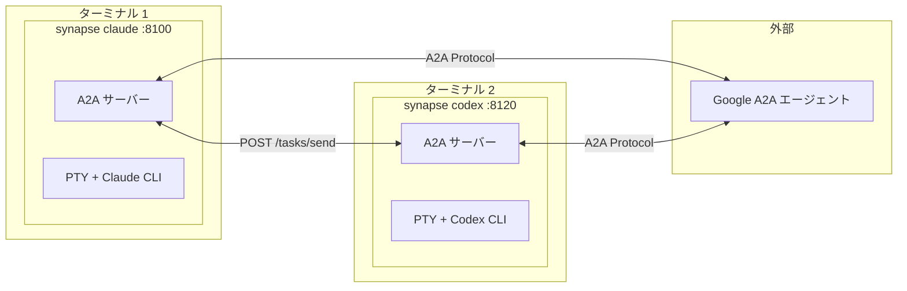
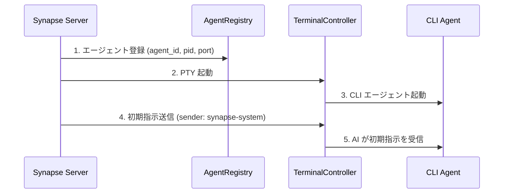
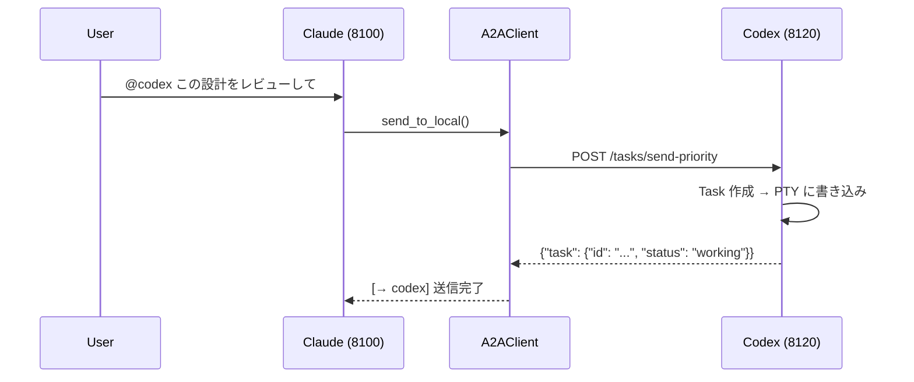
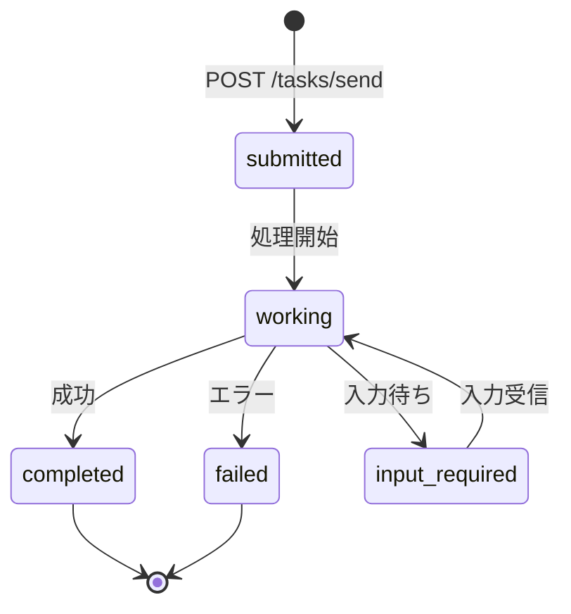
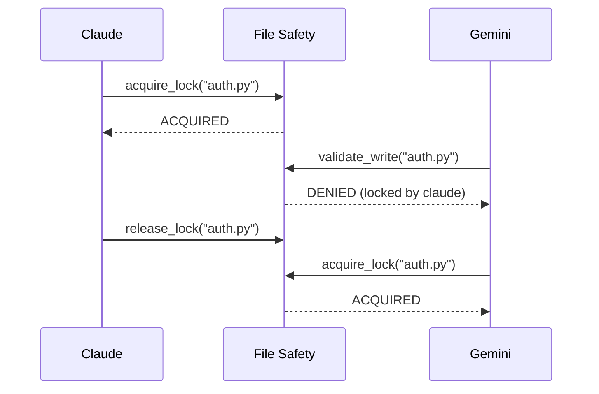

# Synapse A2A

**🌐 Language: [English](README.md) | 日本語 | [中文](README.zh.md) | [한국어](README.ko.md) | [Español](README.es.md) | [Français](README.fr.md)**

> **各エージェントの挙動を変えることなく、エージェント同士を協力させてタスクを実行する**

[](https://www.python.org/downloads/)
[](LICENSE)
[](#テスト)
[](https://deepwiki.com/s-hiraoku/synapse-a2a)

> CLI エージェント（Claude Code, Codex, Gemini, OpenCode, GitHub Copilot CLI）を**そのまま**に、Google A2A Protocol 経由でエージェント間連携を実現するフレームワーク

## プロジェクトの目標

```text
┌─────────────────────────────────────────────────────────────────┐
│  ✅ Non-Invasive: エージェントの挙動を変えない                   │
│  ✅ Collaborative: エージェント同士を協力させる                  │
│  ✅ Transparent: 既存のワークフローを維持する                    │
└─────────────────────────────────────────────────────────────────┘
```

Synapse A2A は各エージェントの入出力を**透過的にラップ**し、エージェント自体は変更しません。これにより：

- **各エージェントの得意を活かす**: ユーザが自由に役割・専門性を割り当て可能
- **学習コストゼロ**: 既存のワークフローをそのまま継続
- **将来にわたって安定**: エージェントのアップデートに強い

詳しくは[プロジェクト哲学](docs/project-philosophy.md)を参照。



---

## 目次

- [特徴](#特徴)
- [前提条件](#前提条件)
- [クイックスタート](#クイックスタート)
- [ユースケース](#ユースケース)
- [スキル](#スキル)
- [ドキュメント](#ドキュメント)
- [アーキテクチャ](#アーキテクチャ)
- [CLI コマンド](#cli-コマンド)
- [API エンドポイント](#api-エンドポイント)
- [Task 構造](#task-構造)
- [送信者識別](#送信者識別)
- [優先度レベル](#優先度レベル)
- [Agent Card](#agent-card)
- [Registry とポート管理](#registry-とポート管理)
- [File Safety](#file-safety)
- [エージェントモニター](#エージェントモニター)
- [テスト](#テスト)
- [設定 (.synapse)](#設定-synapse)
- [開発 & リリース](#開発--リリース)

---

## 特徴

| カテゴリ | 機能 |
| -------- | ---- |
| **A2A 準拠** | すべての通信は Message/Part + Task 形式、Agent Card ディスカバリ |
| **CLI 統合** | 既存の CLI ツールをそのまま A2A エージェント化 |
| **synapse send** | `synapse send <agent> "message"` でエージェント間通信 |
| **送信者識別** | `metadata.sender` + PID マッチングで送信者を自動識別 |
| **優先度割り込み** | Priority 5 でメッセージ前に SIGINT（緊急停止） |
| **マルチインスタンス** | 同じタイプのエージェントを複数起動（自動ポート割り当て） |
| **外部連携** | 他の Google A2A エージェントと通信 |
| **File Safety** | ファイルロックと変更追跡でマルチエージェント競合を防止（`synapse list` で表示可能） |
| **エージェント命名** | カスタム名とロールで識別しやすく（`synapse send my-claude "hello"`） |
| **エージェントモニター** | リアルタイムステータス（READY/WAITING/PROCESSING/DONE）、CURRENT タスクプレビュー、ターミナルジャンプ |
| **タスク履歴** | 検索・エクスポート・統計機能付きの自動タスク追跡（デフォルトで有効） |
| **共有タスクボード** | 依存関係追跡機能付きの SQLite ベースのタスク調整 (`synapse tasks`) |
| **クオリティゲート** | ステータス遷移を制御する構成可能なフック (`on_idle`, `on_task_completed`) |
| **プラン承認** | ヒューマン・イン・ザ・ループのレビューのためのプランモードワークフロー (`synapse approve/reject`) |
| **グレースフルシャットダウン** | `synapse kill` は SIGTERM の前に終了リクエストを送信 (30秒タイムアウト) |
| **委譲モード** | `--delegate-mode` は、ファイルを編集する代わりに委譲を行うコーディネーターにする |
| **ペイン自動生成** | `synapse team start` — 最初のエージェントが現在のターミナルを引き継ぎ、他は新しいペインで起動 |
| **エージェント単体起動** | `synapse spawn <profile>` — 1つのエージェントを新しいペインまたはウィンドウで起動 |

---

## 前提条件

- **OS**: macOS / Linux（Windows は WSL2 推奨）
- **Python**: 3.10+
- **CLI ツール**: 使用するエージェントを事前にインストール・設定：
  - [Claude Code](https://docs.anthropic.com/en/docs/claude-code)
  - [Codex CLI](https://github.com/openai/codex)
  - [Gemini CLI](https://github.com/google-gemini/gemini-cli)
  - [OpenCode](https://github.com/opencode-ai/opencode)
  - [GitHub Copilot CLI](https://docs.github.com/en/copilot/github-copilot-in-the-cli)

---

## クイックスタート

### 1. Synapse A2A のインストール

<details>
<summary><b>macOS / Linux / WSL2 (推奨)</b></summary>

```bash
# pipx (推奨)
pipx install synapse-a2a

# uvx で直接実行 (インストール不要)
uvx synapse-a2a claude
```

</details>

<details>
<summary><b>Windows</b></summary>

> **WSL2 を強く推奨します。** Synapse A2A は Unix ライクなターミナルを必要とする `pty.spawn()` を使用します。

```bash
# WSL2 内部 — Linux と同じ
pipx install synapse-a2a

# Scoop (実験的、pty のために依然として WSL2 が必要)
scoop bucket add synapse-a2a https://github.com/s-hiraoku/scoop-synapse-a2a
scoop install synapse-a2a
```

</details>

<details>
<summary><b>開発者向け (ソースから)</b></summary>

```bash
# uv でインストール
uv sync

# または pip（編集可能モード）
pip install -e .
```

</details>

**gRPC サポート付き:**

```bash
pip install "synapse-a2a[grpc]"
```

### 2. スキルのインストール（推奨）

**Synapse A2A を最大限に活用するには、スキルのインストールを強く推奨します。**

スキルにより、Claude は Synapse A2A の機能を自動的に理解します：@agent メッセージング、File Safety など。

```bash
# skills.sh 経由でインストール（https://skills.sh/）
npx skills add s-hiraoku/synapse-a2a
```

詳しくは [スキル](#スキル) を参照。

### 3. エージェントの起動

```bash
# ターミナル 1: Claude
synapse claude

# ターミナル 2: Codex
synapse codex

# ターミナル 3: Gemini
synapse gemini

# ターミナル 4: OpenCode
synapse opencode

# ターミナル 5: GitHub Copilot CLI
synapse copilot
```

> 注意: ターミナルのスクロールバック表示が崩れる場合：
> ```bash
> uv run synapse gemini
> # または
> uv run python -m synapse.cli gemini
> ```

ポートは自動割り当て：

| エージェント | ポート範囲 |
| ------------ | ---------- |
| Claude       | 8100-8109  |
| Gemini       | 8110-8119  |
| Codex        | 8120-8129  |
| OpenCode     | 8130-8139  |
| Copilot      | 8140-8149  |

### 4. エージェント間通信

`synapse send` を使用してエージェント間でメッセージを送信：

```bash
synapse send codex "この設計をレビューしてください" --from synapse-claude-8100
synapse send gemini "API の改善点を提案してください" --from synapse-claude-8100
```

同じタイプのエージェントが複数いる場合は type-port 形式で指定：

```bash
synapse send codex-8120 "このタスクを処理して" --from synapse-claude-8100
synapse send codex-8121 "あのタスクを処理して" --from synapse-claude-8100
```

### 5. HTTP API

```bash
# メッセージ送信
curl -X POST http://localhost:8100/tasks/send \
  -H "Content-Type: application/json" \
  -d '{"message": {"role": "user", "parts": [{"type": "text", "text": "Hello!"}]}}'

# 緊急停止（Priority 5）
curl -X POST "http://localhost:8100/tasks/send-priority?priority=5" \
  -H "Content-Type: application/json" \
  -d '{"message": {"role": "user", "parts": [{"type": "text", "text": "Stop!"}]}}'
```

---

## ユースケース

### 1. 即席スペック調査（シンプル）
**Claude** でコーディング中、**Gemini**（Web 検索に強い）に最新ライブラリ仕様やエラー情報を素早く問い合わせる。

```bash
# Claude のターミナルで：
synapse send gemini "Python 3.12 の新しい f-string 機能をまとめて" --from synapse-claude-8100
```

### 2. クロスレビュー設計（中級）
設計に対して異なる視点を持つエージェントからフィードバックを得る。

```bash
# Claude が設計を作成した後：
synapse send gemini "この設計をスケーラビリティと保守性の観点から批判的にレビューして" --from synapse-claude-8100
```

### 3. TDD ペアプログラミング（中級）
「テストライター」と「実装者」を分けて堅牢なコードを書く。

```bash
# ターミナル 1（Codex）：
auth.py のユニットテストを作成して - 正常ケースとトークン期限切れケース

# ターミナル 2（Claude）：
synapse send codex-8120 "作成したテストをパスするように auth.py を実装して" --from synapse-claude-8100
```

### 4. セキュリティ監査（専門）
セキュリティエキスパートの役割を持つエージェントにコミット前の監査をさせる。

```bash
# Gemini に役割を与える：
あなたはセキュリティエンジニアです。脆弱性（SQLi, XSS など）のみをレビューしてください。

# コードを書いた後：
synapse send gemini "現在の変更（git diff）を監査して" --from synapse-claude-8100
```

### 5. エラーログからの自動修正（上級）
エラーログをエージェントに渡して自動修正提案を得る。

```bash
# テスト失敗...
pytest > error.log

# エージェントに修正を依頼
synapse send claude "error.log を読んで synapse/server.py の問題を修正して" --from synapse-gemini-8110
```

### 6. 言語/フレームワーク移行（上級）
大規模リファクタリングを複数のエージェントに分散。

```bash
# ターミナル 1（Claude）：
legacy_api.js を読んで TypeScript の型定義を作成して

# ターミナル 2（Codex）：
synapse send claude "作成した型定義を使って legacy_api.js を src/new_api.ts に書き換えて" --from synapse-codex-8121
```

### SSH リモートとの比較

| 操作 | SSH | Synapse |
|------|-----|---------|
| 手動 CLI 操作 | ◎ | ◎ |
| プログラムからのタスク送信 | △ expect 等が必要 | ◎ HTTP API |
| 複数クライアント同時接続 | △ 複数セッション | ◎ 単一エンドポイント |
| リアルタイム進捗通知 | ✗ | ◎ SSE/Webhook |
| 自動エージェント間連携 | ✗ | ◎ synapse send |

> **注意**: 個人での CLI 利用なら SSH で十分なことが多いです。Synapse は自動化、連携、マルチエージェント協調が必要な場面で真価を発揮します。

---

## スキル

**Claude Code で Synapse A2A を使用する場合、スキルのインストールを強く推奨します。**

### スキルをインストールする理由

スキルをインストールすると、Claude は自動的に以下を理解して実行します：

- **synapse send**: `synapse send codex "Fix this" --from synapse-claude-8100` でエージェント間通信
- **優先度制御**: Priority 1-5 でのメッセージ送信（5 = 緊急停止）
- **File Safety**: ファイルロックと変更追跡でマルチエージェント競合を防止
- **履歴管理**: タスク履歴の検索、エクスポート、統計

### インストール

```bash
# skills.sh 経由でインストール（https://skills.sh/）
npx skills add s-hiraoku/synapse-a2a
```

### 含まれるスキル

| スキル | 説明 |
|--------|------|
| **synapse-a2a** | エージェント間通信の総合ガイド：`synapse send`、優先度、A2A プロトコル、履歴、File Safety、設定 |

### スキル管理

Synapse には、スキルを整理してエージェントにデプロイするための、中央ストア (`~/.synapse/skills/`) を備えた組み込みのスキルマネージャーが含まれています。

#### スキルスコープ

| スコープ | 場所 | 説明 |
|-------|----------|-------------|
| **Synapse** | `~/.synapse/skills/` | 中央ストア (ここからエージェントにデプロイ) |
| **User** | `~/.claude/skills/`, `~/.agents/skills/` など | ユーザ全体のスキル |
| **Project** | `./.claude/skills/`, `./.agents/skills/` など | プロジェクトローカルのスキル |
| **Plugin** | `./plugins/*/skills/` | 読み取り専用のプラグインスキル |

#### コマンド

```bash
# 対話型 TUI
synapse skills

# 一覧と閲覧
synapse skills list                          # すべてのスコープ
synapse skills list --scope synapse          # 中央ストアのみ
synapse skills show <name>                   # スキルの詳細

# 管理
synapse skills delete <name> [--force]
synapse skills move <name> --to <scope>

# 中央ストアの操作
synapse skills import <name>                 # エージェントディレクトリから中央ストアにインポート
synapse skills deploy <name> --agent claude,codex --scope user
synapse skills add <repo>                    # リポジトリからインストール (npx skills ラッパー)
synapse skills create                        # 新しいスキルテンプレートを作成

# スキルセット (名前付きグループ)
synapse skills set list
synapse skills set show <name>
```

### ディレクトリ構造

```text
plugins/
└── synapse-a2a/
    ├── .claude-plugin/plugin.json
    ├── README.md
    └── skills/
        └── synapse-a2a/SKILL.md
```

詳しくは [plugins/synapse-a2a/README.md](plugins/synapse-a2a/README.md) を参照。

> **注意**: Codex/Gemini はプラグインをサポートしていませんが、展開されたスキルを `.agents/skills/` (Codex/OpenCode) または `.gemini/skills/` ディレクトリに配置することでこれらの機能を有効にできます。

---

## ドキュメント

- [guides/README.md](guides/README.md) - ドキュメント概要
- [guides/multi-agent-setup.md](guides/multi-agent-setup.md) - セットアップガイド
- [guides/usage.md](guides/usage.md) - コマンドと使用パターン
- [guides/settings.md](guides/settings.md) - `.synapse` 設定詳細
- [guides/troubleshooting.md](guides/troubleshooting.md) - よくある問題と解決方法

---

## アーキテクチャ

### A2A サーバー/クライアント構造

Synapse では、**各エージェントが A2A サーバーとして動作**します。中央サーバーは存在せず、P2P アーキテクチャです。

```
┌─────────────────────────────────────┐    ┌─────────────────────────────────────┐
│  synapse claude (port 8100)         │    │  synapse codex (port 8120)          │
│  ┌───────────────────────────────┐  │    │  ┌───────────────────────────────┐  │
│  │  FastAPI Server (A2A サーバー) │  │    │  │  FastAPI Server (A2A サーバー) │  │
│  │  /.well-known/agent.json      │  │    │  │  /.well-known/agent.json      │  │
│  │  /tasks/send                  │◄─┼────┼──│  A2AClient                    │  │
│  │  /tasks/{id}                  │  │    │  └───────────────────────────────┘  │
│  └───────────────────────────────┘  │    │  ┌───────────────────────────────┐  │
│  ┌───────────────────────────────┐  │    │  │  PTY + Codex CLI              │  │
│  │  PTY + Claude CLI             │  │    │  └───────────────────────────────┘  │
│  └───────────────────────────────┘  │    └─────────────────────────────────────┘
└─────────────────────────────────────┘
```

各エージェントは：

- **A2A サーバー**: 他のエージェントからのリクエストを受け付ける
- **A2A クライアント**: 他のエージェントにリクエストを送信

### 主要コンポーネント

| コンポーネント | ファイル | 役割 |
| -------------- | -------- | ---- |
| FastAPI Server | `synapse/server.py` | A2A エンドポイントを提供 |
| A2A Router | `synapse/a2a_compat.py` | A2A プロトコル実装 |
| A2A Client | `synapse/a2a_client.py` | 他エージェントとの通信 |
| TerminalController | `synapse/controller.py` | PTY 管理、READY/PROCESSING 検出 |
| InputRouter | `synapse/input_router.py` | @Agent パターン検出 |
| AgentRegistry | `synapse/registry.py` | エージェント登録と検索 |
| SkillManager | `synapse/skills.py` | スキル発見、デプロイ、インポート、スキルセット |
| SkillManagerCmd | `synapse/commands/skill_manager.py` | スキル管理 TUI および CLI |

### 起動シーケンス



### 通信フロー



---

## CLI コマンド

### 基本操作

```bash
# エージェント起動（フォアグラウンド）
synapse claude
synapse codex
synapse gemini
synapse opencode
synapse copilot

# カスタム名とロールを指定して起動
synapse claude --name my-claude --role "コードレビュー担当"

# 対話型セットアップをスキップ
synapse claude --no-setup

# ポート指定
synapse claude --port 8105

# CLI ツールに引数を渡す
synapse claude -- --resume
```

### エージェント命名

識別と管理を容易にするために、エージェントにカスタム名とロールを割り当てます。

```bash
# 対話型セットアップ (エージェント起動時のデフォルト)
synapse claude
# → 名前とロールの入力を求めるプロンプトが表示されます

# 対話型セットアップをスキップ
synapse claude --no-setup

# CLI オプションで名前とロールを設定
synapse claude --name my-claude --role "コードレビュー担当"

# エージェントの実行中に名前/ロールを変更
synapse rename synapse-claude-8100 --name my-claude --role "テスト作成担当"
synapse rename my-claude --role "ドキュメント担当"  # ロールのみ変更
synapse rename my-claude --clear                 # 名前とロールをクリア
```

名前を付けたら、すべての操作にカスタム名を使用できます。

```bash
synapse send my-claude "このコードをレビューして" --from synapse-codex-8121
synapse jump my-claude
synapse kill my-claude
```

**名前 vs ID:**
- **表示/プロンプト**: 名前が設定されている場合は名前、それ以外は ID を表示 (例: `Kill my-claude (PID: 1234)?`)
- **内部処理**: 常にエージェント ID を使用 (`synapse-claude-8100`)
- **ターゲット解決**: ターゲットの照合時、名前が最も高い優先度を持ちます

### コマンド一覧

| コマンド | 説明 |
| -------- | ---- |
| `synapse <profile>` | フォアグラウンドで起動 |
| `synapse start <profile>` | バックグラウンドで起動 |
| `synapse stop <profile\|id>` | エージェント停止（ID 指定可能） |
| `synapse kill <target>` | グレースフルシャットダウン (終了リクエストを送信、30秒後に SIGTERM) |
| `synapse kill <target> -f` | 強制終了 (即座に SIGKILL) |
| `synapse jump <target>` | エージェントのターミナルにジャンプ |
| `synapse rename <target>` | エージェントに名前・ロールを設定 |
| `synapse --version` | バージョン表示 |
| `synapse list` | 実行中のエージェント一覧（自動更新 Rich TUI、ターミナルジャンプ対応） |
| `synapse logs <profile>` | ログ表示 |
| `synapse send <target> <message>` | メッセージ送信 |
| `synapse reply <message>` | 最後に受信した A2A メッセージに返信 |
| `synapse trace <task_id>` | タスク履歴 + File Safety クロスリファレンスを表示 |
| `synapse instructions show` | 指示内容を表示 |
| `synapse instructions files` | 指示ファイル一覧 |
| `synapse instructions send` | 初期指示を再送信 |
| `synapse history list` | タスク履歴表示 |
| `synapse history show <task_id>` | タスク詳細表示 |
| `synapse history search` | キーワード検索 |
| `synapse history cleanup` | 古いデータ削除 |
| `synapse history stats` | 統計表示 |
| `synapse history export` | JSON/CSV エクスポート |
| `synapse file-safety status` | File Safety 統計表示 |
| `synapse file-safety locks` | アクティブなロック一覧 |
| `synapse file-safety lock` | ファイルをロック |
| `synapse file-safety unlock` | ロック解除 |
| `synapse file-safety history` | ファイル変更履歴 |
| `synapse file-safety recent` | 最近の変更 |
| `synapse file-safety record` | 変更を手動記録 |
| `synapse file-safety cleanup` | 古いデータ削除 |
| `synapse file-safety debug` | デバッグ情報表示 |
| `synapse skills` | スキルマネージャー (対話型 TUI) |
| `synapse skills list` | 発見されたスキルの一覧 |
| `synapse skills show <name>` | スキルの詳細を表示 |
| `synapse skills delete <name>` | スキルを削除 |
| `synapse skills move <name>` | スキルを別のスコープに移動 |
| `synapse skills deploy <name>` | 中央ストアからエージェントディレクトリにスキルをデプロイ |
| `synapse skills import <name>` | 中央ストアにスキルをインポート (~/.synapse/skills/) |
| `synapse skills add <repo>` | リポジトリからスキルをインストール (npx skills 経由) |
| `synapse skills create` | 新しいスキルを作成 |
| `synapse skills set list` | スキルセットの一覧 |
| `synapse skills set show <name>` | スキルセットの詳細を表示 |
| `synapse config` | 設定管理（インタラクティブ TUI） |
| `synapse config show` | 現在の設定を表示 |
| `synapse tasks list` | 共有タスクボードを表示 |
| `synapse tasks create` | タスクを作成 |
| `synapse tasks assign` | タスクをエージェントに割り当て |
| `synapse tasks complete` | タスクを完了にする |
| `synapse approve <task_id>` | プランを承認する |
| `synapse reject <task_id>` | 理由を添えてプランを拒否する |
| `synapse team start` | エージェントを起動 (1番目は引き継ぎ、残りは新しいペイン)。`--all-new` はすべて新しいペイン。 |
| `synapse spawn <profile>` | 1つのエージェントを新しいペインで起動 |

### Resume モード

既存のセッションを再開する場合、これらのフラグで**初期指示の送信をスキップ**（A2A プロトコル説明）し、コンテキストをクリーンに保つ：

```bash
# Claude Code セッションの再開
synapse claude -- --resume

# 履歴付きで Gemini を再開
synapse gemini -- --resume=5

# Codex は 'resume' をサブコマンドとして使用（--resume フラグではない）
synapse codex -- resume --last
```

デフォルトフラグ（`settings.json` でカスタマイズ可能）：
- **Claude**: `--resume`, `--continue`, `-r`, `-c`
- **Gemini**: `--resume`, `-r`
- **Codex**: `resume`
- **OpenCode**: `--continue`, `-c`
- **Copilot**: `--continue`, `--resume`

### 指示管理

初期指示が送信されなかった場合（例：`--resume` モード後）に手動で再送信：

```bash
# 指示内容を表示
synapse instructions show claude

# 指示ファイル一覧
synapse instructions files claude

# 実行中のエージェントに初期指示を送信
synapse instructions send claude

# 送信前にプレビュー
synapse instructions send claude --preview

# 特定のエージェント ID に送信
synapse instructions send synapse-claude-8100
```

以下の場合に便利：
- `--resume` で起動後に A2A プロトコル情報が必要な場合
- エージェントが指示を忘れた/失った場合のリカバリ
- 指示内容のデバッグ

### 外部エージェント管理

```bash
# 外部エージェント登録
synapse external add http://other-agent:9000 --alias other

# 一覧
synapse external list

# メッセージ送信
synapse external send other "このタスクを処理して"
```

### タスク履歴管理

過去のエージェント実行結果を検索、閲覧、分析。

**注意:** v0.3.13 以降、履歴はデフォルトで有効です。無効化する場合：

```bash
# 環境変数で無効化
export SYNAPSE_HISTORY_ENABLED=false
synapse claude
```

#### 基本操作

```bash
# 最新 50 件を表示
synapse history list

# エージェントでフィルター
synapse history list --agent claude

# 件数を指定
synapse history list --limit 100

# タスク詳細を表示
synapse history show task-id-uuid
```

#### キーワード検索

入力/出力フィールドをキーワードで検索：

```bash
# 単一キーワード
synapse history search "Python"

# 複数キーワード（OR ロジック）
synapse history search "Python" "Docker"

# AND ロジック（すべてのキーワードが一致する必要あり）
synapse history search "Python" "function" --logic AND

# エージェントフィルター付き
synapse history search "Python" --agent claude

# 結果数を制限
synapse history search "error" --limit 20
```

#### 統計

```bash
# 全体統計（合計、成功率、エージェント別内訳）
synapse history stats

# 特定エージェントの統計
synapse history stats --agent claude
```

#### データエクスポート

```bash
# JSON エクスポート（標準出力）
synapse history export --format json

# CSV エクスポート
synapse history export --format csv

# ファイルに保存
synapse history export --format json --output history.json
synapse history export --format csv --agent claude > claude_history.csv
```

#### 保持ポリシー

```bash
# 30 日より古いデータを削除
synapse history cleanup --days 30

# データベースを 100MB 以下に維持
synapse history cleanup --max-size 100

# 強制実行（確認なし）
synapse history cleanup --days 30 --force

# ドライラン
synapse history cleanup --days 30 --dry-run
```

**ストレージ：**

- SQLite データベース: `~/.synapse/history/history.db`
- 保存内容: タスク ID、エージェント名、入力、出力、ステータス、メタデータ
- 自動インデックス: agent_name, timestamp, task_id

**設定：**

- **デフォルトで有効** (v0.3.13+)
- **無効化**: `SYNAPSE_HISTORY_ENABLED=false`

### synapse send コマンド（推奨）

エージェント間通信には `synapse send` を使用。サンドボックス環境でも動作。

```bash
synapse send <target> "<message>" [--from <sender>] [--priority <1-5>] [--response | --no-response]
```

**ターゲット形式：**

| 形式 | 例 | 説明 |
|------|-----|------|
| カスタム名 | `my-claude` | 最優先、エージェントに名前がある場合に使用 |
| エージェントタイプ | `claude` | 単一インスタンス時のみ動作 |
| タイプ-ポート | `claude-8100` | 同タイプが複数ある場合 |
| フル ID | `synapse-claude-8100` | 完全なエージェント ID |

同じタイプのエージェントが複数実行中の場合、タイプのみ（例：`claude`）はエラー。`claude-8100` または `synapse-claude-8100` を使用。

**オプション：**

| オプション | 短縮形 | 説明 |
|------------|--------|------|
| `--from` | `-f` | 送信者エージェント ID（返信識別用） |
| `--priority` | `-p` | 優先度 1-4: 通常、5: 緊急停止（SIGINT 送信） |
| `--response` | - | ラウンドトリップ - 送信者が待機、受信者は `synapse reply` で返信 |
| `--no-response` | - | ワンウェイ - ファイア&フォーゲット、返信不要 |

**例：**

```bash
# メッセージ送信（単一インスタンス）
synapse send claude "Hello" --priority 1 --from synapse-codex-8121

# 長いメッセージのサポート (自動的な一時ファイルフォールバック)
synapse send claude --message-file /path/to/message.txt --no-response
echo "very long content..." | synapse send claude --stdin --no-response

# ファイル添付
synapse send claude "これをレビューして" --attach src/main.py --no-response

# 特定のインスタンスに送信（同タイプが複数の場合）
synapse send claude-8100 "Hello" --from synapse-claude-8101

# 緊急停止
synapse send claude "Stop!" --priority 5 --from synapse-codex-8121

# 応答を待つ（ラウンドトリップ）
synapse send gemini "これを分析して" --response --from synapse-claude-8100
```

**デフォルトの挙動:** `a2a.flow=auto` (デフォルト) では、`--no-response` が指定されない限り、`synapse send` は応答を待ちます。

**重要:** 送信者を識別するため常に `--from` に自身のエージェント ID (形式: `synapse-<type>-<port>`) を使用してください。

### synapse reply コマンド

最後に受信したメッセージに返信：

```bash
synapse reply "<message>"
```

`--from` フラグはサンドボックス環境（Codex 等）でのみ必要。通常はプロセス系統から自動検出されます。

### 低レベル A2A ツール

高度な操作用：

```bash
# エージェント一覧
python -m synapse.tools.a2a list

# メッセージ送信
python -m synapse.tools.a2a send --target claude --priority 1 "Hello"

# 最後に受信したメッセージに返信 (返信追跡を使用)
python -m synapse.tools.a2a reply "これが私の返信です"
```

---

## API エンドポイント

### A2A 準拠

| エンドポイント | メソッド | 説明 |
| -------------- | -------- | ---- |
| `/.well-known/agent.json` | GET | Agent Card |
| `/tasks/send` | POST | メッセージ送信 |
| `/tasks/send-priority` | POST | 優先度付き送信 |
| `/tasks/create` | POST | タスク作成（PTY 送信なし、`--response` 用） |
| `/tasks/{id}` | GET | タスクステータス取得 |
| `/tasks` | GET | タスク一覧 |
| `/tasks/{id}/cancel` | POST | タスクキャンセル |
| `/status` | GET | READY/PROCESSING ステータス |

### エージェントチーム

| エンドポイント | メソッド | 説明 |
| -------- | ------ | ----------- |
| `/tasks/board` | GET | 共有タスクボードを表示 |
| `/tasks/board` | POST | ボードにタスクを作成 |
| `/tasks/board/{id}/claim` | POST | タスクをアトミックに取得 |
| `/tasks/board/{id}/complete` | POST | タスクを完了にする |
| `/tasks/{id}/approve` | POST | プランを承認する |
| `/tasks/{id}/reject` | POST | 理由を添えてプランを拒否する |
| `/team/start` | POST | ターミナルペインで複数のエージェントを起動 |
| `/spawn` | POST | ターミナルペインで1つのエージェントを起動 (A2A経由) |

### Synapse 拡張

| エンドポイント | メソッド | 説明 |
| -------------- | -------- | ---- |
| `/reply-stack/get` | GET | 削除せずに送信者情報を取得（送信前のプレビュー用） |
| `/reply-stack/pop` | GET | 応答マップから送信者情報を取得（`synapse reply` 用） |
| `/tasks/{id}/subscribe` | GET | SSE 経由でタスク更新を購読 |

### Webhook

| エンドポイント | メソッド | 説明 |
| -------- | ------ | ----------- |
| `/webhooks` | POST | タスク通知用の Webhook を登録 |
| `/webhooks` | GET | 登録済み Webhook の一覧 |
| `/webhooks` | DELETE | Webhook の登録解除 |
| `/webhooks/deliveries` | GET | 最近の Webhook 送信試行 |

### 外部エージェント

| エンドポイント | メソッド | 説明 |
| -------------- | -------- | ---- |
| `/external/discover` | POST | 外部エージェント登録 |
| `/external/agents` | GET | 一覧 |
| `/external/agents/{alias}` | DELETE | 削除 |
| `/external/agents/{alias}/send` | POST | 送信 |

---

## Task 構造

A2A プロトコルでは、すべての通信が **Task** として管理されます。

### Task ライフサイクル



### Task オブジェクト

```json
{
  "id": "550e8400-e29b-41d4-a716-446655440000",
  "context_id": "conversation-123",
  "status": "working",
  "message": {
    "role": "user",
    "parts": [{ "type": "text", "text": "この設計をレビューして" }]
  },
  "artifacts": [],
  "metadata": {
    "sender": {
      "sender_id": "synapse-claude-8100",
      "sender_type": "claude",
      "sender_endpoint": "http://localhost:8100"
    }
  },
  "created_at": "2024-01-15T10:30:00Z",
  "updated_at": "2024-01-15T10:30:05Z"
}
```

### フィールド説明

| フィールド | 型 | 説明 |
| ---------- | -- | ---- |
| `id` | string | 一意のタスク識別子（UUID） |
| `context_id` | string? | 会話コンテキスト ID（マルチターン用） |
| `status` | string | `submitted` / `working` / `completed` / `failed` / `input_required` |
| `message` | Message | 送信されたメッセージ |
| `artifacts` | Artifact[] | タスク出力アーティファクト |
| `metadata` | object | 送信者情報（`metadata.sender`） |
| `created_at` | string | 作成タイムスタンプ（ISO 8601） |
| `updated_at` | string | 更新タイムスタンプ（ISO 8601） |

### Message 構造

```json
{
  "role": "user",
  "parts": [
    { "type": "text", "text": "メッセージ内容" },
    {
      "type": "file",
      "file": {
        "name": "doc.pdf",
        "mimeType": "application/pdf",
        "bytes": "..."
      }
    }
  ]
}
```

| Part タイプ | 説明 |
| ----------- | ---- |
| `text` | テキストメッセージ |
| `file` | ファイル添付 |
| `data` | 構造化データ |

---

## 送信者識別

A2A メッセージの送信者は `metadata.sender` で識別できます。

### PTY 出力形式

メッセージはシンプルな `A2A:` プレフィックス付きで届きます：

```
A2A: <message content>
```

### 返信処理

Synapse が返信ルーティングを自動管理します。エージェントは単に `synapse reply` を使用：

```bash
synapse reply "返信メッセージ"
```

フレームワークが送信者情報を内部的に追跡し、返信を自動ルーティングします。

### Task API での確認（開発用）

```bash
curl -s http://localhost:8120/tasks/<id> | jq '.metadata.sender'
```

レスポンス：

```json
{
  "sender_id": "synapse-claude-8100",
  "sender_type": "claude",
  "sender_endpoint": "http://localhost:8100"
}
```

### 仕組み

1. **送信時**: Registry を参照し、PID マッチングで自身の agent_id を識別
2. **Task 作成時**: 送信者情報を `metadata.sender` に付加
3. **受信時**: PTY プレフィックスまたは Task API で確認

---

## 優先度レベル

| 優先度 | 挙動 | 用途 |
| ------ | ---- | ---- |
| 1-4 | 通常の stdin 書き込み | 通常メッセージ |
| 5 | SIGINT 後に書き込み | 緊急停止 |

```bash
# 緊急停止
synapse send claude "Stop!" --priority 5
```

---

## Agent Card

各エージェントは `/.well-known/agent.json` で Agent Card を公開します。

```bash
curl http://localhost:8100/.well-known/agent.json
```

```json
{
  "name": "Synapse Claude",
  "description": "PTY-wrapped claude CLI agent with A2A communication",
  "url": "http://localhost:8100",
  "capabilities": {
    "streaming": false,
    "pushNotifications": false,
    "multiTurn": true
  },
  "skills": [
    {
      "id": "chat",
      "name": "Chat",
      "description": "Send messages to the CLI agent"
    },
    {
      "id": "interrupt",
      "name": "Interrupt",
      "description": "Interrupt current processing"
    }
  ],
  "extensions": {
    "synapse": {
      "agent_id": "synapse-claude-8100",
      "pty_wrapped": true,
      "priority_interrupt": true,
      "at_agent_syntax": true
    }
  }
}
```

### 設計思想

Agent Card は外部向け情報のみを含む「名刺」：

- capabilities, skills, endpoint など
- 内部指示は含まれない（起動時に A2A Task で送信）

---

## Registry とポート管理

### Registry ファイル

```
~/.a2a/registry/
├── synapse-claude-8100.json
├── synapse-claude-8101.json
└── synapse-gemini-8110.json
```

### 自動クリーンアップ

古いエントリは以下の際に自動削除：

- `synapse list` 実行時
- メッセージ送信時（ターゲットが停止している場合）

### ポート範囲

```python
PORT_RANGES = {
    "claude": (8100, 8109),
    "gemini": (8110, 8119),
    "codex": (8120, 8129),
    "opencode": (8130, 8139),
    "copilot": (8140, 8149),
    "dummy": (8190, 8199),
}
```

### 常駐エージェントの典型メモリ使用量

macOS 環境では、待機中の常駐エージェントは軽量です。2026-01-25 時点の
一般的な開発環境では、プロセスあたり RSS が約 12 MB 程度です。

実際の使用量は、プロファイル、プラグイン、履歴設定、負荷により変動します。
`ps` の RSS は KB 表示（約 12 MB は約 12,000 KB）です。手元で測定する場合:

```bash
ps -o pid,comm,rss,vsz,etime,command -A | rg "synapse"
```

ripgrep がない場合:

```bash
ps -o pid,comm,rss,vsz,etime,command -A | grep "synapse"
```

---

## File Safety

複数のエージェントが同時に同じファイルを編集する際の競合を防止。



### 特徴

| 特徴 | 説明 |
|------|------|
| **ファイルロック** | 排他制御で同時編集を防止 |
| **変更追跡** | 誰がいつ何を変更したかを記録 |
| **コンテキスト注入** | 読み取り時に最近の変更履歴を提供 |
| **書き込み前検証** | 書き込み前にロック状態を確認 |
| **リスト統合** | `synapse list` の EDITING_FILE 列にアクティブなロックを表示 |

### 有効化

```bash
# 環境変数で有効化
export SYNAPSE_FILE_SAFETY_ENABLED=true
synapse claude
```

### 基本コマンド

```bash
# 統計表示
synapse file-safety status

# アクティブなロック一覧
synapse file-safety locks

# ロック取得
synapse file-safety lock /path/to/file.py claude --intent "リファクタリング"

# ロック解放待ち
synapse file-safety lock /path/to/file.py claude --wait --wait-timeout 60 --wait-interval 2

# ロック解除
synapse file-safety unlock /path/to/file.py claude

# ファイル変更履歴
synapse file-safety history /path/to/file.py

# 最近の変更
synapse file-safety recent

# 古いデータ削除
synapse file-safety cleanup --days 30
```

### Python API

```python
from synapse.file_safety import FileSafetyManager, ChangeType, LockStatus

manager = FileSafetyManager.from_env()

# ロック取得
result = manager.acquire_lock("/path/to/file.py", "claude", intent="リファクタリング")
if result["status"] == LockStatus.ACQUIRED:
    # ファイル編集...

    # 変更を記録
    manager.record_modification(
        file_path="/path/to/file.py",
        agent_name="claude",
        task_id="task-123",
        change_type=ChangeType.MODIFY,
        intent="認証バグを修正"
    )

    # ロック解除
    manager.release_lock("/path/to/file.py", "claude")

# 書き込み前検証
validation = manager.validate_write("/path/to/file.py", "gemini")
if not validation["allowed"]:
    print(f"書き込みブロック: {validation['reason']}")
```

**ストレージ**: デフォルトは `.synapse/file_safety.db`（SQLite、作業ディレクトリからの相対パス）。`SYNAPSE_FILE_SAFETY_DB_PATH` で変更可能（例：`~/.synapse/file_safety.db` でグローバル設定）。

詳しくは [docs/file-safety.md](docs/file-safety.md) を参照。

---

## エージェントモニター

エージェントのステータスをリアルタイムで監視し、ターミナルジャンプ機能を提供します。

### Rich TUI モード

```bash
# 自動更新 Rich TUI を起動（デフォルト）
synapse list
```

ファイルウォッチャーによりエージェントのステータス変更時に自動更新されます（10秒間隔のフォールバックポーリング）。

### 表示カラム

| カラム | 説明 |
|--------|------|
| ID | エージェントID（例: `synapse-claude-8100`） |
| NAME | カスタム名（設定時） |
| TYPE | エージェント種別（claude, gemini, codex 等） |
| ROLE | 役割説明（設定時） |
| STATUS | 現在の状態（READY, WAITING, PROCESSING, DONE） |
| CURRENT | 現在のタスクプレビュー |
| TRANSPORT | 通信状態インジケータ |
| WORKING_DIR | 作業ディレクトリ |
| EDITING_FILE | 編集中のファイル（File Safety有効時のみ） |

**カラムのカスタマイズ**（`settings.json`）:

```json
{
  "list": {
    "columns": ["ID", "NAME", "STATUS", "CURRENT", "TRANSPORT", "WORKING_DIR"]
  }
}
```

### ステータス状態

| ステータス | 色 | 意味 |
|------------|----|----|
| **READY** | 緑 | アイドル状態、入力待ち |
| **WAITING** | シアン | 選択UI表示中、ユーザーの選択待ち |
| **PROCESSING** | 黄 | アクティブに処理中 |
| **DONE** | 青 | タスク完了（10秒後に自動でREADYに遷移） |

### インタラクティブ操作

| キー | アクション |
|------|----------|
| 1-9 | エージェント行を選択 (直接) |
| ↑/↓ | エージェント行をナビゲート |
| **Enter** または **j** | 選択したエージェントのターミナルにジャンプ |
| **k** | 選択したエージェントを終了 (確認あり) |
| **/** | TYPE, NAME または WORKING_DIR でフィルタ |
| ESC | フィルタ/選択解除 |
| q | 終了 |

**対応ターミナル**: iTerm2, Terminal.app, Ghostty, VS Code, tmux, Zellij

### WAITING 検出

> **注意**: WAITING検出は起動時の誤検出のため現在無効化されています。詳細は [#140](https://github.com/s-hiraoku/synapse-a2a/issues/140) を参照。

有効化時は、正規表現パターンを使用してエージェントがユーザー入力を待っている状態（選択UI、Y/nプロンプト）を検出：

- **Gemini**: `● 1. Option` 選択UI、`Allow execution` プロンプト
- **Claude**: `❯ Option` カーソル、`☐/☑` チェックボックス、`[Y/n]` プロンプト
- **Codex**: インデントされた番号付きリスト
- **OpenCode**: 番号付き選択肢、選択インジケータ、`[y/N]` プロンプト
- **Copilot**: 番号付き選択肢、選択インジケータ、`[y/N]` または `(y/n)` プロンプト

---

## テスト

包括的なテストスイートで A2A プロトコル準拠を検証：

```bash
# 全テスト
pytest

# 特定カテゴリ
pytest tests/test_a2a_compat.py -v
pytest tests/test_sender_identification.py -v
```

---

## 設定 (.synapse)

`.synapse/settings.json` で環境変数と初期指示をカスタマイズ。

### スコープ

| スコープ | パス | 優先度 |
|----------|------|--------|
| User | `~/.synapse/settings.json` | 低 |
| Project | `./.synapse/settings.json` | 中 |
| Local | `./.synapse/settings.local.json` | 高（gitignore 推奨） |

優先度が高い設定が低い設定を上書き。

### セットアップ

```bash
# .synapse/ ディレクトリを作成（すべてのテンプレートファイルをコピー）
synapse init

# ? Where do you want to create .synapse/?
#   ❯ User scope (~/.synapse/)
#     Project scope (./.synapse/)
#
# ✔ Created ~/.synapse

# デフォルトにリセット
synapse reset

# 設定をインタラクティブに編集（TUI）
synapse config

# 現在の設定を表示（読み取り専用）
synapse config show
synapse config show --scope user
```

`synapse init` は以下のファイルを `.synapse/` にコピー：

| ファイル | 説明 |
|----------|------|
| `settings.json` | 環境変数と初期指示の設定 |
| `default.md` | 全エージェント共通の初期指示 |
| `gemini.md` | Gemini 固有の初期指示 |
| `file-safety.md` | File Safety 指示 |

### settings.json 構造

```json
{
  "env": {
    "SYNAPSE_HISTORY_ENABLED": "true",
    "SYNAPSE_FILE_SAFETY_ENABLED": "true",
    "SYNAPSE_FILE_SAFETY_DB_PATH": ".synapse/file_safety.db"
  },
  "instructions": {
    "default": "[SYNAPSE INSTRUCTIONS...]\n...",
    "claude": "",
    "gemini": "",
    "codex": ""
  },
  "approvalMode": "required",
  "a2a": {
    "flow": "auto"
  }
}
```

### 環境変数 (env)

| 変数 | 説明 | デフォルト |
|------|------|----------|
| `SYNAPSE_HISTORY_ENABLED` | タスク履歴を有効化 | `true` |
| `SYNAPSE_FILE_SAFETY_ENABLED` | File Safety を有効化 | `true` |
| `SYNAPSE_FILE_SAFETY_DB_PATH` | File Safety DB パス | `.synapse/file_safety.db` |
| `SYNAPSE_FILE_SAFETY_RETENTION_DAYS` | ロック履歴の保持日数 | `30` |
| `SYNAPSE_AUTH_ENABLED` | API 認証を有効化 | `false` |
| `SYNAPSE_API_KEYS` | API キー（カンマ区切り） | - |
| `SYNAPSE_ADMIN_KEY` | 管理者キー | - |
| `SYNAPSE_ALLOW_LOCALHOST` | localhost の認証をスキップ | `true` |
| `SYNAPSE_USE_HTTPS` | HTTPS を使用 | `false` |
| `SYNAPSE_WEBHOOK_SECRET` | Webhook シークレット | - |
| `SYNAPSE_WEBHOOK_TIMEOUT` | Webhook タイムアウト (秒) | `10` |
| `SYNAPSE_WEBHOOK_MAX_RETRIES` | Webhook リトライ回数 | `3` |
| `SYNAPSE_SKILLS_DIR` | 中央スキルストアのディレクトリ | `~/.synapse/skills` |
| `SYNAPSE_LONG_MESSAGE_THRESHOLD` | ファイル保存の文字数閾値 | `200` |
| `SYNAPSE_LONG_MESSAGE_TTL` | メッセージファイルの有効期間 (秒) | `3600` |
| `SYNAPSE_LONG_MESSAGE_DIR` | メッセージファイル保存先 | システム一時ディレクトリ |
| `SYNAPSE_SEND_MESSAGE_THRESHOLD` | 自動一時ファイルフォールバックの閾値 (バイト) | `102400` |

### A2A 通信設定 (a2a)

| 設定 | 値 | 説明 |
|------|-----|------|
| `flow` | `roundtrip` | 常に結果を待つ |
| `flow` | `oneway` | 常に転送のみ（待たない） |
| `flow` | `auto` | フラグ制御。省略された場合はデフォルトで待機 |

### 承認モード (approvalMode)

初期指示を送信する前に確認プロンプトを表示するかどうかを制御します。

| 設定 | 説明 |
|---------|-------------|
| `required` | 起動時に承認プロンプトを表示 (デフォルト) |
| `auto` | プロンプトなしで自動的に指示を送信 |

`required` に設定されている場合、次のようなプロンプトが表示されます。

```
[Synapse] Agent: synapse-claude-8100 | Port: 8100
[Synapse] Initial instructions will be sent to configure A2A communication.

Proceed? [Y/n/s(skip)]:
```

オプション:
- **Y** (または Enter): 初期指示を送信してエージェントを開始
- **n**: 起動を中止
- **s**: 初期指示を送信せずにエージェントを開始

### 初期指示 (instructions)

エージェント起動時に送信される指示をカスタマイズ：

```json
{
  "instructions": {
    "default": "全エージェント共通の指示",
    "claude": "Claude 固有の指示（default より優先）",
    "gemini": "Gemini 固有の指示",
    "codex": "Codex 固有の指示"
  }
}
```

**優先度**:
1. エージェント固有の設定（`claude`, `gemini`, `codex`, `opencode`, `copilot`）がある場合はそれを使用
2. なければ `default` を使用
3. 両方が空の場合、初期指示は送信されない

**プレースホルダー**:
- `{{agent_id}}` - エージェント ID（例：`synapse-claude-8100`）
- `{{port}}` - ポート番号（例：`8100`）

詳しくは [guides/settings.md](guides/settings.md) を参照。

---

## 開発 & リリース

### PyPI への公開

`pyproject.toml` のバージョン変更を `main` にマージすると、git タグ・GitHub Release・PyPI 公開が自動実行。

```bash
# 1. pyproject.toml のバージョンと CHANGELOG.md を更新
# 2. PR を作成してマージ
# 3. 自動化: タグ → GitHub Release → PyPI → Homebrew/Scoop PR
```

### 手動公開（フォールバック）

```bash
# uv でビルドして公開
uv build
uv publish
```

### ユーザーインストール

**macOS / Linux / WSL2 (推奨):**
```bash
pipx install synapse-a2a

# アップグレード
pipx upgrade synapse-a2a

# アンインストール
pipx uninstall synapse-a2a
```

**Windows (Scoop, 実験的 — pty のために WSL2 が必要):**
```bash
scoop bucket add synapse-a2a https://github.com/s-hiraoku/scoop-synapse-a2a
scoop install synapse-a2a

# アップグレード
scoop update synapse-a2a
```

---

## 既知の制限

- **TUI レンダリング**: Ink ベースの CLI で表示が崩れることがある
- **PTY の制限**: 一部の特殊入力シーケンスがサポートされない
- **Codex サンドボックス**: Codex CLI のサンドボックスがネットワークアクセスをブロックするため、エージェント間通信には設定が必要（下記参照）

### Codex CLI でのエージェント間通信

Codex CLI はデフォルトでサンドボックス内で実行され、ネットワークアクセスが制限されています。エージェント間通信に `@agent` パターンを使用するには、`~/.codex/config.toml` でネットワークアクセスを許可してください。

**グローバル設定（すべてのプロジェクトに適用）：**

```toml
# ~/.codex/config.toml

sandbox_mode = "workspace-write"

[sandbox_workspace_write]
network_access = true
```

**プロジェクトごとの設定：**

```toml
# ~/.codex/config.toml

[projects."/path/to/your/project"]
sandbox_mode = "workspace-write"

[projects."/path/to/your/project".sandbox_workspace_write]
network_access = true
```

詳しくは [guides/troubleshooting.md](guides/troubleshooting.md#codex-sandbox-network-error) を参照。

---

## エンタープライズ機能

本番環境向けのセキュリティ、通知、高性能通信機能。

### API キー認証

```bash
# 認証を有効にして起動
export SYNAPSE_AUTH_ENABLED=true
export SYNAPSE_API_KEYS=<YOUR_API_KEY>
synapse claude

# API キー付きリクエスト
curl -H "X-API-Key: <YOUR_API_KEY>" http://localhost:8100/tasks
```

### Webhook 通知

タスク完了時に外部 URL に通知を送信。

```bash
# Webhook 登録
curl -X POST http://localhost:8100/webhooks \
  -H "Content-Type: application/json" \
  -d '{"url": "https://your-server.com/hook", "events": ["task.completed"]}'
```

| イベント | 説明 |
|----------|------|
| `task.completed` | タスク正常完了 |
| `task.failed` | タスク失敗 |
| `task.canceled` | タスクキャンセル |

### SSE ストリーミング

タスク出力をリアルタイムで受信。

```bash
curl -N http://localhost:8100/tasks/{task_id}/subscribe
```

イベントタイプ：

| イベント | 説明 |
|----------|------|
| `output` | 新しい CLI 出力 |
| `status` | ステータス変更 |
| `done` | タスク完了（Artifact 含む） |

### 出力パース

CLI 出力を自動的にパースしてエラー検出、ステータス更新、アーティファクト生成。

| 機能 | 説明 |
|------|------|
| エラー検出 | `command not found`、`permission denied` などを検出 |
| input_required | 質問/確認プロンプトを検出 |
| 出力パーサー | コード/ファイル/エラーを構造化 |

### gRPC サポート

高性能通信には gRPC を使用。

```bash
# gRPC 依存関係をインストール
pip install synapse-a2a[grpc]

# gRPC は REST ポート + 1 で実行
# REST: 8100 → gRPC: 8101
```

詳しくは [guides/enterprise.md](guides/enterprise.md) を参照。

---

## ドキュメント

| パス | 内容 |
| ---- | ---- |
| [guides/usage.md](guides/usage.md) | 詳細な使い方 |
| [guides/architecture.md](guides/architecture.md) | アーキテクチャ詳細 |
| [guides/enterprise.md](guides/enterprise.md) | エンタープライズ機能 |
| [guides/troubleshooting.md](guides/troubleshooting.md) | トラブルシューティング |
| [docs/file-safety.md](docs/file-safety.md) | ファイル競合防止 |
| [docs/project-philosophy.md](docs/project-philosophy.md) | 設計思想 |

---

## ライセンス

MIT License

---

## 関連リンク

- [Claude Code](https://claude.ai/code) - Anthropic の CLI エージェント
- [OpenCode](https://opencode.ai/) - オープンソース AI コーディングエージェント
- [GitHub Copilot CLI](https://docs.github.com/en/copilot/github-copilot-in-the-cli) - GitHub の AI コーディングアシスタント
- [Google A2A Protocol](https://github.com/google/A2A) - エージェント間通信プロトコル
