# Synapse A2A

**🌐 Language: [English](README.md) | [日本語](README.ja.md)**

> **各エージェントの挙動を変えることなく、エージェント同士を協力させてタスクを実行する**

[](https://www.python.org/downloads/)
[](LICENSE)
[](#テスト)
[](https://deepwiki.com/s-hiraoku/synapse-a2a)

> CLI エージェント（Claude Code, Codex, Gemini, GitHub Copilot CLI）を**そのまま**に、Google A2A Protocol 経由でエージェント間連携を実現するフレームワーク

## プロジェクトの目標

```text
┌─────────────────────────────────────────────────────────────────┐
│  ✅ Non-Invasive: エージェントの挙動を変えない                   │
│  ✅ Collaborative: エージェント同士を協力させる                  │
│  ✅ Transparent: 既存のワークフローを維持する                    │
└─────────────────────────────────────────────────────────────────┘
```

Synapse A2A は各エージェントの入出力を**透過的にラップ**し、エージェント自体は変更しません。これにより：

- **各エージェントの得意を活かす**: ユーザが自由に役割・専門性を割り当て可能
- **学習コストゼロ**: 既存のワークフローをそのまま継続
- **将来にわたって安定**: エージェントのアップデートに強い

詳しくは[プロジェクト哲学](docs/project-philosophy.md)を参照。

```mermaid
flowchart LR
    subgraph Terminal1["ターミナル 1"]
        subgraph Agent1["synapse claude :8100"]
            Server1["A2A サーバー"]
            PTY1["PTY + Claude CLI"]
        end
    end
    subgraph Terminal2["ターミナル 2"]
        subgraph Agent2["synapse codex :8120"]
            Server2["A2A サーバー"]
            PTY2["PTY + Codex CLI"]
        end
    end
    subgraph External["外部"]
        ExtAgent["Google A2A エージェント"]
    end

    Server1 <-->|"POST /tasks/send"| Server2
    Server1 <-->|"A2A Protocol"| ExtAgent
    Server2 <-->|"A2A Protocol"| ExtAgent
```



---

## 目次

- [特徴](#特徴)
- [前提条件](#前提条件)
- [クイックスタート](#クイックスタート)
- [ユースケース](#ユースケース)
- [スキル](#スキル)
- [ドキュメント](#ドキュメント)
- [アーキテクチャ](#アーキテクチャ)
- [CLI コマンド](#cli-コマンド)
- [API エンドポイント](#api-エンドポイント)
- [Task 構造](#task-構造)
- [送信者識別](#送信者識別)
- [優先度レベル](#優先度レベル)
- [Agent Card](#agent-card)
- [Registry とポート管理](#registry-とポート管理)
- [File Safety](#file-safety)
- [エージェントモニター](#エージェントモニター)
- [テスト](#テスト)
- [設定 (.synapse)](#設定-synapse)
- [開発 & リリース](#開発--リリース)

---

## 特徴

| カテゴリ | 機能 |
| -------- | ---- |
| **A2A 準拠** | すべての通信は Message/Part + Task 形式、Agent Card ディスカバリ |
| **CLI 統合** | 既存の CLI ツールをそのまま A2A エージェント化 |
| **@Agent 構文** | `@claude`、`@codex-8120` で直接メッセージ送信 |
| **送信者識別** | `metadata.sender` + PID マッチングで送信者を自動識別 |
| **優先度割り込み** | Priority 5 でメッセージ前に SIGINT（緊急停止） |
| **マルチインスタンス** | 同じタイプのエージェントを複数起動（自動ポート割り当て） |
| **外部連携** | 他の Google A2A エージェントと通信 |
| **タスク委譲** | 自然言語ルールで他エージェントへタスクを自動転送 |
| **File Safety** | ファイルロックと変更追跡でマルチエージェント競合を防止（`synapse list` で表示可能） |
| **エージェント命名** | カスタム名とロールで識別しやすく（`synapse send my-claude "hello"`） |
| **エージェントモニター** | リアルタイムステータス（READY/WAITING/PROCESSING/DONE）、CURRENT タスクプレビュー、ターミナルジャンプ |
| **タスク履歴** | 検索・エクスポート・統計機能付きの自動タスク追跡（デフォルトで有効） |

---

## 前提条件

- **OS**: macOS / Linux（Windows は WSL2 推奨）
- **Python**: 3.10+
- **CLI ツール**: 使用するエージェントを事前にインストール・設定：
  - [Claude Code](https://docs.anthropic.com/en/docs/claude-code)
  - [Codex CLI](https://github.com/openai/codex)
  - [Gemini CLI](https://github.com/google-gemini/gemini-cli)
  - [GitHub Copilot CLI](https://docs.github.com/en/copilot/github-copilot-in-the-cli)

---

## クイックスタート

### 1. Synapse A2A のインストール

```bash
# PyPI からインストール（推奨）
pip install synapse-a2a

# gRPC サポート付き
pip install "synapse-a2a[grpc]"
```

開発者向け（このリポジトリを編集する場合）：

```bash
# uv でインストール
uv sync

# または pip（編集可能モード）
pip install -e .
```

### 2. スキルのインストール（推奨）

**Synapse A2A を最大限に活用するには、スキルのインストールを強く推奨します。**

スキルにより、Claude は Synapse A2A の機能を自動的に理解します：@agent メッセージング、タスク委譲、File Safety など。

```bash
# skills.sh 経由でインストール（https://skills.sh/）
npx skills add s-hiraoku/synapse-a2a
```

詳しくは [スキル](#スキル) を参照。

### 3. エージェントの起動

```bash
# ターミナル 1: Claude
synapse claude

# ターミナル 2: Codex
synapse codex

# ターミナル 3: Gemini
synapse gemini

# ターミナル 4: GitHub Copilot CLI
synapse copilot
```

> 注意: ターミナルのスクロールバック表示が崩れる場合：
> ```bash
> uv run synapse gemini
> # または
> uv run python -m synapse.cli gemini
> ```

ポートは自動割り当て：

| エージェント | ポート範囲 |
| ------------ | ---------- |
| Claude       | 8100-8109  |
| Gemini       | 8110-8119  |
| Codex        | 8120-8129  |
| OpenCode     | 8130-8139  |
| Copilot      | 8140-8149  |

### 4. エージェント間通信

ターミナルで `@Agent` を使用してメッセージを送信：

```text
@codex この設計をレビューしてください
@gemini API の改善点を提案してください
```

同じタイプのエージェントが複数いる場合は `@type-port` 形式で指定：

```text
@codex-8120 このタスクを処理して
@codex-8121 あのタスクを処理して
```

### 5. HTTP API

```bash
# メッセージ送信
curl -X POST http://localhost:8100/tasks/send \
  -H "Content-Type: application/json" \
  -d '{"message": {"role": "user", "parts": [{"type": "text", "text": "Hello!"}]}}'

# 緊急停止（Priority 5）
curl -X POST "http://localhost:8100/tasks/send-priority?priority=5" \
  -H "Content-Type: application/json" \
  -d '{"message": {"role": "user", "parts": [{"type": "text", "text": "Stop!"}]}}'
```

---

## ユースケース

### 1. 即席スペック調査（シンプル）
**Claude** でコーディング中、**Gemini**（Web 検索に強い）に最新ライブラリ仕様やエラー情報を素早く問い合わせる。

```bash
# Claude のターミナルで：
@gemini Python 3.12 の新しい f-string 機能をまとめて
```

### 2. クロスレビュー設計（中級）
設計に対して異なる視点を持つエージェントからフィードバックを得る。

```bash
# Claude が設計を作成した後：
@gemini この設計をスケーラビリティと保守性の観点から批判的にレビューして
```

### 3. TDD ペアプログラミング（中級）
「テストライター」と「実装者」を分けて堅牢なコードを書く。

```bash
# ターミナル 1（Codex）：
auth.py のユニットテストを作成して - 正常ケースとトークン期限切れケース

# ターミナル 2（Claude）：
@codex-8120 作成したテストをパスするように auth.py を実装して
```

### 4. セキュリティ監査（専門）
セキュリティエキスパートの役割を持つエージェントにコミット前の監査をさせる。

```bash
# Gemini に役割を与える：
あなたはセキュリティエンジニアです。脆弱性（SQLi, XSS など）のみをレビューしてください。

# コードを書いた後：
@gemini 現在の変更（git diff）を監査して
```

### 5. エラーログからの自動修正（上級）
エラーログをエージェントに渡して自動修正提案を得る。

```bash
# テスト失敗...
pytest > error.log

# エージェントに修正を依頼
@claude error.log を読んで synapse/server.py の問題を修正して
```

### 6. 言語/フレームワーク移行（上級）
大規模リファクタリングを複数のエージェントに分散。

```bash
# ターミナル 1（Claude）：
legacy_api.js を読んで TypeScript の型定義を作成して

# ターミナル 2（Codex）：
@claude 作成した型定義を使って legacy_api.js を src/new_api.ts に書き換えて
```

### SSH リモートとの比較

| 操作 | SSH | Synapse |
|------|-----|---------|
| 手動 CLI 操作 | ◎ | ◎ |
| プログラムからのタスク送信 | △ expect 等が必要 | ◎ HTTP API |
| 複数クライアント同時接続 | △ 複数セッション | ◎ 単一エンドポイント |
| リアルタイム進捗通知 | ✗ | ◎ SSE/Webhook |
| 自動エージェント間連携 | ✗ | ◎ @Agent 構文 |

> **注意**: 個人での CLI 利用なら SSH で十分なことが多いです。Synapse は自動化、連携、マルチエージェント協調が必要な場面で真価を発揮します。

---

## スキル

**Claude Code で Synapse A2A を使用する場合、スキルのインストールを強く推奨します。**

### スキルをインストールする理由

スキルをインストールすると、Claude は自動的に以下を理解して実行します：

- **synapse send**: `synapse send codex "Fix this" --from claude` でエージェント間通信
- **@agent パターン**: `@codex Fix this` でユーザー入力から直接送信
- **優先度制御**: Priority 1-5 でのメッセージ送信（5 = 緊急停止）
- **タスク委譲**: `delegation.enabled` での自動タスクルーティング
- **File Safety**: ファイルロックと変更追跡でマルチエージェント競合を防止
- **履歴管理**: タスク履歴の検索、エクスポート、統計

### インストール

```bash
# skills.sh 経由でインストール（https://skills.sh/）
npx skills add s-hiraoku/synapse-a2a
```

### 含まれるスキル

| スキル | 説明 |
|--------|------|
| **synapse-a2a** | エージェント間通信の総合ガイド：`synapse send`、@agent ルーティング、優先度、A2A プロトコル、履歴、File Safety、設定 |
| **delegation** | 自動タスク委譲設定：`delegation.enabled`、事前チェック、エラーハンドリング、File Safety 連携 |

### ディレクトリ構造

```text
plugins/
└── synapse-a2a/
    ├── .claude-plugin/plugin.json
    ├── README.md
    └── skills/
        ├── synapse-a2a/SKILL.md
        └── delegation/SKILL.md
```

詳しくは [plugins/synapse-a2a/README.md](plugins/synapse-a2a/README.md) を参照。

> **注意**: Codex はプラグインをサポートしていませんが、展開されたスキルを `.codex/skills/` ディレクトリに配置することでこれらの機能を有効にできます。

---

## ドキュメント

- [guides/README.md](guides/README.md) - ドキュメント概要
- [guides/multi-agent-setup.md](guides/multi-agent-setup.md) - セットアップガイド
- [guides/usage.md](guides/usage.md) - コマンドと使用パターン
- [guides/settings.md](guides/settings.md) - `.synapse` 設定詳細
- [guides/troubleshooting.md](guides/troubleshooting.md) - よくある問題と解決方法

---

## アーキテクチャ

### A2A サーバー/クライアント構造

Synapse では、**各エージェントが A2A サーバーとして動作**します。中央サーバーは存在せず、P2P アーキテクチャです。

```
┌─────────────────────────────────────┐    ┌─────────────────────────────────────┐
│  synapse claude (port 8100)         │    │  synapse codex (port 8120)          │
│  ┌───────────────────────────────┐  │    │  ┌───────────────────────────────┐  │
│  │  FastAPI Server (A2A サーバー) │  │    │  │  FastAPI Server (A2A サーバー) │  │
│  │  /.well-known/agent.json      │  │    │  │  /.well-known/agent.json      │  │
│  │  /tasks/send                  │◄─┼────┼──│  A2AClient                    │  │
│  │  /tasks/{id}                  │  │    │  └───────────────────────────────┘  │
│  └───────────────────────────────┘  │    │  ┌───────────────────────────────┐  │
│  ┌───────────────────────────────┐  │    │  │  PTY + Codex CLI              │  │
│  │  PTY + Claude CLI             │  │    │  └───────────────────────────────┘  │
│  └───────────────────────────────┘  │    └─────────────────────────────────────┘
└─────────────────────────────────────┘
```

各エージェントは：

- **A2A サーバー**: 他のエージェントからのリクエストを受け付ける
- **A2A クライアント**: 他のエージェントにリクエストを送信

### 主要コンポーネント

| コンポーネント | ファイル | 役割 |
| -------------- | -------- | ---- |
| FastAPI Server | `synapse/server.py` | A2A エンドポイントを提供 |
| A2A Router | `synapse/a2a_compat.py` | A2A プロトコル実装 |
| A2A Client | `synapse/a2a_client.py` | 他エージェントとの通信 |
| TerminalController | `synapse/controller.py` | PTY 管理、READY/PROCESSING 検出 |
| InputRouter | `synapse/input_router.py` | @Agent パターン検出 |
| AgentRegistry | `synapse/registry.py` | エージェント登録と検索 |

### 起動シーケンス

```mermaid
sequenceDiagram
    participant Synapse as Synapse Server
    participant Registry as AgentRegistry
    participant PTY as TerminalController
    participant CLI as CLI Agent

    Synapse->>Registry: 1. エージェント登録 (agent_id, pid, port)
    Synapse->>PTY: 2. PTY 起動
    PTY->>CLI: 3. CLI エージェント起動
    Synapse->>PTY: 4. 初期指示送信 (sender: synapse-system)
    PTY->>CLI: 5. AI が初期指示を受信
```



### 通信フロー

```mermaid
sequenceDiagram
    participant User
    participant Claude as Claude (8100)
    participant Client as A2AClient
    participant Codex as Codex (8120)

    User->>Claude: @codex この設計をレビューして
    Claude->>Client: send_to_local()
    Client->>Codex: POST /tasks/send-priority
    Codex->>Codex: Task 作成 → PTY に書き込み
    Codex-->>Client: {"task": {"id": "...", "status": "working"}}
    Client-->>Claude: [→ codex] 送信完了
```



---

## CLI コマンド

### 基本操作

```bash
# エージェント起動（フォアグラウンド）
synapse claude
synapse codex
synapse gemini
synapse copilot

# カスタム名とロールを指定して起動
synapse claude --name my-claude --role "コードレビュー担当"

# 対話型セットアップをスキップ
synapse claude --no-setup

# ポート指定
synapse claude --port 8105

# CLI ツールに引数を渡す
synapse claude -- --resume
```

### コマンド一覧

| コマンド | 説明 |
| -------- | ---- |
| `synapse <profile>` | フォアグラウンドで起動 |
| `synapse start <profile>` | バックグラウンドで起動 |
| `synapse stop <profile\|id>` | エージェント停止（ID 指定可能） |
| `synapse kill <target>` | エージェント即時終了 |
| `synapse jump <target>` | エージェントのターミナルにジャンプ |
| `synapse rename <target>` | エージェントに名前・ロールを設定 |
| `synapse --version` | バージョン表示 |
| `synapse list` | 実行中のエージェント一覧（自動更新 Rich TUI、ターミナルジャンプ対応） |
| `synapse logs <profile>` | ログ表示 |
| `synapse send <target> <message>` | メッセージ送信 |
| `synapse reply <message>` | 最後に受信した A2A メッセージに返信 |
| `synapse instructions show` | 指示内容を表示 |
| `synapse instructions files` | 指示ファイル一覧 |
| `synapse instructions send` | 初期指示を再送信 |
| `synapse history list` | タスク履歴表示 |
| `synapse history show <task_id>` | タスク詳細表示 |
| `synapse history search` | キーワード検索 |
| `synapse history cleanup` | 古いデータ削除 |
| `synapse history stats` | 統計表示 |
| `synapse history export` | JSON/CSV エクスポート |
| `synapse file-safety status` | File Safety 統計表示 |
| `synapse file-safety locks` | アクティブなロック一覧 |
| `synapse file-safety lock` | ファイルをロック |
| `synapse file-safety unlock` | ロック解除 |
| `synapse file-safety history` | ファイル変更履歴 |
| `synapse file-safety recent` | 最近の変更 |
| `synapse file-safety record` | 変更を手動記録 |
| `synapse file-safety cleanup` | 古いデータ削除 |
| `synapse file-safety debug` | デバッグ情報表示 |
| `synapse config` | 設定管理（インタラクティブ TUI） |
| `synapse config show` | 現在の設定を表示 |

### Resume モード

既存のセッションを再開する場合、これらのフラグで**初期指示の送信をスキップ**（A2A プロトコル説明）し、コンテキストをクリーンに保つ：

```bash
# Claude Code セッションの再開
synapse claude -- --resume

# 履歴付きで Gemini を再開
synapse gemini -- --resume=5

# Codex は 'resume' をサブコマンドとして使用（--resume フラグではない）
synapse codex -- resume --last
```

デフォルトフラグ（`settings.json` でカスタマイズ可能）：
- **Claude**: `--resume`, `--continue`, `-r`, `-c`
- **Gemini**: `--resume`, `-r`
- **Codex**: `resume`
- **Copilot**: `--resume`, `-r`

### 指示管理

初期指示が送信されなかった場合（例：`--resume` モード後）に手動で再送信：

```bash
# 指示内容を表示
synapse instructions show claude

# 指示ファイル一覧
synapse instructions files claude

# 実行中のエージェントに初期指示を送信
synapse instructions send claude

# 送信前にプレビュー
synapse instructions send claude --preview

# 特定のエージェント ID に送信
synapse instructions send synapse-claude-8100
```

以下の場合に便利：
- `--resume` で起動後に A2A プロトコル情報が必要な場合
- エージェントが指示を忘れた/失った場合のリカバリ
- 指示内容のデバッグ

### 外部エージェント管理

```bash
# 外部エージェント登録
synapse external add http://other-agent:9000 --alias other

# 一覧
synapse external list

# メッセージ送信
synapse external send other "このタスクを処理して"
```

### タスク履歴管理

過去のエージェント実行結果を検索、閲覧、分析。

**注意:** v0.3.13 以降、履歴はデフォルトで有効です。無効化する場合：

```bash
# 環境変数で無効化
export SYNAPSE_HISTORY_ENABLED=false
synapse claude
```

#### 基本操作

```bash
# 最新 50 件を表示
synapse history list

# エージェントでフィルター
synapse history list --agent claude

# 件数を指定
synapse history list --limit 100

# タスク詳細を表示
synapse history show task-id-uuid
```

#### キーワード検索

入力/出力フィールドをキーワードで検索：

```bash
# 単一キーワード
synapse history search "Python"

# 複数キーワード（OR ロジック）
synapse history search "Python" "Docker"

# AND ロジック（すべてのキーワードが一致する必要あり）
synapse history search "Python" "function" --logic AND

# エージェントフィルター付き
synapse history search "Python" --agent claude

# 結果数を制限
synapse history search "error" --limit 20
```

#### 統計

```bash
# 全体統計（合計、成功率、エージェント別内訳）
synapse history stats

# 特定エージェントの統計
synapse history stats --agent claude
```

#### データエクスポート

```bash
# JSON エクスポート（標準出力）
synapse history export --format json

# CSV エクスポート
synapse history export --format csv

# ファイルに保存
synapse history export --format json --output history.json
synapse history export --format csv --agent claude > claude_history.csv
```

#### 保持ポリシー

```bash
# 30 日より古いデータを削除
synapse history cleanup --days 30

# データベースを 100MB 以下に維持
synapse history cleanup --max-size 100

# 強制実行（確認なし）
synapse history cleanup --days 30 --force

# ドライラン
synapse history cleanup --days 30 --dry-run
```

**ストレージ：**

- SQLite データベース: `~/.synapse/history/history.db`
- 保存内容: タスク ID、エージェント名、入力、出力、ステータス、メタデータ
- 自動インデックス: agent_name, timestamp, task_id

**設定：** v0.3.13 以降、履歴はデフォルトで有効です。

- **無効化**: `SYNAPSE_HISTORY_ENABLED=false`

### synapse send コマンド（推奨）

エージェント間通信には `synapse send` を使用。サンドボックス環境でも動作。

```bash
synapse send <target> "<message>" [--from <sender>] [--priority <1-5>] [--response | --no-response]
```

**ターゲット形式：**

| 形式 | 例 | 説明 |
|------|-----|------|
| エージェントタイプ | `claude` | 単一インスタンス時のみ動作 |
| タイプ-ポート | `claude-8100` | 同タイプが複数ある場合 |
| フル ID | `synapse-claude-8100` | 完全なエージェント ID |

同じタイプのエージェントが複数実行中の場合、タイプのみ（例：`claude`）はエラー。`claude-8100` または `synapse-claude-8100` を使用。

**オプション：**

| オプション | 短縮形 | 説明 |
|------------|--------|------|
| `--from` | `-f` | 送信者エージェント ID（返信識別用） |
| `--priority` | `-p` | 優先度 1-4: 通常、5: 緊急停止（SIGINT 送信） |
| `--response` | - | ラウンドトリップ - 送信者が待機、受信者は `synapse reply` で返信 |
| `--no-response` | - | ワンウェイ - ファイア&フォーゲット、返信不要（デフォルト） |

**例：**

```bash
# メッセージ送信（単一インスタンス）
synapse send claude "Hello" --priority 1 --from codex

# 特定のインスタンスに送信（同タイプが複数の場合）
synapse send claude-8100 "Hello" --from synapse-claude-8101

# 緊急停止
synapse send claude "Stop!" --priority 5 --from codex

# 応答を待つ（ラウンドトリップ）
synapse send gemini "これを分析して" --response --from claude
```

**重要:** 送信者を識別するため常に `--from` を使用。

### synapse reply コマンド

受信したメッセージに返信：

```bash
synapse reply "<message>" --from <your_agent_type>
```

`--from` フラグはサンドボックス環境（Codex 等）で必須。

### 低レベル A2A ツール

高度な操作用：

```bash
# エージェント一覧
python -m synapse.tools.a2a list

# メッセージ送信
python -m synapse.tools.a2a send --target claude --priority 1 "Hello"
```

---

## API エンドポイント

### A2A 準拠

| エンドポイント | メソッド | 説明 |
| -------------- | -------- | ---- |
| `/.well-known/agent.json` | GET | Agent Card |
| `/tasks/send` | POST | メッセージ送信 |
| `/tasks/send-priority` | POST | 優先度付き送信 |
| `/tasks/create` | POST | タスク作成（PTY 送信なし、`--response` 用） |
| `/tasks/{id}` | GET | タスクステータス取得 |
| `/tasks` | GET | タスク一覧 |
| `/tasks/{id}/cancel` | POST | タスクキャンセル |
| `/status` | GET | READY/PROCESSING ステータス |

### 外部エージェント

| エンドポイント | メソッド | 説明 |
| -------------- | -------- | ---- |
| `/external/discover` | POST | 外部エージェント登録 |
| `/external/agents` | GET | 一覧 |
| `/external/agents/{alias}` | DELETE | 削除 |
| `/external/agents/{alias}/send` | POST | 送信 |

---

## Task 構造

A2A プロトコルでは、すべての通信が **Task** として管理されます。

### Task ライフサイクル

```mermaid
stateDiagram-v2
    [*] --> submitted: POST /tasks/send
    submitted --> working: 処理開始
    working --> completed: 成功
    working --> failed: エラー
    working --> input_required: 入力待ち
    input_required --> working: 入力受信
    completed --> [*]
    failed --> [*]
```



### Task オブジェクト

```json
{
  "id": "550e8400-e29b-41d4-a716-446655440000",
  "context_id": "conversation-123",
  "status": "working",
  "message": {
    "role": "user",
    "parts": [{ "type": "text", "text": "この設計をレビューして" }]
  },
  "artifacts": [],
  "metadata": {
    "sender": {
      "sender_id": "synapse-claude-8100",
      "sender_type": "claude",
      "sender_endpoint": "http://localhost:8100"
    }
  },
  "created_at": "2024-01-15T10:30:00Z",
  "updated_at": "2024-01-15T10:30:05Z"
}
```

### フィールド説明

| フィールド | 型 | 説明 |
| ---------- | -- | ---- |
| `id` | string | 一意のタスク識別子（UUID） |
| `context_id` | string? | 会話コンテキスト ID（マルチターン用） |
| `status` | string | `submitted` / `working` / `completed` / `failed` / `input_required` |
| `message` | Message | 送信されたメッセージ |
| `artifacts` | Artifact[] | タスク出力アーティファクト |
| `metadata` | object | 送信者情報（`metadata.sender`） |
| `created_at` | string | 作成タイムスタンプ（ISO 8601） |
| `updated_at` | string | 更新タイムスタンプ（ISO 8601） |

### Message 構造

```json
{
  "role": "user",
  "parts": [
    { "type": "text", "text": "メッセージ内容" },
    {
      "type": "file",
      "file": {
        "name": "doc.pdf",
        "mimeType": "application/pdf",
        "bytes": "..."
      }
    }
  ]
}
```

| Part タイプ | 説明 |
| ----------- | ---- |
| `text` | テキストメッセージ |
| `file` | ファイル添付 |
| `data` | 構造化データ |

---

## 送信者識別

A2A メッセージの送信者は `metadata.sender` で識別できます。

### PTY 出力形式

メッセージはシンプルな `A2A:` プレフィックス付きで届きます：

```
A2A: <message content>
```

### 返信処理

Synapse が返信ルーティングを自動管理します。エージェントは単に `synapse reply` を使用：

```bash
synapse reply "返信メッセージ" --from <your_agent_type>
```

フレームワークが送信者情報を内部的に追跡し、返信を自動ルーティングします。

### Task API での確認（開発用）

```bash
curl -s http://localhost:8120/tasks/<id> | jq '.metadata.sender'
```

レスポンス：

```json
{
  "sender_id": "synapse-claude-8100",
  "sender_type": "claude",
  "sender_endpoint": "http://localhost:8100"
}
```

### 仕組み

1. **送信時**: Registry を参照し、PID マッチングで自身の agent_id を識別
2. **Task 作成時**: 送信者情報を `metadata.sender` に付加
3. **受信時**: PTY プレフィックスまたは Task API で確認

---

## 優先度レベル

| 優先度 | 挙動 | 用途 |
| ------ | ---- | ---- |
| 1-4 | 通常の stdin 書き込み | 通常メッセージ |
| 5 | SIGINT 後に書き込み | 緊急停止 |

```bash
# 緊急停止
synapse send claude "Stop!" --priority 5
```

---

## Agent Card

各エージェントは `/.well-known/agent.json` で Agent Card を公開します。

```bash
curl http://localhost:8100/.well-known/agent.json
```

```json
{
  "name": "Synapse Claude",
  "description": "PTY-wrapped claude CLI agent with A2A communication",
  "url": "http://localhost:8100",
  "capabilities": {
    "streaming": false,
    "pushNotifications": false,
    "multiTurn": true
  },
  "skills": [
    {
      "id": "chat",
      "name": "Chat",
      "description": "Send messages to the CLI agent"
    },
    {
      "id": "interrupt",
      "name": "Interrupt",
      "description": "Interrupt current processing"
    }
  ],
  "extensions": {
    "synapse": {
      "agent_id": "synapse-claude-8100",
      "pty_wrapped": true,
      "priority_interrupt": true,
      "at_agent_syntax": true
    }
  }
}
```

### 設計思想

Agent Card は外部向け情報のみを含む「名刺」：

- capabilities, skills, endpoint など
- 内部指示は含まれない（起動時に A2A Task で送信）

---

## Registry とポート管理

### Registry ファイル

```
~/.a2a/registry/
├── synapse-claude-8100.json
├── synapse-claude-8101.json
└── synapse-gemini-8110.json
```

### 自動クリーンアップ

古いエントリは以下の際に自動削除：

- `synapse list` 実行時
- メッセージ送信時（ターゲットが停止している場合）

### ポート範囲

```python
PORT_RANGES = {
    "claude": (8100, 8109),
    "gemini": (8110, 8119),
    "codex": (8120, 8129),
    "opencode": (8130, 8139),
    "copilot": (8140, 8149),
    "dummy": (8190, 8199),
}
```

### 常駐エージェントの典型メモリ使用量

macOS 環境では、待機中の常駐エージェントは軽量です。2026-01-25 時点の
一般的な開発環境では、プロセスあたり RSS が約 12 MB 程度です。

実際の使用量は、プロファイル、プラグイン、履歴設定、負荷により変動します。
`ps` の RSS は KB 表示（約 12 MB は約 12,000 KB）です。手元で測定する場合:

```bash
ps -o pid,comm,rss,vsz,etime,command -A | rg "synapse"
```

ripgrep がない場合:

```bash
ps -o pid,comm,rss,vsz,etime,command -A | grep "synapse"
```

---

## File Safety

複数のエージェントが同時に同じファイルを編集する際の競合を防止。


### 機能

| 機能 | 説明 |
|------|------|
| **ファイルロック** | 排他制御で同時編集を防止 |
| **変更追跡** | 誰がいつ何を変更したかを記録 |
| **コンテキスト注入** | 読み取り時に最近の変更履歴を提供 |
| **書き込み前検証** | 書き込み前にロック状態を確認 |

### 有効化

```bash
# 環境変数で有効化
export SYNAPSE_FILE_SAFETY_ENABLED=true
synapse claude
```

### 基本コマンド

```bash
# 統計表示
synapse file-safety status

# アクティブなロック一覧
synapse file-safety locks

# ロック取得
synapse file-safety lock /path/to/file.py claude --intent "リファクタリング"

# ロック解除
synapse file-safety unlock /path/to/file.py claude

# ファイル変更履歴
synapse file-safety history /path/to/file.py

# 最近の変更
synapse file-safety recent

# 古いデータ削除
synapse file-safety cleanup --days 30
```

### Python API

```python
from synapse.file_safety import FileSafetyManager, ChangeType, LockStatus

manager = FileSafetyManager.from_env()

# ロック取得
result = manager.acquire_lock("/path/to/file.py", "claude", intent="リファクタリング")
if result["status"] == LockStatus.ACQUIRED:
    # ファイル編集...

    # 変更を記録
    manager.record_modification(
        file_path="/path/to/file.py",
        agent_name="claude",
        task_id="task-123",
        change_type=ChangeType.MODIFY,
        intent="認証バグを修正"
    )

    # ロック解除
    manager.release_lock("/path/to/file.py", "claude")

# 書き込み前検証
validation = manager.validate_write("/path/to/file.py", "gemini")
if not validation["allowed"]:
    print(f"書き込みブロック: {validation['reason']}")
```

**ストレージ**: デフォルトは `~/.synapse/file_safety.db`（SQLite）。`SYNAPSE_FILE_SAFETY_DB_PATH` で変更可能（例：`./.synapse/file_safety.db` でプロジェクトごと）。

詳しくは [docs/file-safety.md](docs/file-safety.md) を参照。

---

## エージェントモニター

エージェントのステータスをリアルタイムで監視し、ターミナルジャンプ機能を提供します。

### Rich TUI モード

```bash
# 自動更新 Rich TUI を起動（デフォルト）
synapse list
```

ファイルウォッチャーによりエージェントのステータス変更時に自動更新されます（2秒間隔のフォールバックポーリング）。

### ステータス状態

| ステータス | 色 | 意味 |
|------------|----|----|
| **READY** | 緑 | アイドル状態、入力待ち |
| **WAITING** | シアン | 選択UI表示中、ユーザーの選択待ち |
| **PROCESSING** | 黄 | アクティブに処理中 |
| **DONE** | 青 | タスク完了（10秒後に自動でREADYに遷移） |

### インタラクティブ操作

| キー | アクション |
|------|----------|
| 1-9 | エージェント行を選択 |
| ↑/↓ | エージェント行をナビゲート |
| **Enter** または **j** | 選択したエージェントのターミナルにジャンプ |
| **k** | 選択したエージェントを終了（確認あり） |
| **/** | TYPE または WORKING_DIR でフィルタ |
| ESC | フィルタ/選択解除 |
| q | 終了 |

**対応ターミナル**: iTerm2, Terminal.app, Ghostty, VS Code, tmux, Zellij

### WAITING 検出

> **注意**: WAITING検出は起動時の誤検出のため現在無効化されています。詳細は [#140](https://github.com/s-hiraoku/synapse-a2a/issues/140) を参照。

有効化時は、正規表現パターンを使用してエージェントがユーザー入力を待っている状態（選択UI、Y/nプロンプト）を検出：

- **Gemini**: `● 1. Option` 選択UI、`Allow execution` プロンプト
- **Claude**: `❯ Option` カーソル、`☐/☑` チェックボックス、`[Y/n]` プロンプト
- **Codex**: インデントされた番号付きリスト
- **Copilot**: 番号付き選択UI、`[y/N]` プロンプト

---

## テスト

包括的なテストスイートで A2A プロトコル準拠を検証：

```bash
# 全テスト
pytest

# 特定カテゴリ
pytest tests/test_a2a_compat.py -v
pytest tests/test_sender_identification.py -v
```

---

## 設定 (.synapse)

`.synapse/settings.json` で環境変数と初期指示をカスタマイズ。

### スコープ

| スコープ | パス | 優先度 |
|----------|------|--------|
| User | `~/.synapse/settings.json` | 低 |
| Project | `./.synapse/settings.json` | 中 |
| Local | `./.synapse/settings.local.json` | 高（gitignore 推奨） |

優先度が高い設定が低い設定を上書き。

### セットアップ

```bash
# .synapse/ ディレクトリを作成（すべてのテンプレートファイルをコピー）
synapse init

# ? Where do you want to create .synapse/?
#   ❯ User scope (~/.synapse/)
#     Project scope (./.synapse/)
#
# ✔ Created ~/.synapse

# デフォルトにリセット
synapse reset

# 設定をインタラクティブに編集（TUI）
synapse config

# 現在の設定を表示（読み取り専用）
synapse config show
synapse config show --scope user
```

`synapse init` は以下のファイルを `.synapse/` にコピー：

| ファイル | 説明 |
|----------|------|
| `settings.json` | 環境変数と初期指示の設定 |
| `default.md` | 全エージェント共通の初期指示 |
| `gemini.md` | Gemini 固有の初期指示 |
| `delegate.md` | タスク委譲ルール |
| `file-safety.md` | File Safety 指示 |

### settings.json 構造

```json
{
  "env": {
    "SYNAPSE_HISTORY_ENABLED": "true",
    "SYNAPSE_FILE_SAFETY_ENABLED": "true",
    "SYNAPSE_FILE_SAFETY_DB_PATH": ".synapse/file_safety.db"
  },
  "instructions": {
    "default": "[SYNAPSE INSTRUCTIONS...]\n...",
    "claude": "",
    "gemini": "",
    "codex": ""
  },
  "a2a": {
    "flow": "auto"
  },
  "delegation": {
    "enabled": false
  }
}
```

### 環境変数 (env)

| 変数 | 説明 | デフォルト |
|------|------|----------|
| `SYNAPSE_HISTORY_ENABLED` | タスク履歴を有効化 | `true` (v0.3.13+) |
| `SYNAPSE_FILE_SAFETY_ENABLED` | File Safety を有効化 | `false` |
| `SYNAPSE_FILE_SAFETY_DB_PATH` | File Safety DB パス | `~/.synapse/file_safety.db` |
| `SYNAPSE_AUTH_ENABLED` | API 認証を有効化 | `false` |
| `SYNAPSE_API_KEYS` | API キー（カンマ区切り） | - |
| `SYNAPSE_ADMIN_KEY` | 管理者キー | - |
| `SYNAPSE_ALLOW_LOCALHOST` | localhost の認証をスキップ | `true` |
| `SYNAPSE_USE_HTTPS` | HTTPS を使用 | `false` |
| `SYNAPSE_WEBHOOK_SECRET` | Webhook シークレット | - |
| `SYNAPSE_WEBHOOK_TIMEOUT` | Webhook タイムアウト（秒） | `10` |
| `SYNAPSE_WEBHOOK_MAX_RETRIES` | Webhook リトライ回数 | `3` |
| `SYNAPSE_LONG_MESSAGE_THRESHOLD` | ファイル保存の文字数閾値 | `200` |
| `SYNAPSE_LONG_MESSAGE_TTL` | メッセージファイルの有効期間（秒） | `3600` |
| `SYNAPSE_LONG_MESSAGE_DIR` | メッセージファイル保存先 | システム一時ディレクトリ |

### A2A 通信設定 (a2a)

| 設定 | 値 | 説明 |
|------|-----|------|
| `flow` | `roundtrip` | 常に結果を待つ |
| `flow` | `oneway` | 常に転送のみ（待たない） |
| `flow` | `auto` | AI エージェントがタスクごとに判断（デフォルト） |

### 委譲設定 (delegation)

| 設定 | 値 | 説明 |
|------|-----|------|
| `enabled` | `true` | `.synapse/delegate.md` を読み込み、委譲ルールを有効化 |
| `enabled` | `false` | 委譲を無効化（デフォルト） |

### 初期指示 (instructions)

エージェント起動時に送信される指示をカスタマイズ：

```json
{
  "instructions": {
    "default": "全エージェント共通の指示",
    "claude": "Claude 固有の指示（default より優先）",
    "gemini": "Gemini 固有の指示",
    "codex": "Codex 固有の指示"
  }
}
```

**優先度**:
1. エージェント固有の設定（`claude`, `gemini`, `codex`, `opencode`, `copilot`）がある場合はそれを使用
2. なければ `default` を使用
3. 両方が空の場合、初期指示は送信されない

**プレースホルダー**:
- `{{agent_id}}` - エージェント ID（例：`synapse-claude-8100`）
- `{{port}}` - ポート番号（例：`8100`）

詳しくは [guides/settings.md](guides/settings.md) を参照。

---

## 開発 & リリース

### PyPI への公開

タグをプッシュすると GitHub Actions 経由で自動的に PyPI に公開。

```bash
# 1. pyproject.toml のバージョンを更新
# version = "0.2.0"

# 2. タグを作成してプッシュ
git tag v0.2.0
git push origin v0.2.0
```

### 手動公開

```bash
# uv でビルドして公開
uv build
uv publish
```

### ユーザーインストール

```bash
# pipx（推奨）
pipx install synapse-a2a

# または pip
pip install synapse-a2a

# uvx で直接実行
uvx synapse-a2a claude
```

---

## 既知の制限

- **TUI レンダリング**: Ink ベースの CLI で表示が崩れることがある
- **PTY の制限**: 一部の特殊入力シーケンスがサポートされない
- **Codex サンドボックス**: Codex CLI のサンドボックスがネットワークアクセスをブロックするため、エージェント間通信には設定が必要（下記参照）

### Codex CLI でのエージェント間通信

Codex CLI はデフォルトでサンドボックス内で実行され、ネットワークアクセスが制限されています。エージェント間通信に `@agent` パターンを使用するには、`~/.codex/config.toml` でネットワークアクセスを許可してください。

**グローバル設定（すべてのプロジェクトに適用）：**

```toml
# ~/.codex/config.toml

sandbox_mode = "workspace-write"

[sandbox_workspace_write]
network_access = true
```

**プロジェクトごとの設定：**

```toml
# ~/.codex/config.toml

[projects."/path/to/your/project"]
sandbox_mode = "workspace-write"

[projects."/path/to/your/project".sandbox_workspace_write]
network_access = true
```

詳しくは [guides/troubleshooting.md](guides/troubleshooting.md#codex-sandbox-network-error) を参照。

---

## エンタープライズ機能

本番環境向けのセキュリティ、通知、高性能通信機能。

### API キー認証

```bash
# 認証を有効にして起動
export SYNAPSE_AUTH_ENABLED=true
export SYNAPSE_API_KEYS=<YOUR_API_KEY>
synapse claude

# API キー付きリクエスト
curl -H "X-API-Key: <YOUR_API_KEY>" http://localhost:8100/tasks
```

### Webhook 通知

タスク完了時に外部 URL に通知を送信。

```bash
# Webhook 登録
curl -X POST http://localhost:8100/webhooks \
  -H "Content-Type: application/json" \
  -d '{"url": "https://your-server.com/hook", "events": ["task.completed"]}'
```

| イベント | 説明 |
|----------|------|
| `task.completed` | タスク正常完了 |
| `task.failed` | タスク失敗 |
| `task.canceled` | タスクキャンセル |

### SSE ストリーミング

タスク出力をリアルタイムで受信。

```bash
curl -N http://localhost:8100/tasks/{task_id}/subscribe
```

イベントタイプ：

| イベント | 説明 |
|----------|------|
| `output` | 新しい CLI 出力 |
| `status` | ステータス変更 |
| `done` | タスク完了（Artifact 含む） |

### 出力パース

CLI 出力を自動的にパースしてエラー検出、ステータス更新、アーティファクト生成。

| 機能 | 説明 |
|------|------|
| エラー検出 | `command not found`、`permission denied` などを検出 |
| input_required | 質問/確認プロンプトを検出 |
| 出力パーサー | コード/ファイル/エラーを構造化 |

### gRPC サポート

高性能通信には gRPC を使用。

```bash
# gRPC 依存関係をインストール
pip install synapse-a2a[grpc]

# gRPC は REST ポート + 1 で実行
# REST: 8100 → gRPC: 8101
```

詳しくは [guides/enterprise.md](guides/enterprise.md) を参照。

---

## ドキュメント

| パス | 内容 |
| ---- | ---- |
| [guides/usage.md](guides/usage.md) | 詳細な使い方 |
| [guides/architecture.md](guides/architecture.md) | アーキテクチャ詳細 |
| [guides/enterprise.md](guides/enterprise.md) | エンタープライズ機能 |
| [guides/troubleshooting.md](guides/troubleshooting.md) | トラブルシューティング |
| [guides/delegation.md](guides/delegation.md) | タスク委譲ガイド |
| [docs/file-safety.md](docs/file-safety.md) | ファイル競合防止 |
| [docs/project-philosophy.md](docs/project-philosophy.md) | 設計思想 |

---

## ライセンス

MIT License

---

## 関連リンク

- [Claude Code](https://claude.ai/code) - Anthropic の CLI エージェント
- [GitHub Copilot CLI](https://docs.github.com/en/copilot/github-copilot-in-the-cli) - GitHub の CLI エージェント
- [Google A2A Protocol](https://github.com/google/A2A) - Agent-to-Agent プロトコル
