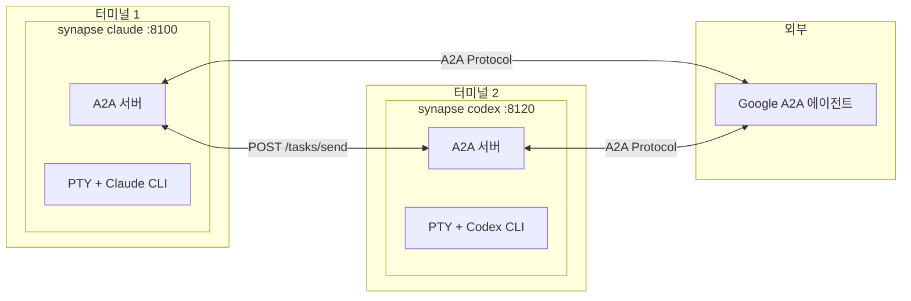
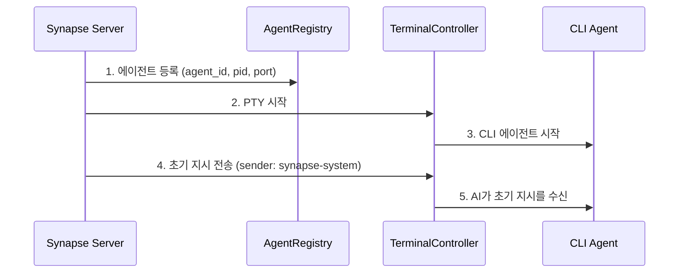
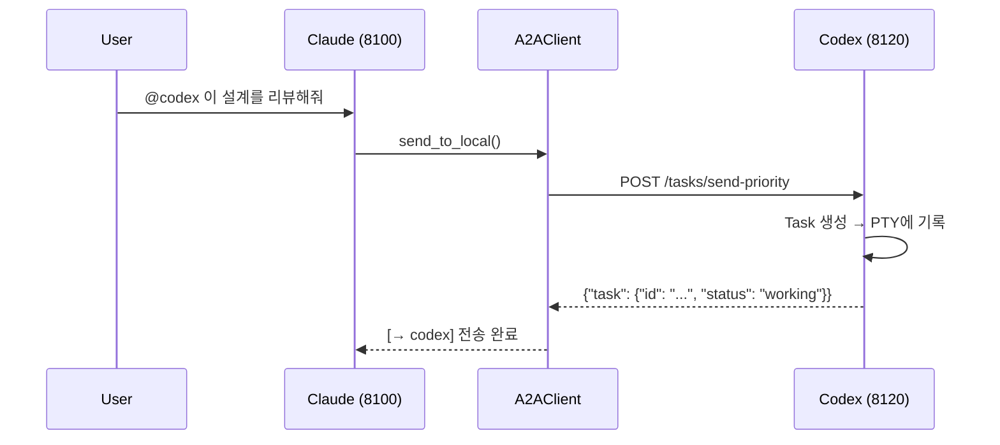
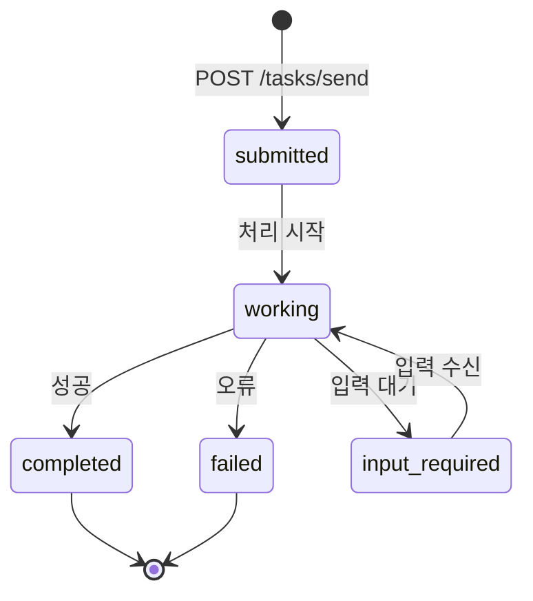
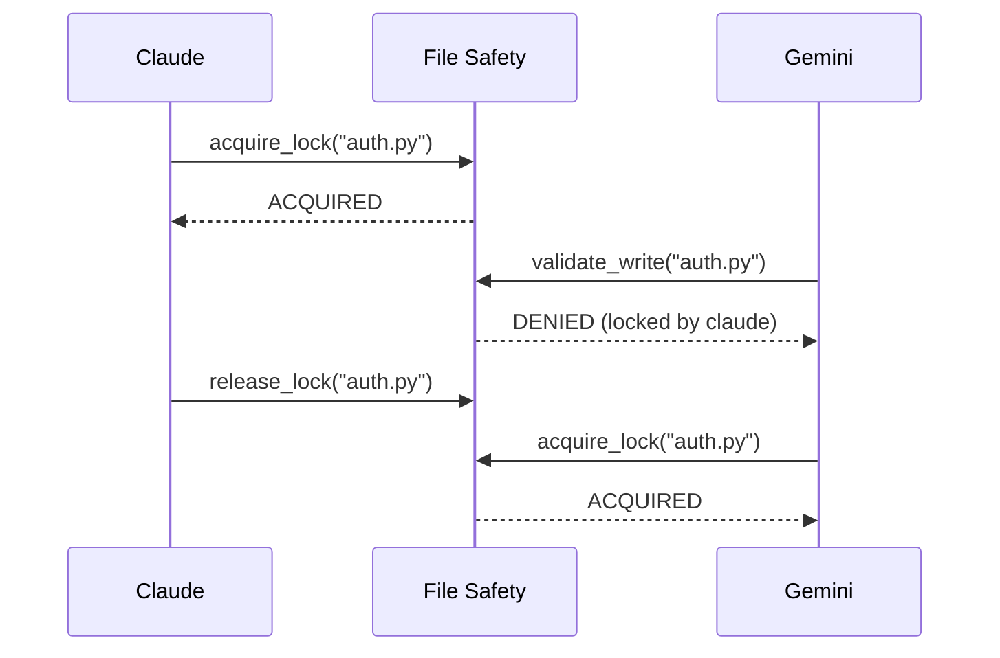

# Synapse A2A

**🌐 Language: [English](README.md) | [日本語](README.ja.md) | [中文](README.zh.md) | 한국어 | [Español](README.es.md) | [Français](README.fr.md)**

> **에이전트의 동작을 변경하지 않고 에이전트 간 협업을 통해 작업을 수행**

[](https://www.python.org/downloads/)
[](LICENSE)
[](#테스트)
[](https://deepwiki.com/s-hiraoku/synapse-a2a)

> CLI 에이전트(Claude Code, Codex, Gemini, OpenCode, GitHub Copilot CLI)를 **그대로** 유지하면서 Google A2A Protocol을 통한 에이전트 간 협업을 구현하는 프레임워크

## 프로젝트 목표

```text
┌─────────────────────────────────────────────────────────────────┐
│  ✅ Non-Invasive: 에이전트의 동작을 변경하지 않음                  │
│  ✅ Collaborative: 에이전트 간 협업 가능                          │
│  ✅ Transparent: 기존 워크플로를 유지                             │
└─────────────────────────────────────────────────────────────────┘
```

Synapse A2A는 각 에이전트의 입출력을 **투명하게 래핑**하며, 에이전트 자체는 수정하지 않습니다. 이를 통해:

- **각 에이전트의 강점 활용**: 사용자가 자유롭게 역할과 전문성을 지정 가능
- **학습 비용 제로**: 기존 워크플로를 그대로 계속 사용
- **미래 대비**: 에이전트 업데이트에 강함

자세한 내용은 [프로젝트 철학](docs/project-philosophy.md)을 참조하세요.



---

## 목차

- [기능](#기능)
- [사전 요구사항](#사전-요구사항)
- [빠른 시작](#빠른-시작)
- [사용 사례](#사용-사례)
- [스킬](#스킬)
- [문서](#문서)
- [아키텍처](#아키텍처)
- [CLI 명령어](#cli-명령어)
- [API 엔드포인트](#api-엔드포인트)
- [Task 구조](#task-구조)
- [발신자 식별](#발신자-식별)
- [우선순위 레벨](#우선순위-레벨)
- [Agent Card](#agent-card)
- [Registry와 포트 관리](#registry와-포트-관리)
- [File Safety](#file-safety)
- [에이전트 모니터](#에이전트-모니터)
- [테스트](#테스트)
- [설정 (.synapse)](#설정-synapse)
- [개발 및 릴리스](#개발-및-릴리스)

---

## 기능

| 카테고리 | 기능 |
| -------- | ---- |
| **A2A 호환** | 모든 통신은 Message/Part + Task 형식, Agent Card 디스커버리 |
| **CLI 통합** | 기존 CLI 도구를 수정 없이 A2A 에이전트로 변환 |
| **synapse send** | `synapse send <agent> "message"`로 에이전트 간 메시지 전송 |
| **발신자 식별** | `metadata.sender` + PID 매칭으로 발신자 자동 식별 |
| **우선순위 인터럽트** | Priority 5는 메시지 전에 SIGINT 전송(긴급 중지) |
| **멀티 인스턴스** | 동일 유형의 에이전트를 여러 개 실행(자동 포트 할당) |
| **외부 연동** | 다른 Google A2A 에이전트와 통신 |
| **File Safety** | 파일 잠금 및 변경 추적으로 멀티 에이전트 충돌 방지(`synapse list`에서 확인 가능) |
| **에이전트 명명** | 커스텀 이름과 역할로 쉬운 식별(`synapse send my-claude "hello"`) |
| **에이전트 모니터** | 실시간 상태(READY/WAITING/PROCESSING/DONE), CURRENT 작업 미리보기, 터미널 점프 |
| **작업 이력** | 검색, 내보내기, 통계 기능을 갖춘 자동 작업 추적(기본 활성화) |

---

## 사전 요구사항

- **OS**: macOS / Linux (Windows는 WSL2 권장)
- **Python**: 3.10+
- **CLI 도구**: 사용할 에이전트를 사전에 설치 및 설정:
  - [Claude Code](https://docs.anthropic.com/en/docs/claude-code)
  - [Codex CLI](https://github.com/openai/codex)
  - [Gemini CLI](https://github.com/google-gemini/gemini-cli)
  - [OpenCode](https://github.com/opencode-ai/opencode)
  - [GitHub Copilot CLI](https://docs.github.com/en/copilot/github-copilot-in-the-cli)

---

## 빠른 시작

### 1. Synapse A2A 설치

```bash
# PyPI에서 설치 (권장)
pip install synapse-a2a

# gRPC 지원 포함
pip install "synapse-a2a[grpc]"
```

개발자용 (이 저장소를 편집하는 경우):

```bash
# uv로 설치
uv sync

# 또는 pip (편집 가능 모드)
pip install -e .
```

### 2. 스킬 설치 (권장)

**Synapse A2A를 최대한 활용하려면 스킬 설치를 강력히 권장합니다.**

스킬을 통해 Claude는 Synapse A2A 기능을 자동으로 이해합니다: @agent 메시징, File Safety 등.

```bash
# skills.sh를 통해 설치 (https://skills.sh/)
npx skills add s-hiraoku/synapse-a2a
```

자세한 내용은 [스킬](#스킬)을 참조하세요.

### 3. 에이전트 시작

```bash
# 터미널 1: Claude
synapse claude

# 터미널 2: Codex
synapse codex

# 터미널 3: Gemini
synapse gemini

# 터미널 4: OpenCode
synapse opencode

# 터미널 5: GitHub Copilot CLI
synapse copilot
```

> 참고: 터미널 스크롤백 표시가 깨지는 경우:
> ```bash
> uv run synapse gemini
> # 또는
> uv run python -m synapse.cli gemini
> ```

포트는 자동 할당됩니다:

| 에이전트 | 포트 범위 |
| -------- | ---------- |
| Claude   | 8100-8109  |
| Gemini   | 8110-8119  |
| Codex    | 8120-8129  |
| OpenCode | 8130-8139  |
| Copilot  | 8140-8149  |

### 4. 에이전트 간 통신

`synapse send`를 사용하여 에이전트 간 메시지를 전송합니다:

```bash
synapse send codex "이 설계를 리뷰해주세요" --from synapse-claude-8100
synapse send gemini "API 개선 사항을 제안해주세요" --from synapse-claude-8100
```

동일 유형의 에이전트가 여러 개인 경우 type-port 형식을 사용합니다:

```bash
synapse send codex-8120 "이 작업을 처리해주세요" --from synapse-claude-8100
synapse send codex-8121 "저 작업을 처리해주세요" --from synapse-claude-8100
```

### 5. HTTP API

```bash
# 메시지 전송
curl -X POST http://localhost:8100/tasks/send \
  -H "Content-Type: application/json" \
  -d '{"message": {"role": "user", "parts": [{"type": "text", "text": "Hello!"}]}}'

# 긴급 중지 (Priority 5)
curl -X POST "http://localhost:8100/tasks/send-priority?priority=5" \
  -H "Content-Type: application/json" \
  -d '{"message": {"role": "user", "parts": [{"type": "text", "text": "Stop!"}]}}'
```

---

## 사용 사례

### 1. 즉석 사양 조회 (기본)
**Claude**로 코딩 중에 **Gemini**(웹 검색에 강함)에게 최신 라이브러리 사양이나 오류 정보를 컨텍스트 전환 없이 빠르게 질의합니다.

```bash
# Claude의 터미널에서:
synapse send gemini "Python 3.12의 새로운 f-string 기능을 요약해줘" --from synapse-claude-8100
```

### 2. 설계 교차 리뷰 (중급)
다른 관점을 가진 에이전트로부터 설계에 대한 피드백을 받습니다.

```bash
# Claude가 설계를 작성한 후:
synapse send gemini "이 설계를 확장성과 유지보수성 관점에서 비판적으로 리뷰해줘" --from synapse-claude-8100
```

### 3. TDD 페어 프로그래밍 (중급)
"테스트 작성자"와 "구현자"를 분리하여 견고한 코드를 작성합니다.

```bash
# 터미널 1 (Codex):
auth.py의 유닛 테스트를 작성해 - 정상 케이스와 토큰 만료 케이스

# 터미널 2 (Claude):
synapse send codex-8120 "작성한 테스트를 통과하도록 auth.py를 구현해줘" --from synapse-claude-8100
```

### 4. 보안 감사 (전문)
보안 전문가 역할을 가진 에이전트에게 커밋 전 코드 감사를 수행하게 합니다.

```bash
# Gemini에 역할 부여:
당신은 보안 엔지니어입니다. 취약점(SQLi, XSS 등)만 리뷰하세요.

# 코드 작성 후:
synapse send gemini "현재 변경 사항(git diff)을 감사해줘" --from synapse-claude-8100
```

### 5. 오류 로그로부터 자동 수정 (고급)
오류 로그를 에이전트에 전달하여 자동 수정 제안을 받습니다.

```bash
# 테스트 실패...
pytest > error.log

# 에이전트에 수정 요청
synapse send claude "error.log를 읽고 synapse/server.py의 문제를 수정해줘" --from synapse-gemini-8110
```

### 6. 언어/프레임워크 마이그레이션 (고급)
대규모 리팩토링 작업을 에이전트들에게 분배합니다.

```bash
# 터미널 1 (Claude):
legacy_api.js를 읽고 TypeScript 타입 정의를 작성해줘

# 터미널 2 (Codex):
synapse send claude "작성한 타입 정의를 사용하여 legacy_api.js를 src/new_api.ts로 재작성해줘" --from synapse-codex-8121
```

### SSH 원격과의 비교

| 작업 | SSH | Synapse |
|------|-----|---------|
| 수동 CLI 조작 | ◎ | ◎ |
| 프로그래밍 방식 작업 전송 | △ expect 등 필요 | ◎ HTTP API |
| 다수 동시 클라이언트 접속 | △ 다중 세션 | ◎ 단일 엔드포인트 |
| 실시간 진행 알림 | ✗ | ◎ SSE/Webhook |
| 자동 에이전트 간 연계 | ✗ | ◎ synapse send |

> **참고**: 개인 CLI 사용에는 SSH로 충분한 경우가 많습니다. Synapse는 자동화, 연계, 멀티 에이전트 협업이 필요한 상황에서 진가를 발휘합니다.

---

## 스킬

**Claude Code에서 Synapse A2A를 사용할 때 스킬 설치를 강력히 권장합니다.**

### 스킬을 설치하는 이유

스킬을 설치하면 Claude가 자동으로 이해하고 실행합니다:

- **synapse send**: `synapse send codex "Fix this" --from synapse-claude-8100`으로 에이전트 간 통신
- **우선순위 제어**: Priority 1-5로 메시지 전송(5 = 긴급 중지)
- **File Safety**: 파일 잠금 및 변경 추적으로 멀티 에이전트 충돌 방지
- **이력 관리**: 작업 이력 검색, 내보내기, 통계

### 설치

```bash
# skills.sh를 통해 설치 (https://skills.sh/)
npx skills add s-hiraoku/synapse-a2a
```

### 포함된 스킬

| 스킬 | 설명 |
|------|------|
| **synapse-a2a** | 에이전트 간 통신 종합 가이드: `synapse send`, 우선순위, A2A 프로토콜, 이력, File Safety, 설정 |

### 디렉토리 구조

```text
plugins/
└── synapse-a2a/
    ├── .claude-plugin/plugin.json
    ├── README.md
    └── skills/
        └── synapse-a2a/SKILL.md
```

자세한 내용은 [plugins/synapse-a2a/README.md](plugins/synapse-a2a/README.md)를 참조하세요.

> **참고**: Codex와 Gemini는 플러그인을 지원하지 않지만, 확장된 스킬을 `.agents/skills/`(Codex/OpenCode) 또는 `.gemini/skills/` 디렉토리에 배치하면 이러한 기능을 활성화할 수 있습니다.

---

## 문서

- [guides/README.md](guides/README.md) - 문서 개요
- [guides/multi-agent-setup.md](guides/multi-agent-setup.md) - 설정 가이드
- [guides/usage.md](guides/usage.md) - 명령어 및 사용 패턴
- [guides/settings.md](guides/settings.md) - `.synapse` 설정 상세
- [guides/troubleshooting.md](guides/troubleshooting.md) - 자주 발생하는 문제와 해결 방법

---

## 아키텍처

### A2A 서버/클라이언트 구조

Synapse에서는 **각 에이전트가 A2A 서버로 동작**합니다. 중앙 서버는 없으며 P2P 아키텍처입니다.

```
┌─────────────────────────────────────┐    ┌─────────────────────────────────────┐
│  synapse claude (port 8100)         │    │  synapse codex (port 8120)          │
│  ┌───────────────────────────────┐  │    │  ┌───────────────────────────────┐  │
│  │  FastAPI Server (A2A 서버)    │  │    │  │  FastAPI Server (A2A 서버)    │  │
│  │  /.well-known/agent.json      │  │    │  │  /.well-known/agent.json      │  │
│  │  /tasks/send                  │◄─┼────┼──│  A2AClient                    │  │
│  │  /tasks/{id}                  │  │    │  └───────────────────────────────┘  │
│  └───────────────────────────────┘  │    │  ┌───────────────────────────────┐  │
│  ┌───────────────────────────────┐  │    │  │  PTY + Codex CLI              │  │
│  │  PTY + Claude CLI             │  │    │  └───────────────────────────────┘  │
│  └───────────────────────────────┘  │    └─────────────────────────────────────┘
└─────────────────────────────────────┘
```

각 에이전트는:

- **A2A 서버**: 다른 에이전트의 요청을 수신
- **A2A 클라이언트**: 다른 에이전트에 요청을 전송

### 주요 컴포넌트

| 컴포넌트 | 파일 | 역할 |
| -------- | ---- | ---- |
| FastAPI Server | `synapse/server.py` | A2A 엔드포인트 제공 |
| A2A Router | `synapse/a2a_compat.py` | A2A 프로토콜 구현 |
| A2A Client | `synapse/a2a_client.py` | 다른 에이전트와의 통신 |
| TerminalController | `synapse/controller.py` | PTY 관리, READY/PROCESSING 감지 |
| InputRouter | `synapse/input_router.py` | @Agent 패턴 감지 |
| AgentRegistry | `synapse/registry.py` | 에이전트 등록 및 검색 |

### 시작 시퀀스



### 통신 흐름



---

## CLI 명령어

### 기본 조작

```bash
# 에이전트 시작 (포어그라운드)
synapse claude
synapse codex
synapse gemini
synapse opencode
synapse copilot

# 커스텀 이름과 역할을 지정하여 시작
synapse claude --name my-claude --role "code reviewer"

# 대화형 세팅을 건너뛰기
synapse claude --no-setup

# 포트 지정
synapse claude --port 8105

# CLI 도구에 인수 전달
synapse claude -- --resume
```

### 에이전트 명명

에이전트에 커스텀 이름과 역할을 지정하여 쉽게 식별하고 관리합니다:

```bash
# 대화형 세팅 (에이전트 시작 시 기본값)
synapse claude
# → 이름과 역할을 입력하라는 프롬프트가 표시됩니다

# 대화형 세팅 건너뛰기
synapse claude --no-setup

# CLI 옵션으로 이름과 역할 설정
synapse claude --name my-claude --role "code reviewer"

# 에이전트 실행 후 이름/역할 변경
synapse rename synapse-claude-8100 --name my-claude --role "test writer"
synapse rename my-claude --role "documentation"  # 역할만 변경
synapse rename my-claude --clear                 # 이름과 역할 초기화
```

이름을 지정한 후에는 모든 작업에 커스텀 이름을 사용합니다:

```bash
synapse send my-claude "이 코드를 리뷰해줘" --from synapse-codex-8121
synapse jump my-claude
synapse kill my-claude
```

**이름 vs ID:**
- **표시/프롬프트**: 이름이 설정된 경우 이름을 표시, 그렇지 않으면 ID (예: `Kill my-claude (PID: 1234)?`)
- **내부 처리**: 항상 에이전트 ID를 사용 (`synapse-claude-8100`)
- **대상 해석**: 대상 매칭 시 이름이 최우선

### 명령어 목록

| 명령어 | 설명 |
| ------- | ---- |
| `synapse <profile>` | 포어그라운드에서 시작 |
| `synapse start <profile>` | 백그라운드에서 시작 |
| `synapse stop <profile\|id>` | 에이전트 중지(ID 지정 가능) |
| `synapse kill <target>` | 에이전트 즉시 종료 |
| `synapse jump <target>` | 에이전트의 터미널로 점프 |
| `synapse rename <target>` | 에이전트에 이름/역할 설정 |
| `synapse --version` | 버전 표시 |
| `synapse list` | 실행 중인 에이전트 목록 (자동 갱신 Rich TUI, 터미널 점프 지원) |
| `synapse logs <profile>` | 로그 표시 |
| `synapse send <target> <message>` | 메시지 전송 |
| `synapse reply <message>` | 마지막으로 수신한 A2A 메시지에 응답 |
| `synapse instructions show` | 지시 내용 표시 |
| `synapse instructions files` | 지시 파일 목록 |
| `synapse instructions send` | 초기 지시 재전송 |
| `synapse history list` | 작업 이력 표시 |
| `synapse history show <task_id>` | 작업 상세 표시 |
| `synapse history search` | 키워드 검색 |
| `synapse history cleanup` | 오래된 데이터 삭제 |
| `synapse history stats` | 통계 표시 |
| `synapse history export` | JSON/CSV 내보내기 |
| `synapse file-safety status` | File Safety 통계 표시 |
| `synapse file-safety locks` | 활성 잠금 목록 |
| `synapse file-safety lock` | 파일 잠금 |
| `synapse file-safety unlock` | 잠금 해제 |
| `synapse file-safety history` | 파일 변경 이력 |
| `synapse file-safety recent` | 최근 변경 사항 |
| `synapse file-safety record` | 변경 수동 기록 |
| `synapse file-safety cleanup` | 오래된 데이터 삭제 |
| `synapse file-safety debug` | 디버그 정보 표시 |
| `synapse config` | 설정 관리 (대화형 TUI) |
| `synapse config show` | 현재 설정 표시 |

### Resume 모드

기존 세션을 재개할 때 이러한 플래그를 사용하여 **초기 지시 전송을 건너뛰고**(A2A 프로토콜 설명), 컨텍스트를 깨끗하게 유지합니다:

```bash
# Claude Code 세션 재개
synapse claude -- --resume

# 이력이 포함된 Gemini 재개
synapse gemini -- --resume=5

# Codex는 'resume'을 서브커맨드로 사용 (--resume 플래그가 아님)
synapse codex -- resume --last
```

기본 플래그 (`settings.json`에서 커스터마이즈 가능):
- **Claude**: `--resume`, `--continue`, `-r`, `-c`
- **Gemini**: `--resume`, `-r`
- **Codex**: `resume`
- **OpenCode**: `--continue`, `-c`
- **Copilot**: `--continue`, `--resume`

### 지시 관리

초기 지시가 전송되지 않은 경우(예: `--resume` 모드 후) 수동으로 재전송합니다:

```bash
# 지시 내용 표시
synapse instructions show claude

# 지시 파일 목록
synapse instructions files claude

# 실행 중인 에이전트에 초기 지시 전송
synapse instructions send claude

# 전송 전 미리보기
synapse instructions send claude --preview

# 특정 에이전트 ID에 전송
synapse instructions send synapse-claude-8100
```

다음과 같은 경우에 유용합니다:
- `--resume`으로 시작한 후 A2A 프로토콜 정보가 필요한 경우
- 에이전트가 지시를 잃어버렸거나 잊어버린 경우의 복구
- 지시 내용 디버깅

### 외부 에이전트 관리

```bash
# 외부 에이전트 등록
synapse external add http://other-agent:9000 --alias other

# 목록
synapse external list

# 메시지 전송
synapse external send other "이 작업을 처리해주세요"
```

### 작업 이력 관리

과거 에이전트 실행 결과를 검색, 탐색, 분석합니다.

**참고:** v0.3.13 이후 이력은 기본으로 활성화되어 있습니다. 비활성화하려면:

```bash
# 환경 변수로 비활성화
export SYNAPSE_HISTORY_ENABLED=false
synapse claude
```

#### 기본 조작

```bash
# 최근 50건 표시
synapse history list

# 에이전트별 필터링
synapse history list --agent claude

# 건수 지정
synapse history list --limit 100

# 작업 상세 표시
synapse history show task-id-uuid
```

#### 키워드 검색

입력/출력 필드를 키워드로 검색합니다:

```bash
# 단일 키워드
synapse history search "Python"

# 복수 키워드 (OR 로직)
synapse history search "Python" "Docker"

# AND 로직 (모든 키워드가 일치해야 함)
synapse history search "Python" "function" --logic AND

# 에이전트 필터 포함
synapse history search "Python" --agent claude

# 결과 수 제한
synapse history search "error" --limit 20
```

#### 통계

```bash
# 전체 통계 (합계, 성공률, 에이전트별 내역)
synapse history stats

# 특정 에이전트 통계
synapse history stats --agent claude
```

#### 데이터 내보내기

```bash
# JSON 내보내기 (표준 출력)
synapse history export --format json

# CSV 내보내기
synapse history export --format csv

# 파일로 저장
synapse history export --format json --output history.json
synapse history export --format csv --agent claude > claude_history.csv
```

#### 보존 정책

```bash
# 30일보다 오래된 데이터 삭제
synapse history cleanup --days 30

# 데이터베이스를 100MB 이하로 유지
synapse history cleanup --max-size 100

# 강제 실행 (확인 없음)
synapse history cleanup --days 30 --force

# 드라이런
synapse history cleanup --days 30 --dry-run
```

**스토리지:**

- SQLite 데이터베이스: `~/.synapse/history/history.db`
- 저장 내용: 작업 ID, 에이전트 이름, 입력, 출력, 상태, 메타데이터
- 자동 인덱스: agent_name, timestamp, task_id

**설정:**

- **기본 활성화** (v0.3.13+)
- **비활성화**: `SYNAPSE_HISTORY_ENABLED=false`

### synapse send 명령어 (권장)

에이전트 간 통신에 `synapse send`를 사용합니다. 샌드박스 환경에서도 동작합니다.

```bash
synapse send <target> "<message>" [--from <sender>] [--priority <1-5>] [--response | --no-response]
```

**대상 형식:**

| 형식 | 예시 | 설명 |
|------|------|------|
| 커스텀 이름 | `my-claude` | 최우선, 에이전트에 이름이 있을 때 사용 |
| 에이전트 유형 | `claude` | 단일 인스턴스일 때만 동작 |
| 유형-포트 | `claude-8100` | 동일 유형이 여러 개일 때 사용 |
| 전체 ID | `synapse-claude-8100` | 완전한 에이전트 ID |

동일 유형의 에이전트가 여러 개 실행 중인 경우, 유형만(예: `claude`) 사용하면 오류가 발생합니다. `claude-8100` 또는 `synapse-claude-8100`을 사용하세요.

**옵션:**

| 옵션 | 단축형 | 설명 |
|------|--------|------|
| `--from` | `-f` | 발신자 에이전트 ID (응답 식별용) |
| `--priority` | `-p` | 우선순위 1-4: 일반, 5: 긴급 중지 (SIGINT 전송) |
| `--response` | - | 라운드트립 - 발신자가 대기, 수신자가 `synapse reply`로 응답 |
| `--no-response` | - | 원웨이 - 전송 후 잊기, 응답 불필요 |

**예시:**

```bash
# 메시지 전송 (단일 인스턴스)
synapse send claude "Hello" --priority 1 --from synapse-codex-8121

# 특정 인스턴스에 전송 (동일 유형이 여러 개인 경우)
synapse send claude-8100 "Hello" --from synapse-claude-8101

# 긴급 중지
synapse send claude "Stop!" --priority 5 --from synapse-codex-8121

# 응답 대기 (라운드트립)
synapse send gemini "이것을 분석해줘" --response --from synapse-claude-8100
```

**기본 동작:** `a2a.flow=auto`(기본값)에서 `synapse send`는 `--no-response`가 지정되지 않는 한 응답을 기다립니다.

**중요:** 항상 `--from`과 함께 에이전트 ID(형식: `synapse-<type>-<port>`)를 사용하세요.

### synapse reply 명령어

마지막으로 수신한 메시지에 응답합니다:

```bash
synapse reply "<message>"
```

`--from` 플래그는 샌드박스 환경(Codex 등)에서만 필요합니다. 통상적으로는 프로세스 계통에서 자동 감지됩니다.

### 저수준 A2A 도구

고급 작업용:

```bash
# 에이전트 목록
python -m synapse.tools.a2a list

# 메시지 전송
python -m synapse.tools.a2a send --target claude --priority 1 "Hello"

# 마지막으로 수신한 메시지에 응답 (응답 추적 사용)
python -m synapse.tools.a2a reply "Here is my response"
```

---

## API 엔드포인트

### A2A 호환

| 엔드포인트 | 메서드 | 설명 |
| ---------- | ------ | ---- |
| `/.well-known/agent.json` | GET | Agent Card |
| `/tasks/send` | POST | 메시지 전송 |
| `/tasks/send-priority` | POST | 우선순위 포함 전송 |
| `/tasks/create` | POST | 작업 생성 (PTY 전송 없음, `--response`용) |
| `/tasks/{id}` | GET | 작업 상태 조회 |
| `/tasks` | GET | 작업 목록 |
| `/tasks/{id}/cancel` | POST | 작업 취소 |
| `/status` | GET | READY/PROCESSING 상태 |

### Synapse 확장

| 엔드포인트 | 메서드 | 설명 |
| ---------- | ------ | ---- |
| `/reply-stack/get` | GET | 발신자 정보 조회 (전송 전 확인용 peek) |
| `/reply-stack/pop` | GET | 응답 맵에서 발신자 정보를 꺼냄 (`synapse reply`용) |

### 외부 에이전트

| 엔드포인트 | 메서드 | 설명 |
| ---------- | ------ | ---- |
| `/external/discover` | POST | 외부 에이전트 등록 |
| `/external/agents` | GET | 목록 |
| `/external/agents/{alias}` | DELETE | 삭제 |
| `/external/agents/{alias}/send` | POST | 전송 |

---

## Task 구조

A2A 프로토콜에서 모든 통신은 **Task**로 관리됩니다.

### Task 수명 주기



### Task 객체

```json
{
  "id": "550e8400-e29b-41d4-a716-446655440000",
  "context_id": "conversation-123",
  "status": "working",
  "message": {
    "role": "user",
    "parts": [{ "type": "text", "text": "이 설계를 리뷰해줘" }]
  },
  "artifacts": [],
  "metadata": {
    "sender": {
      "sender_id": "synapse-claude-8100",
      "sender_type": "claude",
      "sender_endpoint": "http://localhost:8100"
    }
  },
  "created_at": "2024-01-15T10:30:00Z",
  "updated_at": "2024-01-15T10:30:05Z"
}
```

### 필드 설명

| 필드 | 타입 | 설명 |
| ---- | ---- | ---- |
| `id` | string | 고유 작업 식별자 (UUID) |
| `context_id` | string? | 대화 컨텍스트 ID (멀티턴용) |
| `status` | string | `submitted` / `working` / `completed` / `failed` / `input_required` |
| `message` | Message | 전송된 메시지 |
| `artifacts` | Artifact[] | 작업 출력 아티팩트 |
| `metadata` | object | 발신자 정보 (`metadata.sender`) |
| `created_at` | string | 생성 타임스탬프 (ISO 8601) |
| `updated_at` | string | 업데이트 타임스탬프 (ISO 8601) |

### Message 구조

```json
{
  "role": "user",
  "parts": [
    { "type": "text", "text": "메시지 내용" },
    {
      "type": "file",
      "file": {
        "name": "doc.pdf",
        "mimeType": "application/pdf",
        "bytes": "..."
      }
    }
  ]
}
```

| Part 타입 | 설명 |
| --------- | ---- |
| `text` | 텍스트 메시지 |
| `file` | 파일 첨부 |
| `data` | 구조화 데이터 |

---

## 발신자 식별

A2A 메시지의 발신자는 `metadata.sender`로 식별할 수 있습니다.

### PTY 출력 형식

메시지는 간단한 `A2A:` 접두사와 함께 에이전트의 PTY로 전송됩니다:

```
A2A: <message content>
```

### 응답 처리

Synapse가 응답 라우팅을 자동으로 관리합니다. 에이전트는 단순히 `synapse reply`를 사용합니다:

```bash
synapse reply "여기에 응답 내용"
```

프레임워크가 발신자 정보를 내부적으로 추적하고 응답을 자동 라우팅합니다.

### Task API 확인 (개발용)

```bash
curl -s http://localhost:8120/tasks/<id> | jq '.metadata.sender'
```

응답:

```json
{
  "sender_id": "synapse-claude-8100",
  "sender_type": "claude",
  "sender_endpoint": "http://localhost:8100"
}
```

### 작동 원리

1. **전송 시**: Registry를 참조하여 PID 매칭으로 자신의 agent_id를 식별
2. **Task 생성 시**: 발신자 정보를 `metadata.sender`에 첨부
3. **수신 시**: PTY 접두사 또는 Task API로 확인

---

## 우선순위 레벨

| 우선순위 | 동작 | 용도 |
| -------- | ---- | ---- |
| 1-4 | 일반 stdin 쓰기 | 일반 메시지 |
| 5 | SIGINT 후 쓰기 | 긴급 중지 |

```bash
# 긴급 중지
synapse send claude "Stop!" --priority 5
```

---

## Agent Card

각 에이전트는 `/.well-known/agent.json`에서 Agent Card를 공개합니다.

```bash
curl http://localhost:8100/.well-known/agent.json
```

```json
{
  "name": "Synapse Claude",
  "description": "PTY-wrapped claude CLI agent with A2A communication",
  "url": "http://localhost:8100",
  "capabilities": {
    "streaming": false,
    "pushNotifications": false,
    "multiTurn": true
  },
  "skills": [
    {
      "id": "chat",
      "name": "Chat",
      "description": "Send messages to the CLI agent"
    },
    {
      "id": "interrupt",
      "name": "Interrupt",
      "description": "Interrupt current processing"
    }
  ],
  "extensions": {
    "synapse": {
      "agent_id": "synapse-claude-8100",
      "pty_wrapped": true,
      "priority_interrupt": true,
      "at_agent_syntax": true
    }
  }
}
```

### 설계 철학

Agent Card는 외부 공개용 정보만 포함하는 "명함"입니다:

- capabilities, skills, endpoint 등
- 내부 지시는 포함되지 않음 (시작 시 A2A Task로 전송)

---

## Registry와 포트 관리

### Registry 파일

```
~/.a2a/registry/
├── synapse-claude-8100.json
├── synapse-claude-8101.json
└── synapse-gemini-8110.json
```

### 자동 정리

오래된 항목은 다음 시점에 자동 삭제됩니다:

- `synapse list` 실행 시
- 메시지 전송 시 (대상이 종료된 경우)

### 포트 범위

```python
PORT_RANGES = {
    "claude": (8100, 8109),
    "gemini": (8110, 8119),
    "codex": (8120, 8129),
    "opencode": (8130, 8139),
    "copilot": (8140, 8149),
    "dummy": (8190, 8199),
}
```

### 상주 에이전트의 일반적인 메모리 사용량

macOS 환경에서 대기 중인 상주 에이전트는 가볍습니다. 2026년 1월 25일 기준,
일반적인 개발 환경에서 프로세스당 RSS는 약 12 MB 정도입니다.

실제 사용량은 프로필, 플러그인, 이력 설정, 워크로드에 따라 달라집니다.
`ps`의 RSS는 KB 단위입니다(약 12 MB는 약 12,000 KB에 해당). 본인의 환경에서 측정하려면:

```bash
ps -o pid,comm,rss,vsz,etime,command -A | rg "synapse"
```

ripgrep이 없는 경우:

```bash
ps -o pid,comm,rss,vsz,etime,command -A | grep "synapse"
```

---

## File Safety

여러 에이전트가 동시에 같은 파일을 편집할 때의 충돌을 방지합니다.



### 기능

| 기능 | 설명 |
|------|------|
| **파일 잠금** | 배타적 제어로 동시 편집 방지 |
| **변경 추적** | 누가 언제 무엇을 변경했는지 기록 |
| **컨텍스트 주입** | 읽기 시 최근 변경 이력 제공 |
| **쓰기 전 검증** | 쓰기 전 잠금 상태 확인 |
| **목록 통합** | `synapse list`의 EDITING_FILE 컬럼에서 활성 잠금 확인 가능 |

### 활성화

```bash
# 환경 변수로 활성화
export SYNAPSE_FILE_SAFETY_ENABLED=true
synapse claude
```

### 기본 명령어

```bash
# 통계 표시
synapse file-safety status

# 활성 잠금 목록
synapse file-safety locks

# 잠금 획득
synapse file-safety lock /path/to/file.py claude --intent "리팩토링"

# 잠금 해제 대기
synapse file-safety lock /path/to/file.py claude --wait --wait-timeout 60 --wait-interval 2

# 잠금 해제
synapse file-safety unlock /path/to/file.py claude

# 파일 변경 이력
synapse file-safety history /path/to/file.py

# 최근 변경 사항
synapse file-safety recent

# 오래된 데이터 삭제
synapse file-safety cleanup --days 30
```

### Python API

```python
from synapse.file_safety import FileSafetyManager, ChangeType, LockStatus

manager = FileSafetyManager.from_env()

# 잠금 획득
result = manager.acquire_lock("/path/to/file.py", "claude", intent="리팩토링")
if result["status"] == LockStatus.ACQUIRED:
    # 파일 편집...

    # 변경 기록
    manager.record_modification(
        file_path="/path/to/file.py",
        agent_name="claude",
        task_id="task-123",
        change_type=ChangeType.MODIFY,
        intent="인증 버그 수정"
    )

    # 잠금 해제
    manager.release_lock("/path/to/file.py", "claude")

# 쓰기 전 검증
validation = manager.validate_write("/path/to/file.py", "gemini")
if not validation["allowed"]:
    print(f"쓰기 차단: {validation['reason']}")
```

**스토리지**: 기본값은 `.synapse/file_safety.db`(SQLite, 작업 디렉토리 기준). `SYNAPSE_FILE_SAFETY_DB_PATH`로 변경 가능(예: `~/.synapse/file_safety.db`로 글로벌 설정).

자세한 내용은 [docs/file-safety.md](docs/file-safety.md)를 참조하세요.

---

## 에이전트 모니터

에이전트 상태를 실시간으로 모니터링하며 터미널 점프 기능을 제공합니다.

### Rich TUI 모드

```bash
# 자동 갱신 Rich TUI 시작 (기본값)
synapse list
```

파일 와처를 통해 에이전트 상태 변경 시 자동으로 업데이트되며, 10초 간격의 폴백 폴링이 있습니다.

### 표시 컬럼

| 컬럼 | 설명 |
|------|------|
| ID | 에이전트 ID (예: `synapse-claude-8100`) |
| NAME | 커스텀 이름 (설정된 경우) |
| TYPE | 에이전트 유형 (claude, gemini, codex 등) |
| ROLE | 에이전트 역할 설명 (설정된 경우) |
| STATUS | 현재 상태 (READY, WAITING, PROCESSING, DONE) |
| CURRENT | 현재 작업 미리보기 |
| TRANSPORT | 통신 전송 표시기 |
| WORKING_DIR | 현재 작업 디렉토리 |
| EDITING_FILE | 편집 중인 파일 (File Safety 활성 시만) |

**컬럼 커스터마이즈** (`settings.json`):

```json
{
  "list": {
    "columns": ["ID", "NAME", "STATUS", "CURRENT", "TRANSPORT", "WORKING_DIR"]
  }
}
```

### 상태

| 상태 | 색상 | 의미 |
|------|------|------|
| **READY** | 녹색 | 유휴 상태, 입력 대기 중 |
| **WAITING** | 시안 | 선택 UI 표시 중, 사용자 선택 대기 중 |
| **PROCESSING** | 노란색 | 활발히 처리 중 |
| **DONE** | 파란색 | 작업 완료 (10초 후 자동으로 READY로 전환) |

### 대화형 조작

| 키 | 동작 |
|----|------|
| 1-9 | 에이전트 행 선택 (직접) |
| ↑/↓ | 에이전트 행 탐색 |
| **Enter** 또는 **j** | 선택한 에이전트의 터미널로 점프 |
| **k** | 선택한 에이전트 종료 (확인 포함) |
| **/** | TYPE, NAME 또는 WORKING_DIR로 필터링 |
| ESC | 필터/선택 해제 |
| q | 종료 |

**지원 터미널**: iTerm2, Terminal.app, Ghostty, VS Code, tmux, Zellij

### WAITING 감지

> **참고**: WAITING 감지는 시작 시 오탐지로 인해 현재 비활성화되어 있습니다. 자세한 내용은 [#140](https://github.com/s-hiraoku/synapse-a2a/issues/140)을 참조하세요.

활성화 시, 정규식 패턴을 사용하여 에이전트가 사용자 입력을 기다리는 상태(선택 UI, Y/n 프롬프트)를 감지합니다:

- **Gemini**: `● 1. Option` 선택 UI, `Allow execution` 프롬프트
- **Claude**: `❯ Option` 커서, `☐/☑` 체크박스, `[Y/n]` 프롬프트
- **Codex**: 들여쓰기된 번호 목록
- **OpenCode**: 번호 선택, 선택 표시기, `[y/N]` 프롬프트
- **Copilot**: 번호 선택, 선택 표시기, `[y/N]` 또는 `(y/n)` 프롬프트

---

## 테스트

포괄적인 테스트 스위트로 A2A 프로토콜 호환성을 검증합니다:

```bash
# 전체 테스트
pytest

# 특정 카테고리
pytest tests/test_a2a_compat.py -v
pytest tests/test_sender_identification.py -v
```

---

## 설정 (.synapse)

`.synapse/settings.json`으로 환경 변수와 초기 지시를 커스터마이즈합니다.

### 스코프

| 스코프 | 경로 | 우선순위 |
|--------|------|----------|
| User | `~/.synapse/settings.json` | 낮음 |
| Project | `./.synapse/settings.json` | 중간 |
| Local | `./.synapse/settings.local.json` | 높음 (gitignore 권장) |

우선순위가 높은 설정이 낮은 설정을 덮어씁니다.

### 세팅

```bash
# .synapse/ 디렉토리 생성 (모든 템플릿 파일 복사)
synapse init

# ? Where do you want to create .synapse/?
#   ❯ User scope (~/.synapse/)
#     Project scope (./.synapse/)
#
# ✔ Created ~/.synapse

# 기본값으로 리셋
synapse reset

# 설정을 대화형으로 편집 (TUI)
synapse config

# 현재 설정 표시 (읽기 전용)
synapse config show
synapse config show --scope user
```

`synapse init`은 다음 파일을 `.synapse/`에 복사합니다:

| 파일 | 설명 |
|------|------|
| `settings.json` | 환경 변수 및 초기 지시 설정 |
| `default.md` | 모든 에이전트 공통 초기 지시 |
| `gemini.md` | Gemini 전용 초기 지시 |
| `file-safety.md` | File Safety 지시 |

### settings.json 구조

```json
{
  "env": {
    "SYNAPSE_HISTORY_ENABLED": "true",
    "SYNAPSE_FILE_SAFETY_ENABLED": "true",
    "SYNAPSE_FILE_SAFETY_DB_PATH": ".synapse/file_safety.db"
  },
  "instructions": {
    "default": "[SYNAPSE INSTRUCTIONS...]\n...",
    "claude": "",
    "gemini": "",
    "codex": ""
  },
  "approvalMode": "required",
  "a2a": {
    "flow": "auto"
  }
}
```

### 환경 변수 (env)

| 변수 | 설명 | 기본값 |
|------|------|--------|
| `SYNAPSE_HISTORY_ENABLED` | 작업 이력 활성화 | `true` |
| `SYNAPSE_FILE_SAFETY_ENABLED` | File Safety 활성화 | `true` |
| `SYNAPSE_FILE_SAFETY_DB_PATH` | File Safety DB 경로 | `.synapse/file_safety.db` |
| `SYNAPSE_FILE_SAFETY_RETENTION_DAYS` | 잠금 이력 보존 일수 | `30` |
| `SYNAPSE_AUTH_ENABLED` | API 인증 활성화 | `false` |
| `SYNAPSE_API_KEYS` | API 키 (쉼표 구분) | - |
| `SYNAPSE_ADMIN_KEY` | 관리자 키 | - |
| `SYNAPSE_ALLOW_LOCALHOST` | localhost 인증 건너뛰기 | `true` |
| `SYNAPSE_USE_HTTPS` | HTTPS 사용 | `false` |
| `SYNAPSE_WEBHOOK_SECRET` | Webhook 시크릿 | - |
| `SYNAPSE_WEBHOOK_TIMEOUT` | Webhook 타임아웃 (초) | `10` |
| `SYNAPSE_WEBHOOK_MAX_RETRIES` | Webhook 재시도 횟수 | `3` |
| `SYNAPSE_LONG_MESSAGE_THRESHOLD` | 파일 저장 문자 수 임계값 | `200` |
| `SYNAPSE_LONG_MESSAGE_TTL` | 메시지 파일 TTL (초) | `3600` |
| `SYNAPSE_LONG_MESSAGE_DIR` | 메시지 파일 디렉토리 | 시스템 임시 디렉토리 |

### A2A 통신 설정 (a2a)

| 설정 | 값 | 설명 |
|------|-----|------|
| `flow` | `roundtrip` | 항상 결과를 기다림 |
| `flow` | `oneway` | 항상 전달만 (기다리지 않음) |
| `flow` | `auto` | 플래그 제어; 생략 시 기본적으로 기다림 |

### 승인 모드 (approvalMode)

초기 지시 전송 전 확인 프롬프트 표시 여부를 제어합니다.

| 설정 | 설명 |
|------|------|
| `required` | 시작 시 승인 프롬프트 표시 (기본값) |
| `auto` | 프롬프트 없이 자동으로 지시 전송 |

`required`로 설정하면 다음과 같은 프롬프트가 표시됩니다:

```
[Synapse] Agent: synapse-claude-8100 | Port: 8100
[Synapse] Initial instructions will be sent to configure A2A communication.

Proceed? [Y/n/s(skip)]:
```

옵션:
- **Y** (또는 Enter): 초기 지시를 전송하고 에이전트를 시작
- **n**: 시작 중단
- **s**: 초기 지시를 전송하지 않고 에이전트를 시작

### 초기 지시 (instructions)

에이전트 시작 시 전송되는 지시를 커스터마이즈합니다:

```json
{
  "instructions": {
    "default": "모든 에이전트 공통 지시",
    "claude": "Claude 전용 지시 (default보다 우선)",
    "gemini": "Gemini 전용 지시",
    "codex": "Codex 전용 지시"
  }
}
```

**우선순위**:
1. 에이전트별 설정(`claude`, `gemini`, `codex`, `opencode`, `copilot`)이 있으면 해당 설정 사용
2. 없으면 `default` 사용
3. 둘 다 비어 있으면 초기 지시 전송하지 않음

**플레이스홀더**:
- `{{agent_id}}` - 에이전트 ID (예: `synapse-claude-8100`)
- `{{port}}` - 포트 번호 (예: `8100`)

자세한 내용은 [guides/settings.md](guides/settings.md)를 참조하세요.

---

## 개발 및 릴리스

### PyPI에 게시

태그를 푸시하면 GitHub Actions를 통해 자동으로 PyPI에 게시됩니다.

```bash
# 1. pyproject.toml의 버전 업데이트
# version = "0.2.0"

# 2. 태그 생성 및 푸시
git tag v0.2.0
git push origin v0.2.0
```

### 수동 게시

```bash
# uv로 빌드 및 게시
uv build
uv publish
```

### 사용자 설치

```bash
# pipx (권장)
pipx install synapse-a2a

# 또는 pip
pip install synapse-a2a

# uvx로 직접 실행
uvx synapse-a2a claude
```

---

## 알려진 제한 사항

- **TUI 렌더링**: Ink 기반 CLI에서 표시가 깨질 수 있음
- **PTY 제한**: 일부 특수 입력 시퀀스가 지원되지 않음
- **Codex 샌드박스**: Codex CLI의 샌드박스가 네트워크 접근을 차단하므로 에이전트 간 통신에 설정이 필요(아래 참조)

### Codex CLI에서의 에이전트 간 통신

Codex CLI는 기본적으로 샌드박스 내에서 실행되어 네트워크 접근이 제한됩니다. 에이전트 간 통신에 `@agent` 패턴을 사용하려면 `~/.codex/config.toml`에서 네트워크 접근을 허용하세요.

**글로벌 설정 (모든 프로젝트에 적용):**

```toml
# ~/.codex/config.toml

sandbox_mode = "workspace-write"

[sandbox_workspace_write]
network_access = true
```

**프로젝트별 설정:**

```toml
# ~/.codex/config.toml

[projects."/path/to/your/project"]
sandbox_mode = "workspace-write"

[projects."/path/to/your/project".sandbox_workspace_write]
network_access = true
```

자세한 내용은 [guides/troubleshooting.md](guides/troubleshooting.md#codex-sandbox-network-error)를 참조하세요.

---

## 엔터프라이즈 기능

프로덕션 환경을 위한 보안, 알림, 고성능 통신 기능입니다.

### API 키 인증

```bash
# 인증을 활성화하여 시작
export SYNAPSE_AUTH_ENABLED=true
export SYNAPSE_API_KEYS=<YOUR_API_KEY>
synapse claude

# API 키를 포함한 요청
curl -H "X-API-Key: <YOUR_API_KEY>" http://localhost:8100/tasks
```

### Webhook 알림

작업 완료 시 외부 URL로 알림을 전송합니다.

```bash
# Webhook 등록
curl -X POST http://localhost:8100/webhooks \
  -H "Content-Type: application/json" \
  -d '{"url": "https://your-server.com/hook", "events": ["task.completed"]}'
```

| 이벤트 | 설명 |
|--------|------|
| `task.completed` | 작업 정상 완료 |
| `task.failed` | 작업 실패 |
| `task.canceled` | 작업 취소 |

### SSE 스트리밍

작업 출력을 실시간으로 수신합니다.

```bash
curl -N http://localhost:8100/tasks/{task_id}/subscribe
```

이벤트 유형:

| 이벤트 | 설명 |
|--------|------|
| `output` | 새로운 CLI 출력 |
| `status` | 상태 변경 |
| `done` | 작업 완료 (Artifact 포함) |

### 출력 파싱

CLI 출력을 자동으로 파싱하여 오류 감지, 상태 업데이트, Artifact 생성을 수행합니다.

| 기능 | 설명 |
|------|------|
| 오류 감지 | `command not found`, `permission denied` 등을 감지 |
| input_required | 질문/확인 프롬프트 감지 |
| 출력 파서 | 코드/파일/오류를 구조화 |

### gRPC 지원

고성능 통신에 gRPC를 사용합니다.

```bash
# gRPC 의존성 설치
pip install synapse-a2a[grpc]

# gRPC는 REST 포트 + 1에서 실행
# REST: 8100 → gRPC: 8101
```

자세한 내용은 [guides/enterprise.md](guides/enterprise.md)를 참조하세요.

---

## 문서

| 경로 | 내용 |
| ---- | ---- |
| [guides/usage.md](guides/usage.md) | 상세 사용법 |
| [guides/architecture.md](guides/architecture.md) | 아키텍처 상세 |
| [guides/enterprise.md](guides/enterprise.md) | 엔터프라이즈 기능 |
| [guides/troubleshooting.md](guides/troubleshooting.md) | 문제 해결 |
| [docs/file-safety.md](docs/file-safety.md) | 파일 충돌 방지 |
| [docs/project-philosophy.md](docs/project-philosophy.md) | 설계 철학 |

---

## 라이선스

MIT License

---

## 관련 링크

- [Claude Code](https://claude.ai/code) - Anthropic의 CLI 에이전트
- [OpenCode](https://opencode.ai/) - 오픈소스 AI 코딩 에이전트
- [GitHub Copilot CLI](https://docs.github.com/en/copilot/github-copilot-in-the-cli) - GitHub의 AI 코딩 어시스턴트
- [Google A2A Protocol](https://github.com/google/A2A) - Agent-to-Agent 프로토콜
