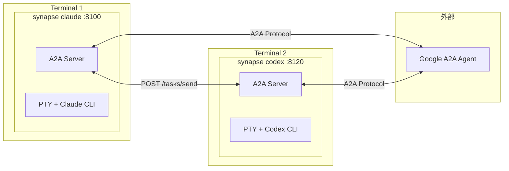
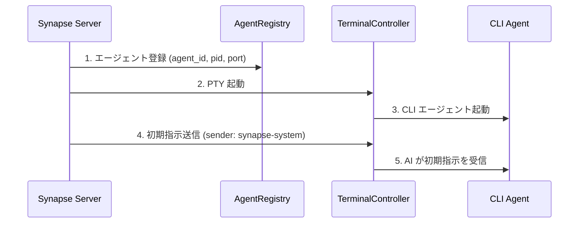
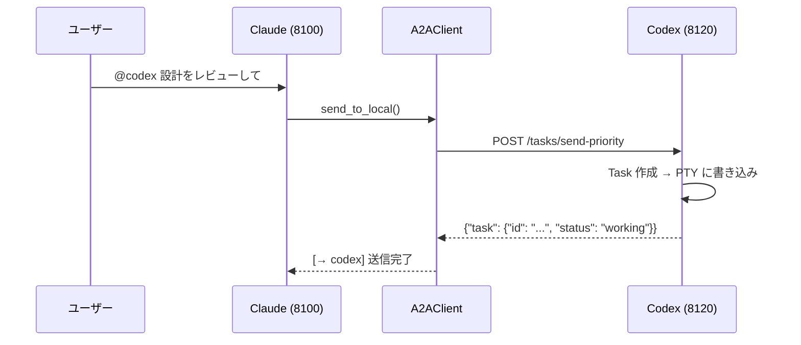
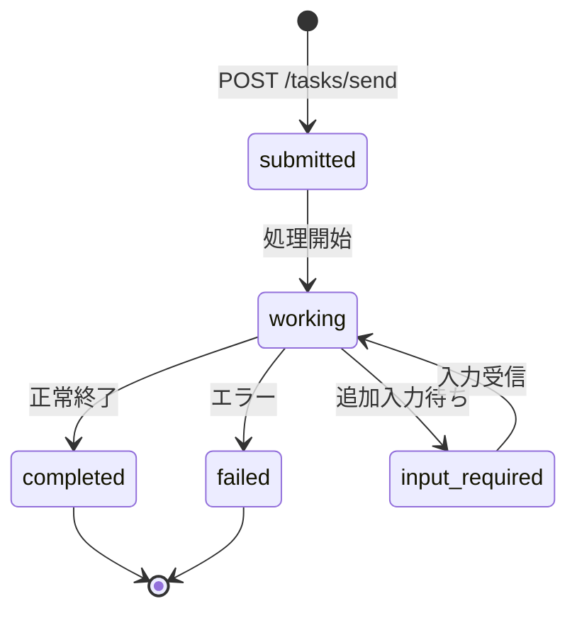
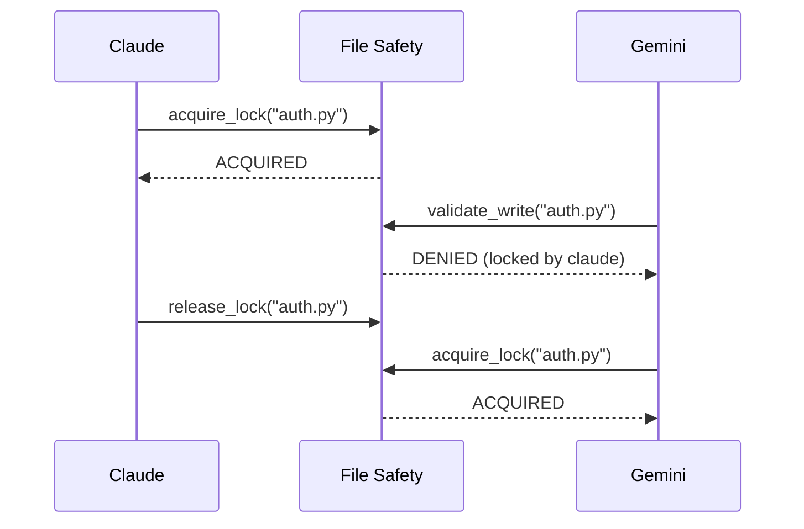

# Synapse A2A

> **各エージェントの挙動を変えることなく、エージェント同士を協力させてタスクを実行する**

[](https://www.python.org/downloads/)
[](LICENSE)
[](#テスト)
[](https://deepwiki.com/s-hiraoku/synapse-a2a)

> Claude Code、Codex、Gemini などの CLI エージェントを**そのままの形で**活用しながら、Google A2A プロトコルによるエージェント間協調を実現するフレームワーク

## プロジェクトの目標

```text
┌─────────────────────────────────────────────────────────────────┐
│  ✅ エージェントの挙動を変えない（Non-Invasive）                 │
│  ✅ エージェント同士を協力させる（Collaborative）                │
│  ✅ 既存のワークフローを維持する（Transparent）                  │
└─────────────────────────────────────────────────────────────────┘
```

Synapse A2A は、各エージェントの入出力を**透過的に**ラップするだけで、エージェント自体の挙動には一切手を加えません。これにより：

- **各エージェントの強みを活かす**: 役割や得意分野はユーザーが自由に設定可能
- **学習コストゼロ**: 既存の使い方をそのまま継続できる
- **将来の変更に強い**: エージェントのアップデートに影響されにくい

詳細は [プロジェクト哲学](docs/project-philosophy.md) を参照してください。



---

## 目次

- [主な特徴](#主な特徴)
- [前提条件](#前提条件)
- [クイックスタート](#クイックスタート)
- [ユースケース](#ユースケース)
- [Claude Code プラグイン](#claude-code-プラグイン)
- [ドキュメント](#ドキュメント)
- [アーキテクチャ](#アーキテクチャ)
- [CLI コマンド](#cli-コマンド)
- [API エンドポイント](#api-エンドポイント)
- [Task 構造](#task-構造)
- [送信元識別](#送信元識別)
- [Priority（優先度）](#priority優先度)
- [Agent Card](#agent-card)
- [レジストリとポート管理](#レジストリとポート管理)
- [File Safety（ファイル競合防止）](#file-safetyファイル競合防止)
- [テスト](#テスト)
- [設定ファイル (.synapse)](#設定ファイル-synapse)
- [開発・リリース](#開発リリース)

---

## 主な特徴

| カテゴリ               | 機能                                                     |
| ---------------------- | -------------------------------------------------------- |
| **A2A 準拠**           | 全通信が Message/Part + Task 形式、Agent Card による発見 |
| **CLI 連携**           | 既存の CLI ツールを改造せずに A2A エージェント化         |
| **@Agent 記法**        | `@claude`, `@codex-8120` で直接メッセージ送信            |
| **送信元識別**         | `metadata.sender` + PID マッチングで送信元を自動識別     |
| **Priority Interrupt** | Priority 5 で SIGINT 送信後にメッセージ送信（緊急停止）  |
| **マルチインスタンス** | 同じエージェントタイプを複数同時起動（ポート自動割当）   |
| **外部連携**           | 他の Google A2A エージェントとの通信                     |
| **タスク委任**         | 自然言語ルールで他エージェントへ自動タスク転送           |
| **File Safety**        | ファイルロックと変更追跡でマルチエージェント競合を防止（`synapse list` でロック状態を確認可能） |

---

## 前提条件

- **OS**: macOS / Linux（Windows は WSL2 推奨）
- **Python**: 3.10+
- **CLI ツール**: 使用するエージェントの CLI を事前にインストール & 初期設定
  - [Claude Code](https://docs.anthropic.com/en/docs/claude-code)
  - [Codex CLI](https://github.com/openai/codex)
  - [Gemini CLI](https://github.com/google-gemini/gemini-cli)

---

## クイックスタート

### 1. Synapse A2A のインストール

```bash
# PyPI からインストール（推奨）
pip install synapse-a2a

# gRPC も使う場合
pip install "synapse-a2a[grpc]"
```

開発者向け（このリポジトリを編集する場合）：

```bash
# uv でインストール
uv sync

# または pip（editable）
pip install -e .
```

### 2. Claude Code プラグインのインストール（推奨）

**Synapse A2A を最大限活用するには、Claude Code プラグインのインストールを強く推奨します。**

プラグインをインストールすると、Claude が自動的に Synapse A2A の機能を理解し、@agent パターンでのメッセージ送信、タスク委任、File Safety などを適切に使用できるようになります。

```bash
# Claude Code 内で実行
/plugin marketplace add s-hiraoku/synapse-a2a
/plugin install synapse-a2a@s-hiraoku/synapse-a2a
```

詳細は [Claude Code プラグイン](#claude-code-プラグイン) を参照してください。

### 3. エージェントを起動

```bash
# Terminal 1: Claude
synapse claude

# Terminal 2: Codex
synapse codex

# Terminal 3: Gemini
synapse gemini
```

> Note: 端末のスクロールバック表示が崩れる場合は、以下の起動方法を試してください。
> ```bash
> uv run synapse gemini
> # または
> uv run python -m synapse.cli gemini
> ```

ポートは自動割当されます：

| エージェント | ポート範囲 |
| ------------ | ---------- |
| Claude       | 8100-8109  |
| Gemini       | 8110-8119  |
| Codex        | 8120-8129  |

### 4. エージェント間通信

端末内で `@Agent` を使ってメッセージ送信：

```text
@codex この設計をレビューして
@gemini APIの改善案を出して
```

複数インスタンスがある場合は `@type-port` 形式で指定：

```text
@codex-8120 こちらを担当して
@codex-8121 こちらを担当して
```

### 5. HTTP API

```bash
# メッセージ送信
curl -X POST http://localhost:8100/tasks/send \
  -H "Content-Type: application/json" \
  -d '{"message": {"role": "user", "parts": [{"type": "text", "text": "Hello!"}]}}'

# 緊急停止（Priority 5）
curl -X POST "http://localhost:8100/tasks/send-priority?priority=5" \
  -H "Content-Type: application/json" \
  -d '{"message": {"role": "user", "parts": [{"type": "text", "text": "Stop!"}]}}'
```

---

## ユースケース

### 1. 瞬時の仕様確認 (Simple)
コーディングに特化した **Claude** で作業中、最新のライブラリ仕様やエラー情報を確認したい場合、Web検索が得意な **Gemini** にその場で問い合わせることで、コンテキストスイッチを防ぎます。

```bash
# Claudeの画面で:
@gemini Python 3.12の新しいf-stringの仕様を要約して
```

### 2. 設計のクロスレビュー (Intermediate)
自分の考えた設計に対して、異なる視点を持つエージェントからフィードバックをもらいます。

```bash
# Claudeで設計案を出した後に:
@gemini この設計について、スケーラビリティと保守性の観点から批判的にレビューして
```

### 3. TDD ペアプログラミング (Intermediate)
「テストを書く人」と「実装する人」を分けることで、堅牢なコードを作成します。

```bash
# Terminal 1 (Codex):
auth.py の単体テストを作成して。ケースは正常系と、トークン期限切れの異常系で。

# Terminal 2 (Claude):
@codex-8120 が作成したテストに通るように auth.py を実装して
```

### 4. セキュリティ監査 (Specialized)
自分の書いたコードをコミットする前に、セキュリティ専門家という役割を与えたエージェントに監査させます。

```bash
# Gemini に役割を与える
あなたはセキュリティエンジニアです。脆弱性（SQLi, XSS等）の観点のみでレビューしてください。

# コードを書いてから:
@gemini 現在の変更内容（git diff）を監査して
```

### 5. エラーログからの自動修復 (Advanced)
テスト実行でエラーが出た際、ログファイルをエージェントに渡して修正案を適用させます。

```bash
# テストが失敗した...
pytest > error.log

# エージェントに修正を依頼
@claude error.log を読んで、原因となっている synapse/server.py の箇所を修正して
```

### 6. 言語・フレームワークの移行 (Advanced)
大規模なリファクタリングで、古い構文を新しい構文に置換する作業を分担します。

```bash
# Terminal 1 (Claude):
legacy_api.js を読み込んで、TypeScriptの型定義を作成して

# Terminal 2 (Codex):
@claude が作成した型定義を使って、legacy_api.js を src/new_api.ts に書き換えて
```

### SSHリモート環境との違い

| 操作 | SSH | Synapse |
|-----|-----|---------|
| 手動でCLI操作 | ◎ | ◎ |
| プログラムからタスク投入 | △ expect等が必要 | ◎ HTTP API |
| 複数クライアント同時接続 | △ 複数セッション | ◎ 単一エンドポイント |
| 進捗のリアルタイム通知 | ✗ | ◎ SSE/Webhook |
| エージェント間の自動連携 | ✗ | ◎ @Agent記法 |

> **Note**: 個人でCLI操作するだけなら SSH で十分なケースも多いです。Synapse は「自動化」「連携」「マルチエージェント」が必要な場面で真価を発揮します。

---

## Claude Code プラグイン

Synapse A2A を Claude Code で使用する場合、**プラグインのインストールを強く推奨します**。

### なぜプラグインが必要か

プラグインをインストールすると、Claude が以下を自動的に理解・実行できるようになります：

- **synapse send**: `synapse send codex "ファイルを修正して" --from claude` でのエージェント間通信
- **@agent パターン**: `@codex ファイルを修正して` でユーザー入力からの直接送信
- **優先度制御**: Priority 1-5 でのメッセージ送信（5 は緊急停止）
- **タスク委任**: `delegation.enabled` での自動タスク振り分け
- **File Safety**: ファイルロックと変更追跡でマルチエージェント競合を防止
- **履歴管理**: タスク履歴の検索・エクスポート・統計

### インストール方法

```bash
# Claude Code 内で実行
/plugin marketplace add s-hiraoku/synapse-a2a
/plugin install synapse-a2a@s-hiraoku/synapse-a2a
```

### 含まれるスキル

| スキル | 説明 |
|--------|------|
| **synapse-a2a** | エージェント間通信の包括的ガイド。`synapse send` コマンド、@agent ルーティング、優先度、A2A プロトコル、履歴管理、File Safety、設定管理をカバー |
| **delegation** | 自動タスク委任の設定。`delegation.enabled` での有効化、事前チェック、エラーハンドリング、File Safety 連携 |

### ディレクトリ構造

```text
plugins/
└── synapse-a2a/
    ├── .claude-plugin/plugin.json
    ├── README.md
    └── skills/
        ├── synapse-a2a/SKILL.md
        └── delegation/SKILL.md
```

詳細は [plugins/synapse-a2a/README.md](plugins/synapse-a2a/README.md) を参照してください。

> **Note**: Codex もプラグインには対応していませんが、展開された skills を `.codex/` ディレクトリ（具体的には `.codex/skills/`）に配置することで、これらの機能を活用することが可能です。

---

## ドキュメント

- [guides/README.md](guides/README.md) - ドキュメント全体の見取り図
- [guides/multi-agent-setup.md](guides/multi-agent-setup.md) - セットアップ手順
- [guides/usage.md](guides/usage.md) - コマンドと運用パターン
- [guides/settings.md](guides/settings.md) - `.synapse` 設定の詳細
- [guides/troubleshooting.md](guides/troubleshooting.md) - よくある問題と対処

---

## アーキテクチャ

### A2A サーバー / クライアント構成

Synapse では **各エージェントが A2A サーバーとして動作** します。中央サーバーは存在せず、P2P 構成です。

```
┌─────────────────────────────────────┐    ┌─────────────────────────────────────┐
│  synapse claude (port 8100)         │    │  synapse codex (port 8120)          │
│  ┌───────────────────────────────┐  │    │  ┌───────────────────────────────┐  │
│  │  FastAPI Server (A2A Server)  │  │    │  │  FastAPI Server (A2A Server)  │  │
│  │  /.well-known/agent.json      │  │    │  │  /.well-known/agent.json      │  │
│  │  /tasks/send                  │◄─┼────┼──│  A2AClient                    │  │
│  │  /tasks/{id}                  │  │    │  └───────────────────────────────┘  │
│  └───────────────────────────────┘  │    │  ┌───────────────────────────────┐  │
│  ┌───────────────────────────────┐  │    │  │  PTY + Codex CLI              │  │
│  │  PTY + Claude CLI             │  │    │  └───────────────────────────────┘  │
│  └───────────────────────────────┘  │    └─────────────────────────────────────┘
└─────────────────────────────────────┘
```

各エージェントは：

- **A2A サーバー**: 他のエージェントからのリクエストを受け付ける
- **A2A クライアント**: 他のエージェントにリクエストを送信する

### 主要コンポーネント

| コンポーネント     | ファイル                  | 役割                     |
| ------------------ | ------------------------- | ------------------------ |
| FastAPI Server     | `synapse/server.py`       | A2A エンドポイント提供   |
| A2A Router         | `synapse/a2a_compat.py`   | A2A プロトコル実装       |
| A2A Client         | `synapse/a2a_client.py`   | 他エージェントへの通信   |
| TerminalController | `synapse/controller.py`   | PTY 管理、READY/PROCESSING 検出 |
| InputRouter        | `synapse/input_router.py` | @Agent パターン検出      |
| AgentRegistry      | `synapse/registry.py`     | エージェント登録・検索   |

### 起動シーケンス



### 通信フロー



---

## CLI コマンド

### 基本操作

```bash
# エージェント起動（フォアグラウンド）
synapse claude
synapse codex
synapse gemini

# ポート指定
synapse claude --port 8105

# CLI ツールに引数を渡す
synapse claude -- --resume
```

### コマンド一覧

| コマンド                          | 説明                   |
| --------------------------------- | ---------------------- |
| `synapse <profile>`               | フォアグラウンドで起動 |
| `synapse start <profile>`         | バックグラウンドで起動 |
| `synapse stop <profile\|id>`      | エージェント停止（ID指定も可） |
| `synapse --version`             | バージョン情報表示     |
| `synapse list`                    | 実行中エージェント一覧（`--watch` で TRANSPORT 列表示） |
| `synapse logs <profile>`          | ログ表示               |
| `synapse send <target> <message>` | メッセージ送信         |
| `synapse instructions show`       | インストラクション内容表示 |
| `synapse instructions files`      | インストラクションファイル一覧 |
| `synapse instructions send`       | 初期インストラクション再送信 |
| `synapse history list`            | タスク履歴表示         |
| `synapse history show <task_id>`  | タスク詳細表示         |
| `synapse history search`          | キーワード検索         |
| `synapse history cleanup`         | 古いデータ削除         |
| `synapse history stats`           | 統計情報表示           |
| `synapse history export`          | JSON/CSV エクスポート  |
| `synapse file-safety status`      | ファイル安全統計表示   |
| `synapse file-safety locks`       | アクティブロック一覧   |
| `synapse file-safety lock`        | ファイルをロック       |
| `synapse file-safety unlock`      | ロック解放             |
| `synapse file-safety history`     | ファイル変更履歴       |
| `synapse file-safety recent`      | 最近の変更一覧         |
| `synapse file-safety record`      | 変更を手動記録         |
| `synapse file-safety cleanup`     | 古いデータ削除         |
| `synapse file-safety debug`       | デバッグ情報表示       |

### コンテキストの再開 (Resume Mode)

既存のセッションを再開する場合、以下のフラグを使用すると **初期インストラクション（A2A プロトコル説明）の送信をスキップ** できます。これにより、コンテキストを汚さずにスムーズに作業を継続できます。

```bash
# Claude Code のセッション再開
synapse claude -- --resume

# Gemini の履歴指定再開
synapse gemini -- --resume=5

# フラグは settings.json でカスタマイズ可能
synapse codex -- resume --last
```

デフォルトの対応フラグ（`settings.json` で変更可能）:
- **Claude**: `--resume`, `--continue`, `-r`, `-c`
- **Gemini**: `--resume`, `-r`
- **Codex**: `resume`

### インストラクション管理

`--resume` モードで起動した場合など、初期インストラクションが送信されなかった場合に、手動で再送信できます。

```bash
# インストラクション内容を確認
synapse instructions show claude

# 利用されるインストラクションファイル一覧
synapse instructions files claude

# 実行中のエージェントに初期インストラクションを送信
synapse instructions send claude

# 送信前にプレビュー
synapse instructions send claude --preview

# 特定のエージェントIDを指定して送信
synapse instructions send synapse-claude-8100
```

この機能は以下のケースで役立ちます：
- `--resume` モードで起動後、A2A プロトコル情報が必要になった場合
- エージェントがインストラクションを失った/忘れた場合のリカバリ
- インストラクション内容の確認・デバッグ

### 外部エージェント管理

```bash
# 外部エージェント登録
synapse external add http://other-agent:9000 --alias other

# 一覧表示
synapse external list

# メッセージ送信
synapse external send other "タスクを処理して"
```

### タスク履歴管理

タスク履歴機能により、過去のエージェント実行結果を検索・参照・分析できます。

**有効化:**

```bash
# 環境変数で有効化
export SYNAPSE_HISTORY_ENABLED=true
synapse claude
```

#### 基本操作

```bash
# 最新50件の履歴を表示
synapse history list

# 特定エージェントのみ表示
synapse history list --agent claude

# カスタム件数で表示
synapse history list --limit 100

# タスク詳細を表示
synapse history show task-id-uuid
```

#### キーワード検索（Phase 2a）

入力・出力フィールドからキーワードで検索：

```bash
# 単一キーワード検索
synapse history search "Python"

# 複数キーワード（OR ロジック）
synapse history search "Python" "Docker"

# AND ロジック（すべてのキーワードを含む）
synapse history search "Python" "function" --logic AND

# エージェント フィルタ付き
synapse history search "Python" --agent claude

# 件数制限
synapse history search "error" --limit 20
```

#### 統計情報表示（Phase 2d）

タスク実行の統計情報を表示：

```bash
# 全体統計（総数、成功率、エージェント別集計）
synapse history stats

# 特定エージェントの統計
synapse history stats --agent claude
```

出力例：
```text
============================================================
TASK HISTORY STATISTICS
============================================================

Total Tasks:     150
Completed:       140
Failed:          10
Success Rate:    93.3%

Database Size:   2.5 MB
Oldest Task:     2026-01-01 10:00:00
Newest Task:     2026-01-04 15:30:00

============================================================
BY AGENT
============================================================

Agent      Total    Completed  Failed
------------------------------------------------------------
claude     100      95         5
gemini     50       45         5
```

#### データ エクスポート（Phase 2b）

JSON または CSV 形式でエクスポート：

```bash
# JSON エクスポート（標準出力）
synapse history export --format json

# CSV エクスポート
synapse history export --format csv

# ファイル保存
synapse history export --format json --output history.json
synapse history export --format csv --agent claude > claude_history.csv

# フィルタ付きエクスポート
synapse history export --format json --agent gemini --limit 50
```

#### リテンション ポリシー（Phase 2c）

古いデータを自動削除：

```bash
# 30日以上前のデータを削除
synapse history cleanup --days 30

# データベースサイズを 100MB 以下に保つ
synapse history cleanup --max-size 100

# 確認なしで実行（自動化用）
synapse history cleanup --days 30 --force

# ドライラン（削除予定内容を表示するだけ）
synapse history cleanup --days 30 --dry-run
```

**ストレージ:**

- SQLite データベース: `~/.synapse/history/history.db`
- 保存項目: タスクID、エージェント名、入力、出力、ステータス、メタデータ
- 自動インデックス: agent_name, timestamp, task_id

**設定:**

- **有効化**: `SYNAPSE_HISTORY_ENABLED=true`
- **無効化**: `SYNAPSE_HISTORY_ENABLED=false`（デフォルト）
- デフォルトでは無効です。有効化するには環境変数を設定してから起動してください

### synapse send コマンド（推奨）

エージェント間通信には `synapse send` コマンドを使用してください。サンドボックス環境でも動作します。

```bash
synapse send <target> "<message>" [--from <sender>] [--priority <1-5>] [--response | --no-response]
```

**オプション:**

| オプション | 短縮形 | 説明 |
|-----------|--------|------|
| `--from` | `-f` | 送信元エージェントID（返信識別用） |
| `--priority` | `-p` | 優先度 1-4: 通常、5: 緊急停止（SIGINT送信） |
| `--response` | - | レスポンスを待つ |
| `--no-response` | - | レスポンスを待たない（デフォルト） |

**例:**

```bash
# メッセージ送信
synapse send claude "Hello" --priority 1 --from codex

# 緊急停止
synapse send claude "Stop!" --priority 5 --from codex

# レスポンスを待つ
synapse send gemini "分析して" --response --from claude
```

**重要:** `--from` オプションで送信元を指定してください。受信側が返信先を特定できます。

### 低レベル A2A ツール

高度な操作用：

```bash
# エージェント一覧
python -m synapse.tools.a2a list

# メッセージ送信
python -m synapse.tools.a2a send --target claude --priority 1 "Hello"
```

---

## API エンドポイント

### A2A 準拠

| エンドポイント            | メソッド | 説明              |
| ------------------------- | -------- | ----------------- |
| `/.well-known/agent.json` | GET      | Agent Card        |
| `/tasks/send`             | POST     | メッセージ送信    |
| `/tasks/send-priority`    | POST     | Priority 付き送信 |
| `/tasks/{id}`             | GET      | タスク状態取得    |
| `/tasks`                  | GET      | タスク一覧        |
| `/tasks/{id}/cancel`      | POST     | タスクキャンセル  |
| `/status`                 | GET      | READY/PROCESSING 状態 |

### 外部エージェント

| エンドポイント                  | メソッド | 説明                 |
| ------------------------------- | -------- | -------------------- |
| `/external/discover`            | POST     | 外部エージェント登録 |
| `/external/agents`              | GET      | 一覧                 |
| `/external/agents/{alias}`      | DELETE   | 削除                 |
| `/external/agents/{alias}/send` | POST     | 送信                 |

---

## Task 構造

A2A プロトコルでは、全ての通信が **Task** として管理されます。

### Task ライフサイクル



### Task オブジェクト

```json
{
  "id": "550e8400-e29b-41d4-a716-446655440000",
  "context_id": "conversation-123",
  "status": "working",
  "message": {
    "role": "user",
    "parts": [{ "type": "text", "text": "この設計をレビューして" }]
  },
  "artifacts": [],
  "metadata": {
    "sender": {
      "sender_id": "synapse-claude-8100",
      "sender_type": "claude",
      "sender_endpoint": "http://localhost:8100"
    }
  },
  "created_at": "2024-01-15T10:30:00Z",
  "updated_at": "2024-01-15T10:30:05Z"
}
```

### フィールド説明

| フィールド   | 型         | 説明                                                                |
| ------------ | ---------- | ------------------------------------------------------------------- |
| `id`         | string     | タスクの一意識別子（UUID）                                          |
| `context_id` | string?    | 会話コンテキスト ID（マルチターン用）                               |
| `status`     | string     | `submitted` / `working` / `completed` / `failed` / `input_required` |
| `message`    | Message    | 送信されたメッセージ                                                |
| `artifacts`  | Artifact[] | タスク完了時の成果物                                                |
| `metadata`   | object     | 送信元情報など（`metadata.sender`）                                 |
| `created_at` | string     | 作成日時（ISO 8601）                                                |
| `updated_at` | string     | 更新日時（ISO 8601）                                                |

### Message 構造

```json
{
  "role": "user",
  "parts": [
    { "type": "text", "text": "メッセージ内容" },
    {
      "type": "file",
      "file": {
        "name": "doc.pdf",
        "mimeType": "application/pdf",
        "bytes": "..."
      }
    }
  ]
}
```

| Part タイプ | 説明               |
| ----------- | ------------------ |
| `text`      | テキストメッセージ |
| `file`      | ファイル添付       |
| `data`      | 構造化データ       |

### 初期指示 Task

エージェント起動時、Synapse は A2A Task として初期指示を送信します。

```json
{
  "id": "init-task-id",
  "status": "working",
  "message": {
    "role": "user",
    "parts": [
      { "type": "text", "text": "[Synapse A2A Protocol Instructions]\n\n..." }
    ]
  },
  "metadata": {
    "sender": {
      "sender_id": "synapse-system",
      "sender_type": "system",
      "sender_endpoint": "http://localhost:8100"
    }
  }
}
```

PTY 出力形式：

```
[A2A:init1234:synapse-system] [Synapse A2A Protocol Instructions]

You are participating in a multi-agent environment connected via the Synapse A2A Protocol.

## Your Identity
- Agent ID: synapse-claude-8100
- Agent Type: claude
- Port: 8100

## How to Send Messages (@Agent)
...
```

初期指示には以下が含まれます：

- エージェントの identity（ID, type, port）
- @Agent でのメッセージ送信方法
- 利用可能な他のエージェント一覧
- 送信元識別と **返信方法**（`[A2A:task_id:sender_id]` から sender_id を抽出して返信）

---

## 送信元識別

A2A メッセージの送信元は `metadata.sender` で識別できます。

### PTY 出力形式

```
[A2A:<task_id>:<sender_id>] <message>
```

例：

```
[A2A:abc12345:synapse-claude-8100] この設計をレビューしてください
```

### Task API での確認

```bash
curl -s http://localhost:8120/tasks/{task_id} | jq '.metadata.sender'
```

レスポンス：

```json
{
  "sender_id": "synapse-claude-8100",
  "sender_type": "claude",
  "sender_endpoint": "http://localhost:8100"
}
```

### 仕組み

1. **送信時**: Registry を参照し、PID マッチングで自身の agent_id を特定
2. **Task 作成時**: `metadata.sender` に送信元情報を付与
3. **受信時**: PTY プレフィックスまたは Task API で確認

---

## Priority（優先度）

| Priority | 動作                    | 用途           |
| -------- | ----------------------- | -------------- |
| 1-4      | 通常の stdin 書き込み   | 通常メッセージ |
| 5        | SIGINT 送信後に書き込み | 緊急停止       |

```bash
# 緊急停止
synapse send claude "Stop!" --priority 5
```

---

## Agent Card

各エージェントは `/.well-known/agent.json` で Agent Card を公開します。

```bash
curl http://localhost:8100/.well-known/agent.json
```

```json
{
  "name": "Synapse Claude",
  "description": "PTY-wrapped claude CLI agent with A2A communication",
  "url": "http://localhost:8100",
  "capabilities": {
    "streaming": false,
    "pushNotifications": false,
    "multiTurn": true
  },
  "skills": [
    {
      "id": "chat",
      "name": "Chat",
      "description": "Send messages to the CLI agent"
    },
    {
      "id": "interrupt",
      "name": "Interrupt",
      "description": "Interrupt current processing"
    }
  ],
  "extensions": {
    "synapse": {
      "agent_id": "synapse-claude-8100",
      "pty_wrapped": true,
      "priority_interrupt": true,
      "at_agent_syntax": true
    }
  }
}
```

### 設計思想

Agent Card は「名刺」として他者向け情報のみを含みます：

- capabilities, skills, endpoint など
- 内部指示は含まない（起動時に A2A Task で送信）

---

## レジストリとポート管理

### レジストリファイル

```
~/.a2a/registry/
├── synapse-claude-8100.json
├── synapse-claude-8101.json
└── synapse-gemini-8110.json
```

### 自動クリーンアップ

stale エントリは以下の操作で自動削除：

- `synapse list` 実行時
- メッセージ送信時（対象が死んでいる場合）

### ポート範囲

```python
PORT_RANGES = {
    "claude": (8100, 8109),
    "gemini": (8110, 8119),
    "codex": (8120, 8129),
    "dummy": (8190, 8199),
}
```

---

## File Safety（ファイル競合防止）

マルチエージェント環境で複数のエージェントが同時にファイルを編集する際の競合を防止します。



### 機能

| 機能 | 説明 |
|------|------|
| **ファイルロック** | 排他制御で同時編集を防止 |
| **変更追跡** | 誰がいつ何を変更したか記録 |
| **コンテキスト注入** | 読み込み時に最近の変更履歴を提供 |
| **事前バリデーション** | 書き込み前にロック状態をチェック |

### 有効化

```bash
# 環境変数で有効化
export SYNAPSE_FILE_SAFETY_ENABLED=true
synapse claude
```

### 基本コマンド

```bash
# 統計表示
synapse file-safety status

# アクティブロック一覧
synapse file-safety locks

# ロック取得
synapse file-safety lock /path/to/file.py claude --intent "Refactoring"

# ロック解放
synapse file-safety unlock /path/to/file.py claude

# ファイル変更履歴
synapse file-safety history /path/to/file.py

# 最近の変更一覧
synapse file-safety recent

# 古いデータ削除
synapse file-safety cleanup --days 30
```

### Python API

```python
from synapse.file_safety import FileSafetyManager, ChangeType, LockStatus

manager = FileSafetyManager.from_env()

# ロック取得
result = manager.acquire_lock("/path/to/file.py", "claude", intent="Refactoring")
if result["status"] == LockStatus.ACQUIRED:
    # ファイル編集...

    # 変更記録
    manager.record_modification(
        file_path="/path/to/file.py",
        agent_name="claude",
        task_id="task-123",
        change_type=ChangeType.MODIFY,
        intent="Fix authentication bug"
    )

    # ロック解放
    manager.release_lock("/path/to/file.py", "claude")

# 書き込み前バリデーション
validation = manager.validate_write("/path/to/file.py", "gemini")
if not validation["allowed"]:
    print(f"Write blocked: {validation['reason']}")
```

**ストレージ**: デフォルトは `~/.synapse/file_safety.db` (SQLite)。`SYNAPSE_FILE_SAFETY_DB_PATH` で変更可能（例: `./.synapse/file_safety.db` でプロジェクト単位）。

詳細は [docs/file-safety.md](docs/file-safety.md) を参照してください。

---

## テスト

218 のテストケースで A2A プロトコル準拠を検証：

```bash
# 全テスト
pytest

# 特定カテゴリ
pytest tests/test_a2a_compat.py -v
pytest tests/test_sender_identification.py -v
```

---

## 設定ファイル (.synapse)

`.synapse/settings.json` を使って、環境変数や初期インストラクションをカスタマイズできます。

### スコープ

| スコープ | パス | 優先度 |
|----------|------|--------|
| User | `~/.synapse/settings.json` | 低 |
| Project | `./.synapse/settings.json` | 中 |
| Local | `./.synapse/settings.local.json` | 高（gitignore推奨） |

高優先度の設定が低優先度を上書きします。

### セットアップ

```bash
# .synapse/ ディレクトリを作成（全テンプレートファイルをコピー）
synapse init

# ? Where do you want to create .synapse/?
#   ❯ User scope (~/.synapse/)
#     Project scope (./.synapse/)
#
# ✔ Created ~/.synapse

# デフォルトに戻す
synapse reset
```

`synapse init` は以下のファイルを `.synapse/` ディレクトリにコピーします：

| ファイル | 説明 |
|----------|------|
| `settings.json` | 環境変数・初期インストラクション設定 |
| `default.md` | 全エージェント共通の初期インストラクション |
| `gemini.md` | Gemini 用の初期インストラクション |
| `delegate.md` | タスク委任ルール |
| `file-safety.md` | File Safety の指示 |

既に `.synapse/` ディレクトリが存在する場合は、上書き確認のプロンプトが表示されます。

**Skills のインストール**: Claude Code を使用する場合、**プラグイン marketplace からのインストールを強く推奨します**。これにより、最新のスキルと機能（File Safety, Delegation など）が適用されます。

```bash
# Claude Code 内で実行
/plugin marketplace add s-hiraoku/synapse-a2a
/plugin install synapse-a2a@s-hiraoku/synapse-a2a
```

> **Note**: Codex はプラグインに対応していないため、`synapse init` は `.claude/skills/synapse-a2a/` から `.codex/skills/synapse-a2a/` へスキルを自動コピーします。（Gemini は Skills 非対応のためスキップ）

### settings.json の構造

```json
{
  "env": {
    "SYNAPSE_HISTORY_ENABLED": "true",
    "SYNAPSE_FILE_SAFETY_ENABLED": "true",
    "SYNAPSE_FILE_SAFETY_DB_PATH": ".synapse/file_safety.db",
    "SYNAPSE_AUTH_ENABLED": "false",
    "SYNAPSE_API_KEYS": "",
    "SYNAPSE_ADMIN_KEY": "",
    "SYNAPSE_ALLOW_LOCALHOST": "true",
    "SYNAPSE_USE_HTTPS": "false",
    "SYNAPSE_WEBHOOK_SECRET": "",
    "SYNAPSE_WEBHOOK_TIMEOUT": "10",
    "SYNAPSE_WEBHOOK_MAX_RETRIES": "3"
  },
  "instructions": {
    "default": "[SYNAPSE INSTRUCTIONS...]\n...",
    "claude": "",
    "gemini": "",
    "codex": ""
  },
  "a2a": {
    "flow": "auto"
  },
  "delegation": {
    "enabled": false
  }
}
```

### 環境変数 (env)

| 変数 | 説明 | デフォルト |
|------|------|-----------|
| `SYNAPSE_HISTORY_ENABLED` | タスク履歴を有効化 | `false` |
| `SYNAPSE_FILE_SAFETY_ENABLED` | ファイル安全機能を有効化 | `false` |
| `SYNAPSE_FILE_SAFETY_DB_PATH` | file-safety DB パス | `~/.synapse/file_safety.db` |
| `SYNAPSE_AUTH_ENABLED` | API認証を有効化 | `false` |
| `SYNAPSE_API_KEYS` | APIキー（カンマ区切り） | - |
| `SYNAPSE_ADMIN_KEY` | 管理者キー | - |
| `SYNAPSE_ALLOW_LOCALHOST` | localhost認証スキップ | `true` |
| `SYNAPSE_USE_HTTPS` | HTTPS使用 | `false` |
| `SYNAPSE_WEBHOOK_SECRET` | Webhookシークレット | - |
| `SYNAPSE_WEBHOOK_TIMEOUT` | Webhookタイムアウト(秒) | `10` |
| `SYNAPSE_WEBHOOK_MAX_RETRIES` | Webhookリトライ数 | `3` |

### A2A 通信設定 (a2a)

エージェント間通信の動作を制御します。

| 設定 | 値 | 説明 |
|------|-----|------|
| `flow` | `roundtrip` | 常に結果を待つ |
| `flow` | `oneway` | 常に転送のみ（結果を待たない） |
| `flow` | `auto` | AIエージェントがタスクに応じて判断（デフォルト） |

```json
{
  "a2a": {
    "flow": "auto"
  }
}
```

### 委任設定 (delegation)

自動タスク委任を制御します。

| 設定 | 値 | 説明 |
|------|-----|------|
| `enabled` | `true` | `.synapse/delegate.md` を読み込み、委任ルールを有効化 |
| `enabled` | `false` | 委任を無効化（デフォルト） |

```json
{
  "delegation": {
    "enabled": true
  }
}
```

委任を有効にするには、`.synapse/delegate.md` に委任ルールを記述してください。

### 初期インストラクション (instructions)

エージェント起動時に送信される指示をカスタマイズできます。

```json
{
  "instructions": {
    "default": "全エージェント共通の指示",
    "claude": "Claude専用の指示（設定時はdefaultより優先）",
    "gemini": "Gemini専用の指示",
    "codex": "Codex専用の指示"
  }
}
```

**優先順位**:
1. エージェント固有の設定（`claude`, `gemini`, `codex`）があればそれを使用
2. なければ `default` を使用
3.両方とも空なら初期インストラクションは送信しない

**プレースホルダー**:
- `{{agent_id}}` - エージェントID（例: `synapse-claude-8100`）
- `{{port}}` - ポート番号（例: `8100`）

詳細は [guides/settings.md](guides/settings.md) を参照してください。

---

## 開発・リリース

### PyPI への公開

タグをプッシュすると GitHub Actions で自動的に PyPI へ公開されます。

```bash
# 1. pyproject.toml のバージョンを更新
# version = "0.2.0"

# 2. タグを作成してプッシュ
git tag v0.2.0
git push origin v0.2.0
```

### 手動公開

```bash
# uv でビルド・公開
uv build
uv publish
```

### ユーザーのインストール方法

```bash
# pipx（推奨）
pipx install synapse-a2a

# または pip
pip install synapse-a2a

# uvx で直接実行
uvx synapse-a2a claude
```

---

## 既知の制約

- **TUI 描画**: Ink ベースの CLI で描画が乱れる場合あり
- **PTY 制限**: 一部の特殊入力シーケンスは未対応
- **Codex サンドボックス**: Codex CLI のサンドボックスがネットワークアクセスをブロックするため、エージェント間通信には設定が必要（下記参照）

### Codex CLI でのエージェント間通信

Codex CLI はデフォルトでサンドボックス内で実行され、ネットワークアクセスが制限されています。`@agent` パターンでのエージェント間通信を使用するには、`~/.codex/config.toml` でネットワークアクセスを許可する必要があります。

**グローバル設定（全プロジェクトに適用）:**

```toml
# ~/.codex/config.toml

sandbox_mode = "workspace-write"

[sandbox_workspace_write]
network_access = true
```

**プロジェクト単位の設定:**

```toml
# ~/.codex/config.toml

[projects."/path/to/your/project"]
sandbox_mode = "workspace-write"

[projects."/path/to/your/project".sandbox_workspace_write]
network_access = true
```

詳細は [guides/troubleshooting.md](guides/troubleshooting.md#codex-サンドボックスでのネットワークエラー) を参照してください。

---

## エンタープライズ機能

本番環境向けのセキュリティ・通知・高性能通信機能を提供します。

### API Key 認証

```bash
# 認証を有効にして起動
export SYNAPSE_AUTH_ENABLED=true
export SYNAPSE_API_KEYS=my-secret-key
synapse claude

# API Key でリクエスト
curl -H "X-API-Key: my-secret-key" http://localhost:8100/tasks
```

### Webhook 通知

タスク完了時に外部 URL へ通知を送信します。

```bash
# Webhook を登録
curl -X POST http://localhost:8100/webhooks \
  -H "Content-Type: application/json" \
  -d '{"url": "https://your-server.com/hook", "events": ["task.completed"]}'
```

| イベント | 説明 |
|---------|------|
| `task.completed` | タスク正常完了 |
| `task.failed` | タスク失敗 |
| `task.canceled` | タスクキャンセル |

### SSE ストリーミング

リアルタイムでタスク出力を受信できます。

```bash
curl -N http://localhost:8100/tasks/{task_id}/subscribe
```

イベントタイプ:

| イベント | 説明 |
|---------|------|
| `output` | 新しい CLI 出力 |
| `status` | ステータス変更 |
| `done` | タスク完了（Artifact 含む） |

### 出力解析

CLI 出力を自動解析し、エラー検出・ステータス更新・Artifact 生成を行います。

```bash
# エラー検出 → 自動的に failed ステータス
# input_required 検出 → 追加入力待ち状態
# 出力パース → コードブロック・ファイル参照を Artifact に変換
```

| 機能 | 説明 |
|------|------|
| エラー検出 | `command not found`, `permission denied` 等を検出 |
| input_required | 質問・確認プロンプトを検出 |
| 出力パーサー | コード/ファイル/エラーを構造化 |

### gRPC サポート

高性能通信が必要な場合は gRPC を使用できます。

```bash
# gRPC 依存をインストール
pip install synapse-a2a[grpc]

# gRPC は REST ポート + 1 で起動
# REST: 8100 → gRPC: 8101
```

詳細は [guides/enterprise.md](guides/enterprise.md) を参照してください。

---

## ドキュメント

| パス                                                     | 内容                   |
| -------------------------------------------------------- | ---------------------- |
| [guides/usage.md](guides/usage.md)                       | 使い方詳細             |
| [guides/architecture.md](guides/architecture.md)         | アーキテクチャ詳細     |
| [guides/enterprise.md](guides/enterprise.md)             | エンタープライズ機能   |
| [guides/troubleshooting.md](guides/troubleshooting.md)   | トラブルシューティング |
| [guides/delegation.md](guides/delegation.md)             | タスク委任ガイド       |
| [docs/file-safety.md](docs/file-safety.md)               | ファイル競合防止機能   |
| [docs/project-philosophy.md](docs/project-philosophy.md) | 設計思想               |

---

## ライセンス

MIT License

---

## 関連リンク

- [Claude Code](https://claude.ai/code) - Anthropic の CLI エージェント
- [Google A2A Protocol](https://github.com/google/A2A) - Agent-to-Agent プロトコル
