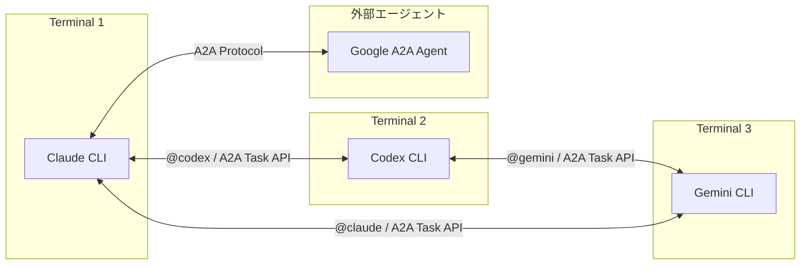
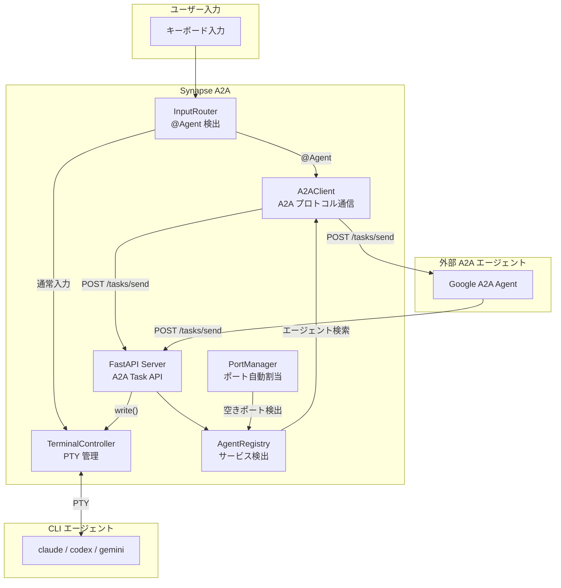

# Synapse A2A

**Google A2A プロトコル完全準拠の CLI エージェント間通信フレームワーク**

[](https://www.python.org/downloads/)
[](LICENSE)
[](#テスト)

> Claude Code / Codex / Gemini などの CLI エージェントを PTY でラップし、Google A2A プロトコルで相互通信を可能にするフレームワーク



---

## 主な特徴

- **Google A2A 完全準拠** - 全通信が Message/Part + Task 形式
- **CLI をそのまま活用** - 既存の CLI ツールを改造せずに連携
- **@Agent 記法** - 端末内で `@claude`, `@codex` のように直接指示（内部は A2A プロトコル）
- **Task API** - `/tasks/send`, `/tasks/send-priority` でタスクベース通信
- **Agent Card** - `/.well-known/agent.json` でエージェント発見
- **Priority Interrupt** - Priority 5 で処理を強制中断（Synapse 拡張）
- **外部エージェント連携** - 他の Google A2A エージェントと通信可能
- **マルチインスタンス対応** - 同じエージェントタイプを複数同時起動
- **ツール引数パススルー** - `--` 以降の引数を CLI ツールに透過的に渡す
- **エージェント健全性チェック** - 送信前にプロセス/ポートの生存確認

---

## 責務範囲

Synapse A2A は **CLI エージェント間の通信基盤** を提供します。

### Synapse A2A が提供するもの

| 機能           | 説明                                            |
| -------------- | ----------------------------------------------- |
| PTY ラッピング | CLI ツールを改造せずにエージェント化            |
| @Agent 記法    | 端末内でのエージェント間通信                    |
| A2A プロトコル | Message/Part + Task 形式の標準通信              |
| サービス発見   | `~/.a2a/registry/` によるエージェント検出       |
| 外部接続       | 他の A2A エージェントと接続するインターフェース |

### Synapse A2A が提供しないもの

| 機能                 | 説明                                 |
| -------------------- | ------------------------------------ |
| 認証/認可            | 外部システム（API Gateway 等）で処理 |
| 認証情報の保存       | 外部の認証基盤で管理                 |
| セキュリティポリシー | 運用環境に依存                       |

> **設計思想**: Synapse A2A は通信の仕組みに専念し、認証・セキュリティは信頼された環境（VPN、認証済みネットワーク等）で担保される前提で動作します。

---

## アーキテクチャ概要



### 主要コンポーネント

| コンポーネント         | 役割                                                        |
| ---------------------- | ----------------------------------------------------------- |
| **TerminalController** | PTY で CLI を起動・管理、IDLE/BUSY 状態を監視               |
| **InputRouter**        | `@Agent` パターンを検出し、A2AClient 経由で送信             |
| **A2AClient**          | ローカル・外部エージェントへの A2A プロトコル通信           |
| **AgentRegistry**      | `~/.a2a/registry/` にエージェント情報を登録・検索           |
| **PortManager**        | エージェントタイプごとのポート範囲管理・自動割当            |
| **FastAPI Server**     | A2A Task API を提供 (`/tasks/send`, `/tasks/send-priority`) |

---

## クイックスタート

### 1. インストール

```bash
# uv でインストール
uv sync

# または pip の場合
pip install -e .
```

### 2. エージェントを起動（別ターミナルで）

```bash
# Terminal 1: Claude (自動的に port 8100 を使用)
synapse claude

# Terminal 2: 2つ目の Claude (自動的に port 8101 を使用)
synapse claude

# Terminal 3: Gemini (自動的に port 8110 を使用)
synapse gemini
```

ポートは各エージェントタイプごとに自動で割り当てられます：

| エージェント     | ポート範囲  | 最大インスタンス |
| ---------------- | ----------- | ---------------- |
| Claude           | 8100-8109   | 10               |
| Gemini           | 8110-8119   | 10               |
| Codex            | 8120-8129   | 10               |
| Dummy (テスト用) | 8190-8199   | 10               |

明示的にポートを指定することも可能です：

```bash
synapse claude --port 8105
```

### 3. CLI ツールに引数を渡す

`--` セパレータ以降の引数は、元の CLI ツールにそのまま渡されます：

```bash
# Claude Code を --resume オプション付きで起動
synapse claude -- --resume

# Gemini を特定の設定で起動
synapse gemini --port 8115 -- --config custom.yaml

# バックグラウンドでツール引数付き起動
synapse start claude -- --resume --dangerously-skip-permissions
```

### 4. 端末内で @Agent を使う

```text
@codex この設計をレビューして
@gemini --response "APIの改善案を出して"
```

内部的には A2A プロトコル (`/tasks/send-priority`) で通信します。

### 5. HTTP API でメッセージ送信（推奨）

```bash
# A2A Task API（推奨）
curl -X POST http://localhost:8100/tasks/send \
  -H "Content-Type: application/json" \
  -d '{
    "message": {
      "role": "user",
      "parts": [{"type": "text", "text": "Hello Claude!"}]
    }
  }'

# Priority 付き（Synapse 拡張）
curl -X POST "http://localhost:8100/tasks/send-priority?priority=5" \
  -H "Content-Type: application/json" \
  -d '{
    "message": {
      "role": "user",
      "parts": [{"type": "text", "text": "処理を止めて!"}]
    }
  }'

# タスク状態確認
curl http://localhost:8100/tasks/{task_id}

# ステータス確認
curl http://localhost:8100/status
```

---

## CLI コマンドリファレンス

### ショートカット起動

```bash
# 最もシンプルな起動方法（ポート自動割当）
synapse claude
synapse gemini
synapse codex

# ポート指定
synapse claude --port 8105

# ツール引数付き
synapse claude -- --resume
```

### 標準コマンド

| コマンド                   | 説明                           |
| -------------------------- | ------------------------------ |
| `synapse start <profile>`  | バックグラウンドでエージェント起動 |
| `synapse stop <profile>`   | エージェント停止               |
| `synapse list`             | 実行中エージェント一覧         |
| `synapse logs <profile>`   | ログ表示                       |
| `synapse send <target>`    | メッセージ送信                 |

### start - バックグラウンド起動

```bash
# 基本的な起動
synapse start claude

# ポート指定
synapse start claude --port 8105

# フォアグラウンドで起動
synapse start claude --foreground

# ツール引数付き
synapse start claude -- --resume
```

### stop - エージェント停止

```bash
# 最も古いインスタンスを停止
synapse stop claude

# 全インスタンス停止
synapse stop claude --all
```

### list - エージェント一覧

```bash
synapse list
```

出力例：
```
TYPE       PORT     STATUS     PID      ENDPOINT
------------------------------------------------------------
claude     8100     IDLE       12345    http://localhost:8100
claude     8101     BUSY       12346    http://localhost:8101
gemini     8110     IDLE       12347    http://localhost:8110
```

プロセスが終了したエントリは自動的にクリーンアップされます。

### logs - ログ表示

```bash
# 最後の50行を表示
synapse logs claude

# 行数指定
synapse logs claude -n 100

# リアルタイム追跡（tail -f）
synapse logs claude -f
```

### send - メッセージ送信

```bash
# 基本的な送信
synapse send claude "こんにちは"

# 優先度指定（1-5、5は緊急停止）
synapse send claude "処理を止めて" --priority 5
```

---

## 外部エージェント管理

### external サブコマンド

| コマンド                        | 説明                     |
| ------------------------------- | ------------------------ |
| `synapse external add <url>`    | 外部エージェント登録     |
| `synapse external list`         | 外部エージェント一覧     |
| `synapse external remove <alias>` | 外部エージェント削除   |
| `synapse external send <alias>` | 外部エージェントへ送信   |
| `synapse external info <alias>` | 詳細情報表示             |

### 使用例

```bash
# 外部エージェントを発見して登録
synapse external add http://other-agent:9000 --alias other

# 登録済みエージェント一覧
synapse external list

# 詳細情報の確認
synapse external info other

# 外部エージェントにメッセージ送信
synapse external send other "タスクを処理して" --wait

# 外部エージェント削除
synapse external remove other
```

### @Agent で外部エージェントにメッセージ送信

```text
# ローカルエージェント（Synapse 管理）
@codex コードをレビューして

# 外部エージェント（事前に登録が必要）
@other タスクを処理して
```

---

## A2A CLI ツール

低レベルの A2A 通信には `synapse/tools/a2a.py` を直接使用できます。

### コマンド一覧

```bash
# エージェント一覧
python3 synapse/tools/a2a.py list

# 生存確認付きエージェント一覧（stale エントリ自動削除）
python3 synapse/tools/a2a.py list --live

# stale レジストリエントリのクリーンアップ
python3 synapse/tools/a2a.py cleanup

# メッセージ送信
python3 synapse/tools/a2a.py send --target claude --priority 1 "こんにちは"

# 緊急停止（Priority 5）
python3 synapse/tools/a2a.py send --target claude --priority 5 "処理を止めて"
```

### エージェント健全性チェック

`send` コマンドは送信前に以下の検証を行います：

1. **プロセス生存確認** - 登録された PID のプロセスが存在するか確認
2. **ポート到達確認** - A2A サーバーのポートが応答するか確認

問題がある場合は適切なエラーメッセージとヒントを表示：

```bash
$ python3 synapse/tools/a2a.py send --target claude "hello"
Error: Agent 'synapse-claude-8100' process (PID 12345) is no longer running.
  Hint: Remove stale registry with: rm ~/.a2a/registry/synapse-claude-8100.json
  (Registry entry has been automatically removed)
```

---

## API エンドポイント

### Google A2A 準拠（推奨）

| エンドポイント            | メソッド | 説明                                    |
| ------------------------- | -------- | --------------------------------------- |
| `/.well-known/agent.json` | GET      | Agent Card（エージェント発見用）        |
| `/tasks/send`             | POST     | タスク作成・メッセージ送信              |
| `/tasks/send-priority`    | POST     | Priority 付きタスク作成（Synapse 拡張） |
| `/tasks/{id}`             | GET      | タスク状態取得                          |
| `/tasks`                  | GET      | タスク一覧                              |
| `/tasks/{id}/cancel`      | POST     | タスクキャンセル                        |

### 外部エージェント管理

| エンドポイント                  | メソッド | 説明                   |
| ------------------------------- | -------- | ---------------------- |
| `/external/discover`            | POST     | 外部エージェント登録   |
| `/external/agents`              | GET      | 外部エージェント一覧   |
| `/external/agents/{alias}`      | GET      | エージェント詳細       |
| `/external/agents/{alias}`      | DELETE   | エージェント削除       |
| `/external/agents/{alias}/send` | POST     | 外部エージェントへ送信 |

### Synapse 互換（非推奨）

| エンドポイント | メソッド | 説明                                          |
| -------------- | -------- | --------------------------------------------- |
| `/message`     | POST     | **非推奨** - `/tasks/send` を使用してください |
| `/status`      | GET      | エージェント状態（IDLE/BUSY）                 |

---

## 通信フロー


---

## Priority（優先度）

| Priority | 動作                             | 用途                 |
| -------- | -------------------------------- | -------------------- |
| 1-4      | A2A Task として stdin に書き込み | 通常のメッセージ送信 |
| 5        | SIGINT 送信後に書き込み          | 緊急停止・強制介入   |

```bash
# 緊急停止の例（CLI ツール）
python3 synapse/tools/a2a.py send --target claude --priority 5 "処理を止めて"

# synapse send コマンド
synapse send claude "Stop!" --priority 5

# HTTP API
curl -X POST "http://localhost:8100/tasks/send-priority?priority=5" \
  -H "Content-Type: application/json" \
  -d '{"message": {"role": "user", "parts": [{"type": "text", "text": "Stop!"}]}}'
```

---

## レジストリとポート管理

### レジストリファイル

エージェント情報は `~/.a2a/registry/` に JSON ファイルとして保存されます：

```bash
~/.a2a/registry/
├── synapse-claude-8100.json
├── synapse-claude-8101.json
└── synapse-gemini-8110.json
```

### 自動クリーンアップ

以下の操作で stale エントリ（プロセスが終了したエントリ）は自動削除されます：

- `synapse list` 実行時
- `python3 synapse/tools/a2a.py list --live` 実行時
- `python3 synapse/tools/a2a.py cleanup` 実行時
- メッセージ送信時（対象が死んでいる場合）

### ポート自動割当

PortManager が各エージェントタイプの範囲内で空きポートを検出：

1. レジストリから同タイプの使用中ポートを取得
2. プロセス生存確認（死んでいれば stale エントリ削除）
3. ソケットバインドで実際のポート可用性を確認
4. 最初に見つかった空きポートを返却

```python
# 内部動作
PORT_RANGES = {
    "claude": (8100, 8109),
    "gemini": (8110, 8119),
    "codex": (8120, 8129),
    "dummy": (8190, 8199),
}
```

---

## Agent Card

各 Synapse エージェントは `/.well-known/agent.json` で Agent Card を公開します。

```bash
curl http://localhost:8100/.well-known/agent.json
```

```json
{
  "name": "Synapse Claude",
  "description": "PTY-wrapped claude CLI agent with A2A communication",
  "url": "http://localhost:8100",
  "version": "0.0.1",
  "capabilities": {
    "streaming": false,
    "pushNotifications": false,
    "multiTurn": true
  },
  "skills": [
    {
      "id": "chat",
      "name": "Chat",
      "description": "Send messages to the CLI agent"
    },
    {
      "id": "interrupt",
      "name": "Interrupt",
      "description": "Interrupt current processing (Synapse extension)"
    }
  ],
  "extensions": {
    "synapse": {
      "pty_wrapped": true,
      "priority_interrupt": true,
      "at_agent_syntax": true
    }
  }
}
```

---

## テスト

84 のテストケースで A2A プロトコル準拠を検証しています。

```bash
# 全テスト実行
pytest

# A2A 互換性テスト
pytest tests/test_a2a_compat.py -v

# サーバーテスト
pytest tests/test_server.py -v
```

---

## ドキュメント

詳細なドキュメントは `guides/` ディレクトリにあります。

| ドキュメント                                               | 内容                                    |
| ---------------------------------------------------------- | --------------------------------------- |
| [guides/README.md](guides/README.md)                       | ドキュメント一覧                        |
| [guides/multi-agent-setup.md](guides/multi-agent-setup.md) | マルチエージェントセットアップガイド    |
| [guides/usage.md](guides/usage.md)                         | 使い方詳細（CLI/HTTP/インタラクティブ） |
| [guides/profiles.md](guides/profiles.md)                   | プロファイル設定リファレンス            |
| [guides/architecture.md](guides/architecture.md)           | 内部アーキテクチャ詳細                  |
| [guides/troubleshooting.md](guides/troubleshooting.md)     | トラブルシューティング                  |
| [guides/references.md](guides/references.md)               | API・CLI リファレンス                   |
| [guides/google-a2a-spec.md](guides/google-a2a-spec.md)     | Google A2A プロトコルとの比較           |

---

## 既知の制約

- **TUI 描画の不安定さ**: Ink ベースの CLI（Claude Code など）で描画が乱れる場合があります
- **PTY の制限**: 一部の特殊な入力シーケンスは正しく処理されない場合があります
- **IDLE 検出**: `idle_regex` がプロンプトと一致しない場合、状態検出が不正確になります
- **Streaming 未対応**: 現在 streaming レスポンスには対応していません

詳細は [guides/troubleshooting.md](guides/troubleshooting.md) を参照してください。

---

## ライセンス

MIT License

---

## 関連リンク

- [Claude Code](https://claude.ai/code) - Anthropic の CLI エージェント
- [Google A2A Protocol](https://github.com/google/A2A) - Google の Agent-to-Agent プロトコル
