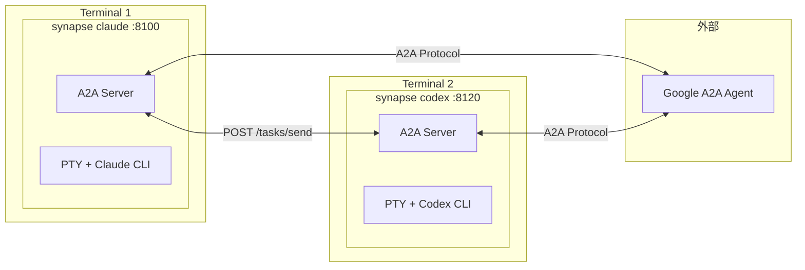
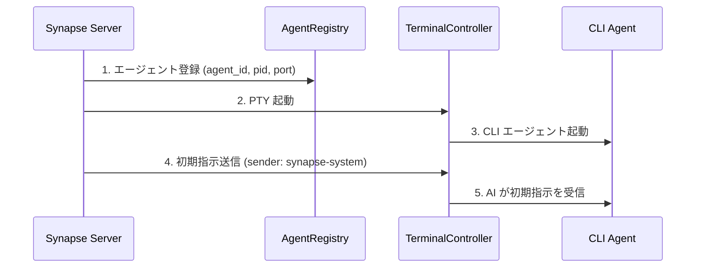
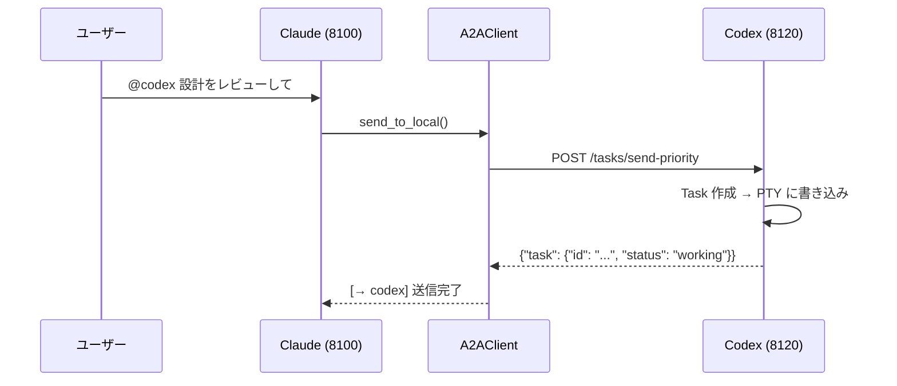
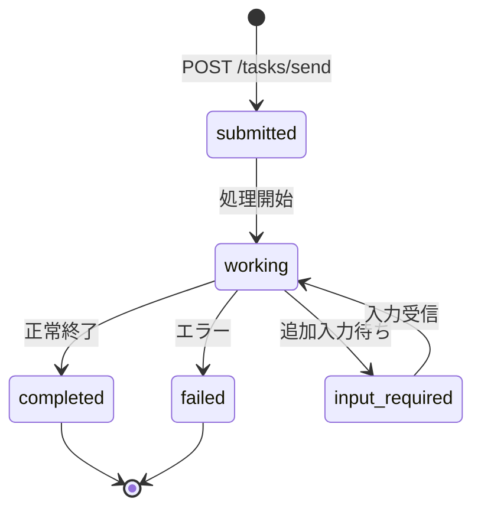

# Synapse A2A

**Google A2A プロトコル準拠の CLI エージェント間通信フレームワーク**

[](https://www.python.org/downloads/)
[](LICENSE)
[](#テスト)

> Claude Code / Codex / Gemini などの CLI エージェントを PTY でラップし、Google A2A プロトコルで相互通信を可能にするフレームワーク



---

## 目次

- [主な特徴](#主な特徴)
- [クイックスタート](#クイックスタート)
- [アーキテクチャ](#アーキテクチャ)
- [CLI コマンド](#cli-コマンド)
- [API エンドポイント](#api-エンドポイント)
- [Task 構造](#task-構造)
- [送信元識別](#送信元識別)
- [Priority（優先度）](#priority優先度)
- [Agent Card](#agent-card)
- [レジストリとポート管理](#レジストリとポート管理)
- [テスト](#テスト)
- [開発・リリース](#開発リリース)

---

## 主な特徴

| カテゴリ | 機能 |
|---------|------|
| **A2A 準拠** | 全通信が Message/Part + Task 形式、Agent Card による発見 |
| **CLI 連携** | 既存の CLI ツールを改造せずに A2A エージェント化 |
| **@Agent 記法** | `@claude`, `@codex-8120` で直接メッセージ送信 |
| **送信元識別** | `metadata.sender` + PID マッチングで送信元を自動識別 |
| **Priority Interrupt** | Priority 5 で SIGINT 送信後にメッセージ送信（緊急停止） |
| **マルチインスタンス** | 同じエージェントタイプを複数同時起動（ポート自動割当） |
| **外部連携** | 他の Google A2A エージェントとの通信 |

---

## クイックスタート

### 1. インストール

```bash
# uv でインストール（推奨）
uv sync

# または pip
pip install -e .
```

### 2. エージェントを起動

```bash
# Terminal 1: Claude
synapse claude

# Terminal 2: Codex
synapse codex

# Terminal 3: Gemini
synapse gemini
```

ポートは自動割当されます：

| エージェント | ポート範囲 |
|-------------|-----------|
| Claude      | 8100-8109 |
| Gemini      | 8110-8119 |
| Codex       | 8120-8129 |

### 3. エージェント間通信

端末内で `@Agent` を使ってメッセージ送信：

```text
@codex この設計をレビューして
@gemini APIの改善案を出して
```

複数インスタンスがある場合は `@type-port` 形式で指定：

```text
@codex-8120 こちらを担当して
@codex-8121 こちらを担当して
```

### 4. HTTP API

```bash
# メッセージ送信
curl -X POST http://localhost:8100/tasks/send \
  -H "Content-Type: application/json" \
  -d '{"message": {"role": "user", "parts": [{"type": "text", "text": "Hello!"}]}}'

# 緊急停止（Priority 5）
curl -X POST "http://localhost:8100/tasks/send-priority?priority=5" \
  -H "Content-Type: application/json" \
  -d '{"message": {"role": "user", "parts": [{"type": "text", "text": "Stop!"}]}}'
```

---

## アーキテクチャ

### A2A サーバー / クライアント構成

Synapse では **各エージェントが A2A サーバーとして動作** します。中央サーバーは存在せず、P2P 構成です。

```
┌─────────────────────────────────────┐    ┌─────────────────────────────────────┐
│  synapse claude (port 8100)         │    │  synapse codex (port 8120)          │
│  ┌───────────────────────────────┐  │    │  ┌───────────────────────────────┐  │
│  │  FastAPI Server (A2A Server)  │  │    │  │  FastAPI Server (A2A Server)  │  │
│  │  /.well-known/agent.json      │  │    │  │  /.well-known/agent.json      │  │
│  │  /tasks/send                  │◄─┼────┼──│  A2AClient                    │  │
│  │  /tasks/{id}                  │  │    │  └───────────────────────────────┘  │
│  └───────────────────────────────┘  │    │  ┌───────────────────────────────┐  │
│  ┌───────────────────────────────┐  │    │  │  PTY + Codex CLI              │  │
│  │  PTY + Claude CLI             │  │    │  └───────────────────────────────┘  │
│  └───────────────────────────────┘  │    └─────────────────────────────────────┘
└─────────────────────────────────────┘
```

各エージェントは：
- **A2A サーバー**: 他のエージェントからのリクエストを受け付ける
- **A2A クライアント**: 他のエージェントにリクエストを送信する

### 主要コンポーネント

| コンポーネント | ファイル | 役割 |
|---------------|---------|------|
| FastAPI Server | `synapse/server.py` | A2A エンドポイント提供 |
| A2A Router | `synapse/a2a_compat.py` | A2A プロトコル実装 |
| A2A Client | `synapse/a2a_client.py` | 他エージェントへの通信 |
| TerminalController | `synapse/controller.py` | PTY 管理、IDLE/BUSY 検出 |
| InputRouter | `synapse/input_router.py` | @Agent パターン検出 |
| AgentRegistry | `synapse/registry.py` | エージェント登録・検索 |

### 起動シーケンス



### 通信フロー



---

## CLI コマンド

### 基本操作

```bash
# エージェント起動（フォアグラウンド）
synapse claude
synapse codex
synapse gemini

# ポート指定
synapse claude --port 8105

# CLI ツールに引数を渡す
synapse claude -- --resume
```

### コマンド一覧

| コマンド | 説明 |
|---------|------|
| `synapse <profile>` | フォアグラウンドで起動 |
| `synapse start <profile>` | バックグラウンドで起動 |
| `synapse stop <profile>` | エージェント停止 |
| `synapse list` | 実行中エージェント一覧 |
| `synapse logs <profile>` | ログ表示 |
| `synapse send <target> <message>` | メッセージ送信 |

### 外部エージェント管理

```bash
# 外部エージェント登録
synapse external add http://other-agent:9000 --alias other

# 一覧表示
synapse external list

# メッセージ送信
synapse external send other "タスクを処理して"
```

### A2A CLI ツール

低レベル操作用：

```bash
# エージェント一覧
python3 synapse/tools/a2a.py list

# メッセージ送信
python3 synapse/tools/a2a.py send --target claude --priority 1 "Hello"

# 緊急停止
python3 synapse/tools/a2a.py send --target claude --priority 5 "Stop!"
```

---

## API エンドポイント

### A2A 準拠

| エンドポイント | メソッド | 説明 |
|---------------|---------|------|
| `/.well-known/agent.json` | GET | Agent Card |
| `/tasks/send` | POST | メッセージ送信 |
| `/tasks/send-priority` | POST | Priority 付き送信 |
| `/tasks/{id}` | GET | タスク状態取得 |
| `/tasks` | GET | タスク一覧 |
| `/tasks/{id}/cancel` | POST | タスクキャンセル |
| `/status` | GET | IDLE/BUSY 状態 |

### 外部エージェント

| エンドポイント | メソッド | 説明 |
|---------------|---------|------|
| `/external/discover` | POST | 外部エージェント登録 |
| `/external/agents` | GET | 一覧 |
| `/external/agents/{alias}` | DELETE | 削除 |
| `/external/agents/{alias}/send` | POST | 送信 |

---

## Task 構造

A2A プロトコルでは、全ての通信が **Task** として管理されます。

### Task ライフサイクル



### Task オブジェクト

```json
{
  "id": "550e8400-e29b-41d4-a716-446655440000",
  "context_id": "conversation-123",
  "status": "working",
  "message": {
    "role": "user",
    "parts": [
      {"type": "text", "text": "この設計をレビューして"}
    ]
  },
  "artifacts": [],
  "metadata": {
    "sender": {
      "sender_id": "synapse-claude-8100",
      "sender_type": "claude",
      "sender_endpoint": "http://localhost:8100"
    }
  },
  "created_at": "2024-01-15T10:30:00Z",
  "updated_at": "2024-01-15T10:30:05Z"
}
```

### フィールド説明

| フィールド | 型 | 説明 |
|-----------|-----|------|
| `id` | string | タスクの一意識別子（UUID） |
| `context_id` | string? | 会話コンテキスト ID（マルチターン用） |
| `status` | string | `submitted` / `working` / `completed` / `failed` / `input_required` |
| `message` | Message | 送信されたメッセージ |
| `artifacts` | Artifact[] | タスク完了時の成果物 |
| `metadata` | object | 送信元情報など（`metadata.sender`） |
| `created_at` | string | 作成日時（ISO 8601） |
| `updated_at` | string | 更新日時（ISO 8601） |

### Message 構造

```json
{
  "role": "user",
  "parts": [
    {"type": "text", "text": "メッセージ内容"},
    {"type": "file", "file": {"name": "doc.pdf", "mimeType": "application/pdf", "bytes": "..."}}
  ]
}
```

| Part タイプ | 説明 |
|------------|------|
| `text` | テキストメッセージ |
| `file` | ファイル添付 |
| `data` | 構造化データ |

### 初期指示 Task

エージェント起動時、Synapse は A2A Task として初期指示を送信します。

```json
{
  "id": "init-task-id",
  "status": "working",
  "message": {
    "role": "user",
    "parts": [{"type": "text", "text": "[Synapse A2A Protocol Instructions]\n\n..."}]
  },
  "metadata": {
    "sender": {
      "sender_id": "synapse-system",
      "sender_type": "system",
      "sender_endpoint": "http://localhost:8100"
    }
  }
}
```

PTY 出力形式：
```
[A2A:init1234:synapse-system] [Synapse A2A Protocol Instructions]

You are participating in a multi-agent environment connected via the Synapse A2A Protocol.

## Your Identity
- Agent ID: synapse-claude-8100
- Agent Type: claude
- Port: 8100

## How to Send Messages (@Agent)
...
```

初期指示には以下が含まれます：
- エージェントの identity（ID, type, port）
- @Agent でのメッセージ送信方法
- 利用可能な他のエージェント一覧
- 送信元識別と **返信方法**（`[A2A:task_id:sender_id]` から sender_id を抽出して返信）

---

## 送信元識別

A2A メッセージの送信元は `metadata.sender` で識別できます。

### PTY 出力形式

```
[A2A:<task_id>:<sender_id>] <message>
```

例：
```
[A2A:abc12345:synapse-claude-8100] この設計をレビューしてください
```

### Task API での確認

```bash
curl -s http://localhost:8120/tasks/{task_id} | jq '.metadata.sender'
```

レスポンス：
```json
{
  "sender_id": "synapse-claude-8100",
  "sender_type": "claude",
  "sender_endpoint": "http://localhost:8100"
}
```

### 仕組み

1. **送信時**: Registry を参照し、PID マッチングで自身の agent_id を特定
2. **Task 作成時**: `metadata.sender` に送信元情報を付与
3. **受信時**: PTY プレフィックスまたは Task API で確認

---

## Priority（優先度）

| Priority | 動作 | 用途 |
|----------|------|------|
| 1-4 | 通常の stdin 書き込み | 通常メッセージ |
| 5 | SIGINT 送信後に書き込み | 緊急停止 |

```bash
# 緊急停止
synapse send claude "Stop!" --priority 5
```

---

## Agent Card

各エージェントは `/.well-known/agent.json` で Agent Card を公開します。

```bash
curl http://localhost:8100/.well-known/agent.json
```

```json
{
  "name": "Synapse Claude",
  "description": "PTY-wrapped claude CLI agent with A2A communication",
  "url": "http://localhost:8100",
  "capabilities": {
    "streaming": false,
    "pushNotifications": false,
    "multiTurn": true
  },
  "skills": [
    {"id": "chat", "name": "Chat", "description": "Send messages to the CLI agent"},
    {"id": "interrupt", "name": "Interrupt", "description": "Interrupt current processing"}
  ],
  "extensions": {
    "synapse": {
      "agent_id": "synapse-claude-8100",
      "pty_wrapped": true,
      "priority_interrupt": true,
      "at_agent_syntax": true
    }
  }
}
```

### 設計思想

Agent Card は「名刺」として他者向け情報のみを含みます：
- capabilities, skills, endpoint など
- 内部指示は含まない（起動時に A2A Task で送信）

---

## レジストリとポート管理

### レジストリファイル

```
~/.a2a/registry/
├── synapse-claude-8100.json
├── synapse-claude-8101.json
└── synapse-gemini-8110.json
```

### 自動クリーンアップ

stale エントリは以下の操作で自動削除：
- `synapse list` 実行時
- メッセージ送信時（対象が死んでいる場合）

### ポート範囲

```python
PORT_RANGES = {
    "claude": (8100, 8109),
    "gemini": (8110, 8119),
    "codex": (8120, 8129),
    "dummy": (8190, 8199),
}
```

---

## テスト

218 のテストケースで A2A プロトコル準拠を検証：

```bash
# 全テスト
pytest

# 特定カテゴリ
pytest tests/test_a2a_compat.py -v
pytest tests/test_sender_identification.py -v
```

---

## 開発・リリース

### PyPI への公開

タグをプッシュすると GitHub Actions で自動的に PyPI へ公開されます。

```bash
# 1. pyproject.toml のバージョンを更新
# version = "0.2.0"

# 2. タグを作成してプッシュ
git tag v0.2.0
git push origin v0.2.0
```

### 手動公開

```bash
# uv でビルド・公開
uv build
uv publish
```

### ユーザーのインストール方法

```bash
# pipx（推奨）
pipx install synapse-a2a

# または pip
pip install synapse-a2a

# uvx で直接実行
uvx synapse-a2a claude
```

---

## 既知の制約

- **TUI 描画**: Ink ベースの CLI で描画が乱れる場合あり
- **PTY 制限**: 一部の特殊入力シーケンスは未対応
- **Streaming**: 未対応

---

## ドキュメント

| パス | 内容 |
|-----|------|
| [guides/usage.md](guides/usage.md) | 使い方詳細 |
| [guides/architecture.md](guides/architecture.md) | アーキテクチャ詳細 |
| [guides/troubleshooting.md](guides/troubleshooting.md) | トラブルシューティング |
| [docs/project-philosophy.md](docs/project-philosophy.md) | 設計思想 |

---

## ライセンス

MIT License

---

## 関連リンク

- [Claude Code](https://claude.ai/code) - Anthropic の CLI エージェント
- [Google A2A Protocol](https://github.com/google/A2A) - Agent-to-Agent プロトコル
