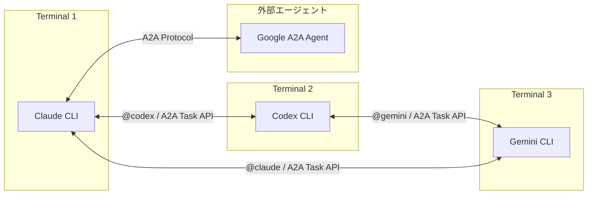
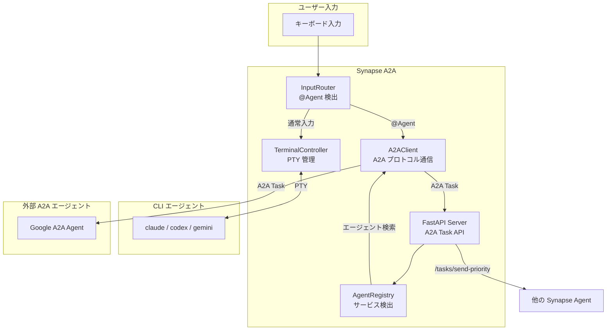
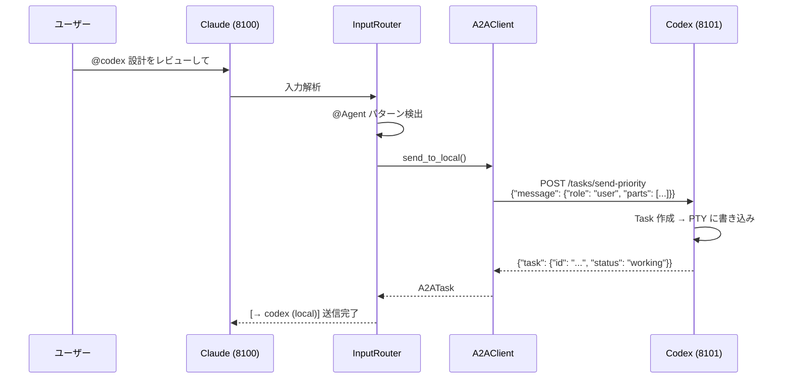

# Synapse A2A

**Google A2A プロトコル完全準拠の CLI エージェント間通信フレームワーク**

[](https://www.python.org/downloads/)
[](LICENSE)
[](#テスト)

> Claude Code / Codex / Gemini などの CLI エージェントを PTY でラップし、Google A2A プロトコルで相互通信を可能にするフレームワーク



---

## 主な特徴

- **Google A2A 完全準拠** - 全通信が Message/Part + Task 形式
- **CLI をそのまま活用** - 既存の CLI ツールを改造せずに連携
- **@Agent 記法** - 端末内で `@claude`, `@codex` のように直接指示（内部は A2A プロトコル）
- **Task API** - `/tasks/send`, `/tasks/send-priority` でタスクベース通信
- **Agent Card** - `/.well-known/agent.json` でエージェント発見
- **Priority Interrupt** - Priority 5 で処理を強制中断（Synapse 拡張）
- **外部エージェント連携** - 他の Google A2A エージェントと通信可能

---

## アーキテクチャ概要



### 主要コンポーネント

| コンポーネント | 役割 |
|---------------|------|
| **TerminalController** | PTY で CLI を起動・管理、IDLE/BUSY 状態を監視 |
| **InputRouter** | `@Agent` パターンを検出し、A2AClient 経由で送信 |
| **A2AClient** | ローカル・外部エージェントへの A2A プロトコル通信 |
| **AgentRegistry** | `~/.a2a/registry/` にエージェント情報を登録・検索 |
| **FastAPI Server** | A2A Task API を提供 (`/tasks/send`, `/tasks/send-priority`) |

---

## クイックスタート

### 1. インストール

```bash
# uv でインストール
uv sync

# または pip の場合
pip install -e .
```

### 2. エージェントを起動（別ターミナルで）

```bash
# Terminal 1: Claude (port 8100)
synapse claude

# Terminal 2: Codex (port 8101)
synapse codex

# Terminal 3: Gemini (port 8102)
synapse gemini
```

### 3. 端末内で @Agent を使う

```text
@codex この設計をレビューして
@gemini --response "APIの改善案を出して"
```

内部的には A2A プロトコル (`/tasks/send-priority`) で通信します。

### 4. HTTP API でメッセージ送信（推奨）

```bash
# A2A Task API（推奨）
curl -X POST http://localhost:8100/tasks/send \
  -H "Content-Type: application/json" \
  -d '{
    "message": {
      "role": "user",
      "parts": [{"type": "text", "text": "Hello Claude!"}]
    }
  }'

# Priority 付き（Synapse 拡張）
curl -X POST "http://localhost:8100/tasks/send-priority?priority=5" \
  -H "Content-Type: application/json" \
  -d '{
    "message": {
      "role": "user",
      "parts": [{"type": "text", "text": "処理を止めて!"}]
    }
  }'

# タスク状態確認
curl http://localhost:8100/tasks/{task_id}

# ステータス確認
curl http://localhost:8100/status
```

---

## API エンドポイント

### Google A2A 準拠（推奨）

| エンドポイント | メソッド | 説明 |
|---------------|----------|------|
| `/.well-known/agent.json` | GET | Agent Card（エージェント発見用） |
| `/tasks/send` | POST | タスク作成・メッセージ送信 |
| `/tasks/send-priority` | POST | Priority 付きタスク作成（Synapse 拡張） |
| `/tasks/{id}` | GET | タスク状態取得 |
| `/tasks` | GET | タスク一覧 |
| `/tasks/{id}/cancel` | POST | タスクキャンセル |

### 外部エージェント管理

| エンドポイント | メソッド | 説明 |
|---------------|----------|------|
| `/external/discover` | POST | 外部エージェント登録 |
| `/external/agents` | GET | 外部エージェント一覧 |
| `/external/agents/{alias}` | GET | エージェント詳細 |
| `/external/agents/{alias}` | DELETE | エージェント削除 |
| `/external/agents/{alias}/send` | POST | 外部エージェントへ送信 |

### Synapse 互換（非推奨）

| エンドポイント | メソッド | 説明 |
|---------------|----------|------|
| `/message` | POST | **非推奨** - `/tasks/send` を使用してください |
| `/status` | GET | エージェント状態（IDLE/BUSY） |

---

## 通信フロー



---

## Priority（優先度）

| Priority | 動作 | 用途 |
|----------|------|------|
| 1-4 | A2A Task として stdin に書き込み | 通常のメッセージ送信 |
| 5 | SIGINT 送信後に書き込み | 緊急停止・強制介入 |

```bash
# 緊急停止の例（CLI ツール）
python3 synapse/tools/a2a.py send --target claude --priority 5 "処理を止めて"

# HTTP API
curl -X POST "http://localhost:8100/tasks/send-priority?priority=5" \
  -H "Content-Type: application/json" \
  -d '{"message": {"role": "user", "parts": [{"type": "text", "text": "Stop!"}]}}'
```

---

## デフォルトポート

| エージェント | ポート |
|-------------|--------|
| Claude | 8100 |
| Codex | 8101 |
| Gemini | 8102 |
| Dummy (テスト用) | 8199 |

---

## 外部エージェント連携

Synapse A2A は他の Google A2A 互換エージェントと連携できます。

### 外部エージェントの登録

```bash
# 外部エージェントを発見して登録
synapse external add http://other-agent:9000 --alias other

# 登録済みエージェント一覧
synapse external list

# 詳細情報の確認
synapse external info other
```

### @Agent で外部エージェントにメッセージ送信

```text
# ローカルエージェント（Synapse 管理）
@codex コードをレビューして

# 外部エージェント（事前に登録が必要）
@other タスクを処理して
```

### HTTP API での外部エージェント管理

```bash
# 外部エージェントを発見・登録
curl -X POST http://localhost:8100/external/discover \
  -H "Content-Type: application/json" \
  -d '{"url": "http://other-agent:9000", "alias": "other"}'

# 外部エージェントにメッセージ送信
curl -X POST http://localhost:8100/external/agents/other/send \
  -H "Content-Type: application/json" \
  -d '{"message": "Hello!", "wait_for_completion": true}'
```

---

## Agent Card

各 Synapse エージェントは `/.well-known/agent.json` で Agent Card を公開します。

```bash
curl http://localhost:8100/.well-known/agent.json
```

```json
{
  "name": "Synapse Claude",
  "description": "PTY-wrapped claude CLI agent with A2A communication",
  "url": "http://localhost:8100",
  "version": "1.0.0",
  "capabilities": {
    "streaming": false,
    "pushNotifications": false,
    "multiTurn": true
  },
  "skills": [
    {
      "id": "chat",
      "name": "Chat",
      "description": "Send messages to the CLI agent"
    },
    {
      "id": "interrupt",
      "name": "Interrupt",
      "description": "Interrupt current processing (Synapse extension)"
    }
  ],
  "extensions": {
    "synapse": {
      "pty_wrapped": true,
      "priority_interrupt": true,
      "at_agent_syntax": true
    }
  }
}
```

---

## テスト

84 のテストケースで A2A プロトコル準拠を検証しています。

```bash
# 全テスト実行
pytest

# A2A 互換性テスト
pytest tests/test_a2a_compat.py -v

# サーバーテスト
pytest tests/test_server.py -v
```

---

## ドキュメント

詳細なドキュメントは `guides/` ディレクトリにあります。

| ドキュメント | 内容 |
|-------------|------|
| [guides/README.md](guides/README.md) | ドキュメント一覧 |
| [guides/multi-agent-setup.md](guides/multi-agent-setup.md) | マルチエージェントセットアップガイド |
| [guides/usage.md](guides/usage.md) | 使い方詳細（CLI/HTTP/インタラクティブ） |
| [guides/profiles.md](guides/profiles.md) | プロファイル設定リファレンス |
| [guides/architecture.md](guides/architecture.md) | 内部アーキテクチャ詳細 |
| [guides/troubleshooting.md](guides/troubleshooting.md) | トラブルシューティング |
| [guides/references.md](guides/references.md) | API・CLI リファレンス |
| [guides/google-a2a-spec.md](guides/google-a2a-spec.md) | Google A2A プロトコルとの比較 |

---

## 既知の制約

- **TUI 描画の不安定さ**: Ink ベースの CLI（Claude Code など）で描画が乱れる場合があります
- **PTY の制限**: 一部の特殊な入力シーケンスは正しく処理されない場合があります
- **IDLE 検出**: `idle_regex` がプロンプトと一致しない場合、状態検出が不正確になります
- **Streaming 未対応**: 現在 streaming レスポンスには対応していません

詳細は [guides/troubleshooting.md](guides/troubleshooting.md) を参照してください。

---

## ライセンス

MIT License

---

## 関連リンク

- [Claude Code](https://claude.ai/code) - Anthropic の CLI エージェント
- [Google A2A Protocol](https://github.com/google/A2A) - Google の Agent-to-Agent プロトコル
