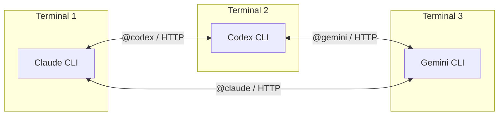
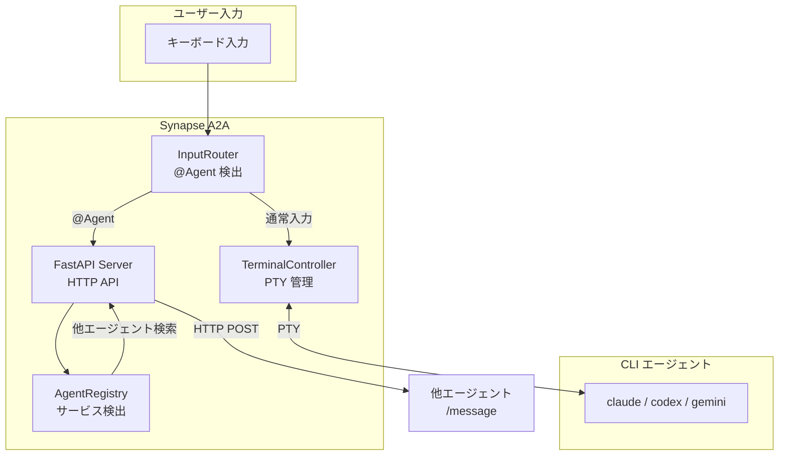
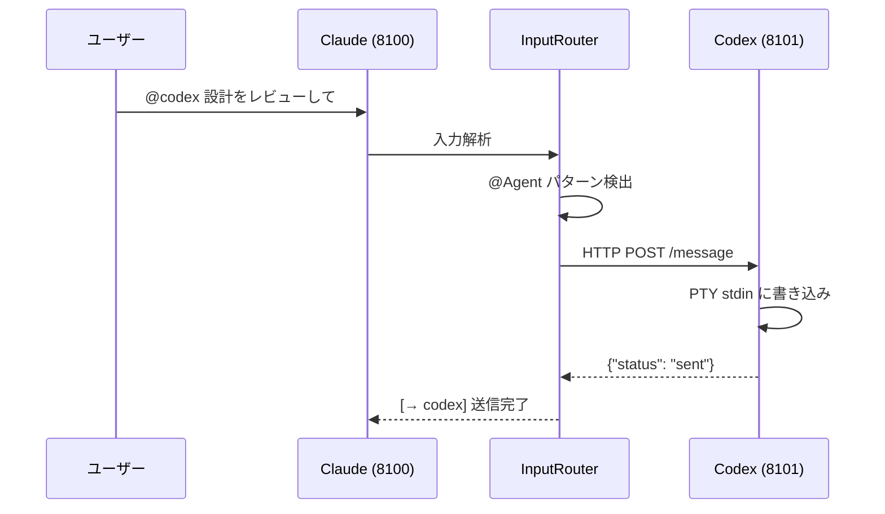

# Synapse A2A

**CLI エージェント間通信フレームワーク**

[](https://www.python.org/downloads/)
[](LICENSE)

> Claude Code / Codex / Gemini などの CLI エージェントを PTY でラップし、`@Agent` 形式のメッセージで相互通信を可能にするフレームワーク



---

## 主な特徴

- **CLI をそのまま活用** - 既存の CLI ツールを改造せずに連携
- **@Agent 記法** - 端末内で `@claude`, `@codex` のように直接指示
- **HTTP API** - REST API 経由でプログラムから制御可能
- **ファイルベース Registry** - `~/.a2a/registry/` で自動的にサービス検出
- **IDLE/BUSY 状態管理** - 正規表現でエージェントの待機状態を検出

---

## アーキテクチャ概要



### 主要コンポーネント

| コンポーネント | 役割 |
|---------------|------|
| **TerminalController** | PTY で CLI を起動・管理、IDLE/BUSY 状態を監視 |
| **InputRouter** | `@Agent` パターンを検出し、A2A 通信にルーティング |
| **AgentRegistry** | `~/.a2a/registry/` にエージェント情報を登録・検索 |
| **FastAPI Server** | `/message` と `/status` エンドポイントを提供 |

---

## クイックスタート

### 1. インストール

```bash
# 依存関係のインストール
pip install -r requirements.txt

# CLI として使う場合
pip install -e .
```

### 2. エージェントを起動（別ターミナルで）

```bash
# Terminal 1: Claude (port 8100)
synapse claude

# Terminal 2: Codex (port 8101)
synapse codex

# Terminal 3: Gemini (port 8102)
synapse gemini
```

### 3. 端末内で @Agent を使う

```text
@codex この設計をレビューして
@gemini --response "APIの改善案を出して"
```

### 4. HTTP API でメッセージ送信

```bash
# メッセージ送信
curl -X POST http://localhost:8100/message \
  -H "Content-Type: application/json" \
  -d '{"content": "Hello Claude!", "priority": 1}'

# ステータス確認
curl http://localhost:8100/status
```

---

## デフォルトポート

| エージェント | ポート |
|-------------|--------|
| Claude | 8100 |
| Codex | 8101 |
| Gemini | 8102 |
| Dummy (テスト用) | 8199 |

---

## ドキュメント

詳細なドキュメントは `guides/` ディレクトリにあります。

| ドキュメント | 内容 |
|-------------|------|
| [guides/README.md](guides/README.md) | ドキュメント一覧 |
| [guides/multi-agent-setup.md](guides/multi-agent-setup.md) | マルチエージェントセットアップガイド |
| [guides/usage.md](guides/usage.md) | 使い方詳細（CLI/HTTP/インタラクティブ） |
| [guides/profiles.md](guides/profiles.md) | プロファイル設定リファレンス |
| [guides/architecture.md](guides/architecture.md) | 内部アーキテクチャ詳細 |
| [guides/troubleshooting.md](guides/troubleshooting.md) | トラブルシューティング |
| [guides/references.md](guides/references.md) | API・CLI リファレンス |
| [guides/google-a2a-spec.md](guides/google-a2a-spec.md) | Google A2A プロトコルとの比較 |

---

## 通信フロー



---

## Priority（優先度）

| Priority | 動作 | 用途 |
|----------|------|------|
| 1-4 | stdin に書き込み | 通常のメッセージ送信 |
| 5 | SIGINT 送信後に書き込み | 緊急停止・強制介入 |

```bash
# 緊急停止の例
synapse send --target claude --priority 5 "処理を止めて"
```

---

## 既知の制約

- **TUI 描画の不安定さ**: Ink ベースの CLI（Claude Code など）で描画が乱れる場合があります
- **PTY の制限**: 一部の特殊な入力シーケンスは正しく処理されない場合があります
- **IDLE 検出**: `idle_regex` がプロンプトと一致しない場合、状態検出が不正確になります

詳細は [guides/troubleshooting.md](guides/troubleshooting.md) を参照してください。

---

## Google A2A プロトコルについて

> **注意**: このプロジェクトは Google が 2025 年 4 月に発表した A2A プロトコルとは**異なる実装**です。

Synapse A2A は PTY ラッピングによる CLI 統合に特化していますが、Google A2A は JSON-RPC 2.0 ベースの標準プロトコルです。詳細な比較は [guides/google-a2a-spec.md](guides/google-a2a-spec.md) を参照してください。

---

## ライセンス

MIT License

---

## 関連リンク

- [Claude Code](https://claude.ai/code) - Anthropic の CLI エージェント
- [Google A2A Protocol](https://github.com/google/A2A) - Google の Agent-to-Agent プロトコル
