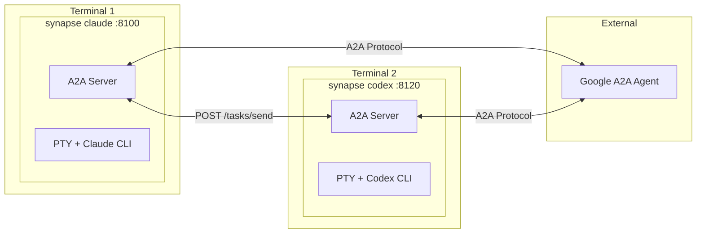
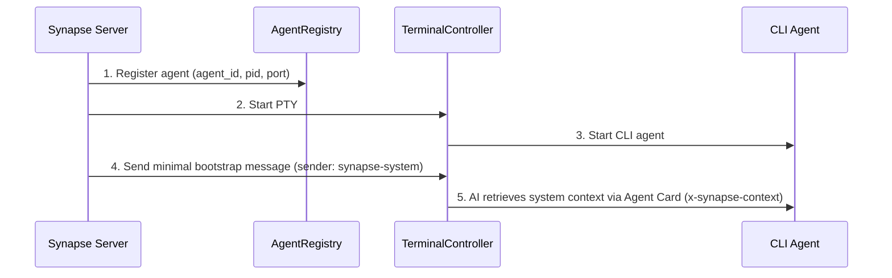
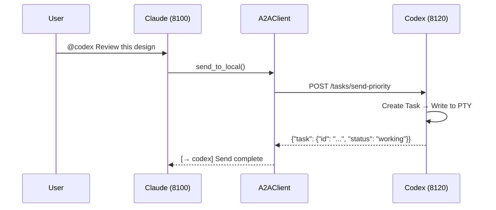
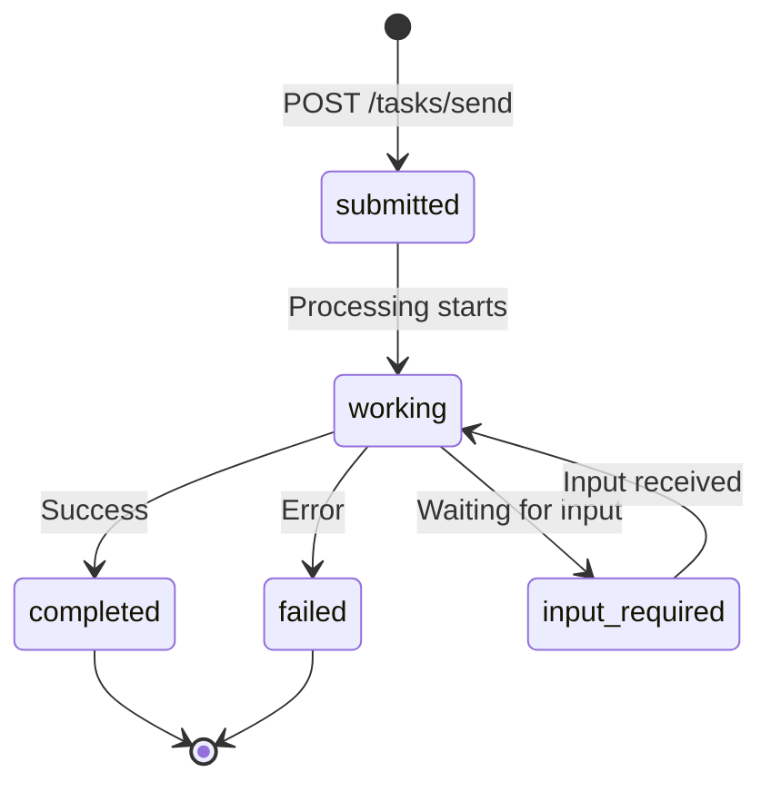
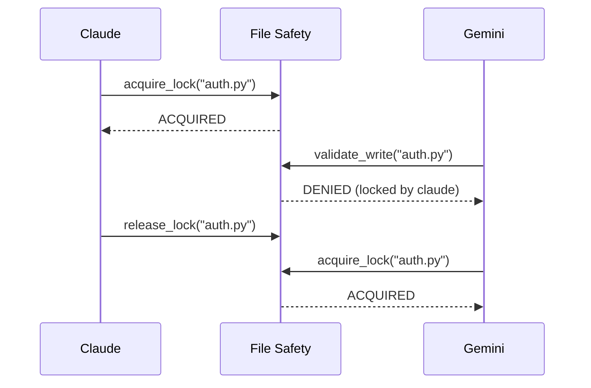

# Synapse A2A

**🌐 Language: English | [日本語](README.ja.md) | [中文](README.zh.md) | [한국어](README.ko.md) | [Español](README.es.md) | [Français](README.fr.md)**

> **Enable agents to collaborate on tasks without changing their behavior**

[](https://www.python.org/downloads/)
[](LICENSE)
[](#testing)
[](https://deepwiki.com/s-hiraoku/synapse-a2a)

> A framework that enables inter-agent collaboration via the Google A2A Protocol while keeping CLI agents (Claude Code, Codex, Gemini, OpenCode, GitHub Copilot CLI) **exactly as they are**

## Project Goals

```text
┌─────────────────────────────────────────────────────────────────┐
│  ✅ Non-Invasive: Don't change agent behavior                   │
│  ✅ Collaborative: Enable agents to work together               │
│  ✅ Transparent: Maintain existing workflows                    │
└─────────────────────────────────────────────────────────────────┘
```

Synapse A2A **transparently wraps** each agent's input/output without modifying the agent itself. This means:

- **Leverage each agent's strengths**: Users can freely assign roles and specializations
- **Zero learning curve**: Continue using existing workflows
- **Future-proof**: Resistant to agent updates

See [Project Philosophy](docs/project-philosophy.md) for details.


```mermaid
flowchart LR
    subgraph Terminal1["Terminal 1"]
        subgraph Agent1["synapse claude :8100"]
            Server1["A2A Server"]
            PTY1["PTY + Claude CLI"]
        end
    end
    subgraph Terminal2["Terminal 2"]
        subgraph Agent2["synapse codex :8120"]
            Server2["A2A Server"]
            PTY2["PTY + Codex CLI"]
        end
    end
    subgraph External["External"]
        ExtAgent["Google A2A Agent"]
    end

    Server1 <-->|"POST /tasks/send"| Server2
    Server1 <-->|"A2A Protocol"| ExtAgent
    Server2 <-->|"A2A Protocol"| ExtAgent
```

---

## Table of Contents

- [Features](#features)
- [Prerequisites](#prerequisites)
- [Quick Start](#quick-start)
- [Use Cases](#use-cases)
- [Skills](#skills)
- [Documentation](#documentation)
- [Architecture](#architecture)
- [CLI Commands](#cli-commands)
- [API Endpoints](#api-endpoints)
- [Task Structure](#task-structure)
- [Sender Identification](#sender-identification)
- [Priority Levels](#priority-levels)
- [Agent Card](#agent-card)
- [Registry and Port Management](#registry-and-port-management)
- [File Safety](#file-safety)
- [Agent Monitor](#agent-monitor)
- [CI Automation (Claude Code)](#ci-automation-claude-code)
- [Testing](#testing)
- [Configuration (.synapse)](#configuration-synapse)
- [Development & Release](#development--release)

---

## Features

| Category | Feature |
| -------- | ------- |
| **A2A Compliant** | All communication uses Message/Part + Task format, Agent Card discovery |
| **Agent Card Context Extension** | Pass system context (ID, routing rules, other agents) via `x-synapse-context` to keep PTY clean |
| **CLI Integration** | Turn existing CLI tools into A2A agents without modification |
| **synapse send** | Send messages between agents via `synapse send <agent> "message"` |
| **Sender Identification** | Auto-identify sender via `SYNAPSE_AGENT_ID` env var → `metadata.sender` + PID matching (process ancestry, fallback) |
| **Readiness Gate** | `/tasks/send` returns 503 until agent initialization completes; priority 5 and replies bypass |
| **Priority Interrupt** | Priority 5 sends SIGINT before message (emergency stop) |
| **Multi-Instance** | Run multiple agents of the same type (automatic port assignment) |
| **External Integration** | Communicate with other Google A2A agents |
| **File Safety** | Prevent multi-agent conflicts with file locking and change tracking (visible in `synapse list`) |
| **Agent Naming** | Custom names and roles for easy identification (`synapse send my-claude "hello"`) |
| **Agent Monitor** | Real-time status (READY/WAITING/PROCESSING/DONE), CURRENT task preview, terminal jump |
| **Task History** | Automatic task tracking with search, export, and statistics (enabled by default) |
| **Shared Task Board** | SQLite-based task coordination with dependency tracking, priority, fail/reopen lifecycle (`synapse tasks`) |
| **Quality Gates** | Configurable hooks (`on_idle`, `on_task_completed`) that control status transitions |
| **Plan Approval** | Plan-mode workflow with `synapse approve/reject` for human-in-the-loop review |
| **Graceful Shutdown** | `synapse kill` sends shutdown request before SIGTERM (30s timeout, `-f` for force) |
| **Delegate Mode** | `--delegate-mode` makes an agent a manager that delegates instead of editing files |
| **Auto-Spawn Panes** | `synapse team start` — 1st agent takes over current terminal, others in new panes. `--all-new` to start all in new panes. Supports `profile:name:role:skill_set:port` spec (tmux/iTerm2/Terminal.app/Ghostty/zellij) |
| **Soft Interrupt** | `synapse interrupt <target> "message"` — Ergonomic shorthand for `synapse send -p 4 --silent` to quickly interrupt an agent |
| **Token/Cost Tracking** | Skeleton for per-agent token usage tracking; `synapse history stats` shows TOKEN USAGE section when data exists |
| **Saved Agent Definitions** | `synapse agents add/list/show/delete` — Save reusable agent templates (profile + name + role + skill set) with persistent **Agent IDs**. `synapse spawn` accepts Agent IDs/names in addition to profile names |
| **Spawn Single Agent** | `synapse spawn <profile\|saved-agent>` — Spawn a single agent in a new terminal pane or window. Accepts profile names or saved agent IDs/names. Use `--worktree` / `-w` for Synapse-native git worktree isolation (all agents, `.synapse/worktrees/`). Legacy `-- --worktree` also supported for Claude Code only |
| **CI Automation** | PostToolUse hooks detect `git push`/`gh pr create` and auto-poll CI status, merge conflicts, and CodeRabbit reviews. Skills: `/check-ci`, `/fix-ci`, `/fix-conflict`, `/fix-review` |
| **Learning Mode** | Two independent flags: `SYNAPSE_LEARNING_MODE_ENABLED=true` enables Prompt Improvement section; `SYNAPSE_LEARNING_MODE_TRANSLATION=true` enables JP-to-EN Learning section. Either flag activates `learning.md` injection and Tips. Response uses normal formatting (no separators); structured formatting (━━━ separators, section headers) applies only to feedback sections (Prompt Improvement, JP-to-EN Learning, Tips) |
| **Proactive Mode** | `SYNAPSE_PROACTIVE_MODE_ENABLED=true` makes agents mandatorily use ALL Synapse features (task board, shared memory, canvas, file safety, delegation, broadcast) for every task regardless of size. Follows the learning_mode pattern: env var activation + `.synapse/proactive.md` instruction file appended at startup. Off by default |
| **Shared Memory** | Project-local SQLite knowledge base for cross-agent knowledge sharing. Agents save, search, and retrieve learned knowledge across sessions (`synapse memory save/list/search/show/delete/stats`). API endpoints at `/memory/*`. Enabled by default (`SYNAPSE_SHARED_MEMORY_ENABLED=true`) |
| **Session Save/Restore** | Save running team configurations as named snapshots and restore them later (`synapse session save/list/show/restore/delete/sessions`). Each agent's CLI conversation `session_id` is automatically captured and stored in the registry at startup. Restoring with `--resume` uses the saved `session_id` to resume each agent's conversation history, with an automatic 10-second timeout fallback if resume fails (see the Resume Mode section in the guide for details) |
| **Workflow** | Define reusable YAML-based message sequences and execute them with `synapse workflow run`. Each workflow is a named list of steps (target, message, priority, response_mode). Supports `--dry-run` to preview and `--continue-on-error` for resilient execution. Stored in `.synapse/workflows/` (project) or `~/.synapse/workflows/` (user) |
| **Proactive Collaboration** | Agents automatically evaluate collaboration opportunities before starting tasks. Built-in decision framework: do-it-yourself, delegate, ask-for-help, report-progress, share-knowledge. **Mandatory Collaboration Gate**: tasks with 3+ phases or 10+ file changes MUST go through an Agent Assignment Plan before coding begins. Cross-model spawning preference distributes token usage and avoids rate limits. Worker agents can also spawn/delegate (not just managers). Mandatory cleanup of spawned agents (`synapse kill <name> -f`) |

---

## Prerequisites

- **OS**: macOS / Linux (Windows via WSL2 recommended)
- **Python**: 3.10+
- **CLI Tools**: Pre-install and configure the agents you want to use:
  - [Claude Code](https://docs.anthropic.com/en/docs/claude-code)
  - [Codex CLI](https://github.com/openai/codex)
  - [Gemini CLI](https://github.com/google-gemini/gemini-cli)
  - [OpenCode](https://github.com/opencode-ai/opencode)
  - [GitHub Copilot CLI](https://docs.github.com/en/copilot/github-copilot-in-the-cli)

---

## Quick Start

### 1. Install Synapse A2A

<details>
<summary><b>macOS / Linux / WSL2 (recommended)</b></summary>

```bash
# pipx (recommended)
pipx install synapse-a2a

# Or run directly with uvx (no install)
uvx synapse-a2a claude
```

</details>

<details>
<summary><b>Windows</b></summary>

> **WSL2 is strongly recommended.** Synapse A2A uses `pty.spawn()` which requires a Unix-like terminal.

```bash
# Inside WSL2 — same as Linux
pipx install synapse-a2a

# Scoop (experimental, WSL2 still required for pty)
scoop bucket add synapse-a2a https://github.com/s-hiraoku/scoop-synapse-a2a
scoop install synapse-a2a
```

</details>

<details>
<summary><b>Developer (from source)</b></summary>

```bash
# Install with uv
uv sync

# Or pip (editable)
pip install -e .
```

</details>

**With gRPC support:**

```bash
pip install "synapse-a2a[grpc]"
```

### 2. Install Skills (Recommended)

**Installing skills is strongly recommended to get the most out of Synapse A2A.**

Skills help Claude automatically understand Synapse A2A features: @agent messaging, File Safety, and more.

```bash
# Install via skills.sh (https://skills.sh/)
npx skills add s-hiraoku/synapse-a2a
```

See [Skills](#skills) for details.

### 3. Start Agents

```bash
# Terminal 1: Claude
synapse claude

# Terminal 2: Codex
synapse codex

# Terminal 3: Gemini
synapse gemini

# Terminal 4: OpenCode
synapse opencode

# Terminal 5: GitHub Copilot CLI
synapse copilot
```

> Note: If terminal scrollback display is garbled, try:
> ```bash
> uv run synapse gemini
> # or
> uv run python -m synapse.cli gemini
> ```

Ports are auto-assigned:

| Agent    | Port Range |
| -------- | ---------- |
| Claude   | 8100-8109  |
| Gemini   | 8110-8119  |
| Codex    | 8120-8129  |
| OpenCode | 8130-8139  |
| Copilot  | 8140-8149  |

### 4. Inter-Agent Communication

Use `synapse send` to send messages between agents. The `--from` flag is optional -- Synapse auto-detects the sender from `SYNAPSE_AGENT_ID` (set at startup):

```bash
synapse send codex "Please review this design"
synapse send gemini "Suggest API improvements"
```

For multiple instances of the same type, use type-port format:

```bash
synapse send codex-8120 "Handle this task"
synapse send codex-8121 "Handle that task"
```

### 5. HTTP API

```bash
# Send message
curl -X POST http://localhost:8100/tasks/send \
  -H "Content-Type: application/json" \
  -d '{"message": {"role": "user", "parts": [{"type": "text", "text": "Hello!"}]}}'

# Emergency stop (Priority 5)
curl -X POST "http://localhost:8100/tasks/send-priority?priority=5" \
  -H "Content-Type: application/json" \
  -d '{"message": {"role": "user", "parts": [{"type": "text", "text": "Stop!"}]}}'
```

---

## Use Cases

### 1. Instant Specification Lookup (Simple)
While coding with **Claude**, quickly query **Gemini** (better at web search) for the latest library specs or error info without context switching.

```bash
# In Claude's terminal:
synapse send gemini "Summarize the new f-string features in Python 3.12"
```

### 2. Cross-Review Designs (Intermediate)
Get feedback on your design from agents with different perspectives.

```bash
# After Claude drafts a design:
synapse send gemini "Critically review this design from scalability and maintainability perspectives"
```

### 3. TDD Pair Programming (Intermediate)
Separate "test writer" and "implementer" for robust code.

```bash
# Terminal 1 (Codex):
Create unit tests for auth.py - normal case and token expiration case.

# Terminal 2 (Claude):
synapse send codex-8120 "Implement auth.py to pass the tests you created"
```

### 4. Security Audit (Specialized)
Have an agent with a security expert role audit your code before committing.

```bash
# Give Gemini a role:
You are a security engineer. Review only for vulnerabilities (SQLi, XSS, etc.)

# After writing code:
synapse send gemini "Audit the current changes (git diff)"
```

### 5. Auto-Fix from Error Logs (Advanced)
Pass error logs to an agent for automatic fix suggestions.

```bash
# Tests failed...
pytest > error.log

# Ask agent to fix
synapse send claude "Read error.log and fix the issue in synapse/server.py"
```

### 6. Language/Framework Migration (Advanced)
Distribute large refactoring work across agents.

```bash
# Terminal 1 (Claude):
Read legacy_api.js and create TypeScript type definitions

# Terminal 2 (Codex):
synapse send claude "Use the type definitions you created to rewrite legacy_api.js to src/new_api.ts"
```

### 7. Proactive Collaboration with Cross-Model Spawning (Advanced)

Agents proactively assess when to delegate, spawn helpers, or share knowledge. The collaboration framework encourages cross-model spawning to distribute token usage across providers and avoid rate limits.

```bash
# Manager spawns a different model type for a subtask (cross-model preference)
synapse spawn gemini --worktree --name Tester --role "test writer"

# Worker agent discovers work outside its scope and delegates
synapse send Tester "Write integration tests for auth module" --silent

# Share discoveries via shared memory for all agents to use
synapse memory save auth-pattern "OAuth2 flow uses refresh tokens" --tags auth --notify

# MANDATORY: Always clean up agents you spawn
synapse kill Tester -f
```

Key principles:
- **Mandatory Collaboration Gate**: Tasks with 3+ phases or 10+ file changes MUST build an Agent Assignment Plan (Phase / Agent / Rationale) and register phases on the task board before writing any code
- **Cross-model preference**: Spawn different model types (Claude, Gemini, Codex) to leverage diverse strengths and distribute rate limit pressure
- **Worker autonomy**: Any agent can spawn helpers and delegate, not just managers
- **Check before spawning**: Run `synapse list` first to reuse existing READY agents before spawning new ones
- **Mandatory cleanup**: Always `synapse kill <name> -f` agents you spawned after their work completes
- **Feature usage**: Actively use task board, shared memory, file safety, worktree, broadcast, and history

### Comparison with SSH Remote

| Operation | SSH | Synapse |
|-----------|-----|---------|
| Manual CLI operation | ◎ | ◎ |
| Programmatic task submission | △ requires expect etc. | ◎ HTTP API |
| Multiple simultaneous clients | △ multiple sessions | ◎ single endpoint |
| Real-time progress notifications | ✗ | ◎ SSE/Webhook |
| Automatic inter-agent coordination | ✗ | ◎ synapse send |

> **Note**: SSH is often sufficient for individual CLI use. Synapse shines when you need automation, coordination, and multi-agent collaboration.

---

## Skills

**Installing skills is strongly recommended** when using Synapse A2A with Claude Code.

### Why Install Skills?

With skills installed, Claude automatically understands and executes:

- **synapse send**: Inter-agent communication via `synapse send codex "Fix this"` (sender auto-detected)
- **Priority control**: Message sending with Priority 1-5 (5 = emergency stop)
- **File Safety**: Prevent multi-agent conflicts with file locking and change tracking
- **History management**: Search, export, and statistics for task history

### Installation

```bash
# Install via skills.sh (https://skills.sh/)
npx skills add s-hiraoku/synapse-a2a
```

### Included Skills

| Skill | Description |
|-------|-------------|
| **synapse-a2a** | Comprehensive guide for inter-agent communication: `synapse send`, priority, A2A protocol, history, File Safety, settings |
| **synapse-manager** | Multi-agent management workflow: task delegation, progress monitoring, quality verification with regression testing, feedback delivery, cross-review orchestration, worker agent guide, and mandatory cleanup enforcement |
| **check-ci** | Check CI status, merge conflict state, and CodeRabbit review status for the current PR (`/check-ci`, `/check-ci --fix`) |
| **fix-ci** | Auto-diagnose and fix CI failures: lint, format, type-check, test errors |
| **fix-conflict** | Auto-resolve merge conflicts: fetch base, test merge, analyze both sides, resolve, verify, push |
| **fix-review** | Auto-fix CodeRabbit review comments: classify by severity (Bug/Style/Suggestion), apply fixes, verify, push |

**Core Skills**: Essential skills like `synapse-a2a` are automatically deployed to agent directories on startup (best-effort) to ensure basic quality even if skill sets are skipped.

### Skill Management

Synapse includes a built-in skill manager with a central store (`~/.synapse/skills/`) for organizing and deploying skills across agents.

#### Skill Scopes

| Scope | Location | Description |
|-------|----------|-------------|
| **Synapse** | `~/.synapse/skills/` | Central store (deploy to agents from here) |
| **User** | `~/.claude/skills/`, `~/.agents/skills/`, etc. | User-wide skills |
| **Project** | `./.claude/skills/`, `./.agents/skills/`, etc. | Project-local skills |
| **Plugin** | `./plugins/*/skills/` | Read-only plugin skills |

#### Commands

```bash
# Interactive TUI
synapse skills

# List and browse
synapse skills list                          # All scopes
synapse skills list --scope synapse          # Central store only
synapse skills show <name>                   # Skill details

# Manage
synapse skills delete <name> [--force]
synapse skills move <name> --to <scope>

# Central store operations
synapse skills import <name>                 # Import from agent dirs to ~/.synapse/skills/
synapse skills deploy <name> --agent claude,codex --scope user
synapse skills add <repo>                    # Install from repo (npx skills wrapper)
synapse skills create                        # Show guided skill creation steps

# Skill sets (named groups)
synapse skills set list
synapse skills set show <name>
synapse skills apply <target> <set_name>     # Apply skill set to running agent
synapse skills apply <target> <set_name> --dry-run  # Preview changes without applying
```

#### Default Skill Sets

Synapse ships with 6 built-in skill sets (defined in `.synapse/skill_sets.json`):

| Skill Set | Description | Skills |
|-----------|-------------|--------|
| **architect** | System architecture and design — design docs, API contracts, code review | synapse-a2a, system-design, api-design, code-review, project-docs |
| **developer** | Implementation and quality — test-first development, refactoring, code simplification | synapse-a2a, test-first, refactoring, code-simplifier, agent-memory |
| **reviewer** | Code review and security — structured reviews, security audits, code simplification | synapse-a2a, code-review, security-audit, code-simplifier |
| **frontend** | Frontend development — React/Next.js performance, component composition, design systems, accessibility | synapse-a2a, react-performance, frontend-design, react-composition, web-accessibility |
| **manager** | Multi-agent management — task delegation, progress monitoring, quality verification, cross-review orchestration, re-instruction | synapse-a2a, synapse-manager, task-planner, agent-memory, code-review, synapse-reinst |
| **documentation** | Documentation expert — audit, restructure, synchronize, and maintain project documentation | synapse-a2a, project-docs, api-design, agent-memory |

### Directory Structure

```text
plugins/
└── synapse-a2a/
    ├── .claude-plugin/plugin.json
    ├── README.md
    └── skills/
        ├── synapse-a2a/
        │   ├── SKILL.md
        │   └── references/          # api, collaboration, commands, examples, features, file-safety, messaging, spawning
        └── synapse-manager/
            ├── SKILL.md
            ├── references/          # auto-approve-flags, commands-quick-ref, features-table, worker-guide
            └── scripts/             # wait_ready.sh, check_team_status.sh, regression_triage.sh
```

See [plugins/synapse-a2a/README.md](plugins/synapse-a2a/README.md) for details.

> **Note**: Codex and Gemini don't support plugins, but you can place expanded skills in the `.agents/skills/` directory to enable these features.

---

## Documentation

- [guides/README.md](guides/README.md) - Documentation overview
- [guides/multi-agent-setup.md](guides/multi-agent-setup.md) - Setup guide
- [guides/usage.md](guides/usage.md) - Commands and usage patterns
- [guides/settings.md](guides/settings.md) - `.synapse` configuration details
- [guides/troubleshooting.md](guides/troubleshooting.md) - Common issues and solutions

---

## Architecture

### A2A Server/Client Structure

In Synapse, **each agent operates as an A2A server**. There's no central server; it's a P2P architecture.

```
┌─────────────────────────────────────┐    ┌─────────────────────────────────────┐
│  synapse claude (port 8100)         │    │  synapse codex (port 8120)          │
│  ┌───────────────────────────────┐  │    │  ┌───────────────────────────────┐  │
│  │  FastAPI Server (A2A Server)  │  │    │  │  FastAPI Server (A2A Server)  │  │
│  │  /.well-known/agent.json      │  │    │  │  /.well-known/agent.json      │  │
│  │  /tasks/send                  │◄─┼────┼──│  A2AClient                    │  │
│  │  /tasks/{id}                  │  │    │  └───────────────────────────────┘  │
│  └───────────────────────────────┘  │    │  ┌───────────────────────────────┐  │
│  ┌───────────────────────────────┐  │    │  │  PTY + Codex CLI              │  │
│  │  PTY + Claude CLI             │  │    │  └───────────────────────────────┘  │
│  └───────────────────────────────┘  │    └─────────────────────────────────────┘
└─────────────────────────────────────┘
```

Each agent is:

- **A2A Server**: Accepts requests from other agents
- **A2A Client**: Sends requests to other agents

### Key Components

| Component | File | Role |
| --------- | ---- | ---- |
| FastAPI Server | `synapse/server.py` | Provides A2A endpoints |
| A2A Router | `synapse/a2a_compat.py` | A2A protocol implementation |
| A2A Client | `synapse/a2a_client.py` | Communication with other agents |
| TerminalController | `synapse/controller.py` | PTY management, READY/PROCESSING detection |
| InputRouter | `synapse/input_router.py` | @Agent pattern detection |
| AgentRegistry | `synapse/registry.py` | Agent registration and lookup |
| SkillManager | `synapse/skills.py` | Skill discovery, deploy, import, skill sets |
| SkillManagerCmd | `synapse/commands/skill_manager.py` | Skill management TUI and CLI |
| AgentProfileStore | `synapse/agent_profiles.py` | Saved agent definitions (reusable templates for spawn) |

### Startup Sequence


```mermaid
sequenceDiagram
    participant Synapse as Synapse Server
    participant Registry as AgentRegistry
    participant PTY as TerminalController
    participant CLI as CLI Agent

    Synapse->>Registry: 1. Register agent (agent_id, pid, port)
    Synapse->>PTY: 2. Start PTY
    PTY->>CLI: 3. Start CLI agent
    Synapse->>PTY: 4. Send minimal bootstrap message (sender: synapse-system)
    PTY->>CLI: 5. AI retrieves system context via Agent Card (x-synapse-context)
```

### Communication Flow


```mermaid
sequenceDiagram
    participant User
    participant Claude as Claude (8100)
    participant Client as A2AClient
    participant Codex as Codex (8120)

    User->>Claude: @codex Review this design
    Claude->>Client: send_to_local()
    Client->>Codex: POST /tasks/send-priority
    Codex->>Codex: Create Task → Write to PTY
    Codex-->>Client: {"task": {"id": "...", "status": "working"}}
    Client-->>Claude: [→ codex] Send complete
```

---

## CLI Commands

### Basic Operations

```bash
# Start agent (foreground)
synapse claude
synapse codex
synapse gemini
synapse opencode
synapse copilot

# Start with custom name and role
synapse claude --name my-claude --role "code reviewer"

# Start with saved agent definition (--agent / -A)
synapse claude --agent calm-lead
synapse claude -A Claud                           # Short flag, lookup by display name

# Skip interactive name/role setup
synapse claude --no-setup

# Specify port
synapse claude --port 8105

# Pass arguments to CLI tool
synapse claude -- --resume
```

### Agent Naming

Assign custom names and roles to agents for easier identification and management:

```bash
# Interactive setup (default when starting agent)
synapse claude
# → Prompts for name and role

# Skip interactive setup
synapse claude --no-setup

# Set name and role via CLI options
synapse claude --name my-claude --role "code reviewer"

# Load role from file (@prefix reads file content)
synapse claude --name reviewer --role "@./roles/reviewer.md"

# Use saved agent definition (--agent / -A)
synapse claude --agent calm-lead
synapse claude -A Claud                           # Short flag

# After agent is running, change name/role
synapse rename synapse-claude-8100 --name my-claude --role "test writer"
synapse rename my-claude --role "documentation"  # Change role only
synapse rename my-claude --clear                 # Clear name and role
```

Once named, use the custom name for all operations:

```bash
synapse send my-claude "Review this code"
synapse jump my-claude
synapse kill my-claude
```

**Name vs ID:**
- **Display/Prompts**: Shows name if set, otherwise ID (e.g., `Kill my-claude (PID: 1234)?`)
- **Internal processing**: Always uses Runtime ID (`synapse-claude-8100`)
- **Target resolution**: Name has highest priority when matching targets

### Save Prompt on Exit

When an interactive agent session exits, Synapse can prompt to save the current
agent definition for reuse:

```text
Save this agent definition for reuse? [y/N]:
```

- Triggered only for interactive `synapse <profile>` sessions with a configured name.
- Not shown in `--headless` mode or non-TTY environments.
- Not shown for `synapse stop ...` or `synapse kill ...` (those commands only stop running processes).
- Disable with `SYNAPSE_AGENT_SAVE_PROMPT_ENABLED=false`.

### Command List

| Command | Description |
| ------- | ----------- |
| `synapse <profile>` | Start in foreground |
| `synapse start <profile>` | Start in background |
| `synapse stop <profile\|id>` | Stop agent (can specify ID) |
| `synapse kill <target>` | Graceful shutdown (sends shutdown request, then SIGTERM after 30s) |
| `synapse kill <target> -f` | Force kill (immediate SIGKILL) |
| `synapse jump <target>` | Jump to agent's terminal |
| `synapse rename <target>` | Assign name/role to agent |
| `synapse --version` | Show version |
| `synapse list` | List running agents (Rich TUI with auto-refresh and terminal jump) |
| `synapse status <target>` | Show detailed agent status (info, current task, history, file locks, task board). Supports `--json` |
| `synapse logs <profile>` | Show logs |
| `synapse send <target> <message>` | Send message |
| `synapse interrupt <target> <message>` | Soft interrupt (shorthand for `send -p 4 --silent`). Supports `--force` to bypass working_dir check |
| `synapse reply <message>` | Reply to the last received A2A message |
| `synapse trace <task_id>` | Show task history + file-safety cross-reference |
| `synapse instructions show` | Show instruction content |
| `synapse instructions files` | List instruction files |
| `synapse instructions send` | Resend initial instructions |
| `synapse history list` | Show task history |
| `synapse history show <task_id>` | Show task details |
| `synapse history search` | Keyword search |
| `synapse history cleanup` | Delete old data |
| `synapse history stats` | Show statistics |
| `synapse history export` | Export to JSON/CSV |
| `synapse file-safety status` | Show file safety statistics |
| `synapse file-safety locks` | List active locks |
| `synapse file-safety lock` | Lock a file |
| `synapse file-safety unlock` | Release lock |
| `synapse file-safety history` | File change history |
| `synapse file-safety recent` | Recent changes |
| `synapse file-safety record` | Manually record change |
| `synapse file-safety cleanup` | Delete old data |
| `synapse file-safety debug` | Show debug info |
| `synapse skills` | Skill Manager (interactive TUI) |
| `synapse skills list` | List discovered skills |
| `synapse skills show <name>` | Show skill details |
| `synapse skills delete <name>` | Delete a skill |
| `synapse skills move <name>` | Move skill to another scope |
| `synapse skills deploy <name>` | Deploy skill from central store to agent dirs |
| `synapse skills import <name>` | Import skill to central store (~/.synapse/skills/) |
| `synapse skills add <repo>` | Install skill from repository (via npx skills) |
| `synapse skills create [name]` | Create new skill template |
| `synapse skills set list` | List skill sets |
| `synapse skills set show <name>` | Show skill set details |
| `synapse skills apply <target> <set_name>` | Apply skill set to running agent (`--dry-run` to preview) |
| `synapse config` | Settings management (interactive TUI) |
| `synapse config show` | Show current settings |
| `synapse tasks list` | List shared task board |
| `synapse tasks create` | Create a task (supports `--priority 1-5`) |
| `synapse tasks assign` | Assign task to agent |
| `synapse tasks complete` | Mark task completed |
| `synapse tasks fail` | Mark task failed (with `--reason`) |
| `synapse tasks reopen` | Reopen completed/failed task to pending |
| `synapse approve <task_id>` | Approve a plan |
| `synapse reject <task_id>` | Reject a plan with reason |
| `synapse team start` | Launch agents (1st=handoff, rest=new panes). `--all-new` for all new panes |
| `synapse spawn <profile\|saved-agent>` | Spawn a single agent in a new terminal pane. Accepts saved agent IDs/names. `--worktree` / `-w` for Synapse-native worktree isolation (all agents) |
| `synapse agents list` | List saved agent definitions |
| `synapse agents show <id_or_name>` | Show details for a saved agent |
| `synapse agents add <id>` | Add or update a saved agent definition (requires `--name`, `--profile`) |
| `synapse agents delete <id_or_name>` | Delete a saved agent by ID or name |
| `synapse session save <name>` | Save running agents as a named session snapshot (captures `session_id` for resume) |
| `synapse session list` | List saved sessions |
| `synapse session show <name>` | Show session details (includes `session_id` per agent) |
| `synapse session restore <name>` | Restore a saved session (spawns agents). Use `--resume` to resume each agent's CLI conversation |
| `synapse session delete <name>` | Delete a saved session |
| `synapse workflow create <name>` | Create a workflow template YAML |
| `synapse workflow list` | List saved workflows |
| `synapse workflow show <name>` | Show workflow details |
| `synapse workflow run <name>` | Execute workflow steps sequentially (`--dry-run` to preview) |
| `synapse workflow delete <name>` | Delete a saved workflow |

### Resume Mode

When resuming an existing session, use these flags to **skip initial instruction sending** (A2A protocol explanation), keeping your context clean:

```bash
# Resume Claude Code session
synapse claude -- --resume

# Resume Gemini with history
synapse gemini -- --resume=5

# Codex uses 'resume' as a subcommand (not --resume flag)
synapse codex -- resume --last
```

Default flags (customizable in `settings.json`):
- **Claude**: `--resume`, `--continue`, `-r`, `-c`
- **Gemini**: `--resume`, `-r`
- **Codex**: `resume`
- **OpenCode**: `--continue`, `-c`
- **Copilot**: `--continue`, `--resume`

### Instruction Management

Manually resend initial instructions when they weren't sent (e.g., after `--resume` mode):

```bash
# Show instruction content
synapse instructions show claude

# List instruction files
synapse instructions files claude

# Send initial instructions to running agent
synapse instructions send claude

# Preview before sending
synapse instructions send claude --preview

# Send to specific Runtime ID
synapse instructions send synapse-claude-8100
```

Useful when:
- You need A2A protocol info after starting with `--resume`
- Agent lost/forgot instructions and needs recovery
- Debugging instruction content

### External Agent Management

```bash
# Register external agent
synapse external add http://other-agent:9000 --alias other

# List
synapse external list

# Send message
synapse external send other "Process this task"
```

### Task History Management

Search, browse, and analyze past agent execution results.

**Note:** History is enabled by default since v0.3.13. To disable:

```bash
# Disable via environment variable
export SYNAPSE_HISTORY_ENABLED=false
synapse claude
```

#### Basic Operations

```bash
# Show latest 50 entries
synapse history list

# Filter by agent
synapse history list --agent claude

# Custom limit
synapse history list --limit 100

# Show task details
synapse history show task-id-uuid
```

#### Keyword Search

Search input/output fields by keyword:

```bash
# Single keyword
synapse history search "Python"

# Multiple keywords (OR logic)
synapse history search "Python" "Docker"

# AND logic (all keywords must match)
synapse history search "Python" "function" --logic AND

# With agent filter
synapse history search "Python" --agent claude

# Limit results
synapse history search "error" --limit 20
```

#### Statistics

```bash
# Overall stats (total, success rate, per-agent breakdown)
synapse history stats

# Specific agent stats
synapse history stats --agent claude
```

When token usage data is available (collected via `synapse/token_parser.py`), `synapse history stats` displays a TOKEN USAGE section with aggregated input/output tokens and estimated cost per agent.

#### Data Export

```bash
# JSON export (stdout)
synapse history export --format json

# CSV export
synapse history export --format csv

# Save to file
synapse history export --format json --output history.json
synapse history export --format csv --agent claude > claude_history.csv
```

#### Retention Policy

```bash
# Delete data older than 30 days
synapse history cleanup --days 30

# Keep database under 100MB
synapse history cleanup --max-size 100

# Force (no confirmation)
synapse history cleanup --days 30 --force

# Dry run
synapse history cleanup --days 30 --dry-run
```

**Storage:**

- SQLite database: `~/.synapse/history/history.db`
- Stored: task ID, agent name, input, output, status, metadata
- Auto-indexed: agent_name, timestamp, task_id

**Settings:**

- **Enabled by default** (v0.3.13+)
- **Disable**: `SYNAPSE_HISTORY_ENABLED=false`

### synapse send Command (Recommended)

Use `synapse send` for inter-agent communication. Works in sandboxed environments.

```bash
synapse send <target> "<message>" [--from <sender>] [--priority <1-5>] [--wait | --notify | --silent]
```

**Target Formats:**

| Format | Example | Description |
|--------|---------|-------------|
| Custom name | `my-claude` | Highest priority, match name in registry |
| Full Runtime ID | `synapse-claude-8100` | Match exact Runtime ID |
| Type-port | `claude-8100` | Match type and port shorthand |
| Agent type | `claude` | Only works when single instance of type exists |

When multiple agents of the same type are running, type-only (e.g., `claude`) will error. Use `claude-8100` or `synapse-claude-8100`.

**Options:**

| Option | Short | Description |
|--------|-------|-------------|
| `--from` | `-f` | Sender Runtime ID (optional; auto-detected from `SYNAPSE_AGENT_ID`) |
| `--priority` | `-p` | Priority 1-4: normal, 5: emergency stop (sends SIGINT) |
| `--wait` | - | Synchronous blocking - wait for receiver to reply with `synapse reply` |
| `--notify` | - | Async notification - get notified when task completes (default) |
| `--silent` | - | Fire and forget - no reply or notification needed |
| `--force` | - | Bypass working directory mismatch check (send even if target is in a different directory) |

**Choosing response mode:**

| Message Type | Flag | Example |
|--------------|------|---------|
| Question | `--wait` | "What is the status?" |
| Request for analysis | `--wait` | "Please review this code" |
| Task with result expected | `--notify` | "Run tests and report the results" |
| Delegated task (fire-and-forget) | `--silent` | "Fix this bug and commit" |
| Notification | `--silent` | "FYI: Build completed" |

Default is `--notify` (async notification on completion).

**Working directory check:** `synapse send` verifies that the sender's current working directory matches the target agent's `working_dir`. If they differ, a warning is shown with available agents in the current directory (or a `synapse spawn` suggestion) and the command exits with code 1. Use `--force` to bypass this check.

**Examples:**

```bash
# Task with result expected (async notification - default)
synapse send gemini "Analyze this and report findings" --notify

# Task with immediate response (blocking)
synapse send gemini "What is the best approach?" --wait

# Delegated task, fire-and-forget
synapse send codex "Fix this bug and commit" --silent

# Send message (single instance; --from auto-detected)
synapse send claude "Hello" --priority 1

# Long message support (automatic temp-file fallback)
synapse send claude --message-file /path/to/message.txt --silent
echo "very long content..." | synapse send claude --stdin --silent

# File attachments
synapse send claude "Review this" --attach src/main.py --wait

# Send to specific instance (multiple of same type)
synapse send claude-8100 "Hello"

# Emergency stop
synapse send claude "Stop!" --priority 5

# Bypass working directory mismatch check
synapse send claude "Review this" --force

# Explicit --from (only needed in sandboxed environments like Codex)
synapse send claude "Hello" --from $SYNAPSE_AGENT_ID
```

**Default behavior:** With `a2a.flow=auto` (default), `synapse send` uses `--notify` mode — the command returns immediately and you receive a PTY notification when the receiver completes. Use `--wait` for synchronous blocking, or `--silent` for fire-and-forget (no completion notification).

**Sender auto-detection:** `--from` is optional. Synapse auto-detects the sender using `SYNAPSE_AGENT_ID` (set at startup), then falls back to PID matching (process ancestry). Use explicit `--from` only in sandboxed environments (like Codex) where env vars may not propagate.

### synapse reply Command

Reply to the last received message:

```bash
synapse reply "<message>"
```

The `--from` flag is only needed in sandboxed environments (like Codex). Without `--from`, Synapse auto-detects the sender.

### Low-Level A2A Tool

For advanced operations:

```bash
# List agents
python -m synapse.tools.a2a list

# Send message
python -m synapse.tools.a2a send --target claude --priority 1 "Hello"

# Reply to last received message (uses reply tracking)
python -m synapse.tools.a2a reply "Here is my response"
```

---

## API Endpoints

### A2A Compliant

| Endpoint | Method | Description |
| -------- | ------ | ----------- |
| `/.well-known/agent.json` | GET | Agent Card |
| `/tasks/send` | POST | Send message |
| `/tasks/send-priority` | POST | Send with priority |
| `/tasks/create` | POST | Create task (no PTY send, for `--wait`) |
| `/tasks/{id}` | GET | Get task status |
| `/tasks` | GET | List tasks |
| `/tasks/{id}/cancel` | POST | Cancel task |
| `/status` | GET | READY/PROCESSING status |

> **Readiness Gate**: `/tasks/send` and `/tasks/send-priority` return **HTTP 503** (with `Retry-After: 5`) until the agent finishes initialization (identity instruction sending). Priority 5 (emergency interrupt) and reply messages bypass this gate. See [CLAUDE.md](CLAUDE.md#key-flows) for details.

### Agent Teams

| Endpoint | Method | Description |
| -------- | ------ | ----------- |
| `/tasks/board` | GET | List shared task board |
| `/tasks/board` | POST | Create task on board (supports `priority` field) |
| `/tasks/board/{id}/claim` | POST | Claim task atomically |
| `/tasks/board/{id}/complete` | POST | Complete task |
| `/tasks/board/{id}/fail` | POST | Mark task as failed (with optional `reason`) |
| `/tasks/board/{id}/reopen` | POST | Reopen completed/failed task to pending |
| `/tasks/{id}/approve` | POST | Approve a plan |
| `/tasks/{id}/reject` | POST | Reject a plan with reason |
| `/team/start` | POST | Start multiple agents in terminal panes (A2A-initiated) |
| `/spawn` | POST | Spawn a single agent in a new terminal pane (A2A-initiated) |

### Synapse Extensions

| Endpoint | Method | Description |
| -------- | ------ | ----------- |
| `/reply-stack/get` | GET | Get sender info without removing (for peek before send) |
| `/reply-stack/pop` | GET | Pop sender info from reply map (for `synapse reply`) |
| `/tasks/{id}/subscribe` | GET | Subscribe to task updates via SSE |

### Webhooks

| Endpoint | Method | Description |
| -------- | ------ | ----------- |
| `/webhooks` | POST | Register a webhook for task notifications |
| `/webhooks` | GET | List registered webhooks |
| `/webhooks` | DELETE | Unregister a webhook |
| `/webhooks/deliveries` | GET | Recent webhook delivery attempts |

### External Agents

| Endpoint | Method | Description |
| -------- | ------ | ----------- |
| `/external/discover` | POST | Register external agent |
| `/external/agents` | GET | List |
| `/external/agents/{alias}` | DELETE | Remove |
| `/external/agents/{alias}/send` | POST | Send |

---

## Task Structure

In the A2A protocol, all communication is managed as **Tasks**.

### Task Lifecycle


```mermaid
stateDiagram-v2
    [*] --> submitted: POST /tasks/send
    submitted --> working: Processing starts
    working --> completed: Success
    working --> failed: Error
    working --> input_required: Waiting for input
    input_required --> working: Input received
    completed --> [*]
    failed --> [*]
```

### Task Object

```json
{
  "id": "550e8400-e29b-41d4-a716-446655440000",
  "context_id": "conversation-123",
  "status": "working",
  "message": {
    "role": "user",
    "parts": [{ "type": "text", "text": "Review this design" }]
  },
  "artifacts": [],
  "metadata": {
    "sender": {
      "sender_id": "synapse-claude-8100",
      "sender_type": "claude",
      "sender_endpoint": "http://localhost:8100"
    }
  },
  "created_at": "2024-01-15T10:30:00Z",
  "updated_at": "2024-01-15T10:30:05Z"
}
```

### Field Descriptions

| Field | Type | Description |
| ----- | ---- | ----------- |
| `id` | string | Unique task identifier (UUID) |
| `context_id` | string? | Conversation context ID (for multi-turn) |
| `status` | string | `submitted` / `working` / `completed` / `failed` / `input_required` |
| `message` | Message | Sent message |
| `artifacts` | Artifact[] | Task output artifacts |
| `metadata` | object | Sender info (`metadata.sender`) |
| `created_at` | string | Creation timestamp (ISO 8601) |
| `updated_at` | string | Update timestamp (ISO 8601) |

### Message Structure

```json
{
  "role": "user",
  "parts": [
    { "type": "text", "text": "Message content" },
    {
      "type": "file",
      "file": {
        "name": "doc.pdf",
        "mimeType": "application/pdf",
        "bytes": "..."
      }
    }
  ]
}
```

| Part Type | Description |
| --------- | ----------- |
| `text` | Text message |
| `file` | File attachment |
| `data` | Structured data |

---

## Sender Identification

The sender of A2A messages can be identified via `metadata.sender`.

### PTY Output Format

Messages are sent to the agent's PTY with a prefix that includes optional sender identification and reply expectations:

```
A2A: [From: NAME (SENDER_ID)] [REPLY EXPECTED] <message content>
```

- **From**: Identifies the sender's display name and unique Runtime ID.
- **REPLY EXPECTED**: Indicates that the sender is waiting for a response (blocking).

If sender information is not available, it falls back to:
- `A2A: [From: SENDER_ID] <message content>`
- `A2A: <message content>` (backward compatible format)

### Reply Handling

Synapse automatically manages reply routing. Agents simply use `synapse reply`:

```bash
synapse reply "Here is my response"
```

The framework internally tracks sender information and routes replies automatically.

### Task API Verification (Development)

```bash
curl -s http://localhost:8120/tasks/<id> | jq '.metadata.sender'
```

Response:

```json
{
  "sender_id": "synapse-claude-8100",
  "sender_type": "claude",
  "sender_endpoint": "http://localhost:8100"
}
```

### How It Works

1. **On send**: Reference Registry, identify own agent_id via PID matching (process ancestry)
2. **On Task creation**: Attach sender info to `metadata.sender`
3. **On receive**: Check via PTY prefix or Task API

---

## Priority Levels

| Priority | Behavior | Use Case |
| -------- | -------- | -------- |
| 1-4 | Normal stdin write | Regular messages |
| 5 | SIGINT then write | Emergency stop |

```bash
# Emergency stop
synapse send claude "Stop!" --priority 5
```

---

## Agent Card

Each agent publishes an Agent Card at `/.well-known/agent.json`.

```bash
curl http://localhost:8100/.well-known/agent.json
```

```json
{
  "name": "Synapse Claude",
  "description": "PTY-wrapped claude CLI agent with A2A communication",
  "url": "http://localhost:8100",
  "capabilities": {
    "streaming": false,
    "pushNotifications": false,
    "multiTurn": true
  },
  "skills": [
    {
      "id": "chat",
      "name": "Chat",
      "description": "Send messages to the CLI agent"
    },
    {
      "id": "interrupt",
      "name": "Interrupt",
      "description": "Interrupt current processing"
    }
  ],
  "extensions": {
    "synapse": {
      "agent_id": "synapse-claude-8100",
      "pty_wrapped": true,
      "priority_interrupt": true,
      "at_agent_syntax": true
    },
    "x-synapse-context": {
      "identity": "synapse-claude-8100",
      "routing_rules": {
        "self_patterns": ["@synapse-claude-8100", "@claude"],
        "forward_command": "synapse send <agent_id> \"<message>\" --from <your_agent_id>"
      },
      "available_agents": [
        { "id": "synapse-gemini-8110", "type": "gemini", "endpoint": "http://localhost:8110", "status": "READY" }
      ]
    }
  }
}
```

### Context Injection (x-synapse-context)

To keep the PTY clean, Synapse uses the `x-synapse-context` extension to pass system context to agents. The PTY receives a minimal bootstrap message:

```
[SYNAPSE A2A] Your ID: synapse-claude-8100
Retrieve your system context:
curl -s http://localhost:8100/.well-known/agent.json | python3 -c "import sys,json; d=json.load(sys.stdin); print(json.dumps(d.get('extensions', {}).get('x-synapse-context', {}), indent=2))"
```

AI agents execute this command to discover themselves and their peers.

### Design Philosophy

Agent Card is a "business card" containing only external-facing information:

- capabilities, skills, endpoint, etc.
- **Synapse Extension (`x-synapse-context`)**: Includes system context (ID, routing rules, other agents) and bootstrap instructions, keeping the PTY clean.
- Internal instructions are not included in the standard A2A fields (sent via `x-synapse-context` or initial Task).

---

## Registry and Port Management

### Registry Files

```
~/.a2a/registry/
├── synapse-claude-8100.json
├── synapse-claude-8101.json
└── synapse-gemini-8110.json

~/.a2a/reply/
└── synapse-claude-8100.reply.json   # Reply target persistence (auto-cleaned)
```

### Auto Cleanup

Stale entries are automatically removed during:

- `synapse list` execution
- Message sending (when target is dead)

### Port Ranges

```python
PORT_RANGES = {
    "claude": (8100, 8109),
    "gemini": (8110, 8119),
    "codex": (8120, 8129),
    "opencode": (8130, 8139),
    "copilot": (8140, 8149),
    "dummy": (8190, 8199),
}
```

### Typical Memory Usage (Resident Agents)

On macOS, idle resident agents are lightweight. As of January 25, 2026,
RSS is around ~12 MB per agent process in a typical development setup.

Actual usage varies by profile, plugins, history settings, and workload.
Note that `ps` reports RSS in KB (so ~12 MB corresponds to ~12,000 KB).
To measure on your machine:

```bash
ps -o pid,comm,rss,vsz,etime,command -A | rg "synapse"
```

If you don't have ripgrep:

```bash
ps -o pid,comm,rss,vsz,etime,command -A | grep "synapse"
```

---

## File Safety

Prevents conflicts when multiple agents edit the same files simultaneously.


```mermaid
sequenceDiagram
    participant Claude
    participant FS as File Safety
    participant Gemini

    Claude->>FS: acquire_lock("auth.py")
    FS-->>Claude: ACQUIRED

    Gemini->>FS: validate_write("auth.py")
    FS-->>Gemini: DENIED (locked by claude)

    Claude->>FS: release_lock("auth.py")
    Gemini->>FS: acquire_lock("auth.py")
    FS-->>Gemini: ACQUIRED
```

### Features

| Feature | Description |
|---------|-------------|
| **File Locking** | Exclusive control prevents simultaneous editing |
| **Change Tracking** | Records who changed what and when |
| **Context Injection** | Provides recent change history on read |
| **Pre-write Validation** | Checks lock status before writing |
| **List Integration** | Active locks visible in `synapse list` EDITING_FILE column |

### Enable

```bash
# Enable via environment variable
export SYNAPSE_FILE_SAFETY_ENABLED=true
synapse claude
```

### Basic Commands

```bash
# Show statistics
synapse file-safety status

# List active locks
synapse file-safety locks

# Acquire lock
synapse file-safety lock /path/to/file.py claude --intent "Refactoring"

# Wait for lock to be released
synapse file-safety lock /path/to/file.py claude --wait --wait-timeout 60 --wait-interval 2

# Release lock
synapse file-safety unlock /path/to/file.py claude

# File change history
synapse file-safety history /path/to/file.py

# Recent changes
synapse file-safety recent

# Delete old data
synapse file-safety cleanup --days 30
```

### Python API

```python
from synapse.file_safety import FileSafetyManager, ChangeType, LockStatus

manager = FileSafetyManager.from_env()

# Acquire lock
result = manager.acquire_lock("/path/to/file.py", "claude", intent="Refactoring")
if result["status"] == LockStatus.ACQUIRED:
    # Edit file...

    # Record change
    manager.record_modification(
        file_path="/path/to/file.py",
        agent_name="claude",
        task_id="task-123",
        change_type=ChangeType.MODIFY,
        intent="Fix authentication bug"
    )

    # Release lock
    manager.release_lock("/path/to/file.py", "claude")

# Pre-write validation
validation = manager.validate_write("/path/to/file.py", "gemini")
if not validation["allowed"]:
    print(f"Write blocked: {validation['reason']}")
```

**Storage**: Default is `.synapse/file_safety.db` (SQLite, relative to working directory). Change via `SYNAPSE_FILE_SAFETY_DB_PATH` (e.g., `~/.synapse/file_safety.db` for global).

See [docs/file-safety.md](docs/file-safety.md) for details.

---

## Agent Monitor

Real-time monitoring of agent status with terminal jump capability.

### Rich TUI Mode

```bash
# Start Rich TUI with auto-refresh (default)
synapse list
```

The display automatically updates when agent status changes (via file watcher) with a 10-second fallback polling interval.

### Display Columns

| Column | Description |
|--------|-------------|
| ID | Runtime ID (e.g., `synapse-claude-8100`) |
| NAME | Custom name (if assigned) |
| TYPE | Agent type (claude, gemini, codex, etc.) |
| ROLE | Agent role description (if assigned) |
| STATUS | Current status (READY, WAITING, PROCESSING, DONE) |
| CURRENT | Current task preview with elapsed time (e.g., "Review code (2m 15s)") |
| TRANSPORT | Communication transport indicator |
| WORKING_DIR | Current working directory |
| SKILL_SET | Applied skill set name (if any) |
| EDITING_FILE | File being edited (File Safety enabled only) |

**Customize columns** in `settings.json`:

```json
{
  "list": {
    "columns": ["ID", "NAME", "STATUS", "CURRENT", "TRANSPORT", "WORKING_DIR"]
  }
}
```

### Status States

| Status | Color | Meaning |
|--------|-------|---------|
| **READY** | Green | Agent is idle, waiting for input |
| **WAITING** | Cyan | Agent is showing selection UI, waiting for user choice |
| **PROCESSING** | Yellow | Agent is actively working |
| **DONE** | Blue | Task completed (auto-transitions to READY after 10s) |

### Interactive Controls

| Key | Action |
|-----|--------|
| 1-9 | Select agent row (direct) |
| ↑/↓ | Navigate agent rows |
| **Enter** or **j** | Jump to selected agent's terminal |
| **K** | Kill selected agent (with confirmation) |
| **/** | Filter by TYPE, NAME, or WORKING_DIR |
| ESC | Clear filter/selection |
| q | Quit |

**Supported Terminals**: iTerm2, Terminal.app, Ghostty, VS Code, tmux, Zellij

### WAITING Detection

WAITING detection is enabled in all five profiles (claude, codex, gemini, opencode, copilot). The [#140](https://github.com/s-hiraoku/synapse-a2a/issues/140) false positive issue was resolved by matching only against fresh PTY output (`new_data`) and adding auto-expiry (`waiting_expiry`, default 10s) with buffer tail re-check.

Detects agents waiting for user input (selection UI, Y/n prompts) using regex patterns:

- **Gemini**: `● 1. Option` selection UI, `Allow execution` prompts
- **Claude**: `❯ Option` cursor, `☐/☑` checkboxes, `[Y/n]` prompts
- **Codex**: Indented numbered lists
- **OpenCode**: Numbered choices, selection indicators, `[y/N]` prompts
- **Copilot**: Numbered choices, selection indicators, `[y/N]` or `(y/n)` prompts

### Compound Signal Status Detection

The `PROCESSING` to `READY` transition uses compound signals to prevent premature detection during A2A task processing:

- **`task_active` flag**: Suppresses READY when an A2A task is being processed (timeout: `task_protection_timeout`, default 30s)
- **File locks**: Suppresses READY when the agent holds file locks via FileSafetyManager

Use `synapse status <agent>` to inspect the detailed state of a specific agent, including current task elapsed time, file locks, and task board assignments.

---

## CI Automation (Claude Code)

Synapse A2A includes hooks and skills for automated CI monitoring and repair when used with Claude Code.

### How It Works

1. **PostToolUse hook** (`check-ci-trigger.sh`) detects `git push` or `gh pr create` commands
2. Two background monitors launch automatically:
   - **`poll-ci.sh`** — polls GitHub Actions workflow status
   - **`poll-pr-status.sh`** — polls merge conflict state and CodeRabbit review comments
3. When issues are detected, the agent receives a `systemMessage` notification suggesting the appropriate fix skill

### Available Skills

| Skill | Description |
|-------|-------------|
| `/check-ci` | Manually check CI status, merge conflict state, and CodeRabbit review status. Use `--fix` to get suggested repair commands |
| `/fix-ci` | Auto-diagnose and fix CI failures (lint, format, type-check, test) |
| `/fix-conflict` | Auto-resolve merge conflicts by fetching the base branch, performing a test merge, analyzing both sides of each conflict, resolving, verifying locally, and pushing |
| `/fix-review` | Auto-fix CodeRabbit review comments — classifies comments as Bug/Security (auto-fix), Style (auto-fix), or Suggestion (report only). Use `--all` to also fix suggestions |

### Conflict Detection Flow

```
git push / gh pr create
  └─→ check-ci-trigger.sh (PostToolUse hook)
        ├─→ poll-ci.sh (background) → monitors GitHub Actions
        └─→ poll-pr-status.sh (background)
              ├─→ checks mergeable state → if CONFLICTING → notifies agent → /fix-conflict
              └─→ checks CodeRabbit reviews → if comments found → classifies → notifies agent → /fix-review
```

### Setup

These hooks and skills are pre-configured in `.claude/settings.json`. The following permissions are required:

- `Skill(check-ci)`, `Skill(fix-ci)`, `Skill(fix-conflict)`, `Skill(fix-review)`
- `Bash(gh api:*)`, `Bash(gh repo view:*)`, `Bash(gh pr checks:*)`

---

## Testing

Comprehensive test suite verifies A2A protocol compliance:

```bash
# All tests
pytest

# Specific category
pytest tests/test_a2a_compat.py -v
pytest tests/test_sender_identification.py -v
```

---

## Configuration (.synapse)

Customize environment variables and initial instructions via `.synapse/settings.json`.

### Scopes

| Scope | Path | Priority |
|-------|------|----------|
| User | `~/.synapse/settings.json` | Low |
| Project | `./.synapse/settings.json` | Medium |
| Local | `./.synapse/settings.local.json` | High (gitignore recommended) |

Higher priority settings override lower ones.

### Setup

```bash
# Create .synapse/ directory (copies all template files)
synapse init

# ? Where do you want to create .synapse/?
#   ❯ User scope (~/.synapse/)
#     Project scope (./.synapse/)
#
# ✔ Created ~/.synapse

# Reset to defaults
synapse reset

# Edit settings interactively (TUI)
synapse config

# Show current settings (read-only)
synapse config show
synapse config show --scope user
```

`synapse init` copies these files to `.synapse/`:

| File | Description |
|------|-------------|
| `settings.json` | Environment variables and initial instruction settings |
| `default.md` | Initial instructions common to all agents |
| `gemini.md` | Gemini-specific initial instructions |
| `file-safety.md` | File Safety instructions |
| `learning.md` | Learning Mode instructions (structured prompt improvement and learning feedback) |
| `proactive.md` | Proactive Mode instructions (mandatory use of all Synapse features for every task) |

### settings.json Structure

```json
{
  "env": {
    "SYNAPSE_HISTORY_ENABLED": "true",
    "SYNAPSE_FILE_SAFETY_ENABLED": "true",
    "SYNAPSE_FILE_SAFETY_DB_PATH": ".synapse/file_safety.db"
  },
  "instructions": {
    "default": "[SYNAPSE INSTRUCTIONS...]\n...",
    "claude": "",
    "gemini": "",
    "codex": ""
  },
  "approvalMode": "required",
  "a2a": {
    "flow": "auto"
  }
}
```

### Environment Variables (env)

| Variable | Description | Default |
|----------|-------------|---------|
| `SYNAPSE_HISTORY_ENABLED` | Enable task history | `true` |
| `SYNAPSE_FILE_SAFETY_ENABLED` | Enable file safety | `true` |
| `SYNAPSE_FILE_SAFETY_DB_PATH` | File safety DB path | `.synapse/file_safety.db` |
| `SYNAPSE_FILE_SAFETY_RETENTION_DAYS` | Lock history retention days | `30` |
| `SYNAPSE_AUTH_ENABLED` | Enable API authentication | `false` |
| `SYNAPSE_API_KEYS` | API keys (comma-separated) | - |
| `SYNAPSE_ADMIN_KEY` | Admin key | - |
| `SYNAPSE_ALLOW_LOCALHOST` | Skip auth for localhost | `true` |
| `SYNAPSE_USE_HTTPS` | Use HTTPS | `false` |
| `SYNAPSE_WEBHOOK_SECRET` | Webhook secret | - |
| `SYNAPSE_WEBHOOK_TIMEOUT` | Webhook timeout (sec) | `10` |
| `SYNAPSE_WEBHOOK_MAX_RETRIES` | Webhook retry count | `3` |
| `SYNAPSE_SKILLS_DIR` | Central skill store directory | `~/.synapse/skills` |
| `SYNAPSE_REPLY_TARGET_DIR` | Reply target persistence directory | `~/.a2a/reply` |
| `SYNAPSE_LONG_MESSAGE_THRESHOLD` | Character threshold for file storage | `200` |
| `SYNAPSE_LONG_MESSAGE_TTL` | TTL for message files (seconds) | `3600` |
| `SYNAPSE_LONG_MESSAGE_DIR` | Directory for message files | System temp |
| `SYNAPSE_SEND_MESSAGE_THRESHOLD` | Threshold for auto temp-file fallback (bytes) | `102400` |
| `SYNAPSE_LEARNING_MODE_ENABLED` | Enable Prompt Improvement section (Goal/Problem/Fix, recommended rewrite, detail-level options). Independent of TRANSLATION flag. Either flag enables `learning.md` injection and Tips | `false` |
| `SYNAPSE_LEARNING_MODE_TRANSLATION` | Enable JP-to-EN Learning section (reusable English patterns with slot mapping). Independent of LEARNING_MODE_ENABLED flag. Either flag enables `learning.md` injection and Tips | `false` |
| `SYNAPSE_PROACTIVE_MODE_ENABLED` | Enable Proactive Mode: agents mandatorily use ALL Synapse features (task board, shared memory, canvas, file safety, delegation, broadcast) for every task. Appends `.synapse/proactive.md` instructions at startup | `false` |

### A2A Communication Settings (a2a)

| Setting | Value | Description |
|---------|-------|-------------|
| `flow` | `roundtrip` | Always wait for result |
| `flow` | `oneway` | Always forward only (don't wait) |
| `flow` | `auto` | Flag-controlled; if omitted, waits by default |

### Approval Mode (approvalMode)

Controls whether to show a confirmation prompt before sending initial instructions.

| Setting | Description |
|---------|-------------|
| `required` | Show approval prompt at startup (default) |
| `auto` | Send instructions automatically without prompting |

When set to `required`, you'll see a prompt like:

```
[Synapse] Agent: synapse-claude-8100 | Port: 8100
[Synapse] Initial instructions will be sent to configure A2A communication.

Proceed? [Y/n/s(skip)]:
```

Options:
- **Y** (or Enter): Send initial instructions and start agent
- **n**: Abort startup
- **s**: Start agent without sending initial instructions

### Initial Instructions (instructions)

Customize instructions sent at agent startup:

```json
{
  "instructions": {
    "default": "Common instructions for all agents",
    "claude": "Claude-specific instructions (takes priority over default)",
    "gemini": "Gemini-specific instructions",
    "codex": "Codex-specific instructions"
  }
}
```

**Priority**:
1. Agent-specific setting (`claude`, `gemini`, `codex`, `opencode`, `copilot`) if present
2. Otherwise use `default`
3. If both empty, no initial instructions sent

**Placeholders**:
- `{{agent_id}}` - Runtime ID (e.g., `synapse-claude-8100`)
- `{{port}}` - Port number (e.g., `8100`)

See [guides/settings.md](guides/settings.md) for details.

---

## Development & Release

### Publishing to PyPI

Merging a `pyproject.toml` version change to `main` automatically creates a git tag, GitHub Release, and publishes to PyPI.

```bash
# 1. Generate changelog with git-cliff
python scripts/generate_changelog.py

# 2. Update version in pyproject.toml and review CHANGELOG.md
# 3. Create PR and merge to main
# 4. Automation handles: tag → GitHub Release → PyPI → Homebrew/Scoop PR
```

### Manual Publishing (Fallback)

```bash
# Build and publish with uv
uv build
uv publish
```

### User Installation

**macOS / Linux / WSL2 (recommended):**
```bash
pipx install synapse-a2a

# Upgrade
pipx upgrade synapse-a2a

# Uninstall
pipx uninstall synapse-a2a
```

**Windows (Scoop, experimental — WSL2 required for pty):**
```bash
scoop bucket add synapse-a2a https://github.com/s-hiraoku/scoop-synapse-a2a
scoop install synapse-a2a

# Upgrade
scoop update synapse-a2a
```

---

## Known Limitations

- **TUI Rendering**: Display may be garbled with Ink-based CLIs
- **PTY Limitations**: Some special input sequences not supported
- **Ghostty Focus**: Ghostty uses AppleScript to target the currently focused window or tab. If you switch tabs while a `spawn` or `team start` command is executing, the agent may be spawned in the unintended tab. Please wait for the command to complete before interacting with the terminal.
- **Codex Sandbox**: Codex CLI's sandbox blocks network access, requiring configuration for inter-agent communication (see below)

### Inter-Agent Communication in Codex CLI

Codex CLI runs in a sandbox by default with restricted network access. To use `@agent` pattern for inter-agent communication, allow network access in `~/.codex/config.toml`.

**Global Setting (applies to all projects):**

```toml
# ~/.codex/config.toml

sandbox_mode = "workspace-write"

[sandbox_workspace_write]
network_access = true
```

**Per-Project Setting:**

```toml
# ~/.codex/config.toml

[projects."/path/to/your/project"]
sandbox_mode = "workspace-write"

[projects."/path/to/your/project".sandbox_workspace_write]
network_access = true
```

See [guides/troubleshooting.md](guides/troubleshooting.md#codex-sandbox-network-error) for details.

---

## Enterprise Features

Security, notification, and high-performance communication features for production environments.

### API Key Authentication

```bash
# Start with authentication enabled
export SYNAPSE_AUTH_ENABLED=true
export SYNAPSE_API_KEYS=<YOUR_API_KEY>
synapse claude

# Request with API Key
curl -H "X-API-Key: <YOUR_API_KEY>" http://localhost:8100/tasks
```

### Webhook Notifications

Send notifications to external URLs when tasks complete.

```bash
# Register webhook
curl -X POST http://localhost:8100/webhooks \
  -H "Content-Type: application/json" \
  -d '{"url": "https://your-server.com/hook", "events": ["task.completed"]}'
```

| Event | Description |
|-------|-------------|
| `task.completed` | Task completed successfully |
| `task.failed` | Task failed |
| `task.canceled` | Task canceled |

### SSE Streaming

Receive task output in real-time.

```bash
curl -N http://localhost:8100/tasks/{task_id}/subscribe
```

Event types:

| Event | Description |
|-------|-------------|
| `output` | New CLI output |
| `status` | Status change |
| `done` | Task complete (includes Artifact) |

### Output Parsing

Automatically parse CLI output for error detection, status updates, and Artifact generation.

| Feature | Description |
|---------|-------------|
| Error Detection | Detects `command not found`, `permission denied`, etc. |
| input_required | Detects question/confirmation prompts |
| Output Parser | Structures code/files/errors |

### gRPC Support

Use gRPC for high-performance communication.

```bash
# Install gRPC dependencies
pip install synapse-a2a[grpc]

# gRPC runs on REST port + 1
# REST: 8100 → gRPC: 8101
```

See [guides/enterprise.md](guides/enterprise.md) for details.

---

## Documentation

| Path | Content |
| ---- | ------- |
| [guides/usage.md](guides/usage.md) | Detailed usage |
| [guides/architecture.md](guides/architecture.md) | Architecture details |
| [guides/enterprise.md](guides/enterprise.md) | Enterprise features |
| [guides/troubleshooting.md](guides/troubleshooting.md) | Troubleshooting |
| [docs/file-safety.md](docs/file-safety.md) | File conflict prevention |
| [docs/project-philosophy.md](docs/project-philosophy.md) | Design philosophy |

---

## License

MIT License

---

## Related Links

- [Claude Code](https://claude.ai/code) - Anthropic's CLI agent
- [OpenCode](https://opencode.ai/) - Open-source AI coding agent
- [GitHub Copilot CLI](https://docs.github.com/en/copilot/github-copilot-in-the-cli) - GitHub's AI coding assistant
- [Google A2A Protocol](https://github.com/google/A2A) - Agent-to-Agent protocol
