# Synapse A2A

**🌐 Language: [English](README.md) | [日本語](README.ja.md)**

> **Enable agents to collaborate on tasks without changing their behavior**

[](https://www.python.org/downloads/)
[](LICENSE)
[](#testing)
[](https://deepwiki.com/s-hiraoku/synapse-a2a)

> A framework that enables inter-agent collaboration via the Google A2A Protocol while keeping CLI agents (Claude Code, Codex, Gemini, OpenCode, GitHub Copilot CLI) **exactly as they are**

## Project Goals

```text
┌─────────────────────────────────────────────────────────────────┐
│  ✅ Non-Invasive: Don't change agent behavior                   │
│  ✅ Collaborative: Enable agents to work together               │
│  ✅ Transparent: Maintain existing workflows                    │
└─────────────────────────────────────────────────────────────────┘
```

Synapse A2A **transparently wraps** each agent's input/output without modifying the agent itself. This means:

- **Leverage each agent's strengths**: Users can freely assign roles and specializations
- **Zero learning curve**: Continue using existing workflows
- **Future-proof**: Resistant to agent updates

See [Project Philosophy](docs/project-philosophy.md) for details.


---

## Table of Contents

- [Features](#features)
- [Prerequisites](#prerequisites)
- [Quick Start](#quick-start)
- [Use Cases](#use-cases)
- [Skills](#skills)
- [Documentation](#documentation)
- [Architecture](#architecture)
- [CLI Commands](#cli-commands)
- [API Endpoints](#api-endpoints)
- [Task Structure](#task-structure)
- [Sender Identification](#sender-identification)
- [Priority Levels](#priority-levels)
- [Agent Card](#agent-card)
- [Registry and Port Management](#registry-and-port-management)
- [File Safety](#file-safety)
- [Agent Monitor](#agent-monitor)
- [Testing](#testing)
- [Configuration (.synapse)](#configuration-synapse)
- [Development & Release](#development--release)

---

## Features

| Category | Feature |
| -------- | ------- |
| **A2A Compliant** | All communication uses Message/Part + Task format, Agent Card discovery |
| **CLI Integration** | Turn existing CLI tools into A2A agents without modification |
| **synapse send** | Send messages between agents via `synapse send <agent> "message"` |
| **Sender Identification** | Auto-identify sender via `metadata.sender` + PID matching |
| **Priority Interrupt** | Priority 5 sends SIGINT before message (emergency stop) |
| **Multi-Instance** | Run multiple agents of the same type (automatic port assignment) |
| **External Integration** | Communicate with other Google A2A agents |
| **Task Delegation** | Auto-forward tasks to other agents via natural language rules |
| **File Safety** | Prevent multi-agent conflicts with file locking and change tracking (visible in `synapse list`) |
| **Agent Naming** | Custom names and roles for easy identification (`synapse send my-claude "hello"`) |
| **Agent Monitor** | Real-time status (READY/WAITING/PROCESSING/DONE), terminal jump with Enter/j key |

---

## Prerequisites

- **OS**: macOS / Linux (Windows via WSL2 recommended)
- **Python**: 3.10+
- **CLI Tools**: Pre-install and configure the agents you want to use:
  - [Claude Code](https://docs.anthropic.com/en/docs/claude-code)
  - [Codex CLI](https://github.com/openai/codex)
  - [Gemini CLI](https://github.com/google-gemini/gemini-cli)
  - [OpenCode](https://github.com/opencode-ai/opencode)
  - [GitHub Copilot CLI](https://docs.github.com/en/copilot/github-copilot-in-the-cli)

---

## Quick Start

### 1. Install Synapse A2A

```bash
# Install from PyPI (recommended)
pip install synapse-a2a

# With gRPC support
pip install "synapse-a2a[grpc]"
```

For developers (editing this repository):

```bash
# Install with uv
uv sync

# Or pip (editable)
pip install -e .
```

### 2. Install Skills (Recommended)

**Installing skills is strongly recommended to get the most out of Synapse A2A.**

Skills help Claude automatically understand Synapse A2A features: @agent messaging, task delegation, File Safety, and more.

```bash
# Install via skills.sh (https://skills.sh/)
npx skills add s-hiraoku/synapse-a2a
```

See [Skills](#skills) for details.

### 3. Start Agents

```bash
# Terminal 1: Claude
synapse claude

# Terminal 2: Codex
synapse codex

# Terminal 3: Gemini
synapse gemini

# Terminal 4: OpenCode
synapse opencode

# Terminal 5: GitHub Copilot CLI
synapse copilot
```

> Note: If terminal scrollback display is garbled, try:
> ```bash
> uv run synapse gemini
> # or
> uv run python -m synapse.cli gemini
> ```

Ports are auto-assigned:

| Agent    | Port Range |
| -------- | ---------- |
| Claude   | 8100-8109  |
| Gemini   | 8110-8119  |
| Codex    | 8120-8129  |
| OpenCode | 8130-8139  |
| Copilot  | 8140-8149  |

### 4. Inter-Agent Communication

Use `synapse send` to send messages between agents:

```bash
synapse send codex "Please review this design" --from claude
synapse send gemini "Suggest API improvements" --from claude
```

For multiple instances of the same type, use type-port format:

```bash
synapse send codex-8120 "Handle this task" --from claude
synapse send codex-8121 "Handle that task" --from claude
```

### 5. HTTP API

```bash
# Send message
curl -X POST http://localhost:8100/tasks/send \
  -H "Content-Type: application/json" \
  -d '{"message": {"role": "user", "parts": [{"type": "text", "text": "Hello!"}]}}'

# Emergency stop (Priority 5)
curl -X POST "http://localhost:8100/tasks/send-priority?priority=5" \
  -H "Content-Type: application/json" \
  -d '{"message": {"role": "user", "parts": [{"type": "text", "text": "Stop!"}]}}'
```

---

## Use Cases

### 1. Instant Specification Lookup (Simple)
While coding with **Claude**, quickly query **Gemini** (better at web search) for the latest library specs or error info without context switching.

```bash
# In Claude's terminal:
synapse send gemini "Summarize the new f-string features in Python 3.12" --from claude
```

### 2. Cross-Review Designs (Intermediate)
Get feedback on your design from agents with different perspectives.

```bash
# After Claude drafts a design:
synapse send gemini "Critically review this design from scalability and maintainability perspectives" --from claude
```

### 3. TDD Pair Programming (Intermediate)
Separate "test writer" and "implementer" for robust code.

```bash
# Terminal 1 (Codex):
Create unit tests for auth.py - normal case and token expiration case.

# Terminal 2 (Claude):
synapse send codex-8120 "Implement auth.py to pass the tests you created" --from claude
```

### 4. Security Audit (Specialized)
Have an agent with a security expert role audit your code before committing.

```bash
# Give Gemini a role:
You are a security engineer. Review only for vulnerabilities (SQLi, XSS, etc.)

# After writing code:
synapse send gemini "Audit the current changes (git diff)" --from claude
```

### 5. Auto-Fix from Error Logs (Advanced)
Pass error logs to an agent for automatic fix suggestions.

```bash
# Tests failed...
pytest > error.log

# Ask agent to fix
synapse send claude "Read error.log and fix the issue in synapse/server.py" --from gemini
```

### 6. Language/Framework Migration (Advanced)
Distribute large refactoring work across agents.

```bash
# Terminal 1 (Claude):
Read legacy_api.js and create TypeScript type definitions

# Terminal 2 (Codex):
synapse send claude "Use the type definitions you created to rewrite legacy_api.js to src/new_api.ts" --from codex
```

### Comparison with SSH Remote

| Operation | SSH | Synapse |
|-----------|-----|---------|
| Manual CLI operation | ◎ | ◎ |
| Programmatic task submission | △ requires expect etc. | ◎ HTTP API |
| Multiple simultaneous clients | △ multiple sessions | ◎ single endpoint |
| Real-time progress notifications | ✗ | ◎ SSE/Webhook |
| Automatic inter-agent coordination | ✗ | ◎ synapse send |

> **Note**: SSH is often sufficient for individual CLI use. Synapse shines when you need automation, coordination, and multi-agent collaboration.

---

## Skills

**Installing skills is strongly recommended** when using Synapse A2A with Claude Code.

### Why Install Skills?

With skills installed, Claude automatically understands and executes:

- **synapse send**: Inter-agent communication via `synapse send codex "Fix this" --from claude`
- **Priority control**: Message sending with Priority 1-5 (5 = emergency stop)
- **Task delegation**: Automatic task routing with `delegation.enabled`
- **File Safety**: Prevent multi-agent conflicts with file locking and change tracking
- **History management**: Search, export, and statistics for task history

### Installation

```bash
# Install via skills.sh (https://skills.sh/)
npx skills add s-hiraoku/synapse-a2a
```

### Included Skills

| Skill | Description |
|-------|-------------|
| **synapse-a2a** | Comprehensive guide for inter-agent communication: `synapse send`, priority, A2A protocol, history, File Safety, settings |
| **delegation** | Automatic task delegation setup: `delegation.enabled`, pre-checks, error handling, File Safety integration |

### Directory Structure

```text
plugins/
└── synapse-a2a/
    ├── .claude-plugin/plugin.json
    ├── README.md
    └── skills/
        ├── synapse-a2a/SKILL.md
        └── delegation/SKILL.md
```

See [plugins/synapse-a2a/README.md](plugins/synapse-a2a/README.md) for details.

> **Note**: Codex and Gemini don't support plugins, but you can place expanded skills in the `.codex/skills/` or `.gemini/skills/` directory respectively to enable these features.

---

## Documentation

- [guides/README.md](guides/README.md) - Documentation overview
- [guides/multi-agent-setup.md](guides/multi-agent-setup.md) - Setup guide
- [guides/usage.md](guides/usage.md) - Commands and usage patterns
- [guides/settings.md](guides/settings.md) - `.synapse` configuration details
- [guides/troubleshooting.md](guides/troubleshooting.md) - Common issues and solutions

---

## Architecture

### A2A Server/Client Structure

In Synapse, **each agent operates as an A2A server**. There's no central server; it's a P2P architecture.

```
┌─────────────────────────────────────┐    ┌─────────────────────────────────────┐
│  synapse claude (port 8100)         │    │  synapse codex (port 8120)          │
│  ┌───────────────────────────────┐  │    │  ┌───────────────────────────────┐  │
│  │  FastAPI Server (A2A Server)  │  │    │  │  FastAPI Server (A2A Server)  │  │
│  │  /.well-known/agent.json      │  │    │  │  /.well-known/agent.json      │  │
│  │  /tasks/send                  │◄─┼────┼──│  A2AClient                    │  │
│  │  /tasks/{id}                  │  │    │  └───────────────────────────────┘  │
│  └───────────────────────────────┘  │    │  ┌───────────────────────────────┐  │
│  ┌───────────────────────────────┐  │    │  │  PTY + Codex CLI              │  │
│  │  PTY + Claude CLI             │  │    │  └───────────────────────────────┘  │
│  └───────────────────────────────┘  │    └─────────────────────────────────────┘
└─────────────────────────────────────┘
```

Each agent is:

- **A2A Server**: Accepts requests from other agents
- **A2A Client**: Sends requests to other agents

### Key Components

| Component | File | Role |
| --------- | ---- | ---- |
| FastAPI Server | `synapse/server.py` | Provides A2A endpoints |
| A2A Router | `synapse/a2a_compat.py` | A2A protocol implementation |
| A2A Client | `synapse/a2a_client.py` | Communication with other agents |
| TerminalController | `synapse/controller.py` | PTY management, READY/PROCESSING detection |
| InputRouter | `synapse/input_router.py` | @Agent pattern detection |
| AgentRegistry | `synapse/registry.py` | Agent registration and lookup |

### Startup Sequence


### Communication Flow

```mermaid
sequenceDiagram
    participant User
    participant Claude as Claude (8100)
    participant Client as A2AClient
    participant Codex as Codex (8120)

    User->>Claude: @codex Review this design
    Claude->>Client: send_to_local()
    Client->>Codex: POST /tasks/send-priority
    Codex->>Codex: Create Task → Write to PTY
    Codex-->>Client: {"task": {"id": "...", "status": "working"}}
    Client-->>Claude: [→ codex] Send complete
```



---

## CLI Commands

### Basic Operations

```bash
# Start agent (foreground)
synapse claude
synapse codex
synapse gemini
synapse opencode
synapse copilot

# Start with custom name and role
synapse claude --name my-claude --role "code reviewer"

# Skip interactive name/role setup
synapse claude --no-setup

# Specify port
synapse claude --port 8105

# Pass arguments to CLI tool
synapse claude -- --resume
```

### Agent Naming

Assign custom names and roles to agents for easier identification and management:

```bash
# Interactive setup (default when starting agent)
synapse claude
# → Prompts for name and role

# Skip interactive setup
synapse claude --no-setup

# Set name and role via CLI options
synapse claude --name my-claude --role "code reviewer"

# After agent is running, change name/role
synapse rename synapse-claude-8100 --name my-claude --role "test writer"
synapse rename my-claude --role "documentation"  # Change role only
synapse rename my-claude --clear                 # Clear name and role
```

Once named, use the custom name for all operations:

```bash
synapse send my-claude "Review this code" --from codex
synapse jump my-claude
synapse kill my-claude
```

**Name vs ID:**
- **Display/Prompts**: Shows name if set, otherwise ID (e.g., `Kill my-claude (PID: 1234)?`)
- **Internal processing**: Always uses agent ID (`synapse-claude-8100`)
- **Target resolution**: Name has highest priority when matching targets

### Command List

| Command | Description |
| ------- | ----------- |
| `synapse <profile>` | Start in foreground |
| `synapse start <profile>` | Start in background |
| `synapse stop <profile\|id>` | Stop agent (can specify ID) |
| `synapse kill <target>` | Kill agent immediately |
| `synapse jump <target>` | Jump to agent's terminal |
| `synapse rename <target>` | Assign name/role to agent |
| `synapse --version` | Show version |
| `synapse list` | List running agents (Rich TUI with auto-refresh and terminal jump) |
| `synapse logs <profile>` | Show logs |
| `synapse send <target> <message>` | Send message |
| `synapse reply <message>` | Reply to the last received A2A message |
| `synapse instructions show` | Show instruction content |
| `synapse instructions files` | List instruction files |
| `synapse instructions send` | Resend initial instructions |
| `synapse history list` | Show task history |
| `synapse history show <task_id>` | Show task details |
| `synapse history search` | Keyword search |
| `synapse history cleanup` | Delete old data |
| `synapse history stats` | Show statistics |
| `synapse history export` | Export to JSON/CSV |
| `synapse file-safety status` | Show file safety statistics |
| `synapse file-safety locks` | List active locks |
| `synapse file-safety lock` | Lock a file |
| `synapse file-safety unlock` | Release lock |
| `synapse file-safety history` | File change history |
| `synapse file-safety recent` | Recent changes |
| `synapse file-safety record` | Manually record change |
| `synapse file-safety cleanup` | Delete old data |
| `synapse file-safety debug` | Show debug info |
| `synapse config` | Settings management (interactive TUI) |
| `synapse config show` | Show current settings |

### Resume Mode

When resuming an existing session, use these flags to **skip initial instruction sending** (A2A protocol explanation), keeping your context clean:

```bash
# Resume Claude Code session
synapse claude -- --resume

# Resume Gemini with history
synapse gemini -- --resume=5

# Codex uses 'resume' as a subcommand (not --resume flag)
synapse codex -- resume --last
```

Default flags (customizable in `settings.json`):
- **Claude**: `--resume`, `--continue`, `-r`, `-c`
- **Gemini**: `--resume`, `-r`
- **Codex**: `resume`
- **OpenCode**: `--continue`, `-c`
- **Copilot**: `--continue`, `--resume`

### Instruction Management

Manually resend initial instructions when they weren't sent (e.g., after `--resume` mode):

```bash
# Show instruction content
synapse instructions show claude

# List instruction files
synapse instructions files claude

# Send initial instructions to running agent
synapse instructions send claude

# Preview before sending
synapse instructions send claude --preview

# Send to specific agent ID
synapse instructions send synapse-claude-8100
```

Useful when:
- You need A2A protocol info after starting with `--resume`
- Agent lost/forgot instructions and needs recovery
- Debugging instruction content

### External Agent Management

```bash
# Register external agent
synapse external add http://other-agent:9000 --alias other

# List
synapse external list

# Send message
synapse external send other "Process this task"
```

### Task History Management

Search, browse, and analyze past agent execution results.

**Note:** History is enabled by default since v0.3.13. To disable:

```bash
# Disable via environment variable
export SYNAPSE_HISTORY_ENABLED=false
synapse claude
```

#### Basic Operations

```bash
# Show latest 50 entries
synapse history list

# Filter by agent
synapse history list --agent claude

# Custom limit
synapse history list --limit 100

# Show task details
synapse history show task-id-uuid
```

#### Keyword Search

Search input/output fields by keyword:

```bash
# Single keyword
synapse history search "Python"

# Multiple keywords (OR logic)
synapse history search "Python" "Docker"

# AND logic (all keywords must match)
synapse history search "Python" "function" --logic AND

# With agent filter
synapse history search "Python" --agent claude

# Limit results
synapse history search "error" --limit 20
```

#### Statistics

```bash
# Overall stats (total, success rate, per-agent breakdown)
synapse history stats

# Specific agent stats
synapse history stats --agent claude
```

#### Data Export

```bash
# JSON export (stdout)
synapse history export --format json

# CSV export
synapse history export --format csv

# Save to file
synapse history export --format json --output history.json
synapse history export --format csv --agent claude > claude_history.csv
```

#### Retention Policy

```bash
# Delete data older than 30 days
synapse history cleanup --days 30

# Keep database under 100MB
synapse history cleanup --max-size 100

# Force (no confirmation)
synapse history cleanup --days 30 --force

# Dry run
synapse history cleanup --days 30 --dry-run
```

**Storage:**

- SQLite database: `~/.synapse/history/history.db`
- Stored: task ID, agent name, input, output, status, metadata
- Auto-indexed: agent_name, timestamp, task_id

**Settings:**

- **Enabled by default** (v0.3.13+)
- **Disable**: `SYNAPSE_HISTORY_ENABLED=false`

### synapse send Command (Recommended)

Use `synapse send` for inter-agent communication. Works in sandboxed environments.

```bash
synapse send <target> "<message>" [--from <sender>] [--priority <1-5>] [--response | --no-response]
```

**Target Formats:**

| Format | Example | Description |
|--------|---------|-------------|
| Custom name | `my-claude` | Highest priority, use when agent has a name |
| Agent type | `claude` | Only works when single instance exists |
| Type-port | `claude-8100` | Use when multiple instances of same type |
| Full ID | `synapse-claude-8100` | Complete agent ID |

When multiple agents of the same type are running, type-only (e.g., `claude`) will error. Use `claude-8100` or `synapse-claude-8100`.

**Options:**

| Option | Short | Description |
|--------|-------|-------------|
| `--from` | `-f` | Sender agent ID (for reply identification) |
| `--priority` | `-p` | Priority 1-4: normal, 5: emergency stop (sends SIGINT) |
| `--response` | - | Roundtrip - sender waits, receiver replies with `synapse reply` |
| `--no-response` | - | Oneway - fire and forget, no reply needed (default) |

**Examples:**

```bash
# Send message (single instance)
synapse send claude "Hello" --priority 1 --from codex

# Send to specific instance (multiple of same type)
synapse send claude-8100 "Hello" --from synapse-claude-8101

# Emergency stop
synapse send claude "Stop!" --priority 5 --from codex

# Wait for response (roundtrip)
synapse send gemini "Analyze this" --response --from claude
```

**Important:** Always use `--from` to identify the sender.

### synapse reply Command

Reply to the last received message:

```bash
synapse reply "<message>" --from <your_agent_type>
```

The `--from` flag is required in sandboxed environments (like Codex).

### Low-Level A2A Tool

For advanced operations:

```bash
# List agents
python -m synapse.tools.a2a list

# Send message
python -m synapse.tools.a2a send --target claude --priority 1 "Hello"

# Reply to last received message (uses reply tracking)
python -m synapse.tools.a2a reply "Here is my response"
```

---

## API Endpoints

### A2A Compliant

| Endpoint | Method | Description |
| -------- | ------ | ----------- |
| `/.well-known/agent.json` | GET | Agent Card |
| `/tasks/send` | POST | Send message |
| `/tasks/send-priority` | POST | Send with priority |
| `/tasks/create` | POST | Create task (no PTY send, for `--response`) |
| `/tasks/{id}` | GET | Get task status |
| `/tasks` | GET | List tasks |
| `/tasks/{id}/cancel` | POST | Cancel task |
| `/status` | GET | READY/PROCESSING status |

### Synapse Extensions

| Endpoint | Method | Description |
| -------- | ------ | ----------- |
| `/reply-stack/get` | GET | Get sender info without removing (for peek before send) |
| `/reply-stack/pop` | GET | Pop sender info from reply map (for `synapse reply`) |

### External Agents

| Endpoint | Method | Description |
| -------- | ------ | ----------- |
| `/external/discover` | POST | Register external agent |
| `/external/agents` | GET | List |
| `/external/agents/{alias}` | DELETE | Remove |
| `/external/agents/{alias}/send` | POST | Send |

---

## Task Structure

In the A2A protocol, all communication is managed as **Tasks**.

### Task Lifecycle


### Task Object

```json
{
  "id": "550e8400-e29b-41d4-a716-446655440000",
  "context_id": "conversation-123",
  "status": "working",
  "message": {
    "role": "user",
    "parts": [{ "type": "text", "text": "Review this design" }]
  },
  "artifacts": [],
  "metadata": {
    "sender": {
      "sender_id": "synapse-claude-8100",
      "sender_type": "claude",
      "sender_endpoint": "http://localhost:8100"
    }
  },
  "created_at": "2024-01-15T10:30:00Z",
  "updated_at": "2024-01-15T10:30:05Z"
}
```

### Field Descriptions

| Field | Type | Description |
| ----- | ---- | ----------- |
| `id` | string | Unique task identifier (UUID) |
| `context_id` | string? | Conversation context ID (for multi-turn) |
| `status` | string | `submitted` / `working` / `completed` / `failed` / `input_required` |
| `message` | Message | Sent message |
| `artifacts` | Artifact[] | Task output artifacts |
| `metadata` | object | Sender info (`metadata.sender`) |
| `created_at` | string | Creation timestamp (ISO 8601) |
| `updated_at` | string | Update timestamp (ISO 8601) |

### Message Structure

```json
{
  "role": "user",
  "parts": [
    { "type": "text", "text": "Message content" },
    {
      "type": "file",
      "file": {
        "name": "doc.pdf",
        "mimeType": "application/pdf",
        "bytes": "..."
      }
    }
  ]
}
```

| Part Type | Description |
| --------- | ----------- |
| `text` | Text message |
| `file` | File attachment |
| `data` | Structured data |

---

## Sender Identification

The sender of A2A messages can be identified via `metadata.sender`.

### PTY Output Format

Messages are sent to the agent's PTY with a simple `A2A:` prefix:

```
A2A: <message content>
```

### Reply Handling

Synapse automatically manages reply routing. Agents simply use `synapse reply`:

```bash
synapse reply "Here is my response" --from <your_agent_type>
```

The framework internally tracks sender information and routes replies automatically.

### Task API Verification (Development)

```bash
curl -s http://localhost:8120/tasks/<id> | jq '.metadata.sender'
```

Response:

```json
{
  "sender_id": "synapse-claude-8100",
  "sender_type": "claude",
  "sender_endpoint": "http://localhost:8100"
}
```

### How It Works

1. **On send**: Reference Registry, identify own agent_id via PID matching
2. **On Task creation**: Attach sender info to `metadata.sender`
3. **On receive**: Check via PTY prefix or Task API

---

## Priority Levels

| Priority | Behavior | Use Case |
| -------- | -------- | -------- |
| 1-4 | Normal stdin write | Regular messages |
| 5 | SIGINT then write | Emergency stop |

```bash
# Emergency stop
synapse send claude "Stop!" --priority 5
```

---

## Agent Card

Each agent publishes an Agent Card at `/.well-known/agent.json`.

```bash
curl http://localhost:8100/.well-known/agent.json
```

```json
{
  "name": "Synapse Claude",
  "description": "PTY-wrapped claude CLI agent with A2A communication",
  "url": "http://localhost:8100",
  "capabilities": {
    "streaming": false,
    "pushNotifications": false,
    "multiTurn": true
  },
  "skills": [
    {
      "id": "chat",
      "name": "Chat",
      "description": "Send messages to the CLI agent"
    },
    {
      "id": "interrupt",
      "name": "Interrupt",
      "description": "Interrupt current processing"
    }
  ],
  "extensions": {
    "synapse": {
      "agent_id": "synapse-claude-8100",
      "pty_wrapped": true,
      "priority_interrupt": true,
      "at_agent_syntax": true
    }
  }
}
```

### Design Philosophy

Agent Card is a "business card" containing only external-facing information:

- capabilities, skills, endpoint, etc.
- Internal instructions are not included (sent via A2A Task at startup)

---

## Registry and Port Management

### Registry Files

```
~/.a2a/registry/
├── synapse-claude-8100.json
├── synapse-claude-8101.json
└── synapse-gemini-8110.json
```

### Auto Cleanup

Stale entries are automatically removed during:

- `synapse list` execution
- Message sending (when target is dead)

### Port Ranges

```python
PORT_RANGES = {
    "claude": (8100, 8109),
    "gemini": (8110, 8119),
    "codex": (8120, 8129),
    "opencode": (8130, 8139),
    "copilot": (8140, 8149),
    "dummy": (8190, 8199),
}
```

### Typical Memory Usage (Resident Agents)

On macOS, idle resident agents are lightweight. As of January 25, 2026,
RSS is around ~12 MB per agent process in a typical development setup.

Actual usage varies by profile, plugins, history settings, and workload.
Note that `ps` reports RSS in KB (so ~12 MB corresponds to ~12,000 KB).
To measure on your machine:

```bash
ps -o pid,comm,rss,vsz,etime,command -A | rg "synapse"
```

If you don't have ripgrep:

```bash
ps -o pid,comm,rss,vsz,etime,command -A | grep "synapse"
```

---

## File Safety

Prevents conflicts when multiple agents edit the same files simultaneously.


### Features

| Feature | Description |
|---------|-------------|
| **File Locking** | Exclusive control prevents simultaneous editing |
| **Change Tracking** | Records who changed what and when |
| **Context Injection** | Provides recent change history on read |
| **Pre-write Validation** | Checks lock status before writing |

### Enable

```bash
# Enable via environment variable
export SYNAPSE_FILE_SAFETY_ENABLED=true
synapse claude
```

### Basic Commands

```bash
# Show statistics
synapse file-safety status

# List active locks
synapse file-safety locks

# Acquire lock
synapse file-safety lock /path/to/file.py claude --intent "Refactoring"

# Release lock
synapse file-safety unlock /path/to/file.py claude

# File change history
synapse file-safety history /path/to/file.py

# Recent changes
synapse file-safety recent

# Delete old data
synapse file-safety cleanup --days 30
```

### Python API

```python
from synapse.file_safety import FileSafetyManager, ChangeType, LockStatus

manager = FileSafetyManager.from_env()

# Acquire lock
result = manager.acquire_lock("/path/to/file.py", "claude", intent="Refactoring")
if result["status"] == LockStatus.ACQUIRED:
    # Edit file...

    # Record change
    manager.record_modification(
        file_path="/path/to/file.py",
        agent_name="claude",
        task_id="task-123",
        change_type=ChangeType.MODIFY,
        intent="Fix authentication bug"
    )

    # Release lock
    manager.release_lock("/path/to/file.py", "claude")

# Pre-write validation
validation = manager.validate_write("/path/to/file.py", "gemini")
if not validation["allowed"]:
    print(f"Write blocked: {validation['reason']}")
```

**Storage**: Default is `~/.synapse/file_safety.db` (SQLite). Change via `SYNAPSE_FILE_SAFETY_DB_PATH` (e.g., `./.synapse/file_safety.db` for per-project).

See [docs/file-safety.md](docs/file-safety.md) for details.

---

## Agent Monitor

Real-time monitoring of agent status with terminal jump capability.

### Rich TUI Mode

```bash
# Start Rich TUI with auto-refresh (default)
synapse list
```

The display automatically updates when agent status changes (via file watcher) with a 10-second fallback polling interval.

### Display Columns

| Column | Description |
|--------|-------------|
| TYPE | Agent type (claude, gemini, codex, etc.) |
| NAME | Custom name (if assigned) |
| ROLE | Agent role description (if assigned) |
| PORT | HTTP port number |
| STATUS | Current status (READY, WAITING, PROCESSING, DONE) |
| WORKING_DIR | Current working directory |
| TRANSPORT | Communication transport indicator |

### Status States

| Status | Color | Meaning |
|--------|-------|---------|
| **READY** | Green | Agent is idle, waiting for input |
| **WAITING** | Cyan | Agent is showing selection UI, waiting for user choice |
| **PROCESSING** | Yellow | Agent is actively working |
| **DONE** | Blue | Task completed (auto-transitions to READY after 10s) |

### Interactive Controls

| Key | Action |
|-----|--------|
| 1-9 | Select agent row (direct) |
| ↑/↓ | Navigate agent rows |
| **Enter** or **j** | Jump to selected agent's terminal |
| **k** | Kill selected agent (with confirmation) |
| **/** | Filter by TYPE or WORKING_DIR |
| ESC | Clear filter/selection |
| q | Quit |

**Supported Terminals**: iTerm2, Terminal.app, Ghostty, VS Code, tmux, Zellij

### WAITING Detection

> **Note**: WAITING detection is currently disabled due to false positives on startup. See [#140](https://github.com/s-hiraoku/synapse-a2a/issues/140) for details.

When enabled, detects agents waiting for user input (selection UI, Y/n prompts) using regex patterns:

- **Gemini**: `● 1. Option` selection UI, `Allow execution` prompts
- **Claude**: `❯ Option` cursor, `☐/☑` checkboxes, `[Y/n]` prompts
- **Codex**: Indented numbered lists
- **OpenCode**: Numbered choices, selection indicators, `[y/N]` prompts
- **Copilot**: Numbered choices, selection indicators, `[y/N]` or `(y/n)` prompts

---

## Testing

Comprehensive test suite verifies A2A protocol compliance:

```bash
# All tests
pytest

# Specific category
pytest tests/test_a2a_compat.py -v
pytest tests/test_sender_identification.py -v
```

---

## Configuration (.synapse)

Customize environment variables and initial instructions via `.synapse/settings.json`.

### Scopes

| Scope | Path | Priority |
|-------|------|----------|
| User | `~/.synapse/settings.json` | Low |
| Project | `./.synapse/settings.json` | Medium |
| Local | `./.synapse/settings.local.json` | High (gitignore recommended) |

Higher priority settings override lower ones.

### Setup

```bash
# Create .synapse/ directory (copies all template files)
synapse init

# ? Where do you want to create .synapse/?
#   ❯ User scope (~/.synapse/)
#     Project scope (./.synapse/)
#
# ✔ Created ~/.synapse

# Reset to defaults
synapse reset

# Edit settings interactively (TUI)
synapse config

# Show current settings (read-only)
synapse config show
synapse config show --scope user
```

`synapse init` copies these files to `.synapse/`:

| File | Description |
|------|-------------|
| `settings.json` | Environment variables and initial instruction settings |
| `default.md` | Initial instructions common to all agents |
| `gemini.md` | Gemini-specific initial instructions |
| `delegate.md` | Task delegation rules |
| `file-safety.md` | File Safety instructions |

### settings.json Structure

```json
{
  "env": {
    "SYNAPSE_HISTORY_ENABLED": "true",
    "SYNAPSE_FILE_SAFETY_ENABLED": "true",
    "SYNAPSE_FILE_SAFETY_DB_PATH": ".synapse/file_safety.db"
  },
  "instructions": {
    "default": "[SYNAPSE INSTRUCTIONS...]\n...",
    "claude": "",
    "gemini": "",
    "codex": ""
  },
  "approvalMode": "required",
  "a2a": {
    "flow": "auto"
  },
  "delegation": {
    "enabled": false
  }
}
```

### Environment Variables (env)

| Variable | Description | Default |
|----------|-------------|---------|
| `SYNAPSE_HISTORY_ENABLED` | Enable task history | `true` |
| `SYNAPSE_FILE_SAFETY_ENABLED` | Enable file safety | `false` |
| `SYNAPSE_FILE_SAFETY_DB_PATH` | File safety DB path | `~/.synapse/file_safety.db` |
| `SYNAPSE_AUTH_ENABLED` | Enable API authentication | `false` |
| `SYNAPSE_API_KEYS` | API keys (comma-separated) | - |
| `SYNAPSE_ADMIN_KEY` | Admin key | - |
| `SYNAPSE_ALLOW_LOCALHOST` | Skip auth for localhost | `true` |
| `SYNAPSE_USE_HTTPS` | Use HTTPS | `false` |
| `SYNAPSE_WEBHOOK_SECRET` | Webhook secret | - |
| `SYNAPSE_WEBHOOK_TIMEOUT` | Webhook timeout (sec) | `10` |
| `SYNAPSE_WEBHOOK_MAX_RETRIES` | Webhook retry count | `3` |

### A2A Communication Settings (a2a)

| Setting | Value | Description |
|---------|-------|-------------|
| `flow` | `roundtrip` | Always wait for result |
| `flow` | `oneway` | Always forward only (don't wait) |
| `flow` | `auto` | AI agent decides per task (default) |

### Delegation Settings (delegation)

| Setting | Value | Description |
|---------|-------|-------------|
| `enabled` | `true` | Load `.synapse/delegate.md` and enable delegation rules |
| `enabled` | `false` | Disable delegation (default) |

### Approval Mode (approvalMode)

Controls whether to show a confirmation prompt before sending initial instructions.

| Setting | Description |
|---------|-------------|
| `required` | Show approval prompt at startup (default) |
| `auto` | Send instructions automatically without prompting |

When set to `required`, you'll see a prompt like:

```
[Synapse] Agent: synapse-claude-8100 | Port: 8100
[Synapse] Initial instructions will be sent to configure A2A communication.

Proceed? [Y/n/s(skip)]:
```

Options:
- **Y** (or Enter): Send initial instructions and start agent
- **n**: Abort startup
- **s**: Start agent without sending initial instructions

### Initial Instructions (instructions)

Customize instructions sent at agent startup:

```json
{
  "instructions": {
    "default": "Common instructions for all agents",
    "claude": "Claude-specific instructions (takes priority over default)",
    "gemini": "Gemini-specific instructions",
    "codex": "Codex-specific instructions"
  }
}
```

**Priority**:
1. Agent-specific setting (`claude`, `gemini`, `codex`, `opencode`, `copilot`) if present
2. Otherwise use `default`
3. If both empty, no initial instructions sent

**Placeholders**:
- `{{agent_id}}` - Agent ID (e.g., `synapse-claude-8100`)
- `{{port}}` - Port number (e.g., `8100`)

See [guides/settings.md](guides/settings.md) for details.

---

## Development & Release

### Publishing to PyPI

Pushing a tag automatically publishes to PyPI via GitHub Actions.

```bash
# 1. Update version in pyproject.toml
# version = "0.2.0"

# 2. Create and push tag
git tag v0.2.0
git push origin v0.2.0
```

### Manual Publishing

```bash
# Build and publish with uv
uv build
uv publish
```

### User Installation

```bash
# pipx (recommended)
pipx install synapse-a2a

# or pip
pip install synapse-a2a

# Run directly with uvx
uvx synapse-a2a claude
```

---

## Known Limitations

- **TUI Rendering**: Display may be garbled with Ink-based CLIs
- **PTY Limitations**: Some special input sequences not supported
- **Codex Sandbox**: Codex CLI's sandbox blocks network access, requiring configuration for inter-agent communication (see below)

### Inter-Agent Communication in Codex CLI

Codex CLI runs in a sandbox by default with restricted network access. To use `@agent` pattern for inter-agent communication, allow network access in `~/.codex/config.toml`.

**Global Setting (applies to all projects):**

```toml
# ~/.codex/config.toml

sandbox_mode = "workspace-write"

[sandbox_workspace_write]
network_access = true
```

**Per-Project Setting:**

```toml
# ~/.codex/config.toml

[projects."/path/to/your/project"]
sandbox_mode = "workspace-write"

[projects."/path/to/your/project".sandbox_workspace_write]
network_access = true
```

See [guides/troubleshooting.md](guides/troubleshooting.md#codex-sandbox-network-error) for details.

---

## Enterprise Features

Security, notification, and high-performance communication features for production environments.

### API Key Authentication

```bash
# Start with authentication enabled
export SYNAPSE_AUTH_ENABLED=true
export SYNAPSE_API_KEYS=<YOUR_API_KEY>
synapse claude

# Request with API Key
curl -H "X-API-Key: <YOUR_API_KEY>" http://localhost:8100/tasks
```

### Webhook Notifications

Send notifications to external URLs when tasks complete.

```bash
# Register webhook
curl -X POST http://localhost:8100/webhooks \
  -H "Content-Type: application/json" \
  -d '{"url": "https://your-server.com/hook", "events": ["task.completed"]}'
```

| Event | Description |
|-------|-------------|
| `task.completed` | Task completed successfully |
| `task.failed` | Task failed |
| `task.canceled` | Task canceled |

### SSE Streaming

Receive task output in real-time.

```bash
curl -N http://localhost:8100/tasks/{task_id}/subscribe
```

Event types:

| Event | Description |
|-------|-------------|
| `output` | New CLI output |
| `status` | Status change |
| `done` | Task complete (includes Artifact) |

### Output Parsing

Automatically parse CLI output for error detection, status updates, and Artifact generation.

| Feature | Description |
|---------|-------------|
| Error Detection | Detects `command not found`, `permission denied`, etc. |
| input_required | Detects question/confirmation prompts |
| Output Parser | Structures code/files/errors |

### gRPC Support

Use gRPC for high-performance communication.

```bash
# Install gRPC dependencies
pip install synapse-a2a[grpc]

# gRPC runs on REST port + 1
# REST: 8100 → gRPC: 8101
```

See [guides/enterprise.md](guides/enterprise.md) for details.

---

## Documentation

| Path | Content |
| ---- | ------- |
| [guides/usage.md](guides/usage.md) | Detailed usage |
| [guides/architecture.md](guides/architecture.md) | Architecture details |
| [guides/enterprise.md](guides/enterprise.md) | Enterprise features |
| [guides/troubleshooting.md](guides/troubleshooting.md) | Troubleshooting |
| [guides/delegation.md](guides/delegation.md) | Task delegation guide |
| [docs/file-safety.md](docs/file-safety.md) | File conflict prevention |
| [docs/project-philosophy.md](docs/project-philosophy.md) | Design philosophy |

---

## License

MIT License

---

## Related Links

- [Claude Code](https://claude.ai/code) - Anthropic's CLI agent
- [OpenCode](https://opencode.ai/) - Open-source AI coding agent
- [GitHub Copilot CLI](https://docs.github.com/en/copilot/github-copilot-in-the-cli) - GitHub's AI coding assistant
- [Google A2A Protocol](https://github.com/google/A2A) - Agent-to-Agent protocol
