# Synapse A2A (Agent-to-Agent)

Synapse A2A is a universal wrapper and protocol that enables different CLI agents (like Claude Code, Gemini CLI, etc.) to run in parallel, communicate, monitor, and intervene with each other.

It allows you to say `@ClaudeCode Stop!` in Gemini's terminal, and have it actually stop Claude's process immediately.

## 🧠 Architecture Flow: Multi-Agent Collaboration

Synapse A2A enables complex workflows where agents pass tasks to one another.
Here is a **"Chain of Command"** scenario:

1.  **Gemini (Manager)**: Receives the user goal.
2.  **Codex (Architect)**: Designs the solution.
3.  **Claude (Engineer)**: Implements the code.

```mermaid
sequenceDiagram
    participant User as 👤 User
    participant Gem as 🤖 Gemini (Manager)
    participant Cx as � Codex (Architect)
    participant Cl as 🐯 Claude (Engineer)
    participant A2A as 🛠️ Synapse A2A

    User->>Gem: "Build a Todo App."

    Note over Gem: Gemini analyzes request...
    Gem->>A2A: @Codex Create a design for a Todo App.
    A2A->>Cx: [Injects Prompt]

    Note over Cx: Codex generates design (JSON/Markdown)...
    Cx->>A2A: @Claude Implement this design:\n- Frontend: React\n- Backend: FastAPI
    A2A->>Cl: [Injects Design & Task]

    Note over Cl: Claude writes code...
    Cl->>A2A: @Gemini Implementation finished! Check it out.
    A2A->>Gem: [Injects Completion Report]

    Gem->>User: "The Todo App is ready!"
```



### Under the Hood: How it works

When an agent says `@Target [Message]`, Synapse A2A handles the delivery.

```mermaid
sequenceDiagram
    participant Sender as 🤖 Sender Agent
    participant Tool as 🛠️ A2A Tool
    participant Reg as 📖 Registry
    participant Target as 🤖 Target Agent

    Sender->>Tool: exec `a2a.py send --target codex --priority 1`
    Tool->>Reg: Discover "codex" endpoint
    Reg-->>Tool: http://localhost:8200
    Tool->>Target: POST /message
    Target-->>Target: Process Input & Act
```



## 📖 Documentation

- [Multi-Agent Setup Guide](./guides/multi-agent-setup.md) - 複数エージェントの起動・通信ガイド

## 🚀 Usage

## 💻 Other Requirements

- **OS**: macOS or Linux (Windows requires WSL2)
- **Python**: 3.10+

### 1. Installation

```bash
pip install -r requirements.txt
```

### 2. Start Agents (Server Mode)

To enable A2A capabilities, you must wrap your CLI agents with Synapse.

**Start all three agents (in separate terminals):**

```bash
# Terminal 1: Claude (Engineer) - port 8100
python -m synapse.server --profile claude --port 8100

# Terminal 2: Codex (Architect) - port 8101
python -m synapse.server --profile codex --port 8101

# Terminal 3: Gemini (Manager) - port 8102
python -m synapse.server --profile gemini --port 8102
```

_When started, the agent is automatically registered in `~/.a2a/registry/` and becomes discoverable._

### 3. Enable the "Brain" (Prompts)

For an agent to know _how_ to use Synapse (e.g., "Use the tool when you see `@Claude`"), you must provide it with instructions.

**For Claude / Gemini:**
Add the contents of [`CLAUDE.md`](./CLAUDE.md) to their system prompt or `CLAUDE.md` project file.

> **Key Instruction:**
> "If you see `@AgentName`, execute `python3 synapse/tools/a2a.py send ...`"

### 4. Interactions

#### ✅ Manual Control (CLI)

You (or a script) can manually control agents:

```bash
# List active agents
python3 synapse/tools/a2a.py list

# Send a message
python3 synapse/tools/a2a.py send --target claude --priority 1 "Hello!"

# 🚨 EMERGENCY STOP (SIGINT)
python3 synapse/tools/a2a.py send --target claude --priority 5 "Stop immediately!"
```

#### ✅ Watchdog (Status Check)

Poll the status to see if an agent is `IDLE` (waiting for input) or `BUSY` (processing).

```bash
curl http://localhost:8100/status
# {"status": "BUSY", "context": "Thinking..."}
```
