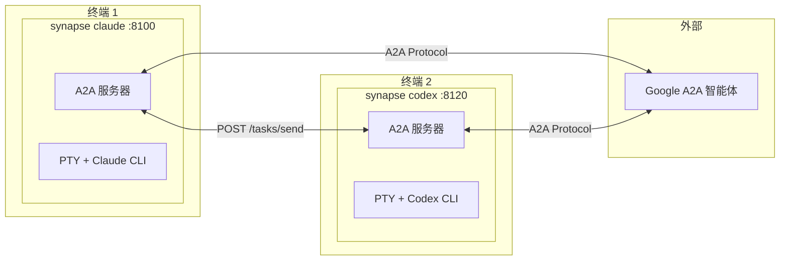
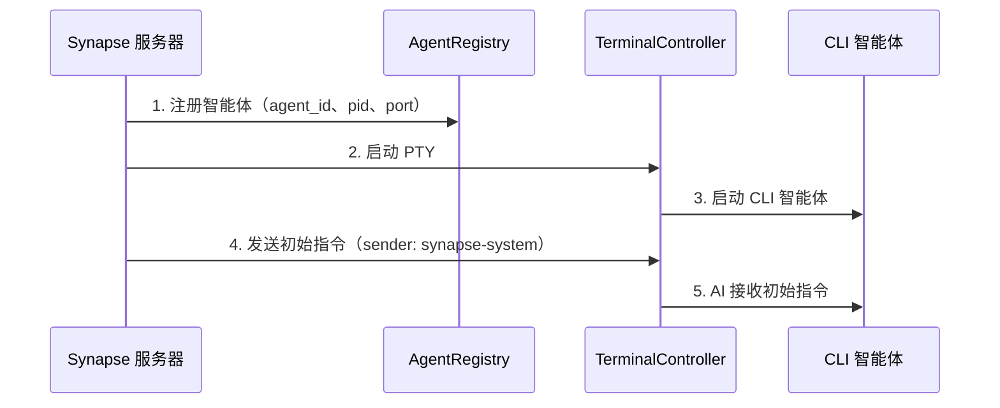
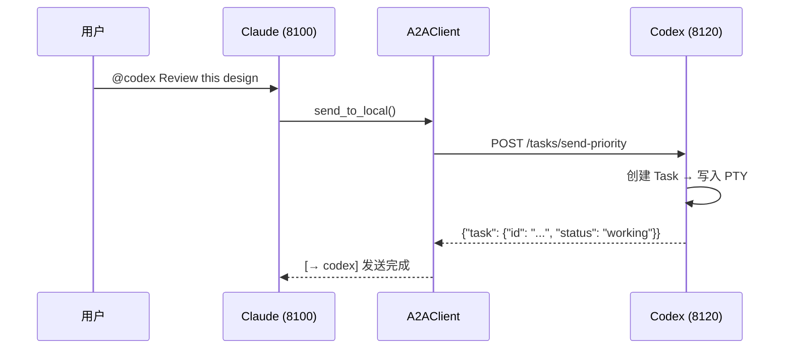
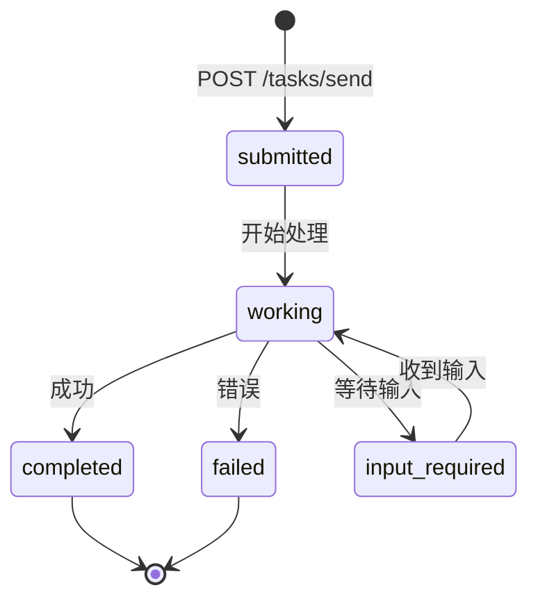
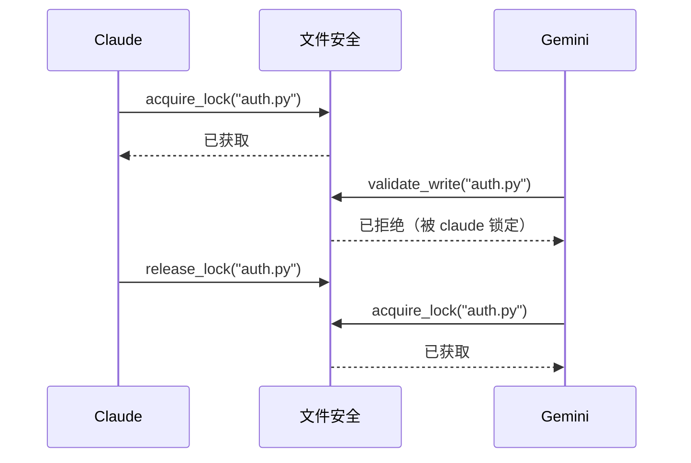

# Synapse A2A

**🌐 Language: [English](README.md) | [日本語](README.ja.md) | 中文 | [한국어](README.ko.md) | [Español](README.es.md) | [Français](README.fr.md)**

> **让智能体无需改变自身行为即可协作完成任务**

[](https://www.python.org/downloads/)
[](LICENSE)
[](#测试)
[](https://deepwiki.com/s-hiraoku/synapse-a2a)

> 一个通过 Google A2A Protocol 实现智能体间协作的框架，同时保持 CLI 智能体（Claude Code、Codex、Gemini、OpenCode、GitHub Copilot CLI）**原样不变**

## 项目目标

```text
┌─────────────────────────────────────────────────────────────────┐
│  ✅ Non-Invasive：不改变智能体的行为                              │
│  ✅ Collaborative：让智能体协同工作                               │
│  ✅ Transparent：维持现有工作流                                   │
└─────────────────────────────────────────────────────────────────┘
```

Synapse A2A **透明地包装**每个智能体的输入输出，而不修改智能体本身。这意味着：

- **发挥每个智能体的优势**：用户可以自由分配角色和专长
- **零学习成本**：继续使用现有工作流
- **面向未来**：不受智能体更新影响

详见 [项目理念](docs/project-philosophy.md)。



---

## 目录

- [功能特性](#功能特性)
- [前提条件](#前提条件)
- [快速开始](#快速开始)
- [使用场景](#使用场景)
- [Skills](#skills)
- [文档](#文档)
- [架构](#架构)
- [CLI 命令](#cli-命令)
- [API 端点](#api-端点)
- [任务结构](#任务结构)
- [发送者识别](#发送者识别)
- [优先级](#优先级)
- [Agent Card](#agent-card)
- [注册表与端口管理](#注册表与端口管理)
- [文件安全](#文件安全)
- [智能体监控](#智能体监控)
- [测试](#测试)
- [配置 (.synapse)](#配置-synapse)
- [开发与发布](#开发与发布)

---

## 功能特性

| 分类 | 功能 |
| ---- | ---- |
| **A2A 兼容** | 所有通信使用 Message/Part + Task 格式，Agent Card 发现 |
| **CLI 集成** | 将现有 CLI 工具无需修改即可转为 A2A 智能体 |
| **synapse send** | 通过 `synapse send <agent> "message"` 在智能体间发送消息 |
| **发送者识别** | 通过 `metadata.sender` + PID 匹配自动识别发送者 |
| **优先级中断** | Priority 5 在发送消息前发送 SIGINT（紧急停止） |
| **多实例** | 运行同一类型的多个智能体（自动端口分配） |
| **外部集成** | 与其他 Google A2A 智能体通信 |
| **文件安全** | 通过文件锁定和变更追踪防止多智能体冲突（在 `synapse list` 中可见） |
| **智能体命名** | 自定义名称和角色便于识别（`synapse send my-claude "hello"`） |
| **智能体监控** | 实时状态（READY/WAITING/PROCESSING/DONE）、当前任务预览、终端跳转 |
| **任务历史** | 自动任务追踪，支持搜索、导出和统计（默认启用） |

---

## 前提条件

- **操作系统**：macOS / Linux（Windows 建议使用 WSL2）
- **Python**：3.10+
- **CLI 工具**：预先安装并配置你要使用的智能体：
  - [Claude Code](https://docs.anthropic.com/en/docs/claude-code)
  - [Codex CLI](https://github.com/openai/codex)
  - [Gemini CLI](https://github.com/google-gemini/gemini-cli)
  - [OpenCode](https://github.com/opencode-ai/opencode)
  - [GitHub Copilot CLI](https://docs.github.com/en/copilot/github-copilot-in-the-cli)

---

## 快速开始

### 1. 安装 Synapse A2A

<details>
<summary><b>macOS (Homebrew)</b></summary>

```bash
# Homebrew（macOS 推荐）
brew tap s-hiraoku/synapse-a2a
brew install synapse-a2a

# 或通过 pipx
pipx install synapse-a2a
```

</details>

<details>
<summary><b>Linux</b></summary>

```bash
# pipx（推荐）
pipx install synapse-a2a

# 或 pip
pip install synapse-a2a

# 或使用 uvx 直接运行（无需安装）
uvx synapse-a2a claude
```

</details>

<details>
<summary><b>Windows</b></summary>

> **强烈建议使用 WSL2。** Synapse A2A 使用 `pty.spawn()`，需要类 Unix 终端。

```bash
# 在 WSL2 中 — 与 Linux 相同
pipx install synapse-a2a

# Scoop（实验性，仍需 WSL2 支持 pty）
scoop bucket add synapse-a2a https://github.com/s-hiraoku/scoop-synapse-a2a
scoop install synapse-a2a
```

</details>

<details>
<summary><b>开发者（从源码安装）</b></summary>

```bash
# 使用 uv 安装
uv sync

# 或 pip（可编辑模式）
pip install -e .
```

</details>

**支持 gRPC：**

```bash
pip install "synapse-a2a[grpc]"
```

### 2. 安装 Skills（推荐）

**强烈建议安装 Skills 以充分利用 Synapse A2A。**

Skills 帮助 Claude 自动理解 Synapse A2A 的功能：@agent 消息发送、文件安全等。

```bash
# 通过 skills.sh (https://skills.sh/) 安装
npx skills add s-hiraoku/synapse-a2a
```

详见 [Skills](#skills)。

### 3. 启动智能体

```bash
# 终端 1：Claude
synapse claude

# 终端 2：Codex
synapse codex

# 终端 3：Gemini
synapse gemini

# 终端 4：OpenCode
synapse opencode

# 终端 5：GitHub Copilot CLI
synapse copilot
```

> 注意：如果终端滚动显示出现乱码，请尝试：
> ```bash
> uv run synapse gemini
> # 或
> uv run python -m synapse.cli gemini
> ```

端口自动分配：

| 智能体 | 端口范围 |
| ------ | -------- |
| Claude   | 8100-8109  |
| Gemini   | 8110-8119  |
| Codex    | 8120-8129  |
| OpenCode | 8130-8139  |
| Copilot  | 8140-8149  |

### 4. 智能体间通信

使用 `synapse send` 在智能体间发送消息：

```bash
synapse send codex "Please review this design" --from synapse-claude-8100
synapse send gemini "Suggest API improvements" --from synapse-claude-8100
```

当同一类型有多个实例时，使用类型-端口格式：

```bash
synapse send codex-8120 "Handle this task" --from synapse-claude-8100
synapse send codex-8121 "Handle that task" --from synapse-claude-8100
```

### 5. HTTP API

```bash
# 发送消息
curl -X POST http://localhost:8100/tasks/send \
  -H "Content-Type: application/json" \
  -d '{"message": {"role": "user", "parts": [{"type": "text", "text": "Hello!"}]}}'

# 紧急停止（Priority 5）
curl -X POST "http://localhost:8100/tasks/send-priority?priority=5" \
  -H "Content-Type: application/json" \
  -d '{"message": {"role": "user", "parts": [{"type": "text", "text": "Stop!"}]}}'
```

---

## 使用场景

### 1. 即时规格查询（简单）
在使用 **Claude** 编码时，快速查询 **Gemini**（更擅长网络搜索）获取最新库规格或错误信息，无需切换上下文。

```bash
# 在 Claude 的终端中：
synapse send gemini "Summarize the new f-string features in Python 3.12" --from synapse-claude-8100
```

### 2. 交叉审查设计（中级）
从不同视角的智能体获取设计反馈。

```bash
# 在 Claude 完成设计后：
synapse send gemini "Critically review this design from scalability and maintainability perspectives" --from synapse-claude-8100
```

### 3. TDD 结对编程（中级）
分离"测试编写者"和"实现者"以编写健壮代码。

```bash
# 终端 1（Codex）：
Create unit tests for auth.py - normal case and token expiration case.

# 终端 2（Claude）：
synapse send codex-8120 "Implement auth.py to pass the tests you created" --from synapse-claude-8100
```

### 4. 安全审计（专项）
在提交前让具有安全专家角色的智能体审计你的代码。

```bash
# 给 Gemini 分配角色：
You are a security engineer. Review only for vulnerabilities (SQLi, XSS, etc.)

# 写完代码后：
synapse send gemini "Audit the current changes (git diff)" --from synapse-claude-8100
```

### 5. 从错误日志自动修复（高级）
将错误日志传递给智能体以自动修复。

```bash
# 测试失败了...
pytest > error.log

# 请求智能体修复
synapse send claude "Read error.log and fix the issue in synapse/server.py" --from synapse-gemini-8110
```

### 6. 语言/框架迁移（高级）
将大型重构工作分配给多个智能体。

```bash
# 终端 1（Claude）：
Read legacy_api.js and create TypeScript type definitions

# 终端 2（Codex）：
synapse send claude "Use the type definitions you created to rewrite legacy_api.js to src/new_api.ts" --from synapse-codex-8121
```

### 与 SSH 远程比较

| 操作 | SSH | Synapse |
|------|-----|---------|
| 手动 CLI 操作 | ◎ | ◎ |
| 编程式任务提交 | △ 需要 expect 等 | ◎ HTTP API |
| 多客户端同时连接 | △ 多会话 | ◎ 单一端点 |
| 实时进度通知 | ✗ | ◎ SSE/Webhook |
| 自动智能体间协调 | ✗ | ◎ synapse send |

> **注意**：SSH 通常足以满足个人 CLI 使用。当你需要自动化、协调和多智能体协作时，Synapse 更具优势。

---

## Skills

**强烈建议**在 Claude Code 中使用 Synapse A2A 时安装 Skills。

### 为什么要安装 Skills？

安装 Skills 后，Claude 可以自动理解和执行：

- **synapse send**：通过 `synapse send codex "Fix this" --from synapse-claude-8100` 进行智能体间通信
- **优先级控制**：支持 Priority 1-5 的消息发送（5 = 紧急停止）
- **文件安全**：通过文件锁定和变更追踪防止多智能体冲突
- **历史管理**：任务历史的搜索、导出和统计

### 安装

```bash
# 通过 skills.sh (https://skills.sh/) 安装
npx skills add s-hiraoku/synapse-a2a
```

### 包含的 Skills

| Skill | 说明 |
|-------|------|
| **synapse-a2a** | 智能体间通信综合指南：`synapse send`、优先级、A2A protocol、历史记录、文件安全、设置 |

### 目录结构

```text
plugins/
└── synapse-a2a/
    ├── .claude-plugin/plugin.json
    ├── README.md
    └── skills/
        └── synapse-a2a/SKILL.md
```

详见 [plugins/synapse-a2a/README.md](plugins/synapse-a2a/README.md)。

> **注意**：Codex 和 Gemini 不支持插件，但你可以将展开的 Skills 放在 `.agents/skills/`（Codex/OpenCode）或 `.gemini/skills/` 目录中以启用这些功能。

---

## 文档

- [guides/README.md](guides/README.md) - 文档概览
- [guides/multi-agent-setup.md](guides/multi-agent-setup.md) - 设置指南
- [guides/usage.md](guides/usage.md) - 命令和使用模式
- [guides/settings.md](guides/settings.md) - `.synapse` 配置详情
- [guides/troubleshooting.md](guides/troubleshooting.md) - 常见问题与解决方案

---

## 架构

### A2A 服务器/客户端结构

在 Synapse 中，**每个智能体作为 A2A 服务器运行**。没有中央服务器，采用 P2P 架构。

```
┌─────────────────────────────────────┐    ┌─────────────────────────────────────┐
│  synapse claude (port 8100)         │    │  synapse codex (port 8120)          │
│  ┌───────────────────────────────┐  │    │  ┌───────────────────────────────┐  │
│  │  FastAPI Server (A2A Server)  │  │    │  │  FastAPI Server (A2A Server)  │  │
│  │  /.well-known/agent.json      │  │    │  │  /.well-known/agent.json      │  │
│  │  /tasks/send                  │◄─┼────┼──│  A2AClient                    │  │
│  │  /tasks/{id}                  │  │    │  └───────────────────────────────┘  │
│  └───────────────────────────────┘  │    │  ┌───────────────────────────────┐  │
│  ┌───────────────────────────────┐  │    │  │  PTY + Codex CLI              │  │
│  │  PTY + Claude CLI             │  │    │  └───────────────────────────────┘  │
│  └───────────────────────────────┘  │    └─────────────────────────────────────┘
└─────────────────────────────────────┘
```

每个智能体是：

- **A2A 服务器**：接受其他智能体的请求
- **A2A 客户端**：向其他智能体发送请求

### 核心组件

| 组件 | 文件 | 职责 |
| ---- | ---- | ---- |
| FastAPI Server | `synapse/server.py` | 提供 A2A 端点 |
| A2A Router | `synapse/a2a_compat.py` | A2A 协议实现 |
| A2A Client | `synapse/a2a_client.py` | 与其他智能体通信 |
| TerminalController | `synapse/controller.py` | PTY 管理、READY/PROCESSING 检测 |
| InputRouter | `synapse/input_router.py` | @Agent 模式检测 |
| AgentRegistry | `synapse/registry.py` | 智能体注册与查找 |

### 启动序列



### 通信流程



---

## CLI 命令

### 基本操作

```bash
# 启动智能体（前台）
synapse claude
synapse codex
synapse gemini
synapse opencode
synapse copilot

# 使用自定义名称和角色启动
synapse claude --name my-claude --role "code reviewer"

# 跳过交互式名称/角色设置
synapse claude --no-setup

# 指定端口
synapse claude --port 8105

# 传递参数给 CLI 工具
synapse claude -- --resume
```

### 智能体命名

为智能体分配自定义名称和角色，便于识别和管理：

```bash
# 交互式设置（启动智能体时默认）
synapse claude
# → 提示输入名称和角色

# 跳过交互式设置
synapse claude --no-setup

# 通过 CLI 选项设置名称和角色
synapse claude --name my-claude --role "code reviewer"

# 智能体运行后更改名称/角色
synapse rename synapse-claude-8100 --name my-claude --role "test writer"
synapse rename my-claude --role "documentation"  # 仅更改角色
synapse rename my-claude --clear                 # 清除名称和角色
```

命名后，可用自定义名称进行所有操作：

```bash
synapse send my-claude "Review this code" --from synapse-codex-8121
synapse jump my-claude
synapse kill my-claude
```

**名称与 ID：**
- **显示/提示**：如果已设置则显示名称，否则显示 ID（例如 `Kill my-claude (PID: 1234)?`）
- **内部处理**：始终使用智能体 ID（`synapse-claude-8100`）
- **目标解析**：匹配目标时名称具有最高优先级

### 命令列表

| 命令 | 说明 |
| ---- | ---- |
| `synapse <profile>` | 前台启动 |
| `synapse start <profile>` | 后台启动 |
| `synapse stop <profile\|id>` | 停止智能体（可指定 ID） |
| `synapse kill <target>` | 立即终止智能体 |
| `synapse jump <target>` | 跳转到智能体的终端 |
| `synapse rename <target>` | 为智能体分配名称/角色 |
| `synapse --version` | 显示版本 |
| `synapse list` | 列出运行中的智能体（Rich TUI，自动刷新，终端跳转） |
| `synapse logs <profile>` | 显示日志 |
| `synapse send <target> <message>` | 发送消息 |
| `synapse reply <message>` | 回复最近收到的 A2A 消息 |
| `synapse instructions show` | 显示指令内容 |
| `synapse instructions files` | 列出指令文件 |
| `synapse instructions send` | 重新发送初始指令 |
| `synapse history list` | 显示任务历史 |
| `synapse history show <task_id>` | 显示任务详情 |
| `synapse history search` | 关键词搜索 |
| `synapse history cleanup` | 删除旧数据 |
| `synapse history stats` | 显示统计信息 |
| `synapse history export` | 导出为 JSON/CSV |
| `synapse file-safety status` | 显示文件安全统计 |
| `synapse file-safety locks` | 列出活跃的锁 |
| `synapse file-safety lock` | 锁定文件 |
| `synapse file-safety unlock` | 释放锁 |
| `synapse file-safety history` | 文件变更历史 |
| `synapse file-safety recent` | 最近的变更 |
| `synapse file-safety record` | 手动记录变更 |
| `synapse file-safety cleanup` | 删除旧数据 |
| `synapse file-safety debug` | 显示调试信息 |
| `synapse config` | 设置管理（交互式 TUI） |
| `synapse config show` | 显示当前设置 |

### 恢复模式

恢复已有会话时，使用这些标志来**跳过初始指令发送**（A2A 协议说明），保持上下文整洁：

```bash
# 恢复 Claude Code 会话
synapse claude -- --resume

# 恢复 Gemini 并保留历史
synapse gemini -- --resume=5

# Codex 使用 'resume' 作为子命令（不是 --resume 标志）
synapse codex -- resume --last
```

默认标志（可在 `settings.json` 中自定义）：
- **Claude**：`--resume`、`--continue`、`-r`、`-c`
- **Gemini**：`--resume`、`-r`
- **Codex**：`resume`
- **OpenCode**：`--continue`、`-c`
- **Copilot**：`--continue`、`--resume`

### 指令管理

在初始指令未发送时（例如 `--resume` 模式后）手动重新发送：

```bash
# 显示指令内容
synapse instructions show claude

# 列出指令文件
synapse instructions files claude

# 向运行中的智能体发送初始指令
synapse instructions send claude

# 发送前预览
synapse instructions send claude --preview

# 发送到指定智能体 ID
synapse instructions send synapse-claude-8100
```

适用场景：
- 使用 `--resume` 启动后需要 A2A 协议信息
- 智能体丢失/忘记指令需要恢复
- 调试指令内容

### 外部智能体管理

```bash
# 注册外部智能体
synapse external add http://other-agent:9000 --alias other

# 列出
synapse external list

# 发送消息
synapse external send other "Process this task"
```

### 任务历史管理

搜索、浏览和分析过去的智能体执行结果。

**注意：** 自 v0.3.13 起历史记录默认启用。禁用方式：

```bash
# 通过环境变量禁用
export SYNAPSE_HISTORY_ENABLED=false
synapse claude
```

#### 基本操作

```bash
# 显示最近 50 条记录
synapse history list

# 按智能体过滤
synapse history list --agent claude

# 自定义限制
synapse history list --limit 100

# 显示任务详情
synapse history show task-id-uuid
```

#### 关键词搜索

按关键词搜索输入/输出字段：

```bash
# 单个关键词
synapse history search "Python"

# 多个关键词（OR 逻辑）
synapse history search "Python" "Docker"

# AND 逻辑（所有关键词必须匹配）
synapse history search "Python" "function" --logic AND

# 结合智能体过滤
synapse history search "Python" --agent claude

# 限制结果数量
synapse history search "error" --limit 20
```

#### 统计

```bash
# 总体统计（总计、成功率、按智能体分类）
synapse history stats

# 指定智能体统计
synapse history stats --agent claude
```

#### 数据导出

```bash
# JSON 导出（标准输出）
synapse history export --format json

# CSV 导出
synapse history export --format csv

# 保存到文件
synapse history export --format json --output history.json
synapse history export --format csv --agent claude > claude_history.csv
```

#### 保留策略

```bash
# 删除超过 30 天的数据
synapse history cleanup --days 30

# 保持数据库在 100MB 以下
synapse history cleanup --max-size 100

# 强制执行（无确认）
synapse history cleanup --days 30 --force

# 试运行
synapse history cleanup --days 30 --dry-run
```

**存储：**

- SQLite 数据库：`~/.synapse/history/history.db`
- 存储内容：任务 ID、智能体名称、输入、输出、状态、元数据
- 自动索引：agent_name、timestamp、task_id

**设置：**

- **默认启用**（v0.3.13+）
- **禁用**：`SYNAPSE_HISTORY_ENABLED=false`

### synapse send 命令（推荐）

使用 `synapse send` 进行智能体间通信。在沙盒环境中也可使用。

```bash
synapse send <target> "<message>" [--from <sender>] [--priority <1-5>] [--response | --no-response]
```

**目标格式：**

| 格式 | 示例 | 说明 |
|------|------|------|
| 自定义名称 | `my-claude` | 最高优先级，智能体有名称时使用 |
| 智能体类型 | `claude` | 仅当只有单个实例时有效 |
| 类型-端口 | `claude-8100` | 同一类型有多个实例时使用 |
| 完整 ID | `synapse-claude-8100` | 完整智能体 ID |

当同一类型有多个智能体运行时，仅使用类型（如 `claude`）会报错。请使用 `claude-8100` 或 `synapse-claude-8100`。

**选项：**

| 选项 | 缩写 | 说明 |
|------|------|------|
| `--from` | `-f` | 发送者智能体 ID（用于回复识别） |
| `--priority` | `-p` | 优先级 1-4：正常，5：紧急停止（发送 SIGINT） |
| `--response` | - | 往返模式 - 发送者等待，接收者通过 `synapse reply` 回复 |
| `--no-response` | - | 单向模式 - 发送即忘，无需回复 |

**示例：**

```bash
# 发送消息（单实例）
synapse send claude "Hello" --priority 1 --from synapse-codex-8121

# 发送到指定实例（同类型多个）
synapse send claude-8100 "Hello" --from synapse-claude-8101

# 紧急停止
synapse send claude "Stop!" --priority 5 --from synapse-codex-8121

# 等待响应（往返模式）
synapse send gemini "Analyze this" --response --from synapse-claude-8100
```

**默认行为：** 当 `a2a.flow=auto`（默认）时，`synapse send` 会等待响应，除非指定了 `--no-response`。

**重要：** 始终使用 `--from` 加上你的智能体 ID（格式：`synapse-<type>-<port>`）。

### synapse reply 命令

回复最近收到的消息：

```bash
synapse reply "<message>"
```

`--from` 标志仅在沙盒环境（如 Codex）中需要。通常情况下，Synapse 通过进程谱系自动检测发送者。

### 低级 A2A 工具

用于高级操作：

```bash
# 列出智能体
python -m synapse.tools.a2a list

# 发送消息
python -m synapse.tools.a2a send --target claude --priority 1 "Hello"

# 回复最近收到的消息（使用回复追踪）
python -m synapse.tools.a2a reply "Here is my response"
```

---

## API 端点

### A2A 兼容

| 端点 | 方法 | 说明 |
| ---- | ---- | ---- |
| `/.well-known/agent.json` | GET | Agent Card |
| `/tasks/send` | POST | 发送消息 |
| `/tasks/send-priority` | POST | 带优先级发送 |
| `/tasks/create` | POST | 创建任务（不发送到 PTY，用于 `--response`） |
| `/tasks/{id}` | GET | 获取任务状态 |
| `/tasks` | GET | 列出任务 |
| `/tasks/{id}/cancel` | POST | 取消任务 |
| `/status` | GET | READY/PROCESSING 状态 |

### Synapse 扩展

| 端点 | 方法 | 说明 |
| ---- | ---- | ---- |
| `/reply-stack/get` | GET | 获取发送者信息但不移除（发送前预览） |
| `/reply-stack/pop` | GET | 从回复映射中弹出发送者信息（用于 `synapse reply`） |

### 外部智能体

| 端点 | 方法 | 说明 |
| ---- | ---- | ---- |
| `/external/discover` | POST | 注册外部智能体 |
| `/external/agents` | GET | 列出 |
| `/external/agents/{alias}` | DELETE | 移除 |
| `/external/agents/{alias}/send` | POST | 发送 |

---

## 任务结构

在 A2A 协议中，所有通信以**任务**（Task）的形式管理。

### 任务生命周期



### 任务对象

```json
{
  "id": "550e8400-e29b-41d4-a716-446655440000",
  "context_id": "conversation-123",
  "status": "working",
  "message": {
    "role": "user",
    "parts": [{ "type": "text", "text": "Review this design" }]
  },
  "artifacts": [],
  "metadata": {
    "sender": {
      "sender_id": "synapse-claude-8100",
      "sender_type": "claude",
      "sender_endpoint": "http://localhost:8100"
    }
  },
  "created_at": "2024-01-15T10:30:00Z",
  "updated_at": "2024-01-15T10:30:05Z"
}
```

### 字段说明

| 字段 | 类型 | 说明 |
| ---- | ---- | ---- |
| `id` | string | 唯一任务标识符（UUID） |
| `context_id` | string? | 会话上下文 ID（用于多轮对话） |
| `status` | string | `submitted` / `working` / `completed` / `failed` / `input_required` |
| `message` | Message | 发送的消息 |
| `artifacts` | Artifact[] | 任务输出产物 |
| `metadata` | object | 发送者信息（`metadata.sender`） |
| `created_at` | string | 创建时间戳（ISO 8601） |
| `updated_at` | string | 更新时间戳（ISO 8601） |

### 消息结构

```json
{
  "role": "user",
  "parts": [
    { "type": "text", "text": "Message content" },
    {
      "type": "file",
      "file": {
        "name": "doc.pdf",
        "mimeType": "application/pdf",
        "bytes": "..."
      }
    }
  ]
}
```

| Part 类型 | 说明 |
| --------- | ---- |
| `text` | 文本消息 |
| `file` | 文件附件 |
| `data` | 结构化数据 |

---

## 发送者识别

A2A 消息的发送者可通过 `metadata.sender` 识别。

### PTY 输出格式

消息以简单的 `A2A:` 前缀发送到智能体的 PTY：

```
A2A: <消息内容>
```

### 回复处理

Synapse 自动管理回复路由。智能体只需使用 `synapse reply`：

```bash
synapse reply "Here is my response"
```

框架内部追踪发送者信息并自动路由回复。

### Task API 验证（开发）

```bash
curl -s http://localhost:8120/tasks/<id> | jq '.metadata.sender'
```

响应：

```json
{
  "sender_id": "synapse-claude-8100",
  "sender_type": "claude",
  "sender_endpoint": "http://localhost:8100"
}
```

### 工作原理

1. **发送时**：引用 Registry，通过 PID 匹配识别自身 agent_id
2. **创建 Task 时**：将发送者信息附加到 `metadata.sender`
3. **接收时**：通过 PTY 前缀或 Task API 检查

---

## 优先级

| 优先级 | 行为 | 使用场景 |
| ------ | ---- | -------- |
| 1-4 | 正常 stdin 写入 | 常规消息 |
| 5 | 先发送 SIGINT 再写入 | 紧急停止 |

```bash
# 紧急停止
synapse send claude "Stop!" --priority 5
```

---

## Agent Card

每个智能体在 `/.well-known/agent.json` 发布 Agent Card。

```bash
curl http://localhost:8100/.well-known/agent.json
```

```json
{
  "name": "Synapse Claude",
  "description": "PTY-wrapped claude CLI agent with A2A communication",
  "url": "http://localhost:8100",
  "capabilities": {
    "streaming": false,
    "pushNotifications": false,
    "multiTurn": true
  },
  "skills": [
    {
      "id": "chat",
      "name": "Chat",
      "description": "Send messages to the CLI agent"
    },
    {
      "id": "interrupt",
      "name": "Interrupt",
      "description": "Interrupt current processing"
    }
  ],
  "extensions": {
    "synapse": {
      "agent_id": "synapse-claude-8100",
      "pty_wrapped": true,
      "priority_interrupt": true,
      "at_agent_syntax": true
    }
  }
}
```

### 设计理念

Agent Card 是一张"名片"，只包含面向外部的信息：

- capabilities、skills、endpoint 等
- 不包含内部指令（在启动时通过 A2A Task 发送）

---

## 注册表与端口管理

### 注册表文件

```
~/.a2a/registry/
├── synapse-claude-8100.json
├── synapse-claude-8101.json
└── synapse-gemini-8110.json
```

### 自动清理

过期条目会在以下操作时自动移除：

- 执行 `synapse list`
- 发送消息时（当目标已失效）

### 端口范围

```python
PORT_RANGES = {
    "claude": (8100, 8109),
    "gemini": (8110, 8119),
    "codex": (8120, 8129),
    "opencode": (8130, 8139),
    "copilot": (8140, 8149),
    "dummy": (8190, 8199),
}
```

### 典型内存使用（常驻智能体）

在 macOS 上，空闲的常驻智能体非常轻量。截至 2026 年 1 月 25 日，
在典型开发环境中，每个智能体进程的 RSS 约为 ~12 MB。

实际使用量因配置文件、插件、历史设置和工作负载而异。
注意 `ps` 以 KB 为单位报告 RSS（所以 ~12 MB 对应 ~12,000 KB）。
在你的机器上测量：

```bash
ps -o pid,comm,rss,vsz,etime,command -A | rg "synapse"
```

如果没有安装 ripgrep：

```bash
ps -o pid,comm,rss,vsz,etime,command -A | grep "synapse"
```

---

## 文件安全

防止多个智能体同时编辑相同文件时产生冲突。



### 功能

| 功能 | 说明 |
|------|------|
| **文件锁定** | 排他控制防止同时编辑 |
| **变更追踪** | 记录谁在何时更改了什么 |
| **上下文注入** | 读取时提供最近的变更历史 |
| **写入前验证** | 写入前检查锁定状态 |
| **列表集成** | 活跃锁在 `synapse list` EDITING_FILE 列中可见 |

### 启用

```bash
# 通过环境变量启用
export SYNAPSE_FILE_SAFETY_ENABLED=true
synapse claude
```

### 基本命令

```bash
# 显示统计信息
synapse file-safety status

# 列出活跃的锁
synapse file-safety locks

# 获取锁
synapse file-safety lock /path/to/file.py claude --intent "Refactoring"

# 等待锁释放
synapse file-safety lock /path/to/file.py claude --wait --wait-timeout 60 --wait-interval 2

# 释放锁
synapse file-safety unlock /path/to/file.py claude

# 文件变更历史
synapse file-safety history /path/to/file.py

# 最近的变更
synapse file-safety recent

# 删除旧数据
synapse file-safety cleanup --days 30
```

### Python API

```python
from synapse.file_safety import FileSafetyManager, ChangeType, LockStatus

manager = FileSafetyManager.from_env()

# 获取锁
result = manager.acquire_lock("/path/to/file.py", "claude", intent="Refactoring")
if result["status"] == LockStatus.ACQUIRED:
    # 编辑文件...

    # 记录变更
    manager.record_modification(
        file_path="/path/to/file.py",
        agent_name="claude",
        task_id="task-123",
        change_type=ChangeType.MODIFY,
        intent="Fix authentication bug"
    )

    # 释放锁
    manager.release_lock("/path/to/file.py", "claude")

# 写入前验证
validation = manager.validate_write("/path/to/file.py", "gemini")
if not validation["allowed"]:
    print(f"Write blocked: {validation['reason']}")
```

**存储**：默认为 `.synapse/file_safety.db`（SQLite，相对于工作目录）。可通过 `SYNAPSE_FILE_SAFETY_DB_PATH` 更改（例如 `~/.synapse/file_safety.db` 用于全局）。

详见 [docs/file-safety.md](docs/file-safety.md)。

---

## 智能体监控

实时监控智能体状态，支持终端跳转。

### Rich TUI 模式

```bash
# 启动 Rich TUI 自动刷新（默认）
synapse list
```

显示在智能体状态变化时自动更新（通过文件监听），回退轮询间隔为 10 秒。

### 显示列

| 列 | 说明 |
|----|------|
| ID | 智能体 ID（例如 `synapse-claude-8100`） |
| NAME | 自定义名称（如已分配） |
| TYPE | 智能体类型（claude、gemini、codex 等） |
| ROLE | 智能体角色描述（如已分配） |
| STATUS | 当前状态（READY、WAITING、PROCESSING、DONE） |
| CURRENT | 当前任务预览 |
| TRANSPORT | 通信传输指示器 |
| WORKING_DIR | 当前工作目录 |
| EDITING_FILE | 正在编辑的文件（仅文件安全启用时） |

**在 `settings.json` 中自定义列**：

```json
{
  "list": {
    "columns": ["ID", "NAME", "STATUS", "CURRENT", "TRANSPORT", "WORKING_DIR"]
  }
}
```

### 状态

| 状态 | 颜色 | 含义 |
|------|------|------|
| **READY** | 绿色 | 智能体空闲，等待输入 |
| **WAITING** | 青色 | 智能体显示选择 UI，等待用户选择 |
| **PROCESSING** | 黄色 | 智能体正在工作 |
| **DONE** | 蓝色 | 任务完成（10 秒后自动转为 READY） |

### 交互控制

| 按键 | 操作 |
|------|------|
| 1-9 | 直接选择智能体行 |
| ↑/↓ | 浏览智能体行 |
| **Enter** 或 **j** | 跳转到选中智能体的终端 |
| **k** | 终止选中的智能体（带确认） |
| **/** | 按 TYPE、NAME 或 WORKING_DIR 过滤 |
| ESC | 清除过滤/选择 |
| q | 退出 |

**支持的终端**：iTerm2、Terminal.app、Ghostty、VS Code、tmux、Zellij

### WAITING 检测

> **注意**：WAITING 检测目前因启动时误报而被禁用。详见 [#140](https://github.com/s-hiraoku/synapse-a2a/issues/140)。

启用后，使用正则表达式模式检测等待用户输入的智能体（选择 UI、Y/n 提示）：

- **Gemini**：`● 1. Option` 选择 UI、`Allow execution` 提示
- **Claude**：`❯ Option` 光标、`☐/☑` 复选框、`[Y/n]` 提示
- **Codex**：缩进编号列表
- **OpenCode**：编号选项、选择指示器、`[y/N]` 提示
- **Copilot**：编号选项、选择指示器、`[y/N]` 或 `(y/n)` 提示

---

## 测试

全面的测试套件验证 A2A 协议兼容性：

```bash
# 所有测试
pytest

# 特定分类
pytest tests/test_a2a_compat.py -v
pytest tests/test_sender_identification.py -v
```

---

## 配置 (.synapse)

通过 `.synapse/settings.json` 自定义环境变量和初始指令。

### 作用域

| 作用域 | 路径 | 优先级 |
|--------|------|--------|
| 用户 | `~/.synapse/settings.json` | 低 |
| 项目 | `./.synapse/settings.json` | 中 |
| 本地 | `./.synapse/settings.local.json` | 高（建议加入 gitignore） |

高优先级设置覆盖低优先级设置。

### 设置

```bash
# 创建 .synapse/ 目录（复制所有模板文件）
synapse init

# ? Where do you want to create .synapse/?
#   ❯ User scope (~/.synapse/)
#     Project scope (./.synapse/)
#
# ✔ Created ~/.synapse

# 重置为默认值
synapse reset

# 交互式编辑设置（TUI）
synapse config

# 显示当前设置（只读）
synapse config show
synapse config show --scope user
```

`synapse init` 将以下文件复制到 `.synapse/`：

| 文件 | 说明 |
|------|------|
| `settings.json` | 环境变量和初始指令设置 |
| `default.md` | 所有智能体通用的初始指令 |
| `gemini.md` | Gemini 专用初始指令 |
| `file-safety.md` | 文件安全指令 |

### settings.json 结构

```json
{
  "env": {
    "SYNAPSE_HISTORY_ENABLED": "true",
    "SYNAPSE_FILE_SAFETY_ENABLED": "true",
    "SYNAPSE_FILE_SAFETY_DB_PATH": ".synapse/file_safety.db"
  },
  "instructions": {
    "default": "[SYNAPSE INSTRUCTIONS...]\n...",
    "claude": "",
    "gemini": "",
    "codex": ""
  },
  "approvalMode": "required",
  "a2a": {
    "flow": "auto"
  }
}
```

### 环境变量 (env)

| 变量 | 说明 | 默认值 |
|------|------|--------|
| `SYNAPSE_HISTORY_ENABLED` | 启用任务历史 | `true` |
| `SYNAPSE_FILE_SAFETY_ENABLED` | 启用文件安全 | `true` |
| `SYNAPSE_FILE_SAFETY_DB_PATH` | 文件安全数据库路径 | `.synapse/file_safety.db` |
| `SYNAPSE_FILE_SAFETY_RETENTION_DAYS` | 锁历史保留天数 | `30` |
| `SYNAPSE_AUTH_ENABLED` | 启用 API 认证 | `false` |
| `SYNAPSE_API_KEYS` | API 密钥（逗号分隔） | - |
| `SYNAPSE_ADMIN_KEY` | 管理员密钥 | - |
| `SYNAPSE_ALLOW_LOCALHOST` | localhost 跳过认证 | `true` |
| `SYNAPSE_USE_HTTPS` | 使用 HTTPS | `false` |
| `SYNAPSE_WEBHOOK_SECRET` | Webhook 密钥 | - |
| `SYNAPSE_WEBHOOK_TIMEOUT` | Webhook 超时（秒） | `10` |
| `SYNAPSE_WEBHOOK_MAX_RETRIES` | Webhook 重试次数 | `3` |
| `SYNAPSE_LONG_MESSAGE_THRESHOLD` | 文件存储字符阈值 | `200` |
| `SYNAPSE_LONG_MESSAGE_TTL` | 消息文件 TTL（秒） | `3600` |
| `SYNAPSE_LONG_MESSAGE_DIR` | 消息文件目录 | 系统临时目录 |

### A2A 通信设置 (a2a)

| 设置 | 值 | 说明 |
|------|-----|------|
| `flow` | `roundtrip` | 始终等待结果 |
| `flow` | `oneway` | 始终仅转发（不等待） |
| `flow` | `auto` | 由标志控制；未指定时默认等待 |

### 审批模式 (approvalMode)

控制发送初始指令前是否显示确认提示。

| 设置 | 说明 |
|------|------|
| `required` | 启动时显示审批提示（默认） |
| `auto` | 自动发送指令，无需提示 |

设为 `required` 时，你将看到如下提示：

```
[Synapse] Agent: synapse-claude-8100 | Port: 8100
[Synapse] Initial instructions will be sent to configure A2A communication.

Proceed? [Y/n/s(skip)]:
```

选项：
- **Y**（或 Enter）：发送初始指令并启动智能体
- **n**：中止启动
- **s**：启动智能体但不发送初始指令

### 初始指令 (instructions)

自定义智能体启动时发送的指令：

```json
{
  "instructions": {
    "default": "所有智能体通用指令",
    "claude": "Claude 专用指令（优先于 default）",
    "gemini": "Gemini 专用指令",
    "codex": "Codex 专用指令"
  }
}
```

**优先级**：
1. 如果存在智能体专用设置（`claude`、`gemini`、`codex`、`opencode`、`copilot`），则使用该设置
2. 否则使用 `default`
3. 如果两者都为空，则不发送初始指令

**占位符**：
- `{{agent_id}}` - 智能体 ID（例如 `synapse-claude-8100`）
- `{{port}}` - 端口号（例如 `8100`）

详见 [guides/settings.md](guides/settings.md)。

---

## 开发与发布

### 发布到 PyPI

推送标签后会通过 GitHub Actions 自动发布到 PyPI。

```bash
# 1. 在 pyproject.toml 中更新版本
# version = "0.2.0"

# 2. 创建并推送标签
git tag v0.2.0
git push origin v0.2.0
```

### 手动发布

```bash
# 使用 uv 构建并发布
uv build
uv publish
```

### 用户安装

**macOS：**
```bash
brew tap s-hiraoku/synapse-a2a && brew install synapse-a2a

# 升级
brew upgrade synapse-a2a
```

**Linux / WSL2：**
```bash
pipx install synapse-a2a

# 升级
pipx upgrade synapse-a2a
```

**Windows（Scoop，实验性）：**
```bash
scoop bucket add synapse-a2a https://github.com/s-hiraoku/scoop-synapse-a2a
scoop install synapse-a2a

# 升级
scoop update synapse-a2a
```

**卸载：**
```bash
brew uninstall synapse-a2a   # macOS
pipx uninstall synapse-a2a   # Linux
scoop uninstall synapse-a2a  # Windows
```

---

## 已知限制

- **TUI 渲染**：基于 Ink 的 CLI 可能出现显示乱码
- **PTY 限制**：部分特殊输入序列不受支持
- **Codex 沙盒**：Codex CLI 的沙盒会阻止网络访问，需要配置以实现智能体间通信（详见下文）

### Codex CLI 中的智能体间通信

Codex CLI 默认在沙盒中运行，网络访问受限。要使用 `@agent` 模式进行智能体间通信，请在 `~/.codex/config.toml` 中允许网络访问。

**全局设置（适用于所有项目）：**

```toml
# ~/.codex/config.toml

sandbox_mode = "workspace-write"

[sandbox_workspace_write]
network_access = true
```

**按项目设置：**

```toml
# ~/.codex/config.toml

[projects."/path/to/your/project"]
sandbox_mode = "workspace-write"

[projects."/path/to/your/project".sandbox_workspace_write]
network_access = true
```

详见 [guides/troubleshooting.md](guides/troubleshooting.md#codex-sandbox-network-error)。

---

## 企业功能

适用于生产环境的安全、通知和高性能通信功能。

### API 密钥认证

```bash
# 启用认证启动
export SYNAPSE_AUTH_ENABLED=true
export SYNAPSE_API_KEYS=<YOUR_API_KEY>
synapse claude

# 使用 API Key 请求
curl -H "X-API-Key: <YOUR_API_KEY>" http://localhost:8100/tasks
```

### Webhook 通知

任务完成时向外部 URL 发送通知。

```bash
# 注册 webhook
curl -X POST http://localhost:8100/webhooks \
  -H "Content-Type: application/json" \
  -d '{"url": "https://your-server.com/hook", "events": ["task.completed"]}'
```

| 事件 | 说明 |
|------|------|
| `task.completed` | 任务成功完成 |
| `task.failed` | 任务失败 |
| `task.canceled` | 任务已取消 |

### SSE 流式传输

实时接收任务输出。

```bash
curl -N http://localhost:8100/tasks/{task_id}/subscribe
```

事件类型：

| 事件 | 说明 |
|------|------|
| `output` | 新 CLI 输出 |
| `status` | 状态变更 |
| `done` | 任务完成（包含 Artifact） |

### 输出解析

自动解析 CLI 输出，用于错误检测、状态更新和 Artifact 生成。

| 功能 | 说明 |
|------|------|
| 错误检测 | 检测 `command not found`、`permission denied` 等 |
| input_required | 检测询问/确认提示 |
| 输出解析器 | 结构化代码/文件/错误 |

### gRPC 支持

使用 gRPC 进行高性能通信。

```bash
# 安装 gRPC 依赖
pip install synapse-a2a[grpc]

# gRPC 运行在 REST 端口 + 1
# REST: 8100 → gRPC: 8101
```

详见 [guides/enterprise.md](guides/enterprise.md)。

---

## 文档

| 路径 | 内容 |
| ---- | ---- |
| [guides/usage.md](guides/usage.md) | 详细用法 |
| [guides/architecture.md](guides/architecture.md) | 架构详情 |
| [guides/enterprise.md](guides/enterprise.md) | 企业功能 |
| [guides/troubleshooting.md](guides/troubleshooting.md) | 故障排除 |
| [docs/file-safety.md](docs/file-safety.md) | 文件冲突防护 |
| [docs/project-philosophy.md](docs/project-philosophy.md) | 设计理念 |

---

## 许可证

MIT License

---

## 相关链接

- [Claude Code](https://claude.ai/code) - Anthropic 的 CLI 智能体
- [OpenCode](https://opencode.ai/) - 开源 AI 编码智能体
- [GitHub Copilot CLI](https://docs.github.com/en/copilot/github-copilot-in-the-cli) - GitHub 的 AI 编码助手
- [Google A2A Protocol](https://github.com/google/A2A) - 智能体间通信协议
