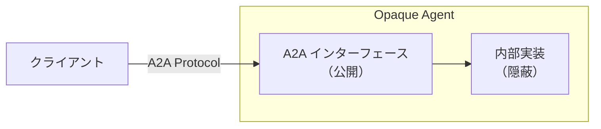
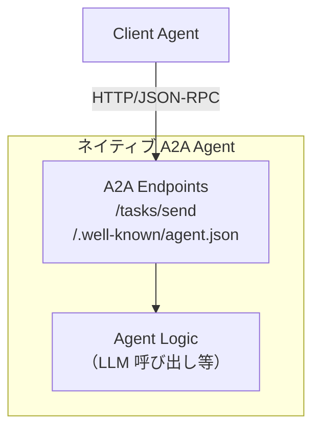
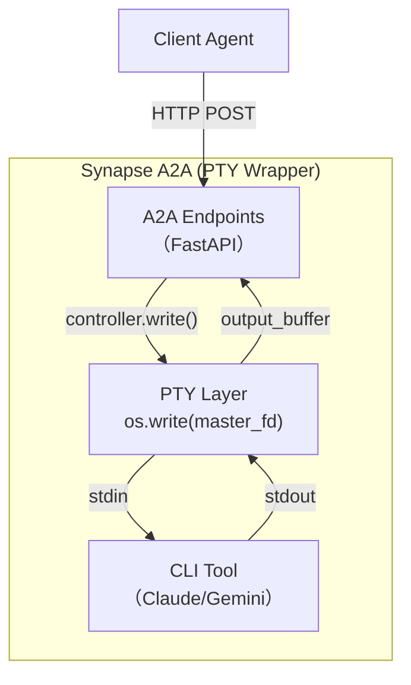
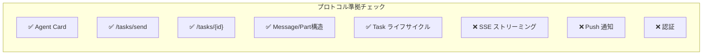
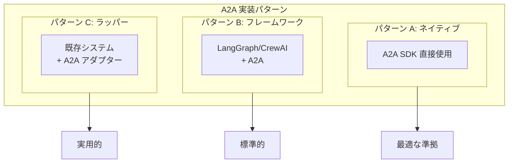
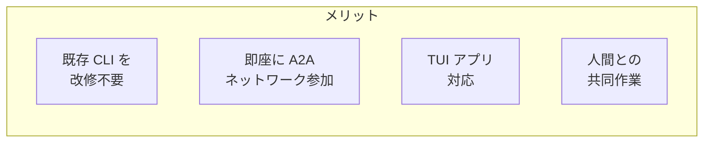
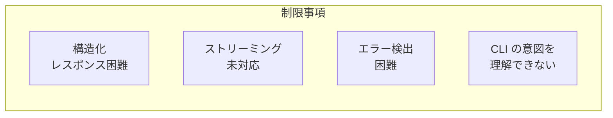
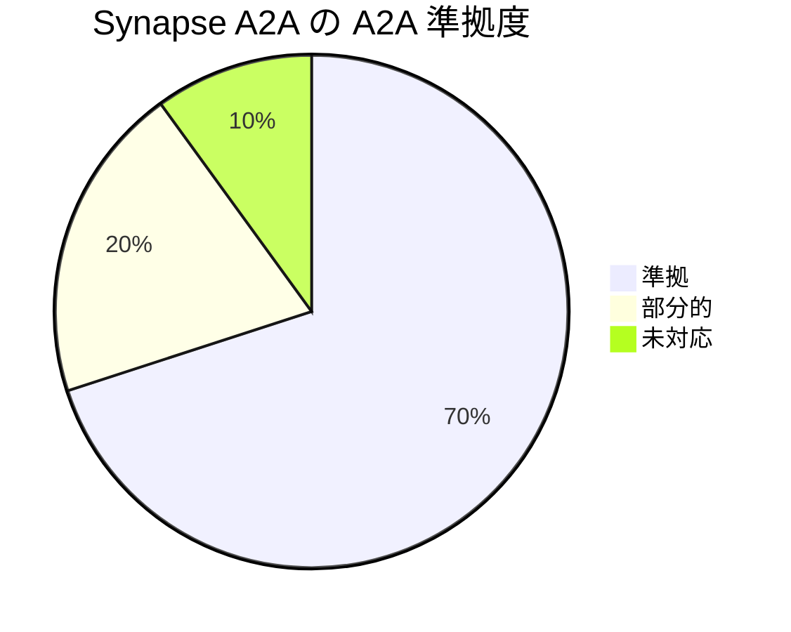
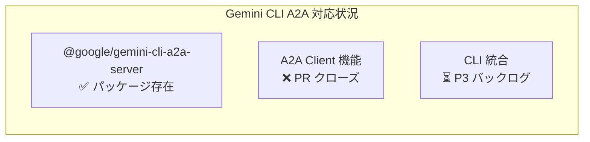
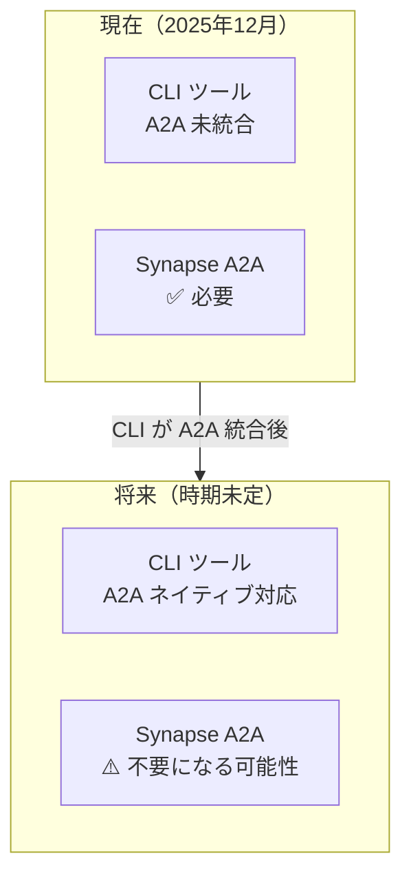

# Synapse A2A 設計思想と A2A プロトコル準拠性

このドキュメントでは、Synapse A2A の PTY ラッピングアプローチが Google A2A プロトコルの設計思想に照らして妥当かどうかを分析します。

---

## 1. 問題提起

Synapse A2A は既存の CLI ツール（Claude Code、Gemini CLI など）を PTY でラップし、A2A プロトコル互換のエンドポイントを提供します。

**疑問**: これは A2A プロトコルの「正しい」使い方なのか？

---

## 2. Google A2A プロトコルの設計原則

[公式仕様](https://a2a-protocol.org/latest/specification/) によると、A2A は以下の原則に基づいています。

### 2.1 Opaque Execution（不透明な実行）

> "Agents can operate without exposing their internal state, memory, or tools"
> （エージェントは内部状態、メモリ、ツールを公開せずに動作できる）

**重要**: A2A は内部実装を問わない。エージェントがどう動作するかは外部から不透明でよい。

### 2.2 その他の原則

| 原則 | 説明 |
|------|------|
| **Simplicity** | HTTP、JSON-RPC 2.0、SSE など既存の標準を再利用 |
| **Async-centric** | 長時間実行タスクを想定した非同期設計 |
| **Modality Agnostic** | テキスト、ファイル、構造化データなど多様なコンテンツをサポート |
| **Enterprise Ready** | 認証、認可、セキュリティ、監視を考慮 |

---

## 3. Synapse A2A のアーキテクチャ

### 3.1 本来想定されるネイティブ実装

エージェントが A2A を**ネイティブに理解**し、タスクを処理する。

### 3.2 Synapse A2A の実装

**CLI ツールは A2A を認識していない**。Synapse がアダプター層として機能。

---

## 4. 設計の正当性分析

### 4.1 Opaque 原則への適合

| 観点 | 評価 | 理由 |
|------|------|------|
| 内部実装の隠蔽 | ✅ | CLI の存在は外部から不可視 |
| インターフェースの標準性 | ✅ | A2A 互換エンドポイントを提供 |
| 状態管理 | ✅ | Task ライフサイクルをマッピング |

**結論**: Opaque 原則に合致している。

### 4.2 プロトコル準拠性

| 機能 | 状態 | 備考 |
|------|------|------|
| Agent Card | ✅ 対応 | `/.well-known/agent.json` |
| Task API | ✅ 対応 | send, get, list, cancel |
| Message/Part | ✅ 対応 | TextPart 中心 |
| Task 状態 | ✅ 対応 | READY/PROCESSING からマッピング |
| SSE | ❌ 未対応 | ポーリングで代替 |
| Push 通知 | ❌ 未対応 | - |
| 認証 | ❌ 未対応 | ローカル前提 |

### 4.3 公式サンプルとの比較

Google A2A の公式サンプル（[github.com/a2aproject/A2A](https://github.com/a2aproject/A2A)）では：

- LangGraph、CrewAI、Google ADK など複数のフレームワークを使用
- 各フレームワークは A2A を「ネイティブに」実装

**Synapse の位置づけ**: フレームワーク = 「CLI + PTY」として捉えることが可能。

---

## 5. 他のアプローチとの比較

### 5.1 実装パターン比較

| パターン | 例 | A2A 理解度 | 実装コスト |
|----------|-----|-----------|----------|
| ネイティブ | Python A2A SDK | 完全 | 高 |
| フレームワーク | LangGraph + A2A | 高 | 中 |
| ラッパー | **Synapse A2A** | 低（アダプター層のみ） | 低 |

### 5.2 ラッパーパターンの妥当性

**公式仕様は「ラッパー」を禁止していない。**

A2A の目標：
> "enabling communication and interoperability between opaque agentic applications"
> （不透明なエージェントアプリケーション間の通信と相互運用を可能にする）

「opaque agentic applications」= CLI ツールもこれに該当する。

---

## 6. メリットとデメリット

### 6.1 PTY ラッピングのメリット

| メリット | 説明 |
|----------|------|
| **改修不要** | Claude Code、Gemini CLI などをそのまま利用 |
| **即座に参加** | A2A エコシステムにすぐ接続 |
| **TUI 対応** | インタラクティブな CLI も対応 |
| **人間との協調** | ターミナルで人間と AI が共同作業 |

### 6.2 デメリットと制限

| デメリット | 説明 |
|------------|------|
| **非構造化出力** | CLI の出力は生テキスト。パースが必要 |
| **ストリーミング困難** | PTY バッファリングの制約 |
| **エラー検出** | 終了コードに依存、意味的エラー検出困難 |
| **意図の欠如** | CLI は A2A メッセージを「普通のテキスト」として受け取る |

---

## 7. 結論

### 7.1 総合評価

| 評価項目 | 判定 |
|----------|------|
| **プロトコル形式** | ✅ 準拠 |
| **Opaque 原則** | ✅ 合致 |
| **設計思想** | ⚠️ 典型的ではないが有効 |
| **実用性** | ✅ 高い |
| **将来性** | ⚠️ CLI が A2A ネイティブになれば不要 |

### 7.2 最終判断

**Synapse A2A は「正しい」が「典型的ではない」A2A 実装**

- プロトコル仕様に**違反していない**
- **Opaque 原則**に完全に合致
- 「A2A 非対応システムを A2A ネットワークに参加させるブリッジ」として**有効**
- **過渡期のソリューション**：CLI が A2A をネイティブサポートするまでの橋渡し

### 7.3 推奨ユースケース

| ユースケース | 推奨度 | 理由 |
|-------------|--------|------|
| ローカル CLI エージェント協調 | ⭐⭐⭐ | 最適 |
| 開発・デバッグ環境 | ⭐⭐⭐ | 最適 |
| プロトタイピング | ⭐⭐⭐ | 迅速に検証可能 |
| 本番エンタープライズ | ⭐ | ネイティブ実装を推奨 |
| クラウド間連携 | ⭐ | 認証・スケーラビリティの課題 |

---

## 8. CLI ツールのネイティブ A2A 対応状況（2025年12月時点）

Synapse A2A が「過渡期のソリューション」であるかどうかを判断するため、主要 CLI ツールの A2A ネイティブ対応状況を調査しました。

### 8.1 Gemini CLI

| コンポーネント | 状態 | 詳細 |
|---------------|------|------|
| **A2A Server パッケージ** | ✅ 存在 | [`@google/gemini-cli-a2a-server`](https://www.npmjs.com/package/@google/gemini-cli-a2a-server) として npm に公開 |
| **A2A Client 機能** | ❌ 未実装 | [PR #3079](https://github.com/google-gemini/gemini-cli/pull/3079) は「優先度低」でクローズ |
| **CLI への統合** | ⏳ 検討中 | [Issue #10482](https://github.com/google-gemini/gemini-cli/issues/10482) は P3（バックログ） |

**PR #3079 クローズの理由**:
> "work to make gemini-cli an a2a client...is currently not prioritized"
> （gemini-cli を A2A クライアントにする作業は現在優先されていない）

**Issue #10482 の状況**:
- A2A サーバーを CLI に統合する機能リクエスト
- Draft PR (#10483) は存在するが「リファクタリング必要」
- セキュリティ懸念：「巨大な攻撃対象になる」という指摘あり
- **優先度 P3（バックログ）** のまま

### 8.2 Claude Code

| 項目 | 状態 |
|------|------|
| **A2A 対応** | ❌ 未対応 |
| **公式計画** | 不明（公開情報なし） |

Claude Code は現時点で A2A プロトコルをネイティブサポートしていません。

### 8.3 その他の CLI ツール

| ツール | A2A 対応 | 備考 |
|--------|---------|------|
| Codex CLI | ❌ | 未対応 |
| GitHub Copilot CLI | ❌ | 未対応 |
| AWS Q CLI | ❌ | 未対応 |

### 8.4 Synapse A2A の位置づけ

**結論**: 2025年12月時点では、主要な CLI ツールはいずれも A2A をネイティブサポートしていません。したがって、Synapse A2A の PTY ラッピングアプローチは**依然として有効かつ必要**です。

ただし、Gemini CLI では A2A 統合が検討されており（優先度は低いものの）、将来的には CLI ツールが A2A をネイティブサポートする可能性があります。その場合、Synapse A2A は不要になります。

---

## 9. 参考資料

### 公式ドキュメント

- [Agent2Agent Protocol Specification (DRAFT v1.0)](https://a2a-protocol.org/latest/specification/)
- [GitHub - a2aproject/A2A](https://github.com/a2aproject/A2A)
- [Announcing the Agent2Agent Protocol (A2A) - Google Developers Blog](https://developers.googleblog.com/en/a2a-a-new-era-of-agent-interoperability/)

### 関連資料

- [What Is Agent2Agent (A2A) Protocol? | IBM](https://www.ibm.com/think/topics/agent2agent-protocol)
- [Agent2Agent protocol (A2A) is getting an upgrade | Google Cloud Blog](https://cloud.google.com/blog/products/ai-machine-learning/agent2agent-protocol-is-getting-an-upgrade)
- [How to Build Two Python Agents with Google's A2A Protocol](https://docs.kanaries.net/articles/build-agent-with-a2a)

### Gemini CLI A2A 関連

- [feat: Adding A2A Support - PR #3079](https://github.com/google-gemini/gemini-cli/pull/3079) - クローズ済み
- [Integrate A2A Server into Gemini CLI - Issue #10482](https://github.com/google-gemini/gemini-cli/issues/10482) - P3 バックログ
- [RFC: Gemini CLI A2A Development-Tool Extension](https://github.com/google-gemini/gemini-cli/discussions/7822)
- [@google/gemini-cli-a2a-server - npm](https://www.npmjs.com/package/@google/gemini-cli-a2a-server)

### 関連ドキュメント

- [google-a2a-spec.md](../guides/google-a2a-spec.md) - Google A2A プロトコル互換性ガイド
- [architecture.md](../guides/architecture.md) - Synapse A2A の内部アーキテクチャ

---

## 更新履歴

| 日付 | 内容 |
|------|------|
| 2025-12-28 | CLI ツールのネイティブ A2A 対応状況（セクション8）を追加 |
| 2025-12-28 | 初版作成。Web 調査に基づく設計思想分析 |
