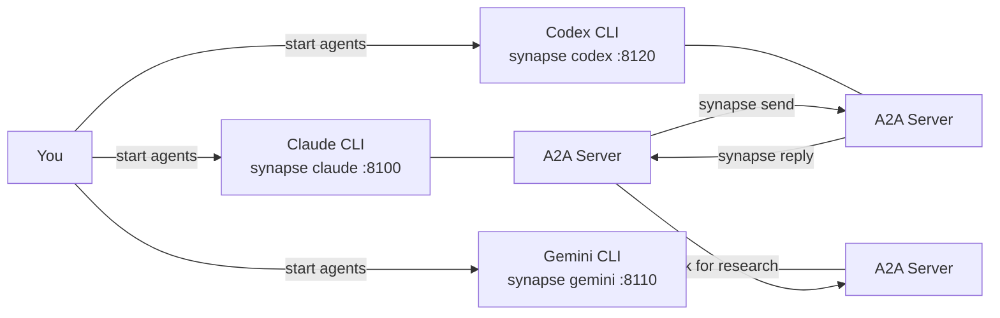

# A2A Overview

## What is A2A?

Synapse A2A lets CLI agents collaborate through the Google A2A Protocol without changing how those agents behave. Each agent keeps running in its normal terminal, while Synapse wraps it with an A2A server so other agents can send tasks to it. You use the same Claude Code, Codex, Gemini, OpenCode, or Copilot CLI workflows, but they can now ask each other for help, review, or delegated work.

## The 3-Step Mental Model

1. **Start agents** — run each CLI through `synapse` so it gets an A2A endpoint, a port, and an agent ID.
2. **They talk** — use `synapse send` to deliver a task to another agent; Synapse routes the message and writes it into that agent's PTY.
3. **You orchestrate** — choose who should draft, review, test, or fix; agents reply with `synapse reply` when a response is expected.

## Diagram



The important part is that the CLI tools do not need native A2A support. Synapse is the adapter: it exposes the standard A2A task interface on one side and preserves the existing terminal workflow on the other.

Read the flow like this:

- **You start normal CLI agents** with `synapse <profile>`.
- **Each agent gets a local A2A server** with discovery and task endpoints.
- **Messages move between A2A servers** instead of depending on copy-paste between terminals.
- **Task text still lands in the receiving terminal**, so the agent can handle it with its normal behavior.
- **Replies go back through Synapse**, which remembers the original sender and delivery route.

## Minimum Use Case

Use Synapse A2A when one agent should produce work and another should check it before you continue. For example: Claude drafts a design, Codex reviews it, and Gemini checks current external context.

Start from the [README Quick Start](../README.md#quick-start) for installation and agent startup. Once two or more agents are running, the minimum workflow is:

```bash
# Terminal 1: start Claude
synapse spawn claude --port 8100 --name designer --role "design drafter"

# Terminal 2: start Codex
synapse spawn codex --port 8120 --name reviewer --role "code reviewer"

# In Claude's terminal: ask Codex for review
synapse send synapse-codex-8120 "Review the current design for correctness and missing tests"

# If the incoming message expected a reply, Codex can respond
synapse reply "I found two risks: add an integration test and clarify rollback behavior."
```

That is enough to turn two independent CLI sessions into a small team. The agents still see normal terminal text; Synapse handles discovery, routing, task IDs, and reply delivery.

What you get from this minimum setup:

- **No new agent runtime** — you keep using the CLIs you already trust.
- **A clear division of labor** — one agent can draft while another reviews.
- **A repeatable handoff** — the same `synapse send` pattern works for lookup, review, implementation, and test triage.
- **A path to larger teams** — once the basic loop works, `synapse spawn` and named roles let you add agents without changing the mental model.

Keep the first workflow small. Start with two agents, one message, and one reply; add roles, spawned helpers, or worktrees only when the task actually needs them.

## Where to Go Next

- [README Quick Start](../README.md#quick-start) — install Synapse A2A and start your first agents.
- [README CLI Commands](../README.md#cli-commands) — learn `synapse send`, `synapse reply`, `synapse spawn`, and related commands.
- [Project Philosophy](project-philosophy.md) — read the deeper rationale behind the non-invasive, A2A-first design.
- [A2A Design Rationale](a2a-design-rationale.md) — understand how the PTY wrapper maps existing CLIs to A2A concepts.
