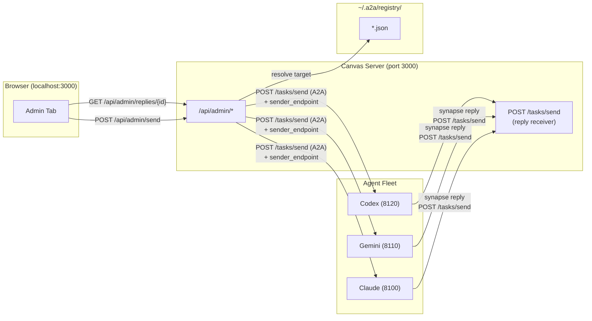
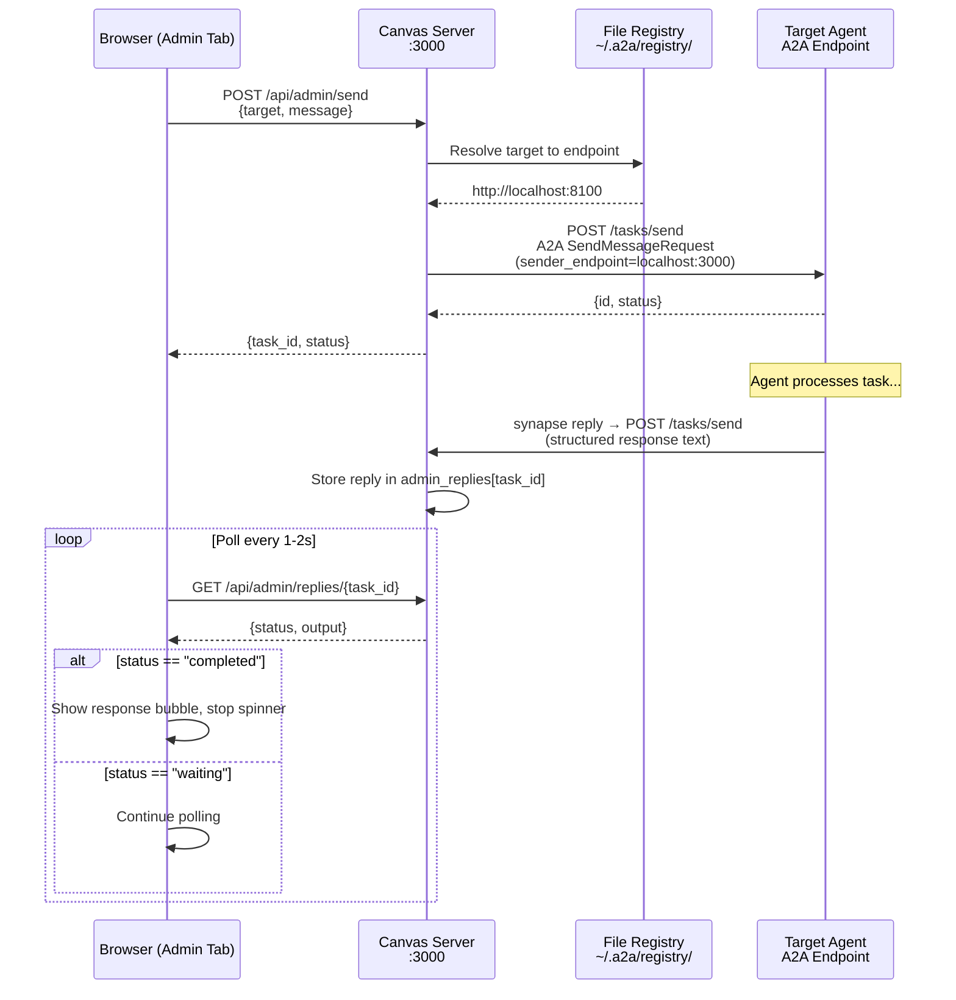
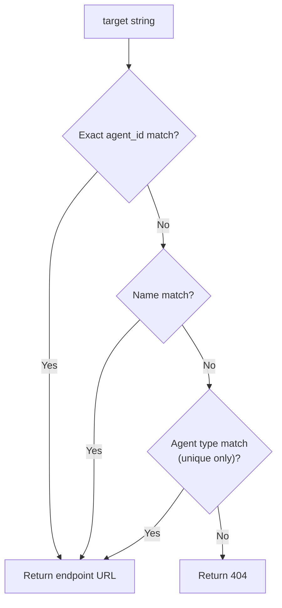
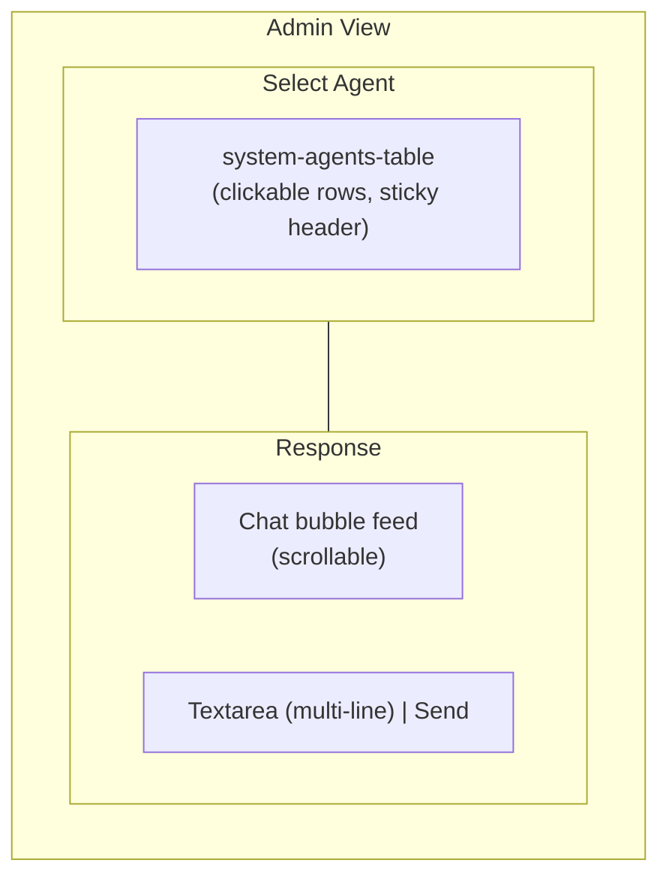
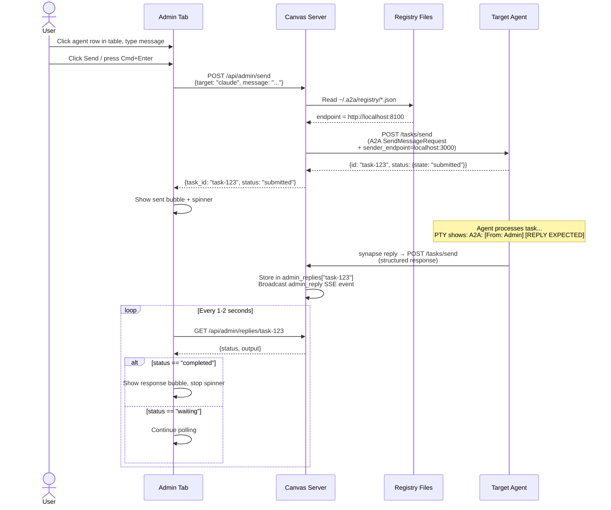

# Canvas Admin Command Center

> Transform Canvas from a read-only display into an interactive command center for managing and communicating with agents directly from the browser.

## Overview

The Admin Command Center extends the Synapse Canvas (browser UI at `localhost:3000`) with the ability to view agent status, send messages, spawn or stop agents, and monitor responses -- all from a single browser tab. It introduces an **Administrator** concept: a designated agent (or human operator) that coordinates the fleet through the Canvas interface.

Before this feature, Canvas was strictly a read-only surface for viewing agent-posted cards. The Admin Command Center adds bidirectional communication while preserving the existing card-based display for other tabs.



## Quick Start

```bash
# 1. Start one or more agents
synapse start claude
synapse start gemini

# 2. Start Canvas
synapse canvas serve

# 3. Open the browser
open http://localhost:3000

# 4. Click the "Admin" tab in the navigation bar
# 5. Click an agent row in the table to select it
# 6. Type a message in the textarea, press Cmd+Enter (or click Send)
```

The Admin tab appears in the Canvas navigation alongside Canvas, Dashboard, History, and System.

## Architecture

### Request Flow

When a user sends a command from the Admin UI, the request follows this path:



**Key design**: The Admin Command Center reuses the same reply mechanism as inter-agent communication (`synapse reply`). By including `sender_endpoint` in the send metadata, the target agent can reply directly to Canvas using the standard A2A callback path (`POST /tasks/send`). This avoids reading PTY output and ensures clean, structured responses.

### Proxy Pattern

The Canvas server acts as a proxy between the browser and agent A2A endpoints. This design provides three benefits:

1. **No CORS issues** -- the browser only talks to `localhost:3000`; cross-origin requests to individual agent ports are avoided entirely.
2. **Internal endpoints stay internal** -- agent A2A ports (8100-8149) are not exposed to the browser directly.
3. **Single entry point** -- all admin operations go through one server, simplifying authentication and logging.

### Agent Resolution

When the Admin API receives a target identifier, it searches the file-based registry (`~/.a2a/registry/*.json`) in priority order:



Valid target formats (same as `synapse send` resolution):

| Format | Example | Notes |
|--------|---------|-------|
| Agent ID | `synapse-claude-8100` | Exact match on `agent_id` field |
| Custom name | `my-claude` | Matches `name` field |
| Agent type | `claude` | Only works when a single instance of that type is running |

## API Reference

All admin endpoints are mounted under `/api/admin/` on the Canvas server.

### GET /api/admin/agents

List all live agents from the registry.

**Response:**

```json
{
  "agents": [
    {
      "agent_id": "synapse-claude-8100",
      "name": "my-claude",
      "agent_type": "claude",
      "status": "READY",
      "port": 8100,
      "endpoint": "http://localhost:8100",
      "role": "code reviewer",
      "skill_set": "synapse-a2a",
      "working_dir": "/path/to/project"
    }
  ]
}
```

The `role`, `skill_set`, and `working_dir` fields are included when available in the agent's registry entry.

### POST /api/admin/send

Forward a message to a target agent using the A2A `SendMessageRequest` format.

**Request body:**

```json
{
  "target": "claude",
  "message": "Review the auth module for security issues"
}
```

**Response:**

```json
{
  "task_id": "task-abc123",
  "status": "submitted"
}
```

**Error responses:**

| Status | Condition |
|--------|-----------|
| 400 | Missing `target` or `message` |
| 404 | Target agent not found in registry |
| 502 | Agent endpoint unreachable |

The message is wrapped into an A2A `Message` with a single `TextPart` before forwarding. The `sender_endpoint` is included so that the agent can reply via `synapse reply`:

```json
{
  "message": {
    "role": "user",
    "parts": [{ "type": "text", "text": "..." }]
  },
  "metadata": {
    "response_mode": "notify",
    "sender": {
      "sender_id": "canvas-admin",
      "sender_name": "Admin",
      "sender_endpoint": "http://localhost:3000"
    }
  }
}
```

The agent's PTY displays the message as `A2A: [From: Admin (canvas-admin)] [REPLY EXPECTED] ...`, and the agent processes and replies using the standard `synapse reply` mechanism.

### POST /tasks/send (Reply Receiver)

Receives agent replies via the standard A2A callback path. When an agent runs `synapse reply`, the response is sent to the `sender_endpoint` specified in the original message metadata — in this case, the Canvas server.

**Request body** (sent by agent automatically):

The reply contains `in_reply_to` or `sender_task_id` in metadata to correlate with the original task. The text content is extracted from `message.parts[]` and stored in an in-memory dict keyed by task ID.

Replies are also broadcast as `admin_reply` SSE events to connected Canvas clients.

### GET /api/admin/replies/{task_id}

Poll for replies received from an agent for a given task.

**Response (waiting):**

```json
{
  "task_id": "task-abc123",
  "status": "waiting",
  "output": ""
}
```

**Response (completed):**

```json
{
  "task_id": "task-abc123",
  "status": "completed",
  "output": "The auth module looks good. No critical issues found."
}
```

### GET /api/admin/tasks/{task_id}?target=X (Fallback)

Proxy a task status request to the target agent. Retained as a fallback for cases where the reply mechanism is not available (e.g., agent does not support `synapse reply`).

**Query parameters:**

| Parameter | Required | Description |
|-----------|----------|-------------|
| `target` | Yes | Agent identifier (same resolution as `/send`) |

**Response:**

```json
{
  "task_id": "task-abc123",
  "status": "completed",
  "output": "The auth module looks good. No critical issues found.",
  "error": null
}
```

### POST /api/admin/start

Start the administrator agent using the configuration from `.synapse/settings.json`.

**Response:**

```json
{
  "status": "started",
  "pid": 12345,
  "port": 8150
}
```

### POST /api/admin/stop

Stop the administrator agent by sending SIGTERM to its process.

**Response:**

```json
{ "status": "stopped", "pid": 12345 }
```

Returns `{"status": "not_running"}` if the administrator is not active.

### POST /api/admin/agents/spawn

Spawn a new agent instance with automatic port allocation.

**Request body:**

```json
{
  "profile": "claude",
  "name": "reviewer",
  "role": "code reviewer"
}
```

| Field | Required | Description |
|-------|----------|-------------|
| `profile` | Yes | Agent type (`claude`, `gemini`, `codex`, `opencode`, `copilot`) |
| `name` | No | Custom name for the agent |
| `role` | No | Role description |

**Response:**

```json
{
  "status": "started",
  "agent_id": "synapse-claude-8101",
  "pid": 12346,
  "port": 8101
}
```

Port allocation uses `PortManager` to find the first available port in the profile's range.

### POST /api/admin/jump/{agent_id}

Jump to the terminal running a specific agent. Double-clicking an agent row in the Admin table triggers this endpoint.

Uses the same terminal detection as `synapse jump`: walks the agent's parent process chain to identify the host terminal (tmux, VS Code, Ghostty, iTerm2, Terminal.app) and activates the corresponding window/tab/pane.

**Response (success):**

```json
{ "ok": true }
```

**Response (failure):**

```json
{
  "ok": false,
  "error": "terminal=undetected, tty=none, pid=12345"
}
```

| Status | Condition |
|--------|-----------|
| 200 `ok: false` | Agent found but terminal jump failed (unsupported terminal or missing TTY) |
| 200 `ok: false` | Agent not found in registry |

### DELETE /api/admin/agents/{agent_id}

Stop a specific agent by sending SIGTERM to its process.

**Response:**

```json
{ "status": "stopped", "agent_id": "synapse-claude-8100", "pid": 12345 }
```

Returns `{"status": "not_found", "agent_id": "..."}` if the agent is not in the registry.

## Configuration

### Administrator Agent

Configure a dedicated administrator agent in `.synapse/settings.json`:

```json
{
  "administrator": {
    "profile": "claude",
    "name": "Admin",
    "role": "coordinator",
    "skill_set": "manager",
    "port": 8150,
    "tool_args": ["--dangerously-skip-permissions"],
    "auto_start": false
  }
}
```

| Field | Type | Default | Description |
|-------|------|---------|-------------|
| `profile` | string | `"claude"` | Agent type to use for the administrator |
| `name` | string | `"Admin"` | Display name |
| `role` | string | `""` | Role description injected into agent bootstrap |
| `skill_set` | string | `""` | Skill set to assign |
| `port` | integer | `8150` | Fixed port (must be in 8150-8159 range) |
| `tool_args` | string[] | `[]` | Extra CLI arguments passed via `SYNAPSE_TOOL_ARGS` |
| `auto_start` | boolean | `false` | Start administrator automatically with Canvas |

### Port Allocation

The admin port range is registered in `PortManager` alongside agent types:

| Agent Type | Port Range |
|------------|------------|
| claude | 8100-8109 |
| gemini | 8110-8119 |
| codex | 8120-8129 |
| opencode | 8130-8139 |
| copilot | 8140-8149 |
| **admin** | **8150-8159** |

## Frontend Components

The Admin view is rendered entirely in the existing Canvas single-page application. No separate build step is required.

### UI Layout



### Agent List (Select Agent)

Displays all active agents in a `system-agents-table` retrieved from `GET /api/admin/agents`. The table has sticky headers and clickable rows -- clicking a row selects that agent as the target; **double-clicking** a row jumps to that agent's terminal (`POST /api/admin/jump/{agent_id}`). Each row shows:

- **Status dot** -- color-coded by agent status (green = READY, amber = PROCESSING, red = error)
- **Agent name** -- custom name or agent ID
- **Agent type** -- profile type (claude, gemini, etc.)
- **Role** -- role description (if set)
- **Status text** -- current status string

The section title reads "Select Agent". The list refreshes when the Admin tab is activated. The glass-morphism styling is consistent with other Canvas panels, using `--color-accent` variables.

### Chat Feed

A chat-bubble interface that displays the conversation between the operator and agents:

- **Sent commands** -- right-aligned bubbles with accent background color
- **Agent responses** -- left-aligned bubbles with secondary background color
- **Timestamps** -- shown below each bubble
- **Auto-scroll** -- feed scrolls to the latest message

### Input Bar

Located at the bottom of the Response section:

- **Textarea** -- multi-line message field with IME composition support; submit with **Cmd+Enter** (macOS) or **Ctrl+Enter**, or click the Send button. Plain Enter inserts a newline for multi-line messages
- **Send button** -- triggers `POST /api/admin/send`; disabled during pending requests to prevent double-send

### Response Handling

After sending a message, the frontend polls `GET /api/admin/replies/{task_id}` to check for agent replies:

- **Interval:** 1 second for the first 10 attempts, then 2 seconds
- **Timeout:** 5 minutes (150 attempts)
- **Terminal states:** `completed`, `failed`

The response flow uses the same `synapse reply` mechanism as inter-agent communication. The agent processes the message and replies to Canvas's `sender_endpoint`, which stores the reply and makes it available via the polling endpoint.

A spinner is shown in the chat feed while waiting for a reply.

## Files Changed

### Backend

| File | Changes |
|------|---------|
| `synapse/canvas/server.py` | Admin endpoints, reply receiver (`POST /tasks/send`), reply polling (`GET /api/admin/replies/{task_id}`), terminal jump (`POST /api/admin/jump/{agent_id}`), helper functions (`_resolve_agent_endpoint`, `_start_administrator`, `_stop_administrator`, `_spawn_agent`, `_stop_agent`, `_get_registry_dir`) |
| `synapse/settings.py` | Administrator config section, `get_administrator_config()` method |
| `synapse/port_manager.py` | Admin port range entry (`8150-8159`) in `PORT_RANGES` |

### Frontend

| File | Changes |
|------|---------|
| `synapse/canvas/templates/index.html` | Admin navigation tab, `admin-view` section markup |
| `synapse/canvas/static/canvas.js` | Admin route handler, `loadAdminAgents`, `renderAdminAgentsTable` (system-agents-table with clickable rows, double-click terminal jump), `jumpToAgent`, `createAdminBubble`/`addAdminBubble`, `sendAdminCommand` (double-send prevention), `pollAdminTask` (polls `/api/admin/replies/` for agent replies), `escapeHtml`, IME composition handling |
| `synapse/canvas/static/canvas.css` | Admin view layout, glassmorphism panels (consistent `--color-accent` variables), sticky table headers, chat bubble styles, textarea input bar, spinner animation |

### Tests

| File | Coverage |
|------|----------|
| `tests/test_canvas_admin.py` | 16 tests covering admin endpoints, config loading, port range validation |
| `tests/test_canvas_frontend.py` | 6 new frontend regression tests for admin UI elements |

## Design Decisions

### Why proxy instead of direct browser-to-agent requests?

Direct requests from the browser to agent ports (e.g., `localhost:8100`) would require CORS headers on every agent endpoint and expose internal A2A ports. The proxy pattern keeps agents unaware of the browser -- they receive standard A2A requests just as they would from other agents.

### Why reuse A2A protocol instead of a custom admin protocol?

The Admin send endpoint constructs a standard A2A `SendMessageRequest` with `Message` and `TextPart`. Agents already implement `/tasks/send` for inter-agent communication, so no new protocol surface is needed. This also means the administrator agent (if configured) can participate as a regular A2A peer.

### Why reply-based instead of PTY streaming?

Early iterations attempted to stream PTY output via SSE proxy, but this required extensive terminal junk stripping (ANSI escapes, status bars, spinner animations) and produced unreliable results. The reply-based approach reuses the existing `synapse reply` mechanism — the same infrastructure agents use to communicate with each other — ensuring clean, structured responses without any terminal output parsing.

### Why polling instead of WebSocket?

Canvas already uses Server-Sent Events (SSE) for card updates. The reply is also broadcast as an `admin_reply` SSE event, but the frontend uses polling as the primary mechanism for simplicity. Polling at 1-2 second intervals is sufficient for the human-in-the-loop use case and avoids additional connection management complexity.

### Why registry-based discovery?

Synapse already maintains a file-based registry (`~/.a2a/registry/*.json`) for all running agents. The Admin API reuses this existing infrastructure rather than maintaining a separate agent list, ensuring consistency with `synapse list`, `synapse send`, and other CLI commands.

## Sequence: Full Admin Interaction

The following diagram shows the complete lifecycle of an admin command, from user input through response display:



## Recent Fixes

The following issues were resolved after the initial release:

| Issue | Fix |
|-------|-----|
| Response contained terminal junk (ANSI escapes, status bars, spinners) | **Architecture change**: Replaced artifact-polling with reply-based flow (`synapse reply`). Responses are now structured text, not PTY output |
| Agent responses showed only 1 line (premature artifact completion) | Eliminated by reply-based flow — agent sends complete response via `synapse reply` |
| IME composition (Japanese/Chinese input) triggered premature send | `compositionstart`/`compositionend` event handling prevents send during active composition |
| Double-send when clicking Send rapidly | Send button and Cmd+Enter disabled while a request is pending |
| Stray `console.log` statements in production | Removed |
| Glass-morphism inconsistency across panels | Unified `--color-accent` CSS variable usage |

## Technical Details: Terminal Jump Architecture

The terminal jump feature (`POST /api/admin/jump/{agent_id}`) enables jumping from the Canvas browser UI to the terminal running a specific agent. This section describes the internal mechanisms.

### Terminal Detection via Parent Process Chain

When an agent is selected for jump, the system needs to determine **which terminal application** the agent is running in. This cannot be done by checking the Canvas server's own environment variables (e.g., `$TMUX`, `$TERM_PROGRAM`) because the server runs as a background daemon — its environment reflects how it was launched, not where each agent runs.

Instead, `_detect_terminal_from_pid_chain(pid)` walks the agent's parent process tree using `ps -p <pid> -o ppid=,comm=`:

```
Agent (python) → shell (zsh) → tmux         → detected as "tmux"
Agent (python) → shell (zsh) → Code Helper  → detected as "VSCode"
Agent (python) → shell (zsh) → ghostty      → detected as "Ghostty"
```

Pattern matching maps process names to terminal types: `"tmux"`, `"Code Helper"` / `"Visual Studio Code"` → VSCode, `"ghostty"` → Ghostty, `"iTerm2"` → iTerm2, etc.

### TTY Resolution from PID

Agent registry entries may not always contain `tty_device`. When missing, `_resolve_tty_from_pid(pid)` uses `ps -o tty= -p <pid>` to find the controlling terminal device (e.g., `/dev/ttys045`). This is resolved once at the top of `jump_to_terminal` and written back to `agent_info` to avoid redundant subprocess calls downstream.

### tmux Jump Flow

For tmux agents, the jump involves three layers:

1. **Pane selection**: `tmux list-panes -a` lists all panes with their TTY devices. The agent's TTY is matched to find the target pane, then `tmux select-pane` and `select-window` focus it.

2. **Host terminal activation**: `_detect_tmux_host_terminal()` queries `tmux list-clients -F "#{client_termname}"` to identify the outer terminal (e.g., `xterm-ghostty` → Ghostty). Then `open -a <app>` brings it to the foreground on macOS.

3. **Tab switching (Ghostty)**: When multiple Ghostty tabs each run independent tmux clients connected to different sessions, `tmux switch-client` is insufficient (each tab is its own client). Instead, `_switch_terminal_tab` uses macOS Accessibility API via AppleScript to click the correct tab bar radio button matching the tmux session ID.

### VS Code Jump Flow

For VS Code agents, the jump simply activates VS Code via AppleScript (`tell application "Visual Studio Code" to activate`). Terminal-level pane focusing within VS Code is not supported due to VS Code's limited scriptable API.

### Supported Terminals

| Terminal | Jump Method | Tab Switch |
|----------|------------|------------|
| tmux (in Ghostty) | TTY pane match + `open -a` | AppleScript radio button click |
| tmux (in iTerm2) | TTY pane match + `open -a` | AppleScript session name match |
| tmux (in Terminal.app) | TTY pane match + `open -a` | — |
| VS Code | AppleScript activate | — |
| Ghostty (standalone) | `open -a` | — |
| iTerm2 (standalone) | AppleScript TTY match | — |
| Zellij | `open -a` (limited) | — |

## Troubleshooting

| Symptom | Cause | Fix |
|---------|-------|-----|
| Agent list is empty | No agents running or registry directory missing | Start an agent with `synapse start claude` |
| "Agent not found" on send | Target identifier does not match any registry entry | Use `synapse list --json` to verify agent IDs and names |
| 502 error on send | Agent process crashed or port is unreachable | Check agent logs, restart with `synapse start` |
| Polling times out (5 min) | Agent did not reply (busy, crashed, or does not support `synapse reply`) | Check agent status with `synapse list`; retry or use a different agent |
| Reply not received | Agent lacks `sender_endpoint` awareness | Ensure agent has Synapse bootstrap instructions; reply stack must contain canvas-admin |
| Admin tab not visible | Canvas running an older version without admin support | Stop Canvas (`synapse canvas stop`) and restart (`synapse canvas serve`) |

## Related Documentation

- [Synapse A2A Reference](synapse-reference.md) -- full command reference, profile configuration, and testing
- [CLAUDE.md](../CLAUDE.md) -- project overview and development flow
