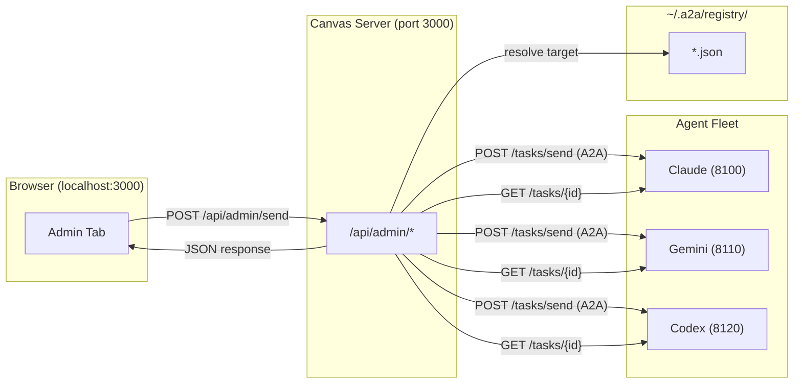
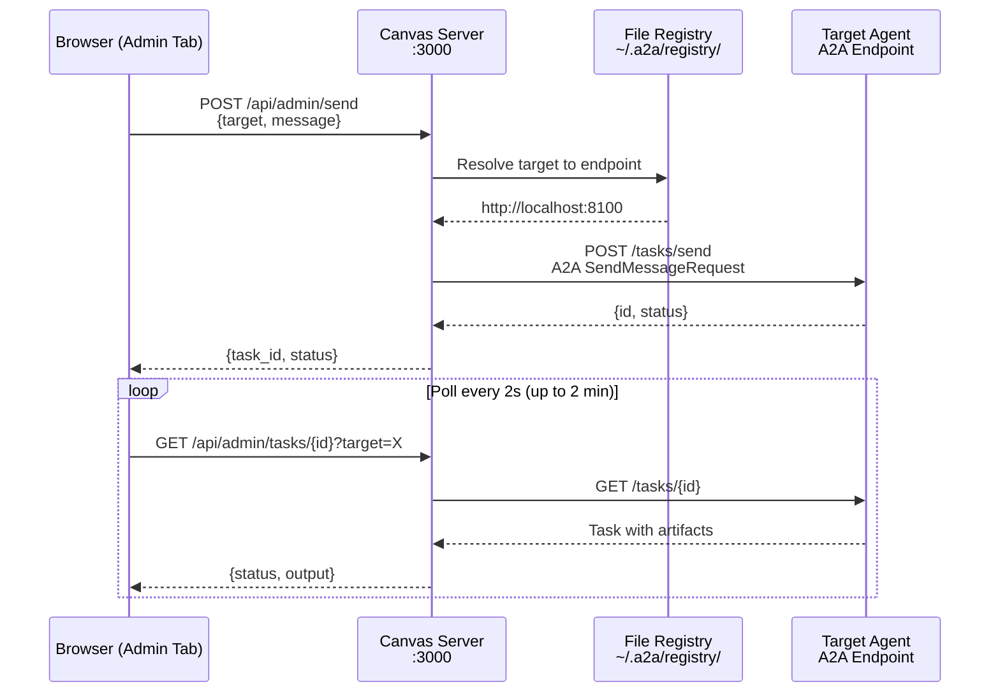
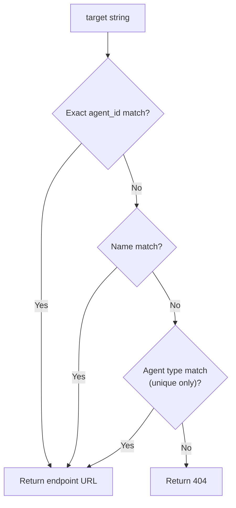
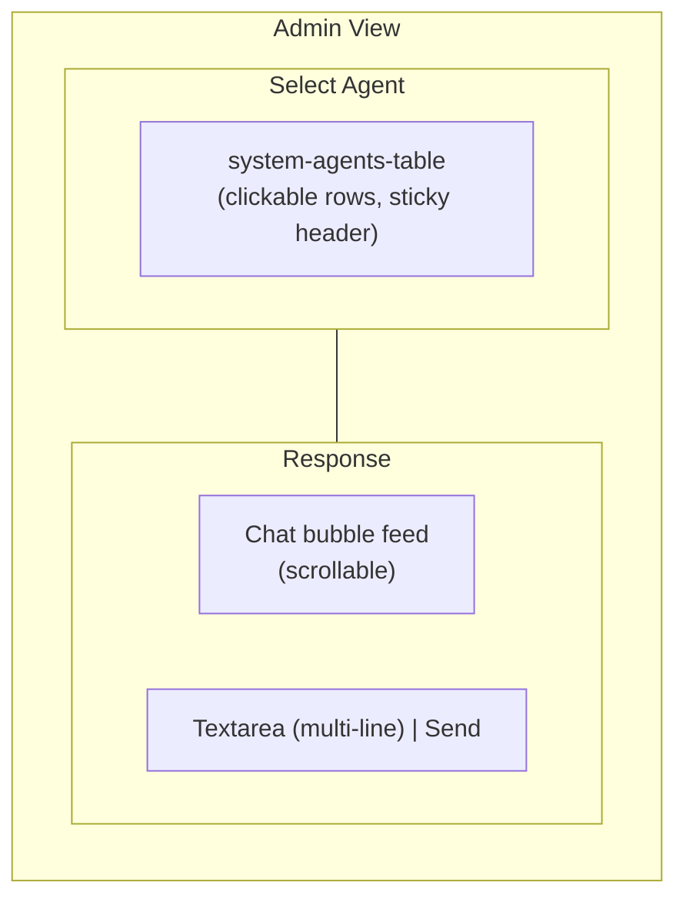
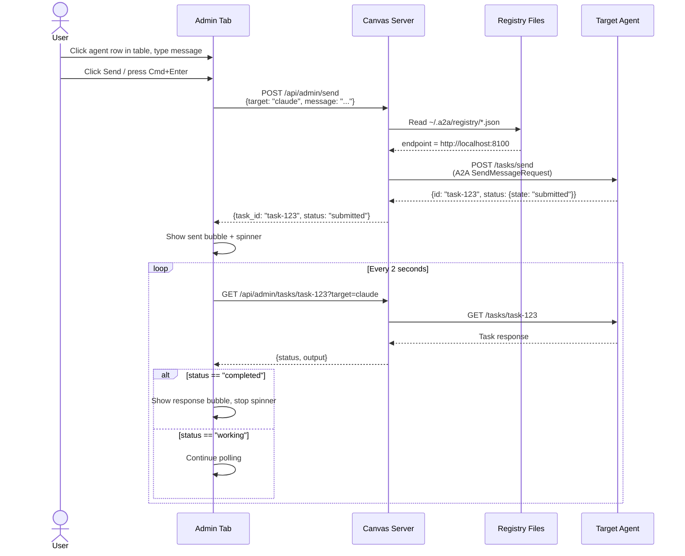

# Canvas Admin Command Center

> Transform Canvas from a read-only display into an interactive command center for managing and communicating with agents directly from the browser.

## Overview

The Admin Command Center extends the Synapse Canvas (browser UI at `localhost:3000`) with the ability to view agent status, send messages, spawn or stop agents, and monitor responses -- all from a single browser tab. It introduces an **Administrator** concept: a designated agent (or human operator) that coordinates the fleet through the Canvas interface.

Before this feature, Canvas was strictly a read-only surface for viewing agent-posted cards. The Admin Command Center adds bidirectional communication while preserving the existing card-based display for other tabs.



## Quick Start

```bash
# 1. Start one or more agents
synapse start claude
synapse start gemini

# 2. Start Canvas
synapse canvas serve

# 3. Open the browser
open http://localhost:3000

# 4. Click the "Admin" tab in the navigation bar
# 5. Click an agent row in the table to select it
# 6. Type a message in the textarea, press Cmd+Enter (or click Send)
```

The Admin tab appears in the Canvas navigation alongside Canvas, Dashboard, History, and System.

## Architecture

### Request Flow

When a user sends a command from the Admin UI, the request follows this path:



### Proxy Pattern

The Canvas server acts as a proxy between the browser and agent A2A endpoints. This design provides three benefits:

1. **No CORS issues** -- the browser only talks to `localhost:3000`; cross-origin requests to individual agent ports are avoided entirely.
2. **Internal endpoints stay internal** -- agent A2A ports (8100-8149) are not exposed to the browser directly.
3. **Single entry point** -- all admin operations go through one server, simplifying authentication and logging.

### Agent Resolution

When the Admin API receives a target identifier, it searches the file-based registry (`~/.a2a/registry/*.json`) in priority order:



Valid target formats (same as `synapse send` resolution):

| Format | Example | Notes |
|--------|---------|-------|
| Agent ID | `synapse-claude-8100` | Exact match on `agent_id` field |
| Custom name | `my-claude` | Matches `name` field |
| Agent type | `claude` | Only works when a single instance of that type is running |

## API Reference

All admin endpoints are mounted under `/api/admin/` on the Canvas server.

### GET /api/admin/agents

List all live agents from the registry.

**Response:**

```json
{
  "agents": [
    {
      "agent_id": "synapse-claude-8100",
      "name": "my-claude",
      "agent_type": "claude",
      "status": "READY",
      "port": 8100,
      "endpoint": "http://localhost:8100",
      "role": "code reviewer",
      "skill_set": "synapse-a2a",
      "working_dir": "/path/to/project"
    }
  ]
}
```

The `role`, `skill_set`, and `working_dir` fields are included when available in the agent's registry entry.

### POST /api/admin/send

Forward a message to a target agent using the A2A `SendMessageRequest` format.

**Request body:**

```json
{
  "target": "claude",
  "message": "Review the auth module for security issues"
}
```

**Response:**

```json
{
  "task_id": "task-abc123",
  "status": "submitted"
}
```

**Error responses:**

| Status | Condition |
|--------|-----------|
| 400 | Missing `target` or `message` |
| 404 | Target agent not found in registry |
| 502 | Agent endpoint unreachable |

The message is wrapped into an A2A `Message` with a single `TextPart` before forwarding:

```json
{
  "message": {
    "role": "user",
    "parts": [{ "type": "text", "text": "..." }]
  }
}
```

### GET /api/admin/tasks/{task_id}?target=X

Proxy a task status request to the target agent. Used by the frontend to poll for responses after sending a command.

**Query parameters:**

| Parameter | Required | Description |
|-----------|----------|-------------|
| `target` | Yes | Agent identifier (same resolution as `/send`) |

**Response:**

```json
{
  "task_id": "task-abc123",
  "status": "completed",
  "output": "The auth module looks good. No critical issues found.",
  "error": null
}
```

The endpoint extracts text from all `artifacts[].parts[]` (multi-artifact responses are fully supported) and `message.parts[]` in the A2A task response, combining them into a single `output` string. Terminal control sequences (ANSI escapes, BEL characters, status bar junk) are stripped from the output before returning to the browser.

### POST /api/admin/start

Start the administrator agent using the configuration from `.synapse/settings.json`.

**Response:**

```json
{
  "status": "started",
  "pid": 12345,
  "port": 8150
}
```

### POST /api/admin/stop

Stop the administrator agent by sending SIGTERM to its process.

**Response:**

```json
{ "status": "stopped", "pid": 12345 }
```

Returns `{"status": "not_running"}` if the administrator is not active.

### POST /api/admin/agents/spawn

Spawn a new agent instance with automatic port allocation.

**Request body:**

```json
{
  "profile": "claude",
  "name": "reviewer",
  "role": "code reviewer"
}
```

| Field | Required | Description |
|-------|----------|-------------|
| `profile` | Yes | Agent type (`claude`, `gemini`, `codex`, `opencode`, `copilot`) |
| `name` | No | Custom name for the agent |
| `role` | No | Role description |

**Response:**

```json
{
  "status": "started",
  "agent_id": "synapse-claude-8101",
  "pid": 12346,
  "port": 8101
}
```

Port allocation uses `PortManager` to find the first available port in the profile's range.

### DELETE /api/admin/agents/{agent_id}

Stop a specific agent by sending SIGTERM to its process.

**Response:**

```json
{ "status": "stopped", "agent_id": "synapse-claude-8100", "pid": 12345 }
```

Returns `{"status": "not_found", "agent_id": "..."}` if the agent is not in the registry.

## Configuration

### Administrator Agent

Configure a dedicated administrator agent in `.synapse/settings.json`:

```json
{
  "administrator": {
    "profile": "claude",
    "name": "Admin",
    "role": "coordinator",
    "skill_set": "manager",
    "port": 8150,
    "tool_args": ["--dangerously-skip-permissions"],
    "auto_start": false
  }
}
```

| Field | Type | Default | Description |
|-------|------|---------|-------------|
| `profile` | string | `"claude"` | Agent type to use for the administrator |
| `name` | string | `"Admin"` | Display name |
| `role` | string | `""` | Role description injected into agent bootstrap |
| `skill_set` | string | `""` | Skill set to assign |
| `port` | integer | `8150` | Fixed port (must be in 8150-8159 range) |
| `tool_args` | string[] | `[]` | Extra CLI arguments passed via `SYNAPSE_TOOL_ARGS` |
| `auto_start` | boolean | `false` | Start administrator automatically with Canvas |

### Port Allocation

The admin port range is registered in `PortManager` alongside agent types:

| Agent Type | Port Range |
|------------|------------|
| claude | 8100-8109 |
| gemini | 8110-8119 |
| codex | 8120-8129 |
| opencode | 8130-8139 |
| copilot | 8140-8149 |
| **admin** | **8150-8159** |

## Frontend Components

The Admin view is rendered entirely in the existing Canvas single-page application. No separate build step is required.

### UI Layout



### Agent List (Select Agent)

Displays all active agents in a `system-agents-table` retrieved from `GET /api/admin/agents`. The table has sticky headers and clickable rows -- clicking a row selects that agent as the target. Each row shows:

- **Status dot** -- color-coded by agent status (green = READY, amber = PROCESSING, red = error)
- **Agent name** -- custom name or agent ID
- **Agent type** -- profile type (claude, gemini, etc.)
- **Role** -- role description (if set)
- **Status text** -- current status string

The section title reads "Select Agent". The list refreshes when the Admin tab is activated. The glass-morphism styling is consistent with other Canvas panels, using `--color-accent` variables.

### Chat Feed

A chat-bubble interface that displays the conversation between the operator and agents:

- **Sent commands** -- right-aligned bubbles with accent background color
- **Agent responses** -- left-aligned bubbles with secondary background color
- **Timestamps** -- shown below each bubble
- **Auto-scroll** -- feed scrolls to the latest message

### Input Bar

Located at the bottom of the Response section:

- **Textarea** -- multi-line message field with IME composition support; submit with **Cmd+Enter** (macOS) or **Ctrl+Enter**, or click the Send button. Plain Enter inserts a newline for multi-line messages
- **Send button** -- triggers `POST /api/admin/send`; disabled during pending requests to prevent double-send

### Response Polling

After sending a message, the frontend polls `GET /api/admin/tasks/{id}?target=X` with:

- **Interval:** 2 seconds
- **Timeout:** 2 minutes (60 attempts)
- **Terminal states:** `completed`, `failed`, `canceled`

A spinner is shown in the chat feed while polling is active.

## Files Changed

### Backend

| File | Changes |
|------|---------|
| `synapse/canvas/server.py` | 7 admin endpoints, helper functions (`_resolve_agent_endpoint`, `_start_administrator`, `_stop_administrator`, `_spawn_agent`, `_stop_agent`, `_get_registry_dir`) |
| `synapse/settings.py` | Administrator config section, `get_administrator_config()` method |
| `synapse/port_manager.py` | Admin port range entry (`8150-8159`) in `PORT_RANGES` |

### Frontend

| File | Changes |
|------|---------|
| `synapse/canvas/templates/index.html` | Admin navigation tab, `admin-view` section markup |
| `synapse/canvas/static/canvas.js` | Admin route handler, `loadAdminAgents`, `renderAdminAgentsTable` (system-agents-table with clickable rows), `addAdminBubble`, `sendAdminCommand` (double-send prevention), `pollAdminTask` (adaptive polling, terminal junk stripping), `escapeHtml`, IME composition handling |
| `synapse/canvas/static/canvas.css` | Admin view layout, glassmorphism panels (consistent `--color-accent` variables), sticky table headers, chat bubble styles, textarea input bar, spinner animation |

### Tests

| File | Coverage |
|------|----------|
| `tests/test_canvas_admin.py` | 16 tests covering admin endpoints, config loading, port range validation |
| `tests/test_canvas_frontend.py` | 6 new frontend regression tests for admin UI elements |

## Design Decisions

### Why proxy instead of direct browser-to-agent requests?

Direct requests from the browser to agent ports (e.g., `localhost:8100`) would require CORS headers on every agent endpoint and expose internal A2A ports. The proxy pattern keeps agents unaware of the browser -- they receive standard A2A requests just as they would from other agents.

### Why reuse A2A protocol instead of a custom admin protocol?

The Admin send endpoint constructs a standard A2A `SendMessageRequest` with `Message` and `TextPart`. Agents already implement `/tasks/send` for inter-agent communication, so no new protocol surface is needed. This also means the administrator agent (if configured) can participate as a regular A2A peer.

### Why polling instead of WebSocket?

Canvas already uses Server-Sent Events (SSE) for card updates. Adding WebSocket for admin responses would introduce a second real-time transport. Polling at 2-second intervals is simple, sufficient for the human-in-the-loop use case, and avoids additional connection management complexity.

### Why registry-based discovery?

Synapse already maintains a file-based registry (`~/.a2a/registry/*.json`) for all running agents. The Admin API reuses this existing infrastructure rather than maintaining a separate agent list, ensuring consistency with `synapse list`, `synapse send`, and other CLI commands.

## Sequence: Full Admin Interaction

The following diagram shows the complete lifecycle of an admin command, from user input through response display:



## Recent Fixes

The following issues were resolved after the initial release:

| Issue | Fix |
|-------|-----|
| IME composition (Japanese/Chinese input) triggered premature send | `compositionstart`/`compositionend` event handling prevents send during active composition |
| Multi-artifact responses showed only the first artifact | Response extraction now iterates all `artifacts[].parts[]` |
| Terminal junk (BEL `\x07`, ANSI escapes, status bar lines) leaked into response text | Adaptive stripping with regex-based cleanup before display |
| Double-send when clicking Send rapidly | Send button and Cmd+Enter disabled while a request is pending |
| Stray `console.log` statements in production | Removed |
| Glass-morphism inconsistency across panels | Unified `--color-accent` CSS variable usage |

## Troubleshooting

| Symptom | Cause | Fix |
|---------|-------|-----|
| Agent list is empty | No agents running or registry directory missing | Start an agent with `synapse start claude` |
| "Agent not found" on send | Target identifier does not match any registry entry | Use `synapse list --json` to verify agent IDs and names |
| 502 error on send | Agent process crashed or port is unreachable | Check agent logs, restart with `synapse start` |
| Polling times out (2 min) | Agent is busy with a long-running task | Wait for the agent to finish its current task, then retry |
| Admin tab not visible | Canvas running an older version without admin support | Stop Canvas (`synapse canvas stop`) and restart (`synapse canvas serve`) |

## Related Documentation

- [Synapse A2A Reference](synapse-reference.md) -- full command reference, profile configuration, and testing
- [CLAUDE.md](../CLAUDE.md) -- project overview and development flow
