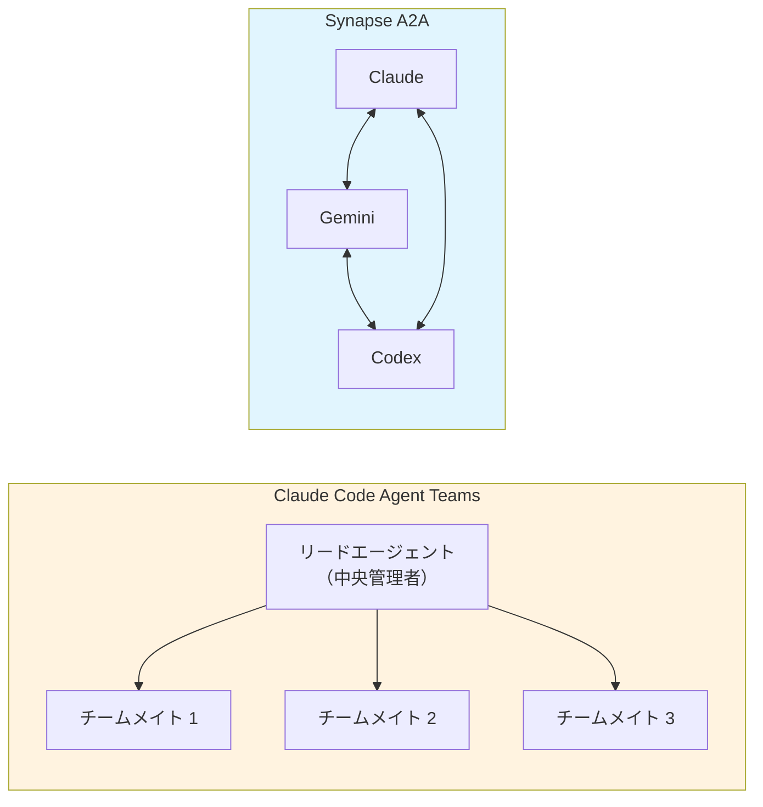
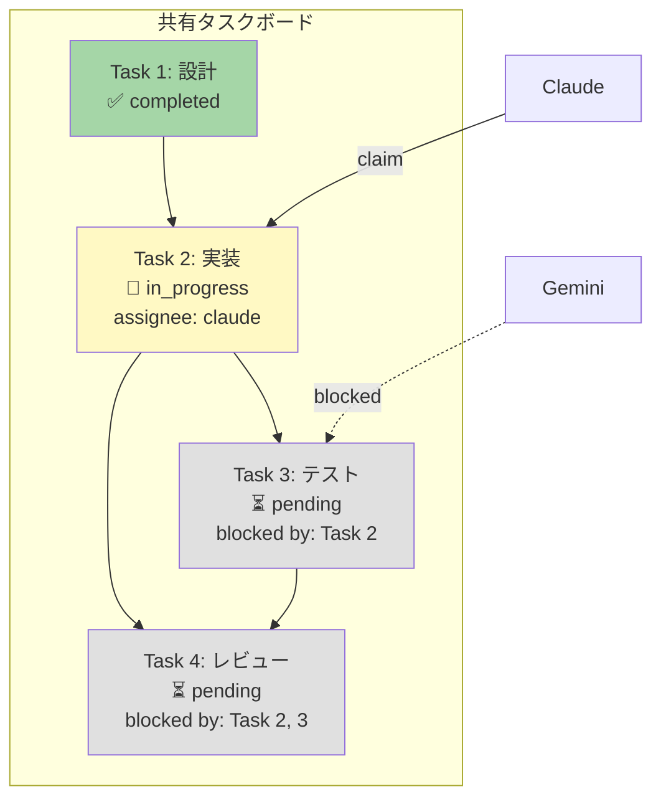
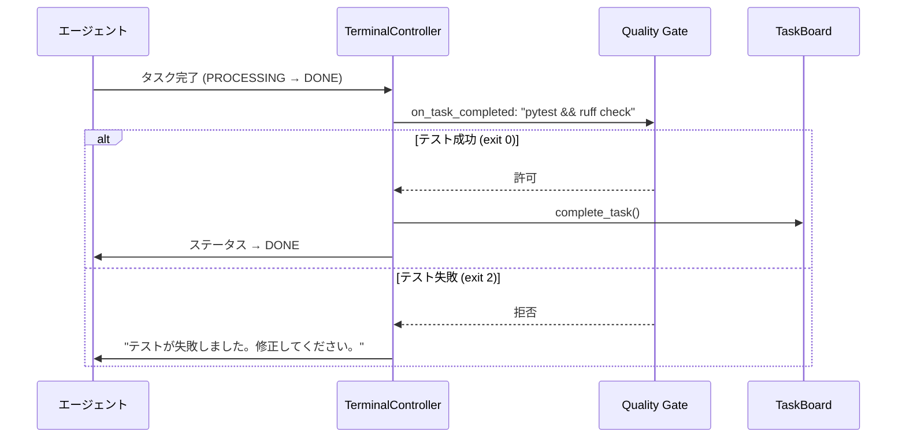
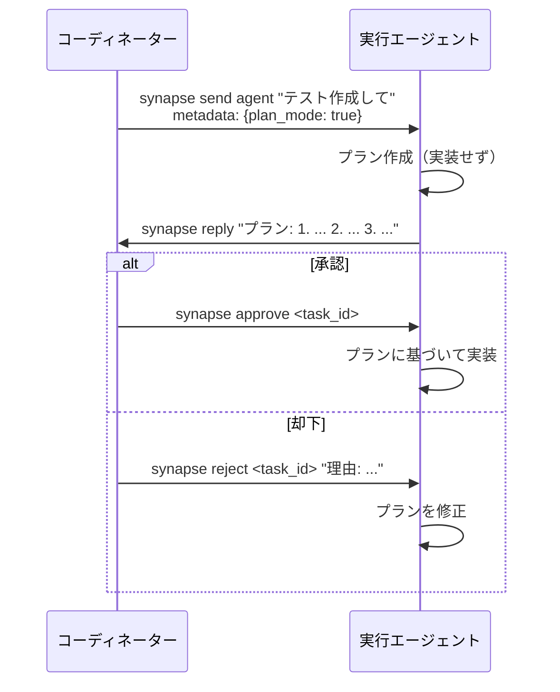
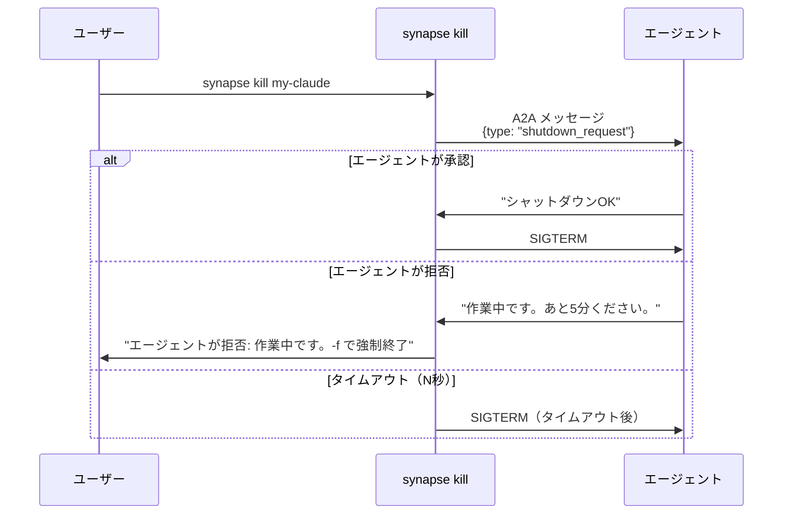
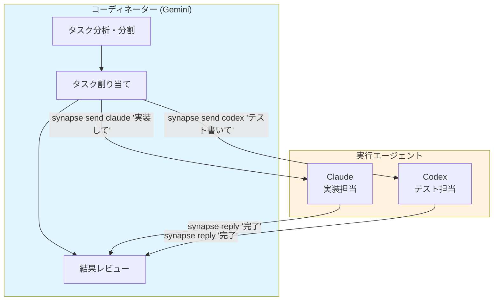
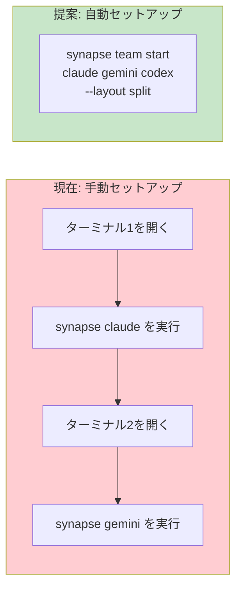
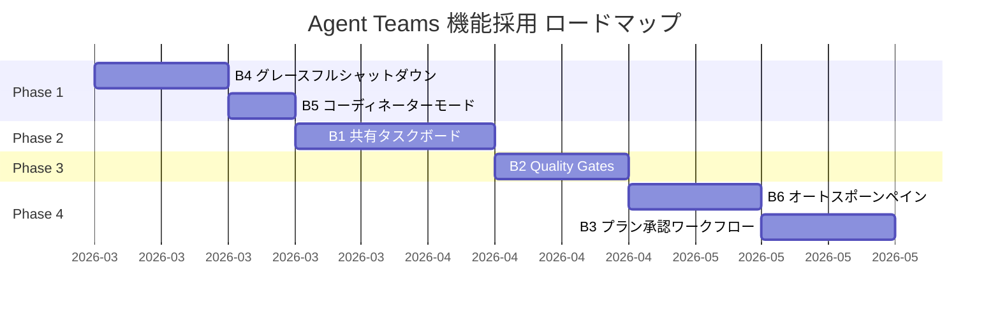

# Agent Teams 機能採用仕様書

Claude Code の「Agent Teams」機能（実験的）を分析し、Synapse A2A に取り入れるべき機能を特定・設計した仕様書です。

---

## 目次

- [1. 概要](#1-概要)
- [2. 比較分析](#2-比較分析)
- [3. 採用機能仕様](#3-採用機能仕様)
  - [B1: 共有タスクボード](#b1-共有タスクボード依存関係付き)
  - [B2: Quality Gates（フック機構）](#b2-quality-gatesフック機構)
  - [B3: プラン承認ワークフロー](#b3-プラン承認ワークフロー)
  - [B4: グレースフルシャットダウン](#b4-グレースフルシャットダウン)
  - [B5: コーディネーター / デリゲートモード](#b5-コーディネーター--デリゲートモード)
  - [B6: オートスポーン・スプリットペイン](#b6-オートスポーンスプリットペイン)
- [4. 不採用機能と理由](#4-不採用機能と理由)
- [5. 実装ロードマップ](#5-実装ロードマップ)
- [6. 設計原則チェック](#6-設計原則チェック)
- [7. 参考資料](#7-参考資料)

---

## 1. 概要

### 1.1 背景

Claude Code は「Agent Teams」機能（実験的）を提供し、リードエージェントがチームメイトを生成・管理してマルチエージェント協調を実現しています。Synapse A2A は既に P2P アーキテクチャでエージェント間通信を実現していますが、Agent Teams が提供する構造化された協調機能の一部は Synapse にも価値をもたらします。

### 1.2 目的

- Agent Teams の各機能を Synapse A2A の P2P アーキテクチャに翻訳可能か評価
- 採用すべき機能の具体的な設計仕様を策定
- プロジェクト哲学（[project-philosophy.md](./project-philosophy.md)）との整合性を確認

### 1.3 アーキテクチャの根本的な違い



| 項目 | Agent Teams | Synapse A2A |
|------|-------------|-------------|
| **トポロジー** | 中央集権型（リード → チームメイト） | P2P 分散型（任意のエージェント間） |
| **エージェント種類** | Claude のみ | 異種混合（Claude, Gemini, Codex, OpenCode, Copilot） |
| **生成方式** | リードがチームメイトを自動生成 | ユーザーが各エージェントを手動起動 |
| **通信方式** | プロセス内通信 | A2A プロトコル（UDS/HTTP） |

> [!IMPORTANT]
> アーキテクチャが異なるため、Agent Teams の機能は**直接移植ではなく P2P への翻訳**が必要です。

---

## 2. 比較分析

### 2.1 Synapse が既に持つ機能（カテゴリ A）

Synapse A2A が Agent Teams と同等またはそれ以上の形で既に実装している機能です。

| Agent Teams 機能 | Synapse 対応 | Synapse の優位性 |
|------------------|-------------|------------------|
| **チームメイトへのメッセージ送信** | ✅ `synapse send` | 優先度 1-5、応答追跡、in-reply-to スレッディング、トランスポート非依存（TCP/UDS） |
| **スポーン時コンテキスト** | ✅ 初期インストラクション | 異種エージェント対応（Claude, Gemini, Codex 等）、`synapse instructions send` |
| **エージェントディスカバリー** | ✅ ファイルベースレジストリ | P2P ディスカバリー、外部エージェント対応、Google A2A 標準準拠、自動クリーンアップ |
| **ファイルロック** | ✅ `FileSafetyManager` | 変更履歴追跡、コンテキスト注入、WAL モード、PID ベース stale 検出 |
| **表示モード**（部分的） | ⚠️ `synapse list` + `synapse jump` | Rich TUI、ターミナルジャンプ対応。ただし自動ペイン作成は未実装 |

### 2.2 新規採用候補（カテゴリ B）

P2P アーキテクチャに翻訳可能で、Synapse に高い価値をもたらす機能です。

| ID | 機能 | 影響度 | 工数 | 優先度 |
|----|------|--------|------|--------|
| B1 | 共有タスクボード（依存関係付き） | 非常に高い | 中 | ⭐⭐⭐ |
| B2 | Quality Gates（フック機構） | 高い | 中 | ⭐⭐⭐ |
| B3 | プラン承認ワークフロー | 中 | 中〜高 | ⭐⭐ |
| B4 | グレースフルシャットダウン | 高い | 低〜中 | ⭐⭐⭐ |
| B5 | コーディネーター / デリゲートモード | 中〜高 | 低 | ⭐⭐⭐ |
| B6 | オートスポーン・スプリットペイン | 中 | 中 | ⭐⭐ |

### 2.3 不採用（カテゴリ C）

| 機能 | 不採用理由 |
|------|-----------|
| インプロセスモード | ターミナルマルチプレクサの再発明が必要。非侵入原則に違反 |
| 中央集権的チームリード強制 | P2P アーキテクチャに根本的に矛盾 |
| リードによる自動チームメイト生成 | エージェントが Synapse 内部を知る必要があり、非侵入原則に違反 |

---

## 3. 採用機能仕様

### B1: 共有タスクボード（依存関係付き）

#### 目的

現在のタスク委任はアドホックなメッセージ送信に依存しています。構造化されたタスクボードにより、タスクの定義・依存関係・進捗追跡を一元管理します。



#### 設計

**ストレージ**: プロジェクトローカル SQLite（`.synapse/task_board.db`）。`file_safety.py` と同じ WAL モードパターンを踏襲。

**データモデル**:

```sql
CREATE TABLE board_tasks (
    id          TEXT PRIMARY KEY,       -- UUID
    subject     TEXT NOT NULL,
    description TEXT,
    status      TEXT NOT NULL DEFAULT 'pending',  -- pending, in_progress, completed
    assignee    TEXT,                    -- agent_id (例: synapse-claude-8100)
    created_by  TEXT NOT NULL,          -- 作成者の agent_id
    blocked_by  TEXT DEFAULT '[]',      -- JSON 配列: ["task-id-1", "task-id-2"]
    created_at  DATETIME DEFAULT CURRENT_TIMESTAMP,
    updated_at  DATETIME DEFAULT CURRENT_TIMESTAMP,
    completed_at DATETIME
);

CREATE INDEX idx_board_status ON board_tasks(status);
CREATE INDEX idx_board_assignee ON board_tasks(assignee);
```

**同時実行制御**: SQLite WAL モード + アトミック UPDATE（`WHERE status='pending' AND assignee IS NULL`）によるタスククレーム。

**依存関係解決**: タスク完了時に `blocked_by` を走査し、ブロック解除されたタスクを通知。

#### スキーマ（Python）

```python
class TaskBoard:
    """プロジェクトローカルの共有タスクボード。

    Storage: .synapse/task_board.db (SQLite with WAL mode)
    """

    def create_task(self, subject: str, description: str,
                    created_by: str, blocked_by: list[str] | None = None) -> str:
        """タスクを作成し、タスクIDを返す。"""

    def claim_task(self, task_id: str, agent_id: str) -> bool:
        """アトミックにタスクをクレーム。成功時 True。"""

    def complete_task(self, task_id: str, agent_id: str) -> list[str]:
        """タスクを完了し、新たにブロック解除されたタスクIDリストを返す。"""

    def list_tasks(self, status: str | None = None,
                   assignee: str | None = None) -> list[dict]:
        """フィルタ条件に合致するタスク一覧を返す。"""

    def get_available_tasks(self, agent_id: str) -> list[dict]:
        """ブロックされておらず未アサインのタスク一覧を返す。"""
```

#### API エンドポイント

| メソッド | パス | 説明 |
|----------|------|------|
| `GET` | `/tasks/board` | タスクボード全体を取得 |
| `POST` | `/tasks/board` | 新規タスク作成 |
| `POST` | `/tasks/board/{id}/claim` | タスクをクレーム |
| `POST` | `/tasks/board/{id}/complete` | タスクを完了 |

#### CLI コマンド

```bash
# タスク一覧
synapse tasks list [--status pending] [--agent claude]

# タスク作成
synapse tasks create "認証モジュールのテスト作成" [--blocked-by task-123]

# タスク割り当て
synapse tasks assign <task_id> <agent>

# タスク完了
synapse tasks complete <task_id>
```

#### 変更ファイル

| ファイル | 変更内容 |
|----------|----------|
| **新規** `synapse/task_board.py` | コアロジック（SQLite バックエンド） |
| `synapse/cli.py` | `synapse tasks` サブコマンドグループ追加 |
| `synapse/a2a_compat.py` | `/tasks/board/*` エンドポイント追加 |
| `synapse/settings.py` | タスクボード設定追加 |
| `synapse/commands/list.py` | TUI にアクティブタスク表示（オプション） |

---

### B2: Quality Gates（フック機構）

#### 目的

エージェントのステータス遷移時にフック（シェルコマンド）を実行し、品質チェックを自動化します。テスト失敗時にタスク完了を拒否する、アイドル時に次のタスクを自動割り当てするなどのワークフローを実現します。



#### 設計

**フック種別**:

| フック | トリガー | exit 0 | exit 2 | その他 |
|--------|----------|--------|--------|--------|
| `on_idle` | PROCESSING → READY 遷移時 | アイドル許可 | アイドル拒否（作業継続） | エラー（警告付き許可） |
| `on_task_completed` | タスク完了マーク時 | 完了許可 | 完了拒否（修正要求） | エラー（警告付き許可） |

**フック設定**: `.synapse/settings.json` またはプロファイル YAML で設定。

```yaml
# プロジェクト設定 (.synapse/settings.json)
hooks:
  on_idle: "pytest tests/ --tb=short"
  on_task_completed: "pytest tests/ && ruff check"
```

```yaml
# エージェントプロファイルでのオーバーライド
# synapse/profiles/claude.yaml
hooks:
  on_task_completed: "pytest tests/ --tb=short -x"
```

**環境変数**: フック実行時に以下の環境変数が設定されます。

| 変数 | 説明 |
|------|------|
| `SYNAPSE_AGENT_ID` | エージェント ID（例: `synapse-claude-8100`） |
| `SYNAPSE_AGENT_NAME` | カスタム名（設定されている場合） |
| `SYNAPSE_LAST_TASK_ID` | 直前のタスク ID |
| `SYNAPSE_STATUS_FROM` | 遷移前のステータス |
| `SYNAPSE_STATUS_TO` | 遷移後のステータス |

#### 変更ファイル

| ファイル | 変更内容 |
|----------|----------|
| **新規** `synapse/hooks.py` | フック設定・実行・コントラクト |
| `synapse/controller.py` | ステータス遷移時のフック実行 |
| `synapse/a2a_compat.py` | タスク完了前のフック実行 |
| `synapse/settings.py` | hooks セクション追加 |
| プロファイル YAML | エージェント別フックオーバーライド |

---

### B3: プラン承認ワークフロー

#### 目的

エージェントにプランモードでの作業を要求し、実装前にプランのレビュー・承認・却下を可能にします。リスクの高い同時コード編集を防止し、コーディネーターがアプローチを事前検証できます。



#### 設計

**プランモードフラグ**: A2A メッセージのメタデータに `{"plan_mode": true}` を含める。

**ブートストラップ指示**: プランモードが有効な場合、エージェントへの指示に以下を追加:

> "プランのみ作成してください。実装は行わないでください。プランが完成したら synapse reply で返信してください。"

**承認/却下エンドポイント**: 既存の Task API を拡張。

| メソッド | パス | 説明 |
|----------|------|------|
| `POST` | `/tasks/{id}/approve` | プランを承認し実装を許可 |
| `POST` | `/tasks/{id}/reject` | プランを却下し理由を伝達 |

#### CLI コマンド

```bash
# プランモードでタスク送信
synapse send agent "テスト作成して" --plan-mode --from synapse-claude-8100

# プラン承認
synapse approve <task_id>

# プラン却下
synapse reject <task_id> "認証方式を OAuth に変更してください"
```

#### 変更ファイル

| ファイル | 変更内容 |
|----------|----------|
| `synapse/a2a_compat.py` | approve/reject エンドポイント、plan_mode メタデータ |
| `synapse/approval.py` | プラン承認ロジック追加 |
| `synapse/cli.py` | `synapse approve/reject` コマンド追加 |
| `synapse/settings.py` | エージェント別 plan_mode デフォルト設定 |

> [!NOTE]
> プラン承認の信頼性はエージェントの指示遵守能力に依存します。Claude Code は高い遵守率が期待できますが、他のエージェントタイプでは信頼性が異なる可能性があります。

---

### B4: グレースフルシャットダウン

#### 目的

現在の `synapse kill` は SIGKILL による即座停止です。グレースフルシャットダウンにより、エージェントが状態を保存し、変更をコミットし、作業途中であることを報告する猶予を与えます。



#### 設計

**シャットダウンリクエスト**: 特別な A2A メッセージ（`metadata: {"type": "shutdown_request"}`）を `/tasks/send` 経由で送信。

**ステータス追加**: `SHUTTING_DOWN` ステータスをステータスシステムに追加。

**タイムアウト**: 設定可能（デフォルト 30 秒）。タイムアウト後は SIGTERM を送信。

**CLI 統合**: `synapse kill` を修正。

```bash
# グレースフルシャットダウン（デフォルト）
synapse kill my-claude

# 即座強制終了（従来の挙動）
synapse kill my-claude -f
synapse kill my-claude --force
```

**設定**:

```json
{
  "shutdown": {
    "timeout_seconds": 30,
    "graceful_enabled": true
  }
}
```

#### 変更ファイル

| ファイル | 変更内容 |
|----------|----------|
| `synapse/cli.py` | `cmd_kill()` にグレースフルシャットダウンフロー追加 |
| `synapse/status.py` | `SHUTTING_DOWN` ステータス追加 |
| `synapse/a2a_compat.py` | shutdown_request メッセージタイプ対応 |
| `synapse/settings.py` | シャットダウンタイムアウト設定 |

---

### B5: コーディネーター / デリゲートモード

#### 目的

指定されたエージェントをコーディネーターとして機能させ、直接のファイル編集を行わず、タスクの分配と管理に専念させます。ファイル競合を削減し、明確なオーケストレーションポイントを提供します。



#### 設計

**インストラクションベース**: 既存の `--role` フラグを活用。デリゲートモード専用のインストラクションテンプレートを用意。

```bash
# コーディネーターとして起動
synapse gemini --role "coordinator" --delegate-mode

# 通常のロール指定（デリゲートモードなし）
synapse gemini --role "project manager"
```

**デリゲートモードのインストラクション**:

> あなたはコーディネーターです。ファイルを直接編集しないでください。代わりに、synapse send を使って他のエージェントにタスクを委任してください。タスクの分析、分割、割り当て、レビューに専念してください。

**ファイル安全性統合（オプション）**: デリゲートモードのエージェントに対してファイルロックを拒否する設定。

```json
{
  "delegate_mode": {
    "deny_file_locks": true
  }
}
```

> [!NOTE]
> コーディネーター / デリゲートモードは**インストラクションベース**の実装です。これは非侵入原則に従い、エージェントの挙動を構造的に制約するのではなく、指示によってガイドします。`--role` フラグは既に実装済みです。

#### 変更ファイル

| ファイル | 変更内容 |
|----------|----------|
| `synapse/settings.py` | デリゲートモードインストラクションテンプレート |
| `synapse/cli.py` | `--delegate-mode` フラグ追加 |
| `synapse/agent_context.py` | コーディネーター専用インストラクション生成 |
| `synapse/file_safety.py` | デリゲートモードのロック拒否（オプション） |

---

### B6: オートスポーン・スプリットペイン

#### 目的

複数エージェントの起動時にターミナルペインを自動分割し、マルチエージェント環境のセットアップを効率化します。



#### 設計

**ターミナル検出**: 既存の `detect_terminal_app()`（`terminal_jump.py`）を活用。

**対応ターミナル**:

| ターミナル | 方式 | 実装難度 |
|------------|------|----------|
| **tmux** | `tmux split-window` + `tmux send-keys` | 低 |
| **iTerm2** | AppleScript でペイン作成 | 中 |
| **Terminal.app** | AppleScript で新規タブ | 中 |
| **VS Code** | ターミナル分割 API（制限あり） | 高 |

#### CLI コマンド

```bash
# 複数エージェントを分割ペインで起動
synapse team start claude gemini codex --layout split

# tmux でのレイアウト指定
synapse team start claude gemini --layout horizontal

# 既存の synapse start でも対応
synapse start claude gemini codex --split-panes
```

#### 変更ファイル

| ファイル | 変更内容 |
|----------|----------|
| `synapse/terminal_jump.py` | ペイン作成関数追加 |
| `synapse/commands/start.py` | マルチエージェント起動 + ペイン分割対応 |
| `synapse/cli.py` | `synapse team` コマンドグループ追加 |

---

## 4. 不採用機能と理由

### C1: インプロセスモード（全エージェントを1つのターミナルで管理）

Agent Teams では Shift+Up/Down でエージェント間を切り替えられますが、Synapse では各エージェントが独自の TUI を持つ異種 CLI を PTY でラップしています。

**不採用理由**:
- 複数の PTY セッションを1つのターミナルにマルチプレクスするには、実質的にターミナルマルチプレクサ（tmux のようなもの）を再発明する必要がある
- 各エージェントの TUI（Ink, Bubble Tea 等）は固有のレンダリングを行い、統合が極めて困難
- **非侵入原則に違反**: エージェントの表示を大きく変更する
- tmux を直接使用することで同等の機能は既に実現可能

### C2: 中央集権的チームリード強制

Agent Teams ではリードエージェントが構造的な権限（チームメイトの生成・停止）を持ちます。

**不採用理由**:
- Synapse の **P2P アーキテクチャに根本的に矛盾**: 特権ノードの導入は設計哲学に反する
- 任意のエージェントが任意のエージェントとコミュニケーション可能であることが Synapse の強み
- **B5 のコーディネーターモード**がインストラクションベースで同等の効果を実現（構造的強制なし）

### C3: リードによる自動チームメイト生成

Agent Teams ではリードがプログラマティックにチームメイトを生成します。

**不採用理由**:
- ラップされたエージェントが Synapse 内部（プロセス管理、PTY 管理）を理解する必要がある
- **非侵入原則に違反**: エージェントは Synapse の存在を意識すべきではない（エージェント無知の原則）
- **B6 のオートスポーン機能**が CLI レベルで同等の結果を実現（エージェントからではなくユーザーから）

---

## 5. 実装ロードマップ



### Phase 1: 基盤（B4 + B5）

**目的**: 低工数で即座にユーザー価値を提供。マルチエージェント協調のメンタルモデルを確立。

| 機能 | 工数 | 根拠 |
|------|------|------|
| B4: グレースフルシャットダウン | 低〜中 | 既存メッセージング基盤を利用。データ損失防止。 |
| B5: コーディネーターモード | 低 | インストラクションエンジニアリングが主。`--role` は既存。 |

### Phase 2: タスク管理基盤（B1）

**目的**: アドホックメッセージングから構造化された協調への転換。B2・B3 の前提条件。

| 機能 | 工数 | 根拠 |
|------|------|------|
| B1: 共有タスクボード | 中 | SQLite パターンは `file_safety.py` で実績あり。B2, B3 の基盤。 |

### Phase 3: 品質保証（B2）

**目的**: タスクボードと組み合わせた自動品質検証パイプライン。

| 機能 | 工数 | 根拠 |
|------|------|------|
| B2: Quality Gates | 中 | ステータス遷移は既存。タスクボード(B1)との連携で真価を発揮。 |

### Phase 4: UX 向上（B6 + B3）

**目的**: 開発者体験の改善。コアワークフローが安定してからの仕上げ。

| 機能 | 工数 | 根拠 |
|------|------|------|
| B6: オートスポーンペイン | 中 | tmux パスは容易。他ターミナルは段階的対応。 |
| B3: プラン承認ワークフロー | 中〜高 | エージェントの指示遵守に依存。信頼性検証が必要。 |

---

## 6. 設計原則チェック

すべての採用機能（B1〜B6）が Synapse A2A の核心原則（[project-philosophy.md](./project-philosophy.md)）に適合するかを検証します。

### 6.1 原則適合マトリクス

| 原則 | B1 タスクボード | B2 Quality Gates | B3 プラン承認 | B4 シャットダウン | B5 デリゲート | B6 ペイン分割 |
|------|:-:|:-:|:-:|:-:|:-:|:-:|
| **非侵入設計** | ✅ | ✅ | ⚠️ | ✅ | ✅ | ✅ |
| **A2A プロトコル準拠** | ✅ | ✅ | ✅ | ✅ | N/A | N/A |
| **エージェント間協調** | ✅ | ✅ | ✅ | ✅ | ✅ | ✅ |
| **エージェント無知の原則** | ✅ | ✅ | ⚠️ | ✅ | ⚠️ | ✅ |
| **最小限の表示** | ✅ | ✅ | ✅ | ✅ | ✅ | ✅ |

### 6.2 注意事項

**B3 プラン承認 ⚠️ 非侵入設計・エージェント無知の原則**:
- エージェントに「プランのみ作成し実装しない」という特別な挙動を要求
- インストラクションベースのため技術的には非侵入だが、エージェントの自然な挙動を制限
- **対策**: インストラクションの精緻化と、エージェントタイプ別の信頼性テスト

**B5 デリゲートモード ⚠️ エージェント無知の原則**:
- エージェントに `synapse send` コマンドの使用を明示的に指示
- エージェントが Synapse の存在を部分的に認識する必要がある
- **対策**: これは既存のインストラクションシステム（`synapse reply` の使用など）と同等のレベルであり、許容範囲内

### 6.3 設計判断基準チェック

| 判断軸 | 全機能の方針 |
|--------|-------------|
| **プロトコル** | A2A 準拠のエンドポイント拡張（`x-` プレフィックス） |
| **実装** | 既存パターン（SQLite WAL, ステータスシステム）を再利用 |
| **ユーザー体験** | 既存ワークフローを維持しつつ、オプトインで新機能を提供 |
| **エージェント負担** | 複雑さは Synapse 層で吸収。エージェントの追加学習は最小限 |
| **検証** | 実装ごとにテストスイートを整備 |

### 6.4 エージェント無知の原則チェックリスト

| チェック項目 | B1 | B2 | B3 | B4 | B5 | B6 |
|-------------|:--:|:--:|:--:|:--:|:--:|:--:|
| エージェントが新しい構文を学ぶ必要があるか？ | いいえ | いいえ | 最小限 | いいえ | 最小限 | いいえ |
| task_id / sender_id をエージェントが扱う必要があるか？ | いいえ | いいえ | いいえ | いいえ | いいえ | いいえ |
| 返信時にエージェントが宛先を指定する必要があるか？ | いいえ | いいえ | いいえ | いいえ | いいえ | いいえ |

---

## 7. 参考資料

### 外部リソース

- [Claude Code Agent Teams Documentation](https://docs.anthropic.com/en/docs/claude-code/agent-teams) — Agent Teams 機能の公式ドキュメント
- [Google A2A Protocol Specification](https://a2a-protocol.org/latest/specification/) — A2A プロトコル仕様
- [A2A GitHub Repository](https://github.com/a2aproject/A2A) — 公式サンプル実装

### 関連ドキュメント

- [project-philosophy.md](./project-philosophy.md) — Synapse A2A プロジェクト哲学
- [a2a-design-rationale.md](./a2a-design-rationale.md) — A2A プロトコル準拠性分析
- [file-safety.md](./file-safety.md) — マルチエージェント環境でのファイル競合防止

---

## 更新履歴

| 日付 | 内容 |
|------|------|
| 2026-02-09 | 初版作成。Agent Teams 機能分析に基づく仕様書 |
