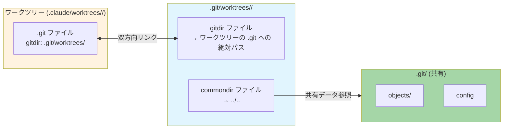
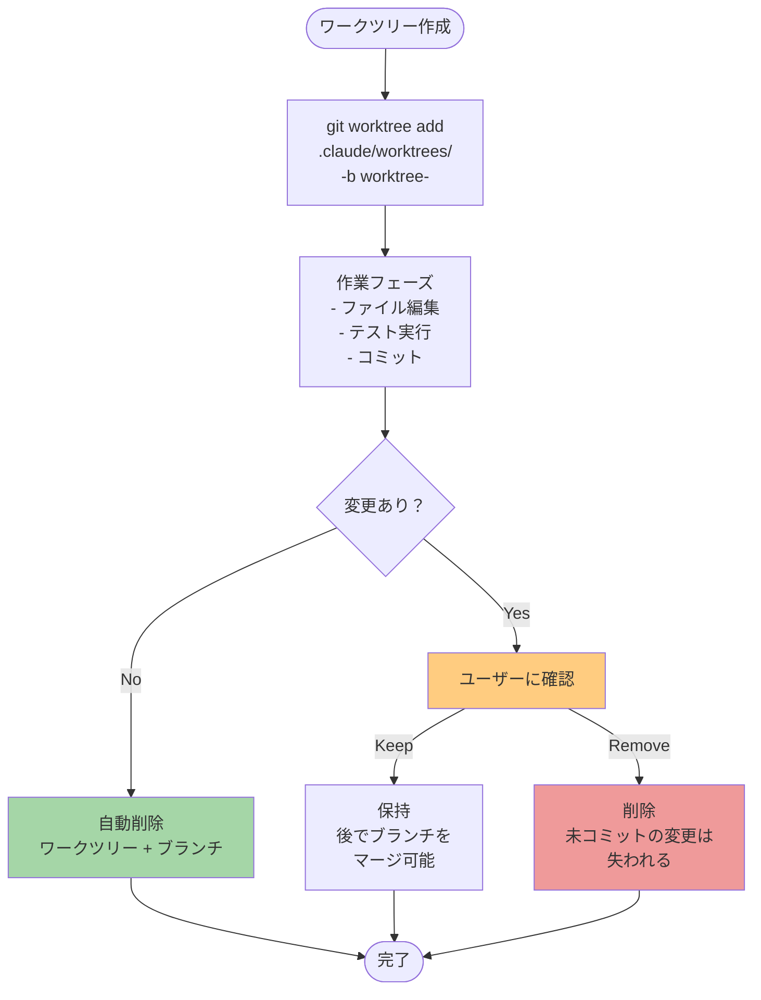
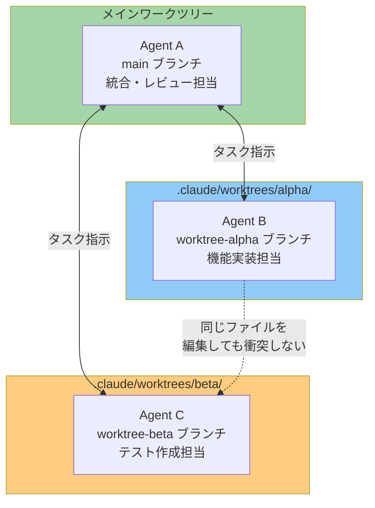
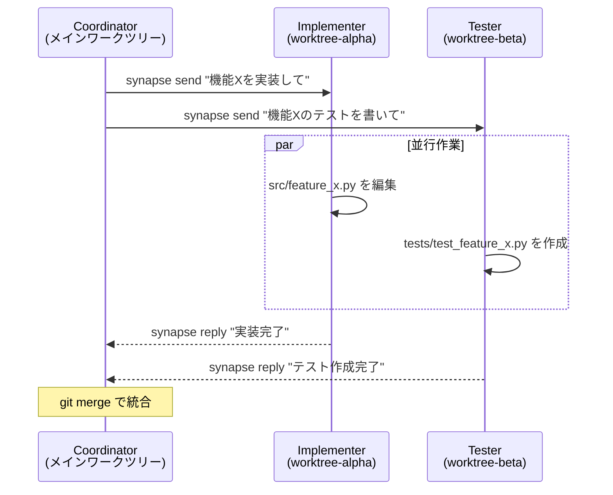
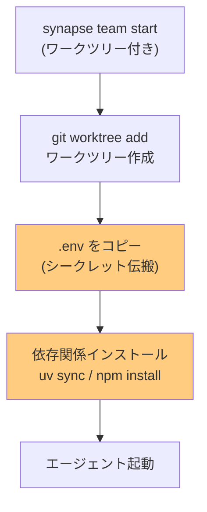

# Claude Code ワークツリー機能の仕組み

## はじめに

Claude Code には **Git ワークツリー** を活用した分離作業機能が組み込まれている。この機能により、メインの作業ディレクトリを汚すことなく、独立した作業環境で安全にコード変更を行うことができる。

本ドキュメントでは、Claude Code のワークツリー機能の内部的な仕組みからマルチエージェント活用まで、実際の調査結果に基づいて解説する。

```text
┌─────────────────────────────────────────────────────────────────┐
│                   ワークツリーの利点                              │
├─────────────────────────────────────────────────────────────────┤
│  ✅ メインブランチに影響を与えずに作業できる                      │
│  ✅ 複数の作業を並行して進められる                                │
│  ✅ 変更がなければ自動クリーンアップされる                        │
│  ✅ Git ネイティブ機能なので追加ツール不要                        │
└─────────────────────────────────────────────────────────────────┘
```

## 基本コンセプト

ワークツリー機能は Git のネイティブ機能 `git worktree` を活用している。独自のファイルコピーやパッチシステムではなく、Git が公式にサポートする仕組みの上に構築されている点が重要。


内部的に実行されるコマンド:

```bash
git worktree add .claude/worktrees/<name> -b worktree-<name>
```

これにより:
- `.claude/worktrees/<name>/` にプロジェクトの独立コピーが作成される
- `worktree-<name>` という新しいブランチが作成される
- Git オブジェクトデータベース (`.git/objects/`) は共有されるため、ディスク使用は効率的

## ディレクトリ構造

ワークツリーは 2 つの場所にまたがって管理される。

```text
リポジトリルート (./)
│
├── .git/                                    # 共有リポジトリメタデータ
│   ├── objects/                             # 共有オブジェクト DB（全ワークツリー共通）
│   ├── refs/heads/
│   │   ├── main                             # メインブランチ
│   │   └── worktree-memoized-petting-puffin # ワークツリー用ブランチ
│   └── worktrees/                           # ワークツリーのメタデータ
│       └── memoized-petting-puffin/
│           ├── commondir    (6B)    "../.."          ← 共有 .git への相対パス
│           ├── gitdir       (97B)   "絶対パス"       ← ワークツリーの .git ファイルへ
│           ├── HEAD         (49B)   "ref: refs/..."  ← 独立した HEAD
│           ├── index        (41KB)                   ← 独立したステージングエリア
│           ├── ORIG_HEAD    (41B)
│           ├── logs/                                 ← 独立した reflog
│           └── refs/                                 ← 独立した参照
│
├── .claude/worktrees/                       # 独立した作業ディレクトリ
│   └── memoized-petting-puffin/
│       ├── .git             (97B, ファイル)  ← "gitdir: ..." でメタデータを指す
│       ├── .claude/                          ← ワークツリー固有の設定
│       ├── src/                              ← 独立したファイルコピー
│       └── [全プロジェクトファイル]
│
└── [メイン作業ディレクトリのファイル]
```

### 双方向リンクの仕組み

Git は 2 つのファイルで双方向リンクを実現している:



```text
┌─────────────────────────────────────────────────────────────────┐
│  共有されるもの vs ワークツリー固有のもの                          │
├─────────────────────────────────────────────────────────────────┤
│  共有:  .git/objects/  .git/config  .git/packed-refs            │
│  固有:  HEAD  index  refs/  logs/  ORIG_HEAD                   │
└─────────────────────────────────────────────────────────────────┘
```

> **ポイント**: ワークツリーの `.git` はディレクトリではなく **ファイル** である。`cat .git` すると `gitdir: ...` という1行が返る。

## ライフサイクル



### 各フェーズの詳細

**作成フェーズ:**
1. ランダム名またはユーザー指定名を決定
2. `git worktree add` を実行
3. セッションの作業ディレクトリをワークツリーに切り替え
4. ワークツリー固有の `.claude/settings.json` を配置

**作業フェーズ:**
- すべてのファイル変更はワークツリー内で完結
- 独立した `index`（ステージングエリア）を持つため、`git add` は他のワークツリーに影響しない
- メインワークツリーと同じコミットにいても、異なるブランチ上で動作する

**クリーンアップフェーズ:**
- ✅ 変更なし → 自動削除（ユーザー操作不要）
- ❌ Claude Code がクラッシュした場合 → ワークツリーが残る可能性あり（後述の Tips 参照）

## 命名規則

ワークツリーには `形容詞-形容詞-動物` パターンのランダム名が生成される。

```text
例: memoized-petting-puffin
     ├────────┘ ├──────┘ ├─────┘
     形容詞      形容詞    動物
```

- **ブランチ名**: `worktree-<name>` (例: `worktree-memoized-petting-puffin`)
- **ディレクトリ**: `.claude/worktrees/<name>/`
- ユーザーが名前を指定することも可能

## 2 つの使い方

### 1. EnterWorktree ツール（対話型セッション内）

Claude Code セッション中に「ワークツリーで作業して」と指示すると、`EnterWorktree` ツールが呼ばれる。

```text
┌─────────────────────────────────────────────────────────────────┐
│  EnterWorktree ツール                                           │
├─────────────────────────────────────────────────────────────────┤
│  トリガー: 「ワークツリーで作業して」「start a worktree」         │
│  パラメータ: name (省略可、省略時はランダム生成)                   │
│  効果: セッションの作業ディレクトリがワークツリーに切り替わる      │
│  制御: /permissions で deny リストに追加して無効化可能            │
└─────────────────────────────────────────────────────────────────┘
```

### 2. CLI フラグ (`--worktree` / `-w`)

コマンドラインから直接ワークツリーを作成して Claude Code を起動する。

```bash
# 名前指定
claude --worktree feature-auth

# ランダム名で自動生成
claude --worktree
claude -w

# tmux と組み合わせ
claude --worktree feature-auth --tmux
```

### 3. Task ツールの isolation オプション（サブエージェント向け）

サブエージェントに独立したワークツリーを割り当てる。

```json
{
  "isolation": "worktree"
}
```

- サブエージェントごとに独立したワークツリーが自動作成される
- 変更がなければ自動クリーンアップ
- 変更があれば、ワークツリーのパスとブランチ名が親に返される

## マルチエージェントでの活用

ワークツリーの真価は、複数のエージェントが並行して作業する場面で発揮される。



```text
┌─────────────────────────────────────────────────────────────────┐
│  なぜマルチエージェントにワークツリーが有効か                      │
├─────────────────────────────────────────────────────────────────┤
│  ✅ 各エージェントが同じファイルを同時に編集できる                │
│  ✅ Git のステージングエリアが独立しているため競合しない           │
│  ✅ 各エージェントの変更は独立したブランチに記録される             │
│  ✅ 統合時は通常の Git マージで対応可能                           │
│  ❌ 各ワークツリーがファイルの独立コピーを持つためディスク消費あり │
└─────────────────────────────────────────────────────────────────┘
```

### Synapse A2A との組み合わせ

Synapse A2A でマルチエージェントチームを運用する場合、ワークツリーによる分離が特に重要になる。



Synapse A2A では、このワークツリーの仕組みを取り入れることを検討している。具体的には以下の 2 つのユースケースを想定している:

1. **チーム起動時の自動ワークツリー割り当て**: `synapse team start claude gemini codex` で複数エージェントを起動する際、各エージェントに独立したワークツリーを自動的に割り当てる。これにより、エージェント間のファイル競合を Git レベルで防止できる。

2. **Coordinator + Worker パターン**: Coordinator（`--delegate-mode`）がメインワークツリーに留まり、実装担当の Worker エージェントたちが各自のワークツリーで並行作業する。作業完了後は Coordinator がブランチをマージして統合する。

また、Claude Code を `synapse claude` で起動する際に `--worktree` オプションの利用を検討し、必要に応じてエージェント自身が判断してワークツリーを使えるようにする。これを実現するには Skills の変更が必須となる。

#### ワークツリー初期化の設計課題

ワークツリーには **Git が追跡していないファイルはコピーされない**。`git worktree add` は `git checkout` と同じ仕組みで、追跡ファイルのみを展開するためである。

```text
┌─────────────────────────────────────────────────────────────────┐
│  ワークツリーに存在しないもの                                     │
├─────────────────────────────────────────────────────────────────┤
│  ❌ .env（環境変数・シークレット）                                │
│  ❌ .venv/ / node_modules/（依存パッケージ）                     │
│  ❌ __pycache__/（キャッシュ）                                   │
│  ❌ *.db / *.sqlite（ローカルデータベース）                       │
│  ❌ .claude/settings.local.json 等のローカル設定                 │
└─────────────────────────────────────────────────────────────────┘
```

Synapse A2A でワークツリーを自動割り当てする場合、スポーン処理に以下の初期化ステップを組み込む設計が必要になる:



この初期化処理はプロファイル YAML に `worktree_setup` セクションとして定義することが考えられる:

```yaml
# 構想中の設定例
worktree:
  setup_commands:
    - "cp ${MAIN_WORKTREE}/.env .env"     # シークレットのコピー
    - "uv sync"                            # 依存関係のインストール
  copy_files:
    - ".env"
    - ".env.local"
```

> **セキュリティ上の注意**: `.env` の自動コピーはシークレットの拡散を意味する。本番用のシークレットが含まれる場合は、ワークツリー用の `.env` テンプレートを別途用意するなどの対策が必要。

## Git 内部の仕組み

ワークツリーが機能する仕組みを、Git 内部の視点から解説する。

### オブジェクトデータベースの共有

Git のオブジェクト（blob, tree, commit）はすべて `.git/objects/` に保存される。ワークツリーは `commondir` ファイルを通じてこの共有データベースを参照する。

```bash
# commondir の中身を確認
$ cat .git/worktrees/memoized-petting-puffin/commondir
../..

# これは .git/worktrees/memoized-petting-puffin/ から見た .git/ への相対パス
```

つまり、ワークツリーが何個あっても、Git オブジェクトは 1 つのデータベースで管理される。コミットやブロブが重複保存されることはない。

### ブランチの排他制約

Git は **同じブランチを複数のワークツリーで同時にチェックアウトすることを禁止** している。

```bash
# すでに main をチェックアウト中に別のワークツリーで main を使おうとすると:
$ git worktree add ../another main
fatal: 'main' is already checked out at '/path/to/repo'
```

これは Git 自体が強制する制約であり、意図しない変更の衝突を防ぐ安全装置として機能する。

### ワークツリーの一覧確認

```bash
$ git worktree list
/path/to/repo                          f865a1b [main]
/path/to/repo/.claude/worktrees/name   f865a1b [worktree-name]
```

## Tips & 注意点

### `.gitignore` の設定

`.claude/worktrees/` を `.gitignore` に追加して、ワークツリーの内容がメインリポジトリの untracked files に表示されないようにする。

```gitignore
# Claude Code worktrees
.claude/worktrees/
```

### クリーンアップ失敗時の対処

Claude Code がクラッシュした場合、ワークツリーが残ることがある。手動で削除する手順:

```bash
# 1. ワークツリーの一覧を確認
git worktree list

# 2. 不要なワークツリーを削除（CWD がワークツリー内でないことを確認）
git worktree remove .claude/worktrees/<name>

# 3. 強制削除が必要な場合
git worktree remove -f .claude/worktrees/<name>
```

> **注意**: `git worktree remove` を実行する際、カレントディレクトリがそのワークツリー内にあると失敗する。必ずメインリポジトリのルートに移動してから実行すること。

### パーミッション制御

`EnterWorktree` ツールを無効化したい場合は、`/permissions` で deny リストに追加できる。

### 依存関係の再インストール

ワークツリーは独立したディレクトリなので、`node_modules/` や `.venv/` は新たに作成する必要がある。

```bash
# Python プロジェクトの場合
cd .claude/worktrees/<name>/
uv sync

# Node.js プロジェクトの場合
cd .claude/worktrees/<name>/
npm install
```

### セッション管理

- Claude Code の `/resume` ピッカーには同じリポジトリのワークツリーセッションも表示される
- セッションメタデータにはワークツリーの slug とブランチ名が記録される

### 非 Git VCS での利用

SVN、Perforce、Mercurial などの場合は、`WorktreeCreate` / `WorktreeRemove` フックを設定することで、独自の分離機構を利用できる。

## まとめ

Claude Code のワークツリー機能は、Git ネイティブの `git worktree` を活用した堅実な設計になっている。独自の分離メカニズムを発明するのではなく、既存の Git 機能を最大限に活用している点は、Synapse A2A の Non-Invasive 原則とも通じる思想である。

```text
┌─────────────────────────────────────────────────────────────────┐
│  ワークツリー活用のベストプラクティス                              │
├─────────────────────────────────────────────────────────────────┤
│  1. .claude/worktrees/ を .gitignore に追加する                  │
│  2. マルチエージェントでは各エージェントに独立したワークツリーを    │
│  3. 作業完了後は git worktree list で残骸がないか確認する         │
│  4. 依存関係の再インストールを忘れずに                            │
└─────────────────────────────────────────────────────────────────┘
```
