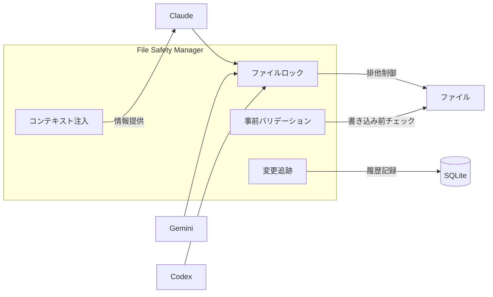
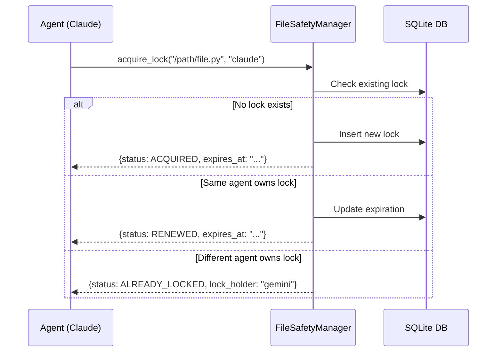
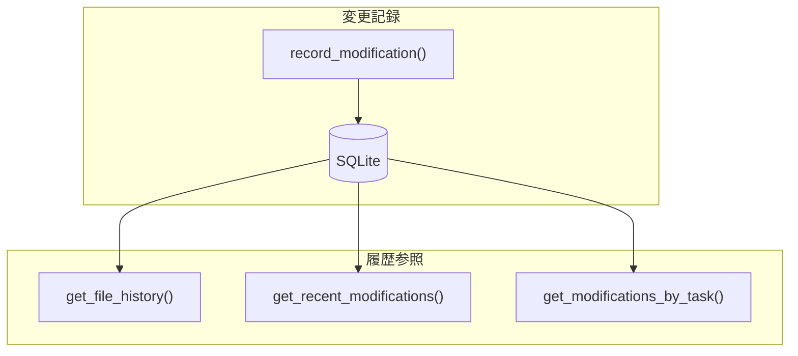
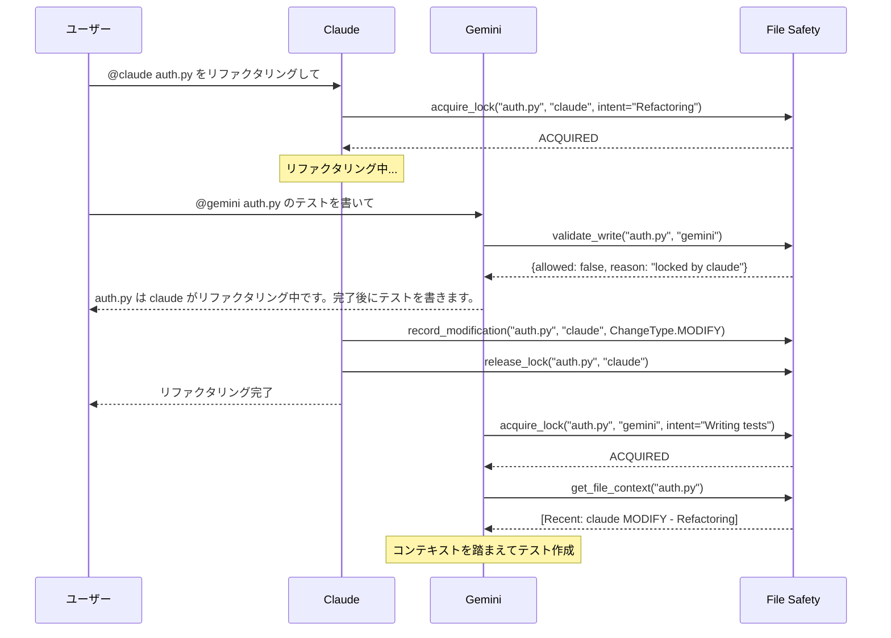

# File Safety - マルチエージェント環境でのファイル競合防止

マルチエージェント環境で複数の AI エージェントが同時にファイルを編集する際の競合を防止する機能です。

---

## 目次

- [概要](#概要)
- [セットアップ](#セットアップ)
- [CLI コマンド](#cli-コマンド)
- [Python API](#python-api)
- [ワークフロー例](#ワークフロー例)
- [データベーススキーマ](#データベーススキーマ)
- [トラブルシューティング](#トラブルシューティング)

---

## 概要

### 背景

マルチエージェント環境では、複数のエージェント（Claude、Gemini、Codex など）が同じファイルを同時に編集しようとする場合があります。これにより以下の問題が発生する可能性があります：

- **競合**: 同じファイルへの同時書き込みによるデータ破損
- **上書き**: 他のエージェントの変更を知らずに上書き
- **コンテキスト欠如**: ファイルの最近の変更履歴が不明

### File Safety が提供する機能



| 機能 | 説明 |
|------|------|
| **ファイルロック** | 複数エージェントが同時に同じファイルを編集しないよう排他制御 |
| **変更追跡** | どのエージェントがいつ何のためにファイルを変更したか記録 |
| **コンテキスト注入** | ファイル読み込み時に最近の変更履歴を提供 |
| **事前書き込みバリデーション** | 書き込み前にロック状態をチェック |

---

## セットアップ

### 有効化

環境変数 `SYNAPSE_FILE_SAFETY_ENABLED` を `true` に設定して有効化します：

```bash
# 環境変数で有効化してエージェント起動
export SYNAPSE_FILE_SAFETY_ENABLED=true
synapse claude

# または settings.json に設定
```

### settings.json での設定

```json
{
  "env": {
    "SYNAPSE_FILE_SAFETY_ENABLED": "true",
    "SYNAPSE_FILE_SAFETY_DB_PATH": ".synapse/file_safety.db"
  }
}
```

### ストレージ

- **データベース**: デフォルトは `~/.synapse/file_safety.db` (SQLite)
- `SYNAPSE_FILE_SAFETY_DB_PATH`（環境変数または settings.json）で変更可能
  - 例: `./.synapse/file_safety.db` でプロジェクト単位の管理
- 初回実行時に自動作成されます

---

## CLI コマンド

### 概要

```bash
synapse file-safety <subcommand> [options]
```

### コマンド一覧

| コマンド | 説明 |
|----------|------|
| `status` | 統計情報を表示 |
| `locks` | アクティブなロック一覧を表示 |
| `lock` | ファイルにロックを取得 |
| `unlock` | ファイルのロックを解放 |
| `history` | 特定ファイルの変更履歴を表示 |
| `recent` | 最近の変更一覧を表示 |
| `record` | ファイル変更を手動で記録 |
| `cleanup` | 古いデータを削除 |
| `debug` | トラブルシューティング用デバッグ情報を表示 |

---

### synapse file-safety status

統計情報を表示します。

```bash
synapse file-safety status
```

**出力例:**

```text
============================================================
FILE SAFETY STATISTICS
============================================================

Active Locks:        3
Total Modifications: 42

By Change Type:
  CREATE: 10
  MODIFY: 30
  DELETE: 2

By Agent:
  claude: 25
  gemini: 12
  codex: 5

Most Modified Files:
  /path/to/src/main.py: 15 modifications
  /path/to/tests/test_api.py: 8 modifications
  /path/to/config.yaml: 5 modifications
```

---

### synapse file-safety locks

アクティブなファイルロック一覧を表示します。

```bash
# 全ロック表示
synapse file-safety locks

# 特定エージェントのみ
synapse file-safety locks --agent claude
```

**出力例:**

```text
Active File Locks
============================================================
File                                              Agent           Expires
------------------------------------------------------------
/path/to/src/auth.py                              claude          2026-01-09T12:00:00
/path/to/src/api.py                               gemini          2026-01-09T11:30:00

Total: 2 active locks
```

---

### synapse file-safety lock

ファイルにロックを取得します。

```bash
# 基本的な使い方
synapse file-safety lock /path/to/file.py claude

# オプション付き
synapse file-safety lock /path/to/file.py claude \
  --task-id "task-123" \
  --duration 600 \
  --intent "Refactoring authentication module"
```

**オプション:**

| オプション | 説明 | デフォルト |
|------------|------|-----------|
| `--task-id` | タスク ID | なし |
| `--duration` | ロック時間（秒） | 300 |
| `--intent` | 変更の意図 | なし |

**出力例:**

```text
Lock acquired on /path/to/file.py
Expires at: 2026-01-09T12:00:00
```

---

### synapse file-safety unlock

ファイルのロックを解放します。

```bash
synapse file-safety unlock /path/to/file.py claude
```

**出力例:**

```text
Lock released on /path/to/file.py
```

> [!NOTE]
> ロックは自分が取得したものだけ解放できます。他のエージェントのロックは解放できません。

---

### synapse file-safety history

特定ファイルの変更履歴を表示します。

```bash
# 基本的な使い方
synapse file-safety history /path/to/file.py

# 件数制限
synapse file-safety history /path/to/file.py --limit 10
```

**出力例:**

```text
Modification history for: /path/to/file.py
============================================================

[2026-01-09 10:30:00] claude [MODIFY]
  Intent: Fix authentication bug
  Lines: 45-67
  Task ID: task-456

[2026-01-09 09:15:00] gemini [MODIFY]
  Intent: Add input validation
  Lines: 20-35
  Task ID: task-123

[2026-01-08 16:00:00] claude [CREATE]
  Intent: Initial implementation
  Task ID: task-001
```

---

### synapse file-safety recent

最近のファイル変更一覧を表示します。

```bash
# 基本的な使い方
synapse file-safety recent

# エージェントでフィルタ
synapse file-safety recent --agent claude

# 件数制限
synapse file-safety recent --limit 20
```

**出力例:**

```text
Recent File Modifications
============================================================
Timestamp            Agent        Type     File
------------------------------------------------------------
2026-01-09 10:30:00  claude       MODIFY   /path/to/src/auth.py
2026-01-09 10:15:00  gemini       CREATE   /path/to/tests/test_auth.py
2026-01-09 09:45:00  codex        MODIFY   /path/to/config.yaml

Showing 3 recent modifications
```

---

### synapse file-safety record

ファイル変更を手動で記録します。
通常はエージェントが自動的に記録しますが、スクリプトや手動操作の結果を記録する場合に使用します。

```bash
synapse file-safety record /path/to/file.py claude task-123 \
  --type MODIFY \
  --intent "Manual fix"
```

**オプション:**

| オプション | 説明 | デフォルト |
|------------|------|-----------|
| `--type` | 変更タイプ (CREATE, MODIFY, DELETE) | MODIFY |
| `--intent` | 変更の意図 | なし |

**出力例:**

```text
Recorded modification for /path/to/file.py
```

---

### synapse file-safety cleanup

古い変更履歴を削除します。

```bash
# 30日以上前のデータを削除（確認あり）
synapse file-safety cleanup --days 30

# 確認なしで実行
synapse file-safety cleanup --days 30 --force
```

**出力例:**

```text
Deleted 150 modification records older than 30 days
Cleaned up 5 expired locks
```

---

### synapse file-safety debug

トラブルシューティング用のデバッグ情報を表示します。
データベースのパス、サイズ、テーブルの状態などを確認できます。

```bash
synapse file-safety debug
```

**出力例:**

```text
File Safety Debug Info
============================================================
Enabled: True
DB Path: /Users/user/.synapse/file_safety.db
DB Exists: True
DB Size: 12 KB
Retention Days: 30

Tables:
- file_locks: 2 rows
- file_modifications: 42 rows

Schema Version: ...
```

---

## Python API

### 基本的な使い方

```python
from synapse.file_safety import FileSafetyManager, ChangeType, LockStatus

# 環境変数から設定を読み込んでインスタンス作成
manager = FileSafetyManager.from_env()

# 直接インスタンス作成
manager = FileSafetyManager(db_path="./.synapse/file_safety.db", enabled=True)
```

### ファイルロック



#### ロック取得

```python
result = manager.acquire_lock(
    file_path="/path/to/file.py",
    agent_name="claude",
    task_id="task-123",              # オプション
    duration_seconds=300,            # デフォルト: 300秒
    intent="Refactoring"             # オプション
)

# 結果を確認
if result["status"] == LockStatus.ACQUIRED:
    print(f"Lock acquired, expires at: {result['expires_at']}")
elif result["status"] == LockStatus.RENEWED:
    print(f"Lock renewed, expires at: {result['expires_at']}")
elif result["status"] == LockStatus.ALREADY_LOCKED:
    print(f"Locked by: {result['lock_holder']}")
```

#### ロック解放

```python
success = manager.release_lock("/path/to/file.py", "claude")
if success:
    print("Lock released")
else:
    print("Lock not found or not owned by this agent")
```

#### ロック確認

```python
# ファイルのロック状態を確認
lock_info = manager.check_lock("/path/to/file.py")
if lock_info:
    print(f"Locked by: {lock_info['agent_name']}")
    print(f"Intent: {lock_info['intent']}")
    print(f"Expires: {lock_info['expires_at']}")
else:
    print("File is not locked")

# 他のエージェントにロックされているか確認
if manager.is_locked_by_other("/path/to/file.py", "claude"):
    print("File is locked by another agent")
```

---

### 変更追跡



#### 変更を記録

```python
from synapse.file_safety import ChangeType

record_id = manager.record_modification(
    file_path="/path/to/file.py",
    agent_name="claude",
    task_id="task-123",
    change_type=ChangeType.MODIFY,     # CREATE, MODIFY, DELETE
    intent="Fix authentication bug",
    affected_lines="45-67",            # オプション
    metadata={"pr": "123"}             # オプション
)
```

#### 履歴を参照

```python
# ファイル別の履歴
history = manager.get_file_history("/path/to/file.py", limit=20)
for mod in history:
    print(f"{mod['timestamp']}: {mod['agent_name']} [{mod['change_type']}]")
    if mod['intent']:
        print(f"  Intent: {mod['intent']}")

# 最近の変更（全ファイル）
recent = manager.get_recent_modifications(limit=50, agent_name="claude")

# タスク別の変更
mods = manager.get_modifications_by_task("task-123")
```

---

### コンテキスト注入

ファイル読み込み時に、最近の変更履歴を提供します。

```python
context = manager.get_file_context("/path/to/file.py", limit=5)
print(context)
```

**出力例:**

```text
[FILE CONTEXT - Recent Modifications]
LOCKED by gemini (expires: 2026-01-09T12:00:00)
  Intent: Adding unit tests
- 2026-01-09T10:30:00: claude [MODIFY] - Fix authentication bug
- 2026-01-09T09:15:00: gemini [MODIFY] - Add input validation
[END FILE CONTEXT]
```

---

### 事前書き込みバリデーション

書き込み前にロック状態をチェックします。

```python
validation = manager.validate_write("/path/to/file.py", "claude")

if validation["allowed"]:
    # 書き込み可能
    print("Write allowed")
    print(f"Context: {validation['context']}")
else:
    # 書き込み不可
    print(f"Write blocked: {validation['reason']}")
```

---

### 統計情報とクリーンアップ

```python
# 統計情報
stats = manager.get_statistics()
print(f"Active locks: {stats['active_locks']}")
print(f"Total modifications: {stats['total_modifications']}")
print(f"By agent: {stats['by_agent']}")
print(f"By type: {stats['by_change_type']}")
print(f"Most modified: {stats['most_modified_files']}")

# 古いデータを削除
deleted = manager.cleanup_old_modifications(days=30)
print(f"Deleted {deleted} old records")

# 期限切れロックを削除
expired = manager.cleanup_expired_locks()
print(f"Cleaned up {expired} expired locks")
```

---

## ワークフロー例

### シナリオ: 複数エージェントによる協調作業



### コード例

```python
from synapse.file_safety import FileSafetyManager, ChangeType, LockStatus

manager = FileSafetyManager.from_env()

# Step 1: ファイルを編集する前にロックを取得
result = manager.acquire_lock(
    file_path="src/auth.py",
    agent_name="claude",
    intent="Refactoring authentication module"
)

if result["status"] == LockStatus.ALREADY_LOCKED:
    print(f"Cannot edit: locked by {result['lock_holder']}")
    exit(1)

try:
    # Step 2: ファイルを編集
    # ... 編集処理 ...

    # Step 3: 変更を記録
    manager.record_modification(
        file_path="src/auth.py",
        agent_name="claude",
        task_id="task-refactor-auth",
        change_type=ChangeType.MODIFY,
        intent="Simplified authentication flow",
        affected_lines="45-120"
    )

finally:
    # Step 4: ロックを解放
    manager.release_lock("src/auth.py", "claude")
```

---

## データベーススキーマ

### file_locks テーブル

| カラム | 型 | 説明 |
|--------|------|------|
| `id` | INTEGER | 主キー（自動採番） |
| `file_path` | TEXT UNIQUE | ファイルパス（正規化済み） |
| `agent_name` | TEXT | ロックを保持するエージェント名 |
| `task_id` | TEXT | 関連するタスク ID |
| `locked_at` | DATETIME | ロック取得日時 |
| `expires_at` | DATETIME | ロック有効期限 |
| `intent` | TEXT | 変更の意図 |

### file_modifications テーブル

| カラム | 型 | 説明 |
|--------|------|------|
| `id` | INTEGER | 主キー（自動採番） |
| `task_id` | TEXT | タスク ID |
| `agent_name` | TEXT | 変更を行ったエージェント名 |
| `file_path` | TEXT | ファイルパス（正規化済み） |
| `change_type` | TEXT | 変更タイプ（CREATE/MODIFY/DELETE） |
| `affected_lines` | TEXT | 影響を受けた行（例: "10-25"） |
| `intent` | TEXT | 変更の意図 |
| `timestamp` | DATETIME | 変更日時 |
| `metadata` | TEXT | 追加メタデータ（JSON） |

### インデックス

```sql
-- 効率的なクエリのためのインデックス
CREATE INDEX idx_locks_file_path ON file_locks(file_path);
CREATE INDEX idx_locks_expires_at ON file_locks(expires_at);
CREATE INDEX idx_mods_file_path ON file_modifications(file_path);
CREATE INDEX idx_mods_task_id ON file_modifications(task_id);
CREATE INDEX idx_mods_timestamp ON file_modifications(timestamp);
CREATE INDEX idx_mods_agent_name ON file_modifications(agent_name);
```

---

## トラブルシューティング

### File Safety が無効になっている

**症状:**
```text
File safety is disabled. Enable with: SYNAPSE_FILE_SAFETY_ENABLED=true
```

**解決策:**
```bash
export SYNAPSE_FILE_SAFETY_ENABLED=true
synapse file-safety status
```

### ロックが解放されない

**症状:** エージェントがクラッシュしてロックが残っている

**解決策:**
```bash
# 期限切れロックをクリーンアップ
synapse file-safety cleanup --force

# または手動で解放（管理者として）
# データベースに直接アクセスする場合のみ
sqlite3 ./.synapse/file_safety.db "DELETE FROM file_locks WHERE file_path = '/path/to/file.py'"
```

### データベースファイルが見つからない

**症状:** 設定した DB パス（例: `./.synapse/file_safety.db`）が存在しない

**原因:** File Safety が有効化されていないか、まだ使用されていない

**解決策:**
```bash
# 機能を有効化してコマンドを実行
SYNAPSE_FILE_SAFETY_ENABLED=true synapse file-safety status
```

### ロック競合が頻繁に発生する

**症状:** 複数エージェントが同じファイルを編集しようとして競合が多発

**解決策:**

1. **タスクの分離**: 各エージェントに異なるファイルを担当させる
2. **シーケンシャル実行**: 同じファイルへの変更は順番に実行
3. **ロック時間の短縮**: `--duration` を短く設定して頻繁に確認

```bash
# 短いロック時間で取得
synapse file-safety lock /path/to/file.py claude --duration 60
```

---

## 関連ドキュメント

- [README.md](../README.md) - プロジェクト概要
- [guides/multi-agent-setup.md](../guides/multi-agent-setup.md) - マルチエージェントセットアップ
- [guides/architecture.md](../guides/architecture.md) - アーキテクチャ詳細
