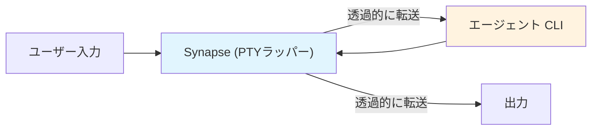
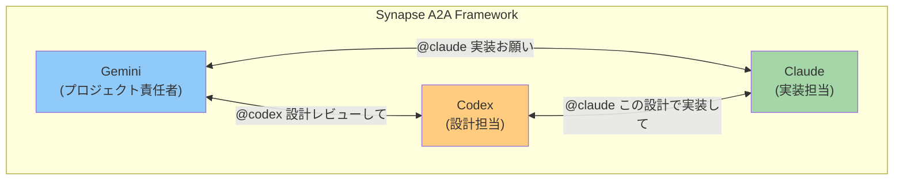

# Synapse A2A プロジェクト哲学

## ミッション

**各エージェントの挙動を変えることなく、エージェント同士を協力させてタスクを実行する。**

Synapse A2A の最大の目標は、Claude Code、Codex、Gemini などの既存 CLI エージェントを**そのままの形で**活用しながら、エージェント間の協調作業を実現することです。

```
┌─────────────────────────────────────────────────────────────────┐
│                      Synapse A2A の目標                         │
├─────────────────────────────────────────────────────────────────┤
│  ✅ エージェントの挙動を変えない（Non-Invasive）                 │
│  ✅ エージェント同士を協力させる（Collaborative）                │
│  ✅ 既存のワークフローを維持する（Transparent）                  │
└─────────────────────────────────────────────────────────────────┘
```

### なぜこれが重要か

- **各エージェントは独自の強みを持つ**: ユーザーが各エージェントの役割や得意分野を自由に設定できる
- **ユーザーは既存の使い方を変えたくない**: 学習コストなく協調の恩恵を受けられる
- **エージェントの進化に追従できる**: 内部実装に依存しないため、アップデートの影響を受けにくい

## 核心原則

### 1. エージェントの挙動を変えない（Non-Invasive Design）

**最重要原則**: Synapse は各エージェントの入出力を透過的にラップするだけで、エージェント自体の挙動には一切手を加えません。

- **PTY ラッピング**: CLI の入出力を透過的にラップ
- **プロファイルベース**: YAML 設定で異なる CLI に対応
- **透過的引数パススルー**: `synapse claude -- --resume` のように引数をそのまま渡す
- **エージェント固有の機能を維持**: 各エージェントのコマンド、ショートカット、設定はすべてそのまま動作



### 2. A2A プロトコル完全準拠（A2A-First）

Synapse A2A は「A2A プロトコルでできること」を最大限に活かすことを最優先とする。

- **すべての通信は A2A フォーマット**: Message/Part + Task 形式
- **標準エンドポイント**: `/.well-known/agent.json`, `/tasks/send`, `/tasks/{id}`
- **拡張は `x-` プレフィックス**: 独自機能も A2A の拡張機構に準拠

**例**: システムコンテキストの伝達
- ❌ CLI 固有の `--system-prompt` オプション
- ❌ 環境変数 `ANTHROPIC_SYSTEM_PROMPT`
- ✅ Agent Card の `x-synapse-context` 拡張（A2A 準拠）

### 3. エージェント間の協調（Collaborative Execution）

複数のエージェントが互いの強みを活かして協力し、単独では困難なタスクを達成する。

- **役割分担**: 各エージェントの得意分野を活かした分業
- **A2A 通信**: Google A2A プロトコルによる標準化されたメッセージング
- **@Agent 記法**: シンプルな構文でエージェント間メッセージング
- **タスク委任**: ルールベースの自動タスク振り分け



> **Note**: 上図の役割分担（実装、設計、プロジェクト責任者）は一例です。各エージェントの役割はユーザーが自由に設定できます。

### 4. 実験と検証（Experimental Validation）

A2A プロトコルの実用性と限界を実際の実装を通じて検証する。

- **検証項目**:
  - マルチエージェント協調の実現可能性
  - プロトコルの表現力と制約
  - リアルワールドでのユースケース適合性

- **フィードバックループ**:
  - 実装 → 課題発見 → 設計改善 → 再実装

### 5. 最小限の表示（Minimal Visibility）

ユーザーの端末は作業空間であり、システムメッセージで汚染しない。

- **ブートストラップは最小限**: 長いインストラクションより短いコマンド
- **A2A 経由の情報取得**: Agent Card からコンテキストを取得
- **ログは別ファイル**: `~/.synapse/logs/` に保存

## 設計判断の基準

新機能や変更を検討する際の判断基準：

| 判断軸 | 優先 | 避ける |
|--------|------|--------|
| プロトコル | A2A 準拠のアプローチ | CLI 固有のハック |
| 実装 | 標準機構の活用 | 独自プロトコルの発明 |
| ユーザー体験 | 透過的・最小限 | 煩雑・侵入的 |
| 検証 | 実際に動作するもの | 理論のみ |

## A2A プロトコルへの貢献

Synapse A2A を通じて得られた知見は、A2A プロトコル自体の改善に還元する。

### 発見した課題と提案

1. **システムコンテキストの標準化**
   - 現状: `extensions` での独自実装
   - 提案: Agent Card に `system_context` フィールドを標準化

2. **サイレントメッセージ**
   - 現状: すべての Task がエージェントの stdin に書き込まれる
   - 提案: メタデータのみの Task タイプ（表示不要）

3. **Priority Interrupt**
   - 現状: Synapse 独自拡張
   - 提案: Task に `interrupt` フラグを標準化

## ロードマップとの整合性

[tasks/a2a/README.md](../tasks/a2a/README.md) のロードマップは、この哲学に基づいて優先順位付けされている：

- **Phase 1 (高優先度)**: A2A 基本機能の完成
- **Phase 2 (中優先度)**: UX 改善（ストリーミング等）
- **Phase 3 (低優先度)**: エンタープライズ機能（認証等）

## 参加と貢献

このプロジェクトは A2A プロトコルの可能性を探求する実験場です。

- 新しいユースケースの提案
- プロトコル準拠性の検証
- 実装改善のフィードバック

すべての貢献を歓迎します。
