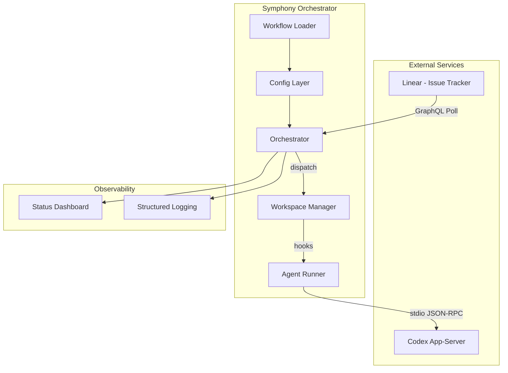
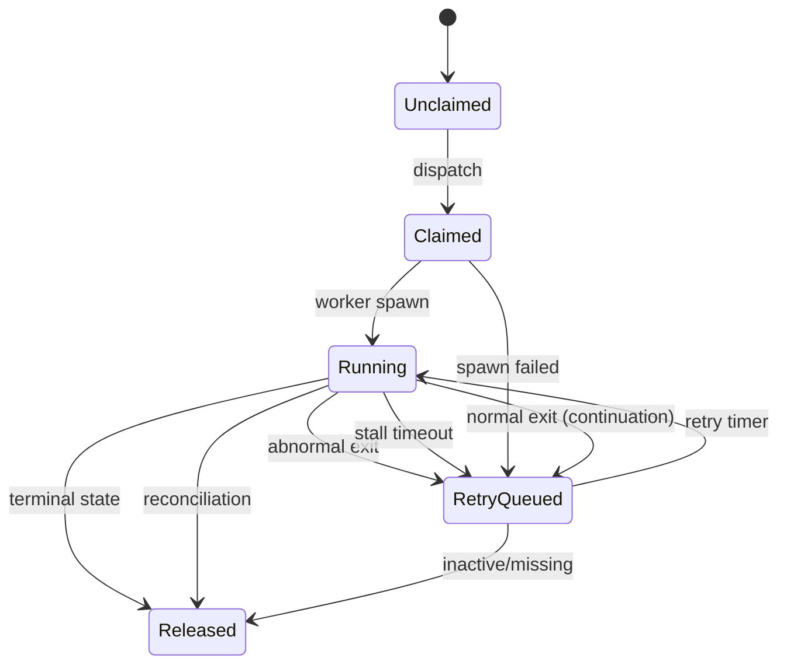

# OpenAI Symphony 解析レポート

> **Source**: [github.com/openai/symphony](https://github.com/openai/symphony)
> **Date**: 2026-03-17

## 1. Symphonyとは何か

**一言で**: Linearのチケットを自動ポーリングし、チケットごとに隔離ワークスペースを作成、Codexエージェントを自律実行させるデーモンサービス。

> Symphony turns project work into isolated, autonomous implementation runs, allowing teams to manage work instead of supervising coding agents.

**核心思想**: 人間がエージェントを監督するのではなく、エージェントが**完了の証拠（CI通過、PRレビュー、デモ動画）**を提示し、人間は成果物を**受理/却下**するだけ（Proof of Work モデル）。

---

## 2. アーキテクチャ



### 8つのコンポーネント

| コンポーネント | 役割 |
|---|---|
| **Workflow Loader** | WORKFLOW.md の YAML フロントマター＋Markdown プロンプトを解析 |
| **Config Layer** | 型付きゲッター、デフォルト値、`$ENV_VAR` 展開 |
| **Issue Tracker Client** | Linear GraphQL API からチケット取得・正規化 |
| **Orchestrator** | ポーリング、状態管理、ディスパッチ、リトライの唯一の権威 |
| **Workspace Manager** | チケットごとのディレクトリ作成、フック実行、パス安全検証 |
| **Agent Runner** | ワークスペース内で Codex プロセスを起動、プロンプト構築 |
| **Status Surface** | Phoenix LiveView ダッシュボード（オプション） |
| **Logging** | 構造化ログ（issue_id, session_id 必須） |

---

## 3. ステートマシン



チケットは5つのオーケストレーション状態を遷移する:

- **Unclaimed** → **Claimed** → **Running** → **Released**
- Claimed から **RetryQueued** → Running へ戻る

### リトライ戦略

- **正常終了**: continuation retry（1秒後に再チェック）
- **異常終了**: 指数バックオフ `min(10000 × 2^(attempt-1), 300000ms)`
- **ストール検出**: `stall_timeout_ms` 超過で kill → リトライ

### ワーカーのターン制御

- 1ワーカー内で最大 `max_turns` 回ターンを実行
- 毎ターン終了後にLinearでチケット状態を再確認
- アクティブなら次ターン、非アクティブなら終了

---

## 4. WORKFLOW.md による設定

ポリシーをコードとしてリポジトリ内に保持。ホットリロード対応。

```yaml
tracker:
  kind: linear
  api_key: $LINEAR_API_KEY
  project_slug: "symphony-660fc553ca86"
  active_states: [Todo, In Progress, Merging, Rework]
  terminal_states: [Closed, Cancelled, Duplicate, Done]
polling:
  interval_ms: 5000
workspace:
  root: ~/code/symphony-workspaces
hooks:
  after_create: |
    git clone --depth 1 https://github.com/... .
    mix deps.get
  before_remove: |
    mix workspace.before_remove
agent:
  max_concurrent_agents: 10
  max_turns: 20
codex:
  command: codex app-server --model gpt-5.3-codex
  approval_policy: never
  thread_sandbox: workspace-write
```

### フック実行契約

| フック | タイミング | 失敗時 |
|---|---|---|
| `after_create` | ワークスペース新規作成時 | 致命的（中止） |
| `before_run` | 各実行試行前 | 致命的（中止） |
| `after_run` | 各実行試行後 | ログのみ（無視） |
| `before_remove` | 削除前 | ログのみ（無視） |

---

## 5. Codex App-Server プロトコル

stdio 上の line-delimited JSON-RPC 2.0:

1. `initialize` — クライアント情報送信
2. `initialized` — 通知
3. `thread/start` — approval / sandbox / cwd 設定
4. `turn/start` — プロンプト送信、ターン開始

ターン完了条件: `turn/completed`, `turn/failed`, `turn/cancelled`, タイムアウト, プロセス終了

### 拡張

- **`linear_graphql` ツール**: エージェントが Symphony の認証を使い Linear に直接 GraphQL クエリ可能
- **SSH ワーカー**: リモートホストへのスケジューリング（オプション）

---

## 6. Elixir リファレンス実装

| 技術 | 詳細 |
|---|---|
| **言語** | Elixir ~1.19 / OTP 28 |
| **Web** | Phoenix ~1.8 + LiveView 1.1 |
| **HTTP** | Bandit ~1.8 |
| **テンプレート** | Solid（Liquid互換） |
| **Linear連携** | Req ~0.5 で GraphQL |
| **テスト** | ExUnit、100%カバレッジ必須 |
| **ビルド** | Mix + Escript（スタンドアロンバイナリ） |

### OTP スーパーバイザーツリー

```
SymphonyElixir.Supervisor (one_for_one)
├── Phoenix.PubSub
├── Task.Supervisor
├── WorkflowStore (ホットリロード監視)
├── Orchestrator (メインポーリング GenServer)
├── HttpServer (Phoenix エンドポイント)
└── StatusDashboard (ターミナル UI)
```

---

## 7. Synapse A2A との比較

| | Symphony | Synapse A2A |
|---|---|---|
| **焦点** | ワークフローオーケストレーション | エージェント間通信 |
| **構造** | 1:N トップダウン（Linear→Codex） | N:N P2P（Google A2A） |
| **トリガー** | イシュートラッカーのポーリング | エージェント間メッセージ |
| **プロトコル** | JSON-RPC 2.0 over stdio | Google A2A Task API |
| **状態管理** | インメモリ（再起動でリセット） | ファイルベース Registry |

### 統合の可能性

Symphony の Agent Runner が Synapse 経由で複数種類のエージェント（Claude, Gemini, Codex 等）をディスパッチする構成が考えられる。Symphony がスケジューリング層、Synapse が通信層として機能する。

---

## 8. 設計上の注目ポイント

1. **Proof of Work モデル** — エージェントが証拠を提示、人間は受理/却下のみ
2. **WORKFLOW.md のコード化** — ポリシーが git 管理＋ホットリロード
3. **linear_graphql 拡張** — エージェントが Symphony 認証で Linear に直接クエリ
4. **SSH ワーカー拡張** — リモートホストへのスケジューリング（オプション）
5. **100% テストカバレッジ** — format → lint → coverage → dialyzer 全通し必須

---

## 9. ローカル展開

| | symphony-playground | vscode-sidebar-terminal/symphony |
|---|---|---|
| **位置づけ** | 実験・学習用 | 本番運用 |
| **WORKFLOW.md** | サンプル設定 | vscode-sidebar-terminal 向け |
| **VSCode連携** | なし（独立） | 同リポジトリ内だが実行は独立 |
