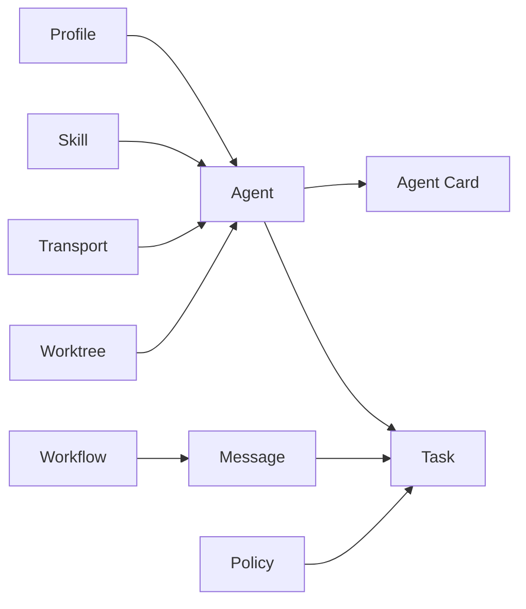

# Terminology

Use this glossary as the shared vocabulary reference for Synapse A2A docs,
CLI help, and code reviews. Link here from new docs when a term could be
ambiguous, or search this page with Ctrl+F.

## Core Terms

| Term | One-line definition | Where it lives | See also |
| ---- | ------------------- | -------------- | -------- |
| Agent | The execution entity: a PTY-wrapped CLI plus its local A2A server, identified by an agent ID such as `synapse-claude-8100`. | `README.md` Architecture, `synapse/registry.py`, `synapse/a2a_models.py` `AgentCard` | Profile, Agent Card, Registry |
| Task | The unit of work in A2A: a lifecycle object created from a message, tracked from `submitted` or `working` to a terminal status. | `README.md` Task Structure, `synapse/a2a_models.py` `Task`, `synapse/task_store.py` | Message, Artifact, Status |
| Message | Inter-agent communication content, usually text, carried as A2A `Message` with `Part` entries and optionally wrapped in a Task. | `README.md` Task Structure, `synapse/a2a_models.py` `Message`, `synapse send --help` | Part, Transport, Reply |
| Skill | A reusable template or capability pack (`SKILL.md`) that teaches agents a workflow, domain, or tool usage pattern. | `README.md` Skills, `synapse/skills.py`, `.agents/skills/`, `.claude/skills/` | Skill Set, Workflow |
| Policy | Permission and approval control that decides whether actions are approved, denied, or escalated to a human or parent agent. | `README.md` Permission Detection, `docs/agent-permission-modes.md`, `synapse/approval_gate.py` | Approval Gate, Permission Detection |
| Profile | A configured agent runtime type or saved agent definition, such as `claude`, `codex`, or a saved profile used by `synapse spawn`. | `README.md` CLI Commands, `synapse/profiles/*.yaml`, `synapse/agent_profiles.py` | Agent, Skill Set |
| Agent Card | The A2A discovery document exposed at `/.well-known/agent.json`, containing endpoint, capabilities, skills, and Synapse extensions. | `README.md` Agent Card, `synapse/a2a_models.py` `AgentCard`, `synapse/a2a_compat.py` | Agent, Skill, Context |
| Registry | The local index of running agents, ports, endpoints, working directories, status, names, roles, and summaries. | `README.md` Registry and Port Management, `synapse/registry.py`, `synapse list --help` | Agent, Port, Status |
| Worktree | A Synapse-managed git checkout under `.synapse/worktrees/` that isolates an agent's file edits from the parent checkout. | `README.md` Spawn Single Agent, `docs/worktree.md`, `synapse/worktree.py` | File Safety, Spawn |
| Workflow | A named YAML sequence of message steps that can be replayed with `synapse workflow run` and synced into skill directories. | `README.md` Features, `synapse/workflow.py`, `synapse workflow --help` | Skill, Message, Response Mode |
| Transport | The delivery mechanism for A2A messages into an agent, currently PTY stdin injection with an abstraction for alternate channels. | `README.md` Key Components, `synapse/transport.py`, `docs/channel-protocol.md` | Message, PTY |
| File Safety | Multi-agent locking and modification tracking used to avoid overlapping edits in shared working directories. | `README.md` File Safety, `docs/file-safety.md`, `synapse/file_safety.py` | Worktree, Lock |
| LLM Wiki | The structured, interlinked Markdown knowledge base for durable project or global agent knowledge. | `README.md` LLM Wiki, `.synapse/wiki/`, `synapse wiki --help` | Shared Memory, Canvas |
| Shared Memory | The older SQLite key-value knowledge store for cross-agent facts; README marks it deprecated in favor of LLM Wiki. | `README.md` Shared Memory, `docs/shared-memory-spec.md`, `synapse memory --help` | LLM Wiki |
| Canvas | The browser-based shared visual output surface for cards, diagrams, tables, plans, dashboards, and agent control. | `README.md` Canvas, `synapse/canvas/`, `synapse canvas --help` | Plan Card, Agent Control |
| Readiness Gate | The guard that returns HTTP 503 for `/tasks/send` until an agent has completed startup initialization. | `README.md` Features and A2A Compliant, `synapse/a2a_compat.py` | Task, Status |

## Relationships

Agents run Tasks. Messages travel between Agents and are stored inside Tasks.
Profiles describe how an Agent is started; Agent Cards describe how another
Agent discovers it. Skills and Workflows are reusable behavior templates, while
Policy controls permission prompts and approval decisions. Worktrees and File
Safety reduce edit conflicts when several Agents work at once.

## Less-Central Terms

`Part`
: A typed entry inside an A2A Message, commonly `text`, with `file` and `data`
  also modeled in `synapse/a2a_models.py`.

`Artifact`
: Output attached to a Task, used for results, summaries, and failed-task data.

`Status`
: The state of an agent or task. Agent monitor states include `READY`,
  `WAITING`, `PROCESSING`, and `DONE`; A2A task states include `submitted`,
  `working`, `input_required`, `completed`, `failed`, and `canceled`.

`Response Mode`
: The sender's delivery expectation: `wait`, `notify`, or `silent`, surfaced
  by `synapse send`, `synapse spawn`, and Workflow steps.

`Approval Gate`
: Parent-side logic that classifies a permission prompt and dispatches approve,
  deny, or escalation behavior.

`Adapter`
: A design-rationale term for Synapse's role as a wrapper between existing CLI
  tools and A2A endpoints; it is an architectural description, not a primary
  class name.

`PTY`
: The pseudo-terminal layer Synapse uses to keep each wrapped CLI agent behaving
  as if it were still being used directly by a human.

`MCP Bootstrap`
: The Model Context Protocol path for retrieving compact Synapse instructions,
  settings, and runtime context at startup.

`Multi-Agent Pattern`
: A declarative coordination pattern, such as generator-verifier or
  message-bus, that describes how multiple agents should collaborate.

## Known Inconsistencies

No direct contradictions were found between the issue baseline, `README.md`,
CLI help, and the inspected code paths. Two terms need care:

- `Skill` is used both for A2A Agent Card capability entries (`AgentSkill`) and
  for repository-distributed `SKILL.md` workflow packs. In project docs, use
  "Skill" for `SKILL.md` packs unless specifically discussing Agent Card JSON.
- `Shared Memory` still appears in CLI help as an active command, while
  `README.md` marks it deprecated in favor of LLM Wiki. Treat it as supported
  but legacy.
