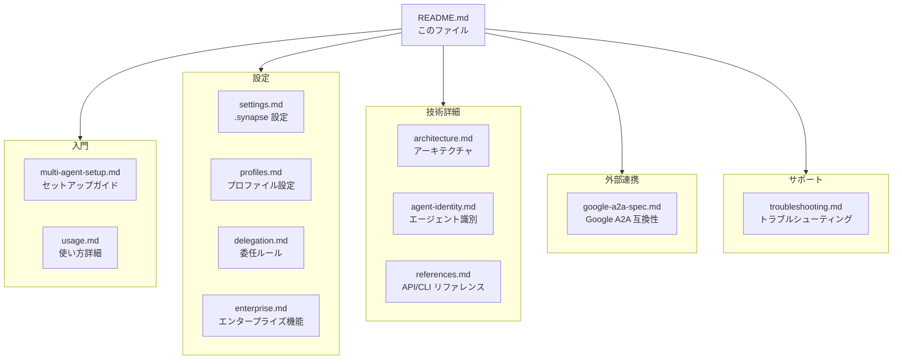

# Synapse A2A ドキュメント

このディレクトリには、Synapse A2A の設計・運用・トラブルシューティングに関する詳細ドキュメントをまとめています。

---

## Synapse A2A とは

**Synapse A2A** は、複数の AI エージェント（Claude、Gemini、Codex など）を統合的に管理・連携させるためのプロトコル実装です。Google A2A プロトコルに完全準拠し、エージェント間の通信を標準化された方式で行います。

### 主な機能

- **Google A2A プロトコル完全準拠**: Message/Part + Task 形式による標準化された通信
- **@Agent 記法**: 直感的なエージェント間メッセージング（例: `@gemini タスクを実行して`）
- **統合 CLI**: `synapse` コマンドによるエージェントの起動・管理・監視
- **HTTP API**: RESTful な `/tasks/send` エンドポイントによるプログラマティックな制御
- **Agent Card 対応**: `/.well-known/agent.json` による標準的なサービスディスカバリ
- **外部エージェント連携**: 外部で動作する A2A 互換エージェントとの接続
- **エンタープライズ機能**: API Key 認証、Webhook 通知、gRPC サポート
- **366 件のテストによる品質保証**: A2A 準拠性を継続的に検証

---

## ドキュメント構成



---

## 1. 入門ガイド

### [multi-agent-setup.md](multi-agent-setup.md)
**マルチエージェントセットアップガイド**

- 前提条件（OS、Python、CLI ツール）
- インストール手順
- 複数エージェントの起動方法
- @Agent 記法の基本的な使い方
- 外部からの API/CLI 操作

> 初めての方はこちらから始めてください

### [usage.md](usage.md)
**使い方詳細**

- インタラクティブモードとバックグラウンドモード
- CLI コマンド一覧
- @Agent 記法の詳細
- HTTP API の使い方
- Priority（優先度）の意味
- 運用パターン例

---

## 2. 設定リファレンス

### [settings.md](settings.md)
**.synapse 設定ガイド**

- settings.json のスコープと優先順位
- 環境変数と初期インストラクション
- スキルのインストール先と再インストール

### [profiles.md](profiles.md)
**プロファイル設定ガイド**

- YAML スキーマの解説
- 各フィールドの意味
  - `command`: CLI コマンド
  - `idle_regex`: READY 状態検出パターン
  - `submit_sequence`: 送信キーシーケンス
  - `env`: 環境変数
- デフォルトプロファイル（claude, codex, gemini, dummy）
- カスタムプロファイルの作成方法

### [delegation.md](delegation.md)
**委任ルールとモード**

- orchestrator / passthrough / off の違い
- ルール記述の書き方と例
- 委任結果の取り扱い

### [enterprise.md](enterprise.md)
**エンタープライズ機能ガイド**

- API Key 認証の設定と使い方
- Webhook 通知の設定
  - イベントタイプ（task.completed, task.failed, task.canceled）
  - HMAC 署名検証
  - リトライ機能
- gRPC サポート
  - Protocol Buffers 定義
  - Python クライアント例
- セキュリティベストプラクティス

> 本番環境での運用にはこちらを参照してください

---

## 3. 技術ドキュメント

### [agent-identity.md](agent-identity.md)
**エージェント識別とルーティング設計**

- ID 形式とルーティングの基本
- @Agent の誤判定を防ぐ設計方針
- Agent Card の拡張と addressable_as

### [architecture.md](architecture.md)
**内部アーキテクチャ**

- コンポーネント構成図
- TerminalController: PTY 管理
- InputRouter: @Agent パターン検出
- AgentRegistry: サービス検出
- FastAPI Server: HTTP API
- スレッドモデル
- 通信フロー詳細
- 設計方針

### [references.md](references.md)
**API/CLI リファレンス**

- CLI コマンド完全リファレンス
- HTTP API エンドポイント仕様
- Registry ファイル構造
- プロファイル YAML スキーマ

---

## 4. 外部連携

### [google-a2a-spec.md](google-a2a-spec.md)
**Google A2A プロトコル互換性**

- Google A2A プロトコル概要
- Agent Card / Task の概念
- Synapse A2A の互換機能
- 外部エージェントへの接続方法
- API エンドポイント一覧

---

## 5. サポート

### [troubleshooting.md](troubleshooting.md)
**トラブルシューティング**

- PTY/TUI 描画の問題
- エージェントが見つからない
- ポート競合
- READY 検出の問題
- Claude Code 固有の問題
- デバッグ方法

---

## クイックリファレンス

### デフォルトポート

| エージェント | ポート範囲 | プロファイル |
|-------------|-----------|-------------|
| Claude | 8100-8109 | `claude.yaml` |
| Gemini | 8110-8119 | `gemini.yaml` |
| Codex | 8120-8129 | `codex.yaml` |
| Dummy | 8190-8199 | `dummy.yaml` |

### 主要コマンド

```bash
# インタラクティブ起動
synapse claude --port 8100

# バックグラウンド起動
synapse start claude --port 8100

# エージェント一覧
synapse list

# メッセージ送信
synapse send --target codex --priority 1 "メッセージ"

# 停止
synapse stop claude
```

### 外部エージェント管理

```bash
# 外部エージェントを発見・登録
synapse external add http://other-agent:9000 --alias other

# 登録済み外部エージェント一覧
synapse external list

# 外部エージェントにメッセージ送信
synapse external send other "Hello!"

# 外部エージェント詳細表示
synapse external info other

# 外部エージェント削除
synapse external remove other
```

### @Agent 記法

```text
# ローカルエージェント
@agent_name メッセージ

# 外部エージェント（事前に登録が必要）
@external_alias メッセージ

# レスポンスを受け取る
@agent_name "メッセージ"
```

### HTTP API

```bash
# メッセージ送信（A2A 準拠）
curl -X POST http://localhost:8100/tasks/send \
  -H "Content-Type: application/json" \
  -d '{"message": {"role": "user", "parts": [{"type": "text", "text": "Hello"}]}}'

# ステータス確認
curl http://localhost:8100/status

# Agent Card 取得
curl http://localhost:8100/.well-known/agent.json
```

---

## ファイル構成

```
guides/
├── README.md              # このファイル（ドキュメントインデックス）
├── multi-agent-setup.md   # セットアップガイド
├── usage.md               # 使い方詳細
├── profiles.md            # プロファイル設定
├── enterprise.md          # エンタープライズ機能（認証・Webhook・gRPC）
├── architecture.md        # アーキテクチャ
├── references.md          # API/CLI リファレンス
├── troubleshooting.md     # トラブルシューティング
└── google-a2a-spec.md     # Google A2A 互換性
```
