# Architecture

Synapse A2A は「CLI を PTY でラップし、A2A 通信を透過的に追加する」ことに特化したフレームワークです。
このドキュメントでは、内部アーキテクチャを詳細に解説します。

---

## 1. システム概要

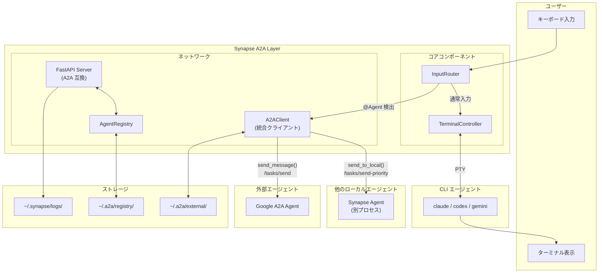

**ポイント**:
- InputRouter は A2AClient を経由してローカル・外部エージェントと通信
- ローカル通信: `send_to_local()` → `/tasks/send-priority`
- 外部通信: `send_message()` → `/tasks/send`
- すべての通信で Message/Part 構造を使用

---

## 2. 主要コンポーネント

### 2.1 TerminalController

**ファイル**: `synapse/controller.py`

PTY（疑似端末）を使って CLI を起動・管理する中核コンポーネントです。

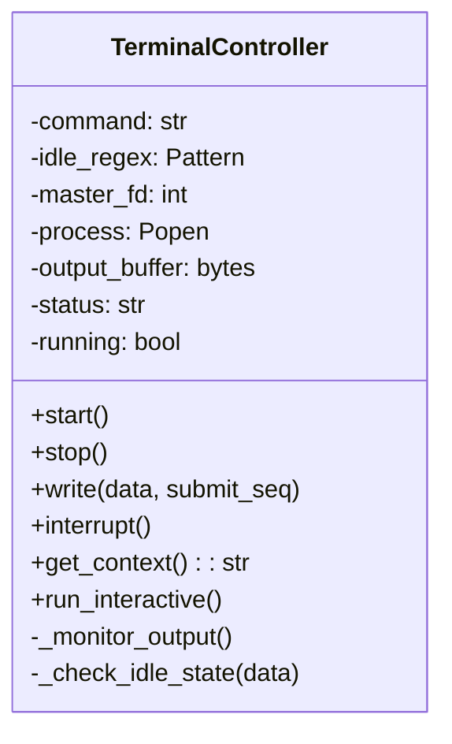

**主な機能**:

| メソッド | 説明 |
|---------|------|
| `start()` | PTY を生成し CLI を起動、出力監視スレッドを開始 |
| `stop()` | プロセスを終了し PTY をクローズ |
| `write(data, submit_seq)` | PTY の stdin にデータを書き込み |
| `interrupt()` | SIGINT をプロセスグループに送信 |
| `get_context()` | 出力バッファの内容を取得 |
| `run_interactive()` | `pty.spawn()` を使ったインタラクティブモード |

**IDLE/BUSY 状態管理**:

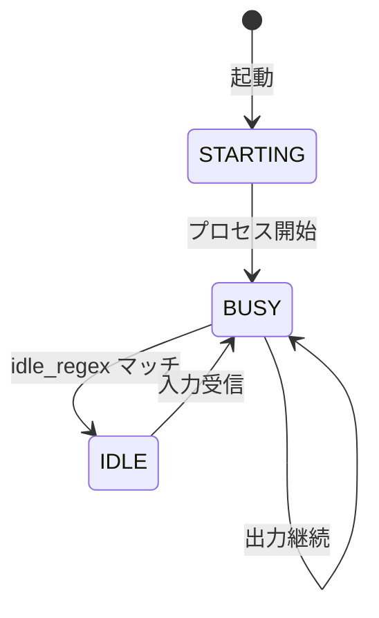

---

### 2.2 InputRouter

**ファイル**: `synapse/input_router.py`

ユーザー入力を 1 文字ずつ解析し、`@Agent` パターンを検出してルーティングします。
ローカルエージェントと外部エージェントの両方に対応しており、A2AClient を通じて統一的に通信を行います。

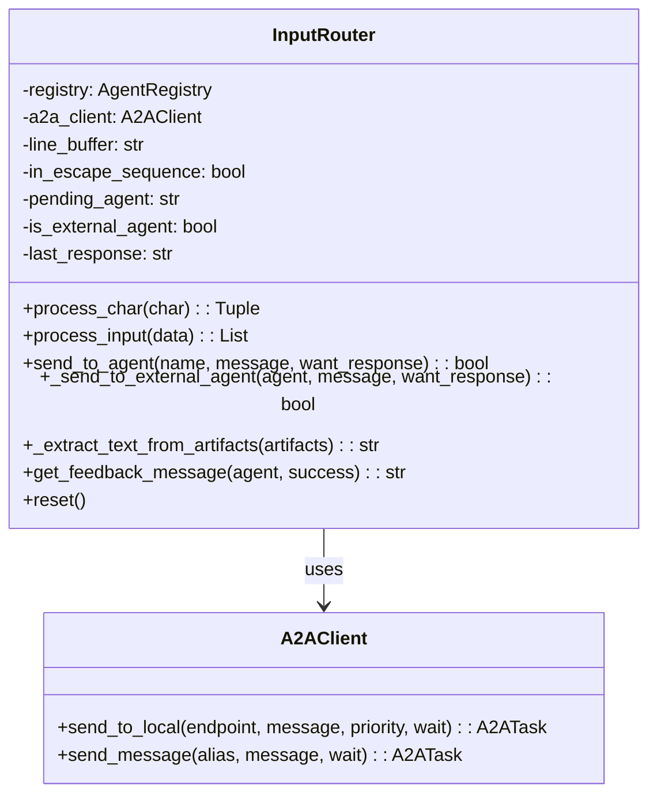

**通信方式の統一**:
- ローカルエージェント: `A2AClient.send_to_local()` を使用（`/tasks/send-priority` へ送信）
- 外部エージェント: `A2AClient.send_message()` を使用（`/tasks/send` へ送信）
- いずれも Message/Part 構造の A2A メッセージ形式を使用

**エージェント検索順序**:

1. ローカル Registry (`~/.a2a/registry/`) を検索
2. 見つからない場合、外部 Registry (`~/.a2a/external/`) を検索

**パターン検出**:

```
@Agent [--response] message

例:
@codex 設計をレビューして
@claude --response "コードをチェックして"
```

**入力処理フロー**:

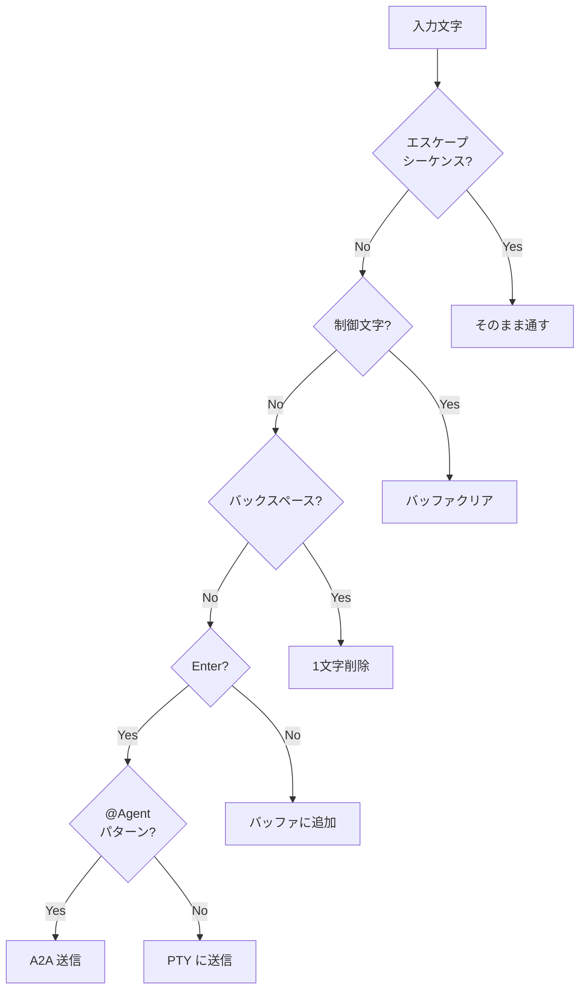

---

### 2.3 AgentRegistry

**ファイル**: `synapse/registry.py`

ファイルベースのサービス検出を提供します。

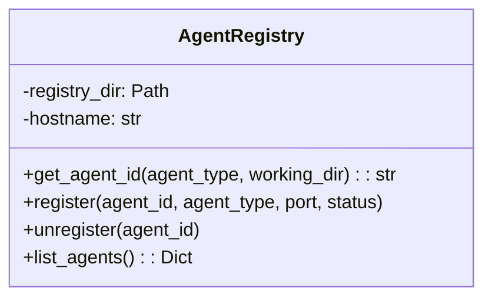

**Registry ファイル構造**:

```
~/.a2a/registry/
├── <agent_id_hash>.json    # Claude
├── <agent_id_hash>.json    # Codex
└── <agent_id_hash>.json    # Gemini
```

**エージェント ID の生成**:

```python
raw_key = f"{hostname}|{working_dir}|{agent_type}"
agent_id = sha256(raw_key).hexdigest()
```

**Registry JSON 構造**:

```json
{
  "agent_id": "abc123...",
  "agent_type": "claude",
  "port": 8100,
  "status": "BUSY",
  "pid": 12345,
  "working_dir": "/path/to/project",
  "endpoint": "http://localhost:8100"
}
```

---

### 2.4 FastAPI Server

**ファイル**: `synapse/server.py`

HTTP API を提供するサーバーコンポーネントです。A2A プロトコルに準拠したエンドポイントを提供します。

```mermaid
classDiagram
    class FastAPIServer {
        -controller: TerminalController
        -registry: AgentRegistry
        -task_store: TaskStore
        -agent_id: str
        -port: int
        -submit_sequence: str
        +POST /message
        +GET /status
        +POST /tasks/send
        +POST /tasks/send-priority
        +GET /tasks/{id}
    }

    class TaskStore {
        -tasks: Dict~str, Task~
        +create(message): Task
        +get(task_id): Task
        +update_status(task_id, status)
        +add_artifact(task_id, artifact)
    }

    class Message {
        +role: str
        +parts: List~Part~
    }

    class TextPart {
        +type: str = "text"
        +text: str
    }

    FastAPIServer --> TaskStore
    TaskStore --> Message
    Message --> TextPart
```

**エンドポイント**:

| メソッド | パス | 説明 |
|---------|------|------|
| POST | `/message` | シンプルなメッセージ送信（内部で A2A Task を作成） |
| GET | `/status` | ステータスとコンテキスト取得 |
| GET | `/.well-known/agent.json` | Agent Card（Google A2A） |
| POST | `/tasks/send` | Task 作成（Google A2A 標準） |
| POST | `/tasks/send-priority` | Task 作成 + Priority 指定（Synapse 拡張） |
| GET | `/tasks/{id}` | Task 状態取得 |
| POST | `/external/discover` | 外部エージェント発見 |
| GET | `/external/agents` | 外部エージェント一覧 |
| POST | `/external/agents/{alias}/send` | 外部エージェントへ送信 |

**メッセージ形式**:

すべての A2A エンドポイントは Message/Part 構造を使用します：

```json
{
  "message": {
    "role": "user",
    "parts": [
      {"type": "text", "text": "メッセージ内容"}
    ]
  }
}
```

---

### 2.5 A2AClient

**ファイル**: `synapse/a2a_client.py`

ローカルおよび外部の Google A2A 互換エージェントと通信する統合クライアントです。

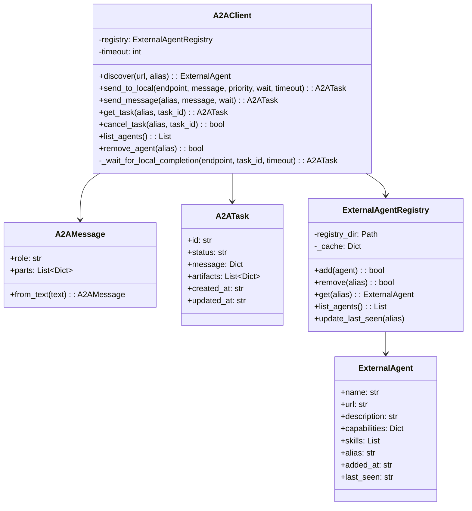

**主な機能**:

| メソッド | 説明 |
|---------|------|
| `send_to_local(endpoint, message, priority)` | ローカルエージェントに A2A メッセージを送信（`/tasks/send-priority` 使用） |
| `discover(url)` | Agent Card を取得して外部エージェントを登録 |
| `send_message(alias, message)` | 外部エージェントにメッセージ送信 |
| `get_task(alias, task_id)` | Task 状態を取得 |
| `list_agents()` | 登録済み外部エージェント一覧 |

**ローカル通信**: `send_to_local()` メソッドは、InputRouter からローカルエージェントへの通信に使用されます。
**外部通信**: `send_message()` メソッドは、外部 A2A エージェントへの通信に使用されます。

**Registry ファイル**: `~/.a2a/external/<alias>.json`

---

## 3. 起動フロー

### 3.1 インタラクティブモード

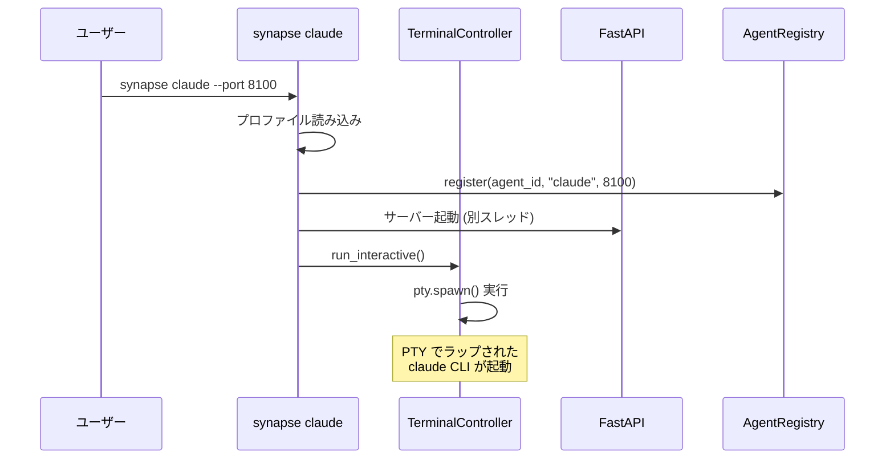

### 3.2 バックグラウンドモード

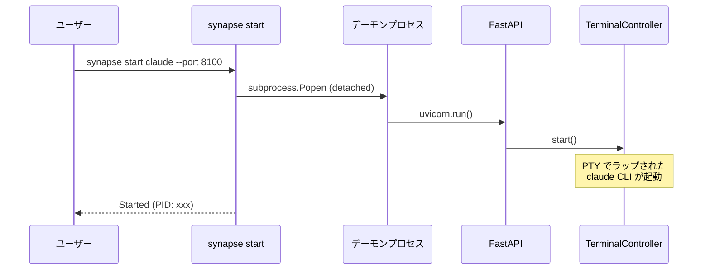

---

## 4. 通信フロー

### 4.1 @Agent によるエージェント間通信

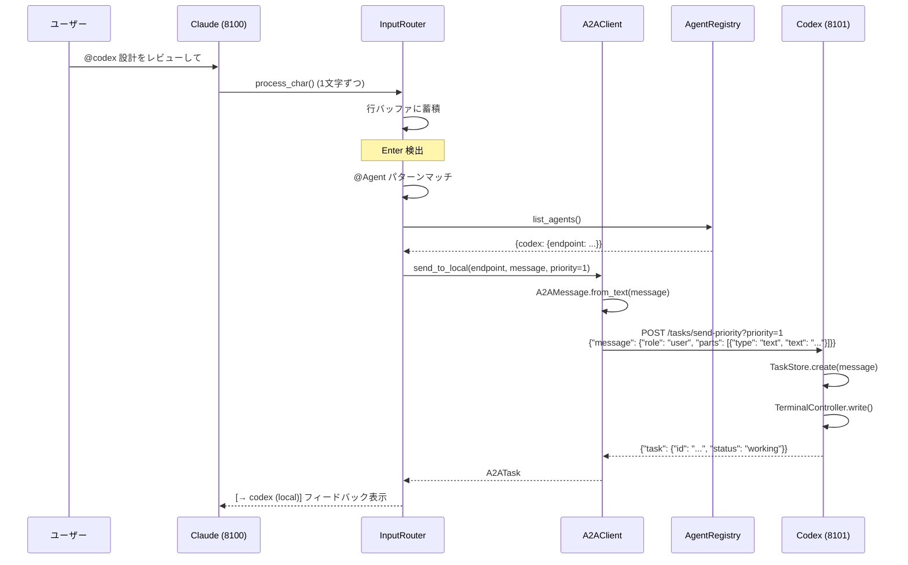

**ポイント**:
- InputRouter は直接 HTTP リクエストを送信せず、A2AClient.send_to_local() を使用
- メッセージは A2AMessage 形式（Message/Part 構造）に変換される
- `/tasks/send-priority` エンドポイントを使用（priority サポートのため）

### 4.2 --response オプション付き通信

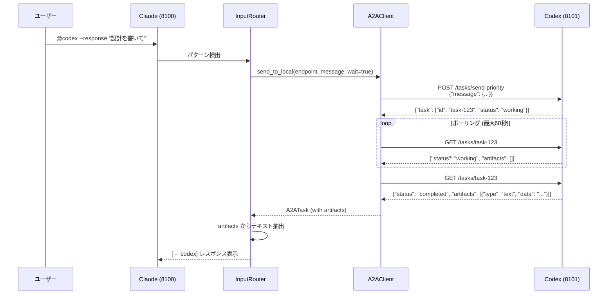

**ポイント**:
- `wait_for_completion=true` により A2AClient がポーリングを担当
- レスポンスは Task の artifacts として返される
- artifacts 内の text タイプのデータを抽出して表示

### 4.3 Priority 5 による緊急割り込み

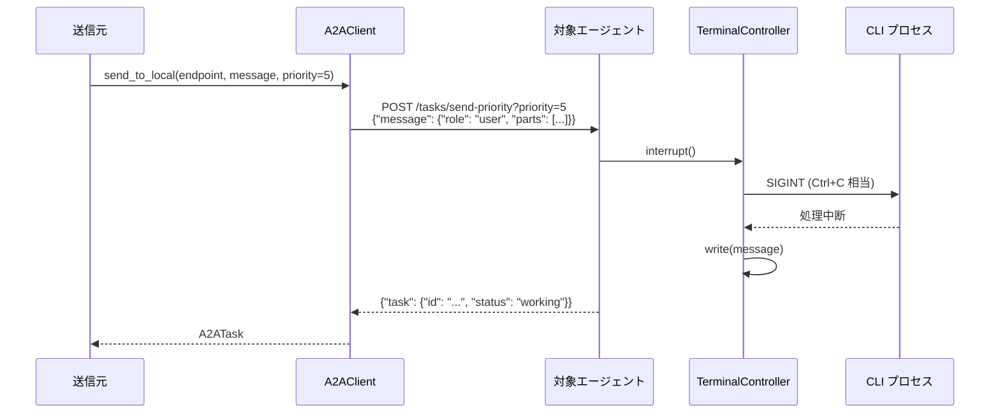

**ポイント**:
- priority=5 は `/tasks/send-priority` のクエリパラメータで渡される
- サーバー側で priority >= 5 を検出して interrupt() を呼び出す

### 4.4 /message エンドポイントの内部変換

`/message` エンドポイントはシンプルなインターフェースを提供し、内部的には A2A Task を作成します。

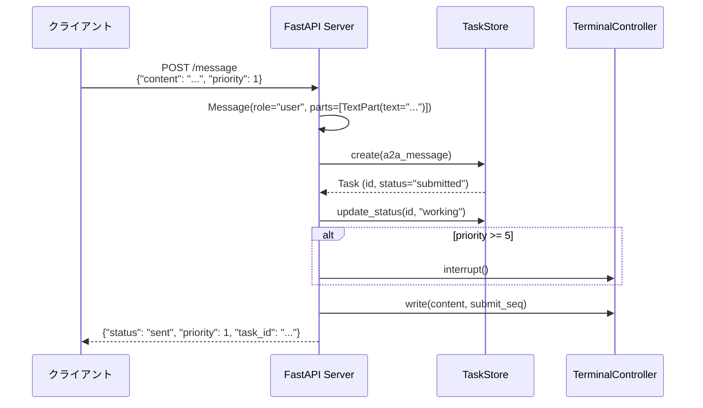

**ポイント**:
- 内部で A2A Message 形式に変換
- TaskStore で Task を作成・管理
- 返り値に `task_id` を含める（A2A 互換）
- 完全な A2A 互換機能が必要な場合は `/tasks/send-priority` を使用

---

## 5. スレッドモデル

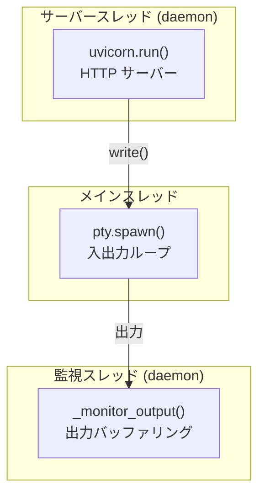

**スレッド一覧**:

| スレッド | デーモン | 役割 |
|---------|---------|------|
| メインスレッド | No | `pty.spawn()` による入出力処理 |
| サーバースレッド | Yes | FastAPI/Uvicorn HTTP サーバー |
| 監視スレッド | Yes | 出力バッファリング、IDLE 状態検出 |

---

## 6. データフロー

### 6.1 出力バッファリング

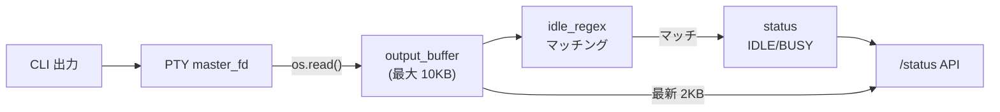

### 6.2 入力ルーティング

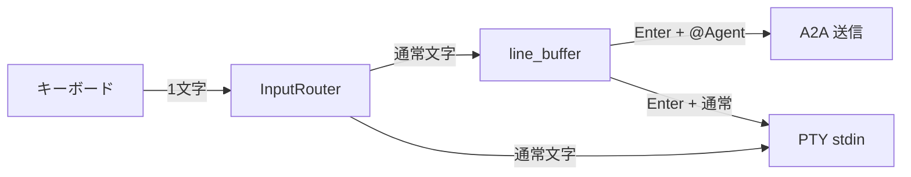

---

## 7. 設計方針

### 7.1 非侵入型設計

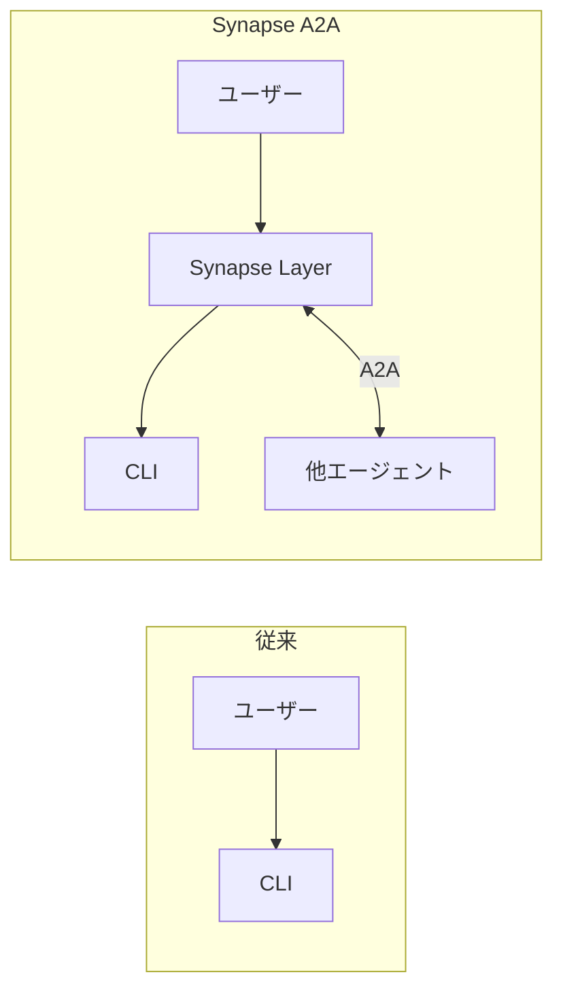

- 既存 CLI の改造は不要
- PTY ラッピングにより透過的に機能追加
- ユーザーの操作感を維持

### 7.2 統一 A2A 通信

すべてのエージェント間通信は A2A プロトコルに準拠しています。

| レイヤー | コンポーネント | 通信方式 |
|---------|--------------|---------|
| InputRouter | A2AClient.send_to_local() | `/tasks/send-priority` |
| InputRouter | A2AClient.send_message() | `/tasks/send` |
| シンプル API | `/message` | 内部で Task 作成 |

**メッセージ構造**: Message/Part 形式で統一

```
Message
├── role: "user" | "agent"
└── parts: []
    └── TextPart
        ├── type: "text"
        └── text: "メッセージ内容"
```

### 7.3 ファイルベース Registry

- 外部サービス（Redis, etcd 等）への依存なし
- シンプルな JSON ファイルで永続化
- プロセス終了時に自動クリーンアップ

### 7.4 責務範囲の明確化

Synapse A2A は **通信基盤** に専念し、認証・セキュリティは外部に委譲します。

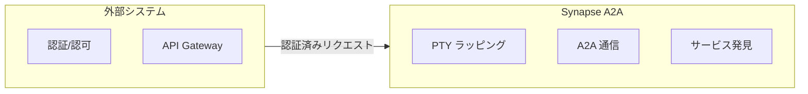

**Synapse A2A が提供するもの**:

| 機能 | 説明 |
|------|------|
| PTY ラッピング | CLI ツールを改造せずにエージェント化 |
| @Agent 記法 | 端末内でのエージェント間通信 |
| A2A プロトコル | Message/Part + Task 形式の標準通信 |
| サービス発見 | `~/.a2a/registry/` によるエージェント検出 |
| 外部接続 | 他の A2A エージェントと接続するインターフェース |

**Synapse A2A が提供しないもの**:

| 機能 | 理由 |
|------|------|
| 認証/認可 | 外部システム（API Gateway 等）で処理される前提 |
| 認証情報の保存 | 外部の認証基盤で管理される前提 |
| セキュリティポリシー | 運用環境に依存 |

> **設計思想**: 信頼された環境（VPN、プライベートネットワーク、認証済みゾーン等）での動作を前提とし、通信の仕組みに専念することで、シンプルさと柔軟性を維持します。

---

## 8. プロジェクト構造

```
synapse-a2a/
├── synapse/
│   ├── cli.py              # CLI エントリポイント (~460行)
│   ├── controller.py       # TerminalController (~245行)
│   ├── registry.py         # AgentRegistry (~55行)
│   ├── input_router.py     # InputRouter (~270行)
│   ├── server.py           # FastAPI サーバー (~150行)
│   ├── shell.py            # インタラクティブシェル (~190行)
│   ├── a2a_compat.py       # Google A2A 互換レイヤー (~570行)
│   ├── a2a_client.py       # 外部エージェントクライアント (~330行)
│   ├── profiles/           # エージェントプロファイル
│   │   ├── claude.yaml
│   │   ├── codex.yaml
│   │   ├── gemini.yaml
│   │   └── dummy.yaml
│   └── tools/
│       └── a2a.py          # A2A CLI ツール (~75行)
├── dummy_agent.py          # テスト用エージェント
├── guides/                 # ドキュメント
└── README.md
```

### ストレージ構造

```
~/.a2a/
├── registry/               # ローカルエージェント（実行中のみ）
│   └── <agent_id>.json
└── external/               # 外部エージェント（永続的）
    └── <alias>.json

~/.synapse/
└── logs/
    ├── <profile>.log
    └── input_router.log
```

---

## 9. 拡張ポイント

### 9.1 新しいエージェントの追加

1. `synapse/profiles/` に YAML ファイルを作成
2. `DEFAULT_PORTS` に追加（オプション）

### 9.2 API の拡張

`synapse/server.py` または `synapse/a2a_compat.py` に新しいエンドポイントを追加可能。

### 9.3 Google A2A 互換機能

`synapse/a2a_compat.py` で以下を提供：

- Agent Card (`/.well-known/agent.json`)
- Task API (`/tasks/send`, `/tasks/{id}`)
- 外部エージェント管理 (`/external/*`)

### 9.4 将来の拡張予定

| 機能 | 優先度 | 説明 |
|------|--------|------|
| SSE ストリーミング | 中 | リアルタイム出力 |
| Push 通知 | 低 | Webhook コールバック |
| 認証 | 低 | OAuth2 / API Key |

---

## 関連ドキュメント

- [profiles.md](profiles.md) - プロファイル設定の詳細
- [references.md](references.md) - API/CLI リファレンス
- [google-a2a-spec.md](google-a2a-spec.md) - Google A2A との比較
