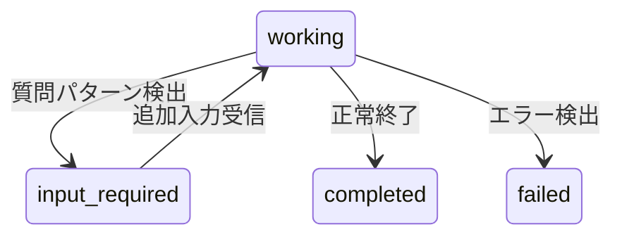

# エンタープライズ機能ガイド

> **Synapse A2A のセキュリティ・通知・高性能通信機能**

本ガイドでは、本番環境やエンタープライズユースケース向けの機能について解説します。

---

## 目次

- [概要](#概要)
- [認証・認可 (API Key)](#認証認可-api-key)
- [Webhook 通知](#webhook-通知)
- [SSE ストリーミング](#sse-ストリーミング)
- [出力解析](#出力解析)
- [gRPC サポート](#grpc-サポート)
- [セキュリティベストプラクティス](#セキュリティベストプラクティス)

---

## 概要

Synapse A2A は以下のエンタープライズ機能を提供します：

| 機能 | 説明 | ユースケース |
|------|------|-------------|
| **API Key 認証** | エンドポイントへのアクセス制御 | 本番環境でのセキュリティ確保 |
| **Webhook 通知** | タスク完了時の外部通知 | CI/CD 連携、監視システム |
| **SSE ストリーミング** | リアルタイム出力配信 | 出力監視、進捗追跡 |
| **出力解析** | エラー検出・Artifact 生成 | 自動エラーハンドリング、構造化出力 |
| **gRPC** | 高性能バイナリプロトコル | 大量リクエスト、低レイテンシ要件 |

---

## 認証・認可 (API Key)

### 概要

API Key 認証により、Synapse A2A のエンドポイントへのアクセスを制御できます。

```text
┌─────────────┐     X-API-Key: xxx     ┌─────────────────┐
│   Client    │ ─────────────────────► │  Synapse A2A    │
│             │                        │  (認証有効)      │
└─────────────┘                        └─────────────────┘
       │                                      │
       │  401 Unauthorized                    │ 200 OK
       └──────────────────────────────────────┘
```

### クイックスタート

#### 1. 認証を有効にして起動

```bash
# 環境変数で設定
export SYNAPSE_AUTH_ENABLED=true
export SYNAPSE_API_KEYS=my-secret-key-1,my-secret-key-2

# エージェント起動
synapse claude
```

#### 2. API Key でリクエスト

```bash
# ヘッダーで指定（推奨）
curl -H "X-API-Key: my-secret-key-1" \
  http://localhost:8100/tasks

# クエリパラメータで指定
curl "http://localhost:8100/tasks?api_key=my-secret-key-1"
```

### 環境変数

| 変数名 | 説明 | デフォルト |
|--------|------|-----------|
| `SYNAPSE_AUTH_ENABLED` | 認証を有効化 | `false` |
| `SYNAPSE_API_KEYS` | 有効な API Key（カンマ区切り） | なし |
| `SYNAPSE_ADMIN_KEY` | 管理者用 API Key | なし |
| `SYNAPSE_ALLOW_LOCALHOST` | localhost からのアクセスを許可 | `true` |

### API Key の発行

API Key は外部サービスで発行するものではなく、自分で生成して環境変数に設定します。

#### 方法1: synapse auth コマンドで生成（推奨）

```bash
# 単一キーを生成
synapse auth generate-key
# 出力: synapse_NzwQDYhGm_fqDIxb4h3WDtBu74ABs6pZSaSXwDck9vg

# 複数キーを生成
synapse auth generate-key --count 3

# export 形式で出力（シェル設定に貼り付け可能）
synapse auth generate-key --export
# 出力: export SYNAPSE_API_KEYS=synapse_...

# セットアップウィザード（API Key + Admin Key + 設定手順を表示）
synapse auth setup
```

`synapse auth setup` の出力例:

```text
============================================================
Synapse A2A Authentication Setup
============================================================

Generated keys:
  API Key:   synapse_YTsFj2jYvrqzKW_sBrVKbyisTAVZRzubuLP35EfnpsI
  Admin Key: synapse_Be9HUurSxlQuOInoerb8zpEVd4ZveaH9uix0tX3DdEg

Add these to your shell configuration (~/.bashrc, ~/.zshrc):

  export SYNAPSE_AUTH_ENABLED=true
  export SYNAPSE_API_KEYS=synapse_YTsFj2jYvrqzKW_sBrVKbyisTAVZRzubuLP35EfnpsI
  export SYNAPSE_ADMIN_KEY=synapse_Be9HUurSxlQuOInoerb8zpEVd4ZveaH9uix0tX3DdEg

============================================================
IMPORTANT: Save these keys securely. They cannot be recovered.
============================================================
```

#### 方法2: openssl で生成

```bash
# 強力なランダムキーを生成
openssl rand -hex 32
# 出力例: 7f3a9c2d1e4b5f6a8c9d0e1f2a3b4c5d6e7f8a9b0c1d2e3f4a5b6c7d8e9f0a1b
```

#### 方法3: Python で生成

```python
from synapse.auth import generate_api_key

key = generate_api_key()
print(key)  # "synapse_..." 形式のキーが生成される
```

### API Key の種類

#### 通常の API Key

タスク操作に必要な基本的な権限を持ちます。

```bash
SYNAPSE_API_KEYS=key1,key2,key3
```

#### Admin Key

全ての操作（Webhook 管理含む）が可能です。

```bash
SYNAPSE_ADMIN_KEY=super-secret-admin-key
```

### 保護されるエンドポイント

| エンドポイント | 必要な認証 |
|---------------|-----------|
| `POST /tasks/send` | API Key |
| `GET /tasks/{id}` | API Key |
| `GET /tasks` | API Key |
| `POST /tasks/{id}/cancel` | API Key |
| `GET /tasks/{id}/subscribe` | API Key |
| `POST /tasks/send-priority` | API Key |
| `POST /webhooks` | Admin Key |
| `DELETE /webhooks/{id}` | Admin Key |

### localhost 自動許可

開発環境では `localhost` からのリクエストを自動許可できます（デフォルト有効）。

```bash
# localhost 許可を無効化（本番環境推奨）
export SYNAPSE_ALLOW_LOCALHOST=false
```

### エラーレスポンス

```json
// 401 Unauthorized - API Key なし
{
  "detail": "API key required"
}

// 401 Unauthorized - 無効な API Key
{
  "detail": "Invalid API key"
}

// 403 Forbidden - 権限不足
{
  "detail": "Admin privileges required"
}
```

---

## Webhook 通知

### 概要

タスクの状態変化を外部 URL に通知できます。CI/CD パイプラインや監視システムとの連携に便利です。

```text
┌─────────────────┐    task.completed    ┌─────────────────┐
│  Synapse A2A    │ ───────────────────► │  Your Server    │
│                 │                      │  (Webhook URL)  │
└─────────────────┘                      └─────────────────┘
       │
       │  署名検証: X-Webhook-Signature
       │  リトライ: 最大3回（指数バックオフ）
       │
```

### クイックスタート

#### 1. Webhook を登録

```bash
curl -X POST http://localhost:8100/webhooks \
  -H "Content-Type: application/json" \
  -H "X-API-Key: your-admin-key" \
  -d '{
    "url": "https://your-server.com/webhook",
    "events": ["task.completed", "task.failed"],
    "secret": "your-webhook-secret"
  }'
```

レスポンス:

```json
{
  "id": "wh_abc123",
  "url": "https://your-server.com/webhook",
  "events": ["task.completed", "task.failed"],
  "active": true,
  "created_at": "2025-12-31T12:00:00Z"
}
```

#### 2. Webhook を受信

```python
# Flask での例
from flask import Flask, request
import hmac
import hashlib

app = Flask(__name__)
WEBHOOK_SECRET = "your-webhook-secret"

@app.route("/webhook", methods=["POST"])
def handle_webhook():
    # 署名を検証
    signature = request.headers.get("X-Webhook-Signature")
    payload = request.get_data()

    expected = hmac.new(
        WEBHOOK_SECRET.encode(),
        payload,
        hashlib.sha256
    ).hexdigest()

    if not hmac.compare_digest(signature, f"sha256={expected}"):
        return "Invalid signature", 401

    # イベントを処理
    event = request.json
    print(f"Received: {event['event_type']} for task {event['task_id']}")

    return "OK", 200
```

### イベントタイプ

| イベント | 発火タイミング | ペイロード |
|---------|---------------|-----------|
| `task.completed` | タスクが正常完了 | task_id, artifacts |
| `task.failed` | タスクが失敗 | task_id, error |
| `task.canceled` | タスクがキャンセル | task_id |

### Webhook ペイロード

```json
{
  "event_type": "task.completed",
  "task_id": "550e8400-e29b-41d4-a716-446655440000",
  "timestamp": "2025-12-31T12:00:00Z",
  "data": {
    "status": "completed",
    "artifacts": [
      {
        "type": "text",
        "data": {"content": "Task output..."}
      }
    ]
  }
}
```

### 署名検証

Webhook リクエストには HMAC-SHA256 署名が含まれます。

```text
X-Webhook-Signature: sha256=abc123...
```

検証方法:

```python
import hmac
import hashlib

def verify_signature(payload: bytes, signature: str, secret: str) -> bool:
    expected = hmac.new(
        secret.encode(),
        payload,
        hashlib.sha256
    ).hexdigest()
    return hmac.compare_digest(signature, f"sha256={expected}")
```

### リトライ機能

配信失敗時は指数バックオフでリトライします：

| リトライ | 待機時間 |
|---------|---------|
| 1回目 | 1秒後 |
| 2回目 | 2秒後 |
| 3回目 | 4秒後 |

### Webhook 管理 API

#### 一覧取得

```bash
curl http://localhost:8100/webhooks \
  -H "X-API-Key: your-admin-key"
```

#### 削除

```bash
curl -X DELETE http://localhost:8100/webhooks/wh_abc123 \
  -H "X-API-Key: your-admin-key"
```

#### 配信履歴

```bash
curl http://localhost:8100/webhooks/deliveries \
  -H "X-API-Key: your-admin-key"
```

レスポンス:

```json
[
  {
    "id": "del_xyz789",
    "webhook_id": "wh_abc123",
    "event_type": "task.completed",
    "status": "success",
    "status_code": 200,
    "attempts": 1,
    "created_at": "2025-12-31T12:00:00Z"
  }
]
```

---

## SSE ストリーミング

### 概要

Server-Sent Events (SSE) を使って、タスクの出力をリアルタイムで受信できます。ポーリング不要で効率的な監視が可能です。

```text
┌─────────────────┐                       ┌─────────────────┐
│  Client         │ ─── GET /subscribe ──►│  Synapse A2A    │
│                 │ ◄── SSE events ───────│                 │
└─────────────────┘                       └─────────────────┘
       │
       │  イベント: output, status, done
       │  リアルタイム配信
       │
```

### クイックスタート

#### 1. タスクを送信

```bash
# タスクを送信してIDを取得
TASK_ID=$(curl -s -X POST http://localhost:8100/tasks/send \
  -H "Content-Type: application/json" \
  -d '{"message": {"role": "user", "parts": [{"type": "text", "text": "Hello"}]}}' \
  | jq -r '.task.id')

echo "Task ID: $TASK_ID"
```

#### 2. SSE で購読

```bash
# リアルタイムで出力を受信
curl -N http://localhost:8100/tasks/${TASK_ID}/subscribe
```

### イベントタイプ

| イベント | 説明 | ペイロード |
|---------|------|-----------|
| `output` | 新しい CLI 出力 | `{"type": "output", "data": "..."}` |
| `status` | ステータス変更 | `{"type": "status", "status": "working"}` |
| `done` | タスク完了 | `{"type": "done", "status": "completed", "artifacts": [...]}` |

### イベント例

```text
data: {"type": "output", "data": "Processing request..."}

data: {"type": "status", "status": "working"}

data: {"type": "output", "data": "Generated file: main.py"}

data: {"type": "done", "status": "completed", "artifacts": [{"type": "text", "data": {...}}]}
```

### JavaScript クライアント例

```javascript
const taskId = "550e8400-e29b-41d4-a716-446655440000";
const eventSource = new EventSource(`http://localhost:8100/tasks/${taskId}/subscribe`);

eventSource.onmessage = (event) => {
  const data = JSON.parse(event.data);

  switch (data.type) {
    case "output":
      console.log("Output:", data.data);
      break;
    case "status":
      console.log("Status changed:", data.status);
      break;
    case "done":
      console.log("Task completed:", data.status);
      if (data.error) {
        console.error("Error:", data.error);
      }
      eventSource.close();
      break;
  }
};

eventSource.onerror = (error) => {
  console.error("SSE Error:", error);
  eventSource.close();
};
```

### Python クライアント例

```python
import httpx

task_id = "550e8400-e29b-41d4-a716-446655440000"

with httpx.Client() as client:
    with client.stream("GET", f"http://localhost:8100/tasks/{task_id}/subscribe") as response:
        for line in response.iter_lines():
            if line.startswith("data: "):
                import json
                event = json.loads(line[6:])

                if event["type"] == "output":
                    print(f"Output: {event['data']}")
                elif event["type"] == "status":
                    print(f"Status: {event['status']}")
                elif event["type"] == "done":
                    print(f"Done: {event['status']}")
                    break
```

### 認証付き SSE

認証が有効な場合は API Key を使用します。

```bash
# curl
curl -N -H "X-API-Key: your-key" \
  http://localhost:8100/tasks/${TASK_ID}/subscribe

# JavaScript (EventSource は標準ヘッダーを送れないため、クエリパラメータを使用)
const eventSource = new EventSource(
  `http://localhost:8100/tasks/${taskId}/subscribe?api_key=your-key`
);
```

---

## 出力解析

### 概要

Synapse A2A は CLI 出力を自動的に解析し、以下の機能を提供します：

| 機能 | 説明 | ユースケース |
|------|------|-------------|
| **エラー検出** | エラーパターンを検出して `failed` ステータスに | 自動エラーハンドリング |
| **input_required 検出** | 追加入力待ちを検出 | 対話的タスク管理 |
| **出力パーサー** | 出力を構造化 Artifact に変換 | コードブロック・ファイル参照の抽出 |

### エラー検出

CLI 出力からエラーパターンを検出し、タスクを自動的に `failed` ステータスに更新します。

#### 検出されるエラーパターン

| カテゴリ | パターン例 | エラーコード |
|---------|-----------|-------------|
| システムエラー | `command not found`, `permission denied` | `COMMAND_NOT_FOUND`, `PERMISSION_DENIED` |
| ネットワーク | `connection refused`, `timeout` | `CONNECTION_REFUSED`, `TIMEOUT` |
| API エラー | `rate limit`, `unauthorized` | `RATE_LIMITED`, `AUTH_ERROR` |
| AI 拒否 | `I cannot`, `I'm unable to` | `AGENT_REFUSED` |
| 汎用エラー | `error:`, `failed:`, `exception:` | `CLI_ERROR`, `EXECUTION_FAILED` |

#### エラーレスポンス例

```json
{
  "id": "550e8400-e29b-41d4-a716-446655440000",
  "status": "failed",
  "error": {
    "code": "PERMISSION_DENIED",
    "message": "Permission denied",
    "data": {
      "context": "...cannot write to /etc/hosts: permission denied...",
      "pattern": "permission denied"
    }
  }
}
```

#### Webhook でエラー通知を受け取る

```bash
# task.failed イベントを購読
curl -X POST http://localhost:8100/webhooks \
  -H "Content-Type: application/json" \
  -d '{
    "url": "https://your-server.com/errors",
    "events": ["task.failed"],
    "secret": "your-secret"
  }'
```

### input_required 検出

CLI が追加入力を待っている状態を検出します。

#### 検出されるパターン

- 質問（`?` で終わる）
- 確認プロンプト（`[y/n]`, `[yes/no]`）
- 入力要求（`Enter ...:`）
- 待機メッセージ（`waiting for input`, `press enter`）

#### ステータス更新フロー



#### input_required タスクへの応答

```bash
# 同じ context_id で追加入力を送信
curl -X POST http://localhost:8100/tasks/send \
  -H "Content-Type: application/json" \
  -d '{
    "context_id": "original-context-id",
    "message": {
      "role": "user",
      "parts": [{"type": "text", "text": "yes"}]
    }
  }'
```

### 出力パーサー（Artifact 生成）

CLI 出力を解析し、構造化された Artifact に変換します。

#### 抽出されるセグメント

| タイプ | 説明 | メタデータ |
|--------|------|-----------|
| `code` | Markdown コードブロック | `language` |
| `file` | ファイル操作の参照 | `action` (created/modified/deleted) |
| `error` | エラーメッセージ | `error_type` |
| `text` | その他のテキスト | - |

#### 入力例

```text
Processing your request...

Created file `main.py`:
```python
def hello():
    print("Hello!")
```

Modified `README.md` with new instructions.
```

#### 生成される Artifact

```json
{
  "artifacts": [
    {
      "index": 0,
      "parts": [{"type": "text", "text": "Processing your request..."}]
    },
    {
      "index": 1,
      "parts": [{"type": "file", "file": {"path": "main.py", "action": "created"}}]
    },
    {
      "index": 2,
      "parts": [{"type": "code", "code": "def hello():\n    print(\"Hello!\")", "language": "python"}]
    },
    {
      "index": 3,
      "parts": [{"type": "file", "file": {"path": "README.md", "action": "modified"}}]
    }
  ]
}
```

#### SSE で Artifact を受け取る

```bash
curl -N http://localhost:8100/tasks/${TASK_ID}/subscribe
```

`done` イベントに Artifact が含まれます：

```text
data: {"type": "done", "status": "completed", "artifacts": [...]}
```

---

## gRPC サポート

> ⚠️ **実装状況: 未完成**
>
> gRPCサポートは現在開発中です。Proto定義とサーバー骨格は存在しますが、フル機能は動作しません。
> 進捗は [Issue #22](https://github.com/s-hiraoku/synapse-a2a/issues/22) を参照してください。

### 概要

gRPC は HTTP/2 ベースの高性能 RPC フレームワークです。大量のリクエストや低レイテンシ要件がある場合に有効です。

```text
┌─────────────────┐     Protocol Buffers    ┌─────────────────┐
│  gRPC Client    │ ◄─────────────────────► │  Synapse gRPC   │
│  (任意の言語)    │         HTTP/2          │  Server         │
└─────────────────┘                         └─────────────────┘
                                                   │
                                            Port: REST + 1
                                            (例: 8101)
```

### インストール

gRPC は**オプショナル依存**です。必要な場合のみインストールしてください。

```bash
# uv
uv pip install synapse-a2a[grpc]

# pip
pip install synapse-a2a[grpc]
```

### 利用可能な RPC

Protocol Buffers 定義 (`synapse/proto/a2a.proto`):

```protobuf
service A2AService {
    // エージェント発見
    rpc GetAgentCard(GetAgentCardRequest) returns (GetAgentCardResponse);

    // タスク管理
    rpc SendMessage(SendMessageRequest) returns (SendMessageResponse);
    rpc GetTask(GetTaskRequest) returns (GetTaskResponse);
    rpc ListTasks(ListTasksRequest) returns (ListTasksResponse);
    rpc CancelTask(CancelTaskRequest) returns (CancelTaskResponse);

    // ストリーミング（SSE の代替）
    rpc Subscribe(SubscribeRequest) returns (stream TaskStreamEvent);

    // Priority 拡張
    rpc SendPriorityMessage(SendPriorityMessageRequest) returns (SendMessageResponse);
}
```

### メッセージ定義

#### Task

```protobuf
message Task {
    string id = 1;
    string context_id = 2;
    string status = 3;  // submitted, working, completed, failed, canceled
    Message message = 4;
    repeated Artifact artifacts = 5;
    TaskError error = 6;
    google.protobuf.Timestamp created_at = 7;
    google.protobuf.Timestamp updated_at = 8;
    google.protobuf.Struct metadata = 9;
}
```

#### Message と Part

```protobuf
message Message {
    string role = 1;  // "user" or "agent"
    repeated Part parts = 2;
}

message Part {
    oneof part {
        TextPart text_part = 1;
        FilePart file_part = 2;
    }
}

message TextPart {
    string type = 1;  // "text"
    string text = 2;
}

message FilePart {
    string type = 1;  // "file"
    string name = 2;
    string mime_type = 3;
    bytes data = 4;
}
```

### Python クライアント例

```python
import grpc
from synapse.proto import a2a_pb2, a2a_pb2_grpc

# チャネル作成（REST port + 1）
channel = grpc.insecure_channel('localhost:8101')
stub = a2a_pb2_grpc.A2AServiceStub(channel)

# Agent Card 取得
response = stub.GetAgentCard(a2a_pb2.GetAgentCardRequest())
print(f"Agent: {response.agent_card.name}")

# メッセージ送信
request = a2a_pb2.SendMessageRequest(
    message=a2a_pb2.Message(
        role="user",
        parts=[
            a2a_pb2.Part(
                text_part=a2a_pb2.TextPart(
                    type="text",
                    text="Hello from gRPC!"
                )
            )
        ]
    )
)
response = stub.SendMessage(request)
print(f"Task ID: {response.task.id}")

# ストリーミング購読
for event in stub.Subscribe(a2a_pb2.SubscribeRequest(task_id=response.task.id)):
    print(f"Event: {event.event_type}")
    if event.event_type == "done":
        break
```

### ポート設定

| プロトコル | ポート | 備考 |
|-----------|--------|------|
| REST (HTTP) | 8100 | メインポート |
| gRPC | 8101 | REST + 1 |

カスタムポート:

```bash
synapse claude --port 9000  # REST: 9000（gRPC は別起動）
```

### REST vs gRPC

| 観点 | REST | gRPC |
|-----|------|------|
| プロトコル | HTTP/1.1 | HTTP/2 |
| データ形式 | JSON | Protocol Buffers |
| ストリーミング | SSE | Bidirectional |
| クライアント生成 | 手動 | 自動（protoc） |
| ブラウザ対応 | 完全 | grpc-web 必要 |
| 性能 | 良好 | 高速 |

**推奨**:
- 一般的なユースケース → REST
- 高性能要件、多言語クライアント → gRPC

---

## セキュリティベストプラクティス

### 本番環境チェックリスト

```bash
# 1. 認証を有効化
export SYNAPSE_AUTH_ENABLED=true

# 2. 強力な API Key を使用
export SYNAPSE_API_KEYS=$(openssl rand -hex 32)
export SYNAPSE_ADMIN_KEY=$(openssl rand -hex 32)

# 3. localhost 自動許可を無効化
export SYNAPSE_ALLOW_LOCALHOST=false

# 4. HTTPS を使用
synapse start claude \
  --ssl-cert /path/to/cert.pem \
  --ssl-key /path/to/key.pem

# 5. Webhook に署名を設定
curl -X POST http://localhost:8100/webhooks \
  -d '{"url": "...", "secret": "$(openssl rand -hex 32)"}'
```

### API Key 管理

```bash
# キーのローテーション
# 1. 新しいキーを追加
export SYNAPSE_API_KEYS=old-key,new-key

# 2. クライアントを更新

# 3. 古いキーを削除
export SYNAPSE_API_KEYS=new-key
```

### ネットワーク設定

```bash
# ローカルのみ（デフォルト）
synapse claude --port 8100

# 全インターフェースで待ち受けたい場合（CLI では未対応）
python -m synapse.server --profile claude --port 8100 --host 0.0.0.0

# 本番環境ではリバースプロキシ推奨
# nginx → synapse (localhost)
```

### ログ設定

```bash
# 詳細ログ
export SYNAPSE_LOG_LEVEL=DEBUG

# 認証イベントをログ
# → synapse.auth モジュールのログを確認
```

---

## トラブルシューティング

### 認証エラー

```bash
# 401 Unauthorized
curl -v http://localhost:8100/tasks
# → X-API-Key ヘッダーを確認

# API Key が正しいか確認
echo $SYNAPSE_API_KEYS
```

### Webhook 配信失敗

```bash
# 配信履歴を確認
curl http://localhost:8100/webhooks/deliveries

# よくある原因:
# - URL が到達不能
# - タイムアウト（10秒）
# - 署名検証失敗
```

### gRPC 接続エラー

```bash
# gRPC がインストールされているか確認
python -c "import grpc; print(grpc.__version__)"

# ポートが正しいか確認（REST + 1）
curl http://localhost:8100/status  # REST
# gRPC は 8101
```

---

## 関連ドキュメント

- [基本的な使い方](usage.md)
- [アーキテクチャ](architecture.md)
- [トラブルシューティング](troubleshooting.md)
- [Google A2A 仕様](google-a2a-spec.md)
