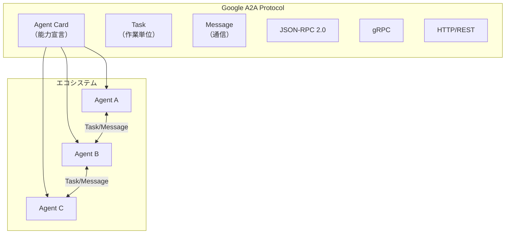
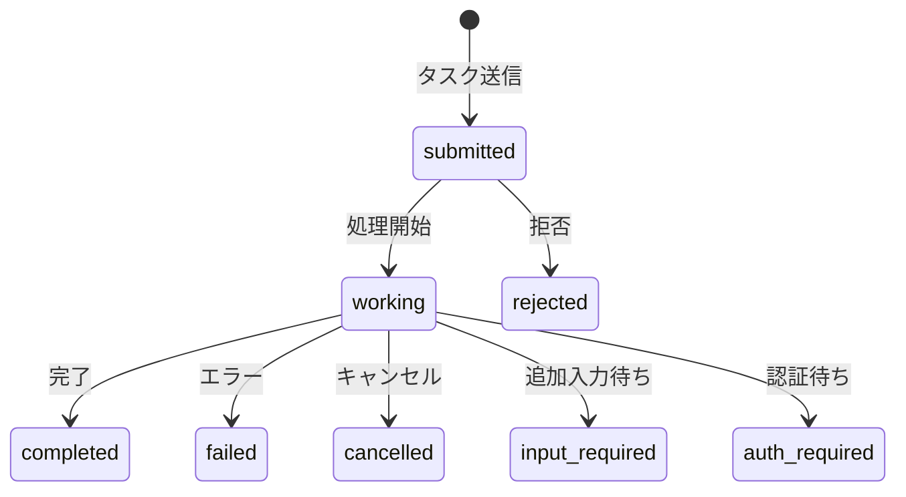
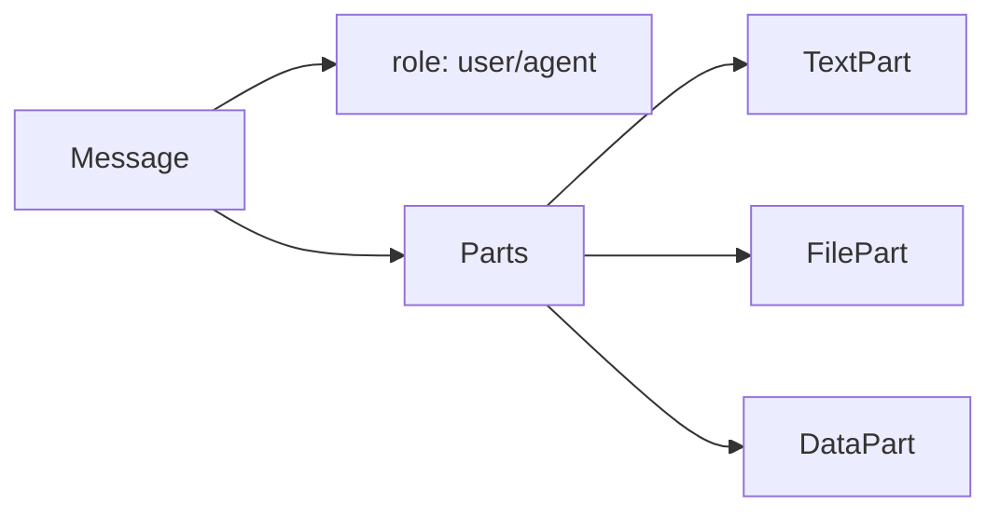
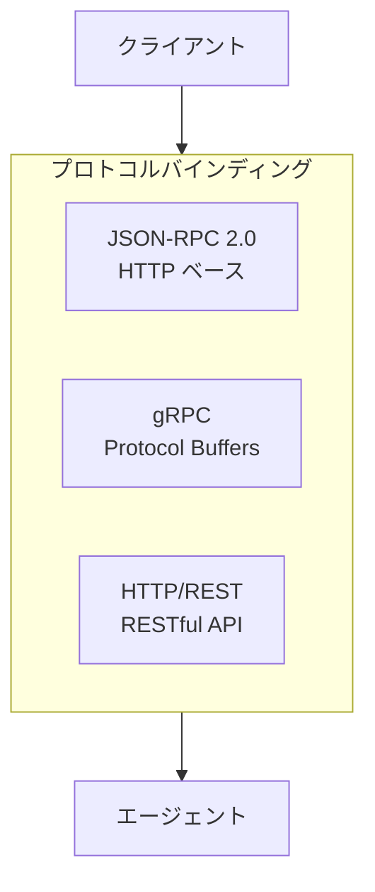
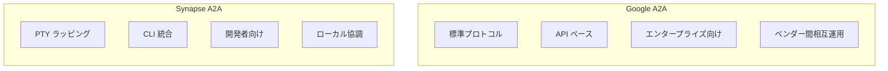
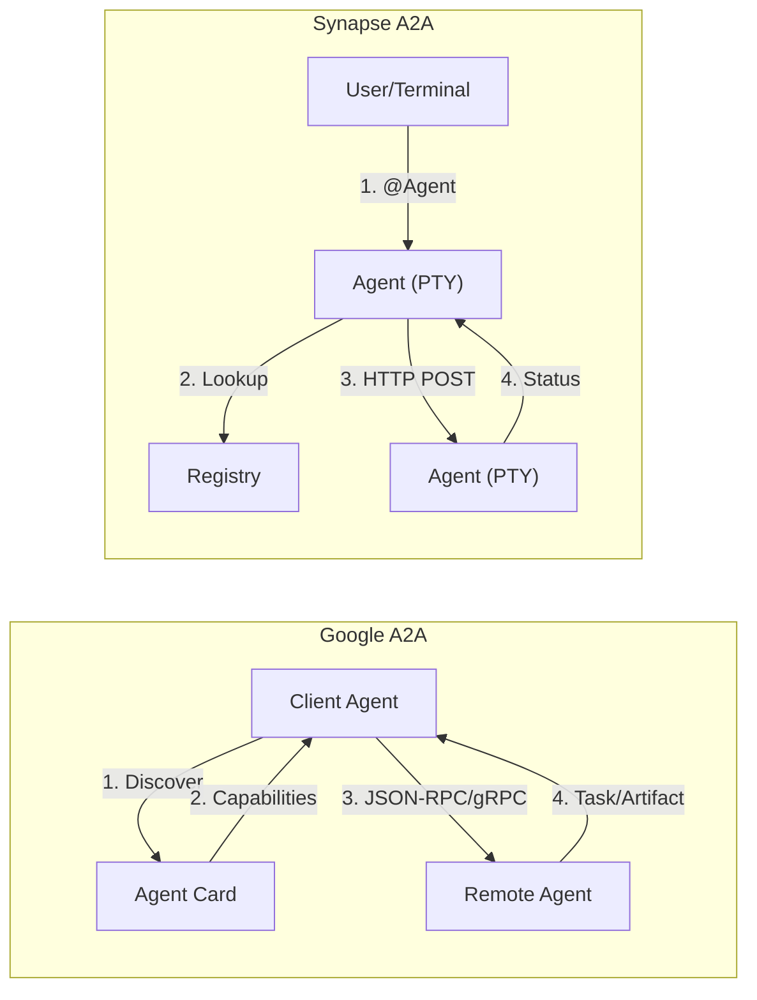
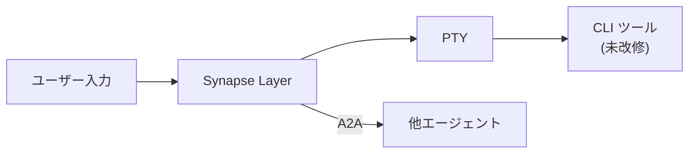
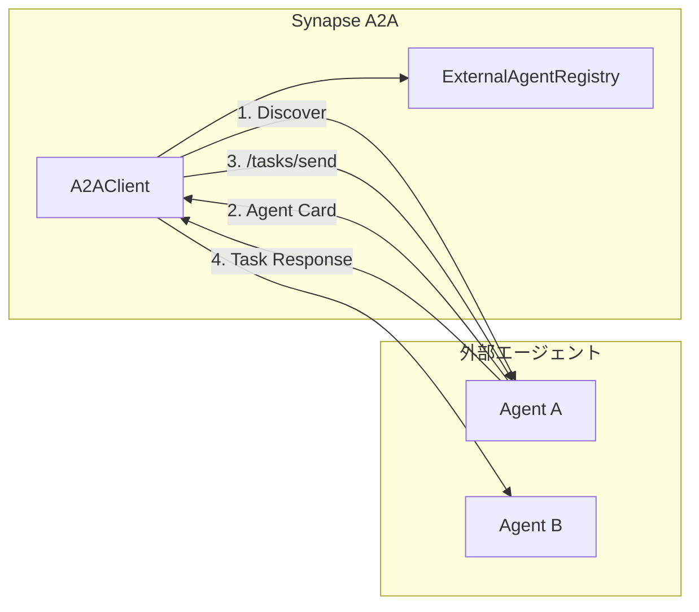
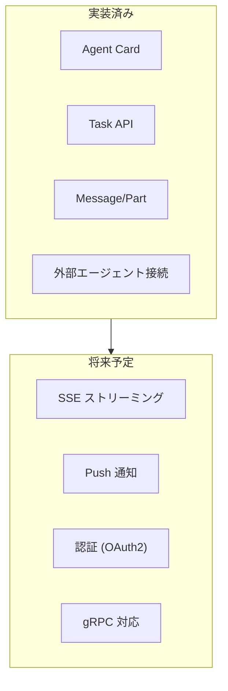
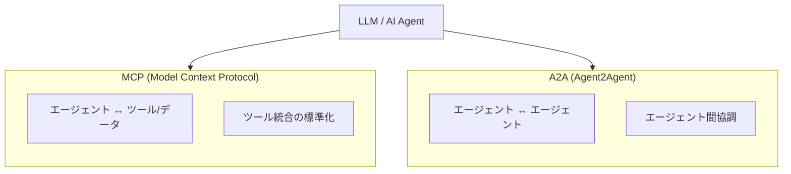

# Google A2A プロトコル互換性ガイド

このドキュメントでは、Google が 2025 年 4 月に発表した **Agent2Agent (A2A) プロトコル**の概要と、
Synapse A2A の互換性について解説します。

> **Synapse A2A は Google A2A プロトコルに完全準拠しています。**
> Agent Card、Task ベース API、Message/Part 構造をサポートし、
> `@Agent` 記法、CLI ツール、エージェント間通信すべてが Message/Part + Task 形式を使用します。
> 従来の `/message` エンドポイントは互換性維持のために提供されていますが、
> 内部で A2A Task を作成するラッパーとして動作します。

---

## 1. Google A2A プロトコルとは



**Google A2A (Agent2Agent)** は、2025 年 4 月に Google が発表したオープンプロトコルです。
異なるベンダーやフレームワークで構築された AI エージェント間の相互運用性を実現することを目的としています。

### 主な特徴

| 特徴 | 説明 |
|------|------|
| **オープン標準** | Apache 2.0 ライセンス、Linux Foundation 傘下 |
| **ベンダー中立** | 150+ 以上の組織が参加 |
| **複数プロトコル** | JSON-RPC 2.0, gRPC, HTTP/REST をサポート |
| **Agent Card** | エージェントの能力を宣言する標準フォーマット |
| **Task 管理** | タスクのライフサイクル管理 |

### 公式リソース

- **仕様**: https://a2a-protocol.org/latest/specification/
- **GitHub**: https://github.com/a2aproject/A2A
- **Google Blog**: https://developers.googleblog.com/en/a2a-a-new-era-of-agent-interoperability/

---

## 2. コアコンセプト

### 2.1 Agent Card

エージェントの能力やエンドポイントを宣言するメタデータです。

```json
{
  "name": "My Agent",
  "description": "An AI agent for code review",
  "url": "https://api.example.com/agent",
  "capabilities": {
    "streaming": true,
    "pushNotifications": true
  },
  "skills": [
    {
      "id": "code-review",
      "name": "Code Review",
      "description": "Reviews code for bugs and improvements"
    }
  ],
  "securitySchemes": {
    "oauth2": {
      "type": "oauth2",
      "flows": { ... }
    }
  }
}
```

### 2.2 Task

作業の単位を表します。ライフサイクル状態を持ちます。



| 状態 | 説明 |
|------|------|
| `submitted` | タスクが送信された |
| `working` | 処理中 |
| `completed` | 完了 |
| `failed` | エラーで終了 |
| `cancelled` | キャンセルされた |
| `input_required` | 追加入力が必要 |
| `auth_required` | 認証が必要 |
| `rejected` | 拒否された |

### 2.3 Message と Part



### 2.4 コンテキスト共有（Multiple Parts の活用）

エージェント間でコンテキスト情報を共有する場合、A2A 標準の **Multiple Parts** 機能を使用します。
独自拡張を追加せず、相互運用性を維持できます。

#### 基本パターン

```python
from synapse.a2a_client import A2AClient

client = A2AClient("http://target-agent:8100")

# コンテキスト付きメッセージの送信
response = await client.send_message_parts([
    # 1. メインの指示（TextPart）
    {
        "type": "text",
        "text": "このコードをレビューして"
    },
    # 2. コンテキスト情報（DataPart）
    {
        "type": "data",
        "data": {
            "conversation_id": "abc123",
            "previous_summary": "認証機能の設計を議論",
            "task_status": "design_complete",
            "related_files": ["auth.py", "config.py"]
        }
    },
    # 3. 関連ファイル（FilePart）
    {
        "type": "file",
        "file": {
            "name": "auth.py",
            "mimeType": "text/x-python",
            "bytes": "base64-encoded-content..."
        }
    }
])
```

#### Part タイプ一覧

| タイプ | 用途 | 例 |
|--------|------|-----|
| `TextPart` | テキストメッセージ | 指示、質問、回答 |
| `DataPart` | 構造化 JSON データ | メタデータ、コンテキスト、設定 |
| `FilePart` | バイナリ/テキストファイル | コード、画像、ログ |

#### ユースケース例

**1. コードレビュー依頼（設計意図付き）**

```json
{
  "message": {
    "role": "user",
    "parts": [
      {"type": "text", "text": "このPRをレビューして"},
      {"type": "data", "data": {
        "design_intent": "パフォーマンス改善のためキャッシュを導入",
        "focus_areas": ["thread-safety", "memory-usage"]
      }},
      {"type": "file", "file": {"name": "cache.py", "mimeType": "text/x-python", "bytes": "..."}}
    ]
  }
}
```

**2. パイプライン処理（前エージェントの出力を引き継ぎ）**

```json
{
  "message": {
    "role": "user",
    "parts": [
      {"type": "text", "text": "この設計を実装して"},
      {"type": "data", "data": {
        "previous_agent": "designer",
        "previous_task_id": "task-456",
        "handoff_context": "API設計が完了、実装フェーズへ"
      }},
      {"type": "file", "file": {"name": "api-spec.yaml", "mimeType": "application/yaml", "bytes": "..."}}
    ]
  }
}
```

**3. デバッグ支援（エラーログ付き）**

```json
{
  "message": {
    "role": "user",
    "parts": [
      {"type": "text", "text": "このエラーを調査して"},
      {"type": "data", "data": {
        "error_type": "NullPointerException",
        "environment": "production",
        "frequency": "intermittent"
      }},
      {"type": "file", "file": {"name": "error.log", "mimeType": "text/plain", "bytes": "..."}}
    ]
  }
}
```

> **重要**: Synapse 独自のメタデータ拡張（`task.metadata` への追加フィールド等）は A2A 互換性を損なうため、
> 常に標準の `DataPart` を使用してください。

---

## 3. 通信プロトコル

Google A2A は 3 つのプロトコルバインディングをサポートしています。

### 3.1 対応プロトコル



| プロトコル | 特徴 | 用途 |
|-----------|------|------|
| **JSON-RPC 2.0** | シンプル、HTTP ベース | 一般的な統合 |
| **gRPC** | 高性能、型安全 | 大規模システム |
| **HTTP/REST** | 標準的、理解しやすい | Web 統合 |

### 3.2 コア操作

| 操作 | 説明 |
|------|------|
| Send Message | メッセージ送信 |
| Send Streaming Message | ストリーミング送信 |
| Get Task | タスク状態取得 |
| List Tasks | タスク一覧取得 |
| Cancel Task | タスクキャンセル |
| Subscribe to Task | リアルタイム更新購読 |
| Push Notification | Webhook 通知設定 |

---

## 4. Synapse A2A との比較

### 4.1 設計思想の違い



### 4.2 機能比較表

| 機能 | Google A2A | Synapse A2A | 互換性 |
|------|-----------|-------------|--------|
| **主な目的** | エンタープライズ相互運用 | CLI エージェント統合 | - |
| **通信方式** | JSON-RPC / gRPC / REST | HTTP REST | ✅ REST 対応 |
| **Agent 検出** | Agent Card (JSON) | Registry + Agent Card | ✅ 対応 |
| **状態管理** | Task ライフサイクル | Task + IDLE/BUSY マッピング | ✅ 対応 |
| **Message/Part** | 標準構造 | 標準構造 | ✅ 対応 |
| **認証** | OAuth2, API Key 等 | なし（ローカル前提） | ❌ 未対応 |
| **ストリーミング** | SSE, WebSocket | ポーリング | ❌ 未対応 |
| **Push 通知** | Webhook | なし | ❌ 未対応 |
| **CLI 統合** | なし | @Agent 記法 | 独自拡張 |
| **PTY サポート** | なし | あり（コア機能） | 独自拡張 |
| **TUI 対応** | なし | あり | 独自拡張 |

### 4.3 アーキテクチャ比較



### 4.4 ユースケースの違い

| ユースケース | Google A2A | Synapse A2A |
|------------|-----------|-------------|
| クラウド間エージェント連携 | ✅ 最適 | ❌ 未対応 |
| ローカル CLI 協調 | ❌ 未対応 | ✅ 最適 |
| 既存 CLI ツールの統合 | ❌ 要改修 | ✅ 改修不要 |
| マルチベンダー相互運用 | ✅ 最適 | ❌ 未対応 |
| 人間との協調作業 | ⚠️ 限定的 | ✅ 最適 |
| TUI アプリケーション | ❌ 未対応 | ✅ 対応 |

---

## 5. Synapse A2A の独自機能

### 5.1 PTY ラッピング

既存の CLI ツールを改修せずに A2A 通信を追加できます。



### 5.2 @Agent 記法

端末内で自然に他エージェントへ指示できます。

```text
@codex この関数をリファクタリングして
@claude "コードレビューして"
```

### 5.3 Priority によるインタラプト

緊急時に処理を中断させることができます。

```bash
# SIGINT を送ってからメッセージを書き込み
synapse send --target claude --priority 5 "今すぐ止まれ"
```

---

## 6. 実装済み互換機能

### 6.1 Agent Card

エージェント起動時に `/.well-known/agent.json` で Agent Card を公開します。

```bash
curl http://localhost:8100/.well-known/agent.json
```

```json
{
  "name": "Synapse Claude",
  "description": "PTY-wrapped claude CLI agent with A2A communication",
  "url": "http://localhost:8100",
  "version": "1.0.0",
  "capabilities": {
    "streaming": false,
    "pushNotifications": false,
    "multiTurn": true
  },
  "skills": [
    {"id": "chat", "name": "Chat", "description": "Send messages to the CLI agent"},
    {"id": "interrupt", "name": "Interrupt", "description": "Interrupt current processing"}
  ],
  "extensions": {
    "synapse": {
      "pty_wrapped": true,
      "priority_interrupt": true,
      "at_agent_syntax": true
    }
  }
}
```

### 6.2 Task ベース API

Google A2A 互換の Task API を提供します。

```bash
# メッセージ送信（Task 作成）
curl -X POST http://localhost:8100/tasks/send \
  -H "Content-Type: application/json" \
  -d '{
    "message": {
      "role": "user",
      "parts": [{"type": "text", "text": "Hello!"}]
    }
  }'

# レスポンス
{
  "task": {
    "id": "uuid-...",
    "status": "working",
    "message": {...},
    "artifacts": [],
    "created_at": "2025-01-01T00:00:00Z",
    "updated_at": "2025-01-01T00:00:00Z"
  }
}
```

### 6.3 Task 状態の取得

```bash
curl http://localhost:8100/tasks/{task_id}
```

**状態マッピング:**

| Synapse 状態 | Google A2A 状態 |
|-------------|----------------|
| STARTING | submitted |
| BUSY | working |
| IDLE | completed |

### 6.4 Synapse 拡張: Priority 付き送信

```bash
# Priority 5 で緊急割り込み
curl -X POST "http://localhost:8100/tasks/send-priority?priority=5" \
  -H "Content-Type: application/json" \
  -d '{
    "message": {
      "role": "user",
      "parts": [{"type": "text", "text": "Stop!"}]
    }
  }'
```

---

## 7. API エンドポイント一覧

### 7.1 Google A2A 互換

| メソッド | パス | 説明 |
|---------|------|------|
| GET | `/.well-known/agent.json` | Agent Card |
| POST | `/tasks/send` | メッセージ送信（Task 作成） |
| GET | `/tasks/{id}` | Task 状態取得 |
| GET | `/tasks` | Task 一覧 |
| POST | `/tasks/{id}/cancel` | Task キャンセル |

### 7.2 Synapse 拡張

| メソッド | パス | 説明 |
|---------|------|------|
| POST | `/tasks/send-priority` | Priority 付き送信 |
| POST | `/message` | 従来 API（互換性維持） |
| GET | `/status` | 従来 API（互換性維持） |

---

## 8. 外部エージェントへの接続

Synapse A2A は Google A2A 互換エージェントに**クライアントとして接続**することもできます。

### 8.1 アーキテクチャ



### 8.2 外部エージェントの登録

```bash
# CLI で登録
synapse external add http://external-agent:9000 --alias myagent

# HTTP API で登録
curl -X POST http://localhost:8100/external/discover \
  -H "Content-Type: application/json" \
  -d '{"url": "http://external-agent:9000", "alias": "myagent"}'
```

### 8.3 @Agent 記法での利用

```text
# 外部エージェントにメッセージ送信
@myagent タスクを処理して

# レスポンスを待つ
@myagent "結果を教えて"
```

### 8.4 外部エージェント管理 API

| メソッド | パス | 説明 |
|---------|------|------|
| POST | `/external/discover` | エージェントを発見・登録 |
| GET | `/external/agents` | 登録済みエージェント一覧 |
| GET | `/external/agents/{alias}` | エージェント詳細 |
| DELETE | `/external/agents/{alias}` | エージェント削除 |
| POST | `/external/agents/{alias}/send` | メッセージ送信 |

### 8.5 Registry の保存先

外部エージェント情報は `~/.a2a/external/<alias>.json` に永続化されます。

```json
{
  "name": "External Agent",
  "url": "http://external-agent:9000",
  "description": "An external A2A agent",
  "capabilities": {"streaming": false, "multiTurn": true},
  "skills": [{"id": "chat", "name": "Chat"}],
  "added_at": "2025-01-15T10:00:00Z",
  "last_seen": "2025-01-15T10:30:00Z",
  "alias": "myagent"
}
```

---

## 9. 将来の拡張予定



### 9.1 検討事項

| 項目 | 優先度 | 説明 |
|------|--------|------|
| SSE ストリーミング | 中 | リアルタイム出力 |
| Push 通知 | 低 | Webhook コールバック |
| 認証 | 低 | OAuth2 / API Key |
| gRPC | 低 | 高性能通信 |

---

## 10. MCP との関係

Google は A2A プロトコルと **MCP (Model Context Protocol)** は補完関係にあると説明しています。



| プロトコル | 焦点 |
|-----------|------|
| **MCP** | エージェントとツール/データの接続 |
| **A2A** | エージェント同士の協調 |

---

## 11. まとめ

### 11.1 選択の指針

| 要件 | 推奨 |
|------|------|
| CLI ツールを統合したい | **Synapse A2A** |
| クラウド間でエージェント連携 | **Google A2A** |
| 既存ツールを改修せずに使いたい | **Synapse A2A** |
| 標準プロトコルに準拠したい | **Google A2A** |
| ローカル開発で協調させたい | **Synapse A2A** |
| エンタープライズ規模の展開 | **Google A2A** |

### 11.2 共存の可能性

Synapse A2A と Google A2A は異なるユースケースを対象としているため、共存が可能です。

- **ローカル開発**: Synapse A2A で CLI エージェントを協調
- **デプロイ**: Google A2A で本番エージェントを連携

---

## 関連リンク

- [Google A2A 公式仕様](https://a2a-protocol.org/latest/specification/)
- [Google A2A GitHub](https://github.com/a2aproject/A2A)
- [Google Developers Blog - A2A Announcement](https://developers.googleblog.com/en/a2a-a-new-era-of-agent-interoperability/)
- [IBM - What is A2A Protocol](https://www.ibm.com/think/topics/agent2agent-protocol)

---

## 関連ドキュメント

- [architecture.md](architecture.md) - Synapse A2A の内部アーキテクチャ
- [references.md](references.md) - API/CLI リファレンス
