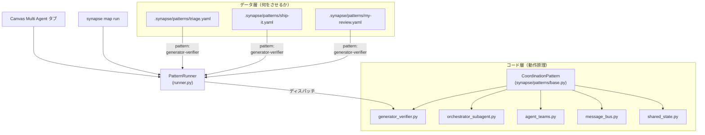

# Multi-Agent Coordination Patterns ガイド

このガイドでは、`synapse multiagent`（別名 `synapse map`）で使える
**マルチエージェント協調パターン**の考え方と使い方を丁寧にまとめます。

> このガイドを読めば、Python を書かずに YAML だけで 5 種類のパターンを
> 運用できるようになり、必要になったときは独自パターン型を追加する手順まで
> 辿れるようになります。

---

## 1. 全体像

Synapse のマルチエージェントパターンは **2 層構造**です:



- **コード層（Python）** — 各パターン型は 1 つの Python クラスで、
  「どう協調動作させるか」というアルゴリズムを実装しています。
- **データ層（YAML）** — ユーザーが書くのは YAML だけ。
  `pattern:` フィールドでどのクラスを使うかを指定し、
  そのクラスに渡すパラメータを宣言的に記述します。

この分離により、**日常運用では Python に触れず**、
必要になった時だけコード層を拡張できます。

---

## 2. 型 vs インスタンス

「パターンを増やす」には 2 種類あります:

| 種類 | 何を追加するか | Python | 具体例 |
|---|---|---|---|
| **A. インスタンスを増やす** | 既存型を流用した YAML | 不要 | `generator-verifier` 型で `code-review.yaml`, `doc-review.yaml`, `security-audit.yaml` を量産 |
| **B. 型を増やす** | 新しい協調アルゴリズム | 必須 | 投票・トーナメント・リーダー選挙など既存 5 種で表現できないもの |

ほとんどのユースケースは **A** で足ります。迷ったらまず
既存 5 種で表現できないかを検討してください。

---

## 3. 5 つの組み込みパターン

| 型 | 本質 | いつ使うか |
|---|---|---|
| `generator-verifier` | 逐次ループ（生成 → 検査 → 差し戻し） | レビュー型タスク、コード生成 + テスト、ドラフト + 校正 |
| `orchestrator-subagent` | 親が子を spawn し、分割配布 → 結果統合 | 研究対象を複数の観点に分解して最後に 1 本にまとめたい時 |
| `agent-teams` | ワーカープールがキューを並列消化 | 独立した項目の並列処理（翻訳、分類、フォーマット変換） |
| `message-bus` | ルーター 1 つ + トピックごとの fan-out | 入力を先に分類・整形してから複数の専門家に配る時 |
| `shared-state` | 共有ストア（wiki）を介した協調 | 複数エージェントが知見を寄せ合い、最後に集約する時 |

各パターンの詳細と YAML スキーマは §5〜§9 を参照してください。

---

## 4. CLI ワークフロー

### 4.1 クイックスタート

```bash
# 1. 組み込みテンプレートから YAML を生成
synapse map init generator-verifier --name my-review

# 2. 生成された YAML を編集（エディタで .synapse/patterns/my-review.yaml を開く）

# 3. 一覧と詳細を確認
synapse map list
synapse map show my-review

# 4. 実行プランをプレビュー（エージェントは spawn されない）
synapse map run my-review --task "Review the auth module" --dry-run

# 5. 本番実行
synapse map run my-review --task "Review the auth module"

# 6. バックグラウンド実行したい場合
synapse map run my-review --task "..." --async
synapse map status <run_id>
synapse map stop <run_id>
```

`synapse multiagent` `synapse map` `synapse ma` の 3 つのエイリアスはすべて同じです。

### 4.2 スコープ（保存場所）

| スコープ | ディレクトリ | 用途 |
|---|---|---|
| `--project`（既定） | `.synapse/patterns/` | リポジトリ単位。git で共有可能 |
| `--user` | `~/.synapse/patterns/` | ユーザー単位。全プロジェクトで再利用 |

Canvas の **Multi Agent** タブと `GET /api/multiagent` は
両方のスコープを同時に読み込みます。

### 4.3 `--dry-run` と `show` の違い

- `synapse map show <name>` — **設定**を YAML 形式でそのまま表示
- `synapse map run <name> --task "..." --dry-run` — **実行計画**を
  人間向けに要約して表示（spawn されるエージェント、送信されるメッセージ、
  iteration や termination の条件などを列挙）

本番実行前には必ず `--dry-run` で計画を確認することをおすすめします。

---

## 5. generator-verifier

1 つのエージェントが生成役、もう 1 つが検証役になり、
検証役が `PASS` を返すまで最大 N 回ループします。

```yaml
name: code-review
pattern: generator-verifier
description: Generate a change and verify it against review criteria

generator:
  profile: claude
  name: Generator
  worktree: true            # 生成役は分離 worktree で作業

verifier:
  profile: claude
  name: Verifier
  criteria:                 # テキストのみ。コマンドは実行されない
    - "All new functions have docstrings"
    - "No new `eval` or `exec` calls"
    - "Public API signatures are unchanged"

max_iterations: 3           # このラウンド数を超えると終了
on_failure: escalate        # escalate=status:failed を返す / accept=最後の出力を受け入れる
```

| フィールド | 型 | 説明 |
|---|---|---|
| `generator.profile` | str | 生成役のプロファイル名（`claude`, `codex` など） |
| `generator.worktree` | bool | 生成役を独立した git worktree で起動するか |
| `verifier.criteria` | list[dict] | 検証役に **テキストとして渡す**基準。v1 はコマンド実行しない |
| `max_iterations` | int | 生成 → 検証ループの最大回数（既定 1） |
| `on_failure` | str | `escalate`（既定）または `accept` |

**v1 の制約**: criteria の `command` 等のキーはあくまで文字列として
検証役に渡されるだけで、実行はされません。検証役のプロンプトが
自然言語で基準を解釈し `PASS` or 修正点を返します。

サンプル: [`examples/patterns/code-review.yaml`](../examples/patterns/code-review.yaml)

---

## 6. orchestrator-subagent

オーケストレータ 1 体 + 名前付き subtask ごとの subagent を spawn し、
subagent の出力を最後にオーケストレータが統合します。

```yaml
name: research-synthesis
pattern: orchestrator-subagent
description: Decompose research into aspects, delegate, and synthesize

orchestrator:
  profile: claude
  name: Lead

subtasks:
  - name: security
    message: "Focus on security trade-offs, known CVEs, and threat models."
  - name: interoperability
    message: "Focus on client/library support across popular ecosystems."
  - name: operations
    message: "Focus on token lifecycle, key rotation, and monitoring."

parallel: true              # false にすると subtask を逐次実行
```

| フィールド | 型 | 説明 |
|---|---|---|
| `orchestrator.profile` | str | 最終統合を担当する lead エージェント |
| `subtasks[].name` | str | subagent の識別名（fan-out プロンプトに埋め込まれる） |
| `subtasks[].message` | str | subagent に渡す個別タスク文 |
| `parallel` | bool | `true`: 並列実行 / `false`: 逐次実行 |

サンプル: [`examples/patterns/research-synthesis.yaml`](../examples/patterns/research-synthesis.yaml)

---

## 7. agent-teams

ワーカープールを spawn し、インラインタスクキューを並列に消化します。

```yaml
name: batch-translate
pattern: agent-teams
description: Translate a batch of short texts across a worker pool

team:
  count: 3                  # ワーカー数
  profile: claude
  name: Translator          # Translator-1, Translator-2, ... と命名される
  worktree: false

task_queue:
  source: inline            # v1 は inline のみ対応
  tasks:
    - "Welcome to the dashboard."
    - "Your session has expired. Please sign in again."
    - "Settings saved successfully."

completion:
  mode: all-done            # all-done: 全消化を待つ / time-budget: timeout で打ち切り
  timeout: 1800
```

| フィールド | 型 | 説明 |
|---|---|---|
| `team.count` | int | ワーカー数 |
| `task_queue.source` | str | 現状 `inline` のみ。その他は `PatternError` |
| `task_queue.tasks` | list[str] | キュー項目 |
| `completion.mode` | str | `all-done` または `time-budget` |
| `completion.timeout` | float | 秒。`time-budget` のときの打ち切り時間 |

**v1 の制約**: キューソースは `inline` 固定。
ファイル読み込みや外部キューは今後拡張予定。

サンプル: [`examples/patterns/batch-translate.yaml`](../examples/patterns/batch-translate.yaml)

---

## 8. message-bus

ルーター 1 体にタスクを投げ、その出力を複数のトピック subscriber に
fan-out します。**永続ブローカーではなく、単発 fan-out** です。

```yaml
name: triage-fanout
pattern: message-bus
description: Classify an incoming issue and fan out to specialist handlers

router:
  profile: claude
  name: Triage

topics:
  - name: engineering
    subscribers:
      - profile: claude
        name: Backend-Specialist
      - profile: claude
        name: Frontend-Specialist
  - name: support
    subscribers:
      - profile: claude
        name: Customer-Reply-Drafter
```

| フィールド | 型 | 説明 |
|---|---|---|
| `router.profile` | str | 最初にタスクを受け取り分類するエージェント |
| `topics[].name` | str | トピック名（fan-out メッセージに含まれる） |
| `topics[].subscribers` | list | そのトピックを処理するエージェントのリスト |

**v1 の制約**: ルーターは 1 回だけ呼ばれ、各トピックは 1 回だけ fan-out
されます。継続的な pub/sub ではありません。

サンプル: [`examples/patterns/triage-fanout.yaml`](../examples/patterns/triage-fanout.yaml)

---

## 9. shared-state

複数エージェントがプロジェクト wiki に知見を書き込み、
最後に `synapse wiki query` で集約します。

```yaml
name: parallel-research
pattern: shared-state
description: Agents research aspects in parallel and collaborate through the wiki

agents:
  - profile: claude
    name: Reviewer-Tools
    role: "Survey of commercial and open-source agentic IDE tooling"
  - profile: claude
    name: Reviewer-UX
    role: "User experience patterns and workflow ergonomics"
  - profile: claude
    name: Reviewer-Risks
    role: "Failure modes, safety, and cost considerations"

shared_store: wiki          # v1 は wiki のみ対応

termination:
  mode: time-budget         # time-budget: budget 秒で打ち切り / all-done: 全員完了を待つ
  budget: 900
```

| フィールド | 型 | 説明 |
|---|---|---|
| `agents[].role` | str | エージェントに渡す役割記述 |
| `shared_store` | str | 現状 `wiki` 固定。その他は `PatternError` |
| `termination.mode` | str | `time-budget` または `all-done` |
| `termination.budget` | float | 秒。`time-budget` 時の制限時間 |

各エージェントは `<run_id>-<agent_name>` というキーで wiki に書き込み、
最後にタスク文をクエリとして `synapse wiki query` した結果が返ります。

**v1 の制約**: `shared_store` は wiki 固定。他のバックエンド（Redis、
S3 など）は未対応。

サンプル: [`examples/patterns/parallel-research.yaml`](../examples/patterns/parallel-research.yaml)

---

## 10. Canvas 連携

Canvas の **Multi Agent** タブは、プロジェクト / ユーザーの両スコープを
同時に読み込んで表示します:

- **左ペイン** — パターン一覧（名前・型・説明・スコープ）
- **右ペイン** — 選択したパターンの mermaid 図と生 YAML
- API — `GET /api/multiagent` が同じデータを JSON で返す

CLI で `synapse map init` した直後にタブを開き直すと、
そのまま一覧に現れます。逆に、Canvas タブが空の場合はまず
`synapse map list` を実行してみてください。

---

## 11. 新しいパターン型を追加する

既存 5 種で表現できない協調アルゴリズムが必要になったら、
Python で新しいパターン型を追加できます。

### 11.1 組み込みパターンとして追加する場合

1. `synapse/patterns/my_pattern.py` を作成
2. `CoordinationPattern` を継承したクラスを書き、`@register_pattern` で登録
3. `PatternConfig` を継承した dataclass を書き、`from_dict` を実装
4. `async def run(self, task, config) -> TaskResult` を実装
5. `def describe_plan(self, task, config) -> list[str]` を実装（dry-run 対応）
6. `tests/test_pattern_my_pattern.py` にテスト追加

```python
from dataclasses import dataclass
from typing import cast

from synapse.patterns import register_pattern
from synapse.patterns.base import CoordinationPattern, PatternConfig, TaskResult


@dataclass
class MyPatternConfig(PatternConfig):
    voters: int = 3

    @classmethod
    def from_dict(cls, data: dict) -> "MyPatternConfig":
        return cls(
            name=str(data.get("name", "")),
            pattern=str(data.get("pattern", "")),
            description=str(data.get("description", "")),
            voters=int(data.get("voters", 3)),
        )


@register_pattern
class MyPattern(CoordinationPattern):
    name = "my-pattern"
    description = "Majority-vote coordination"
    config_class = MyPatternConfig

    async def run(self, task: str, config: PatternConfig) -> TaskResult:
        config = cast(MyPatternConfig, config)
        # ... spawn / send / aggregate ...
        return TaskResult(status="completed", output="...")

    def describe_plan(self, task: str, config: PatternConfig) -> list[str]:
        config = cast(MyPatternConfig, config)
        return [
            f"Task: {task}",
            f"Spawn {config.voters} voter(s)",
            "Collect all votes and return the majority",
        ]
```

### 11.2 プロジェクト単位のカスタムパターン

ソースツリーを触らずにカスタムパターン型を使いたい場合は、
`.synapse/patterns/<pattern_type>.py` にファイルを置きます。
`PatternRunner` が動的に読み込みます:

- `PATTERN_CLASS = MyPattern` を明示的に露出するか、
- モジュール内の唯一の `CoordinationPattern` サブクラスを自動検出

カスタム Python ファイルはリポジトリにチェックインして構いません。

---

## 12. トラブルシューティング

### パターン一覧が空（No saved patterns）

`.synapse/patterns/` と `~/.synapse/patterns/` の両方にファイルが無い状態です。
`synapse map init <type> --name <n>` でテンプレを生成するか、
[`examples/patterns/`](../examples/patterns/) からコピーしてください。

### `synapse map list` では見えるのに Canvas に出ない

Canvas タブを開き直すか、Canvas サーバを再起動してください。
`synapse/canvas/routes/multiagent.py` が `PatternStore.list_patterns()` を
呼ぶので、一覧が出ているなら API も同じ結果を返しています。

### `Pattern name ... does not match filename` の警告

`PatternStore._parse_file` は **ファイル名を優先**します。
YAML 内の `name:` フィールドとファイル名（拡張子なし）を一致させてください。

### `Unknown pattern type: X` エラー

YAML の `pattern:` フィールドが 5 つの組み込み型
（`generator-verifier`, `orchestrator-subagent`, `agent-teams`,
`message-bus`, `shared-state`）のいずれとも一致せず、
カスタムパターンファイルも見つからない状態です。

### `shared-state v1 only supports shared_store='wiki'` エラー

v1 の制約です。`shared_store: wiki` に戻してください。

### `agent-teams v1 only supports task_queue.source='inline'` エラー

v1 の制約です。`task_queue.source: inline` に戻してください。

---

## 13. 関連ドキュメント

- [references.md](references.md) — CLI コマンドとコードパスの横断リファレンス
- [usage.md](usage.md) — 通常の `synapse send` / `@Agent` ベース連携の使い方
- [multi-agent-setup.md](multi-agent-setup.md) — エージェントを起動する前段のセットアップ

実装コード（参考）:

- `synapse/patterns/base.py` — 抽象基底クラスと共通ヘルパー
- `synapse/patterns/runner.py` — `run_pattern` / `describe_plan` のディスパッチ
- `synapse/patterns/store.py` — YAML の読み書きとスコープ解決
- `synapse/commands/multiagent.py` — CLI ハンドラ
- `synapse/canvas/routes/multiagent.py` — Canvas API ルート
