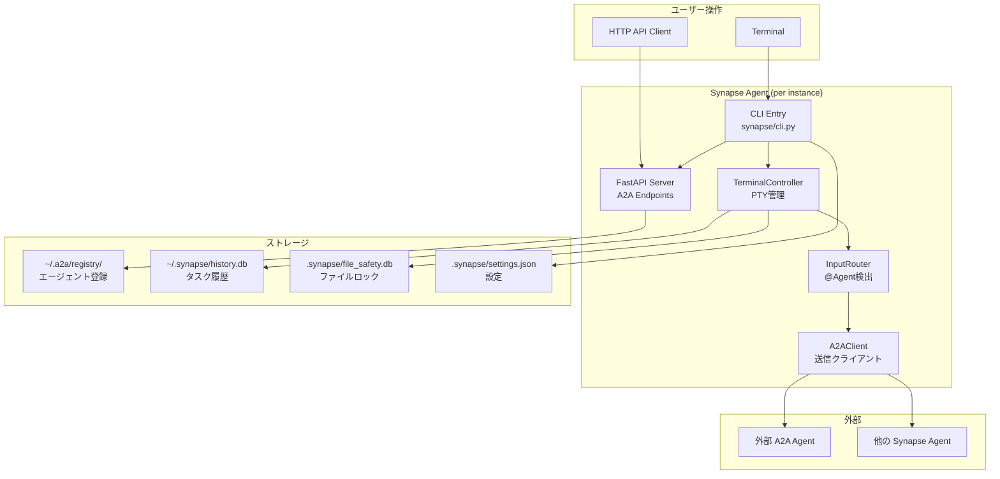
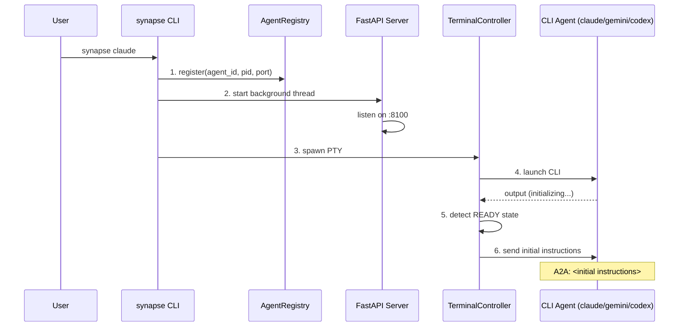
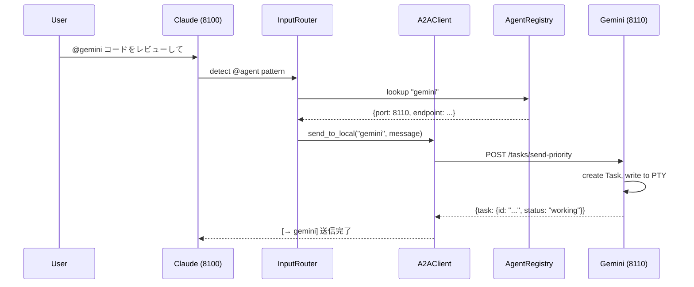
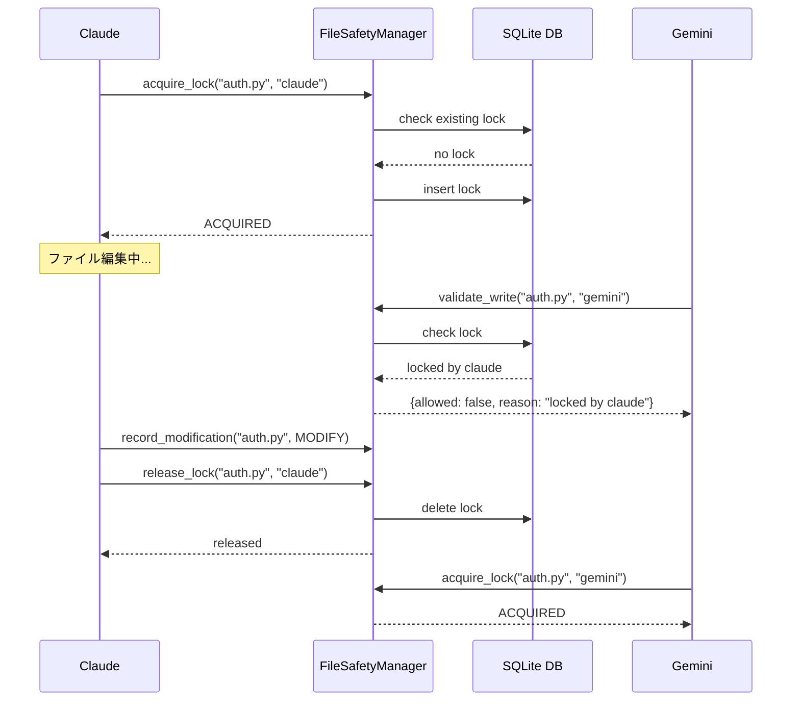

# Synapse A2A 全体概要

このドキュメントは、Synapse A2A の全体像を把握するための仕様概要書です。

---

## 目次

- [コンセプト](#コンセプト)
- [システム構成](#システム構成)
- [主要機能](#主要機能)
- [データフロー](#データフロー)
- [ストレージとデータベース](#ストレージとデータベース)
- [設定体系](#設定体系)
- [エージェント間通信](#エージェント間通信)
- [安全機能](#安全機能)
- [CLI コマンド体系](#cli-コマンド体系)
- [API エンドポイント](#api-エンドポイント)

---

## コンセプト

### Synapse A2A とは

Synapse A2A は、**複数の AI CLI エージェント（Claude Code、Codex、Gemini CLI）を PTY でラップし、Google A2A プロトコルで相互通信を可能にするフレームワーク**です。

```
┌─────────────────────────────────────────────────────────────────┐
│                        Synapse A2A                              │
│                                                                 │
│  ┌──────────────┐   ┌──────────────┐   ┌──────────────┐        │
│  │ synapse      │   │ synapse      │   │ synapse      │        │
│  │ claude :8100 │◄─►│ gemini :8110 │◄─►│ codex :8120  │        │
│  │              │   │              │   │              │        │
│  │ ┌──────────┐ │   │ ┌──────────┐ │   │ ┌──────────┐ │        │
│  │ │A2A Server│ │   │ │A2A Server│ │   │ │A2A Server│ │        │
│  │ └──────────┘ │   │ └──────────┘ │   │ └──────────┘ │        │
│  │ ┌──────────┐ │   │ ┌──────────┐ │   │ ┌──────────┐ │        │
│  │ │PTY+CLI   │ │   │ │PTY+CLI   │ │   │ │PTY+CLI   │ │        │
│  │ └──────────┘ │   │ └──────────┘ │   │ └──────────┘ │        │
│  └──────────────┘   └──────────────┘   └──────────────┘        │
│           ▲                 ▲                 ▲                 │
│           │    A2A Protocol │                 │                 │
│           ▼                 ▼                 ▼                 │
│  ┌──────────────────────────────────────────────────────┐      │
│  │              File-based Registry                      │      │
│  │              ~/.a2a/registry/                         │      │
│  └──────────────────────────────────────────────────────┘      │
└─────────────────────────────────────────────────────────────────┘
```

### 設計原則

| 原則 | 説明 |
|------|------|
| **A2A Protocol First** | すべての通信は Google A2A プロトコル準拠（Message/Part + Task 形式） |
| **P2P アーキテクチャ** | 中央サーバーなし、各エージェントが対等なサーバーとして動作 |
| **PTY ラッパー** | 既存の CLI ツールを改造せずにA2Aエージェント化 |
| **ファイルベース検出** | 軽量なエージェント検出メカニズム |

---

## システム構成

### アーキテクチャ概要



### コンポーネント一覧

| コンポーネント | ファイル | 役割 |
|--------------|----------|------|
| CLI Entry | `synapse/cli.py` | エントリーポイント、コマンド処理 |
| TerminalController | `synapse/controller.py` | PTY管理、READY/PROCESSING検出 |
| FastAPI Server | `synapse/server.py` | HTTP API、A2Aエンドポイント |
| A2A Router | `synapse/a2a_compat.py` | A2Aプロトコル実装 |
| A2A Client | `synapse/a2a_client.py` | 他エージェントへの送信 |
| InputRouter | `synapse/input_router.py` | @Agentパターン検出・ルーティング |
| AgentRegistry | `synapse/registry.py` | エージェント登録・検索 |
| FileSafetyManager | `synapse/file_safety.py` | ファイルロック・変更追跡 |
| HistoryManager | `synapse/history.py` | タスク履歴管理 |
| Settings | `synapse/settings.py` | 設定読み込み・マージ |

---

## 主要機能

### 機能マトリクス

| カテゴリ | 機能 | 説明 | 有効化 |
|---------|------|------|--------|
| **通信** | synapse send | `synapse send <agent> "<message>" --from <sender>` で送信 | 常時 |
| | @Agent記法 | `@gemini メッセージ` でユーザー入力から直接送信 | 常時 |
| | A2A Flow設定 | roundtrip/oneway/auto で通信方式を制御 | `settings.json` |
| | Priority Interrupt | Priority 5 で SIGINT 送信（緊急停止） | 常時 |
| | 外部エージェント連携 | 他の A2A エージェントと通信 | 常時 |
| **委任** | 自動委任 | delegate.md に基づくタスク自動振り分け | `delegation.enabled: true` |
| **履歴** | タスク履歴 | 過去の実行結果を保存・検索 | `SYNAPSE_HISTORY_ENABLED=true` |
| **安全** | ファイルロック | 排他制御で競合防止 | `SYNAPSE_FILE_SAFETY_ENABLED=true` |
| | 変更追跡 | 誰が何を変更したか記録 | 同上 |
| **認証** | API Key 認証 | HTTP API のアクセス制御 | `SYNAPSE_AUTH_ENABLED=true` |
| | Webhook 通知 | タスク完了時に外部通知 | Webhook 登録時 |

---

## データフロー

### 起動シーケンス



### @Agent メッセージ送信フロー



### ファイルロック・変更追跡フロー



---

## ストレージとデータベース

### ストレージ一覧

| パス | 種類 | 説明 | スコープ |
|------|------|------|----------|
| `~/.a2a/registry/` | ファイル群 | 実行中エージェント情報 | グローバル |
| `~/.a2a/external/` | ファイル群 | 外部エージェント登録 | グローバル |
| `~/.synapse/settings.json` | JSON | ユーザー設定 | ユーザー |
| `~/.synapse/logs/` | ログファイル | ログ出力 | ユーザー |
| `~/.synapse/history.db` | SQLite | タスク履歴 | ユーザー |
| `.synapse/settings.json` | JSON | プロジェクト設定 | プロジェクト |
| `.synapse/settings.local.json` | JSON | ローカル設定（gitignore推奨） | プロジェクト |
| `.synapse/file_safety.db` | SQLite | ファイルロック・変更追跡 | プロジェクト |
| `.synapse/*.md` | Markdown | エージェント指示ファイル | プロジェクト |

### データベーススキーマ

#### history.db

```sql
-- tasks テーブル
CREATE TABLE tasks (
    id TEXT PRIMARY KEY,
    agent_name TEXT NOT NULL,
    input TEXT,
    output TEXT,
    status TEXT,
    metadata TEXT,  -- JSON
    created_at DATETIME,
    updated_at DATETIME
);
```

#### file_safety.db

```sql
-- file_locks テーブル
CREATE TABLE file_locks (
    id INTEGER PRIMARY KEY,
    file_path TEXT UNIQUE NOT NULL,
    agent_name TEXT NOT NULL,
    task_id TEXT,
    locked_at DATETIME,
    expires_at DATETIME NOT NULL,
    intent TEXT
);

-- file_modifications テーブル
CREATE TABLE file_modifications (
    id INTEGER PRIMARY KEY,
    task_id TEXT NOT NULL,
    agent_name TEXT NOT NULL,
    file_path TEXT NOT NULL,
    change_type TEXT NOT NULL,  -- CREATE/MODIFY/DELETE
    affected_lines TEXT,
    intent TEXT,
    timestamp DATETIME,
    metadata TEXT  -- JSON
);
```

---

## 設定体系

### 設定ファイルの優先順位

```
高 ← Local (.synapse/settings.local.json)
     Project (.synapse/settings.json)
低 ← User (~/.synapse/settings.json)
     Default (コード内定義)
```

### settings.json 構造

```json
{
  "env": {
    "SYNAPSE_HISTORY_ENABLED": "true",
    "SYNAPSE_FILE_SAFETY_ENABLED": "false",
    "SYNAPSE_FILE_SAFETY_DB_PATH": ".synapse/file_safety.db",
    "SYNAPSE_FILE_SAFETY_RETENTION_DAYS": "30",
    "SYNAPSE_AUTH_ENABLED": "false",
    "SYNAPSE_API_KEYS": "",
    "SYNAPSE_ADMIN_KEY": "",
    "SYNAPSE_ALLOW_LOCALHOST": "true"
  },
  "instructions": {
    "default": "default.md",
    "claude": "",
    "gemini": "gemini.md",
    "codex": ""
  },
  "a2a": {
    "flow": "auto"
  },
  "delegation": {
    "enabled": false
  }
}
```

### A2A Flow 設定

| 設定値 | 動作 |
|--------|------|
| `roundtrip` | 常に結果を待つ |
| `oneway` | 常に転送のみ（結果を待たない） |
| `auto` | フラグで制御（フラグなしは待つ、デフォルト） |

### 環境変数一覧

| 変数 | 説明 | デフォルト |
|------|------|-----------|
| `SYNAPSE_HISTORY_ENABLED` | タスク履歴を有効化 | `true` (v0.3.13+) |
| `SYNAPSE_FILE_SAFETY_ENABLED` | ファイル安全機能を有効化 | `false` |
| `SYNAPSE_FILE_SAFETY_DB_PATH` | file-safety DBパス | `.synapse/file_safety.db` |
| `SYNAPSE_FILE_SAFETY_RETENTION_DAYS` | 変更履歴保持日数 | `30` |
| `SYNAPSE_AUTH_ENABLED` | API認証を有効化 | `false` |
| `SYNAPSE_API_KEYS` | APIキー（カンマ区切り） | - |
| `SYNAPSE_LOG_LEVEL` | ログレベル | `INFO` |
| `SYNAPSE_LOG_FILE` | ファイルログ有効化 | `false` |

### 指示ファイル (.synapse/*.md)

| ファイル | 読み込み条件 | 用途 |
|----------|-------------|------|
| `default.md` | `instructions.default` が `default.md` の場合 | 全エージェント共通の指示 |
| `gemini.md` | `instructions.gemini` が `gemini.md` の場合 | Gemini専用の指示 |
| `delegate.md` | `delegation.enabled` が `true` の場合 | 委任ルール |
| `file-safety.md` | `SYNAPSE_FILE_SAFETY_ENABLED=true` | ファイル安全ルール |

---

## エージェント間通信

### @Agent パターン（ユーザー用）

PTYでユーザーが他のエージェントにメッセージを送信する際に使用します。

```
@<agent_name> <message>
@<agent_type>-<port> <message>
```

**例:**
```
@gemini このコードをレビューして
@claude-8101 このタスクを処理して
@codex テストを書いて
```

応答動作は `a2a.flow` 設定に従います。

### synapse send コマンド（推奨）

AIエージェントが他のエージェントにメッセージを送信する際に使用します。サンドボックス環境でも動作します。

```bash
synapse send <AGENT> "<MESSAGE>" [--from <SENDER>] [--priority <1-5>] [--response | --no-response]
```

**例:**
```bash
synapse send gemini "分析結果を教えて" --from synapse-claude-8100
synapse send codex "テストを実行して" --from synapse-claude-8100
```

**重要:** `--from` オプションで送信元エージェントIDを指定してください。受信側が返信先を特定できます。

### 応答制御（a2a.flow 設定）

| `a2a.flow` 設定 | 動作 | `--response` フラグ |
|----------------|------|------------------|
| `roundtrip` | 常に待つ | 無視 |
| `oneway` | 常に待たない | 無視 |
| `auto` | フラグで制御 | `--response`=待つ、なし=待つ |

**Note**: `a2a.flow=auto` の場合、待たない送信には `--no-response` を使用します。

### Priority レベル

| Priority | 動作 | 用途 |
|----------|------|------|
| 1-4 | 通常の stdin 書き込み | 通常メッセージ |
| 5 | SIGINT 送信後に書き込み | 緊急停止 |

### Task ライフサイクル

```
submitted → working → completed
                   → failed
                   → input_required → working
```

### メッセージ形式

PTY 出力形式:
```
A2A: <message>
```

例:
```
A2A: この設計をレビューしてください
```

---

## 安全機能

### File Safety 機能

| 機能 | 説明 |
|------|------|
| **ファイルロック** | 排他制御で同時編集を防止（5分で自動解除） |
| **変更追跡** | 誰がいつ何を変更したか記録 |
| **コンテキスト注入** | ファイル読み込み時に最近の変更履歴を提供 |
| **事前バリデーション** | 書き込み前にロック状態をチェック |

### ロック時の対処ルール

1. ロックされているファイルは編集しない
2. 他のタスクを先に進める
3. 定期的にロック状態を確認
4. ロックが解除されたら編集を再開
5. **ファイルを永久にスキップしない** - 必ず後で編集する

### SQLite 同時アクセス対策

- **WAL モード**: 複数リーダー + 1ライターで同時アクセス
- **タイムアウト**: 10秒のロック待機
- **自動クリーンアップ**: 古い変更履歴を自動削除

---

## CLI コマンド体系

### コマンド階層

```
synapse
├── <profile>                    # エージェント起動 (claude, gemini, codex)
├── start <profile>              # バックグラウンド起動
├── stop <profile>               # 停止
├── list                         # 実行中エージェント一覧
├── send <target> <message>      # メッセージ送信
├── init                         # 設定初期化
├── reset                        # 設定リセット
│
├── history                      # タスク履歴
│   ├── list                     # 一覧
│   ├── show <task_id>           # 詳細
│   ├── search <keyword>         # 検索
│   ├── stats                    # 統計
│   ├── export                   # エクスポート
│   └── cleanup                  # クリーンアップ
│
├── file-safety                  # ファイル安全機能
│   ├── status                   # 統計
│   ├── locks                    # ロック一覧
│   ├── lock <file> <agent>      # ロック取得
│   ├── unlock <file> <agent>    # ロック解除
│   ├── history <file>           # 変更履歴
│   ├── recent                   # 最近の変更
│   ├── record                   # 手動記録
│   ├── cleanup                  # クリーンアップ
│   └── debug                    # デバッグ情報
│
└── external                     # 外部エージェント
    ├── add <url>                # 登録
    ├── list                     # 一覧
    ├── send <alias> <message>   # 送信
    ├── info <alias>             # 詳細
    └── remove <alias>           # 削除
```

---

## API エンドポイント

### A2A 標準エンドポイント

| エンドポイント | メソッド | 説明 |
|--------------|---------|------|
| `/.well-known/agent.json` | GET | Agent Card |
| `/tasks/send` | POST | メッセージ送信 |
| `/tasks/send-priority` | POST | Priority付き送信 |
| `/tasks/{id}` | GET | タスク状態取得 |
| `/tasks` | GET | タスク一覧 |
| `/tasks/{id}/cancel` | POST | タスクキャンセル |
| `/status` | GET | READY/PROCESSING状態 |

### 拡張エンドポイント

| エンドポイント | メソッド | 説明 |
|--------------|---------|------|
| `/external/discover` | POST | 外部エージェント登録 |
| `/external/agents` | GET | 外部エージェント一覧 |
| `/external/agents/{alias}` | DELETE | 外部エージェント削除 |
| `/external/agents/{alias}/send` | POST | 外部エージェントへ送信 |
| `/webhooks` | POST | Webhook登録 |
| `/tasks/{id}/subscribe` | GET | SSEストリーミング |

---

## ポート範囲

| エージェント | ポート範囲 | 最大インスタンス数 |
|-------------|-----------|-------------------|
| Claude | 8100-8109 | 10 |
| Gemini | 8110-8119 | 10 |
| Codex | 8120-8129 | 10 |
| OpenCode | 8130-8139 | 10 |
| Copilot | 8140-8149 | 10 |
| Dummy | 8190-8199 | 10 |

---

## 関連ドキュメント

| ドキュメント | 内容 |
|-------------|------|
| [README.md](README.md) | ドキュメントインデックス |
| [multi-agent-setup.md](multi-agent-setup.md) | セットアップガイド |
| [usage.md](usage.md) | 使い方詳細 |
| [settings.md](settings.md) | 設定詳細 |
| [architecture.md](architecture.md) | アーキテクチャ詳細 |
| [a2a-communication.md](a2a-communication.md) | A2A通信と応答制御 |
| [delegation.md](delegation.md) | 委任ガイド |
| [../docs/file-safety.md](../docs/file-safety.md) | File Safety 詳細 |
| [troubleshooting.md](troubleshooting.md) | トラブルシューティング |
