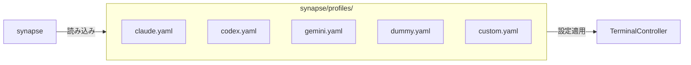
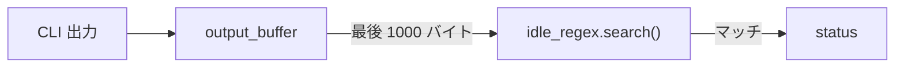
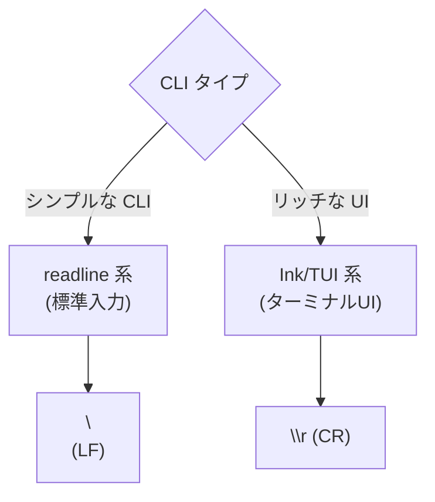
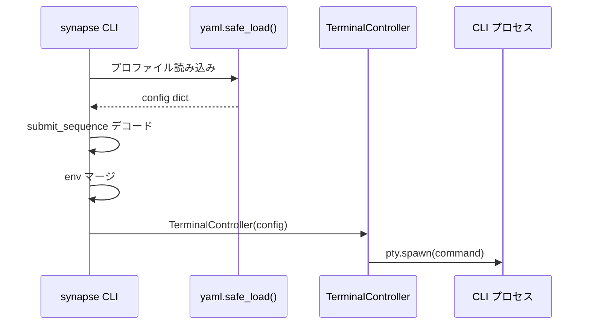

# Profiles

Synapse A2A は `synapse/profiles/*.yaml` の設定を使って CLI エージェントを起動します。
このドキュメントでは、プロファイル設定の詳細を解説します。

---

## 1. プロファイルの概要



---

## 2. YAML スキーマ

### 2.1 基本構造

```yaml
# 必須フィールド
command: "claude"           # 起動する CLI コマンド
idle_regex: "> $"          # IDLE 状態を検出する正規表現

# オプションフィールド
args: []                    # コマンドライン引数（現在未使用）
submit_sequence: "\n"      # 送信時に付与するキーシーケンス
env:                       # 環境変数
  TERM: "xterm-256color"
```

---

### 2.2 フィールド詳細

| フィールド | 型 | 必須 | デフォルト | 説明 |
|-----------|-----|------|-----------|------|
| `command` | string | Yes | - | 起動する CLI コマンド |
| `idle_regex` | string | Yes | - | IDLE 状態を検出する正規表現 |
| `args` | array | No | `[]` | コマンドライン引数 |
| `submit_sequence` | string | No | `\n` | 送信時のキーシーケンス |
| `env` | object | No | `{}` | 追加/上書きする環境変数 |

---

## 3. フィールド解説

### 3.1 command

起動する CLI コマンドを指定します。

```yaml
# 単一コマンド
command: "claude"

# 引数付き
command: "python3 -u dummy_agent.py"

# パス指定
command: "/usr/local/bin/claude"
```

**コマンドの解決**:

1. 環境変数 `PATH` から検索
2. 絶対パスで指定可能
3. スペース区切りで引数を含めることが可能

---

### 3.2 idle_regex

エージェントが待機状態（IDLE）になったことを検出する正規表現です。

```yaml
# プロンプトが "> " で終わる場合
idle_regex: "> $"

# プロンプトが ">>> " の場合
idle_regex: ">>> $"

# 複数パターン
idle_regex: "(> |>>> )$"
```

**動作原理**:



**注意点**:

- 正規表現はバイト列に対してマッチングされます（UTF-8 エンコード）
- 出力バッファの最後 1000 バイトに対して検索されます
- マッチしないと永久に BUSY のままになります

---

### 3.3 submit_sequence

メッセージ送信時に末尾に付与するキーシーケンスです。

```yaml
# readline 系 CLI（標準入力）
submit_sequence: "\n"

# Ink/TUI 系 CLI（Enter キー）
submit_sequence: "\r"

# 特殊シーケンス（Ctrl+J）
submit_sequence: "\x0a"
```

**使い分け**:



| シーケンス | コード | 用途 |
|-----------|--------|------|
| `\n` | LF (0x0a) | readline 系 CLI |
| `\r` | CR (0x0d) | Ink/TUI 系 CLI |

**エスケープシーケンス**:

YAML ではバックスラッシュはエスケープされるため、以下のように記述します：

```yaml
# 正しい記法
submit_sequence: "\n"    # LF
submit_sequence: "\r"    # CR

# Python での解釈
# "\n" -> 0x0a
# "\r" -> 0x0d
```

---

### 3.4 env

起動時に設定する環境変数です。システム環境変数に追加/上書きされます。

```yaml
env:
  TERM: "xterm-256color"
  PYTHONUNBUFFERED: "1"
  CUSTOM_VAR: "value"
```

**重要な環境変数**:

| 変数 | 推奨値 | 説明 |
|------|--------|------|
| `TERM` | `xterm-256color` | ターミナルタイプ（TUI 必須） |
| `PYTHONUNBUFFERED` | `1` | Python の出力バッファリング無効化 |
| `NO_COLOR` | `1` | カラー出力無効化（オプション） |

---

## 4. デフォルトプロファイル

### 4.1 claude.yaml

```yaml
command: "claude"
args: []
idle_regex: "> $"
submit_sequence: "\r"
env:
  TERM: "xterm-256color"
```

**特徴**:

- Claude Code CLI 用
- Ink ベースの TUI のため `\r` を使用
- `TERM` を `xterm-256color` に設定

---

### 4.2 codex.yaml

```yaml
command: "codex"
args: []
idle_regex: "> $"
submit_sequence: "\r"
env:
  TERM: "xterm-256color"
```

**特徴**:

- OpenAI Codex CLI 用
- Claude と同様の設定

---

### 4.3 gemini.yaml

```yaml
command: "gemini"
args: []
idle_regex: "> $"
submit_sequence: "\r"
env:
  TERM: "xterm-256color"
```

**特徴**:

- Google Gemini CLI 用
- Claude と同様の設定

---

### 4.4 dummy.yaml

```yaml
command: "python3 -u dummy_agent.py"
idle_regex: "> $"
submit_sequence: "\n"
env:
  PYTHONUNBUFFERED: "1"
```

**特徴**:

- テスト用のダミーエージェント
- `python3 -u` で unbuffered モード
- readline 系のため `\n` を使用

---

## 5. カスタムプロファイルの作成

### 5.1 作成手順

1. `synapse/profiles/` に YAML ファイルを作成
2. 必須フィールドを設定
3. CLI から起動

```bash
# 1. プロファイル作成
cat > synapse/profiles/myagent.yaml << EOF
command: "myagent"
idle_regex: "\\$ $"
submit_sequence: "\n"
env:
  TERM: "xterm-256color"
EOF

# 2. デフォルトポートを追加（オプション）
# cli.py の DEFAULT_PORTS に追加

# 3. 起動
synapse myagent --port 8200
```

---

### 5.2 プロファイル例：GPT CLI

```yaml
command: "gpt"
idle_regex: "gpt> $"
submit_sequence: "\n"
env:
  TERM: "xterm-256color"
  OPENAI_API_KEY: ""  # 環境変数から継承
```

---

### 5.3 プロファイル例：カスタム Python エージェント

```yaml
command: "python3 -u /path/to/my_agent.py"
idle_regex: ">>> $"
submit_sequence: "\n"
env:
  PYTHONUNBUFFERED: "1"
  MY_CONFIG: "/path/to/config.json"
```

---

## 6. トラブルシューティング

### 6.1 IDLE にならない

**原因**: `idle_regex` がプロンプトと一致していない

**対処**:

1. CLI を手動で起動してプロンプトを確認
2. `idle_regex` を修正

```bash
# プロンプトを確認
claude

# 表示されるプロンプト
# > _

# idle_regex を設定
idle_regex: "> $"
```

---

### 6.2 メッセージが送信されない

**原因**: `submit_sequence` が不正

**対処**:

1. `\n` と `\r` を入れ替えて試す
2. TUI 系 CLI は `\r` を使用

```yaml
# 変更前
submit_sequence: "\n"

# 変更後
submit_sequence: "\r"
```

---

### 6.3 TUI が崩れる

**原因**: `TERM` が設定されていない

**対処**:

```yaml
env:
  TERM: "xterm-256color"
```

---

### 6.4 日本語が文字化けする

**原因**: ロケール設定が不足

**対処**:

```yaml
env:
  LANG: "ja_JP.UTF-8"
  LC_ALL: "ja_JP.UTF-8"
```

---

## 7. 高度な設定

### 7.1 複雑なプロンプトパターン

```yaml
# 複数行プロンプト
idle_regex: "(claude|codex|gemini)> $"

# ANSI エスケープシーケンス付き
idle_regex: "\\x1b\\[0m> $"
```

---

### 7.2 条件付き環境変数

```yaml
env:
  # 開発環境
  DEBUG: "1"
  LOG_LEVEL: "debug"

  # 本番環境では削除または変更
```

---

## 8. プロファイル読み込みの仕組み



**コード参照** (`cli.py`):

```python
with open(profile_path, 'r') as f:
    config = yaml.safe_load(f)

submit_seq = config.get('submit_sequence', '\n')
            .encode().decode('unicode_escape')

env = os.environ.copy()
if 'env' in config:
    env.update(config['env'])
```

---

## 関連ドキュメント

- [architecture.md](architecture.md) - 内部アーキテクチャ
- [troubleshooting.md](troubleshooting.md) - トラブルシューティング
- [references.md](references.md) - 完全リファレンス
