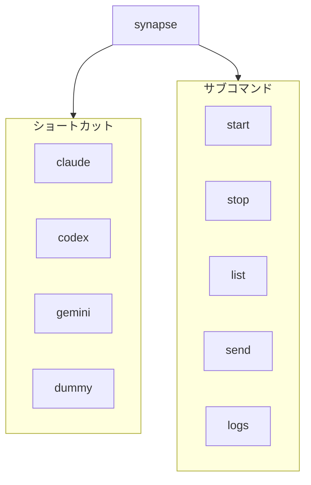
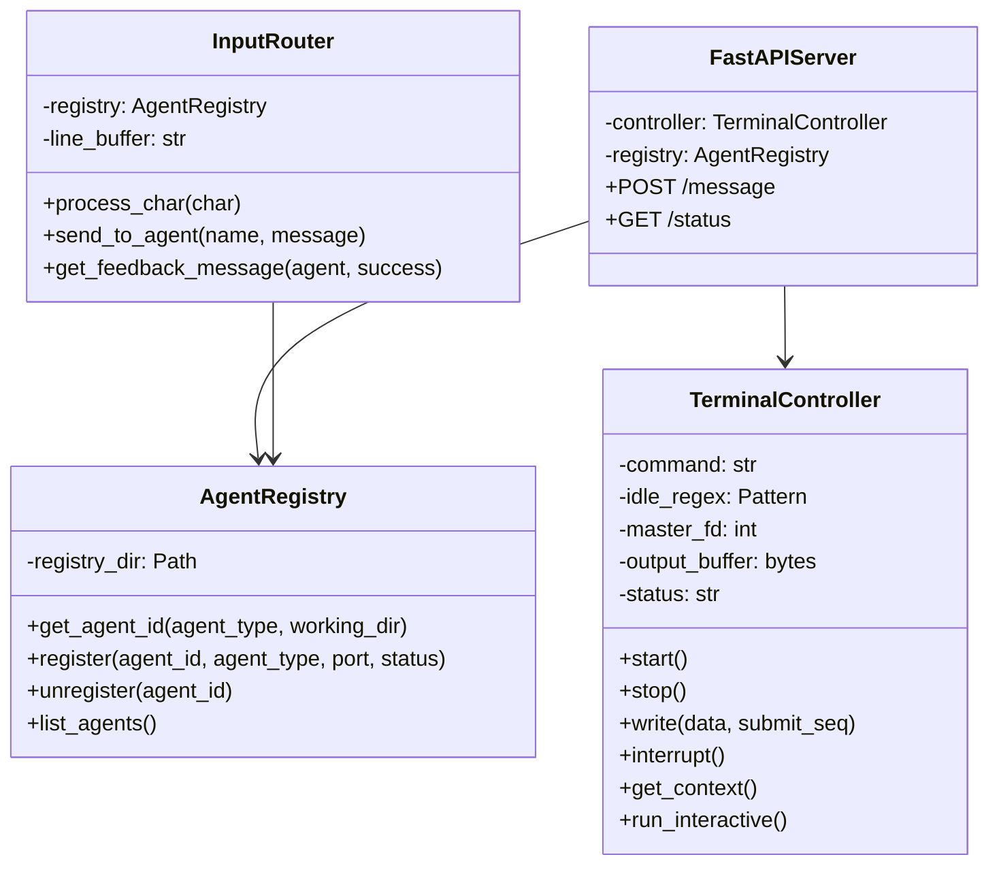

# References: API / CLI リファレンス

Synapse A2A の API、CLI、設定の完全リファレンスです。

---

## 1. CLI コマンドリファレンス

### 1.1 コマンド一覧



---

### 1.2 synapse \<profile\>

インタラクティブモードでエージェントを起動します。

```bash
synapse <profile> [--port PORT]
```

| 引数 | 必須 | 説明 |
|------|------|------|
| `profile` | Yes | エージェントプロファイル名 |
| `--port` | No | サーバーポート（デフォルト: プロファイル別） |

**例**:

```bash
synapse claude
synapse codex --port 8101
synapse gemini --port 8102
```

**デフォルトポート**:

| プロファイル | ポート |
|-------------|--------|
| claude | 8100 |
| codex | 8101 |
| gemini | 8102 |
| dummy | 8199 |

---

### 1.3 synapse start

バックグラウンドでエージェントを起動します。

```bash
synapse start <profile> [--port PORT] [--foreground]
```

| 引数 | 必須 | 説明 |
|------|------|------|
| `profile` | Yes | エージェントプロファイル名 |
| `--port` | No | サーバーポート |
| `--foreground`, `-f` | No | フォアグラウンドで起動 |

**例**:

```bash
synapse start claude --port 8100
synapse start codex --foreground
```

**ログ出力先**: `~/.synapse/logs/<profile>.log`

---

### 1.4 synapse stop

実行中のエージェントを停止します。

```bash
synapse stop <profile>
```

| 引数 | 必須 | 説明 |
|------|------|------|
| `profile` | Yes | 停止するプロファイル名 |

**動作**:
1. Registry からエージェントを検索
2. PID に SIGTERM を送信
3. Registry から登録解除

---

### 1.5 synapse list

実行中のエージェント一覧を表示します。

```bash
synapse list
```

**出力形式**:

```
TYPE       PORT     STATUS     PID      ENDPOINT
------------------------------------------------------------
claude     8100     IDLE       12345    http://localhost:8100
codex      8101     BUSY       12346    http://localhost:8101
```

| 列 | 説明 |
|----|------|
| TYPE | エージェントタイプ（プロファイル名） |
| PORT | HTTP サーバーポート |
| STATUS | 現在の状態（IDLE/BUSY/STARTING） |
| PID | プロセス ID |
| ENDPOINT | HTTP エンドポイント URL |

---

### 1.6 synapse send

エージェントにメッセージを送信します。

```bash
synapse send <target> <message> [--priority N] [--return]
```

| 引数 | 必須 | 説明 |
|------|------|------|
| `target` | Yes | 送信先エージェント名 |
| `message` | Yes | メッセージ内容 |
| `--priority`, `-p` | No | 優先度 1-5（デフォルト: 1） |
| `--return`, `-r` | No | レスポンスを待つ（未実装） |

**例**:

```bash
synapse send claude "Hello!"
synapse send codex "設計して" -p 1
synapse send gemini "止まれ" -p 5
```

---

### 1.7 synapse logs

エージェントのログを表示します。

```bash
synapse logs <profile> [-f] [-n LINES]
```

| 引数 | 必須 | 説明 |
|------|------|------|
| `profile` | Yes | プロファイル名 |
| `-f`, `--follow` | No | リアルタイム追跡 |
| `-n`, `--lines` | No | 表示行数（デフォルト: 50） |

**例**:

```bash
synapse logs claude
synapse logs codex -f
synapse logs gemini -n 100
```

---

## 2. HTTP API リファレンス

### 2.1 エンドポイント一覧


| メソッド | パス | 説明 |
|---------|------|------|
| POST | `/message` | メッセージ送信 |
| GET | `/status` | ステータス取得 |

---

### 2.2 POST /message

エージェントにメッセージを送信します。

**リクエスト**:

```http
POST /message HTTP/1.1
Host: localhost:8100
Content-Type: application/json

{
  "content": "メッセージ内容",
  "priority": 1
}
```

| フィールド | 型 | 必須 | 説明 |
|-----------|-----|------|------|
| `content` | string | Yes | 送信するメッセージ |
| `priority` | int | Yes | 優先度（1-5） |

**Priority の動作**:

| 値 | 動作 |
|----|------|
| 1-4 | 直接 stdin に書き込み |
| 5 | SIGINT 送信後に書き込み |

**レスポンス**:

```json
{
  "status": "sent",
  "priority": 1
}
```

| フィールド | 型 | 説明 |
|-----------|-----|------|
| `status` | string | 送信結果（"sent"） |
| `priority` | int | 使用した優先度 |

**エラーレスポンス**:

```json
{
  "detail": "Agent not running"
}
```

| ステータスコード | 説明 |
|----------------|------|
| 200 | 成功 |
| 500 | 書き込みエラー |
| 503 | エージェント未起動 |

**curl 例**:

```bash
curl -X POST http://localhost:8100/message \
  -H "Content-Type: application/json" \
  -d '{"content": "Hello!", "priority": 1}'
```

---

### 2.3 GET /status

エージェントの状態とコンテキストを取得します。

**リクエスト**:

```http
GET /status HTTP/1.1
Host: localhost:8100
```

**レスポンス**:

```json
{
  "status": "IDLE",
  "context": "最新の出力内容（最大2000文字）"
}
```

| フィールド | 型 | 説明 |
|-----------|-----|------|
| `status` | string | 現在の状態 |
| `context` | string | 出力バッファの末尾 |

**status の値**:

| 値 | 説明 |
|----|------|
| `STARTING` | 起動中 |
| `BUSY` | 処理中 |
| `IDLE` | 待機中（プロンプト表示） |
| `NOT_STARTED` | 未起動 |

**curl 例**:

```bash
curl http://localhost:8100/status
```

---

## 3. @Agent 記法リファレンス

### 3.1 構文

```
@<agent_name> [--response] <message>
```

**正規表現パターン**:

```regex
^@(\w+)(\s+--response)?\s+(.+)$
```

### 3.2 パターン

| 構文 | 説明 |
|------|------|
| `@agent message` | メッセージ送信（応答なし） |
| `@agent --response "message"` | メッセージ送信（応答待ち） |

### 3.3 例

```text
# 通常送信
@codex 設計をレビューして
@gemini このコードを最適化して

# レスポンス付き
@claude --response "コードレビューして"
@codex --response "エラーを修正して"

# クォート付き
@gemini "複雑な メッセージ"
@claude '複雑な メッセージ'
```

### 3.4 フィードバック表示

| 表示 | 意味 |
|------|------|
| `[→ agent]` | 送信成功（緑） |
| `[← agent]` | レスポンス受信（シアン） |
| `[✗ agent not found]` | エージェント未検出（赤） |

---

## 4. Registry リファレンス

### 4.1 ディレクトリ構造

```
~/.a2a/
└── registry/
    ├── <agent_id_1>.json
    ├── <agent_id_2>.json
    └── <agent_id_3>.json
```

### 4.2 Registry ファイル形式

```json
{
  "agent_id": "abc123def456...",
  "agent_type": "claude",
  "port": 8100,
  "status": "IDLE",
  "pid": 12345,
  "working_dir": "/path/to/project",
  "endpoint": "http://localhost:8100"
}
```

| フィールド | 型 | 説明 |
|-----------|-----|------|
| `agent_id` | string | エージェント ID（SHA256 ハッシュ） |
| `agent_type` | string | プロファイル名 |
| `port` | int | HTTP サーバーポート |
| `status` | string | 現在の状態 |
| `pid` | int | プロセス ID |
| `working_dir` | string | 作業ディレクトリ |
| `endpoint` | string | HTTP エンドポイント URL |

### 4.3 Agent ID の生成

```python
raw_key = f"{hostname}|{working_dir}|{agent_type}"
agent_id = hashlib.sha256(raw_key.encode()).hexdigest()
```

---

## 5. プロファイル YAML リファレンス

### 5.1 スキーマ

```yaml
# 必須フィールド
command: string      # 起動する CLI コマンド
idle_regex: string   # IDLE 状態検出の正規表現

# オプションフィールド
args: array          # コマンドライン引数（未使用）
submit_sequence: string  # 送信キーシーケンス（デフォルト: "\n"）
env: object          # 環境変数
```

### 5.2 フィールド詳細

| フィールド | 型 | 必須 | デフォルト | 説明 |
|-----------|-----|------|-----------|------|
| `command` | string | Yes | - | CLI コマンド |
| `idle_regex` | string | Yes | - | IDLE 検出パターン |
| `args` | array | No | `[]` | 追加引数 |
| `submit_sequence` | string | No | `\n` | 送信シーケンス |
| `env` | object | No | `{}` | 環境変数 |

### 5.3 submit_sequence の値

| 値 | コード | 用途 |
|----|--------|------|
| `\n` | LF (0x0a) | readline 系 CLI |
| `\r` | CR (0x0d) | Ink/TUI 系 CLI |

### 5.4 例

**claude.yaml**:

```yaml
command: "claude"
args: []
idle_regex: "> $"
submit_sequence: "\r"
env:
  TERM: "xterm-256color"
```

**dummy.yaml**:

```yaml
command: "python3 -u dummy_agent.py"
idle_regex: "> $"
submit_sequence: "\n"
env:
  PYTHONUNBUFFERED: "1"
```

---

## 6. ファイルパス一覧

| パス | 説明 |
|------|------|
| `~/.a2a/registry/` | エージェント Registry |
| `~/.synapse/logs/` | ログディレクトリ |
| `~/.synapse/logs/<profile>.log` | エージェントログ |
| `~/.synapse/logs/input_router.log` | InputRouter ログ |
| `synapse/profiles/*.yaml` | プロファイル定義 |

---

## 7. 環境変数

### 7.1 システム環境変数

| 変数 | 説明 |
|------|------|
| `SYNAPSE_PROFILE` | デフォルトプロファイル（サーバーモード用） |
| `SYNAPSE_PORT` | デフォルトポート（サーバーモード用） |

### 7.2 推奨プロファイル環境変数

| 変数 | 推奨値 | 説明 |
|------|--------|------|
| `TERM` | `xterm-256color` | ターミナルタイプ |
| `PYTHONUNBUFFERED` | `1` | Python 出力バッファリング無効化 |
| `LANG` | `ja_JP.UTF-8` | ロケール設定 |
| `LC_ALL` | `ja_JP.UTF-8` | ロケール設定 |

---

## 8. コード参照

### 8.1 主要ファイル

| ファイル | 行数 | 説明 |
|---------|------|------|
| `synapse/cli.py` | ~320 | CLI エントリポイント |
| `synapse/controller.py` | ~245 | TerminalController |
| `synapse/input_router.py` | ~220 | InputRouter |
| `synapse/server.py` | ~150 | FastAPI サーバー |
| `synapse/registry.py` | ~55 | AgentRegistry |
| `synapse/shell.py` | ~190 | インタラクティブシェル |
| `synapse/tools/a2a.py` | ~75 | A2A CLI ツール |

### 8.2 クラス図



---

## 関連ドキュメント

- [architecture.md](architecture.md) - 内部アーキテクチャ
- [profiles.md](profiles.md) - プロファイル設定
- [usage.md](usage.md) - 使い方詳細
