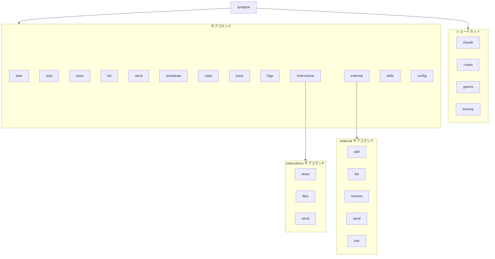
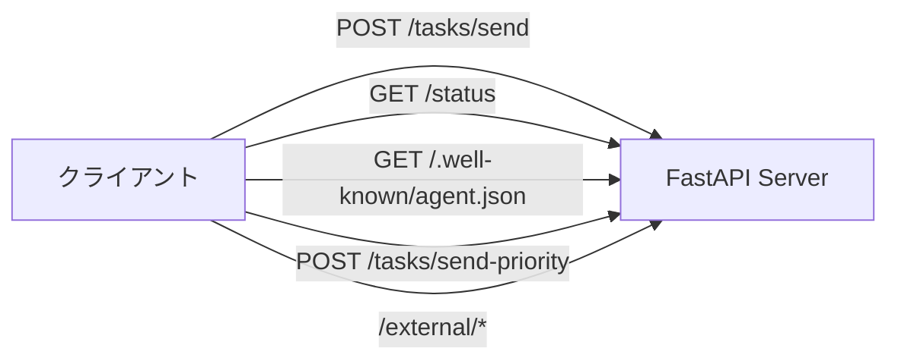
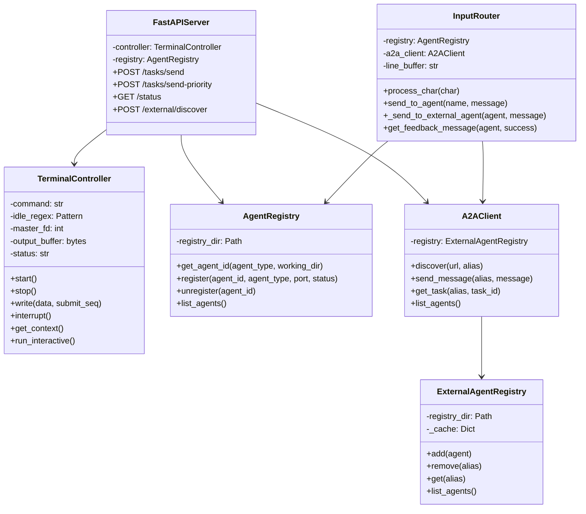

# References: API / CLI リファレンス

Synapse A2A の API、CLI、設定の完全リファレンスです。

---

## 1. CLI コマンドリファレンス

### 1.1 コマンド一覧



---

### 1.2 synapse \<profile\>

インタラクティブモードでエージェントを起動します。

```bash
synapse <profile> [--port PORT]
```

| 引数 | 必須 | 説明 |
|------|------|------|
| `profile` | Yes | エージェントプロファイル名 |
| `--port` | No | サーバーポート（デフォルト: プロファイル別） |

**例**:

```bash
synapse claude
synapse codex --port 8120
synapse gemini --port 8110
```

**デフォルトポート**:

| プロファイル | ポート |
|-------------|--------|
| claude | 8100 |
| codex | 8120 |
| gemini | 8110 |
| dummy | 8190 |

---

### 1.3 synapse start

バックグラウンドでエージェントを起動します。

```bash
synapse start <profile> [--port PORT] [--foreground]
```

| 引数 | 必須 | 説明 |
|------|------|------|
| `profile` | Yes | エージェントプロファイル名 |
| `--port` | No | サーバーポート |
| `--foreground`, `-f` | No | フォアグラウンドで起動 |

**例**:

```bash
synapse start claude --port 8100
synapse start codex --foreground
```

**ログ出力先**: `~/.synapse/logs/<profile>.log`

---

### 1.4 synapse stop

実行中のエージェントを停止します。

```bash
synapse stop <profile|id>
```

| 引数 | 必須 | 説明 |
|------|------|------|
| `profile` または `id` | Yes | 停止するプロファイル名、またはエージェントID |
| `--all`, `-a` | No | 指定したプロファイルの全インスタンスを停止（ID指定時は無視） |

**動作**:
1. Registry からエージェントを検索（ID完全一致またはプロファイル名）
2. PID に SIGTERM を送信
3. Registry から登録解除

---

### 1.5 synapse list

実行中のエージェント一覧を Rich TUI で表示します。ファイルウォッチャーにより、エージェントのステータス変更時に自動更新されます。

```bash
synapse list
```

**出力形式（Rich TUI）**:

```
╭─────────────── Synapse A2A v0.2.30 - Agent List ───────────────╮
│ ╭───┬──────────────────────┬──────────┬────────────┬───────────┬───────────┬────────────┬──────────────╮ │
│ │ # │ ID                   │ NAME     │ STATUS     │ CURRENT   │ TRANSPORT │ WORKING_DIR│ EDITING_FILE │ │
│ ├───┼──────────────────────┼──────────┼────────────┼───────────┼───────────┼────────────┼──────────────┤ │
│ │ 1 │ synapse-claude-8100  │ my-claude│ PROCESSING │ Reviewing │ UDS→      │ project    │ auth.py      │ │
│ │ 2 │ synapse-gemini-8110  │ -        │ PROCESSING │ -         │ →UDS      │ other      │ -            │ │
│ │ 3 │ synapse-codex-8120   │ tester   │ READY      │ -         │ -         │ third      │ -            │ │
│ ╰───┴──────────────────────┴──────────┴────────────┴───────────┴───────────┴────────────┴──────────────┘ │
╰────────────────────── Last updated: 2024-01-15 10:30:45 ─────────────────────╯
[1-3/↑↓: select] [Enter/j: jump] [k: kill] [/: filter] [ESC: clear] [q: quit]
```

**キーボード操作**:

| キー | アクション |
|------|----------|
| 1-9 | エージェント行を選択 |
| ↑/↓ | エージェント行をナビゲート |
| Enter / j | 選択したエージェントのターミナルにジャンプ |
| k | 選択したエージェントを終了（確認ダイアログあり） |
| / | TYPE / NAME / WORKING_DIR でフィルタ |
| ESC | フィルタ/選択解除 |
| q | 終了 |

| 列 | 説明 |
|----|------|
| ID | エージェントID（例: `synapse-claude-8100`） |
| NAME | カスタム名 |
| TYPE | エージェントタイプ（プロファイル名） |
| ROLE | エージェントの役割説明 |
| STATUS | 現在の状態（READY/PROCESSING/DONE） |
| TRANSPORT | 通信中の方式 |
| CURRENT | 現在のタスクプレビュー |
| WORKING_DIR | 作業ディレクトリ |
| EDITING_FILE | 編集中のファイル（File Safety 有効時のみ表示） |

**Note**: 行を選択すると詳細パネルが表示され、Port/PID/Endpoint/フルパスなどが確認できます。

**TRANSPORT 列の値**:

| 値 | 説明 |
|----|------|
| `UDS→` | UDS（Unix Domain Socket）で送信中 |
| `TCP→` | TCP/HTTP で送信中 |
| `→UDS` | UDS で受信中 |
| `→TCP` | TCP で受信中 |
| `-` | 通信なし |

---

### 1.5.1 synapse team start

複数エージェントを分割ペインで起動します。

```bash
synapse team start <agent1> <agent2> ... [--layout split|horizontal|vertical]
```

| 引数 | 必須 | 説明 |
|------|------|------|
| `agents` | Yes | 起動するエージェントタイプ（複数指定） |
| `--layout` | No | ペインレイアウト (`split`, `horizontal`, `vertical`) |

**対応ターミナル**:
- `tmux`
- `iTerm2`
- `Terminal.app`（タブで起動）
- `zellij`

**例**:

```bash
synapse team start claude gemini codex
synapse team start claude gemini --layout horizontal
synapse team start claude gemini --layout vertical
```

---

### 1.6 synapse send

エージェントにメッセージを送信します。

```bash
synapse send <target> <message|--message-file PATH|--stdin> [--from AGENT_ID] [--priority N] [--attach PATH] [--response | --no-response]
```

**ターゲット指定方法**:

| 形式 | 例 | 説明 |
|-----|---|------|
| エージェントタイプ | `claude` | 単一インスタンスの場合のみ |
| タイプ-ポート | `claude-8100` | 同タイプが複数ある場合 |
| フルID | `synapse-claude-8100` | 完全なエージェントID |

| 引数 | 必須 | 説明 |
|------|------|------|
| `target` | Yes | 送信先エージェント（上記形式） |
| `message` | No | メッセージ内容（positional / `--message-file` / `--stdin` のいずれか） |
| `--message-file`, `-F` | No | ファイルからメッセージ読み込み（`-` で stdin） |
| `--stdin` | No | 標準入力からメッセージ読み込み |
| `--from`, `-f` | No | 送信元エージェントID（常に指定推奨） |
| `--priority`, `-p` | No | 優先度 1-5（デフォルト: 3） |
| `--attach`, `-a` | No | ファイル添付（複数指定可） |
| `--response` | No | Roundtrip - 送信側が待機、受信側は `synapse reply` で返信 |
| `--no-response` | No | Oneway - 送りっぱなし、返信不要 |

**Note**: `a2a.flow=auto`（デフォルト）の場合、フラグなしは応答待ちになります。
**Note**: メッセージの入力元は **positional / `--message-file` / `--stdin` のいずれか1つ** を指定します。

**例**:

```bash
synapse send claude "Hello!" --from synapse-codex-8121
synapse send codex "設計して" -p 1 --from synapse-claude-8100
synapse send claude-8100 "Hello" --from synapse-claude-8101  # 同タイプが複数の場合
synapse send gemini "止まれ" -p 5 --from synapse-claude-8100
synapse send codex "結果を教えて" --response --from synapse-claude-8100
synapse send codex --message-file ./message.txt --from synapse-claude-8100
echo "from stdin" | synapse send codex --stdin --from synapse-claude-8100
synapse send codex "このファイルを見て" -a ./a.py -a ./b.txt --from synapse-claude-8100
```

---

### 1.6.1 synapse broadcast

現在の作業ディレクトリ（`working_dir`）と一致する全エージェントにメッセージを送信します。

```bash
synapse broadcast <message> [--from AGENT_ID] [--priority N] [--response | --no-response]
```

| 引数 | 必須 | 説明 |
|------|------|------|
| `message` | Yes | 一括送信するメッセージ |
| `--from`, `-f` | No | 送信元エージェントID（指定時は送信元自身を除外） |
| `--priority`, `-p` | No | 優先度 1-5（デフォルト: 1） |
| `--response` | No | Roundtrip - 各送信先で応答待ち |
| `--no-response` | No | Oneway - 各送信先へ送りっぱなし |

**一致ルール**:
- `Path.cwd().resolve()` と各エージェントの `working_dir` 実パスが完全一致した場合のみ対象
- 対象が0件の場合はエラー終了
- 一部失敗しても残りには送信を継続し、最後に `Sent` / `Failed` を表示

**例**:

```bash
synapse broadcast "進捗を報告してください" --from synapse-claude-8100
synapse broadcast "緊急確認" -p 4 --response --from synapse-codex-8120
synapse broadcast "FYI: CI通過" --no-response
```

---

### 1.7 synapse reply

最後に受信したA2Aメッセージに返信します。Synapseは返信を期待するメッセージの送信者情報を自動的に追跡します。

```bash
synapse reply [message] [--from AGENT_ID] [--to SENDER_ID] [--list-targets]
```

| 引数 | 必須 | 説明 |
|------|------|------|
| `message` | No | 返信メッセージ内容（`--list-targets` 使用時は省略可） |
| `--from`, `-f` | No | 送信元エージェントID（サンドボックス環境で必須） |
| `--to` | No | 返信先の sender_id を指定（複数の送信者がいる場合に使用） |
| `--list-targets` | No | 返信可能なターゲット一覧を表示して終了 |

**例**:

```bash
# 最新の送信者に返信（デフォルト LIFO）
synapse reply "分析結果です..."

# 特定の送信者に返信
synapse reply "タスク完了しました" --to synapse-claude-8100

# 返信可能なターゲットを確認
synapse reply --list-targets
```

**動作**:
1. 自身のエージェントの返信追跡マップから送信者情報を取得（`--to` 指定時は特定の送信者を取得）
2. 送信者のエンドポイントに返信を送信
3. 成功後、送信者情報を削除

---

### 1.7.1 synapse trace

タスクIDに対して、task history と file-safety の変更履歴（同一 task_id）をまとめて表示します。

```bash
synapse trace <task_id>
```

**例**:

```bash
synapse trace 4d5e61ee-be97-4922-bdbd-ac1108b8d1c9
```

---

### 1.8 synapse logs

エージェントのログを表示します。

```bash
synapse logs <profile> [-f] [-n LINES]
```

| 引数 | 必須 | 説明 |
|------|------|------|
| `profile` | Yes | プロファイル名 |
| `-f`, `--follow` | No | リアルタイム追跡 |
| `-n`, `--lines` | No | 表示行数（デフォルト: 50） |

**例**:

```bash
synapse logs claude
synapse logs codex -f
synapse logs gemini -n 100
```

---

### 1.9 synapse instructions

初期インストラクションを管理・送信します。

```bash
synapse instructions <command> [options]
```

#### 1.9.1 synapse instructions show

エージェントのインストラクション内容を表示します。

```bash
synapse instructions show [agent_type]
```

| 引数 | 必須 | 説明 |
|------|------|------|
| `agent_type` | No | エージェントタイプ（claude, gemini, codex）。省略時はデフォルト設定を表示 |

**例**:

```bash
synapse instructions show
synapse instructions show claude
synapse instructions show gemini
```

#### 1.9.2 synapse instructions files

エージェントが読み込むインストラクションファイル一覧を表示します。

```bash
synapse instructions files [agent_type]
```

| 引数 | 必須 | 説明 |
|------|------|------|
| `agent_type` | No | エージェントタイプ。省略時はデフォルト設定を表示 |

**例**:

```bash
synapse instructions files claude
```

**出力例**:

```
Instruction files for 'claude':
  - .synapse/default.md
```

ファイルの場所に応じて `.synapse/`（プロジェクト）または `~/.synapse/`（ユーザー）が表示されます。

#### 1.9.3 synapse instructions send

実行中のエージェントに初期インストラクションを送信します。

```bash
synapse instructions send <target> [--preview]
```

| 引数 | 必須 | 説明 |
|------|------|------|
| `target` | Yes | 送信先（プロファイル名またはエージェントID） |
| `--preview`, `-p` | No | 実際に送信せずプレビューのみ表示 |

**例**:

```bash
# プロファイル名で送信
synapse instructions send claude

# エージェントIDで送信
synapse instructions send synapse-claude-8100

# プレビュー（送信しない）
synapse instructions send claude --preview
```

**ユースケース**:

| シチュエーション | コマンド |
|----------------|----------|
| `--resume` 後に A2A 機能が必要になった | `synapse instructions send claude` |
| エージェントがインストラクションを忘れた | `synapse instructions send <agent>` |
| 送信前に内容を確認したい | `synapse instructions send <agent> --preview` |

---

### 1.10 synapse external

外部 Google A2A エージェントを管理します。

```bash
synapse external <command> [options]
```

#### 1.10.1 synapse external add

外部エージェントを発見して登録します。

```bash
synapse external add <url> [--alias ALIAS]
```

| 引数 | 必須 | 説明 |
|------|------|------|
| `url` | Yes | エージェントの URL |
| `--alias`, `-a` | No | ショートネーム（省略時は自動生成） |

**例**:

```bash
synapse external add https://agent.example.com
synapse external add http://localhost:9000 --alias myagent
```

#### 1.10.2 synapse external list

登録済み外部エージェントの一覧を表示します。

```bash
synapse external list
```

**出力形式**:

```
ALIAS           NAME                 URL                                      LAST SEEN
------------------------------------------------------------------------------------------
myagent         My Agent             http://localhost:9000                    2024-01-15T10:30:00
example         Example Agent        https://agent.example.com                Never
```

#### 1.10.3 synapse external remove

外部エージェントを登録解除します。

```bash
synapse external remove <alias>
```

| 引数 | 必須 | 説明 |
|------|------|------|
| `alias` | Yes | 削除するエージェントの alias |

#### 1.10.4 synapse external send

外部エージェントにメッセージを送信します。

```bash
synapse external send <alias> <message> [--wait]
```

| 引数 | 必須 | 説明 |
|------|------|------|
| `alias` | Yes | 送信先エージェントの alias |
| `message` | Yes | メッセージ内容 |
| `--wait`, `-w` | No | 完了を待つ |

**例**:

```bash
synapse external send myagent "Hello!"
synapse external send myagent "Process this" --wait
```

#### 1.10.5 synapse external info

外部エージェントの詳細情報を表示します。

```bash
synapse external info <alias>
```

**出力例**:

```
Name: My Agent
Alias: myagent
URL: http://localhost:9000
Description: An example agent
Added: 2024-01-15T10:00:00Z
Last Seen: 2024-01-15T10:30:00Z

Capabilities:
  streaming: False
  multiTurn: True

Skills:
  - chat
    Send messages to the agent
  - analyze
    Analyze provided content
```

---

### 1.11 synapse skills

スキルの発見・管理・デプロイを行います。引数なしで TUI モードが起動します。

```bash
synapse skills [subcommand]
```

#### 1.11.1 synapse skills list

発見されたスキルを一覧表示します。

```bash
synapse skills list [--scope SCOPE]
```

| 引数 | 必須 | 説明 |
|------|------|------|
| `--scope` | No | フィルタするスコープ（`synapse`, `user`, `project`, `plugin`） |

#### 1.11.2 synapse skills show

スキルの詳細情報を表示します。

```bash
synapse skills show <name> [--scope SCOPE]
```

| 引数 | 必須 | 説明 |
|------|------|------|
| `name` | Yes | スキル名 |
| `--scope` | No | 対象スコープ |

#### 1.11.3 synapse skills delete

スキルを削除します。Plugin スコープのスキルは削除できません。

```bash
synapse skills delete <name> [--force] [--scope SCOPE]
```

| 引数 | 必須 | 説明 |
|------|------|------|
| `name` | Yes | スキル名 |
| `--force` | No | 確認なしで削除 |
| `--scope` | No | 対象スコープ |

#### 1.11.4 synapse skills move

スキルを別のスコープに移動します。

```bash
synapse skills move <name> --to <scope>
```

| 引数 | 必須 | 説明 |
|------|------|------|
| `name` | Yes | スキル名 |
| `--to` | Yes | 移動先スコープ（`user`, `project`） |

#### 1.11.5 synapse skills deploy

中央ストア（`~/.synapse/skills/`）からエージェントディレクトリにスキルをデプロイします。

```bash
synapse skills deploy <name> [--agent AGENTS] [--scope SCOPE]
```

| 引数 | 必須 | 説明 |
|------|------|------|
| `name` | Yes | スキル名 |
| `--agent` | No | 対象エージェント（カンマ区切り: `claude,codex,gemini`） |
| `--scope` | No | デプロイスコープ（`user` または `project`、デフォルト: `user`） |

**例**:

```bash
synapse skills deploy code-quality --agent claude,codex --scope project
```

#### 1.11.6 synapse skills import

エージェントディレクトリのスキルを中央ストアにインポートします。

```bash
synapse skills import <name> [--from SCOPE]
```

| 引数 | 必須 | 説明 |
|------|------|------|
| `name` | Yes | スキル名 |
| `--from` | No | インポート元スコープ（`user` または `project`） |

#### 1.11.7 synapse skills add

リポジトリからスキルをインストールします（`npx skills add` ラッパー）。

```bash
synapse skills add <repo>
```

| 引数 | 必須 | 説明 |
|------|------|------|
| `repo` | Yes | リポジトリ（例: `s-hiraoku/synapse-a2a`） |

**動作**: `npx skills add <repo> -g -a claude-code -y` を実行し、新規スキルを自動的に `~/.synapse/skills/` にインポートします。

#### 1.11.8 synapse skills create

新規スキルテンプレートを中央ストアに作成します。

```bash
synapse skills create [--name NAME]
```

| 引数 | 必須 | 説明 |
|------|------|------|
| `--name` | No | スキル名（省略時は対話形式） |

#### 1.11.9 synapse skills set list

登録済みスキルセット一覧を表示します。

```bash
synapse skills set list
```

#### 1.11.10 synapse skills set show

スキルセットの詳細を表示します。

```bash
synapse skills set show <name>
```

| 引数 | 必須 | 説明 |
|------|------|------|
| `name` | Yes | スキルセット名 |

---

### 1.12 synapse config

インタラクティブな TUI で設定を編集します。

```bash
synapse config [--scope SCOPE]
```

| 引数 | 必須 | 説明 |
|------|------|------|
| `--scope` | No | 編集するスコープ（`user` または `project`）。省略時はプロンプトで選択 |

**例**:

```bash
synapse config                  # インタラクティブモード（スコープを選択）
synapse config --scope user     # ユーザー設定を直接編集
synapse config --scope project  # プロジェクト設定を直接編集
```

**対話フロー**:

```
? Which settings file do you want to edit?
  ❯ User settings (~/.synapse/settings.json)
    Project settings (./.synapse/settings.json)
    Cancel

? Select a category to configure:
  ❯ Environment Variables - Configure SYNAPSE_* environment variables
    Instructions - Configure agent-specific instruction files
    A2A Protocol - Configure inter-agent communication settings
    Resume Flags - Configure CLI flags that indicate resume mode
    Save and exit
    Exit without saving
```

**カテゴリ**:

| カテゴリ | 編集対象 |
|----------|----------|
| Environment Variables | `env.SYNAPSE_*` 環境変数 |
| Instructions | `instructions.{default,claude,gemini,codex,opencode}` |
| Approval Mode | `approvalMode` (required/auto) |
| A2A Protocol | `a2a.flow` (auto/roundtrip/oneway) |
| Resume Flags | `resume_flags.{claude,codex,gemini,opencode,copilot}` |

---

### 1.13 synapse config show

現在の設定を表示します（読み取り専用）。

```bash
synapse config show [--scope SCOPE]
```

| 引数 | 必須 | 説明 |
|------|------|------|
| `--scope` | No | 表示するスコープ（`user`, `project`, または `merged`）。省略時は `merged` |

**例**:

```bash
synapse config show                  # マージ済み設定を表示（デフォルト）
synapse config show --scope user     # ユーザー設定のみ表示
synapse config show --scope project  # プロジェクト設定のみ表示
```

**出力例**:

```
Current settings (merged from all scopes):
------------------------------------------------------------
{
  "env": {
    "SYNAPSE_HISTORY_ENABLED": "true",
    "SYNAPSE_FILE_SAFETY_ENABLED": "true",
    ...
  },
  "instructions": {
    "default": "[SYNAPSE INSTRUCTIONS...]",
    ...
  },
  "approvalMode": "required",
  "a2a": { "flow": "auto" },
  "resume_flags": { ... }
}
```

---

## 2. HTTP API リファレンス

### 2.1 エンドポイント一覧



#### Google A2A 互換 API

| メソッド | パス | 説明 |
|---------|------|------|
| GET | `/.well-known/agent.json` | Agent Card（エージェント情報） |
| POST | `/tasks/send` | Task ベースでメッセージ送信 |
| POST | `/tasks/create` | Task 作成のみ（PTY送信なし、--response用） |
| GET | `/tasks/{id}` | Task 状態取得 |
| GET | `/tasks` | Task 一覧 |
| POST | `/tasks/{id}/cancel` | Task キャンセル |
| POST | `/tasks/send-priority` | Priority 付きメッセージ送信（Synapse 拡張） |
| GET | `/reply-stack/list` | 返信可能な sender 一覧取得 |
| GET | `/reply-stack/get` | 返信先 sender 情報取得（`?sender_id=` で指定可） |
| GET | `/reply-stack/pop` | 返信先 sender 情報取得＋削除（`?sender_id=` で指定可） |

#### Agent Teams API

| メソッド | パス | 説明 |
|---------|------|------|
| GET | `/tasks/board` | 共有タスクボード一覧 |
| POST | `/tasks/board` | タスクボードにタスク作成 |
| POST | `/tasks/board/{id}/claim` | タスクをアトミックに取得 |
| POST | `/tasks/board/{id}/complete` | タスク完了（依存タスク自動解除） |
| POST | `/tasks/{id}/approve` | プラン承認 |
| POST | `/tasks/{id}/reject` | プラン却下（理由付き） |
| POST | `/team/start` | エージェントチームをターミナルペインで起動（A2A経由） |

#### 外部エージェント管理 API

| メソッド | パス | 説明 |
|---------|------|------|
| POST | `/external/discover` | 外部エージェントを発見・登録 |
| GET | `/external/agents` | 登録済み外部エージェント一覧 |
| GET | `/external/agents/{alias}` | 外部エージェント詳細 |
| DELETE | `/external/agents/{alias}` | 外部エージェント削除 |
| POST | `/external/agents/{alias}/send` | 外部エージェントにメッセージ送信 |

---

### 2.2 POST /tasks/send

Task ベースでエージェントにメッセージを送信します。

**リクエスト**:

```http
POST /tasks/send HTTP/1.1
Host: localhost:8100
Content-Type: application/json

{
  "message": {
    "role": "user",
    "parts": [{"type": "text", "text": "メッセージ内容"}]
  }
}
```

| フィールド | 型 | 必須 | 説明 |
|-----------|-----|------|------|
| `message` | object | Yes | 送信するメッセージ |
| `message.role` | string | Yes | "user" |
| `message.parts` | array | Yes | メッセージパーツ |

**レスポンス**:

```json
{
  "task": {
    "id": "uuid-task-id",
    "status": "working",
    "artifacts": [],
    "created_at": "2025-01-15T10:00:00Z",
    "updated_at": "2025-01-15T10:00:00Z"
  }
}
```

| フィールド | 型 | 説明 |
|-----------|-----|------|
| `task.id` | string | タスク ID |
| `task.status` | string | タスク状態 |

**エラーレスポンス**:

```json
{
  "detail": "Agent not running"
}
```

| ステータスコード | 説明 |
|----------------|------|
| 200 | 成功 |
| 500 | 書き込みエラー |
| 503 | エージェント未起動 |

**curl 例**:

```bash
curl -X POST http://localhost:8100/tasks/send \
  -H "Content-Type: application/json" \
  -d '{"message": {"role": "user", "parts": [{"type": "text", "text": "Hello!"}]}}'
```

### 2.2.1 POST /tasks/send-priority

Priority 付きでメッセージを送信します（Synapse 拡張）。

**リクエスト**:

```http
POST /tasks/send-priority?priority=3 HTTP/1.1
Host: localhost:8100
Content-Type: application/json

{
  "message": {
    "role": "user",
    "parts": [{"type": "text", "text": "メッセージ内容"}]
  }
}
```

| パラメータ | 型 | 必須 | 説明 |
|-----------|-----|------|------|
| `priority` | int | No | 優先度（1-5、デフォルト: 3） |

**Priority の動作**:

| 値 | 動作 |
|----|------|
| 1-4 | 直接 stdin に書き込み |
| 5 | SIGINT 送信後に書き込み |

**curl 例**:

```bash
# 通常メッセージ
curl -X POST "http://localhost:8100/tasks/send-priority?priority=3" \
  -H "Content-Type: application/json" \
  -d '{"message": {"role": "user", "parts": [{"type": "text", "text": "Hello!"}]}}'

# 緊急停止
curl -X POST "http://localhost:8100/tasks/send-priority?priority=5" \
  -H "Content-Type: application/json" \
  -d '{"message": {"role": "user", "parts": [{"type": "text", "text": "処理を止めて"}]}}'
```

---

### 2.3 GET /status

エージェントの状態とコンテキストを取得します。

**リクエスト**:

```http
GET /status HTTP/1.1
Host: localhost:8100
```

**レスポンス**:

```json
{
  "status": "READY",
  "context": "最新の出力内容（最大2000文字）"
}
```

| フィールド | 型 | 説明 |
|-----------|-----|------|
| `status` | string | 現在の状態 |
| `context` | string | 出力バッファの末尾 |

**status の値**:

| 値 | 説明 |
|----|------|
| `PROCESSING` | 処理中・起動中 |
| `READY` | 待機中（プロンプト表示） |
| `NOT_STARTED` | 未起動 |

**curl 例**:

```bash
curl http://localhost:8100/status
```

---

### 2.4 Google A2A 互換エンドポイント

#### GET /.well-known/agent.json

エージェントの Agent Card を取得します。

**レスポンス**:

```json
{
  "name": "Synapse Claude",
  "description": "PTY-wrapped claude CLI agent with A2A communication",
  "url": "http://localhost:8100",
  "version": "1.0.0",
  "capabilities": {
    "streaming": false,
    "pushNotifications": false,
    "multiTurn": true
  },
  "skills": [
    {
      "id": "chat",
      "name": "Chat",
      "description": "Send messages to the CLI agent"
    }
  ],
  "extensions": {
    "synapse": {
      "pty_wrapped": true,
      "priority_interrupt": true
    }
  }
}
```

#### POST /tasks/send

Task ベースでメッセージを送信します。

**リクエスト**:

```json
{
  "message": {
    "role": "user",
    "parts": [
      {"type": "text", "text": "Hello!"}
    ]
  },
  "context_id": "optional-context-id"
}
```

**レスポンス**:

```json
{
  "task": {
    "id": "task-uuid",
    "status": "working",
    "message": {...},
    "artifacts": [],
    "created_at": "2024-01-15T10:00:00Z",
    "updated_at": "2024-01-15T10:00:00Z"
  }
}
```

---

### 2.5 外部エージェント管理 API

#### POST /external/discover

外部 Google A2A エージェントを発見して登録します。

**リクエスト**:

```json
{
  "url": "http://external-agent:9000",
  "alias": "myagent"
}
```

**レスポンス**:

```json
{
  "name": "External Agent",
  "alias": "myagent",
  "url": "http://external-agent:9000",
  "description": "An external A2A agent",
  "capabilities": {"streaming": false, "multiTurn": true},
  "skills": [{"id": "chat", "name": "Chat", "description": "..."}],
  "added_at": "2024-01-15T10:00:00Z",
  "last_seen": null
}
```

**curl 例**:

```bash
curl -X POST http://localhost:8100/external/discover \
  -H "Content-Type: application/json" \
  -d '{"url": "http://other-agent:9000", "alias": "other"}'
```

#### GET /external/agents

登録済み外部エージェント一覧を取得します。

**レスポンス**:

```json
[
  {
    "name": "External Agent",
    "alias": "myagent",
    "url": "http://external-agent:9000",
    "description": "...",
    "last_seen": "2024-01-15T10:30:00Z"
  }
]
```

#### GET /external/agents/{alias}

特定の外部エージェント情報を取得します。

#### DELETE /external/agents/{alias}

外部エージェントを削除します。

**レスポンス**:

```json
{"status": "removed", "alias": "myagent"}
```

#### POST /external/agents/{alias}/send

外部エージェントにメッセージを送信します。

**リクエスト**:

```json
{
  "message": "Hello external agent!",
  "wait_for_completion": true,
  "timeout": 60
}
```

**レスポンス**:

```json
{
  "id": "task-uuid",
  "status": "completed",
  "artifacts": [
    {"type": "text", "data": "Response from external agent"}
  ]
}
```

---

## 3. @Agent 記法リファレンス

### 3.1 構文

```
@<agent_name> <message>
```

**正規表現パターン**:

```regex
^@(\w+(-\d+)?)\s+(.+)$
```

### 3.2 パターン

| 構文 | 説明 |
|------|------|
| `@agent message` | メッセージ送信（デフォルトで応答待ち） |
| `@agent-port message` | 特定ポートのエージェントに送信 |

> **Note**: レスポンスを待たずに送信したい場合は、`synapse send` コマンドの `--no-response` オプションを使用してください。

### 3.3 例

```text
# 通常送信（レスポンスを待つ）
@codex 設計をレビューして
@gemini このコードを最適化して

# 特定のインスタンスに送信
@claude-8100 このコードをレビューして
@codex-8120 このファイルを修正して

# クォート付き
@gemini "複雑な メッセージ"
@claude '複雑な メッセージ'
```

> **Note**: レスポンスを待たない送信には `synapse send --no-response` を使用してください:
> ```bash
> synapse send codex "バックグラウンドで処理して" --from synapse-claude-8100 --no-response
> ```

### 3.4 フィードバック表示

| 表示 | 意味 |
|------|------|
| `[→ agent (local)]` | ローカルエージェントへ送信成功（緑） |
| `[→ agent (ext)]` | 外部エージェントへ送信成功（マゼンタ） |
| `[← agent]` | レスポンス受信（シアン） |
| `[✗ agent not found]` | エージェント未検出（赤） |

### 3.5 外部エージェントへの送信

`@Agent` 記法は外部 Google A2A エージェントにも対応しています。

```text
# ローカルエージェント（~/.a2a/registry/ で管理）
@codex コードをレビューして

# 外部エージェント（~/.a2a/external/ で管理）
@myagent タスクを処理して
```

外部エージェントは事前に `synapse external add` で登録しておく必要があります。

---

## 4. Registry リファレンス

### 4.1 ディレクトリ構造

```
~/.a2a/
├── registry/           # ローカルエージェント（実行中）
│   ├── <agent_id_1>.json
│   ├── <agent_id_2>.json
│   └── <agent_id_3>.json
└── external/           # 外部エージェント（永続的）
    ├── <alias_1>.json
    └── <alias_2>.json
```

### 4.2 Registry ファイル形式

```json
{
  "agent_id": "abc123def456...",
  "agent_type": "claude",
  "port": 8100,
  "status": "READY",
  "pid": 12345,
  "working_dir": "/path/to/project",
  "endpoint": "http://localhost:8100"
}
```

| フィールド | 型 | 説明 |
|-----------|-----|------|
| `agent_id` | string | エージェント ID（SHA256 ハッシュ） |
| `agent_type` | string | プロファイル名 |
| `port` | int | HTTP サーバーポート |
| `status` | string | 現在の状態 |
| `pid` | int | プロセス ID |
| `working_dir` | string | 作業ディレクトリ |
| `endpoint` | string | HTTP エンドポイント URL |

### 4.3 外部エージェント Registry ファイル形式

```json
{
  "name": "External Agent",
  "url": "http://external-agent:9000",
  "description": "An external A2A agent",
  "capabilities": {
    "streaming": false,
    "multiTurn": true
  },
  "skills": [
    {"id": "chat", "name": "Chat", "description": "..."}
  ],
  "added_at": "2024-01-15T10:00:00Z",
  "last_seen": "2024-01-15T10:30:00Z",
  "alias": "myagent"
}
```

| フィールド | 型 | 説明 |
|-----------|-----|------|
| `name` | string | エージェント名（Agent Card から取得） |
| `url` | string | エージェントの URL |
| `description` | string | 説明 |
| `capabilities` | object | エージェントの機能 |
| `skills` | array | 利用可能なスキル |
| `added_at` | string | 登録日時（ISO 8601） |
| `last_seen` | string | 最終通信日時 |
| `alias` | string | ショートネーム（@alias で使用） |

### 4.4 Agent ID の生成

```python
raw_key = f"{hostname}|{working_dir}|{agent_type}"
agent_id = hashlib.sha256(raw_key.encode()).hexdigest()
```

---

## 5. プロファイル YAML リファレンス

### 5.1 スキーマ

```yaml
# 必須フィールド
command: string      # 起動する CLI コマンド
idle_regex: string   # IDLE 状態検出の正規表現

# オプションフィールド
args: array          # コマンドライン引数（未使用）
submit_sequence: string  # 送信キーシーケンス（デフォルト: "\n"）
env: object          # 環境変数
```

### 5.2 フィールド詳細

| フィールド | 型 | 必須 | デフォルト | 説明 |
|-----------|-----|------|-----------|------|
| `command` | string | Yes | - | CLI コマンド |
| `idle_regex` | string | Yes | - | IDLE 検出パターン |
| `args` | array | No | `[]` | 追加引数 |
| `submit_sequence` | string | No | `\n` | 送信シーケンス |
| `env` | object | No | `{}` | 環境変数 |

### 5.3 submit_sequence の値

| 値 | コード | 用途 |
|----|--------|------|
| `\n` | LF (0x0a) | readline 系 CLI |
| `\r` | CR (0x0d) | Ink/TUI 系 CLI |

### 5.4 例

**claude.yaml**:

```yaml
command: "claude"
args: []
idle_regex: "> $"
submit_sequence: "\r"
env:
  TERM: "xterm-256color"
```

**dummy.yaml**:

```yaml
command: "python3 -u dummy_agent.py"
idle_regex: "> $"
submit_sequence: "\n"
env:
  PYTHONUNBUFFERED: "1"
```

---

## 6. ファイルパス一覧

| パス | 説明 |
|------|------|
| `~/.a2a/registry/` | ローカルエージェント Registry |
| `~/.a2a/external/` | 外部エージェント Registry |
| `~/.synapse/logs/` | ログディレクトリ |
| `~/.synapse/logs/<profile>.log` | エージェントログ |
| `~/.synapse/logs/input_router.log` | InputRouter ログ |
| `~/.synapse/skills/` | 中央スキルストア |
| `~/.synapse/history/history.db` | タスク履歴データベース |
| `synapse/profiles/*.yaml` | プロファイル定義 |
| `synapse/paths.py` | パス管理（環境変数オーバーライド対応） |

---

## 7. 環境変数

### 7.1 システム環境変数

| 変数 | 説明 |
|------|------|
| `SYNAPSE_PROFILE` | デフォルトプロファイル（サーバーモード用） |
| `SYNAPSE_PORT` | デフォルトポート（サーバーモード用） |
| `SYNAPSE_REGISTRY_DIR` | ローカル Registry ディレクトリのパス（デフォルト: `~/.a2a/registry`） |
| `SYNAPSE_EXTERNAL_REGISTRY_DIR` | 外部エージェント Registry ディレクトリのパス（デフォルト: `~/.a2a/external`） |
| `SYNAPSE_HISTORY_DB_PATH` | 履歴データベースのパス（デフォルト: `~/.synapse/history/history.db`） |
| `SYNAPSE_SKILLS_DIR` | 中央スキルストアのパス（デフォルト: `~/.synapse/skills`） |

### 7.2 推奨プロファイル環境変数

| 変数 | 推奨値 | 説明 |
|------|--------|------|
| `TERM` | `xterm-256color` | ターミナルタイプ |
| `PYTHONUNBUFFERED` | `1` | Python 出力バッファリング無効化 |
| `LANG` | `ja_JP.UTF-8` | ロケール設定 |
| `LC_ALL` | `ja_JP.UTF-8` | ロケール設定 |

---

## 8. コード参照

### 8.1 主要ファイル

| ファイル | 行数 | 説明 |
|---------|------|------|
| `synapse/cli.py` | ~460 | CLI エントリポイント |
| `synapse/controller.py` | ~245 | TerminalController |
| `synapse/input_router.py` | ~270 | InputRouter（外部エージェント対応） |
| `synapse/server.py` | ~150 | FastAPI サーバー |
| `synapse/registry.py` | ~55 | AgentRegistry |
| `synapse/shell.py` | ~190 | インタラクティブシェル |
| `synapse/a2a_compat.py` | ~570 | Google A2A 互換レイヤー |
| `synapse/a2a_client.py` | ~330 | 外部 A2A エージェントクライアント |
| `synapse/skills.py` | ~870 | スキル発見・管理・デプロイ |
| `synapse/commands/skill_manager.py` | ~920 | スキル管理 TUI / CLI |
| `synapse/tools/a2a.py` | ~75 | A2A CLI ツール |

### 8.2 クラス図



---

## 関連ドキュメント

- [architecture.md](architecture.md) - 内部アーキテクチャ
- [profiles.md](profiles.md) - プロファイル設定
- [usage.md](usage.md) - 使い方詳細
