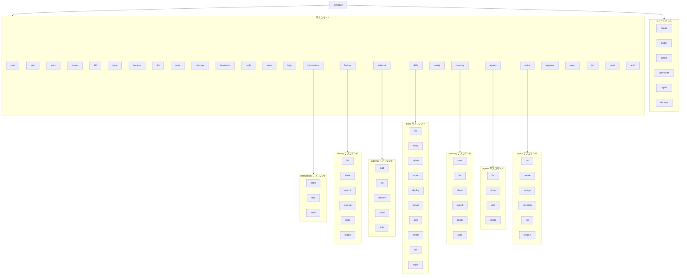
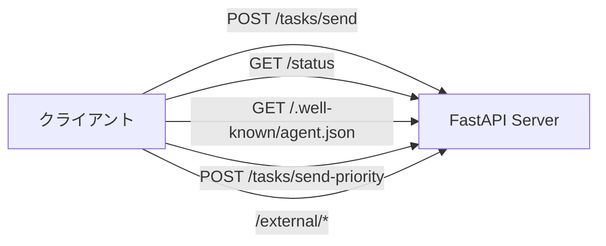
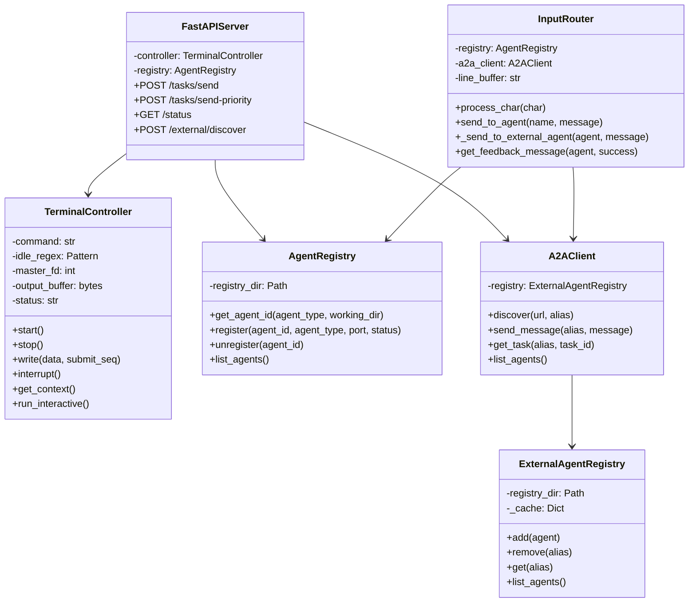

# References: API / CLI リファレンス

Synapse A2A の API、CLI、設定の完全リファレンスです。

---

## 1. CLI コマンドリファレンス

### 1.1 コマンド一覧


```mermaid
flowchart TB
    synapse["synapse"]

    subgraph Shortcuts["ショートカット"]
        claude["claude"]
        codex["codex"]
        gemini["gemini"]
        opencode["opencode"]
        copilot["copilot"]
        dummy["dummy"]
    end

    subgraph Commands["サブコマンド"]
        start["start"]
        stop["stop"]
        team["team"]
        spawn["spawn"]
        kill["kill"]
        jump["jump"]
        rename["rename"]
        list["list"]
        send["send"]
        interrupt["interrupt"]
        broadcast["broadcast"]
        reply["reply"]
        trace["trace"]
        logs["logs"]
        instructions["instructions"]
        history["history"]
        external["external"]
        skills["skills"]
        config["config"]
        memory["memory"]
        agents["agents"]
        tasks["tasks"]
        approve["approve"]
        reject["reject"]
        init["init"]
        reset["reset"]
        auth["auth"]
    end

    subgraph Memory["memory サブコマンド"]
        mem_save["save"]
        mem_list["list"]
        mem_show["show"]
        mem_search["search"]
        mem_delete["delete"]
        mem_stats["stats"]
    end

    subgraph Instructions["instructions サブコマンド"]
        inst_show["show"]
        inst_files["files"]
        inst_send["send"]
    end

    subgraph External["external サブコマンド"]
        ext_add["add"]
        ext_list["list"]
        ext_remove["remove"]
        ext_send["send"]
        ext_info["info"]
    end

    subgraph History["history サブコマンド"]
        hist_list["list"]
        hist_show["show"]
        hist_search["search"]
        hist_cleanup["cleanup"]
        hist_stats["stats"]
        hist_export["export"]
    end

    subgraph Skills["skills サブコマンド"]
        sk_list["list"]
        sk_show["show"]
        sk_delete["delete"]
        sk_move["move"]
        sk_deploy["deploy"]
        sk_import["import"]
        sk_add["add"]
        sk_create["create"]
        sk_set["set"]
        sk_apply["apply"]
    end

    subgraph Agents["agents サブコマンド"]
        ag_list["list"]
        ag_show["show"]
        ag_add["add"]
        ag_delete["delete"]
    end

    subgraph Tasks["tasks サブコマンド"]
        ts_list["list"]
        ts_create["create"]
        ts_assign["assign"]
        ts_complete["complete"]
        ts_fail["fail"]
        ts_reopen["reopen"]
    end

    synapse --> Shortcuts
    synapse --> Commands
    memory --> Memory
    instructions --> Instructions
    external --> External
    history --> History
    skills --> Skills
    agents --> Agents
    tasks --> Tasks
```

---

### 1.2 synapse \<profile\>

インタラクティブモードでエージェントを起動します。

```bash
synapse <profile> [--port PORT]
```

| 引数 | 必須 | 説明 |
|------|------|------|
| `profile` | Yes | エージェントプロファイル名 |
| `--port` | No | サーバーポート（デフォルト: プロファイル別） |

**例**:

```bash
synapse claude
synapse codex --port 8120
synapse gemini --port 8110
```

**デフォルトポート**:

| プロファイル | ポート |
|-------------|--------|
| claude | 8100-8109 |
| gemini | 8110-8119 |
| codex | 8120-8129 |
| opencode | 8130-8139 |
| copilot | 8140-8149 |
| dummy | 8190 |

---

### 1.3 synapse start

バックグラウンドでエージェントを起動します。

```bash
synapse start <profile> [--port PORT] [--foreground]
```

| 引数 | 必須 | 説明 |
|------|------|------|
| `profile` | Yes | エージェントプロファイル名 |
| `--port` | No | サーバーポート |
| `--foreground`, `-f` | No | フォアグラウンドで起動 |

**例**:

```bash
synapse start claude --port 8100
synapse start codex --foreground
```

**ログ出力先**: `~/.synapse/logs/<profile>.log`

---

### 1.4 synapse stop

実行中のエージェントを停止します。

```bash
synapse stop <profile|id>
```

| 引数 | 必須 | 説明 |
|------|------|------|
| `profile` または `id` | Yes | 停止するプロファイル名、またはエージェントID |
| `--all`, `-a` | No | 指定したプロファイルの全インスタンスを停止（ID指定時は無視） |

**動作**:
1. Registry からエージェントを検索（ID完全一致またはプロファイル名）
2. PID に SIGTERM を送信
3. Registry から登録解除

---

### 1.5 synapse list

実行中のエージェント一覧を Rich TUI で表示します。ファイルウォッチャーにより、エージェントのステータス変更時に自動更新されます。

```bash
synapse list
```

**出力形式（Rich TUI）**:

```
╭─────────────── Synapse A2A v0.2.30 - Agent List ───────────────╮
│ ╭───┬──────────────────────┬──────────┬────────────┬───────────┬───────────┬────────────┬──────────────╮ │
│ │ # │ ID                   │ NAME     │ STATUS     │ CURRENT   │ TRANSPORT │ WORKING_DIR│ EDITING_FILE │ │
│ ├───┼──────────────────────┼──────────┼────────────┼───────────┼───────────┼────────────┼──────────────┤ │
│ │ 1 │ synapse-claude-8100  │ my-claude│ PROCESSING │ Reviewing │ UDS→      │ project    │ auth.py      │ │
│ │ 2 │ synapse-gemini-8110  │ -        │ PROCESSING │ -         │ →UDS      │ other      │ -            │ │
│ │ 3 │ synapse-codex-8120   │ tester   │ READY      │ -         │ -         │ third      │ -            │ │
│ ╰───┴──────────────────────┴──────────┴────────────┴───────────┴───────────┴────────────┴──────────────┘ │
╰────────────────────── Last updated: 2024-01-15 10:30:45 ─────────────────────╯
[1-3/↑↓: select] [Enter/j: jump] [K: kill] [/: filter] [ESC: clear] [q: quit]
```

**キーボード操作**:

| キー | アクション |
|------|----------|
| 1-9 | エージェント行を選択 |
| ↑/↓ | エージェント行をナビゲート |
| Enter / j | 選択したエージェントのターミナルにジャンプ |
| K | 選択したエージェントを終了（確認ダイアログあり） |
| / | TYPE / NAME / WORKING_DIR でフィルタ |
| ESC | フィルタ/選択解除 |
| q | 終了 |

| 列 | 説明 |
|----|------|
| ID | ランタイムID（例: `synapse-claude-8100`） |
| NAME | カスタム名 |
| TYPE | エージェントタイプ（プロファイル名） |
| ROLE | エージェントの役割説明 |
| STATUS | 現在の状態（READY/PROCESSING/DONE） |
| TRANSPORT | 通信中の方式 |
| CURRENT | 現在のタスクプレビュー |
| WORKING_DIR | 作業ディレクトリ |
| SKILL_SET | 適用されているスキルセット名 |
| EDITING_FILE | 編集中のファイル（File Safety 有効時のみ表示） |

**Note**: 行を選択すると詳細パネルが表示され、Port/PID/Endpoint/フルパスなどが確認できます。

**TRANSPORT 列の値**:

| 値 | 説明 |
|----|------|
| `UDS→` | UDS（Unix Domain Socket）で送信中 |
| `TCP→` | TCP/HTTP で送信中 |
| `→UDS` | UDS で受信中 |
| `→TCP` | TCP で受信中 |
| `-` | 通信なし |

---

### 1.5.1 synapse team start

複数エージェントを分割ペインで起動します。

**デフォルト動作**: 1番目のエージェントが現在のターミナルを引き継ぎ（handoff）、2番目以降が新しいペインで起動します。

```bash
synapse team start <agent_spec1> <agent_spec2> ... [--layout split|horizontal|vertical] [--all-new] [-- tool_args...]
```

**エージェント指定（agent_spec）の形式**:

- `profile`: エージェントプロファイル名（例: `claude`）
- `saved_agent_id`: 保存済みエージェントID（例: `silent-snake`）
- `saved_agent_name`: 保存済みエージェント名（例: `狗巻棘`）
- `profile:name`: 名前を指定
- `profile:name:role`: 名前とロールを指定
- `profile:name:role:skill_set`: 名前、ロール、スキルセットを指定
- `profile:name:role:skill_set:port`: 名前、ロール、スキルセット、ポートを指定

| 引数 | 必須 | 説明 |
|------|------|------|
| `agents` | Yes | 起動するエージェントスペック（複数指定） |
| `--layout` | No | ペインレイアウト (`split`, `horizontal`, `vertical`) |
| `--all-new` | No | 全エージェントを新しいペインで起動（現在のターミナルは残る） |
| `-- tool_args...` | No | `--` の後の引数はすべて起動される CLI ツールに渡される（例: `-- --worktree` で Claude に git worktree 分離を適用） |

**対応ターミナル**:
- `tmux`
- `iTerm2`
- `Terminal.app`（タブで起動）
- `Ghostty`（AppleScript Cmd+D による分割ペイン）
  - **制約**: Ghostty は AppleScript でフォーカス中のウィンドウ/タブを対象にするため、`spawn` や `team start` の実行中にタブを切り替えると、意図しないタブにエージェントがスポーンされます。コマンド完了まで操作を待ってください。
- `zellij`

**例**:

```bash
synapse team start claude gemini codex              # claude=ここ、他=新ペイン
synapse team start silent-snake gemini              # saved_agent_id で起動
synapse team start 狗巻棘 gemini:伏黒恵              # saved_agent_name で起動
synapse team start claude gemini --layout horizontal
synapse team start claude gemini --all-new          # 全員新ペイン
synapse team start claude gemini -- --dangerously-skip-permissions  # ツール引数を渡す
synapse team start claude gemini -- --worktree  # --worktree は全エージェントに渡されるが、Claude のみが使用
# 非 Claude エージェントが未知のフラグでエラーになる可能性がある場合は Claude のみを対象に:
synapse team start claude -- --worktree
```

**重複名ガード**:
- `team start` は起動前に custom name の重複を検証し、重複時はエラー終了します
- 保存済みエージェントを指定した場合も、解決後の `name` で同じ重複検証を行います

---

### 1.5.2 synapse spawn

**サブエージェント委任コマンド。** 親が子エージェントを生成し、サブタスクを委任します（コンテキスト保護・効率化・精度向上のため）。ライフサイクル: spawn → send → evaluate → kill。ユーザーがエージェント数を指定した場合はそれに従い（最優先）、指定がなければ親がタスク構造から判断します。詳細は `guides/usage.md` の「2.2.3 エージェント単体起動」を参照。

```bash
synapse spawn <profile|saved_agent_id|saved_agent_name> [--port PORT] [--name NAME] [--role ROLE] [--skill-set SET] [--terminal TERM] [-- tool_args...]
```

| 引数 | 必須 | 説明 |
|------|------|------|
| `profile` | Yes | エージェントプロファイル名、または保存済みエージェントの ID / 名前 |
| `--port` | No | サーバーポート |
| `--name` | No | カスタム名 |
| `--role` | No | ロール説明（`@path` でファイルから読み込み可） |
| `--skill-set` | No | スキルセット名 |
| `--terminal` | No | 使用するターミナル (`tmux`, `iterm2`, `terminal_app`, `ghostty`, `vscode`, `zellij`) |
| `-- tool_args...` | No | `--` の後の引数はすべて起動される CLI ツールに渡される（例: `-- --worktree` で git worktree 分離を適用、Claude のみ） |

**動作**:
- 新しいペイン/ウィンドウでエージェントを起動
- 自動的に `--no-setup --headless` フラグを付与（対話型セットアップと承認のスキップ）
- 起動成功後、エージェント ID とポートを出力
- 親エージェントは `synapse list` で READY 確認後にタスクを送信し、結果評価後に `synapse kill -f` で終了させる
- `--name` が既存エージェントと重複する場合は起動前にエラー終了

**保存済みエージェント解決**:
- 引数が `claude/codex/gemini/opencode/copilot` のいずれかならプロファイルとして起動
- それ以外は `synapse agents` で保存した定義を **ID 完全一致 → 名前完全一致** の順で解決して起動

---

### 1.5.3 synapse agents

保存済みエージェント定義（再利用可能な起動テンプレート）を管理します。

```bash
synapse agents list
synapse agents show <id-or-name>
synapse agents add <id> --name <name> --profile <profile> [--role <role>] [--skill-set <set>] [--scope project|user]
synapse agents delete <id-or-name>
```

| コマンド | 説明 |
|---------|------|
| `list` | 保存済みエージェント一覧を表示（TTY では Rich TUI テーブル） |
| `show` | 1件の詳細を表示 |
| `add` | 定義を作成/更新（`id` は エージェントID形式: `silent-snake`） |
| `delete` | ID または名前で削除 |

**例（狗巻棘）**:

```bash
synapse agents add silent-snake --name 狗巻棘 --profile codex --role @./roles/reviewer.md --skill-set architect --scope project
synapse agents list
synapse agents show 狗巻棘
synapse spawn 狗巻棘
```

**終了時保存プロンプト**:
- 対話起動の終了時に「このエージェント定義を保存するか」を確認します
- 無効化する場合: `SYNAPSE_AGENT_SAVE_PROMPT_ENABLED=false`
- 実際のプロンプト:
  `Save this agent definition for reuse? [y/N]:`
- `--headless` / 非TTY環境では表示されません
- `synapse stop ...` / `synapse kill ...` で停止した場合は表示されません

---

### 1.6 synapse send

エージェントにメッセージを送信します。

```bash
synapse send <target> <message|--message-file PATH|--stdin> [--from AGENT_ID] [--priority N] [--attach PATH] [--wait | --notify | --silent]
```

**ターゲット指定方法**:

| 形式 | 例 | 説明 |
|-----|---|------|
| カスタム名 | `my-claude` | 最優先、レジストリの名前でマッチ |
| フルランタイムID | `synapse-claude-8100` | 完全なランタイムID |
| タイプ-ポート | `claude-8100` | 同タイプが複数ある場合 |
| エージェントタイプ | `claude` | 単一インスタンスの場合のみ |

| 引数 | 必須 | 説明 |
|------|------|------|
| `target` | Yes | 送信先エージェント（上記形式） |
| `message` | No | メッセージ内容（positional / `--message-file` / `--stdin` のいずれか） |
| `--message-file`, `-F` | No | ファイルからメッセージ読み込み（`-` で stdin） |
| `--stdin` | No | 標準入力からメッセージ読み込み |
| `--from`, `-f` | No | 送信元エージェントID（省略可: `SYNAPSE_AGENT_ID` から自動検出） |
| `--priority`, `-p` | No | 優先度 1-5（デフォルト: 3） |
| `--attach`, `-a` | No | ファイル添付（複数指定可） |
| `--wait` | No | 同期待機モード - 送信側がブロックして `synapse reply` を待つ |
| `--notify` | No | 非同期通知モード - タスク完了時に通知を受け取る（デフォルト） |
| `--silent` | No | ワンウェイモード - 送りっぱなし、返信・通知不要 |
| `--callback` | No | タスク完了時（completed/failed）に送信側で実行するコマンド（--silent時のみ） |
| `--force` | No | 作業ディレクトリの不一致チェックをバイパスして送信 |

**Note**: `a2a.flow=auto`（デフォルト）の場合、フラグなしは `--notify`（非同期通知）になります。
**Note**: メッセージの入力元は **positional / `--message-file` / `--stdin` のいずれか1つ** を指定します。
**Note**: 送信元の CWD とターゲットの `working_dir` が異なる場合、警告を表示して終了コード 1 で終了します。`--force` でバイパスできます。

**レスポンスモードの使い分け**:

| メッセージ種類 | モード | 例 |
|---------------|--------|-----|
| 質問 | `--wait` | "現在のステータスは？" |
| 分析依頼 | `--wait` | "このコードをレビューして" |
| 結果を期待するタスク | `--notify` | "テストを実行して結果を報告して" |
| 委任タスク（fire-and-forget） | `--silent` | "このバグを修正してコミットして" |
| 通知 | `--silent` | "FYI: ビルドが完了しました" |

デフォルトは `--notify`（非同期通知）です。

**例**:

```bash
# 結果を期待するタスク（非同期通知 - デフォルト）
synapse send codex "結果を教えて" --notify

# 同期待機（レスポンスを待つ）
synapse send codex "進捗を報告して" --wait

# 委任タスク、fire-and-forget
synapse send codex "設計して" --silent

synapse send claude "Hello!"                                  # --from 自動検出
synapse send claude-8100 "Hello"                               # 同タイプが複数の場合
synapse send gemini "止まれ" -p 5
synapse send codex --message-file ./message.txt --silent
echo "from stdin" | synapse send codex --stdin --silent
synapse send codex "このファイルを見て" -a ./a.py -a ./b.txt --silent
synapse send codex "設計して" --force                           # 作業ディレクトリ不一致でも送信
synapse send claude "Hello!" --from synapse-codex-8121         # 明示指定（サンドボックス環境向け）
```

---

### 1.6.1 synapse broadcast

現在の作業ディレクトリ（`working_dir`）と一致する全エージェントにメッセージを送信します。

```bash
synapse broadcast <message> [--from AGENT_ID] [--priority N] [--wait | --notify | --silent]
```

| 引数 | 必須 | 説明 |
|------|------|------|
| `message` | Yes | 一括送信するメッセージ |
| `--from`, `-f` | No | 送信元エージェントID（省略可: 自動検出。指定時は送信元自身を除外） |
| `--priority`, `-p` | No | 優先度 1-5（デフォルト: 1） |
| `--wait` | No | 同期待機モード - 各送信先で応答待ち |
| `--notify` | No | 非同期通知モード - 各送信先の完了通知を受け取る（デフォルト） |
| `--silent` | No | ワンウェイモード - 各送信先へ送りっぱなし |

**一致ルール**:
- `Path.cwd().resolve()` と各エージェントの `working_dir` 実パスが完全一致した場合のみ対象
- 対象が0件の場合はエラー終了
- 一部失敗しても残りには送信を継続し、最後に `Sent` / `Failed` を表示

**例**:

```bash
synapse broadcast "進捗を報告してください"                       # --from 自動検出（自身を除外）
synapse broadcast "緊急確認" -p 4 --wait
synapse broadcast "FYI: CI通過" --silent
```

---

### 1.6.2 synapse interrupt

エージェントにソフト割り込みメッセージを送信します。`synapse send <target> <message> -p 4 --silent` の簡易コマンドです。

```bash
synapse interrupt <target> <message> [--from AGENT_ID] [--force]
```

| 引数 | 必須 | 説明 |
|------|------|------|
| `target` | Yes | 送信先エージェント（名前、ID、タイプ等） |
| `message` | Yes | 割り込みメッセージ |
| `--from`, `-f` | No | 送信元エージェントID（省略可: 自動検出） |
| `--force` | No | 作業ディレクトリの不一致チェックをバイパスして送信 |

**動作**: 優先度 4 で fire-and-forget メッセージを送信します。応答は待ちません。送信元の CWD とターゲットの `working_dir` が異なる場合、警告を表示して終了コード 1 で終了します。`--force` でバイパスできます。

**例**:

```bash
synapse interrupt claude "Stop and review"
synapse interrupt gemini "Check status"                           # --from 自動検出
synapse interrupt claude "Stop" --force   # 作業ディレクトリ不一致でも送信
```

---

### 1.7 synapse reply

最後に受信したA2Aメッセージに返信します。Synapseは返信を期待するメッセージの送信者情報を自動的に追跡します。

```bash
synapse reply [message] [--from AGENT_ID] [--to SENDER_ID] [--list-targets]
```

| 引数 | 必須 | 説明 |
|------|------|------|
| `message` | No | 返信メッセージ内容（`--list-targets` 使用時は省略可） |
| `--from`, `-f` | No | 送信元エージェントID（省略可: 自動検出。サンドボックス環境で必要な場合あり） |
| `--to` | No | 返信先の sender_id を指定（複数の送信者がいる場合に使用） |
| `--list-targets` | No | 返信可能なターゲット一覧を表示して終了 |

**例**:

```bash
# 最新の送信者に返信（デフォルト LIFO）
synapse reply "分析結果です..."

# 特定の送信者に返信
synapse reply "タスク完了しました" --to synapse-claude-8100

# 返信可能なターゲットを確認
synapse reply --list-targets
```

**動作**:
1. 自身のエージェントの返信追跡マップから送信者情報を取得（`--to` 指定時は特定の送信者を取得）
2. 送信者のエンドポイントに返信を送信
3. 成功後、送信者情報を削除

---

### 1.7.1 synapse trace

タスクIDに対して、task history と file-safety の変更履歴（同一 task_id）をまとめて表示します。

```bash
synapse trace <task_id>
```

**例**:

```bash
synapse trace 4d5e61ee-be97-4922-bdbd-ac1108b8d1c9
```

---

### 1.8 synapse logs

エージェントのログを表示します。

```bash
synapse logs <profile> [-f] [-n LINES]
```

| 引数 | 必須 | 説明 |
|------|------|------|
| `profile` | Yes | プロファイル名 |
| `-f`, `--follow` | No | リアルタイム追跡 |
| `-n`, `--lines` | No | 表示行数（デフォルト: 50） |

**例**:

```bash
synapse logs claude
synapse logs codex -f
synapse logs gemini -n 100
```

---

### 1.9 synapse instructions

初期インストラクションを管理・送信します。

```bash
synapse instructions <command> [options]
```

#### 1.9.1 synapse instructions show

エージェントのインストラクション内容を表示します。

```bash
synapse instructions show [agent_type]
```

| 引数 | 必須 | 説明 |
|------|------|------|
| `agent_type` | No | エージェントタイプ（claude, gemini, codex）。省略時はデフォルト設定を表示 |

**例**:

```bash
synapse instructions show
synapse instructions show claude
synapse instructions show gemini
```

#### 1.9.2 synapse instructions files

エージェントが読み込むインストラクションファイル一覧を表示します。

```bash
synapse instructions files [agent_type]
```

| 引数 | 必須 | 説明 |
|------|------|------|
| `agent_type` | No | エージェントタイプ。省略時はデフォルト設定を表示 |

**例**:

```bash
synapse instructions files claude
```

**出力例**:

```
Instruction files for 'claude':
  - .synapse/default.md
```

ファイルの場所に応じて `.synapse/`（プロジェクト）または `~/.synapse/`（ユーザー）が表示されます。

#### 1.9.3 synapse instructions send

実行中のエージェントに初期インストラクションを送信します。

```bash
synapse instructions send <target> [--preview]
```

| 引数 | 必須 | 説明 |
|------|------|------|
| `target` | Yes | 送信先（プロファイル名またはエージェントID） |
| `--preview`, `-p` | No | 実際に送信せずプレビューのみ表示 |

**例**:

```bash
# プロファイル名で送信
synapse instructions send claude

# エージェントIDで送信
synapse instructions send synapse-claude-8100

# プレビュー（送信しない）
synapse instructions send claude --preview
```

**ユースケース**:

| シチュエーション | コマンド |
|----------------|----------|
| `--resume` 後に A2A 機能が必要になった | `synapse instructions send claude` |
| エージェントがインストラクションを忘れた | `synapse instructions send <agent>` |
| 送信前に内容を確認したい | `synapse instructions send <agent> --preview` |

---

### 1.10 synapse external

外部 Google A2A エージェントを管理します。

```bash
synapse external <command> [options]
```

#### 1.10.1 synapse external add

外部エージェントを発見して登録します。

```bash
synapse external add <url> [--alias ALIAS]
```

| 引数 | 必須 | 説明 |
|------|------|------|
| `url` | Yes | エージェントの URL |
| `--alias`, `-a` | No | ショートネーム（省略時は自動生成） |

**例**:

```bash
synapse external add https://agent.example.com
synapse external add http://localhost:9000 --alias myagent
```

#### 1.10.2 synapse external list

登録済み外部エージェントの一覧を表示します。

```bash
synapse external list
```

**出力形式**:

```
ALIAS           NAME                 URL                                      LAST SEEN
------------------------------------------------------------------------------------------
myagent         My Agent             http://localhost:9000                    2024-01-15T10:30:00
example         Example Agent        https://agent.example.com                Never
```

#### 1.10.3 synapse external remove

外部エージェントを登録解除します。

```bash
synapse external remove <alias>
```

| 引数 | 必須 | 説明 |
|------|------|------|
| `alias` | Yes | 削除するエージェントの alias |

#### 1.10.4 synapse external send

外部エージェントにメッセージを送信します。

```bash
synapse external send <alias> <message> [--wait]
```

| 引数 | 必須 | 説明 |
|------|------|------|
| `alias` | Yes | 送信先エージェントの alias |
| `message` | Yes | メッセージ内容 |
| `--wait`, `-w` | No | 完了を待つ |

**例**:

```bash
synapse external send myagent "Hello!"
synapse external send myagent "Process this" --wait
```

#### 1.10.5 synapse external info

外部エージェントの詳細情報を表示します。

```bash
synapse external info <alias>
```

**出力例**:

```
Name: My Agent
Alias: myagent
URL: http://localhost:9000
Description: An example agent
Added: 2024-01-15T10:00:00Z
Last Seen: 2024-01-15T10:30:00Z

Capabilities:
  streaming: False
  multiTurn: True

Skills:
  - chat
    Send messages to the agent
  - analyze
    Analyze provided content
```

---

### 1.11 synapse skills

スキルの発見・管理・デプロイを行います。引数なしで TUI モードが起動します。

```bash
synapse skills [subcommand]
```

**TUI モード（引数なし）**では以下のフローで操作します：

1. トップメニュー → **Manage Skills** を選択
2. **スコープ選択**（Synapse / User / Project）— PLUGIN スコープは除外
3. 選択したスコープのスキル一覧 — 各行に `[C✓ A✓ G·]` インジケーター付き
4. スキル詳細 — Deploy Status セクションで User/Project 両スコープの全エージェントへのデプロイ状態を表示

**エージェントディレクトリインジケーター**:

| 記号 | ディレクトリ | 対象エージェント |
|------|-------------|-----------------|
| **C** | `.claude/skills/` | Claude |
| **A** | `.agents/skills/` | Codex, OpenCode, Copilot, Gemini |

`✓` = 存在する、`·` = 存在しない

#### 1.11.1 synapse skills list

発見されたスキルを一覧表示します。

```bash
synapse skills list [--scope SCOPE]
```

| 引数 | 必須 | 説明 |
|------|------|------|
| `--scope` | No | フィルタするスコープ（`synapse`, `user`, `project`, `plugin`） |

#### 1.11.2 synapse skills show

スキルの詳細情報を表示します。

```bash
synapse skills show <name> [--scope SCOPE]
```

| 引数 | 必須 | 説明 |
|------|------|------|
| `name` | Yes | スキル名 |
| `--scope` | No | 対象スコープ |

#### 1.11.3 synapse skills delete

スキルを削除します。Plugin スコープのスキルは削除できません。

```bash
synapse skills delete <name> [--force] [--scope SCOPE]
```

| 引数 | 必須 | 説明 |
|------|------|------|
| `name` | Yes | スキル名 |
| `--force` | No | 確認なしで削除 |
| `--scope` | No | 対象スコープ |

#### 1.11.4 synapse skills move

スキルを別のスコープに移動します。

```bash
synapse skills move <name> --to <scope>
```

| 引数 | 必須 | 説明 |
|------|------|------|
| `name` | Yes | スキル名 |
| `--to` | Yes | 移動先スコープ（`user`, `project`） |

#### 1.11.5 synapse skills deploy

中央ストア（`~/.synapse/skills/`）からエージェントディレクトリにスキルをデプロイします。

```bash
synapse skills deploy <name> [--agent AGENTS] [--scope SCOPE]
```

| 引数 | 必須 | 説明 |
|------|------|------|
| `name` | Yes | スキル名 |
| `--agent` | No | 対象エージェント（カンマ区切り: `claude,codex,gemini`） |
| `--scope` | No | デプロイスコープ（`user` または `project`、デフォルト: `user`） |

**例**:

```bash
synapse skills deploy code-quality --agent claude,codex --scope project
```

#### 1.11.6 synapse skills import

エージェントディレクトリのスキルを中央ストアにインポートします。

```bash
synapse skills import <name> [--from SCOPE]
```

| 引数 | 必須 | 説明 |
|------|------|------|
| `name` | Yes | スキル名 |
| `--from` | No | インポート元スコープ（`user` または `project`） |

#### 1.11.7 synapse skills add

リポジトリからスキルをインストールします（`npx skills add` ラッパー）。

```bash
synapse skills add <repo>
```

| 引数 | 必須 | 説明 |
|------|------|------|
| `repo` | Yes | リポジトリ（例: `s-hiraoku/synapse-a2a`） |

**動作**: `npx skills add <repo> -g -a claude-code -y` を実行し、新規スキルを自動的に `~/.synapse/skills/` にインポートします。

#### 1.11.8 synapse skills create

新しいスキルのテンプレートを中央ストア（`~/.synapse/skills/`）に作成します。引数なしで実行すると、スキル名の入力を求められます。

```bash
synapse skills create [name]
```

| 引数 | 必須 | 説明 |
|------|------|------|
| `name` | No | 作成するスキル名 |

> **Note:** `synapse skills` (TUI) の "Create Skill" オプションを選択すると、`anthropic-skill-creator` を使用した対話的なスキル作成のガイダンスが表示されます。

#### 1.11.9 synapse skills set list

登録済みスキルセット一覧を表示します。

```bash
synapse skills set list
```

#### 1.11.10 synapse skills set show

スキルセットの詳細を表示します。

```bash
synapse skills set show <name>
```

| 引数 | 必須 | 説明 |
|------|------|------|
| `name` | Yes | スキルセット名 |

> **Note:** スキルセットを選択してエージェントを起動すると、スキルセットの詳細（名前・説明・含まれるスキル一覧）が初期インストラクションに自動的に含まれます。これによりエージェントは自分に割り当てられたスキルセットの目的と利用可能なスキルを認識できます。

#### 1.11.11 synapse skills apply

稼働中のエージェントにスキルセットを適用します。スキルファイルをエージェントのスキルディレクトリにコピーし、レジストリの `skill_set` フィールドを更新し、スキルセット情報を A2A 経由でエージェントに送信します。

```bash
synapse skills apply <target> <set_name> [--dry-run]
```

| 引数 | 必須 | 説明 |
|------|------|------|
| `target` | Yes | 対象エージェント（名前、ID、タイプ等） |
| `set_name` | Yes | 適用するスキルセット名 |
| `--dry-run` | No | 変更をプレビューするのみ（実際には適用しない） |

**例**:

```bash
synapse skills apply my-claude manager
synapse skills apply gemini-8110 developer --dry-run
```

---

### 1.12 synapse config

インタラクティブな TUI で設定を編集します。

```bash
synapse config [--scope SCOPE]
```

| 引数 | 必須 | 説明 |
|------|------|------|
| `--scope` | No | 編集するスコープ（`user` または `project`）。省略時はプロンプトで選択 |

**例**:

```bash
synapse config                  # インタラクティブモード（スコープを選択）
synapse config --scope user     # ユーザー設定を直接編集
synapse config --scope project  # プロジェクト設定を直接編集
```

**対話フロー**:

```
? Which settings file do you want to edit?
  ❯ User settings (~/.synapse/settings.json)
    Project settings (./.synapse/settings.json)
    Cancel

? Select a category to configure:
  ❯ Environment Variables - Configure SYNAPSE_* environment variables
    Instructions - Configure agent-specific instruction files
    A2A Protocol - Configure inter-agent communication settings
    Resume Flags - Configure CLI flags that indicate resume mode
    Save and exit
    Exit without saving
```

**カテゴリ**:

| カテゴリ | 編集対象 |
|----------|----------|
| Environment Variables | `env.SYNAPSE_*` 環境変数 |
| Instructions | `instructions.{default,claude,gemini,codex,opencode}` |
| Approval Mode | `approvalMode` (required/auto) |
| A2A Protocol | `a2a.flow` (auto/roundtrip/oneway) |
| Resume Flags | `resume_flags.{claude,codex,gemini,opencode,copilot}` |

---

### 1.13 synapse config show

現在の設定を表示します（読み取り専用）。

```bash
synapse config show [--scope SCOPE]
```

| 引数 | 必須 | 説明 |
|------|------|------|
| `--scope` | No | 表示するスコープ（`user`, `project`, または `merged`）。省略時は `merged` |

**例**:

```bash
synapse config show                  # マージ済み設定を表示（デフォルト）
synapse config show --scope user     # ユーザー設定のみ表示
synapse config show --scope project  # プロジェクト設定のみ表示
```

**出力例**:

```
Current settings (merged from all scopes):
------------------------------------------------------------
{
  "env": {
    "SYNAPSE_HISTORY_ENABLED": "true",
    "SYNAPSE_FILE_SAFETY_ENABLED": "true",
    ...
  },
  "instructions": {
    "default": "[SYNAPSE INSTRUCTIONS...]",
    ...
  },
  "approvalMode": "required",
  "a2a": { "flow": "auto" },
  "resume_flags": { ... }
}
```

---

### 1.14 synapse kill

実行中のエージェントをグレースフルシャットダウンします。

```bash
synapse kill <TARGET> [--force]
```

| 引数 | 必須 | 説明 |
|------|------|------|
| `TARGET` | Yes | エージェント名、ID（`synapse-claude-8100`）、type-port（`claude-8100`）、またはタイプ |
| `--force`, `-f` | No | 確認なしで即時終了（SIGKILL） |

**ターゲット解決の優先順位**:
1. カスタム名（`my-claude`）— 最優先
2. フルランタイムID（`synapse-claude-8100`）
3. type-port 省略形（`claude-8100`）
4. エージェントタイプ（`claude`）— 単一インスタンスの場合のみ

**グレースフルシャットダウンフロー**（`--force` なしの場合）:
1. HTTP シャットダウンリクエスト送信（最大10秒）
2. 猶予期間（残り時間の1/3、最低1秒）
3. SIGTERM 送信
4. エスカレーション待機（残りの時間）
5. プロセスが残っている場合 SIGKILL

デフォルトタイムアウトは30秒（`settings.json` の `shutdown.timeout_seconds` で変更可能）。

**例**:

```bash
synapse kill my-claude                  # カスタム名で指定
synapse kill synapse-claude-8100        # フルIDで指定
synapse kill claude-8100                # type-port で指定
synapse kill claude                     # タイプで指定（単一インスタンスの場合）
synapse kill claude -f                  # 確認なし即時終了
```

---

### 1.15 synapse jump

実行中のエージェントのターミナルウィンドウにジャンプします。

```bash
synapse jump <TARGET>
```

| 引数 | 必須 | 説明 |
|------|------|------|
| `TARGET` | Yes | エージェント名、ID、type-port、またはタイプ |

**対応ターミナル**: iTerm2, Terminal.app, Ghostty, VS Code, tmux, Zellij

> **Ghostty の制約**: Ghostty は AppleScript を使用して現在フォーカスされているウィンドウやタブを対象にします。`spawn` や `team start` の実行中にタブを切り替えると、意図しないタブにエージェントがスポーンされる可能性があるため、完了まで操作を控えてください。

**例**:

```bash
synapse jump my-claude                  # カスタム名で指定
synapse jump synapse-claude-8100        # フルIDで指定
synapse jump claude                     # タイプで指定（単一インスタンスの場合）
```

---

### 1.16 synapse rename

実行中のエージェントにカスタム名やロールを設定します。

```bash
synapse rename <TARGET> [--name NAME] [--role ROLE] [--clear]
```

| 引数 | 必須 | 説明 |
|------|------|------|
| `TARGET` | Yes | エージェント名、ID、type-port、またはタイプ |
| `--name`, `-n` | No | カスタム名 |
| `--role`, `-r` | No | ロール（役割の説明。`@path` でファイルから読み込み可） |
| `--clear`, `-c` | No | 名前とロールをクリア |

**例**:

```bash
synapse rename synapse-claude-8100 --name my-claude
synapse rename my-claude --role "コードレビュー担当"
synapse rename claude --name reviewer --role "全PRをレビュー"
synapse rename my-claude --clear                          # 名前・ロールをクリア
```

---

### 1.17 synapse init

Synapse 設定を初期化します（`.synapse/settings.json` の作成とスキルのコピー）。

```bash
synapse init [--scope SCOPE]
```

| 引数 | 必須 | 説明 |
|------|------|------|
| `--scope` | No | `user`（`~/.synapse`）または `project`（`./.synapse`）。省略時はインタラクティブ選択 |

**例**:

```bash
synapse init                    # インタラクティブにスコープ選択
synapse init --scope user       # ユーザースコープに作成
synapse init --scope project    # プロジェクトスコープに作成
```

---

### 1.18 synapse reset

設定をデフォルト値にリセットし、スキルを再インストールします。

```bash
synapse reset [--scope SCOPE] [--force]
```

| 引数 | 必須 | 説明 |
|------|------|------|
| `--scope` | No | `user`、`project`、または `both`。省略時はインタラクティブ選択 |
| `--force`, `-f` | No | 確認プロンプトをスキップ |

**例**:

```bash
synapse reset                        # インタラクティブにスコープ選択
synapse reset --scope user           # ユーザー設定をリセット
synapse reset --scope project        # プロジェクト設定をリセット
synapse reset --scope both -f        # 両方を確認なしでリセット
```

---

### 1.19 synapse auth

API キー認証の管理コマンドです。`SYNAPSE_AUTH_ENABLED=true` で認証を有効化します。

#### synapse auth setup

API キーを生成し、セットアップ手順を表示します。

```bash
synapse auth setup
```

2つのキー（API キーと管理キー）を生成し、環境変数の設定例を表示します。

#### synapse auth generate-key

API キーを生成します。

```bash
synapse auth generate-key [--count N] [--export]
```

| 引数 | 必須 | 説明 |
|------|------|------|
| `--count`, `-n` | No | 生成するキーの数（デフォルト: 1） |
| `--export`, `-e` | No | `export SYNAPSE_API_KEYS=...` 形式で出力 |

**例**:

```bash
synapse auth setup                   # セットアップガイドを表示
synapse auth generate-key            # キーを1つ生成
synapse auth generate-key -n 3 -e    # 3つのキーをexport形式で生成
```

---

### 1.20 synapse tasks

共有タスクボード（B1: Shared Task Board）を管理します。SQLite ベースのタスク協調基盤です。

```bash
synapse tasks <subcommand>
```

#### 1.20.1 synapse tasks list

タスクボードのタスク一覧を表示します。

```bash
synapse tasks list [--status STATUS] [--agent AGENT]
```

| 引数 | 必須 | 説明 |
|------|------|------|
| `--status` | No | フィルタするステータス（`pending`, `in_progress`, `completed`, `failed`） |
| `--agent` | No | 担当エージェントでフィルタ |

#### 1.20.2 synapse tasks create

タスクボードにタスクを作成します。

```bash
synapse tasks create <subject> [-d DESCRIPTION] [--blocked-by IDS] [--priority N]
```

| 引数 | 必須 | 説明 |
|------|------|------|
| `subject` | Yes | タスクの件名 |
| `-d`, `--description` | No | タスクの詳細説明 |
| `--blocked-by` | No | このタスクをブロックするタスク ID（カンマ区切り） |
| `-p`, `--priority` | No | 優先度 1-5（デフォルト: 3、高いほど緊急） |

**優先度レベル**:

| 値 | 意味 | 用途 |
|----|------|------|
| 1 | 最低 | バックグラウンドタスク |
| 2 | 低 | 急ぎでないタスク |
| 3 | 通常 | デフォルト |
| 4 | 高 | 優先タスク |
| 5 | 最高 | 緊急・クリティカル |

**例**:

```bash
synapse tasks create "認証テスト作成" -d "JWT 認証のユニットテスト" --priority 4
synapse tasks create "認証実装" -d "テストに合わせて実装" --blocked-by task-1 --priority 4
```

#### 1.20.3 synapse tasks assign

タスクをエージェントにアサインします。

```bash
synapse tasks assign <task_id> <agent>
```

| 引数 | 必須 | 説明 |
|------|------|------|
| `task_id` | Yes | アサインするタスクの ID |
| `agent` | Yes | アサイン先のエージェント |

#### 1.20.4 synapse tasks complete

タスクを完了にします。ブロックされていた依存タスクが自動的に解除されます。

```bash
synapse tasks complete <task_id>
```

| 引数 | 必須 | 説明 |
|------|------|------|
| `task_id` | Yes | 完了にするタスクの ID |

#### 1.20.5 synapse tasks fail

タスクを失敗として報告します。`in_progress` 状態のタスクのみ対象です。

```bash
synapse tasks fail <task_id> [--reason REASON]
```

| 引数 | 必須 | 説明 |
|------|------|------|
| `task_id` | Yes | 失敗したタスクの ID |
| `-r`, `--reason` | No | 失敗理由 |

**例**:

```bash
synapse tasks fail task-1 --reason "テストが通らない"
```

#### 1.20.6 synapse tasks reopen

完了または失敗したタスクを pending に戻します。assignee と fail_reason がクリアされます。

```bash
synapse tasks reopen <task_id>
```

| 引数 | 必須 | 説明 |
|------|------|------|
| `task_id` | Yes | 再オープンするタスクの ID |

**状態遷移**:
- `completed` → `pending`
- `failed` → `pending`
- `pending` / `in_progress` → 変更なし（エラー）

**例**:

```bash
synapse tasks reopen task-1
```

#### タスクライフサイクル

```
                    claim_task()
    pending ────────────────────→ in_progress
       ▲                                │
       │                        ┌───────┴───────┐
       │                        │               │
       │                   complete_task    fail_task
       │                        │               │
       │                        ▼               ▼
       │  reopen_task       completed        failed
       ├────────────────────────┘               │
       │  reopen_task                           │
       ├────────────────────────────────────────┘
```

---

### 1.21 synapse memory

エージェント間の共有メモリ（知識ベース）を管理します。

```bash
synapse memory <subcommand>
```

#### 1.21.1 synapse memory save

メモリを保存します（key が既存の場合は UPSERT）。

```bash
synapse memory save <key> <content> [--tags TAG1,TAG2] [--notify]
```

| 引数 | 必須 | 説明 |
|------|------|------|
| `key` | Yes | メモリの一意キー（例: `auth-pattern`） |
| `content` | Yes | メモリ本文 |
| `--tags` | No | タグ（カンマ区切り、例: `architecture,auth`） |
| `--notify` | No | 保存後に `synapse broadcast` で他エージェントに通知 |

#### 1.21.2 synapse memory list

メモリ一覧を表示します。

```bash
synapse memory list [--author AUTHOR] [--tags TAGS] [--limit N]
```

| 引数 | 必須 | 説明 |
|------|------|------|
| `--author` | No | 著者（agent_id）で絞り込み |
| `--tags` | No | タグで絞り込み（カンマ区切り） |
| `--limit` | No | 表示件数上限（デフォルト: 50） |

#### 1.21.3 synapse memory show

メモリの詳細を表示します。

```bash
synapse memory show <id_or_key>
```

| 引数 | 必須 | 説明 |
|------|------|------|
| `id_or_key` | Yes | メモリの UUID またはキー |

#### 1.21.4 synapse memory search

メモリを検索します（key, content, tags を横断検索）。

```bash
synapse memory search <query>
```

| 引数 | 必須 | 説明 |
|------|------|------|
| `query` | Yes | 検索クエリ（LIKE マッチング、結果は最大100件） |

#### 1.21.5 synapse memory delete

メモリを削除します。

```bash
synapse memory delete <id_or_key> [--force]
```

| 引数 | 必須 | 説明 |
|------|------|------|
| `id_or_key` | Yes | メモリの UUID またはキー |
| `--force` | No | 確認なしで削除 |

#### 1.21.6 synapse memory stats

メモリの統計情報を表示します（件数、著者別、タグ別）。

```bash
synapse memory stats
```

---

## 2. HTTP API リファレンス

### 2.1 エンドポイント一覧


```mermaid
flowchart LR
    Client["クライアント"]
    Server["FastAPI Server"]

    Client -->|"POST /tasks/send"| Server
    Client -->|"GET /status"| Server
    Client -->|"GET /.well-known/agent.json"| Server
    Client -->|"POST /tasks/send-priority"| Server
    Client -->|"/external/*"| Server
```

#### Google A2A 互換 API

| メソッド | パス | 説明 |
|---------|------|------|
| GET | `/.well-known/agent.json` | Agent Card（エージェント情報） |
| POST | `/tasks/send` | Task ベースでメッセージ送信 |
| POST | `/tasks/create` | Task 作成のみ（PTY送信なし、--wait用） |
| POST | `/spawn` | エージェントを新しいペインで起動（Synapse 拡張） |
| GET | `/tasks/{id}` | Task 状態取得 |
| GET | `/tasks` | Task 一覧 |
| POST | `/tasks/{id}/cancel` | Task キャンセル |
| POST | `/tasks/send-priority` | Priority 付きメッセージ送信（Synapse 拡張） |
| GET | `/reply-stack/list` | 返信可能な sender 一覧取得 |
| GET | `/reply-stack/get` | 返信先 sender 情報取得（`?sender_id=` で指定可） |
| GET | `/reply-stack/pop` | 返信先 sender 情報取得＋削除（`?sender_id=` で指定可） |

> **Readiness Gate**: `/tasks/send` と `/tasks/send-priority` は、エージェント初期化（Identity Instruction 送信）完了前は HTTP 503（`Retry-After: 5`）を返します。Priority 5 と返信メッセージ（`in_reply_to`）はバイパスします。

#### Agent Teams API

| メソッド | パス | 説明 |
|---------|------|------|
| GET | `/tasks/board` | 共有タスクボード一覧 |
| POST | `/tasks/board` | タスクボードにタスク作成（`priority` フィールド対応） |
| POST | `/tasks/board/{id}/claim` | タスクをアトミックに取得 |
| POST | `/tasks/board/{id}/complete` | タスク完了（依存タスク自動解除） |
| POST | `/tasks/board/{id}/fail` | タスク失敗（`reason` フィールドで失敗理由を記録） |
| POST | `/tasks/board/{id}/reopen` | タスク再オープン（completed/failed → pending） |
| POST | `/tasks/{id}/approve` | プラン承認 |
| POST | `/tasks/{id}/reject` | プラン却下（理由付き） |
| POST | `/team/start` | エージェントチームをターミナルペインで起動（A2A経由） |

#### Shared Memory API

| メソッド | パス | 説明 |
|---------|------|------|
| GET | `/memory/list` | メモリ一覧取得（`?author=`, `?tags=`, `?limit=` で絞り込み） |
| POST | `/memory/save` | メモリ保存（UPSERT on key） |
| GET | `/memory/search` | メモリ検索（`?q=` で key/content/tags を横断検索、`?limit=` で件数制限、デフォルト100） |
| GET | `/memory/{id_or_key}` | メモリ詳細取得（ID またはキーで指定） |
| DELETE | `/memory/{id_or_key}` | メモリ削除 |

#### 外部エージェント管理 API

| メソッド | パス | 説明 |
|---------|------|------|
| POST | `/external/discover` | 外部エージェントを発見・登録 |
| GET | `/external/agents` | 登録済み外部エージェント一覧 |
| GET | `/external/agents/{alias}` | 外部エージェント詳細 |
| DELETE | `/external/agents/{alias}` | 外部エージェント削除 |
| POST | `/external/agents/{alias}/send` | 外部エージェントにメッセージ送信 |

---

### 2.2 POST /tasks/send

Task ベースでエージェントにメッセージを送信します。

**リクエスト**:

```http
POST /tasks/send HTTP/1.1
Host: localhost:8100
Content-Type: application/json

{
  "message": {
    "role": "user",
    "parts": [{"type": "text", "text": "メッセージ内容"}]
  }
}
```

| フィールド | 型 | 必須 | 説明 |
|-----------|-----|------|------|
| `message` | object | Yes | 送信するメッセージ |
| `message.role` | string | Yes | "user" |
| `message.parts` | array | Yes | メッセージパーツ |

**レスポンス**:

```json
{
  "task": {
    "id": "uuid-task-id",
    "status": "working",
    "artifacts": [],
    "created_at": "2025-01-15T10:00:00Z",
    "updated_at": "2025-01-15T10:00:00Z"
  }
}
```

| フィールド | 型 | 説明 |
|-----------|-----|------|
| `task.id` | string | タスク ID |
| `task.status` | string | タスク状態 |

**エラーレスポンス**:

```json
{
  "detail": "Agent not running"
}
```

| ステータスコード | 説明 |
|----------------|------|
| 200 | 成功 |
| 500 | 書き込みエラー |
| 503 | エージェント未起動、または初期化中（Readiness Gate: `Retry-After: 5` ヘッダー付き） |

**curl 例**:

```bash
curl -X POST http://localhost:8100/tasks/send \
  -H "Content-Type: application/json" \
  -d '{"message": {"role": "user", "parts": [{"type": "text", "text": "Hello!"}]}}'
```

### 2.2.1 POST /tasks/send-priority

Priority 付きでメッセージを送信します（Synapse 拡張）。

**リクエスト**:

```http
POST /tasks/send-priority?priority=3 HTTP/1.1
Host: localhost:8100
Content-Type: application/json

{
  "message": {
    "role": "user",
    "parts": [{"type": "text", "text": "メッセージ内容"}]
  }
}
```

| パラメータ | 型 | 必須 | 説明 |
|-----------|-----|------|------|
| `priority` | int | No | 優先度（1-5、デフォルト: 3） |

**Priority の動作**:

| 値 | 動作 |
|----|------|
| 1-4 | 直接 stdin に書き込み |
| 5 | SIGINT 送信後に書き込み（Readiness Gate をバイパス） |

**curl 例**:

```bash
# 通常メッセージ
curl -X POST "http://localhost:8100/tasks/send-priority?priority=3" \
  -H "Content-Type: application/json" \
  -d '{"message": {"role": "user", "parts": [{"type": "text", "text": "Hello!"}]}}'

# 緊急停止
curl -X POST "http://localhost:8100/tasks/send-priority?priority=5" \
  -H "Content-Type: application/json" \
  -d '{"message": {"role": "user", "parts": [{"type": "text", "text": "処理を止めて"}]}}'
```

---

### 2.3 GET /status

エージェントの状態とコンテキストを取得します。

**リクエスト**:

```http
GET /status HTTP/1.1
Host: localhost:8100
```

**レスポンス**:

```json
{
  "status": "READY",
  "context": "最新の出力内容（最大2000文字）"
}
```

| フィールド | 型 | 説明 |
|-----------|-----|------|
| `status` | string | 現在の状態 |
| `context` | string | 出力バッファの末尾 |

**status の値**:

| 値 | 説明 |
|----|------|
| `PROCESSING` | 処理中・起動中 |
| `READY` | 待機中（プロンプト表示） |
| `NOT_STARTED` | 未起動 |

**curl 例**:

```bash
curl http://localhost:8100/status
```

---

### 2.4 Google A2A 互換エンドポイント

#### GET /.well-known/agent.json

エージェントの Agent Card を取得します。

**レスポンス**:

```json
{
  "name": "Synapse Claude",
  "description": "PTY-wrapped claude CLI agent with A2A communication",
  "url": "http://localhost:8100",
  "version": "1.0.0",
  "capabilities": {
    "streaming": false,
    "pushNotifications": false,
    "multiTurn": true
  },
  "skills": [
    {
      "id": "chat",
      "name": "Chat",
      "description": "Send messages to the CLI agent"
    }
  ],
  "extensions": {
    "synapse": {
      "pty_wrapped": true,
      "priority_interrupt": true
    }
  }
}
```

#### POST /tasks/send

Task ベースでメッセージを送信します。

**リクエスト**:

```json
{
  "message": {
    "role": "user",
    "parts": [
      {"type": "text", "text": "Hello!"}
    ]
  },
  "context_id": "optional-context-id"
}
```

**レスポンス**:

```json
{
  "task": {
    "id": "task-uuid",
    "status": "working",
    "message": {...},
    "artifacts": [],
    "created_at": "2024-01-15T10:00:00Z",
    "updated_at": "2024-01-15T10:00:00Z"
  }
}
```

---

### 2.5 外部エージェント管理 API

#### POST /external/discover

外部 Google A2A エージェントを発見して登録します。

**リクエスト**:

```json
{
  "url": "http://external-agent:9000",
  "alias": "myagent"
}
```

**レスポンス**:

```json
{
  "name": "External Agent",
  "alias": "myagent",
  "url": "http://external-agent:9000",
  "description": "An external A2A agent",
  "capabilities": {"streaming": false, "multiTurn": true},
  "skills": [{"id": "chat", "name": "Chat", "description": "..."}],
  "added_at": "2024-01-15T10:00:00Z",
  "last_seen": null
}
```

**curl 例**:

```bash
curl -X POST http://localhost:8100/external/discover \
  -H "Content-Type: application/json" \
  -d '{"url": "http://other-agent:9000", "alias": "other"}'
```

#### GET /external/agents

登録済み外部エージェント一覧を取得します。

**レスポンス**:

```json
[
  {
    "name": "External Agent",
    "alias": "myagent",
    "url": "http://external-agent:9000",
    "description": "...",
    "last_seen": "2024-01-15T10:30:00Z"
  }
]
```

#### GET /external/agents/{alias}

特定の外部エージェント情報を取得します。

#### DELETE /external/agents/{alias}

外部エージェントを削除します。

**レスポンス**:

```json
{"status": "removed", "alias": "myagent"}
```

#### POST /external/agents/{alias}/send

外部エージェントにメッセージを送信します。

**リクエスト**:

```json
{
  "message": "Hello external agent!",
  "wait_for_completion": true,
  "timeout": 60
}
```

**レスポンス**:

```json
{
  "id": "task-uuid",
  "status": "completed",
  "artifacts": [
    {"type": "text", "data": "Response from external agent"}
  ]
}
```

---

## 3. @Agent 記法リファレンス

### 3.1 構文

```
@<agent_name> <message>
```

**正規表現パターン**:

```regex
^@(\w+(-\d+)?)\s+(.+)$
```

### 3.2 パターン

| 構文 | 説明 |
|------|------|
| `@agent message` | メッセージ送信（デフォルトで応答待ち） |
| `@agent-port message` | 特定ポートのエージェントに送信 |

> **Note**: レスポンスを待たずに送信したい場合は、`synapse send --silent` を使用してください。`--silent` では完了通知を待ちませんが、受信側完了時に sender 側 history のステータスは best-effort で更新されます。

### 3.3 例

```text
# 通常送信（レスポンスを待つ）
@codex 設計をレビューして
@gemini このコードを最適化して

# 特定のインスタンスに送信
@claude-8100 このコードをレビューして
@codex-8120 このファイルを修正して

# クォート付き
@gemini "複雑な メッセージ"
@claude '複雑な メッセージ'
```

> **Note**: レスポンスを待たない送信には `synapse send --silent` を使用してください:
> ```bash
> synapse send codex "バックグラウンドで処理して" --silent
> ```

### 3.4 フィードバック表示

| 表示 | 意味 |
|------|------|
| `[→ agent (local)]` | ローカルエージェントへ送信成功（緑） |
| `[→ agent (ext)]` | 外部エージェントへ送信成功（マゼンタ） |
| `[← agent]` | レスポンス受信（シアン） |
| `[✗ agent not found]` | エージェント未検出（赤） |

### 3.5 外部エージェントへの送信

`@Agent` 記法は外部 Google A2A エージェントにも対応しています。

```text
# ローカルエージェント（~/.a2a/registry/ で管理）
@codex コードをレビューして

# 外部エージェント（~/.a2a/external/ で管理）
@myagent タスクを処理して
```

外部エージェントは事前に `synapse external add` で登録しておく必要があります。

---

## 4. Registry リファレンス

### 4.1 ディレクトリ構造

```
~/.a2a/
├── registry/           # ローカルエージェント（実行中）
│   ├── <agent_id_1>.json
│   ├── <agent_id_2>.json
│   └── <agent_id_3>.json
└── external/           # 外部エージェント（永続的）
    ├── <alias_1>.json
    └── <alias_2>.json
```

### 4.2 Registry ファイル形式

```json
{
  "agent_id": "abc123def456...",
  "agent_type": "claude",
  "port": 8100,
  "status": "READY",
  "pid": 12345,
  "working_dir": "/path/to/project",
  "endpoint": "http://localhost:8100"
}
```

| フィールド | 型 | 説明 |
|-----------|-----|------|
| `agent_id` | string | エージェント ID（SHA256 ハッシュ） |
| `agent_type` | string | プロファイル名 |
| `port` | int | HTTP サーバーポート |
| `status` | string | 現在の状態 |
| `pid` | int | プロセス ID |
| `working_dir` | string | 作業ディレクトリ |
| `endpoint` | string | HTTP エンドポイント URL |

### 4.3 外部エージェント Registry ファイル形式

```json
{
  "name": "External Agent",
  "url": "http://external-agent:9000",
  "description": "An external A2A agent",
  "capabilities": {
    "streaming": false,
    "multiTurn": true
  },
  "skills": [
    {"id": "chat", "name": "Chat", "description": "..."}
  ],
  "added_at": "2024-01-15T10:00:00Z",
  "last_seen": "2024-01-15T10:30:00Z",
  "alias": "myagent"
}
```

| フィールド | 型 | 説明 |
|-----------|-----|------|
| `name` | string | エージェント名（Agent Card から取得） |
| `url` | string | エージェントの URL |
| `description` | string | 説明 |
| `capabilities` | object | エージェントの機能 |
| `skills` | array | 利用可能なスキル |
| `added_at` | string | 登録日時（ISO 8601） |
| `last_seen` | string | 最終通信日時 |
| `alias` | string | ショートネーム（@alias で使用） |

### 4.4 Agent ID の生成

```python
raw_key = f"{hostname}|{working_dir}|{agent_type}"
agent_id = hashlib.sha256(raw_key.encode()).hexdigest()
```

---

## 5. プロファイル YAML リファレンス

### 5.1 スキーマ

```yaml
# 必須フィールド
command: string      # 起動する CLI コマンド
idle_regex: string   # IDLE 状態検出の正規表現

# オプションフィールド
args: array          # コマンドライン引数（未使用）
submit_sequence: string  # 送信キーシーケンス（デフォルト: "\n"）
env: object          # 環境変数
```

### 5.2 フィールド詳細

| フィールド | 型 | 必須 | デフォルト | 説明 |
|-----------|-----|------|-----------|------|
| `command` | string | Yes | - | CLI コマンド |
| `idle_regex` | string | Yes | - | IDLE 検出パターン |
| `args` | array | No | `[]` | 追加引数 |
| `submit_sequence` | string | No | `\n` | 送信シーケンス |
| `env` | object | No | `{}` | 環境変数 |

### 5.3 submit_sequence の値

| 値 | コード | 用途 |
|----|--------|------|
| `\n` | LF (0x0a) | readline 系 CLI |
| `\r` | CR (0x0d) | Ink/TUI 系 CLI |

### 5.4 例

**claude.yaml**:

```yaml
command: "claude"
args: []
idle_regex: "> $"
submit_sequence: "\r"
env:
  TERM: "xterm-256color"
```

**dummy.yaml**:

```yaml
command: "python3 -u dummy_agent.py"
idle_regex: "> $"
submit_sequence: "\n"
env:
  PYTHONUNBUFFERED: "1"
```

---

## 6. ファイルパス一覧

| パス | 説明 |
|------|------|
| `~/.a2a/registry/` | ローカルエージェント Registry |
| `~/.a2a/external/` | 外部エージェント Registry |
| `~/.synapse/logs/` | ログディレクトリ |
| `~/.synapse/logs/<profile>.log` | エージェントログ |
| `~/.synapse/logs/input_router.log` | InputRouter ログ |
| `~/.synapse/skills/` | 中央スキルストア |
| `~/.synapse/history/history.db` | タスク履歴データベース |
| `synapse/profiles/*.yaml` | プロファイル定義 |
| `synapse/paths.py` | パス管理（環境変数オーバーライド対応） |

---

## 7. 環境変数

### 7.1 システム環境変数

| 変数 | 説明 |
|------|------|
| `SYNAPSE_PROFILE` | デフォルトプロファイル（サーバーモード用） |
| `SYNAPSE_PORT` | デフォルトポート（サーバーモード用） |
| `SYNAPSE_REGISTRY_DIR` | ローカル Registry ディレクトリのパス（デフォルト: `~/.a2a/registry`） |
| `SYNAPSE_EXTERNAL_REGISTRY_DIR` | 外部エージェント Registry ディレクトリのパス（デフォルト: `~/.a2a/external`） |
| `SYNAPSE_REPLY_TARGET_DIR` | リプライターゲット永続化ディレクトリのパス（デフォルト: `~/.a2a/reply`） |
| `SYNAPSE_HISTORY_DB_PATH` | 履歴データベースのパス（デフォルト: `~/.synapse/history/history.db`） |
| `SYNAPSE_SKILLS_DIR` | 中央スキルストアのパス（デフォルト: `~/.synapse/skills`） |

### 7.2 推奨プロファイル環境変数

| 変数 | 推奨値 | 説明 |
|------|--------|------|
| `TERM` | `xterm-256color` | ターミナルタイプ |
| `PYTHONUNBUFFERED` | `1` | Python 出力バッファリング無効化 |
| `LANG` | `ja_JP.UTF-8` | ロケール設定 |
| `LC_ALL` | `ja_JP.UTF-8` | ロケール設定 |

---

## 8. コード参照

### 8.1 主要ファイル

| ファイル | 行数 | 説明 |
|---------|------|------|
| `synapse/cli.py` | ~460 | CLI エントリポイント |
| `synapse/controller.py` | ~245 | TerminalController |
| `synapse/input_router.py` | ~270 | InputRouter（外部エージェント対応） |
| `synapse/server.py` | ~150 | FastAPI サーバー |
| `synapse/registry.py` | ~55 | AgentRegistry |
| `synapse/shell.py` | ~190 | インタラクティブシェル |
| `synapse/a2a_compat.py` | ~570 | Google A2A 互換レイヤー |
| `synapse/a2a_client.py` | ~330 | 外部 A2A エージェントクライアント |
| `synapse/token_parser.py` | ~40 | トークン/コスト追跡（TokenUsage + parse_tokens レジストリ） |
| `synapse/skills.py` | ~870 | スキル発見・管理・デプロイ |
| `synapse/commands/skill_manager.py` | ~920 | スキル管理 TUI / CLI |
| `synapse/tools/a2a.py` | ~75 | A2A CLI ツール |

### 8.2 クラス図


```mermaid
classDiagram
    class TerminalController {
        -command: str
        -idle_regex: Pattern
        -master_fd: int
        -output_buffer: bytes
        -status: str
        +start()
        +stop()
        +write(data, submit_seq)
        +interrupt()
        +get_context()
        +run_interactive()
    }

    class InputRouter {
        -registry: AgentRegistry
        -a2a_client: A2AClient
        -line_buffer: str
        +process_char(char)
        +send_to_agent(name, message)
        +_send_to_external_agent(agent, message)
        +get_feedback_message(agent, success)
    }

    class AgentRegistry {
        -registry_dir: Path
        +get_agent_id(agent_type, working_dir)
        +register(agent_id, agent_type, port, status)
        +unregister(agent_id)
        +list_agents()
    }

    class ExternalAgentRegistry {
        -registry_dir: Path
        -_cache: Dict
        +add(agent)
        +remove(alias)
        +get(alias)
        +list_agents()
    }

    class A2AClient {
        -registry: ExternalAgentRegistry
        +discover(url, alias)
        +send_message(alias, message)
        +get_task(alias, task_id)
        +list_agents()
    }

    class FastAPIServer {
        -controller: TerminalController
        -registry: AgentRegistry
        +POST /tasks/send
        +POST /tasks/send-priority
        +GET /status
        +POST /external/discover
    }

    FastAPIServer --> TerminalController
    FastAPIServer --> AgentRegistry
    FastAPIServer --> A2AClient
    InputRouter --> AgentRegistry
    InputRouter --> A2AClient
    A2AClient --> ExternalAgentRegistry
```

---

## 関連ドキュメント

- [architecture.md](architecture.md) - 内部アーキテクチャ
- [profiles.md](profiles.md) - プロファイル設定
- [usage.md](usage.md) - 使い方詳細
