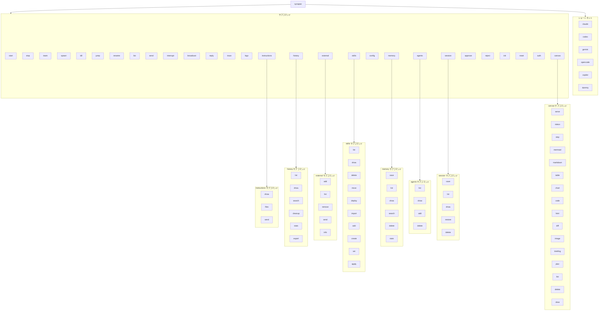
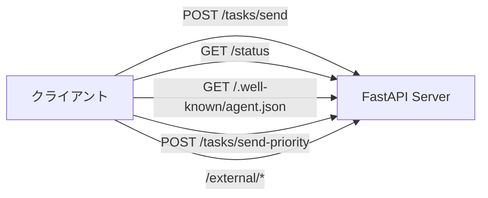
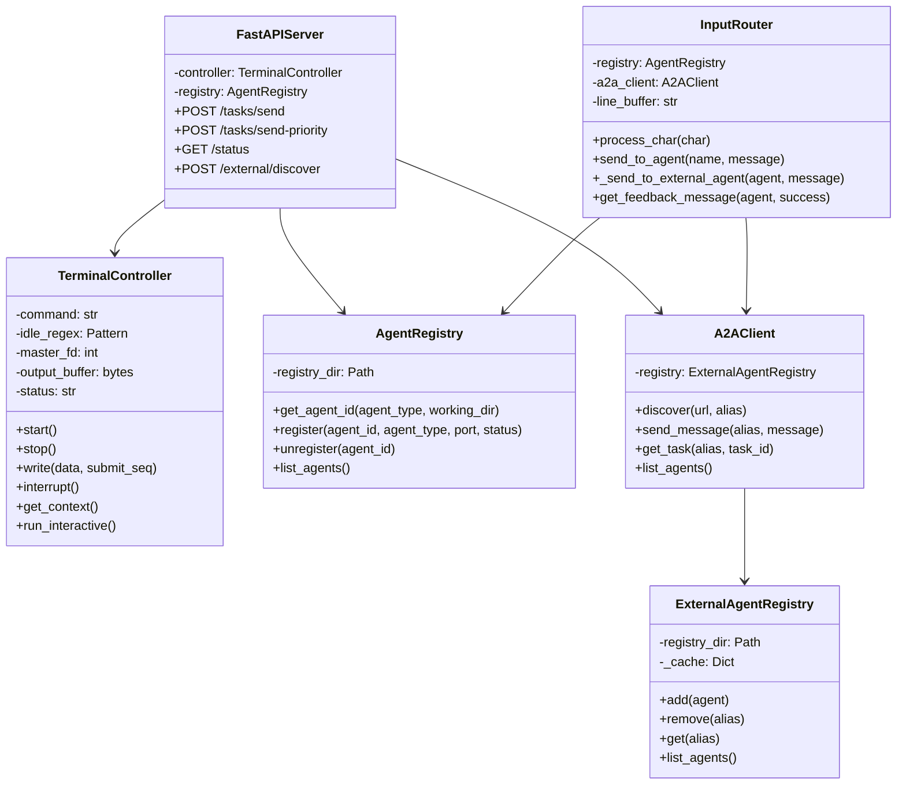

# References: API / CLI リファレンス

Synapse A2A の API、CLI、設定の完全リファレンスです。

---

## 1. CLI コマンドリファレンス

### 1.1 コマンド一覧


```mermaid
flowchart TB
    synapse["synapse"]

    subgraph Shortcuts["ショートカット"]
        claude["claude"]
        codex["codex"]
        gemini["gemini"]
        opencode["opencode"]
        copilot["copilot"]
        dummy["dummy"]
    end

    subgraph Commands["サブコマンド"]
        start["start"]
        stop["stop"]
        team["team"]
        spawn["spawn"]
        kill["kill"]
        jump["jump"]
        rename["rename"]
        list["list"]
        send["send"]
        interrupt["interrupt"]
        broadcast["broadcast"]
        reply["reply"]
        trace["trace"]
        logs["logs"]
        instructions["instructions"]
        history["history"]
        external["external"]
        skills["skills"]
        config["config"]
        memory["memory"]
        agents["agents"]
        session["session"]
        approve["approve"]
        reject["reject"]
        init["init"]
        reset["reset"]
        auth["auth"]
        canvas["canvas"]
    end

    subgraph Memory["memory サブコマンド"]
        mem_save["save"]
        mem_list["list"]
        mem_show["show"]
        mem_search["search"]
        mem_delete["delete"]
        mem_stats["stats"]
    end

    subgraph Instructions["instructions サブコマンド"]
        inst_show["show"]
        inst_files["files"]
        inst_send["send"]
    end

    subgraph External["external サブコマンド"]
        ext_add["add"]
        ext_list["list"]
        ext_remove["remove"]
        ext_send["send"]
        ext_info["info"]
    end

    subgraph History["history サブコマンド"]
        hist_list["list"]
        hist_show["show"]
        hist_search["search"]
        hist_cleanup["cleanup"]
        hist_stats["stats"]
        hist_export["export"]
    end

    subgraph Skills["skills サブコマンド"]
        sk_list["list"]
        sk_show["show"]
        sk_delete["delete"]
        sk_move["move"]
        sk_deploy["deploy"]
        sk_import["import"]
        sk_add["add"]
        sk_create["create"]
        sk_set["set"]
        sk_apply["apply"]
    end

    subgraph Agents["agents サブコマンド"]
        ag_list["list"]
        ag_show["show"]
        ag_add["add"]
        ag_delete["delete"]
    end

    subgraph Canvas["canvas サブコマンド"]
        cv_serve["serve"]
        cv_status["status"]
        cv_stop["stop"]
        cv_mermaid["mermaid"]
        cv_markdown["markdown"]
        cv_table["table"]
        cv_chart["chart"]
        cv_code["code"]
        cv_html["html"]
        cv_diff["diff"]
        cv_image["image"]
        cv_briefing["briefing"]
        cv_plan["plan"]
        cv_list["list"]
        cv_delete["delete"]
        cv_clear["clear"]
    end

    subgraph SessionCmds["session サブコマンド"]
        sess_save["save"]
        sess_list["list"]
        sess_show["show"]
        sess_restore["restore"]
        sess_delete["delete"]
    end

    synapse --> Shortcuts
    synapse --> Commands
    memory --> Memory
    instructions --> Instructions
    external --> External
    history --> History
    skills --> Skills
    agents --> Agents
    session --> SessionCmds
    canvas --> Canvas
```

---

### 1.2 synapse \<profile\>

インタラクティブモードでエージェントを起動します。

```bash
synapse <profile> [--name NAME] [--role ROLE] [--agent|-A ID_OR_NAME] [--skill-set SET] [--port PORT] [--no-setup] [--delegate-mode] [--worktree|-w [NAME]] [--branch|-b BRANCH]
```

| 引数 | 必須 | 説明 |
|------|------|------|
| `profile` | Yes | エージェントプロファイル名 |
| `--port` | No | サーバーポート（デフォルト: プロファイル別） |
| `--name NAME` | No | カスタムエージェント名 |
| `--role ROLE` | No | ロール説明（`@path` でファイル指定可、例: `@./roles/reviewer.md`） |
| `--agent ID_OR_NAME`, `-A` | No | 保存済みエージェント定義を使用（IDまたは表示名で指定）。名前・ロール・スキルセットを定義から解決。CLI引数で上書き可能 |
| `--skill-set SET` | No | スキルセットを指定 |
| `--no-setup` | No | 対話型セットアップをスキップ |
| `--delegate-mode` | No | マネージャー/委任者として起動（ファイル編集なし） |
| `--worktree [NAME]`, `-w` | No | Synapse ネイティブ worktree 分離で起動（`.synapse/worktrees/<name>/`）。NAME 省略時は自動生成。全エージェント対応 |
| `--branch BRANCH`, `-b` | No | worktree のベースブランチを指定（デフォルト: `origin/main`）。**`--worktree` を自動的に有効化** |

**例**:

```bash
synapse claude
synapse codex --port 8120
synapse gemini --port 8110
synapse claude --worktree my-feature              # worktree 分離で起動
synapse gemini -w                                 # 自動名で worktree 起動
synapse claude --worktree fix -b renovate/eslint  # 特定ブランチベースで worktree 起動

# 保存済みエージェント定義を使用
synapse claude --agent calm-lead                  # 保存済みIDで起動
synapse claude -A Claud                           # 表示名で起動（短縮フラグ）
synapse claude --agent calm-lead --role "一時的な上書き"  # CLI引数が優先
```

> **Note**: `--agent` で指定する保存済み定義の `profile` は、起動コマンドのプロファイルと一致する必要があります（例: `profile=gemini` の定義を `synapse claude` では使用不可）。

**ロールファイルの推奨ディレクトリ**:

| スコープ | パス | 用途 |
|---------|------|------|
| プロジェクト | `./roles/` | チームで共有するロール定義（Gitにコミット） |
| 個人 | `~/my-roles/` または `~/.synapse/roles/` | 個人用ロールテンプレート |

**デフォルトポート**:

| プロファイル | ポート |
|-------------|--------|
| claude | 8100-8109 |
| gemini | 8110-8119 |
| codex | 8120-8129 |
| opencode | 8130-8139 |
| copilot | 8140-8149 |
| dummy | 8190 |

---

### 1.3 synapse start

バックグラウンドでエージェントを起動します。

```bash
synapse start <profile> [--port PORT] [--foreground]
```

| 引数 | 必須 | 説明 |
|------|------|------|
| `profile` | Yes | エージェントプロファイル名 |
| `--port` | No | サーバーポート |
| `--foreground`, `-f` | No | フォアグラウンドで起動 |

**例**:

```bash
synapse start claude --port 8100
synapse start codex --foreground
```

**ログ出力先**: `~/.synapse/logs/<profile>.log`

---

### 1.4 synapse stop

実行中のエージェントを停止します。

```bash
synapse stop <profile|id>
```

| 引数 | 必須 | 説明 |
|------|------|------|
| `profile` または `id` | Yes | 停止するプロファイル名、またはエージェントID |
| `--all`, `-a` | No | 指定したプロファイルの全インスタンスを停止（ID指定時は無視） |

**動作**:
1. Registry からエージェントを検索（ID完全一致またはプロファイル名）
2. PID に SIGTERM を送信
3. Registry から登録解除

---

### 1.5 synapse list

実行中のエージェント一覧を Rich TUI で表示します。ファイルウォッチャーにより、エージェントのステータス変更時に自動更新されます。

```bash
synapse list              # Rich TUI（デフォルト）
synapse list --json       # JSON 配列出力（AI/スクリプト向け）
```

**`--json` フラグ**: JSON 配列としてエージェント一覧を出力します。各オブジェクトには `agent_id`, `agent_type`, `name`, `role`, `skill_set`, `port`, `status`, `pid`, `working_dir`, `endpoint`, `transport`, `current_task_preview`, `task_received_at`、および任意で `editing_file` が含まれます。

**出力形式（Rich TUI）**:

```
╭─────────────── Synapse A2A v0.2.30 - Agent List ───────────────╮
│ ╭───┬──────────────────────┬──────────┬────────────┬───────────┬───────────┬────────────┬──────────────╮ │
│ │ # │ ID                   │ NAME     │ STATUS     │ CURRENT   │ TRANSPORT │ WORKING_DIR│ EDITING_FILE │ │
│ ├───┼──────────────────────┼──────────┼────────────┼───────────┼───────────┼────────────┼──────────────┤ │
│ │ 1 │ synapse-claude-8100  │ my-claude│ PROCESSING │ Reviewing │ UDS→      │ project    │ auth.py      │ │
│ │ 2 │ synapse-gemini-8110  │ -        │ PROCESSING │ -         │ →UDS      │ other      │ -            │ │
│ │ 3 │ synapse-codex-8120   │ tester   │ READY      │ -         │ -         │ third      │ -            │ │
│ ╰───┴──────────────────────┴──────────┴────────────┴───────────┴───────────┴────────────┴──────────────┘ │
╰────────────────────── Last updated: 2024-01-15 10:30:45 ─────────────────────╯
[1-3/↑↓: select] [Enter/j: jump] [K: kill] [/: filter] [ESC: clear] [q: quit]
```

**キーボード操作**:

| キー | アクション |
|------|----------|
| 1-9 | エージェント行を選択 |
| ↑/↓ | エージェント行をナビゲート |
| Enter / j | 選択したエージェントのターミナルにジャンプ |
| K | 選択したエージェントを終了（確認ダイアログあり） |
| / | TYPE / NAME / WORKING_DIR でフィルタ |
| ESC | フィルタ/選択解除 |
| q | 終了 |

| 列 | 説明 |
|----|------|
| ID | ランタイムID（例: `synapse-claude-8100`） |
| NAME | カスタム名 |
| TYPE | エージェントタイプ（プロファイル名） |
| ROLE | エージェントの役割説明 |
| STATUS | 現在の状態（READY/PROCESSING/DONE） |
| TRANSPORT | 通信中の方式 |
| CURRENT | 現在のタスクプレビュー |
| WORKING_DIR | 作業ディレクトリ |
| SKILL_SET | 適用されているスキルセット名 |
| EDITING_FILE | 編集中のファイル（File Safety 有効時のみ表示） |

**Note**: 行を選択すると詳細パネルが表示され、Port/PID/Endpoint/フルパスなどが確認できます。

**TRANSPORT 列の値**:

| 値 | 説明 |
|----|------|
| `UDS→` | UDS（Unix Domain Socket）で送信中 |
| `TCP→` | TCP/HTTP で送信中 |
| `→UDS` | UDS で受信中 |
| `→TCP` | TCP で受信中 |
| `-` | 通信なし |

---

### 1.5.1 synapse team start

複数エージェントを分割ペインで起動します。

**デフォルト動作**: 1番目のエージェントが現在のターミナルを引き継ぎ（handoff）、2番目以降が新しいペインで起動します。**デフォルトで `--worktree` 分離が有効**です（`--no-worktree` でオプトアウト可能）。

```bash
synapse team start <agent_spec1> <agent_spec2> ... [--layout split|horizontal|vertical] [--all-new] [--no-worktree] [-- tool_args...]
```

**エージェント指定（agent_spec）の形式**:

- `profile`: エージェントプロファイル名（例: `claude`）
- `saved_agent_id`: 保存済みエージェントID（例: `steady-builder`）
- `saved_agent_name`: 保存済みエージェント名（例: `expert`）
- `profile:name`: 名前を指定
- `profile:name:role`: 名前とロールを指定
- `profile:name:role:skill_set`: 名前、ロール、スキルセットを指定
- `profile:name:role:skill_set:port`: 名前、ロール、スキルセット、ポートを指定

| 引数 | 必須 | 説明 |
|------|------|------|
| `agents` | Yes | 起動するエージェントスペック（複数指定） |
| `--layout` | No | ペインレイアウト (`split`, `horizontal`, `vertical`) |
| `--all-new` | No | 全エージェントを新しいペインで起動（現在のターミナルは残る） |
| `--worktree [NAME]`, `-w` | No | Synapse ネイティブ worktree 分離（各エージェントが個別の worktree を取得）。NAME 指定時はプレフィックスとして使用。全エージェント対応。**デフォルトで有効** |
| `--no-worktree` | No | worktree 分離を無効化（デフォルトの worktree をオプトアウト） |
| `-- tool_args...` | No | `--` の後の引数はすべて起動される CLI ツールに渡される（例: `-- --dangerously-skip-permissions`） |

**対応ターミナル**:
- `tmux`
- `iTerm2`
- `Terminal.app`（タブで起動）
- `Ghostty`（AppleScript Cmd+D による分割ペイン）
  - **制約**: Ghostty は AppleScript でフォーカス中のウィンドウ/タブを対象にするため、`spawn` や `team start` の実行中にタブを切り替えると、意図しないタブにエージェントがスポーンされます。コマンド完了まで操作を待ってください。
- `zellij`

**例**:

```bash
synapse team start claude gemini codex              # claude=ここ、他=新ペイン
synapse team start steady-builder gemini              # saved_agent_id で起動
synapse team start Cody gemini:Gem              # saved_agent_name + profile:name の混合指定
synapse team start claude gemini --layout horizontal
synapse team start claude gemini --all-new          # 全員新ペイン
synapse team start claude gemini -- --dangerously-skip-permissions  # ツール引数を渡す
synapse team start claude gemini                    # デフォルトで worktree 分離が有効
synapse team start claude gemini --no-worktree      # worktree を無効化
synapse team start claude gemini --worktree task    # 名前プレフィックス指定（task-claude-0, task-gemini-1）
# Claude Code 固有の --worktree（従来の方法、Claude のみ対応）:
synapse team start claude -- --worktree
```

**重複名ガード**:
- `team start` は起動前に custom name の重複を検証し、重複時はエラー終了します
- 保存済みエージェントを指定した場合も、解決後の `name` で同じ重複検証を行います

---

### 1.5.2 synapse spawn

**サブエージェント委任コマンド。** 親が子エージェントを生成し、サブタスクを委任します（コンテキスト保護・効率化・精度向上のため）。ライフサイクル: spawn → send → evaluate → kill。ユーザーがエージェント数を指定した場合はそれに従い（最優先）、指定がなければ親がタスク構造から判断します。詳細は `guides/usage.md` の「2.2.3 エージェント単体起動」を参照。

```bash
synapse spawn <profile|saved_agent_id|saved_agent_name> [--port PORT] [--name NAME] [--role ROLE] [--skill-set SET] [--terminal TERM] [--worktree [NAME]] [--task MESSAGE] [--task-file PATH] [--task-timeout N] [--wait|--notify|--silent] [-- tool_args...]
```

| 引数 | 必須 | 説明 |
|------|------|------|
| `profile` | Yes | エージェントプロファイル名、または保存済みエージェントの ID / 名前 |
| `--port` | No | サーバーポート |
| `--name` | No | カスタム名 |
| `--role` | No | ロール説明（`@path` でファイルから読み込み可） |
| `--skill-set` | No | スキルセット名 |
| `--terminal` | No | 使用するターミナル (`tmux`, `iterm2`, `terminal_app`, `ghostty`, `vscode`, `zellij`) |
| `--worktree [NAME]`, `-w` | No | Synapse ネイティブ worktree 分離（`.synapse/worktrees/<name>/`）。NAME 省略時は自動生成。全エージェント対応 |
| `--branch BRANCH`, `-b` | No | worktree のベースブランチを指定（デフォルト: `origin/main`）。**`--worktree` を自動的に有効化** |
| `--no-worktree` | No | worktree 分離を無効化 |
| `--task MESSAGE` | No | spawn 後、エージェントが READY になったら自動的にタスクメッセージを送信（`--task-file` と排他） |
| `--task-file PATH` | No | ファイルからタスクメッセージを読み込み（`-` で stdin から読み込み）。`--task` と排他 |
| `--task-timeout N` | No | タスク送信前のエージェント READY 待機秒数（デフォルト: 30） |
| `--wait` / `--notify` / `--silent` | No | タスク送信時のレスポンスモード（`synapse send` と同じ） |
| `-- tool_args...` | No | `--` の後の引数はすべて起動される CLI ツールに渡される（例: `-- --dangerously-skip-permissions`） |

**動作**:
- 新しいペイン/ウィンドウでエージェントを起動（デフォルトで `layout="auto"`＝スポーンゾーンタイリング。最初の spawn でゾーンペインを作成し、以降の spawn はそのゾーン内でタイリング）
- 自動的に `--no-setup --headless` フラグを付与（対話型セットアップと承認のスキップ）
- 起動成功後、エージェント ID とポートを出力
- 親エージェントは `synapse list` で READY 確認後にタスクを送信し、結果評価後に `synapse kill -f` で終了させる
- `--task` / `--task-file` を指定すると、READY 待機（`--task-timeout` 秒、デフォルト30秒）後に自動的に `synapse send` を実行。spawn → send のワンステップ化
- `--name` が既存エージェントと重複する場合は起動前にエラー終了

**保存済みエージェント解決**:
- 引数が `claude/codex/gemini/opencode/copilot` のいずれかならプロファイルとして起動
- それ以外は `synapse agents` で保存した定義を **ID 完全一致 → 名前完全一致** の順で解決して起動

---

### 1.5.3 synapse agents

保存済みエージェント定義（再利用可能な起動テンプレート）を管理します。

```bash
synapse agents list
synapse agents show <id-or-name>
synapse agents add <id> --name <name> --profile <profile> [--role <role>] [--skill-set <set>] [--scope project|user]
synapse agents delete <id-or-name>
```

| コマンド | 説明 |
|---------|------|
| `list` | 保存済みエージェント一覧を表示（TTY では Rich TUI テーブル） |
| `show` | 1件の詳細を表示 |
| `add` | 定義を作成/更新（`id` は petname 形式: 小文字+ハイフン区切り、例: `sharp-checker`, `calm-lead`） |
| `delete` | ID または名前で削除 |

**使用方法**:

保存済み定義は以下の 3 つの方法で使用できます：

```bash
# 1. プロファイルショートカットで使用（--agent / -A）
synapse codex --agent sharp-checker              # IDで起動
synapse codex -A Rex                             # 表示名で起動
synapse codex --agent sharp-checker --role "上書き"  # CLI引数が優先

# 2. spawn で使用
synapse spawn sharp-checker
synapse spawn Rex --role "一時的なロール"

# 3. team start で使用
synapse team start sharp-checker steady-builder
```

**例（Rex）**:

```bash
synapse agents add sharp-checker --name Rex --profile codex --role @./roles/tester.md --skill-set developer --scope project
synapse agents list
synapse agents show Rex
synapse codex --agent sharp-checker     # --agent で起動
synapse spawn Rex                       # spawn で起動
```

**保存先とスコープ**:

| スコープ | パス | 優先順位 |
|---------|------|---------|
| Project | `.synapse/agents/*.agent` | 高（優先） |
| User | `~/.synapse/agents/*.agent` | 低（フォールバック） |

IDが重複する場合、Project スコープが User スコープより優先されます。チーム共有の定義は Project、個人用テンプレートは User に保存してください。

**.agent ファイルの内部フォーマット**（key=value形式）:

```ini
id=sharp-checker
name=Rex
profile=codex
role=@roles/tester.md
skill_set=developer
```

**終了時保存プロンプト**:
- 対話起動の終了時に「このエージェント定義を保存するか」を確認します
- 無効化する場合: `SYNAPSE_AGENT_SAVE_PROMPT_ENABLED=false`
- 実際のプロンプト:
  `Save this agent definition for reuse? [y/N]:`
- `--headless` / 非TTY環境では表示されません
- `synapse stop ...` / `synapse kill ...` で停止した場合は表示されません

---

### 1.6 synapse send

エージェントにメッセージを送信します。

```bash
synapse send <target> <message|--message-file PATH|--stdin> [--from AGENT_ID] [--priority N] [--attach PATH] [--wait | --notify | --silent] [--task]
```

**ターゲット指定方法**:

| 形式 | 例 | 説明 |
|-----|---|------|
| カスタム名 | `my-claude` | 最優先、レジストリの名前でマッチ |
| フルランタイムID | `synapse-claude-8100` | 完全なランタイムID |
| タイプ-ポート | `claude-8100` | 同タイプが複数ある場合 |
| エージェントタイプ | `claude` | 単一インスタンスの場合のみ |

| 引数 | 必須 | 説明 |
|------|------|------|
| `target` | Yes | 送信先エージェント（上記形式） |
| `message` | No | メッセージ内容（positional / `--message-file` / `--stdin` のいずれか） |
| `--message-file`, `-F` | No | ファイルからメッセージ読み込み（`-` で stdin） |
| `--stdin` | No | 標準入力からメッセージ読み込み |
| `--from`, `-f` | No | 送信元エージェントID（省略可: `SYNAPSE_AGENT_ID` から自動検出） |
| `--priority`, `-p` | No | 優先度 1-5（デフォルト: 3） |
| `--attach`, `-a` | No | ファイル添付（複数指定可） |
| `--wait` | No | 同期待機モード - 送信側がブロックして `synapse reply` を待つ |
| `--notify` | No | 非同期通知モード - タスク完了時に通知を受け取る（デフォルト） |
| `--silent` | No | ワンウェイモード - 送りっぱなし、返信・通知不要 |
| `--callback` | No | タスク完了時（completed/failed）に送信側で実行するコマンド（--silent時のみ） |
| `--task`, `-T` | No | ボードタスクを自動作成し、送信メッセージと紐付ける。受信側は自動 claim、A2A タスク完了時に自動 complete |
| `--force` | No | 作業ディレクトリの不一致チェックをバイパスして送信（同一リポジトリのワークツリー間では不要） |

**Note**: `a2a.flow=auto`（デフォルト）の場合、フラグなしは `--notify`（非同期通知）になります。
**Note**: `--silent` でも受信側完了時に sender 側 history のステータスは best-effort で更新されます（`sent` → `completed` / `failed` / `canceled`、通知不達時は `sent` のまま）。
**Note**: メッセージの入力元は **positional / `--message-file` / `--stdin` のいずれか1つ** を指定します。
**Note**: `--task` / `-T` を指定すると、送信時にボードタスクを自動作成し、A2A タスクと紐付けます。受信側は自動 claim し、A2A タスク完了時にボードタスクも自動 complete されます。PTY 表示には `[Task: XXXXXXXX]` タグが付与されます。
**Note**: 送信元の CWD とターゲットの `working_dir` が異なる場合、警告を表示して終了コード 1 で終了します。ただし、ワークツリーの関係（親リポジトリ ↔ 子ワークツリー、兄弟ワークツリー）は自動検出されるため `--force` は不要です。異なるプロジェクトの場合のみ `--force` でバイパスしてください。

**レスポンスモードの使い分け**:

| メッセージ種類 | モード | 例 |
|---------------|--------|-----|
| 質問 | `--wait` | "現在のステータスは？" |
| 分析依頼 | `--wait` | "このコードをレビューして" |
| 結果を期待するタスク | `--notify` | "テストを実行して結果を報告して" |
| 委任タスク（fire-and-forget） | `--silent` | "このバグを修正してコミットして" |
| 通知 | `--silent` | "FYI: ビルドが完了しました" |

デフォルトは `--notify`（非同期通知）です。

**例**:

```bash
# 結果を期待するタスク（非同期通知 - デフォルト）
synapse send codex "結果を教えて" --notify

# 同期待機（レスポンスを待つ）
synapse send codex "進捗を報告して" --wait

# 委任タスク、fire-and-forget
synapse send codex "設計して" --silent

synapse send claude "Hello!"                                  # --from 自動検出
synapse send claude-8100 "Hello"                               # 同タイプが複数の場合
synapse send gemini "止まれ" -p 5
synapse send codex --message-file ./message.txt --silent
echo "from stdin" | synapse send codex --stdin --silent
synapse send codex "このファイルを見て" -a ./a.py -a ./b.txt --silent
synapse send codex "設計して" --force                           # 異なるプロジェクトのエージェントに送信（同一リポのワークツリーなら不要）
synapse send claude "Hello!" --from synapse-codex-8121         # 明示指定（サンドボックス環境向け）
synapse send codex "認証を実装して" --task                     # ボードタスク自動作成＆紐付け
synapse send codex "バグ修正して" -T --silent                  # -T は --task の短縮形
```

---

### 1.6.1 synapse broadcast

現在の作業ディレクトリ（`working_dir`）と一致する全エージェントにメッセージを送信します。

```bash
synapse broadcast <message> [--from AGENT_ID] [--priority N] [--wait | --notify | --silent]
```

| 引数 | 必須 | 説明 |
|------|------|------|
| `message` | Yes | 一括送信するメッセージ |
| `--from`, `-f` | No | 送信元エージェントID（省略可: 自動検出。指定時は送信元自身を除外） |
| `--priority`, `-p` | No | 優先度 1-5（デフォルト: 1） |
| `--wait` | No | 同期待機モード - 各送信先で応答待ち |
| `--notify` | No | 非同期通知モード - 各送信先の完了通知を受け取る（デフォルト） |
| `--silent` | No | ワンウェイモード - 各送信先へ送りっぱなし |

**一致ルール**:
- `Path.cwd().resolve()` と各エージェントの `working_dir` 実パスが完全一致した場合のみ対象
- 対象が0件の場合はエラー終了
- 一部失敗しても残りには送信を継続し、最後に `Sent` / `Failed` を表示

**例**:

```bash
synapse broadcast "進捗を報告してください"                       # --from 自動検出（自身を除外）
synapse broadcast "緊急確認" -p 4 --wait
synapse broadcast "FYI: CI通過" --silent
```

---

### 1.6.2 synapse interrupt

エージェントにソフト割り込みメッセージを送信します。`synapse send <target> <message> -p 4 --silent` の簡易コマンドです。

```bash
synapse interrupt <target> <message> [--from AGENT_ID] [--force]
```

| 引数 | 必須 | 説明 |
|------|------|------|
| `target` | Yes | 送信先エージェント（名前、ID、タイプ等） |
| `message` | Yes | 割り込みメッセージ |
| `--from`, `-f` | No | 送信元エージェントID（省略可: 自動検出） |
| `--force` | No | 作業ディレクトリの不一致チェックをバイパスして送信（同一リポジトリのワークツリー間では不要） |

**動作**: 優先度 4 で fire-and-forget メッセージを送信します。応答は待ちません。送信元の CWD とターゲットの `working_dir` が異なる場合、警告を表示して終了コード 1 で終了します。ただし、同一リポジトリのワークツリー関係は自動検出されるため `--force` は不要です。異なるプロジェクトの場合のみ `--force` でバイパスしてください。

**例**:

```bash
synapse interrupt claude "Stop and review"
synapse interrupt gemini "Check status"                           # --from 自動検出
synapse interrupt claude "Stop" --force   # 異なるプロジェクトのエージェントに送信
```

---

### 1.7 synapse reply

最後に受信したA2Aメッセージに返信します。Synapseは返信を期待するメッセージの送信者情報を自動的に追跡します。

```bash
synapse reply [message] [--from AGENT_ID] [--to SENDER_ID] [--list-targets] [--fail REASON]
```

| 引数 | 必須 | 説明 |
|------|------|------|
| `message` | No | 返信メッセージ内容（`--list-targets` 使用時は省略可） |
| `--from`, `-f` | No | 送信元エージェントID（省略可: 自動検出。サンドボックス環境で必要な場合あり） |
| `--to` | No | 返信先の sender_id を指定（複数の送信者がいる場合に使用） |
| `--list-targets` | No | 返信可能なターゲット一覧を表示して終了 |
| `--fail` | No | 通常のテキスト返信の代わりに失敗返信を送信（理由を指定） |

**例**:

```bash
# 最新の送信者に返信（デフォルト LIFO）
synapse reply "分析結果です..."

# 特定の送信者に返信
synapse reply "タスク完了しました" --to synapse-claude-8100

# 返信可能なターゲットを確認
synapse reply --list-targets

# 失敗を返信
synapse reply --fail "クォータ超過のため処理できませんでした"
```

**動作**:
1. 自身のエージェントの返信追跡マップから送信者情報を取得（`--to` 指定時は特定の送信者を取得）
2. 送信者のエンドポイントに返信を送信
3. 成功後、送信者情報を削除

---

### 1.7.1 synapse trace

タスクIDに対して、task history と file-safety の変更履歴（同一 task_id）をまとめて表示します。

```bash
synapse trace <task_id>
```

**例**:

```bash
synapse trace 4d5e61ee-be97-4922-bdbd-ac1108b8d1c9
```

---

### 1.8 synapse logs

エージェントのログを表示します。

```bash
synapse logs <profile> [-f] [-n LINES]
```

| 引数 | 必須 | 説明 |
|------|------|------|
| `profile` | Yes | プロファイル名 |
| `-f`, `--follow` | No | リアルタイム追跡 |
| `-n`, `--lines` | No | 表示行数（デフォルト: 50） |

**例**:

```bash
synapse logs claude
synapse logs codex -f
synapse logs gemini -n 100
```

---

### 1.9 synapse instructions

初期インストラクションを管理・送信します。

```bash
synapse instructions <command> [options]
```

#### 1.9.1 synapse instructions show

エージェントのインストラクション内容を表示します。

```bash
synapse instructions show [agent_type]
```

| 引数 | 必須 | 説明 |
|------|------|------|
| `agent_type` | No | エージェントタイプ（claude, gemini, codex）。省略時はデフォルト設定を表示 |

**例**:

```bash
synapse instructions show
synapse instructions show claude
synapse instructions show gemini
```

#### 1.9.2 synapse instructions files

エージェントが読み込むインストラクションファイル一覧を表示します。

```bash
synapse instructions files [agent_type]
```

| 引数 | 必須 | 説明 |
|------|------|------|
| `agent_type` | No | エージェントタイプ。省略時はデフォルト設定を表示 |

**例**:

```bash
synapse instructions files claude
```

**出力例**:

```
Instruction files for 'claude':
  - .synapse/default.md
```

ファイルの場所に応じて `.synapse/`（プロジェクト）または `~/.synapse/`（ユーザー）が表示されます。

#### 1.9.3 synapse instructions send

実行中のエージェントに初期インストラクションを送信します。

```bash
synapse instructions send <target> [--preview]
```

| 引数 | 必須 | 説明 |
|------|------|------|
| `target` | Yes | 送信先（プロファイル名またはエージェントID） |
| `--preview`, `-p` | No | 実際に送信せずプレビューのみ表示 |

**例**:

```bash
# プロファイル名で送信
synapse instructions send claude

# エージェントIDで送信
synapse instructions send synapse-claude-8100

# プレビュー（送信しない）
synapse instructions send claude --preview
```

**ユースケース**:

| シチュエーション | コマンド |
|----------------|----------|
| `--resume` 後に A2A 機能が必要になった | `synapse instructions send claude` |
| エージェントがインストラクションを忘れた | `synapse instructions send <agent>` |
| 送信前に内容を確認したい | `synapse instructions send <agent> --preview` |

---

### 1.10 synapse external

外部 Google A2A エージェントを管理します。

```bash
synapse external <command> [options]
```

#### 1.10.1 synapse external add

外部エージェントを発見して登録します。

```bash
synapse external add <url> [--alias ALIAS]
```

| 引数 | 必須 | 説明 |
|------|------|------|
| `url` | Yes | エージェントの URL |
| `--alias`, `-a` | No | ショートネーム（省略時は自動生成） |

**例**:

```bash
synapse external add https://agent.example.com
synapse external add http://localhost:9000 --alias myagent
```

#### 1.10.2 synapse external list

登録済み外部エージェントの一覧を表示します。

```bash
synapse external list
```

**出力形式**:

```
ALIAS           NAME                 URL                                      LAST SEEN
------------------------------------------------------------------------------------------
myagent         My Agent             http://localhost:9000                    2024-01-15T10:30:00
example         Example Agent        https://agent.example.com                Never
```

#### 1.10.3 synapse external remove

外部エージェントを登録解除します。

```bash
synapse external remove <alias>
```

| 引数 | 必須 | 説明 |
|------|------|------|
| `alias` | Yes | 削除するエージェントの alias |

#### 1.10.4 synapse external send

外部エージェントにメッセージを送信します。

```bash
synapse external send <alias> <message> [--wait]
```

| 引数 | 必須 | 説明 |
|------|------|------|
| `alias` | Yes | 送信先エージェントの alias |
| `message` | Yes | メッセージ内容 |
| `--wait`, `-w` | No | 完了を待つ |

**例**:

```bash
synapse external send myagent "Hello!"
synapse external send myagent "Process this" --wait
```

#### 1.10.5 synapse external info

外部エージェントの詳細情報を表示します。

```bash
synapse external info <alias>
```

**出力例**:

```
Name: My Agent
Alias: myagent
URL: http://localhost:9000
Description: An example agent
Added: 2024-01-15T10:00:00Z
Last Seen: 2024-01-15T10:30:00Z

Capabilities:
  streaming: False
  multiTurn: True

Skills:
  - chat
    Send messages to the agent
  - analyze
    Analyze provided content
```

---

### 1.11 synapse skills

スキルの発見・管理・デプロイを行います。引数なしで TUI モードが起動します。

```bash
synapse skills [subcommand]
```

**TUI モード（引数なし）**では以下のフローで操作します：

1. トップメニュー → **Manage Skills** を選択
2. **スコープ選択**（Synapse / User / Project）— PLUGIN スコープは除外
3. 選択したスコープのスキル一覧 — 各行に `[C✓ A✓]` インジケーター付き
4. スキル詳細 — Deploy Status セクションで User/Project 両スコープの全エージェントへのデプロイ状態を表示

**エージェントディレクトリインジケーター**:

| 記号 | ディレクトリ | 対象エージェント |
|------|-------------|-----------------|
| **C** | `.claude/skills/` | Claude |
| **A** | `.agents/skills/` | Codex, OpenCode, Copilot, Gemini |

`✓` = 存在する、`·` = 存在しない

#### 1.11.1 synapse skills list

発見されたスキルを一覧表示します。

```bash
synapse skills list [--scope SCOPE]
```

| 引数 | 必須 | 説明 |
|------|------|------|
| `--scope` | No | フィルタするスコープ（`synapse`, `user`, `project`, `plugin`） |

#### 1.11.2 synapse skills show

スキルの詳細情報を表示します。

```bash
synapse skills show <name> [--scope SCOPE]
```

| 引数 | 必須 | 説明 |
|------|------|------|
| `name` | Yes | スキル名 |
| `--scope` | No | 対象スコープ |

#### 1.11.3 synapse skills delete

スキルを削除します。Plugin スコープのスキルは削除できません。

```bash
synapse skills delete <name> [--force] [--scope SCOPE]
```

| 引数 | 必須 | 説明 |
|------|------|------|
| `name` | Yes | スキル名 |
| `--force` | No | 確認なしで削除 |
| `--scope` | No | 対象スコープ |

#### 1.11.4 synapse skills move

スキルを別のスコープに移動します。

```bash
synapse skills move <name> --to <scope>
```

| 引数 | 必須 | 説明 |
|------|------|------|
| `name` | Yes | スキル名 |
| `--to` | Yes | 移動先スコープ（`user`, `project`） |

#### 1.11.5 synapse skills deploy

中央ストア（`~/.synapse/skills/`）からエージェントディレクトリにスキルをデプロイします。

```bash
synapse skills deploy <name> [--agent AGENTS] [--scope SCOPE]
```

| 引数 | 必須 | 説明 |
|------|------|------|
| `name` | Yes | スキル名 |
| `--agent` | No | 対象エージェント（カンマ区切り: `claude,codex,gemini`） |
| `--scope` | No | デプロイスコープ（`user` または `project`、デフォルト: `user`） |

**例**:

```bash
synapse skills deploy code-quality --agent claude,codex --scope project
```

#### 1.11.6 synapse skills import

エージェントディレクトリのスキルを中央ストアにインポートします。

```bash
synapse skills import <name> [--from SCOPE]
```

| 引数 | 必須 | 説明 |
|------|------|------|
| `name` | Yes | スキル名 |
| `--from` | No | インポート元スコープ（`user` または `project`） |

#### 1.11.7 synapse skills add

リポジトリからスキルをインストールします（`npx skills add` ラッパー）。

```bash
synapse skills add <repo>
```

| 引数 | 必須 | 説明 |
|------|------|------|
| `repo` | Yes | リポジトリ（例: `s-hiraoku/synapse-a2a`） |

**動作**: `npx skills add <repo> -g -a claude-code -y` を実行し、新規スキルを自動的に `~/.synapse/skills/` にインポートします。

#### 1.11.8 synapse skills create

新しいスキルのテンプレートを中央ストア（`~/.synapse/skills/`）に作成します。引数なしで実行すると、スキル名の入力を求められます。

```bash
synapse skills create [name]
```

| 引数 | 必須 | 説明 |
|------|------|------|
| `name` | No | 作成するスキル名 |

> **Note:** `synapse skills` (TUI) の "Create Skill" オプションを選択すると、`anthropic-skill-creator` を使用した対話的なスキル作成のガイダンスが表示されます。

#### 1.11.9 synapse skills set list

登録済みスキルセット一覧を表示します。

```bash
synapse skills set list
```

#### 1.11.10 synapse skills set show

スキルセットの詳細を表示します。

```bash
synapse skills set show <name>
```

| 引数 | 必須 | 説明 |
|------|------|------|
| `name` | Yes | スキルセット名 |

> **Note:** スキルセットを選択してエージェントを起動すると、スキルセットの詳細（名前・説明・含まれるスキル一覧）が初期インストラクションに自動的に含まれます。これによりエージェントは自分に割り当てられたスキルセットの目的と利用可能なスキルを認識できます。

#### 1.11.11 synapse skills apply

稼働中のエージェントにスキルセットを適用します。スキルファイルをエージェントのスキルディレクトリにコピーし、レジストリの `skill_set` フィールドを更新し、スキルセット情報を A2A 経由でエージェントに送信します。

```bash
synapse skills apply <target> <set_name> [--dry-run]
```

| 引数 | 必須 | 説明 |
|------|------|------|
| `target` | Yes | 対象エージェント（名前、ID、タイプ等） |
| `set_name` | Yes | 適用するスキルセット名 |
| `--dry-run` | No | 変更をプレビューするのみ（実際には適用しない） |

**例**:

```bash
synapse skills apply my-claude manager
synapse skills apply gemini-8110 developer --dry-run
```

---

### 1.12 synapse config

インタラクティブな TUI で設定を編集します。

```bash
synapse config [--scope SCOPE]
```

| 引数 | 必須 | 説明 |
|------|------|------|
| `--scope` | No | 編集するスコープ（`user` または `project`）。省略時はプロンプトで選択 |

**例**:

```bash
synapse config                  # インタラクティブモード（スコープを選択）
synapse config --scope user     # ユーザー設定を直接編集
synapse config --scope project  # プロジェクト設定を直接編集
```

**対話フロー**:

```
? Which settings file do you want to edit?
  ❯ User settings (~/.synapse/settings.json)
    Project settings (./.synapse/settings.json)
    Cancel

? Select a category to configure:
  ❯ Environment Variables - Configure SYNAPSE_* environment variables
    Instructions - Configure agent-specific instruction files
    A2A Protocol - Configure inter-agent communication settings
    Resume Flags - Configure CLI flags that indicate resume mode
    Save and exit
    Exit without saving
```

**カテゴリ**:

| カテゴリ | 編集対象 |
|----------|----------|
| Environment Variables | `env.SYNAPSE_*` 環境変数 |
| Instructions | `instructions.{default,claude,gemini,codex,opencode}` |
| Approval Mode | `approvalMode` (required/auto) |
| A2A Protocol | `a2a.flow` (auto/roundtrip/oneway) |
| Resume Flags | `resume_flags.{claude,codex,gemini,opencode,copilot}` |

---

### 1.13 synapse config show

現在の設定を表示します（読み取り専用）。

```bash
synapse config show [--scope SCOPE]
```

| 引数 | 必須 | 説明 |
|------|------|------|
| `--scope` | No | 表示するスコープ（`user`, `project`, または `merged`）。省略時は `merged` |

**例**:

```bash
synapse config show                  # マージ済み設定を表示（デフォルト）
synapse config show --scope user     # ユーザー設定のみ表示
synapse config show --scope project  # プロジェクト設定のみ表示
```

**出力例**:

```
Current settings (merged from all scopes):
------------------------------------------------------------
{
  "env": {
    "SYNAPSE_HISTORY_ENABLED": "true",
    "SYNAPSE_FILE_SAFETY_ENABLED": "true",
    ...
  },
  "instructions": {
    "default": "[SYNAPSE INSTRUCTIONS...]",
    ...
  },
  "approvalMode": "required",
  "a2a": { "flow": "auto" },
  "resume_flags": { ... }
}
```

---

### 1.14 synapse kill

実行中のエージェントをグレースフルシャットダウンします。

```bash
synapse kill <TARGET> [--force] [--no-merge]
```

| 引数 | 必須 | 説明 |
|------|------|------|
| `TARGET` | Yes | エージェント名、ID（`synapse-claude-8100`）、type-port（`claude-8100`）、またはタイプ |
| `--force`, `-f` | No | 確認なしで即時終了（SIGKILL） |
| `--no-merge` | No | worktree ブランチの自動マージをスキップ（ブランチを保持） |

**ターゲット解決の優先順位**:
1. カスタム名（`my-claude`）— 最優先
2. フルランタイムID（`synapse-claude-8100`）
3. type-port 省略形（`claude-8100`）
4. エージェントタイプ（`claude`）— 単一インスタンスの場合のみ

**グレースフルシャットダウンフロー**（`--force` なしの場合）:
1. HTTP シャットダウンリクエスト送信（最大10秒）
2. 猶予期間（残り時間の1/3、最低1秒）
3. SIGTERM 送信
4. エスカレーション待機（残りの時間）
5. プロセスが残っている場合 SIGKILL

デフォルトタイムアウトは30秒（`settings.json` の `shutdown.timeout_seconds` で変更可能）。

**例**:

```bash
synapse kill my-claude                  # カスタム名で指定
synapse kill synapse-claude-8100        # フルIDで指定
synapse kill claude-8100                # type-port で指定
synapse kill claude                     # タイプで指定（単一インスタンスの場合）
synapse kill claude -f                  # 確認なし即時終了
synapse kill claude --no-merge          # worktree 自動マージをスキップ
```

> **Worktree 自動マージ**: worktree で起動したエージェントを kill すると、デフォルトでブランチが親ブランチに自動マージされます（未コミットの変更は WIP コミットされます）。コンフリクト発生時はブランチが保持され警告が表示されます。`--no-merge` で自動マージをスキップできます。エージェントを停止せずにマージしたい場合は `synapse merge` を使用してください。

---

### 1.14.1 synapse merge

エージェントを停止せずに worktree ブランチを現在のブランチにマージします。

```bash
synapse merge <TARGET> [--dry-run] [--resolve-with <AGENT>]
synapse merge --all [--dry-run]
```

| 引数 | 必須 | 説明 |
|------|------|------|
| `TARGET` | Yes（`--all` 未指定時） | マージ対象のエージェント名、ID、またはタイプ |
| `--all` | No | すべての worktree エージェントのブランチをマージ |
| `--dry-run` | No | 実際にマージせずにプレビュー表示 |
| `--resolve-with <AGENT>` | No | コンフリクト発生時に指定エージェントに解消を委任（Phase 2）。`--all` とは併用不可 |

**`synapse kill --no-merge` + `synapse merge` の使い分け**:
- `synapse kill`: エージェントを停止し、デフォルトでブランチを自動マージ
- `synapse merge`: エージェントを**停止せずに**ブランチをマージ（作業を続行しながら中間成果を統合）

**例**:

```bash
synapse merge my-claude                    # エージェントのブランチをマージ
synapse merge --all                        # 全 worktree ブランチをマージ
synapse merge my-claude --dry-run          # マージのプレビュー
synapse merge my-claude --resolve-with gemini  # コンフリクト解消を Gemini に委任
```

---

### 1.15 synapse jump

実行中のエージェントのターミナルウィンドウにジャンプします。

```bash
synapse jump <TARGET>
```

| 引数 | 必須 | 説明 |
|------|------|------|
| `TARGET` | Yes | エージェント名、ID、type-port、またはタイプ |

**対応ターミナル**: iTerm2, Terminal.app, Ghostty, VS Code, tmux, Zellij

> **Ghostty の制約**: Ghostty は AppleScript を使用して現在フォーカスされているウィンドウやタブを対象にします。`spawn` や `team start` の実行中にタブを切り替えると、意図しないタブにエージェントがスポーンされる可能性があるため、完了まで操作を控えてください。

**例**:

```bash
synapse jump my-claude                  # カスタム名で指定
synapse jump synapse-claude-8100        # フルIDで指定
synapse jump claude                     # タイプで指定（単一インスタンスの場合）
```

---

### 1.16 synapse rename

実行中のエージェントにカスタム名やロールを設定します。

```bash
synapse rename <TARGET> [--name NAME] [--role ROLE] [--clear]
```

| 引数 | 必須 | 説明 |
|------|------|------|
| `TARGET` | Yes | エージェント名、ID、type-port、またはタイプ |
| `--name`, `-n` | No | カスタム名 |
| `--role`, `-r` | No | ロール（役割の説明。`@path` でファイルから読み込み可） |
| `--clear`, `-c` | No | 名前とロールをクリア |

**例**:

```bash
synapse rename synapse-claude-8100 --name my-claude
synapse rename my-claude --role "コードレビュー担当"
synapse rename claude --name reviewer --role "全PRをレビュー"
synapse rename my-claude --clear                          # 名前・ロールをクリア
```

---

### 1.17 synapse init

Synapse 設定を初期化します（`.synapse/settings.json` の作成とスキルのコピー）。

```bash
synapse init [--scope SCOPE]
```

| 引数 | 必須 | 説明 |
|------|------|------|
| `--scope` | No | `user`（`~/.synapse`）または `project`（`./.synapse`）。省略時はインタラクティブ選択 |

**例**:

```bash
synapse init                    # インタラクティブにスコープ選択
synapse init --scope user       # ユーザースコープに作成
synapse init --scope project    # プロジェクトスコープに作成
```

---

### 1.18 synapse reset

設定をデフォルト値にリセットし、スキルを再インストールします。

```bash
synapse reset [--scope SCOPE] [--force]
```

| 引数 | 必須 | 説明 |
|------|------|------|
| `--scope` | No | `user`、`project`、または `both`。省略時はインタラクティブ選択 |
| `--force`, `-f` | No | 確認プロンプトをスキップ |

**例**:

```bash
synapse reset                        # インタラクティブにスコープ選択
synapse reset --scope user           # ユーザー設定をリセット
synapse reset --scope project        # プロジェクト設定をリセット
synapse reset --scope both -f        # 両方を確認なしでリセット
```

---

### 1.19 synapse auth

API キー認証の管理コマンドです。`SYNAPSE_AUTH_ENABLED=true` で認証を有効化します。

#### synapse auth setup

API キーを生成し、セットアップ手順を表示します。

```bash
synapse auth setup
```

2つのキー（API キーと管理キー）を生成し、環境変数の設定例を表示します。

#### synapse auth generate-key

API キーを生成します。

```bash
synapse auth generate-key [--count N] [--export]
```

| 引数 | 必須 | 説明 |
|------|------|------|
| `--count`, `-n` | No | 生成するキーの数（デフォルト: 1） |
| `--export`, `-e` | No | `export SYNAPSE_API_KEYS=...` 形式で出力 |

**例**:

```bash
synapse auth setup                   # セットアップガイドを表示
synapse auth generate-key            # キーを1つ生成
synapse auth generate-key -n 3 -e    # 3つのキーをexport形式で生成
```

---

### 1.20 synapse memory

エージェント間の共有メモリ（知識ベース）を管理します。

```bash
synapse memory <subcommand>
```

#### 1.21.1 synapse memory save

メモリを保存します（key が既存の場合は UPSERT）。

```bash
synapse memory save <key> <content> [--tags TAG1,TAG2] [--notify]
```

| 引数 | 必須 | 説明 |
|------|------|------|
| `key` | Yes | メモリの一意キー（例: `auth-pattern`） |
| `content` | Yes | メモリ本文 |
| `--tags` | No | タグ（カンマ区切り、例: `architecture,auth`） |
| `--notify` | No | 保存後に `synapse broadcast` で他エージェントに通知 |

#### 1.21.2 synapse memory list

メモリ一覧を表示します。

```bash
synapse memory list [--author AUTHOR] [--tags TAGS] [--limit N]
```

| 引数 | 必須 | 説明 |
|------|------|------|
| `--author` | No | 著者（agent_id）で絞り込み |
| `--tags` | No | タグで絞り込み（カンマ区切り） |
| `--limit` | No | 表示件数上限（デフォルト: 50） |

#### 1.21.3 synapse memory show

メモリの詳細を表示します。

```bash
synapse memory show <id_or_key>
```

| 引数 | 必須 | 説明 |
|------|------|------|
| `id_or_key` | Yes | メモリの UUID またはキー |

#### 1.21.4 synapse memory search

メモリを検索します（key, content, tags を横断検索）。

```bash
synapse memory search <query>
```

| 引数 | 必須 | 説明 |
|------|------|------|
| `query` | Yes | 検索クエリ（LIKE マッチング、結果は最大100件） |

#### 1.21.5 synapse memory delete

メモリを削除します。

```bash
synapse memory delete <id_or_key> [--force]
```

| 引数 | 必須 | 説明 |
|------|------|------|
| `id_or_key` | Yes | メモリの UUID またはキー |
| `--force` | No | 確認なしで削除 |

#### 1.21.6 synapse memory stats

メモリの統計情報を表示します（件数、著者別、タグ別）。

```bash
synapse memory stats
```

---

### 1.22 synapse session

チーム構成のスナップショットを保存・復元します。実行中のエージェント構成を名前付きで保存し、後から同じ構成を再現できます。

**ストレージ**:

| スコープ | パス |
|---------|------|
| Project（デフォルト） | `.synapse/sessions/<name>.json` |
| User | `~/.synapse/sessions/<name>.json` |

#### 1.22.1 synapse session save

実行中のエージェントをセッションとして保存します。各エージェントの `session_id` もレジストリから取得して保存されます（`--resume` 復元に使用）。

```bash
synapse session save <name> [--project|--user|--workdir <dir>]
```

| 引数 | 必須 | 説明 |
|------|------|------|
| `name` | Yes | セッション名（英数字、ドット、ハイフン、アンダースコア） |
| `--project` | No | プロジェクトスコープに保存（デフォルト） |
| `--user` | No | ユーザースコープに保存（全エージェントを対象） |
| `--workdir <dir>` | No | 指定ディレクトリを project スコープとして使用（`<dir>/.synapse/sessions/`） |

**例**:

```bash
synapse session save my-team                    # CWDのエージェントを保存
synapse session save my-team --user             # ユーザースコープに保存
synapse session save my-team --workdir /tmp/p   # /tmp/p の project スコープに保存
```

#### 1.22.2 synapse session list

保存済みセッションを一覧表示します。

```bash
synapse session list [--project|--user|--workdir <dir>]
```

| 引数 | 必須 | 説明 |
|------|------|------|
| `--project` | No | プロジェクトスコープのみ表示（デフォルト） |
| `--user` | No | ユーザースコープのみ表示 |
| `--workdir DIR` | No | 指定ディレクトリの `DIR/.synapse/sessions/` を使用 |

#### 1.22.3 synapse session show

セッションの詳細（エージェント構成）を表示します。各エージェントの `session_id` も表示されます（保存時に取得された場合）。

```bash
synapse session show <name> [--project|--user|--workdir <dir>]
```

| 引数 | 必須 | 説明 |
|------|------|------|
| `name` | Yes | セッション名 |
| `--project` | No | プロジェクトスコープ（デフォルト） |
| `--user` | No | ユーザースコープ |
| `--workdir DIR` | No | 指定ディレクトリの `DIR/.synapse/sessions/` を使用 |

#### 1.22.4 synapse session restore

保存済みセッションを復元し、全エージェントを spawn します。

```bash
synapse session restore <name> [--project|--user|--workdir <dir>] [--worktree] [--resume] [-- tool_args...]
```

| 引数 | 必須 | 説明 |
|------|------|------|
| `name` | Yes | セッション名 |
| `--project` | No | プロジェクトスコープ（デフォルト） |
| `--user` | No | ユーザースコープ |
| `--workdir DIR` | No | 指定ディレクトリの `DIR/.synapse/sessions/` を使用 |
| `--worktree` | No | worktree 分離を強制（保存時の設定を上書き） |
| `--resume` | No | 各エージェントの CLI 会話セッションを再開（保存時の `session_id` を使用） |
| `-- tool_args` | No | ツール固有の引数（全エージェントに適用） |

**例**:

```bash
synapse session restore my-team                              # 通常復元
synapse session restore my-team --worktree                   # worktree で復元
synapse session restore my-team --resume                     # 会話セッションを再開して復元
synapse session restore my-team --worktree --resume          # worktree + resume
synapse session restore my-team -- --dangerously-skip-permissions  # ツール引数付き
```

**`--resume` の詳細**:

`session save` 時にレジストリから取得した `session_id` を使い、各エージェントの CLI 固有の resume 引数を自動生成します。

| エージェント | session_id あり | session_id なし |
|-------------|----------------|----------------|
| claude | `--resume <id>` | `--continue` |
| gemini | `--resume <id>` | `--resume` |
| codex | `resume <id>` | `resume --last` |
| copilot | `--resume` | `--resume` |
| opencode | （未対応） | （未対応） |

resume に失敗した場合（プロセスが10秒以内に終了）、resume 引数なしで自動リトライします（shell レベルの time guard による fallback）。

#### 1.22.5 synapse session delete

保存済みセッションを削除します。

```bash
synapse session delete <name> [--project|--user|--workdir <dir>] [--force]
```

| 引数 | 必須 | 説明 |
|------|------|------|
| `name` | Yes | セッション名 |
| `--project` | No | プロジェクトスコープ（デフォルト） |
| `--user` | No | ユーザースコープ |
| `--workdir DIR` | No | 指定ディレクトリの `DIR/.synapse/sessions/` を使用 |
| `--force` | No | 確認なしで削除 |

---

### 1.23 MCP ツール

MCP サーバー (`synapse mcp serve` / `python -m synapse.mcp`) が提供するツール一覧です。JSON-RPC `tools/call` で呼び出します。

#### bootstrap_agent

エージェントのランタイムコンテキスト（agent_id、ポート、利用可能な機能）を返します。

#### list_agents

実行中のすべての Synapse エージェントをステータスと接続情報付きで一覧表示します。

```json
// リクエスト (tools/call)
{
  "name": "list_agents",
  "arguments": {
    "status": "READY"
  }
}
```

| 引数 | 型 | 必須 | 説明 |
|------|------|------|------|
| `status` | string | No | ステータスでフィルタ（READY, PROCESSING, WAITING, DONE など） |

**レスポンス:**

```json
{
  "agents": [
    {
      "agent_id": "synapse-claude-8100",
      "agent_type": "claude",
      "name": "my-claude",
      "role": "code reviewer",
      "skill_set": null,
      "port": 8100,
      "status": "READY",
      "pid": 12345,
      "working_dir": "/path/to/project",
      "endpoint": "http://localhost:8100",
      "transport": "http",
      "current_task_preview": null,
      "task_received_at": null
    }
  ]
}
```

> **Tip**: `list_agents` は `synapse list --json` の MCP 版です。シェルコマンドを実行する代わりに、MCP プロトコル経由でエージェントレジストリを直接クエリできます。

#### analyze_task

ユーザーのプロンプトを解析し、チーム/タスク分割が有効な場合に提案を生成します（Smart Suggest）。レスポンスには `delegation_strategy`（`self` / `subagent` / `spawn`）と `recommended_worktree`（spawn 戦略またはファイル競合が多い場合に `true`）を含みます。

```json
// リクエスト (tools/call)
{
  "name": "analyze_task",
  "arguments": {
    "prompt": "このプロジェクトの認証をOAuth2に移行して"
  }
}
```

| 引数 | 型 | 必須 | 説明 |
|------|------|------|------|
| `prompt` | string | Yes | ユーザーの指示内容 |

**レスポンス（提案あり）:**

```json
{
  "suggestion": {
    "type": "team_split",
    "summary": "この作業は設計・実装・テストに分割すると効率的です",
    "tasks": [...],
    "canvas_plan_card_id": "plan-oauth2-migration",
    "approve_command": "synapse approve plan-oauth2-migration"
  },
  "triggered_by": ["keyword:移行", "multi_directory"]
}
```

**レスポンス（提案なし）:**

```json
{
  "suggestion": null,
  "reason": "no_trigger_matched"
}
```

トリガー条件は `.synapse/suggest.yaml` で設定可能です。提案が生成されると Canvas に Plan Card が自動投稿されます。

> **参考**: [Smart Suggest & Plan Canvas 設計](docs/design/smart-suggest-plan-canvas.md)

---

### 1.24 synapse canvas

エージェント共有のビジュアル出力面（Canvas）を管理します。ブラウザ UI で各種コンテンツをレンダリングします。

```bash
synapse canvas <subcommand>
```

#### 1.24.1 synapse canvas serve

Canvas サーバーを起動します（デフォルトでブラウザが自動オープン）。

```bash
synapse canvas serve [--port PORT] [--no-open]
```

| 引数 | 必須 | 説明 |
|------|------|------|
| `--port` | No | サーバーポート（デフォルト: 3000） |
| `--no-open` | No | ブラウザの自動オープンを抑制 |

#### 1.24.2 synapse canvas status / stop

```bash
synapse canvas status [--port PORT]   # Canvas サーバーのステータス表示
synapse canvas stop [--port PORT]     # Canvas サーバーを停止
```

#### 1.24.3 コンテンツ投稿コマンド

各フォーマットに対応したショートカットコマンドです。

| コマンド | 説明 |
|---------|------|
| `synapse canvas mermaid <body>` | Mermaid ダイアグラムカード |
| `synapse canvas markdown <body>` | Markdown カード |
| `synapse canvas table <json>` | テーブルカード |
| `synapse canvas chart <json>` | Chart.js カード |
| `synapse canvas code <body>` | シンタックスハイライト付きコードカード |
| `synapse canvas html <body>` | 生 HTML カード（サンドボックス iframe） |
| `synapse canvas post artifact <body>` | インタラクティブ HTML/JS/CSS アプリカード（サンドボックス iframe） |
| `synapse canvas diff <body>` | サイドバイサイド diff カード |
| `synapse canvas image <url>` | 画像カード |
| `synapse canvas briefing <json>` | ブリーフィングテンプレートカード。`--file` 対応 |
| `synapse canvas plan <json>` | **Plan Card** テンプレート（Mermaid DAG + ステップリスト）。`--file` 対応 |
| `synapse canvas post-raw <json>` | 生 Canvas Message Protocol JSON |
| `synapse canvas post progress <json>` | プログレスバーカード |
| `synapse canvas post terminal <string>` | ターミナル出力カード（ANSI エスケープ対応） |
| `synapse canvas post dependency-graph <json>` | 依存関係グラフカード |
| `synapse canvas post cost <json>` | トークン/コスト集計テーブル |

#### 1.24.4 synapse canvas plan

Plan Card テンプレートを投稿します。Mermaid DAG とステップリストで計画を可視化します。

```bash
synapse canvas plan '<json>' [--file FILE]
```

**データ構造例**:

```json
{
  "title": "OAuth2 移行計画",
  "plan_id": "plan-oauth2-migration",
  "status": "proposed",
  "mermaid": "graph TD\n  A[設計] --> B[実装]\n  B --> C[テスト]",
  "steps": [
    {
      "id": "task-001",
      "subject": "OAuth2 設計",
      "agent": "claude",
      "status": "pending",
      "blocked_by": []
    }
  ],
  "actions": ["approve", "edit", "cancel"]
}
```

**Plan Card ステータス**:

| status | 意味 |
|--------|------|
| `proposed` | 提案中（承認待ち） |
| `active` | 承認済み・実行中 |
| `completed` | 全タスク完了 |
| `cancelled` | キャンセル済み |

#### 1.24.5 カードダウンロード

Canvas カードをファイルとしてダウンロードします。UI のカードグリッドヘッダーおよび Spotlight タイトルバーにダウンロードボタンが表示されます。

**API エンドポイント**:

```
GET /api/cards/{card_id}/download?format={format}
```

| パラメータ | 必須 | 説明 |
|-----------|------|------|
| `card_id` | Yes | ダウンロード対象のカード ID |
| `format` | No | 出力形式（`md`, `json`, `csv`, `html`, `native`, `txt`）。省略時はフォーマットに応じた最適な形式 |

**フォーマット → ダウンロード形式マッピング**:

| グループ | 対象フォーマット | デフォルト出力 |
|---------|-----------------|---------------|
| Markdown | markdown, checklist, tip, alert, status, metric, progress, timeline, link-preview | `.md` |
| Native | code, html, artifact, diff, mermaid, terminal, image | 元形式（`.py`, `.html`, `.diff`, `.mmd`, `.txt`, `.png` 等） |
| JSON | json, chart, dependency-graph, trace, log, file-preview, plan | `.json` |
| CSV | table, cost | `.csv` |

※ `format=plan` は JSON (.json) として出力。`template=plan` のカードはデフォルトで Markdown (.md) として出力される。

テンプレートカード（briefing, comparison, dashboard, steps, slides, plan）はデフォルトで Markdown、`?format=json` で JSON としてエクスポートされます。

#### 1.24.6 synapse canvas list / delete / clear

```bash
synapse canvas list [--mine] [--search TERM] [--type TYPE]   # カード一覧
synapse canvas delete <card_id>                               # カード削除
synapse canvas clear [--agent AGENT]                          # 全カードクリア
```

---

## 2. HTTP API リファレンス

### 2.1 エンドポイント一覧


```mermaid
flowchart LR
    Client["クライアント"]
    Server["FastAPI Server"]

    Client -->|"POST /tasks/send"| Server
    Client -->|"GET /status"| Server
    Client -->|"GET /.well-known/agent.json"| Server
    Client -->|"POST /tasks/send-priority"| Server
    Client -->|"/external/*"| Server
```

#### Google A2A 互換 API

| メソッド | パス | 説明 |
|---------|------|------|
| GET | `/.well-known/agent.json` | Agent Card（エージェント情報） |
| POST | `/tasks/send` | Task ベースでメッセージ送信 |
| POST | `/tasks/create` | Task 作成のみ（PTY送信なし、--wait用） |
| POST | `/spawn` | エージェントを新しいペインで起動（Synapse 拡張）。`worktree: true` または `worktree: "name"` で worktree 分離。レスポンスに `worktree_path`, `worktree_branch` を含む |
| GET | `/tasks/{id}` | Task 状態取得 |
| GET | `/tasks` | Task 一覧 |
| POST | `/tasks/{id}/cancel` | Task キャンセル |
| POST | `/tasks/send-priority` | Priority 付きメッセージ送信（Synapse 拡張） |
| POST | `/history/update` | sender 側 history ステータスを best-effort で更新（完了コールバック、Synapse 拡張） |
| GET | `/reply-stack/list` | 返信可能な sender 一覧取得 |
| GET | `/reply-stack/get` | 返信先 sender 情報取得（`?sender_id=` で指定可） |
| GET | `/reply-stack/pop` | 返信先 sender 情報取得＋削除（`?sender_id=` で指定可） |

> **Readiness Gate**: `/tasks/send` と `/tasks/send-priority` は、エージェント初期化（Identity Instruction 送信）完了前は HTTP 503（`Retry-After: 5`）を返します。Priority 5 と返信メッセージ（`in_reply_to`）はバイパスします。

#### Agent Teams API

| メソッド | パス | 説明 |
|---------|------|------|
| POST | `/tasks/{id}/approve` | プラン承認 |
| POST | `/tasks/{id}/reject` | プラン却下（理由付き） |
| POST | `/team/start` | エージェントチームをターミナルペインで起動（A2A経由） |

#### Shared Memory API

| メソッド | パス | 説明 |
|---------|------|------|
| GET | `/memory/list` | メモリ一覧取得（`?author=`, `?tags=`, `?limit=` で絞り込み） |
| POST | `/memory/save` | メモリ保存（UPSERT on key） |
| GET | `/memory/search` | メモリ検索（`?q=` で key/content/tags を横断検索、`?limit=` で件数制限、デフォルト100） |
| GET | `/memory/{id_or_key}` | メモリ詳細取得（ID またはキーで指定） |
| DELETE | `/memory/{id_or_key}` | メモリ削除 |

#### 外部エージェント管理 API

| メソッド | パス | 説明 |
|---------|------|------|
| POST | `/external/discover` | 外部エージェントを発見・登録 |
| GET | `/external/agents` | 登録済み外部エージェント一覧 |
| GET | `/external/agents/{alias}` | 外部エージェント詳細 |
| DELETE | `/external/agents/{alias}` | 外部エージェント削除 |
| POST | `/external/agents/{alias}/send` | 外部エージェントにメッセージ送信 |

---

### 2.2 POST /tasks/send

Task ベースでエージェントにメッセージを送信します。

**リクエスト**:

```http
POST /tasks/send HTTP/1.1
Host: localhost:8100
Content-Type: application/json

{
  "message": {
    "role": "user",
    "parts": [{"type": "text", "text": "メッセージ内容"}]
  }
}
```

| フィールド | 型 | 必須 | 説明 |
|-----------|-----|------|------|
| `message` | object | Yes | 送信するメッセージ |
| `message.role` | string | Yes | "user" |
| `message.parts` | array | Yes | メッセージパーツ |

**レスポンス**:

```json
{
  "task": {
    "id": "uuid-task-id",
    "status": "working",
    "artifacts": [],
    "created_at": "2025-01-15T10:00:00Z",
    "updated_at": "2025-01-15T10:00:00Z"
  }
}
```

| フィールド | 型 | 説明 |
|-----------|-----|------|
| `task.id` | string | タスク ID |
| `task.status` | string | タスク状態 |

**エラーレスポンス**:

```json
{
  "detail": "Agent not running"
}
```

| ステータスコード | 説明 |
|----------------|------|
| 200 | 成功 |
| 500 | 書き込みエラー |
| 503 | エージェント未起動、または初期化中（Readiness Gate: `Retry-After: 5` ヘッダー付き） |

**curl 例**:

```bash
curl -X POST http://localhost:8100/tasks/send \
  -H "Content-Type: application/json" \
  -d '{"message": {"role": "user", "parts": [{"type": "text", "text": "Hello!"}]}}'
```

### 2.2.1 POST /tasks/send-priority

Priority 付きでメッセージを送信します（Synapse 拡張）。

**リクエスト**:

```http
POST /tasks/send-priority?priority=3 HTTP/1.1
Host: localhost:8100
Content-Type: application/json

{
  "message": {
    "role": "user",
    "parts": [{"type": "text", "text": "メッセージ内容"}]
  }
}
```

| パラメータ | 型 | 必須 | 説明 |
|-----------|-----|------|------|
| `priority` | int | No | 優先度（1-5、デフォルト: 3） |

**Priority の動作**:

| 値 | 動作 |
|----|------|
| 1-4 | 直接 stdin に書き込み |
| 5 | SIGINT 送信後に書き込み（Readiness Gate をバイパス） |

**curl 例**:

```bash
# 通常メッセージ
curl -X POST "http://localhost:8100/tasks/send-priority?priority=3" \
  -H "Content-Type: application/json" \
  -d '{"message": {"role": "user", "parts": [{"type": "text", "text": "Hello!"}]}}'

# 緊急停止
curl -X POST "http://localhost:8100/tasks/send-priority?priority=5" \
  -H "Content-Type: application/json" \
  -d '{"message": {"role": "user", "parts": [{"type": "text", "text": "処理を止めて"}]}}'
```

---

### 2.2.2 POST /history/update

`--silent` 送信時の完了コールバック用エンドポイントです（Synapse 拡張）。受信側エージェントがタスクを完了すると、sender 側の history ステータスを best-effort で更新します。

**リクエスト**:

```http
POST /history/update HTTP/1.1
Host: localhost:8100
Content-Type: application/json

{
  "task_id": "uuid-task-id",
  "status": "completed",
  "output_summary": "タスクの出力サマリー（省略可）"
}
```

| フィールド | 型 | 必須 | 説明 |
|-----------|-----|------|------|
| `task_id` | string | Yes | 更新対象のタスク ID |
| `status` | string | Yes | 新しいステータス（`completed` / `failed` / `canceled`） |
| `output_summary` | string | No | タスク出力のサマリー |

**レスポンス**:

```json
{
  "updated": true,
  "task_id": "uuid-task-id",
  "status": "completed"
}
```

**エラーレスポンス**:

| ステータスコード | 説明 |
|----------------|------|
| 200 | 更新成功 |
| 404 | 指定された task_id が history に存在しない |

**動作の流れ**:

1. sender が `synapse send --silent` でメッセージを送信
2. receiver がタスクを処理し、完了（`completed` / `failed` / `canceled`）に遷移
3. receiver が sender の `/history/update` に POST して、sender 側 history のステータスを更新
4. 通知不達時は sender 側 history は `sent` のまま（best-effort）

---

### 2.3 GET /status

エージェントの状態とコンテキストを取得します。

**リクエスト**:

```http
GET /status HTTP/1.1
Host: localhost:8100
```

**レスポンス**:

```json
{
  "status": "READY",
  "context": "最新の出力内容（最大2000文字）"
}
```

| フィールド | 型 | 説明 |
|-----------|-----|------|
| `status` | string | 現在の状態 |
| `context` | string | 出力バッファの末尾 |

**status の値**:

| 値 | 説明 |
|----|------|
| `PROCESSING` | 処理中・起動中 |
| `READY` | 待機中（プロンプト表示） |
| `NOT_STARTED` | 未起動 |

**curl 例**:

```bash
curl http://localhost:8100/status
```

---

### 2.4 Google A2A 互換エンドポイント

#### GET /.well-known/agent.json

エージェントの Agent Card を取得します。

**レスポンス**:

```json
{
  "name": "Synapse Claude",
  "description": "PTY-wrapped claude CLI agent with A2A communication",
  "url": "http://localhost:8100",
  "version": "1.0.0",
  "capabilities": {
    "streaming": false,
    "pushNotifications": false,
    "multiTurn": true
  },
  "skills": [
    {
      "id": "chat",
      "name": "Chat",
      "description": "Send messages to the CLI agent"
    }
  ],
  "extensions": {
    "synapse": {
      "pty_wrapped": true,
      "priority_interrupt": true
    }
  }
}
```

#### POST /tasks/send

Task ベースでメッセージを送信します。

**リクエスト**:

```json
{
  "message": {
    "role": "user",
    "parts": [
      {"type": "text", "text": "Hello!"}
    ]
  },
  "context_id": "optional-context-id"
}
```

**レスポンス**:

```json
{
  "task": {
    "id": "task-uuid",
    "status": "working",
    "message": {...},
    "artifacts": [],
    "created_at": "2024-01-15T10:00:00Z",
    "updated_at": "2024-01-15T10:00:00Z"
  }
}
```

---

### 2.5 外部エージェント管理 API

#### POST /external/discover

外部 Google A2A エージェントを発見して登録します。

**リクエスト**:

```json
{
  "url": "http://external-agent:9000",
  "alias": "myagent"
}
```

**レスポンス**:

```json
{
  "name": "External Agent",
  "alias": "myagent",
  "url": "http://external-agent:9000",
  "description": "An external A2A agent",
  "capabilities": {"streaming": false, "multiTurn": true},
  "skills": [{"id": "chat", "name": "Chat", "description": "..."}],
  "added_at": "2024-01-15T10:00:00Z",
  "last_seen": null
}
```

**curl 例**:

```bash
curl -X POST http://localhost:8100/external/discover \
  -H "Content-Type: application/json" \
  -d '{"url": "http://other-agent:9000", "alias": "other"}'
```

#### GET /external/agents

登録済み外部エージェント一覧を取得します。

**レスポンス**:

```json
[
  {
    "name": "External Agent",
    "alias": "myagent",
    "url": "http://external-agent:9000",
    "description": "...",
    "last_seen": "2024-01-15T10:30:00Z"
  }
]
```

#### GET /external/agents/{alias}

特定の外部エージェント情報を取得します。

#### DELETE /external/agents/{alias}

外部エージェントを削除します。

**レスポンス**:

```json
{"status": "removed", "alias": "myagent"}
```

#### POST /external/agents/{alias}/send

外部エージェントにメッセージを送信します。

**リクエスト**:

```json
{
  "message": "Hello external agent!",
  "wait_for_completion": true,
  "timeout": 60
}
```

**レスポンス**:

```json
{
  "id": "task-uuid",
  "status": "completed",
  "artifacts": [
    {"type": "text", "data": "Response from external agent"}
  ]
}
```

---

## 3. @Agent 記法リファレンス

### 3.1 構文

```
@<agent_name> <message>
```

**正規表現パターン**:

```regex
^@(\w+(-\d+)?)\s+(.+)$
```

### 3.2 パターン

| 構文 | 説明 |
|------|------|
| `@agent message` | メッセージ送信（デフォルトで応答待ち） |
| `@agent-port message` | 特定ポートのエージェントに送信 |

> **Note**: レスポンスを待たずに送信したい場合は、`synapse send --silent` を使用してください。`--silent` では完了通知を待ちませんが、受信側完了時に sender 側 history のステータスは best-effort で更新されます。

### 3.3 例

```text
# 通常送信（レスポンスを待つ）
@codex 設計をレビューして
@gemini このコードを最適化して

# 特定のインスタンスに送信
@claude-8100 このコードをレビューして
@codex-8120 このファイルを修正して

# クォート付き
@gemini "複雑な メッセージ"
@claude '複雑な メッセージ'
```

> **Note**: レスポンスを待たない送信には `synapse send --silent` を使用してください:
> ```bash
> synapse send codex "バックグラウンドで処理して" --silent
> ```

### 3.4 フィードバック表示

| 表示 | 意味 |
|------|------|
| `[→ agent (local)]` | ローカルエージェントへ送信成功（緑） |
| `[→ agent (ext)]` | 外部エージェントへ送信成功（マゼンタ） |
| `[← agent]` | レスポンス受信（シアン） |
| `[✗ agent not found]` | エージェント未検出（赤） |

### 3.5 外部エージェントへの送信

`@Agent` 記法は外部 Google A2A エージェントにも対応しています。

```text
# ローカルエージェント（~/.a2a/registry/ で管理）
@codex コードをレビューして

# 外部エージェント（~/.a2a/external/ で管理）
@myagent タスクを処理して
```

外部エージェントは事前に `synapse external add` で登録しておく必要があります。

---

## 4. Registry リファレンス

### 4.1 ディレクトリ構造

```
~/.a2a/
├── registry/           # ローカルエージェント（実行中）
│   ├── <agent_id_1>.json
│   ├── <agent_id_2>.json
│   └── <agent_id_3>.json
└── external/           # 外部エージェント（永続的）
    ├── <alias_1>.json
    └── <alias_2>.json
```

### 4.2 Registry ファイル形式

```json
{
  "agent_id": "abc123def456...",
  "agent_type": "claude",
  "port": 8100,
  "status": "READY",
  "pid": 12345,
  "working_dir": "/path/to/project",
  "endpoint": "http://localhost:8100"
}
```

| フィールド | 型 | 説明 |
|-----------|-----|------|
| `agent_id` | string | エージェント ID（SHA256 ハッシュ） |
| `agent_type` | string | プロファイル名 |
| `port` | int | HTTP サーバーポート |
| `status` | string | 現在の状態 |
| `pid` | int | プロセス ID |
| `working_dir` | string | 作業ディレクトリ |
| `endpoint` | string | HTTP エンドポイント URL |

### 4.3 外部エージェント Registry ファイル形式

```json
{
  "name": "External Agent",
  "url": "http://external-agent:9000",
  "description": "An external A2A agent",
  "capabilities": {
    "streaming": false,
    "multiTurn": true
  },
  "skills": [
    {"id": "chat", "name": "Chat", "description": "..."}
  ],
  "added_at": "2024-01-15T10:00:00Z",
  "last_seen": "2024-01-15T10:30:00Z",
  "alias": "myagent"
}
```

| フィールド | 型 | 説明 |
|-----------|-----|------|
| `name` | string | エージェント名（Agent Card から取得） |
| `url` | string | エージェントの URL |
| `description` | string | 説明 |
| `capabilities` | object | エージェントの機能 |
| `skills` | array | 利用可能なスキル |
| `added_at` | string | 登録日時（ISO 8601） |
| `last_seen` | string | 最終通信日時 |
| `alias` | string | ショートネーム（@alias で使用） |

### 4.4 Agent ID の生成

```python
raw_key = f"{hostname}|{working_dir}|{agent_type}"
agent_id = hashlib.sha256(raw_key.encode()).hexdigest()
```

---

## 5. プロファイル YAML リファレンス

### 5.1 スキーマ

```yaml
# 必須フィールド
command: string      # 起動する CLI コマンド
idle_regex: string   # IDLE 状態検出の正規表現

# オプションフィールド
args: array          # コマンドライン引数（未使用）
submit_sequence: string  # 送信キーシーケンス（デフォルト: "\n"）
env: object          # 環境変数
```

### 5.2 フィールド詳細

| フィールド | 型 | 必須 | デフォルト | 説明 |
|-----------|-----|------|-----------|------|
| `command` | string | Yes | - | CLI コマンド |
| `idle_regex` | string | Yes | - | IDLE 検出パターン |
| `args` | array | No | `[]` | 追加引数 |
| `submit_sequence` | string | No | `\n` | 送信シーケンス |
| `env` | object | No | `{}` | 環境変数 |

### 5.3 submit_sequence の値

| 値 | コード | 用途 |
|----|--------|------|
| `\n` | LF (0x0a) | readline 系 CLI |
| `\r` | CR (0x0d) | Ink/TUI 系 CLI |

### 5.4 例

**claude.yaml**:

```yaml
command: "claude"
args: []
idle_regex: "> $"
submit_sequence: "\r"
env:
  TERM: "xterm-256color"
```

**dummy.yaml**:

```yaml
command: "python3 -u dummy_agent.py"
idle_regex: "> $"
submit_sequence: "\n"
env:
  PYTHONUNBUFFERED: "1"
```

---

## 6. ファイルパス一覧

| パス | 説明 |
|------|------|
| `~/.a2a/registry/` | ローカルエージェント Registry |
| `~/.a2a/external/` | 外部エージェント Registry |
| `~/.synapse/logs/` | ログディレクトリ |
| `~/.synapse/logs/<profile>.log` | エージェントログ |
| `~/.synapse/logs/shell.log` | Shell (@Agent routing) ログ |
| `~/.synapse/skills/` | 中央スキルストア |
| `~/.synapse/history/history.db` | タスク履歴データベース |
| `synapse/profiles/*.yaml` | プロファイル定義 |
| `synapse/paths.py` | パス管理（環境変数オーバーライド対応） |

---

## 7. 環境変数

### 7.1 システム環境変数

| 変数 | 説明 |
|------|------|
| `SYNAPSE_PROFILE` | デフォルトプロファイル（サーバーモード用） |
| `SYNAPSE_PORT` | デフォルトポート（サーバーモード用） |
| `SYNAPSE_REGISTRY_DIR` | ローカル Registry ディレクトリのパス（デフォルト: `~/.a2a/registry`） |
| `SYNAPSE_EXTERNAL_REGISTRY_DIR` | 外部エージェント Registry ディレクトリのパス（デフォルト: `~/.a2a/external`） |
| `SYNAPSE_REPLY_TARGET_DIR` | リプライターゲット永続化ディレクトリのパス（デフォルト: `~/.a2a/reply`） |
| `SYNAPSE_HISTORY_DB_PATH` | 履歴データベースのパス（デフォルト: `~/.synapse/history/history.db`） |
| `SYNAPSE_SKILLS_DIR` | 中央スキルストアのパス（デフォルト: `~/.synapse/skills`） |

### 7.2 推奨プロファイル環境変数

| 変数 | 推奨値 | 説明 |
|------|--------|------|
| `TERM` | `xterm-256color` | ターミナルタイプ |
| `PYTHONUNBUFFERED` | `1` | Python 出力バッファリング無効化 |
| `LANG` | `ja_JP.UTF-8` | ロケール設定 |
| `LC_ALL` | `ja_JP.UTF-8` | ロケール設定 |

---

## 8. コード参照

### 8.1 主要ファイル

| ファイル | 行数 | 説明 |
|---------|------|------|
| `synapse/cli.py` | ~460 | CLI エントリポイント |
| `synapse/controller.py` | ~245 | TerminalController |
| `synapse/shell.py` | ~190 | Interactive shell with @Agent routing |
| `synapse/server.py` | ~150 | FastAPI サーバー |
| `synapse/registry.py` | ~55 | AgentRegistry |
| `synapse/a2a_compat.py` | ~570 | Google A2A 互換レイヤー |
| `synapse/a2a_client.py` | ~330 | 外部 A2A エージェントクライアント |
| `synapse/token_parser.py` | ~40 | トークン/コスト追跡（TokenUsage + parse_tokens レジストリ） |
| `synapse/skills.py` | ~870 | スキル発見・管理・デプロイ |
| `synapse/commands/skill_manager.py` | ~920 | スキル管理 TUI / CLI |
| `synapse/tools/a2a.py` | ~75 | A2A CLI ツール |

### 8.2 クラス図


```mermaid
classDiagram
    class TerminalController {
        -command: str
        -idle_regex: Pattern
        -master_fd: int
        -output_buffer: bytes
        -status: str
        +start()
        +stop()
        +write(data, submit_seq)
        +interrupt()
        +get_context()
        +run_interactive()
    }

    class InputRouter {
        -registry: AgentRegistry
        -a2a_client: A2AClient
        -line_buffer: str
        +process_char(char)
        +send_to_agent(name, message)
        +_send_to_external_agent(agent, message)
        +get_feedback_message(agent, success)
    }

    class AgentRegistry {
        -registry_dir: Path
        +get_agent_id(agent_type, working_dir)
        +register(agent_id, agent_type, port, status)
        +unregister(agent_id)
        +list_agents()
    }

    class ExternalAgentRegistry {
        -registry_dir: Path
        -_cache: Dict
        +add(agent)
        +remove(alias)
        +get(alias)
        +list_agents()
    }

    class A2AClient {
        -registry: ExternalAgentRegistry
        +discover(url, alias)
        +send_message(alias, message)
        +get_task(alias, task_id)
        +list_agents()
    }

    class FastAPIServer {
        -controller: TerminalController
        -registry: AgentRegistry
        +POST /tasks/send
        +POST /tasks/send-priority
        +GET /status
        +POST /external/discover
    }

    FastAPIServer --> TerminalController
    FastAPIServer --> AgentRegistry
    FastAPIServer --> A2AClient
    InputRouter --> AgentRegistry
    InputRouter --> A2AClient
    A2AClient --> ExternalAgentRegistry
```

---

## 関連ドキュメント

- [architecture.md](architecture.md) - 内部アーキテクチャ
- [profiles.md](profiles.md) - プロファイル設定
- [usage.md](usage.md) - 使い方詳細
