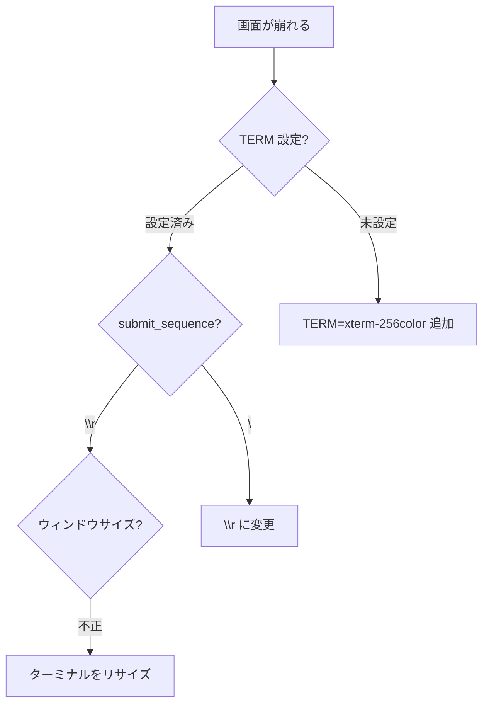
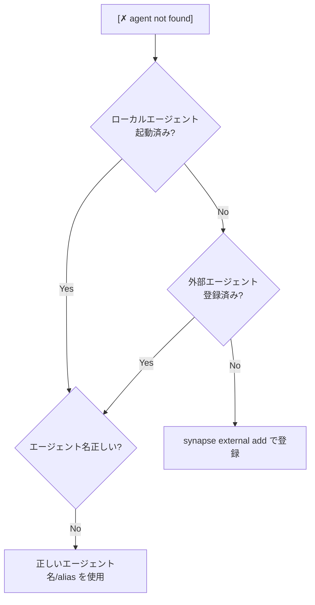
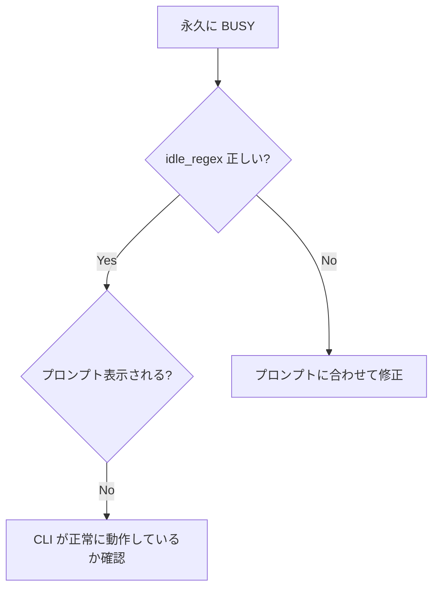
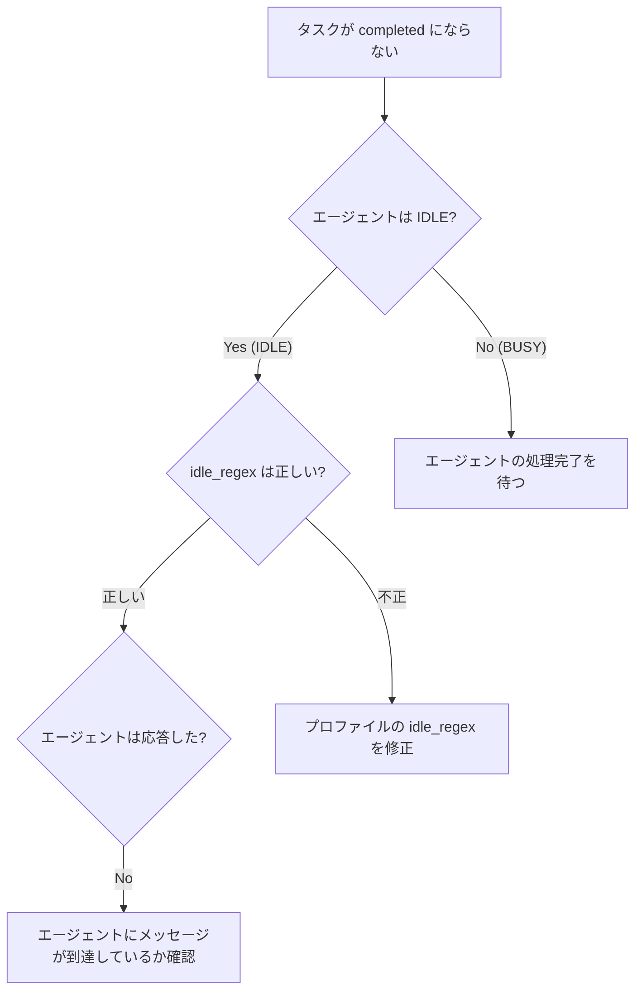
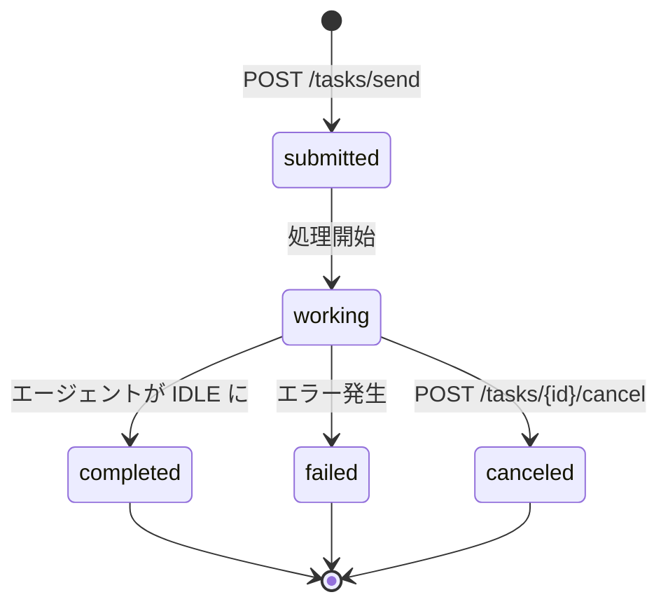

# Troubleshooting

Synapse A2A でよくある問題とその対処法をまとめています。

---

## 1. PTY / TUI の描画問題

### 1.1 画面が崩れる / 更新されない



**症状**:
- 画面が真っ黒になる
- 表示が更新されない
- カーソル位置がずれる

**対処法**:

1. **TERM 環境変数を確認**

```yaml
# synapse/profiles/claude.yaml
env:
  TERM: "xterm-256color"
```

2. **submit_sequence を変更**

TUI ベースの CLI は `\r` を使用します。

```yaml
submit_sequence: "\r"
```

3. **ターミナルをリサイズ**

PTY はウィンドウサイズを同期しています。リサイズすると再描画されることがあります。

---

### 1.2 入力欄が複数表示される

**症状**:
- 入力プロンプトが重複して表示される
- 入力位置が分からなくなる

**原因**:
Claude Code CLI など Ink ベースの TUI で発生する既知の問題です。

**対処法**:
- CLI を最新版にアップデート
- ターミナルを再起動
- 別のターミナルエミュレータを試す

---

### 1.3 日本語が文字化けする

**症状**:
- 日本語が正しく表示されない
- 文字が豆腐になる

**対処法**:

```yaml
env:
  LANG: "ja_JP.UTF-8"
  LC_ALL: "ja_JP.UTF-8"
  TERM: "xterm-256color"
```

---

## 2. エージェント検出の問題

### 2.1 @Agent が「not found」になる



**確認コマンド**:

```bash
# ローカルエージェント一覧を確認
synapse list

# 外部エージェント一覧を確認
synapse external list

# ローカル Registry ファイルを確認
ls -la ~/.a2a/registry/
cat ~/.a2a/registry/*.json | jq .

# 外部 Registry ファイルを確認
ls -la ~/.a2a/external/
cat ~/.a2a/external/*.json | jq .
```

**対処法**:

1. ローカルエージェントの場合: `synapse list` で起動確認
2. 外部エージェントの場合: `synapse external list` で登録確認
3. エージェント名（タイプ/alias）が正しいか確認

---

### 2.2 synapse list に表示されない

**症状**:
- エージェントを起動したが `synapse list` に出てこない

**原因候補**:
- 起動が正常に完了していない
- Registry への登録が失敗している
- 古い Registry ファイルが残っている

**対処法**:

```bash
# Registry ディレクトリをクリーンアップ
rm -rf ~/.a2a/registry/*

# エージェントを再起動
synapse claude --port 8100
```

---

### 2.3 古いエージェント情報が残る

**症状**:
- 停止したはずのエージェントが `synapse list` に表示される

**対処法**:

```bash
# Registry ファイルを手動削除
rm ~/.a2a/registry/<agent_id>.json

# または全てクリア
rm -rf ~/.a2a/registry/*
```

---

## 3. ネットワーク/ポートの問題

### 3.1 ポートが使用中

**症状**:
```
Error: Address already in use
```

**確認コマンド**:

```bash
# ポートを使用しているプロセスを確認
lsof -i :8100

# プロセスを強制終了
kill -9 <PID>
```

**対処法**:

1. 既存のプロセスを終了
2. 別のポートを使用

```bash
synapse claude --port 8200
```

---

### 3.2 HTTP リクエストがタイムアウトする

**症状**:
- `curl` がタイムアウトする
- `@Agent` の送信が失敗する

**確認コマンド**:

```bash
# サーバーが応答するか確認
curl -v http://localhost:8100/status
```

**対処法**:

1. エージェントが起動しているか確認
2. ファイアウォール設定を確認
3. ポート番号が正しいか確認

---

## 4. 状態検出の問題

### 4.1 IDLE にならない（永久に BUSY）



**原因**:
`idle_regex` が CLI のプロンプトと一致していない

**確認方法**:

```bash
# CLI を直接起動してプロンプトを確認
claude

# 表示されるプロンプト
# > _
```

**対処法**:

```yaml
# プロンプトに合わせて修正
idle_regex: "> $"

# 複数パターンに対応
idle_regex: "(> |>>> )$"
```

---

### 4.2 --response でレスポンスが返ってこない

**症状**:
- `@agent --response` がタイムアウトする
- レスポンスが空になる

**原因候補**:
- 相手エージェントが IDLE にならない
- 処理時間が 60 秒を超えている
- ネットワークの問題

**対処法**:

1. 相手エージェントの状態を確認

```bash
curl http://localhost:8101/status
```

2. 長時間の処理は手動でポーリング

```bash
# ステータスを監視
watch -n 1 'curl -s http://localhost:8101/status | jq .'
```

---

## 5. 入力の問題

### 5.1 @Agent が認識されない

**症状**:
- `@agent` を入力しても通常のテキストとして扱われる

**原因候補**:
- 行頭から `@` で始まっていない
- スペースや不可視文字が含まれている

**対処法**:

- 必ず行頭から `@agent` を入力
- コピー&ペーストではなく手入力で試す

```text
# 正しい例
@codex メッセージ

# 間違った例
 @codex メッセージ  ← 先頭にスペース
```

---

### 5.2 日本語入力（IME）の問題

**症状**:
- 日本語入力時に挙動がおかしくなる
- 確定前の文字が表示されない

**原因**:
入力が 1 文字ずつ処理されるため、IME の挙動と干渉する場合があります。

**対処法**:
- メッセージを事前に入力してからペースト
- 英語でメッセージを記述

---

## 6. ログとデバッグ

### 6.1 ログファイルの場所

| ログ | パス |
|------|------|
| エージェントログ | `~/.synapse/logs/<profile>.log` |
| InputRouter ログ | `~/.synapse/logs/input_router.log` |

### 6.2 デバッグコマンド

```bash
# InputRouter ログをリアルタイム監視
tail -f ~/.synapse/logs/input_router.log

# エージェントログを確認
synapse logs claude -f

# Registry の状態を確認
cat ~/.a2a/registry/*.json | jq .

# ステータスを継続監視
watch -n 1 'curl -s http://localhost:8100/status | jq .'
```

### 6.3 詳細デバッグ（内部 A2A 通信）

内部通信のデバッグには、Google A2A 準拠の `/tasks/send` エンドポイントを使用してください。

> **重要**: `/message` エンドポイントは非推奨です。新規開発では `/tasks/send` を使用してください。

```bash
# フォアグラウンドで起動（ログが見える）
synapse start claude --port 8100 --foreground

# 推奨: A2A 準拠の /tasks/send を使用
curl -v http://localhost:8100/tasks/send \
  -H "Content-Type: application/json" \
  -d '{
    "message": {
      "role": "user",
      "parts": [{"type": "text", "text": "test"}]
    }
  }'

# 緊急メッセージ（priority 5）を送信
curl -v "http://localhost:8100/tasks/send-priority?priority=5" \
  -H "Content-Type: application/json" \
  -d '{
    "message": {
      "role": "user",
      "parts": [{"type": "text", "text": "stop"}]
    }
  }'

# タスクの状態を確認
curl -s http://localhost:8100/tasks/<task_id> | jq .

# 全タスク一覧を取得
curl -s http://localhost:8100/tasks | jq .

# Agent Card を確認
curl -s http://localhost:8100/.well-known/agent.json | jq .

# 非推奨: 旧 /message エンドポイント（後方互換性のため残存）
# curl -v http://localhost:8100/message \
#   -H "Content-Type: application/json" \
#   -d '{"content": "test", "priority": 1}'
```

### 6.4 テストの実行

A2A プロトコル準拠を検証するためのテストスイートが用意されています。

```bash
# 全テストを実行
pytest tests/

# 特定のテストファイルを実行
pytest tests/test_server.py      # サーバーエンドポイントのテスト
pytest tests/test_a2a_compat.py  # A2A 互換性レイヤーのテスト
pytest tests/test_a2a_client.py  # A2A クライアントのテスト
pytest tests/test_registry.py    # エージェント登録のテスト

# 詳細な出力を表示
pytest tests/ -v

# 特定のテストのみ実行
pytest tests/test_server.py::TestA2AEndpoints -v
```

---

## 7. よくある質問 (FAQ)

### Q1. 複数の同じエージェントを起動できる？

**A**: 可能ですが、異なるポートと作業ディレクトリが必要です。

```bash
# ディレクトリ 1
cd /project1
synapse claude --port 8100

# ディレクトリ 2
cd /project2
synapse claude --port 8200
```

---

### Q2. Windows で使える？

**A**: WSL2 を推奨します。Windows ネイティブでは PTY の動作が異なるため、問題が発生する可能性があります。

---

### Q3. Priority 5 で止まらない

**A**: SIGINT を無視する CLI があります。その場合は手動で Ctrl+C を押すか、プロセスを強制終了してください。

```bash
synapse stop claude
# または
kill -9 <PID>
```

---

### Q4. API サーバーだけ起動したい

**A**: `synapse start` でバックグラウンド起動できます。

```bash
synapse start claude --port 8100
```

---

## 8. 外部エージェントの問題

### 8.1 外部エージェントの発見に失敗する

**症状**:

```
Failed to discover agent at http://example.com
```

**原因候補**:

- URL が間違っている
- エージェントが起動していない
- ネットワーク接続の問題
- Agent Card (`/.well-known/agent.json`) が提供されていない

**確認コマンド**:

```bash
# Agent Card が取得できるか確認
curl http://example.com/.well-known/agent.json
```

**対処法**:

1. URL が正しいか確認（末尾のスラッシュに注意）
2. 対象サーバーが起動しているか確認
3. ファイアウォール/ネットワーク設定を確認

---

### 8.2 外部エージェントへのメッセージ送信に失敗する

**症状**:

- `@external_alias` でエラーになる
- `synapse external send` がタイムアウトする

**確認コマンド**:

```bash
# 外部エージェントの情報を確認
synapse external info <alias>

# 直接 API を叩いて確認
curl -X POST http://<agent_url>/tasks/send \
  -H "Content-Type: application/json" \
  -d '{"message": {"role": "user", "parts": [{"type": "text", "text": "test"}]}}'
```

**対処法**:

1. エージェントが応答しているか確認
2. エージェントの URL が変更されていないか確認
3. 必要に応じて再登録: `synapse external remove <alias>` → `synapse external add ...`

---

### 8.3 外部エージェントの登録情報をクリアしたい

**対処法**:

```bash
# 個別削除
synapse external remove <alias>

# 全てクリア
rm -rf ~/.a2a/external/*
```

---

## 9. 内部 A2A 通信の問題

### 9.1 /tasks/send でエラーが発生する

**症状**:
```
HTTP 400 Bad Request
```

**原因候補**:
- メッセージ形式が不正
- `parts` 配列が空

**確認コマンド**:

```bash
# 正しいリクエスト形式
curl -X POST http://localhost:8100/tasks/send \
  -H "Content-Type: application/json" \
  -d '{
    "message": {
      "role": "user",
      "parts": [{"type": "text", "text": "メッセージ内容"}]
    }
  }'
```

**対処法**:
1. `message.parts` 配列に少なくとも 1 つの要素があることを確認
2. 各 part に `type` と `text` フィールドがあることを確認
3. `role` は `"user"` または `"agent"` を指定

---

### 9.2 タスクのステータスが取得できない

**症状**:
```
HTTP 404 Not Found
```

**原因候補**:
- タスク ID が間違っている
- タスクが作成されていない

**確認コマンド**:

```bash
# 存在するタスク一覧を確認
curl -s http://localhost:8100/tasks | jq '.[].id'

# 特定のタスクを確認
curl -s http://localhost:8100/tasks/<task_id> | jq .
```

**対処法**:
1. `/tasks/send` のレスポンスから正しいタスク ID を取得
2. タスク一覧から存在するタスク ID を確認

---

### 9.3 タスクが completed にならない

**症状**:
- `GET /tasks/{id}` で常に `working` が返される
- `completed` にならない



**確認コマンド**:

```bash
# エージェントのステータスを確認
curl -s http://localhost:8100/status | jq .

# タスクのステータスとアーティファクトを確認
curl -s http://localhost:8100/tasks/<task_id> | jq '{status, artifacts}'
```

**対処法**:
1. エージェントが `IDLE` になるまで待機
2. プロファイルの `idle_regex` がプロンプトと一致しているか確認
3. エージェントログでエラーがないか確認

---

### 9.4 旧 /message エンドポイントからの移行

**状況**:
`/message` エンドポイントは非推奨となりました。新しい `/tasks/send` への移行を推奨します。

**変更点**:

| 項目 | 旧 API (`/message`) | 新 API (`/tasks/send`) |
|------|---------------------|------------------------|
| エンドポイント | `POST /message` | `POST /tasks/send` |
| 優先度指定 | `{"priority": 5}` | `POST /tasks/send-priority?priority=5` |
| メッセージ形式 | `{"content": "..."}` | `{"message": {"parts": [...]}}` |
| 状態追跡 | なし | `GET /tasks/{id}` |
| 結果取得 | なし | `artifacts` フィールド |

**移行例**:

```bash
# 旧 API（非推奨）
curl -X POST http://localhost:8100/message \
  -H "Content-Type: application/json" \
  -d '{"content": "hello", "priority": 1}'

# 新 API（推奨）
curl -X POST http://localhost:8100/tasks/send \
  -H "Content-Type: application/json" \
  -d '{
    "message": {
      "role": "user",
      "parts": [{"type": "text", "text": "hello"}]
    }
  }'
```

**注意**:
- 旧 `/message` エンドポイントは後方互換性のため残されていますが、内部的に A2A タスクを作成します
- レスポンスに `task_id` が含まれるため、それを使って状態を追跡できます

---

### 9.5 A2A タスクの状態遷移

タスクは以下の状態を遷移します：



| ステータス | 説明 |
|-----------|------|
| `submitted` | タスクが受付済み |
| `working` | エージェントが処理中 |
| `completed` | 処理完了（`artifacts` に結果） |
| `failed` | 処理失敗 |
| `canceled` | キャンセル済み |

---

## 10. 問題報告

問題が解決しない場合は、以下の情報を添えて報告してください：

1. OS とバージョン
2. Python バージョン
3. Synapse A2A バージョン
4. 使用している CLI ツール
5. エラーメッセージ
6. `~/.synapse/logs/input_router.log` の内容
7. 外部エージェントの問題の場合: 対象 URL と Agent Card
8. A2A 関連の問題の場合:
   - 使用しているエンドポイント（`/tasks/send` or `/message`）
   - タスク ID とステータス（`curl http://localhost:PORT/tasks/<id>`）
   - テスト結果（`pytest tests/ -v` の出力）

---

## 関連ドキュメント

- [profiles.md](profiles.md) - プロファイル設定
- [usage.md](usage.md) - 使い方詳細
- [architecture.md](architecture.md) - 内部アーキテクチャ
- [google-a2a-spec.md](google-a2a-spec.md) - Google A2A プロトコル仕様
