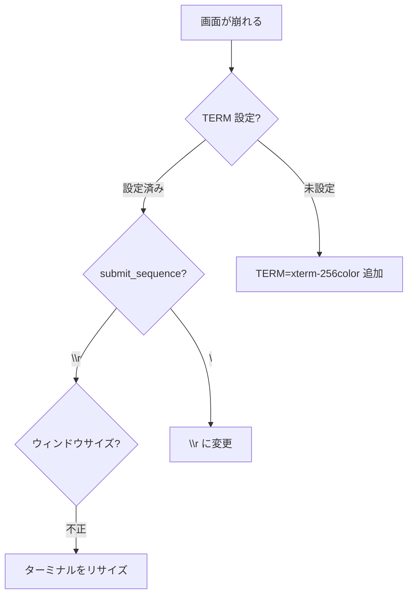
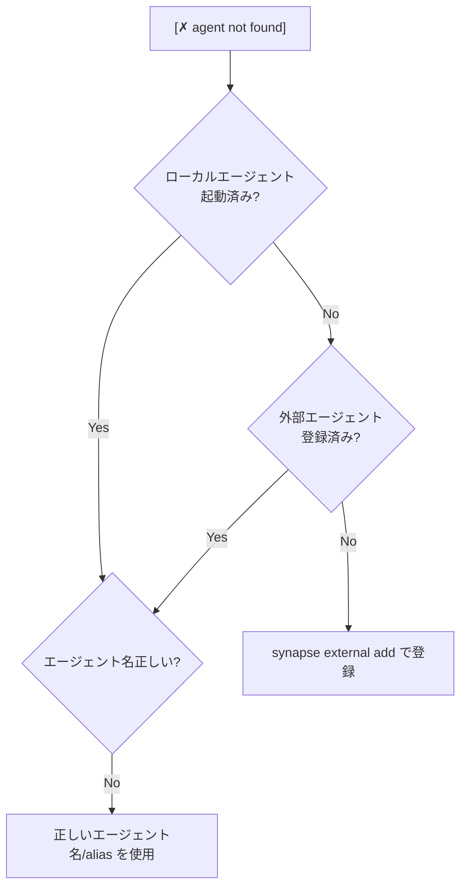
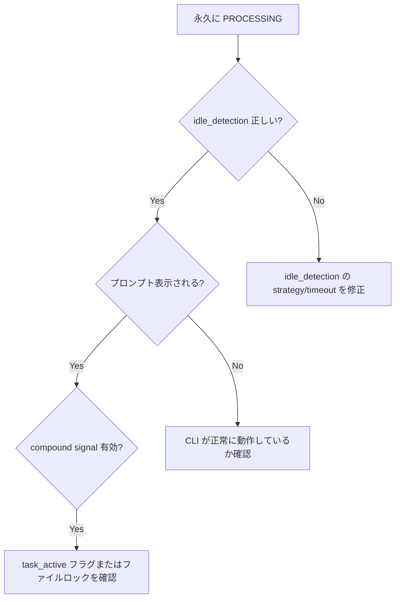
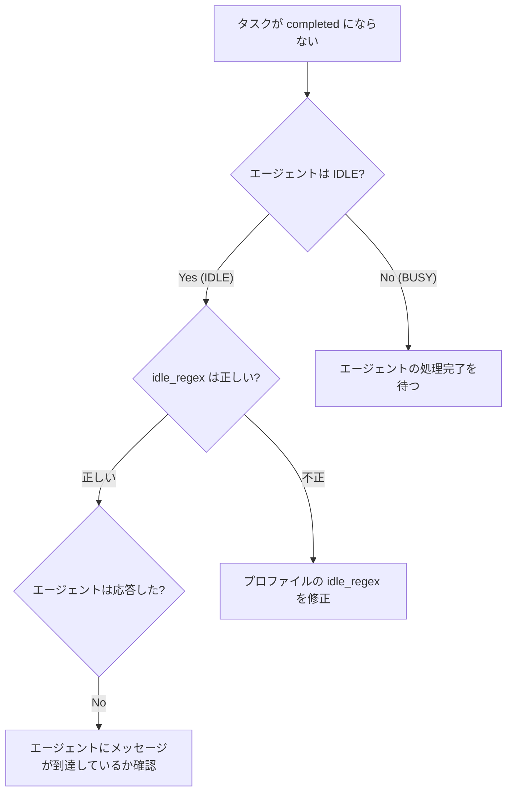
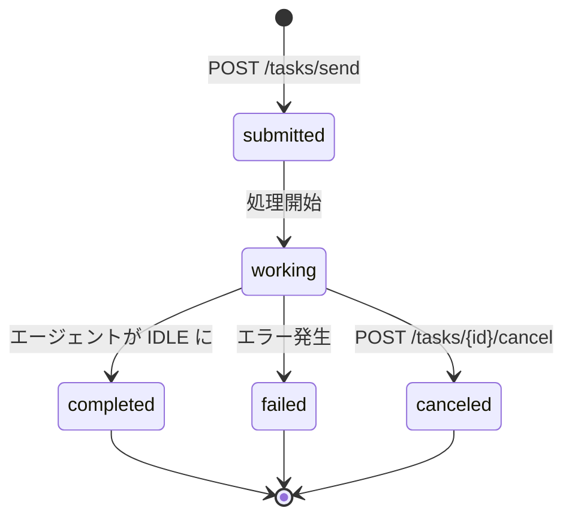

# Troubleshooting

Synapse A2A でよくある問題とその対処法をまとめています。

---

## 1. PTY / TUI の描画問題

### 1.1 画面が崩れる / 更新されない


```mermaid
flowchart TB
    Problem["画面が崩れる"]
    Check1{"TERM 設定?"}
    Check2{"submit_sequence?"}
    Check3{"ウィンドウサイズ?"}

    Problem --> Check1
    Check1 -->|"未設定"| Fix1["TERM=xterm-256color 追加"]
    Check1 -->|"設定済み"| Check2
    Check2 -->|"\\n"| Fix2["\\r に変更"]
    Check2 -->|"\\r"| Check3
    Check3 -->|"不正"| Fix3["ターミナルをリサイズ"]
```

**症状**:
- 画面が真っ黒になる
- 表示が更新されない
- カーソル位置がずれる

**対処法**:

1. **TERM 環境変数を確認**

```yaml
# synapse/profiles/claude.yaml
env:
  TERM: "xterm-256color"
```

2. **submit_sequence を変更**

TUI ベースの CLI は `\r` を使用します。

```yaml
submit_sequence: "\r"
```

3. **ターミナルをリサイズ**

PTY はウィンドウサイズを同期しています。リサイズすると再描画されることがあります。

---

### 1.2 Copilot でペースト後に Enter が効かない

**症状**:
- Copilot CLI にメッセージを送信しても、ペーストされたテキストが表示されるが実行されない
- Enter キー（CR）が無視される

**原因**:
PTY のデフォルト行規則（ICRNL）が `\r` を `\n` に変換するため、Ink ベースの TUI が Enter として認識しないことがあります。また、ブラケテッドペーストの書き込みが OS レベルで分割されると、Ink のペースト境界検出が混乱することがあります。さらに、Copilot は同じ `[Paste #N ...]` や `[Saved pasted content ...]` の表示を連続送信で使い回すことがあり、見た目が変わらなくても内部的には未確定のまま残ることがあります。

**対処法**:
v0.15.11 以降で自動修正されています。コントローラーは以下の 3 つの対策を行います：

1. **PTY raw モード設定**: 子プロセス起動前に `tty.setraw(slave_fd)` を実行し、`\r` がそのまま通過
2. **tcdrain**: ブラケテッドペースト書き込み後に `termios.tcdrain()` でアトミック配信を保証
3. **settle 遅延**: ペーストエコー検出後に 150ms 待機し、React の `setState` が完了してから CR を送信

古いバージョンを使用している場合は Synapse A2A をアップデートしてください。同じプレースホルダ名が再表示される場合も、未確定なら Enter の再送が続くように改善済みです。

---

### 1.3 入力欄が複数表示される

**症状**:
- 入力プロンプトが重複して表示される
- 入力位置が分からなくなる

**原因**:
Claude Code CLI など Ink ベースの TUI で発生する既知の問題です。

**対処法**:
- CLI を最新版にアップデート
- ターミナルを再起動
- 別のターミナルエミュレータを試す

---

### 1.4 日本語が文字化けする

**症状**:
- 日本語が正しく表示されない
- 文字が豆腐になる

**対処法**:

```yaml
env:
  LANG: "ja_JP.UTF-8"
  LC_ALL: "ja_JP.UTF-8"
  TERM: "xterm-256color"
```

---

## 2. エージェント検出の問題

### 2.1 @Agent が「not found」になる


```mermaid
flowchart TB
    Error["[✗ agent not found]"]
    Check1{"ローカルエージェント<br/>起動済み?"}
    Check2{"外部エージェント<br/>登録済み?"}
    Check3{"エージェント名正しい?"}

    Error --> Check1
    Check1 -->|"No"| Check2
    Check1 -->|"Yes"| Check3
    Check2 -->|"No"| Fix2["synapse external add で登録"]
    Check2 -->|"Yes"| Check3
    Check3 -->|"No"| Fix3["正しいエージェント名/alias を使用"]
```

**確認コマンド**:

```bash
# ローカルエージェント一覧を確認
synapse list

# 外部エージェント一覧を確認
synapse external list

# ローカル Registry ファイルを確認
ls -la ~/.a2a/registry/
cat ~/.a2a/registry/*.json | jq .

# 外部 Registry ファイルを確認
ls -la ~/.a2a/external/
cat ~/.a2a/external/*.json | jq .
```

**対処法**:

1. ローカルエージェントの場合: `synapse list` で起動確認
2. 外部エージェントの場合: `synapse external list` で登録確認
3. エージェント名（タイプ/alias）が正しいか確認

---

### 2.2 synapse list に表示されない

**症状**:
- エージェントを起動したが `synapse list` に出てこない

**原因候補**:
- 起動が正常に完了していない
- Registry への登録が失敗している
- 古い Registry ファイルが残っている

**対処法**:

```bash
# Registry ディレクトリをクリーンアップ
rm -rf ~/.a2a/registry/*

# エージェントを再起動
synapse claude --port 8100
```

---

### 2.3 古いエージェント情報が残る

**症状**:
- 停止したはずのエージェントが `synapse list` に表示される

**対処法**:

```bash
# Registry ファイルを手動削除
rm ~/.a2a/registry/<agent_id>.json

# または全てクリア
rm -rf ~/.a2a/registry/*
```

---

## 3. ネットワーク/ポートの問題

### 3.1 Codex サンドボックスでのネットワークエラー

**症状**:
- Codex から `@claude` や `@gemini` でメッセージ送信時にエラー
- `Operation not permitted` または接続エラー

```
[errno 1] Operation not permitted
```

**原因**:
Codex CLI はデフォルトでサンドボックス内で実行され、ネットワークアクセス（TCP/UDS ソケット）がブロックされています。

**対処法**:

`~/.codex/config.toml` でネットワークアクセスを許可します。

**方法 1: グローバル設定（全プロジェクトに適用）**

```toml
# ~/.codex/config.toml

sandbox_mode = "workspace-write"

[sandbox_workspace_write]
network_access = true
```

**方法 2: プロジェクト単位の設定**

特定のプロジェクトでのみネットワークアクセスを許可する場合：

```toml
# ~/.codex/config.toml

[projects."/path/to/your/project"]
sandbox_mode = "workspace-write"

[projects."/path/to/your/project".sandbox_workspace_write]
network_access = true
```

**方法 3: プロファイルを使用**

Synapse 用のプロファイルを作成し、起動時に指定：

```toml
# ~/.codex/config.toml

[profiles.synapse]
sandbox_mode = "workspace-write"

[profiles.synapse.sandbox_workspace_write]
network_access = true
```

```bash
# プロファイルを指定して起動
codex --profile synapse
```

**確認方法**:

設定後、Codex を再起動してからエージェント間通信をテスト：

```bash
# Codex 内で
@claude こんにちは
```

**注意事項**:
- `network_access = true` はアウトバウンドネットワーク接続を許可します
- セキュリティ上の理由から、必要なプロジェクトのみに設定することを推奨します
- `danger-full-access` モードはすべての制限を解除しますが、セキュリティリスクがあるため非推奨です

---

### 3.2 ポートが使用中

**症状**:
```
Error: Address already in use
```

**確認コマンド**:

```bash
# ポートを使用しているプロセスを確認
lsof -i :8100

# プロセスを強制終了
kill -9 <PID>
```

**対処法**:

1. 既存のプロセスを終了
2. 別のポートを使用

```bash
synapse claude --port 8200
```

---

### 3.2.1 孤立リスナーによるポート枯渇（`synapse doctor`）

**症状**:
- エージェントを `synapse list` で見ると生きていないのに、管理ポート範囲 (8100–8149) が全て使用中で新規起動に失敗する
- レジストリ (`~/.a2a/registry/`) にエントリがないプロセスが管理ポートで LISTEN している
- UDS ソケット (`/tmp/synapse-a2a/*.sock`) がレジストリと対応しない状態で残っている

**原因**:
`synapse` プロセスが異常終了した場合、レジストリファイルと UDS ソケットがクリーンアップされないことがありました。ポートは LISTEN 中で残るため port-manager が再利用できず、見かけ上「空きポートなし」になります。v0.26.0 以降で順次修正され、通常終了時は `registry.unregister_self()` が原子的に `.json` を消し、`port-manager` は孤立リスナーを正しく検出するようになっています。

**確認 / 復旧**:

```bash
# 孤立リスナーと stale ソケットをレポート
synapse doctor

# 対話的に終了・削除（PID ごとに確認）
synapse doctor --clean

# 確認プロンプトを飛ばして一括クリーン
synapse doctor --clean -y

# CI で孤立が残っていれば失敗させる
synapse doctor --strict
```

`synapse doctor --clean` は以下を行います。

1. 管理ポート範囲で LISTEN しているが、生きているレジストリエントリと紐付かないプロセスを `SIGTERM`（5 秒後に `SIGKILL`）で終了します。
2. レジストリに対応しない `/tmp/synapse-a2a/*.sock` (`SYNAPSE_UDS_DIR` で上書き可) を削除します。

**注意**: `--clean` は確認なしで `-y` を付けない限り、各孤立プロセスごとに対話プロンプトが出ます。自動化ジョブで使う場合は `--clean -y` を指定してください。

---

### 3.3 `synapse send` が `local send failed` で失敗する

**症状**:
```
Error sending message: local send failed
  Use SYNAPSE_LOG_LEVEL=DEBUG for details.
```

**原因**:
ローカル配送経路（UDS またはループバック TCP）への接続・送信が失敗しました。UDS ソケットが存在しない、接続拒否、HTTP エラーレスポンス、タイムアウト等が考えられます。

**対処法**:

1. **詳細ログを有効化して再実行**:
   ```bash
   SYNAPSE_LOG_LEVEL=DEBUG synapse send <target> "test" --silent
   ```
   `~/.synapse/logs/shell.log` または stderr に UDS/TCP の失敗理由（接続拒否、HTTP ステータス等）が出力されます。

2. **ターゲットエージェントが起動しているか確認**:
   ```bash
   synapse list
   curl http://localhost:<port>/status
   ```

3. **`Agent busy (working task)`（HTTP 409）の場合**: ターゲットがタスク処理中です。`synapse status <target>` で進捗を確認し、必要に応じて `-p 5` で緊急割り込みしてください。`synapse send` は通常 PROCESSING 解消を最大 30 秒待ちますが、それを超える長時間処理ではこの警告が返されます。

---

### 3.4 `Warning: Could not identify sender agent`

**症状**:
```
Warning: Could not identify sender agent. Set SYNAPSE_AGENT_ID or use --from.
```

**原因**:
`SYNAPSE_AGENT_ID` 環境変数が未設定で、プロセス祖先による PID マッチングも失敗しました。Codex 等のサンドボックス環境で環境変数が伝播しない場合によく発生します。

**対処法**:

```bash
# 自分のエージェント ID を明示指定
synapse send <target> "message" --from synapse-codex-8121

# または環境変数で設定
export SYNAPSE_AGENT_ID=synapse-codex-8121
synapse send <target> "message"
```

自分のエージェント ID は `synapse list` で確認できます。

---

### 3.5 HTTP リクエストがタイムアウトする

**症状**:
- `curl` がタイムアウトする
- `@Agent` の送信が失敗する

**確認コマンド**:

```bash
# サーバーが応答するか確認
curl -v http://localhost:8100/status
```

**対処法**:

1. エージェントが起動しているか確認
2. ファイアウォール設定を確認
3. ポート番号が正しいか確認

---

## 4. 状態検出の問題

### 4.1 READY にならない（永久に PROCESSING）


```mermaid
flowchart TB
    Problem["永久に PROCESSING"]
    Check1{"idle_detection 正しい?"}
    Check2{"プロンプト表示される?"}
    Check3{"compound signal 有効?"}

    Problem --> Check1
    Check1 -->|"No"| Fix1["idle_detection の strategy/timeout を修正"]
    Check1 -->|"Yes"| Check2
    Check2 -->|"No"| Fix2["CLI が正常に動作しているか確認"]
    Check2 -->|"Yes"| Check3
    Check3 -->|"Yes"| Fix3["task_active フラグまたはファイルロックを確認"]
```

**原因候補**:
1. `idle_detection` の設定が CLI のプロンプトと一致していない
2. **Compound signal が READY 遷移を抑制している**: `task_active` フラグが設定されている、またはファイルロックが保持されている場合、PTY がアイドルでも PROCESSING が維持される

**確認方法**:

```bash
# synapse status で詳細状態を確認
synapse status <agent-name>
synapse status <agent-name> --json

# CLI を直接起動してプロンプトを確認
claude

# 表示されるプロンプト
# > _
```

**対処法**:

```yaml
# idle_detection の strategy, timeout, compound signal を一括設定
idle_detection:
  strategy: "timeout"
  timeout: 1.0
  task_protection_timeout: 15  # compound signal のタイムアウトを短縮（デフォルト 30s）
```

---

### 4.2 WAITING に遷移しない（ratatui / TUI で画面テキストが壊れて見える）

**症状**:
- 権限プロンプトが画面に表示されているのに `synapse list` / `synapse status` が WAITING にならない
- codex (ratatui) や Ink ベースの TUI で、`/status` の `context` に `Working•Working•orking•rking` のように破壊された文字列が混じる

**原因**:
ratatui などの TUI は cursor motion (`\x1b[H`, `\x1b[<n>;<m>H`) で同じセルを繰り返し書き換えます。旧実装ではこれを ANSI strip した raw bytes に対して waiting_detection regex を評価していたため、画面上は正しく表示されていても regex 側には重ね書き前のペイロードが連結された状態で届き、どの regex にもマッチしませんでした（[#572](https://github.com/s-hiraoku/synapse-a2a/issues/572)）。

**対処**:
v0.x の該当修正以降、`synapse/pty_renderer.py` の `pyte` ベース仮想ターミナルが raw bytes を再生し、waiting_detection はレンダリング後の画面テキストに対して評価されます。基本的にユーザ側で何か設定する必要はありません。挙動を確認したい場合は `GET /debug/pty` で regex が実際に見ている画面を取得できます。

```bash
# エージェントのポートを確認
synapse list --json | jq -r '.[] | "\(.agent_id) \(.port)"'

# waiting_detection regex が見ている画面を取得
curl http://localhost:8126/debug/pty | jq .display

# alt-screen buffer 中か、カーソル位置も合わせて確認
curl http://localhost:8126/debug/pty | jq '{alt_screen, cursor}'
```

画面自体は正しくレンダリングされているのに WAITING にならない場合は、プロファイルの `waiting_detection.regex` がその画面テキストにマッチしていない可能性が高いので、regex 側を調整してください。

**汎用ヒューリスティック フォールバック (#594)**: プロファイル regex がマッチしなくても、共通の確認プロンプト形（`[Y/N]`、`Press Enter`、`Do you want to ...`、番号付き選択肢など）に該当すれば WAITING に遷移します。フォールバック由来の場合は `IdleStateEvaluation.waiting_source = "heuristic"` / `waiting_confidence = 0.6` が立ち、profile regex の一致は `waiting_source = "regex"` / `waiting_confidence = 1.0` になります。プロファイル側で無効化するには `waiting_detection.heuristic_fallback: false` を設定してください。

---

### 4.3 レスポンスが返ってこない（タイムアウト）

**症状**:
- `@agent` でメッセージ送信後、レスポンスがタイムアウトする
- レスポンスが空になる

**原因候補**:
- 相手エージェントが READY にならない
- 処理時間が 60 秒を超えている
- ネットワークの問題

**対処法**:

1. 相手エージェントの状態を確認

```bash
# synapse status コマンドで詳細確認
synapse status <agent-name>

# API 経由で確認
curl http://localhost:8120/status
```

2. 長時間の処理は手動でポーリング

```bash
# ステータスを監視
watch -n 1 'synapse status <agent-name> --json'
```

---

## 5. 入力の問題

### 5.1 @Agent が認識されない

**症状**:
- `@agent` を入力しても通常のテキストとして扱われる

**原因候補**:
- 行頭から `@` で始まっていない
- スペースや不可視文字が含まれている

**対処法**:

- 必ず行頭から `@agent` を入力
- コピー&ペーストではなく手入力で試す

```text
# 正しい例
@codex メッセージ

# 間違った例
 @codex メッセージ  ← 先頭にスペース
```

---

### 5.2 日本語入力（IME）の問題

**症状**:
- 日本語入力時に挙動がおかしくなる
- 確定前の文字が表示されない

**原因**:
入力が 1 文字ずつ処理されるため、IME の挙動と干渉する場合があります。

**対処法**:
- メッセージを事前に入力してからペースト
- 英語でメッセージを記述

---

## 6. ログとデバッグ

### 6.1 ログファイルの場所

| ログ | パス |
|------|------|
| エージェントログ | `~/.synapse/logs/<profile>.log` |
| Shell ログ | `~/.synapse/logs/shell.log` |

### 6.2 デバッグコマンド

```bash
# Shell ログをリアルタイム監視
tail -f ~/.synapse/logs/shell.log

# エージェントログを確認
synapse logs claude -f

# Registry の状態を確認
cat ~/.a2a/registry/*.json | jq .

# ステータスを継続監視
watch -n 1 'curl -s http://localhost:8100/status | jq .'
```

### 6.3 詳細デバッグ（内部 A2A 通信）

内部通信のデバッグには、Google A2A 準拠の `/tasks/send` エンドポイントを使用してください。

> **重要**: `/tasks/send` エンドポイントを使用してください。`/message` は後方互換性のためのみ提供されています。

```bash
# フォアグラウンドで起動（ログが見える）
synapse start claude --port 8100 --foreground

# 推奨: A2A 準拠の /tasks/send を使用
curl -v http://localhost:8100/tasks/send \
  -H "Content-Type: application/json" \
  -d '{
    "message": {
      "role": "user",
      "parts": [{"type": "text", "text": "test"}]
    }
  }'

# 緊急メッセージ（priority 5）を送信
curl -v "http://localhost:8100/tasks/send-priority?priority=5" \
  -H "Content-Type: application/json" \
  -d '{
    "message": {
      "role": "user",
      "parts": [{"type": "text", "text": "stop"}]
    }
  }'

# タスクの状態を確認
curl -s http://localhost:8100/tasks/<task_id> | jq .

# 全タスク一覧を取得
curl -s http://localhost:8100/tasks | jq .

# Agent Card を確認
curl -s http://localhost:8100/.well-known/agent.json | jq .

# 後方互換: /message エンドポイント（/tasks/send を推奨）
# curl -v http://localhost:8100/message \
#   -H "Content-Type: application/json" \
#   -d '{"content": "test", "priority": 1}'
```

### 6.4 テストの実行

A2A プロトコル準拠を検証するためのテストスイートが用意されています。

```bash
# 全テストを実行
pytest tests/

# 特定のテストファイルを実行
pytest tests/test_server.py      # サーバーエンドポイントのテスト
pytest tests/test_a2a_compat.py  # A2A 互換性レイヤーのテスト
pytest tests/test_a2a_client.py  # A2A クライアントのテスト
pytest tests/test_registry.py    # エージェント登録のテスト

# 詳細な出力を表示
pytest tests/ -v

# 特定のテストのみ実行
pytest tests/test_server.py::TestA2AEndpoints -v
```

---

## 7. Spawn の問題

### 7.1 spawn したエージェントが即座に終了する

**症状**:
- `synapse spawn claude` で起動したエージェントがすぐに終了する
- ペインが一瞬開いてすぐ閉じる

**原因候補**:
- Claude Code の場合: `CLAUDECODE` 環境変数がネスト検知を引き起こしている（v0.6.1 で修正済み）
- ポートが既に使用されている
- プロファイルの設定に問題がある

**対処法**:

1. Synapse A2A を最新版にアップデート
2. ポートの競合を確認: `lsof -i :8100`
3. ログを確認: `~/.synapse/logs/<profile>.log`

### 7.2 親が消えた後にオーファン子エージェントが残る

**症状**:
- 親エージェントがクラッシュ／`/clear`／予期せず終了し、`synapse spawn` で起動した子エージェントが孤立して残る
- `synapse list` の STATUS 列に ` [ORPHAN]` が表示される、または `synapse list --json` で `is_orphan: true` が返る
- ポートやワークツリーが解放されない

**原因**:
`synapse spawn` は親の `SYNAPSE_AGENT_ID` を子に `SYNAPSE_SPAWNED_BY` として伝搬し、レジストリに親子関係を保存します。親エントリがレジストリから消える、または親 PID が死亡すると、子はオーファンと判定されます（[#332](https://github.com/s-hiraoku/synapse-a2a/issues/332)）。

**対処**:

```bash
# 1. プレビュー: どの子がオーファンか確認
synapse cleanup --dry-run

# 2. 全オーファンを終了（確認プロンプトあり）
synapse cleanup

# 3. 確認なしで一括終了
synapse cleanup -f

# 4. 特定のオーファンのみ終了
synapse cleanup stale-codex
```

通常終了は `synapse kill <agent>` を使ってください。`synapse cleanup` は対象がオーファンでない場合は拒否します。

`synapse list` 実行時に長時間 READY 状態のオーファンを自動的に reap したい場合は、`SYNAPSE_ORPHAN_IDLE_TIMEOUT=<秒>` を環境変数に設定してください（デフォルト無効）。

### 7.3 spawn したエージェントが reply できない

**症状**:
- spawn されたエージェントが `synapse reply` で返信しようとしてもエラーになる
- 「No reply targets found」と表示される

**原因**:
PTY インジェクション経由でメッセージが送信されるため、送信者情報がリプライキューに登録されません。これは既知の制限です（[#237](https://github.com/s-hiraoku/synapse-a2a/issues/237)）。

**対処法**:

`synapse reply` の代わりに `synapse send` を使用してください（`--from` は通常自動検出されますが、必要に応じて明示指定）：

```bash
# spawn されたエージェント側で（--from は通常省略可）
synapse send <送信元のエージェント> "結果です" --silent
```

---

## 8. よくある質問 (FAQ)

### Q1. 複数の同じエージェントを起動できる？

**A**: 可能ですが、異なるポートと作業ディレクトリが必要です。

```bash
# ディレクトリ 1
cd /project1
synapse claude --port 8100

# ディレクトリ 2
cd /project2
synapse claude --port 8200
```

---

### Q2. Windows で使える？

**A**: WSL2 を推奨します。Windows ネイティブでは PTY の動作が異なるため、問題が発生する可能性があります。

---

### Q3. Priority 5 で止まらない

**A**: SIGINT を無視する CLI があります。その場合は手動で Ctrl+C を押すか、プロセスを強制終了してください。

```bash
synapse stop claude
# または
kill -9 <PID>
```

---

### Q4. API サーバーだけ起動したい

**A**: `synapse start` でバックグラウンド起動できます。

```bash
synapse start claude --port 8100
```

---

## 9. 外部エージェントの問題

### 9.1 外部エージェントの発見に失敗する

**症状**:

```
Failed to discover agent at http://example.com
```

**原因候補**:

- URL が間違っている
- エージェントが起動していない
- ネットワーク接続の問題
- Agent Card (`/.well-known/agent.json`) が提供されていない

**確認コマンド**:

```bash
# Agent Card が取得できるか確認
curl http://example.com/.well-known/agent.json
```

**対処法**:

1. URL が正しいか確認（末尾のスラッシュに注意）
2. 対象サーバーが起動しているか確認
3. ファイアウォール/ネットワーク設定を確認

---

### 9.2 外部エージェントへのメッセージ送信に失敗する

**症状**:

- `@external_alias` でエラーになる
- `synapse external send` がタイムアウトする

**確認コマンド**:

```bash
# 外部エージェントの情報を確認
synapse external info <alias>

# 直接 API を叩いて確認
curl -X POST http://<agent_url>/tasks/send \
  -H "Content-Type: application/json" \
  -d '{"message": {"role": "user", "parts": [{"type": "text", "text": "test"}]}}'
```

**対処法**:

1. エージェントが応答しているか確認
2. エージェントの URL が変更されていないか確認
3. 必要に応じて再登録: `synapse external remove <alias>` → `synapse external add ...`

---

### 9.3 外部エージェントの登録情報をクリアしたい

**対処法**:

```bash
# 個別削除
synapse external remove <alias>

# 全てクリア
rm -rf ~/.a2a/external/*
```

---

## 10. 内部 A2A 通信の問題

### 10.1 /tasks/send でエラーが発生する

**症状**:
```
HTTP 400 Bad Request
```

**原因候補**:
- メッセージ形式が不正
- `parts` 配列が空

**確認コマンド**:

```bash
# 正しいリクエスト形式
curl -X POST http://localhost:8100/tasks/send \
  -H "Content-Type: application/json" \
  -d '{
    "message": {
      "role": "user",
      "parts": [{"type": "text", "text": "メッセージ内容"}]
    }
  }'
```

**対処法**:
1. `message.parts` 配列に少なくとも 1 つの要素があることを確認
2. 各 part に `type` と `text` フィールドがあることを確認
3. `role` は `"user"` または `"agent"` を指定

---

### 10.2 タスクのステータスが取得できない

**症状**:
```
HTTP 404 Not Found
```

**原因候補**:
- タスク ID が間違っている
- タスクが作成されていない

**確認コマンド**:

```bash
# 存在するタスク一覧を確認
curl -s http://localhost:8100/tasks | jq '.[].id'

# 特定のタスクを確認
curl -s http://localhost:8100/tasks/<task_id> | jq .
```

**対処法**:
1. `/tasks/send` のレスポンスから正しいタスク ID を取得
2. タスク一覧から存在するタスク ID を確認

---

### 10.3 タスクが completed にならない

**症状**:
- `GET /tasks/{id}` で常に `working` が返される
- `completed` にならない


```mermaid
flowchart TB
    Problem["タスクが completed にならない"]
    Check1{"エージェントは IDLE?"}
    Check2{"idle_regex は正しい?"}
    Check3{"エージェントは応答した?"}

    Problem --> Check1
    Check1 -->|"No (BUSY)"| Fix1["エージェントの処理完了を待つ"]
    Check1 -->|"Yes (IDLE)"| Check2
    Check2 -->|"不正"| Fix2["プロファイルの idle_regex を修正"]
    Check2 -->|"正しい"| Check3
    Check3 -->|"No"| Fix3["エージェントにメッセージが到達しているか確認"]
```

**確認コマンド**:

```bash
# エージェントのステータスを確認
curl -s http://localhost:8100/status | jq .

# タスクのステータスとアーティファクトを確認
curl -s http://localhost:8100/tasks/<task_id> | jq '{status, artifacts}'
```

**対処法**:
1. エージェントが `READY` になるまで待機
2. プロファイルの `idle_regex` がプロンプトと一致しているか確認
3. エージェントログでエラーがないか確認

---

### 10.4 API エンドポイントの比較

**推奨 API と後方互換 API**:

メッセージ送信には `/tasks/send` エンドポイントを使用してください。`/message` は後方互換性のために提供されています。

| 項目 | `/message` (後方互換) | `/tasks/send` (推奨) |
|------|---------------------|------------------------|
| エンドポイント | `POST /message` | `POST /tasks/send` |
| 優先度指定 | `{"priority": 5}` | `POST /tasks/send-priority?priority=5` |
| メッセージ形式 | `{"content": "..."}` | `{"message": {"parts": [...]}}` |
| 状態追跡 | なし | `GET /tasks/{id}` |
| 結果取得 | なし | `artifacts` フィールド |

**使用例**:

```bash
# 推奨: /tasks/send エンドポイント
curl -X POST http://localhost:8100/tasks/send \
  -H "Content-Type: application/json" \
  -d '{
    "message": {
      "role": "user",
      "parts": [{"type": "text", "text": "hello"}]
    }
  }'

# 後方互換: /message エンドポイント
curl -X POST http://localhost:8100/message \
  -H "Content-Type: application/json" \
  -d '{"content": "hello", "priority": 1}'
```

**注意**:
- `/message` エンドポイントは内部的に A2A タスクを作成します
- レスポンスに `task_id` が含まれるため、それを使って状態を追跡できます

---

### 10.5 A2A タスクの状態遷移

タスクは以下の状態を遷移します：


```mermaid
stateDiagram-v2
    [*] --> submitted: POST /tasks/send
    submitted --> working: 処理開始
    working --> completed: エージェントが IDLE に
    working --> failed: エラー発生
    working --> canceled: POST /tasks/{id}/cancel
    completed --> [*]
    failed --> [*]
    canceled --> [*]
```

| ステータス | 説明 |
|-----------|------|
| `submitted` | タスクが受付済み |
| `working` | エージェントが処理中 |
| `completed` | 処理完了（`artifacts` に結果） |
| `failed` | 処理失敗 |
| `canceled` | キャンセル済み |

---

## 11. 問題報告

問題が解決しない場合は、以下の情報を添えて報告してください：

1. OS とバージョン
2. Python バージョン
3. Synapse A2A バージョン
4. 使用している CLI ツール
5. エラーメッセージ
6. `~/.synapse/logs/shell.log` の内容
7. 外部エージェントの問題の場合: 対象 URL と Agent Card
8. A2A 関連の問題の場合:
   - 使用しているエンドポイント（`/tasks/send` or `/message`）
   - タスク ID とステータス（`curl http://localhost:PORT/tasks/<id>`）
   - テスト結果（`pytest tests/ -v` の出力）

---

## 関連ドキュメント

- [profiles.md](profiles.md) - プロファイル設定
- [usage.md](usage.md) - 使い方詳細
- [architecture.md](architecture.md) - 内部アーキテクチャ
- [google-a2a-spec.md](google-a2a-spec.md) - Google A2A プロトコル仕様
