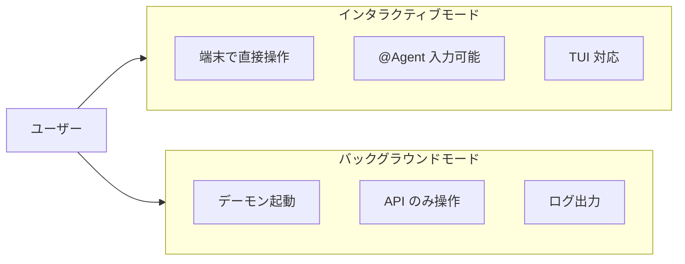
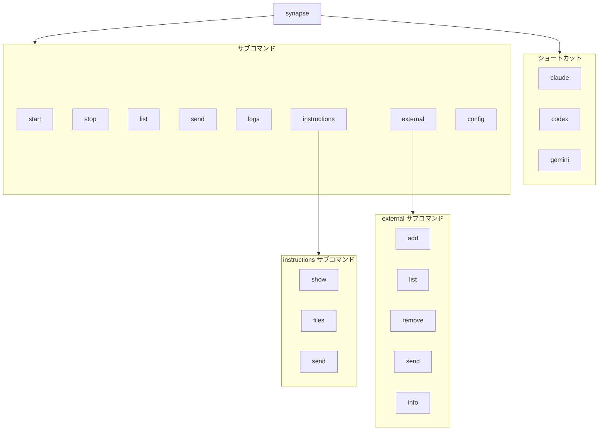
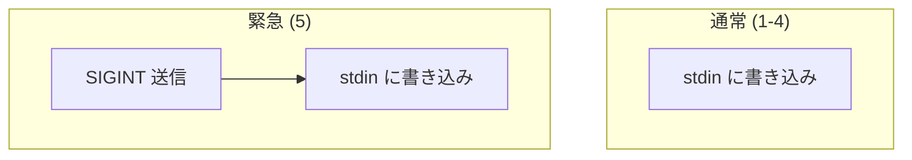
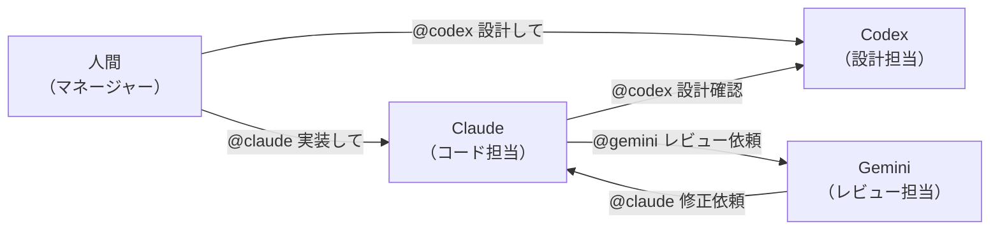

# Usage

このドキュメントでは、Synapse A2A の使い方を詳細に説明します。

---

## 1. 起動モード

Synapse A2A には 2 つの起動モードがあります。



---

### 1.1 インタラクティブモード（推奨）

端末内で直接 CLI を操作しながら、`@Agent` による A2A 通信も可能なモードです。

```bash
synapse claude --port 8100
```

**特徴**:

| 項目 | 説明 |
|------|------|
| 操作 | 端末で直接入力可能 |
| @Agent | `@codex メッセージ` で送信可能 |
| TUI | Ink ベースの TUI も動作（一部制限あり） |
| PTY | `pty.spawn()` でラップ |

**起動時の表示**:

```
[Synapse] Starting claude on port 8100
[Synapse] Submit sequence: '\r'
[Synapse] Use @Agent to send messages to other agents
[Synapse] Use @Agent 'message' to get response here
[Synapse] Press Ctrl+C twice to exit
```

**ショートカット構文**:

```bash
# 以下は同じ意味
synapse claude
synapse claude --port 8100
```

---

### 1.2 バックグラウンドモード（サーバモード）

端末を使わずにデーモンとして起動するモードです。

```bash
synapse start claude --port 8100
```

**特徴**:

| 項目 | 説明 |
|------|------|
| 操作 | HTTP API / CLI のみ |
| @Agent | 使用不可 |
| ログ | `~/.synapse/logs/<profile>.log` |
| 終了 | `synapse stop claude` |

**フォアグラウンド起動**:

```bash
synapse start claude --port 8100 --foreground
```

---

### 1.3 コンテキストの再開（Resume Mode）

エージェントがクラッシュした場合や、既存のセッション（会話履歴）を引き継いで再起動する場合、通常起動すると A2A プロトコルの初期説明が再度送信され、コンテキストが無駄に長くなってしまいます。

Resume Mode（再開モード）を使用すると、**初期インストラクションの送信をスキップ** し、スムーズに作業を継続できます。

```bash
# Claude: --continue / --resume / -c / -r
synapse claude -- --resume

# Gemini: --resume / -r
synapse gemini -- --resume

# Codex: resume サブコマンド
synapse codex -- resume

# セッションID指定（Claude）
synapse claude -- --resume=SESSION_ID
```

> **Note**: `synapse <agent> --` の後の引数は、エージェントの CLI ツールに直接渡されます。

**動作**:
- 指定されたフラグ（`--resume` 等）を検知すると、Synapse は「これは再開である」と判断します。
- A2A プロトコルの初期説明（Available Agents や使い方の説明）を送信しません。
- エージェントは前回の続きとして即座に待機状態に入ります。

**対応フラグ（デフォルト）**:

| エージェント | フラグ |
|--------------|--------|
| **Claude** | `--resume`, `--continue`, `-r`, `-c` |
| **Gemini** | `--resume`, `-r` |
| **Codex** | `resume` |

これらのフラグは `.synapse/settings.json` でカスタマイズ可能です。

---

### 1.4 インストラクション管理

Resume Mode で起動した場合など、初期インストラクションが送信されなかった状況で、後からインストラクションを送信したい場合に使用します。

```bash
# インストラクション内容を確認
synapse instructions show claude

# 利用されるインストラクションファイル一覧
synapse instructions files claude

# 実行中のエージェントに初期インストラクションを送信
synapse instructions send claude

# 送信前にプレビュー（実際には送信しない）
synapse instructions send claude --preview

# 特定のエージェントIDを指定して送信
synapse instructions send synapse-claude-8100
```

**ユースケース**:

| シチュエーション | 対応 |
|----------------|------|
| `--resume` 後に A2A 機能が必要になった | `synapse instructions send <agent>` |
| エージェントがインストラクションを忘れた | `synapse instructions send <agent>` |
| インストラクション内容の確認 | `synapse instructions show <agent>` |
| 設定ファイルの確認 | `synapse instructions files <agent>` |

---

## 2. CLI コマンド

### 2.1 コマンド一覧



| コマンド | 説明 |
|---------|------|
| `synapse <profile>` | インタラクティブ起動（ショートカット） |
| `synapse start <profile>` | バックグラウンド起動 |
| `synapse stop <profile\|id>` | エージェント停止（ID指定も可） |
| `synapse --version` | バージョン情報表示 |
| `synapse list` | 実行中エージェント一覧 |
| `synapse send` | メッセージ送信 |
| `synapse logs <profile>` | ログ表示 |
| `synapse instructions` | インストラクション管理 |
| `synapse external` | 外部エージェント管理 |
| `synapse config` | 設定管理（インタラクティブTUI） |

---

### 2.2 起動/停止

```bash
# インタラクティブ起動
synapse claude --port 8100

# バックグラウンド起動
synapse start claude --port 8100

# フォアグラウンド起動（デバッグ用）
synapse start claude --port 8100 --foreground

# 停止
synapse stop claude

# IDを指定して停止（推奨：より確実です）
synapse stop synapse-claude-8100

# 全インスタンスを停止
synapse stop claude --all
```

---

### 2.3 一覧表示

```bash
synapse list
```

**出力例**:

```
TYPE       PORT     STATUS     PID      WORKING_DIR                                        ENDPOINT
--------------------------------------------------------------------------------------------------------------
claude     8100     READY      12345    /home/user/projects/myapp                          http://localhost:8100
codex      8120     PROCESSING 12346    /home/user/projects/myapp                          http://localhost:8120
gemini     8110     READY      12347    -                                                  http://localhost:8110
```

**Watch モード（`synapse list --watch`）**:

Watch モードでは Rich TUI によるインタラクティブな表示が有効になります。

```bash
synapse list --watch              # Rich TUI モード（デフォルト）
synapse list -w -i 0.5            # リフレッシュ間隔 0.5 秒
synapse list -w --no-rich         # プレーンテキストモード
```

**Rich TUI モードの機能**:
- 色付きステータス表示（READY=緑、PROCESSING=黄）
- フリッカーなしの更新
- **インタラクティブ操作**: 数字キー（1-9）でエージェントを選択し、詳細パネルでフルパスを確認
- `0` キーで選択解除、`Ctrl+C` で終了

**出力例（Rich TUI モード）**:

```
╭─────────────── Synapse A2A v0.2.26 - Agent List (every 2.0s) ───────────────╮
│ ╭───┬────────┬──────┬────────────┬───────────┬───────┬─────────────────────╮ │
│ │ # │ TYPE   │ PORT │ STATUS     │ TRANSPORT │   PID │ WORKING_DIR         │ │
│ ├───┼────────┼──────┼────────────┼───────────┼───────┼─────────────────────┤ │
│ │ 1 │ claude │ 8100 │ PROCESSING │ UDS→      │ 12345 │ /home/user/project… │ │
│ │ 2 │ gemini │ 8110 │ PROCESSING │ →UDS      │ 12346 │ /home/user/other    │ │
│ │ 3 │ codex  │ 8120 │ READY      │ -         │ 12347 │ /home/user/third    │ │
│ ╰───┴────────┴──────┴────────────┴───────────┴───────┴─────────────────────╯ │
╰────────────────────── Last updated: 2024-01-15 10:30:45 ─────────────────────╯
Press 1-3 to view details, 0 to clear, Ctrl+C to exit
```

> **Note**: Watch モード（`--watch` / `-w`）では、**TRANSPORT 列**がリアルタイム表示されます。
> - `UDS→` / `TCP→`: エージェントが UDS/TCP で送信中
> - `→UDS` / `→TCP`: エージェントが UDS/TCP で受信中
> - `-`: 通信なし

**File Safety 機能が有効な場合の出力例**:

```
TYPE       PORT     STATUS     PID      WORKING_DIR                                        EDITING FILE                   ENDPOINT
------------------------------------------------------------------------------------------------------------------------------------------
claude     8100     READY      12345    /home/user/projects/myapp                          auth.py                        http://localhost:8100
codex      8120     PROCESSING 12346    /home/user/projects/myapp                          -                              http://localhost:8120
gemini     8110     READY      12347    -                                                  -                              http://localhost:8110
```

> **Note**: `WORKING_DIR` 列には各エージェントの作業ディレクトリが表示されます。File Safety 機能が有効な場合は、`EDITING FILE` 列に現在編集中のファイル名が追加で表示されます。

---

### 2.4 メッセージ送信

```bash
synapse send <agent> "メッセージ" [--priority <n>] [--response | --no-response] [--reply-to <task_id>]
```

**オプション**:

| オプション | 短縮形 | デフォルト | 説明 |
|-----------|--------|-----------|------|
| `target` | - | 必須 | 送信先エージェント |
| `--priority` | `-p` | 1 | 優先度 (1-5) |
| `--response` | - | - | Roundtrip - 送信側が待機、受信側は `--reply-to` で返信必須 |
| `--no-response` | - | デフォルト | Oneway - 送りっぱなし、返信不要 |
| `--reply-to` | - | - | 特定タスクIDへの返信（`--response` への返信時に使用） |

**例**:

```bash
# 通常送信
synapse send codex "設計を書いて" --priority 1

# 緊急停止
synapse send claude "処理を止めて" --priority 5

# 応答を待つ（roundtrip）
synapse send codex "結果を教えて" --response

# --response への返信（task_idは [A2A:task_id:sender] から取得）
synapse send claude "結果です..." --reply-to abc123 --from codex
```

---

### 2.5 ログ表示

```bash
# 最新 50 行を表示
synapse logs claude

# 最新 200 行を表示
synapse logs claude -n 200

# リアルタイム監視（tail -f）
synapse logs claude --follow
```

---

### 2.6 外部エージェント管理

外部の Google A2A 互換エージェントを管理するコマンドです。

#### 外部エージェントの発見・登録

```bash
synapse external add <url> [--alias ALIAS]
```

**例**:

```bash
synapse external add http://other-agent:9000
synapse external add https://ai.example.com --alias myai
```

Agent Card (`/.well-known/agent.json`) を取得してエージェント情報を登録します。

#### 登録済みエージェント一覧

```bash
synapse external list
```

**出力例**:

```
ALIAS           NAME                 URL                                      LAST SEEN
------------------------------------------------------------------------------------------
myai            Example AI           https://ai.example.com                   2025-01-15T10:30:00
other           Other Agent          http://other-agent:9000                  Never
```

#### 外部エージェントにメッセージ送信

```bash
synapse external send <alias> <message> [--wait]
```

**例**:

```bash
synapse external send myai "Hello!"
synapse external send myai "Process this task" --wait
```

`--wait` オプションで完了まで待機します。

#### 外部エージェント情報表示

```bash
synapse external info <alias>
```

#### 外部エージェント削除

```bash
synapse external remove <alias>
```

---

## 3. @Agent 記法

インタラクティブモードで他のエージェントにメッセージを送信する記法です。

### 3.1 基本構文

```
@<agent_name> <message>
```

**パターン**:


> **Note**: `@Agent` パターンはデフォルトでレスポンスを待ちます。レスポンスを待たない場合は `synapse send` コマンドを使用してください。

### 3.2 通常送信

```text
# ローカルエージェント
@codex 設計をレビューして
@gemini このコードを最適化して
@claude バグを修正して

# 外部エージェント（事前に synapse external add で登録）
@myai タスクを処理して
```

**フィードバック**:

```
[→ codex (local)]     # ローカルエージェント（緑色）
[→ myai (ext)]        # 外部エージェント（マゼンタ色）
```

送信に成功するとフィードバックが表示されます。

---

### 3.3 レスポンス付き送信

```text
@codex "設計を書いて"
@claude "コードレビューして"
```

**動作**:

1. メッセージを送信
2. 相手が `READY` になるまでポーリング（最大 60 秒）
3. 新しい出力をこの端末に表示

**フィードバック**:

```
[→ codex]
[← codex]
（レスポンス内容）
```

---

### 3.4 クォート処理

メッセージに空白が含まれる場合は、クォートで囲むことができます。

```text
@codex "設計を レビューして"
@codex '設計を レビューして'
```

クォートは自動的に除去されます。

---

### 3.5 エラーケース

**エージェントが見つからない場合**:

```
[✗ unknown not found]
```

赤色のエラーメッセージが表示されます。

---

## 4. HTTP API

### 4.1 メッセージ送信（A2A プロトコル）

#### Task ベースでメッセージ送信

```bash
curl -X POST http://localhost:8100/tasks/send \
  -H "Content-Type: application/json" \
  -d '{"message": {"role": "user", "parts": [{"type": "text", "text": "Hello"}]}}'
```

**リクエスト**:

```json
{
  "message": {
    "role": "user",
    "parts": [{"type": "text", "text": "メッセージ内容"}]
  }
}
```

**レスポンス**:

```json
{
  "task": {
    "id": "uuid-task-id",
    "status": "working",
    "artifacts": [],
    "created_at": "2025-01-15T10:00:00Z",
    "updated_at": "2025-01-15T10:00:00Z"
  }
}
```

`task.id` で状態を追跡可能です。

#### ステータス確認

```bash
curl http://localhost:8100/status
```

**レスポンス**:

```json
{
  "status": "READY",
  "context": "...最新の出力（最大2000文字）..."
}
```

**status の値**:

| 値 | 説明 |
|----|------|
| `PROCESSING` | 処理中・起動中 |
| `READY` | 待機中（プロンプト表示中） |
| `NOT_STARTED` | 未起動 |

---

### 4.2 Google A2A 互換 API（推奨）

Google A2A プロトコルに準拠した API です。エージェント間通信の標準的な方法として、こちらの使用を推奨します。

#### Agent Card 取得

```bash
curl http://localhost:8100/.well-known/agent.json
```

エージェントの能力やスキルを公開します。

#### Task ベースでメッセージ送信

```bash
curl -X POST http://localhost:8100/tasks/send \
  -H "Content-Type: application/json" \
  -d '{
    "message": {
      "role": "user",
      "parts": [{"type": "text", "text": "Hello!"}]
    }
  }'
```

**レスポンス**:

```json
{
  "task": {
    "id": "uuid-...",
    "status": "working",
    "artifacts": [],
    "created_at": "2025-01-15T10:00:00Z",
    "updated_at": "2025-01-15T10:00:00Z"
  }
}
```

#### Task 状態取得

```bash
curl http://localhost:8100/tasks/{task_id}
```

---

### 4.3 外部エージェント管理 API

#### 外部エージェントを発見・登録

```bash
curl -X POST http://localhost:8100/external/discover \
  -H "Content-Type: application/json" \
  -d '{"url": "http://other-agent:9000", "alias": "other"}'
```

#### 外部エージェント一覧

```bash
curl http://localhost:8100/external/agents
```

#### 外部エージェントにメッセージ送信

```bash
curl -X POST http://localhost:8100/external/agents/other/send \
  -H "Content-Type: application/json" \
  -d '{"message": "Hello!", "wait_for_completion": true}'
```

---

## 5. Priority（優先度）

### 5.1 優先度レベル



| Priority | 動作 | 用途 |
|----------|------|------|
| 1-4 | stdin に直接書き込み | 通常のメッセージ送信 |
| 5 | SIGINT を送ってから書き込み | 緊急停止・強制介入 |

---

### 5.2 緊急停止の例

**CLI から**:

```bash
synapse send --target claude --priority 5 "処理を止めて"
```

**HTTP API から**:

```bash
# 推奨: A2A プロトコル
curl -X POST "http://localhost:8100/tasks/send-priority?priority=5" \
  -H "Content-Type: application/json" \
  -d '{"message": {"role": "user", "parts": [{"type": "text", "text": "止まれ"}]}}'
```

**@Agent から**:

現在の実装では、`@Agent` 記法は常に priority 1 で送信されます。
緊急停止には CLI または HTTP API を使用してください。

---

## 6. 運用パターン

### 6.1 開発チーム構成



---

### 6.2 1 端末から横断指示

```text
# Claude の端末から
@codex アーキテクチャ設計をして
@gemini 設計のレビューをして
```

---

### 6.3 CI/スクリプトからの自動指示

```bash
#!/bin/bash

# テスト実行を Claude に依頼（A2A プロトコル）
RESULT=$(curl -s -X POST "http://localhost:8100/tasks/send" \
  -H "Content-Type: application/json" \
  -d '{"message": {"role": "user", "parts": [{"type": "text", "text": "テストを実行して"}]}}')

TASK_ID=$(echo $RESULT | jq -r '.task.id')

# タスクの完了をポーリング
while true; do
  TASK=$(curl -s "http://localhost:8100/tasks/$TASK_ID")
  STATUS=$(echo $TASK | jq -r '.status')
  if [ "$STATUS" = "completed" ]; then
    echo "Done!"
    echo $TASK | jq -r '.artifacts[0].data'
    break
  fi
  sleep 5
done
```

---

### 6.4 ウォッチドッグパターン

別のエージェントを監視し、必要に応じて介入する。

```bash
# ステータス確認
curl http://localhost:8120/status

# READY なのに作業が終わっていない場合に nudge
synapse send --target codex --priority 1 "進捗を報告して"

# 応答がない場合は緊急介入
synapse send --target codex --priority 5 "状況を報告して"
```

---

## 7. 注意事項

### 7.1 IME の挙動

インタラクティブモードでは入力が 1 文字ずつ処理されるため、日本語入力（IME）の挙動が変わる場合があります。

### 7.2 TUI の制限

Ink ベースの TUI（Claude Code など）では、以下の問題が発生する場合があります：

- 画面の再描画が乱れる
- 入力欄が複数表示される

詳細は [troubleshooting.md](troubleshooting.md) を参照してください。

### 7.3 レスポンス待ちのタイムアウト

`@Agent` パターンはデフォルトでレスポンスを待ちます（最大 60 秒）。レスポンスを待たずに送信のみ行いたい場合は、`synapse send` コマンドの `--no-response` オプションを使用してください。長時間の処理を依頼する場合は、別途 `/status` API でポーリングしてください。

---

## 関連ドキュメント

- [multi-agent-setup.md](multi-agent-setup.md) - セットアップガイド
- [references.md](references.md) - API/CLI リファレンス
- [troubleshooting.md](troubleshooting.md) - トラブルシューティング
