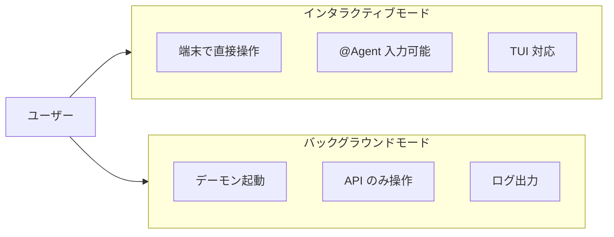
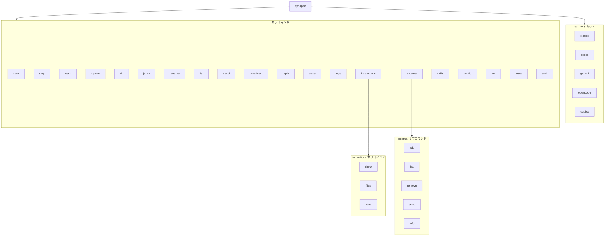
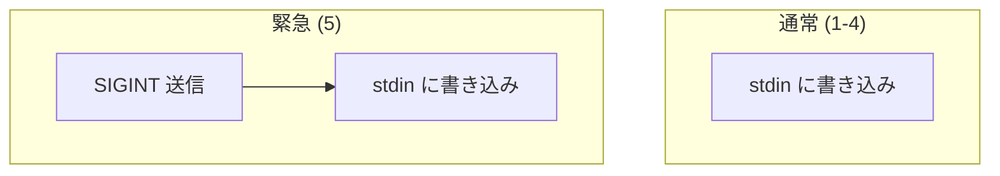
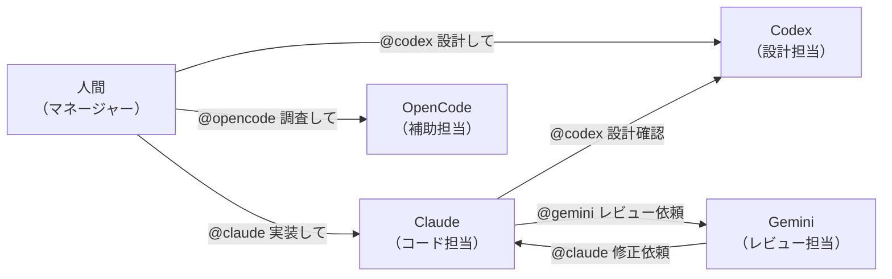

# Usage

このドキュメントでは、Synapse A2A の使い方を詳細に説明します。

---

## 1. 起動モード

Synapse A2A には 2 つの起動モードがあります。



---

### 1.1 インタラクティブモード（推奨）

端末内で直接 CLI を操作しながら、`@Agent` による A2A 通信も可能なモードです。

```bash
synapse claude --port 8100
```

**特徴**:

| 項目 | 説明 |
|------|------|
| 操作 | 端末で直接入力可能 |
| @Agent | `@codex メッセージ` で送信可能 |
| TUI | Ink ベースの TUI も動作（一部制限あり） |
| PTY | `pty.spawn()` でラップ |

**起動時の表示**:

起動時にアニメーション付きのバナーが表示されます：

```
 ███████╗██╗   ██╗███╗   ██╗ █████╗ ██████╗ ███████╗███████╗
 ██╔════╝╚██╗ ██╔╝████╗  ██║██╔══██╗██╔══██╗██╔════╝██╔════╝
 ███████╗ ╚████╔╝ ██╔██╗ ██║███████║██████╔╝███████╗█████╗
 ╚════██║  ╚██╔╝  ██║╚██╗██║██╔══██║██╔═══╝ ╚════██║██╔══╝
 ███████║   ██║   ██║ ╚████║██║  ██║██║     ███████║███████╗
 ╚══════╝   ╚═╝   ╚═╝  ╚═══╝╚═╝  ╚═╝╚═╝     ╚══════╝╚══════╝

 Agent-to-Agent Communication Framework

 ────────────────────────────────────────────────────────────

 Agent Configuration
   Type:     claude
   ID:       synapse-claude-8100
   Port:     8100

 A2A Endpoints
   Agent Card: http://localhost:8100/.well-known/agent.json
   Tasks API:  http://localhost:8100/tasks/send

 Quick Reference
   synapse list              Show running agents
   synapse send <agent> "msg"  Send message to agent
   Ctrl+C (twice)            Exit

 ────────────────────────────────────────────────────────────
```

続いて承認プロンプト（`approvalMode: required` の場合）が表示されます：

```
[Synapse] Agent: synapse-claude-8100 | Port: 8100
[Synapse] Initial instructions will be sent to configure A2A communication.

Proceed? [Y/n/s(skip)]:
```

**ショートカット構文**:

```bash
# 以下は同じ意味
synapse claude
synapse claude --port 8100
```

---

### 1.2 バックグラウンドモード（サーバモード）

端末を使わずにデーモンとして起動するモードです。

```bash
synapse start claude --port 8100
```

**特徴**:

| 項目 | 説明 |
|------|------|
| 操作 | HTTP API / CLI のみ |
| @Agent | 使用不可 |
| ログ | `~/.synapse/logs/<profile>.log` |
| 終了 | `synapse stop claude` |

**フォアグラウンド起動**:

```bash
synapse start claude --port 8100 --foreground
```

---

### 1.3 コンテキストの再開（Resume Mode）

エージェントがクラッシュした場合や、既存のセッション（会話履歴）を引き継いで再起動する場合、通常起動すると A2A プロトコルの初期説明が再度送信され、コンテキストが無駄に長くなってしまいます。

Resume Mode（再開モード）を使用すると、**初期インストラクションの送信をスキップ** し、スムーズに作業を継続できます。

```bash
# Claude: --continue / --resume / -c / -r
synapse claude -- --resume

# Gemini: --resume / -r
synapse gemini -- --resume

# Codex: resume サブコマンド
synapse codex -- resume

# セッションID指定（Claude）
synapse claude -- --resume=SESSION_ID
```

> **Note**: `synapse <agent> --` の後の引数は、エージェントの CLI ツールに直接渡されます。

**動作**:
- 指定されたフラグ（`--resume` 等）を検知すると、Synapse は「これは再開である」と判断します。
- A2A プロトコルの初期説明（Available Agents や使い方の説明）を送信しません。
- エージェントは前回の続きとして即座に待機状態に入ります。

**対応フラグ（デフォルト）**:

| エージェント | フラグ |
|--------------|--------|
| **Claude** | `--resume`, `--continue`, `-r`, `-c` |
| **Gemini** | `--resume`, `-r` |
| **Codex** | `resume` |
| **OpenCode** | `--continue`, `-c` |

これらのフラグは `.synapse/settings.json` でカスタマイズ可能です。

---

### 1.4 インストラクション管理

Resume Mode で起動した場合など、初期インストラクションが送信されなかった状況で、後からインストラクションを送信したい場合に使用します。

```bash
# インストラクション内容を確認
synapse instructions show claude

# 利用されるインストラクションファイル一覧
synapse instructions files claude

# 実行中のエージェントに初期インストラクションを送信
synapse instructions send claude

# 送信前にプレビュー（実際には送信しない）
synapse instructions send claude --preview

# 特定のエージェントIDを指定して送信
synapse instructions send synapse-claude-8100
```

**ユースケース**:

| シチュエーション | 対応 |
|----------------|------|
| `--resume` 後に A2A 機能が必要になった | `synapse instructions send <agent>` |
| エージェントがインストラクションを忘れた | `synapse instructions send <agent>` |
| インストラクション内容の確認 | `synapse instructions show <agent>` |
| 設定ファイルの確認 | `synapse instructions files <agent>` |

---

## 2. CLI コマンド

### 2.1 コマンド一覧



| コマンド | 説明 |
|---------|------|
| `synapse <profile>` | インタラクティブ起動（ショートカット） |
| `synapse start <profile>` | バックグラウンド起動 |
| `synapse stop <profile\|id>` | エージェント停止（ID指定も可） |
| `synapse team start <specs...>` | 1番目=handoff、他=新ペイン。`--all-new` で全員新ペイン |
| `synapse kill <target>` | グレースフルシャットダウン（デフォルト30秒、`-f` で即時終了） |
| `synapse jump <target>` | エージェントのターミナルにジャンプ |
| `synapse rename <target>` | エージェントに名前・ロールを設定 |
| `synapse init` | Synapse 設定の初期化（`.synapse/settings.json` 作成） |
| `synapse reset` | 設定をデフォルトに戻す（`--force` で確認スキップ） |
| `synapse --version` | バージョン情報表示 |
| `synapse list` | 実行中エージェント一覧 |
| `synapse send` | メッセージ送信 |
| `synapse broadcast` | カレントディレクトリの全エージェントにメッセージ送信 |
| `synapse logs <profile>` | ログ表示 |
| `synapse instructions` | インストラクション管理 |
| `synapse external` | 外部エージェント管理 |
| `synapse skills` | スキル管理（インタラクティブTUI / サブコマンド） |
| `synapse config` | 設定管理（インタラクティブTUI） |
| `synapse auth` | API キー認証の管理（`setup` / `generate-key`） |

---

### 2.2 起動/停止

```bash
# インタラクティブ起動
synapse claude --port 8100

# 名前とロールを指定して起動（対話型セットアップをスキップ）
synapse claude --name my-claude --role "コードレビュー担当"

# 対話型セットアップをスキップ（名前・ロールなし）
synapse claude --no-setup

# バックグラウンド起動
synapse start claude --port 8100

# フォアグラウンド起動（デバッグ用）
synapse start claude --port 8100 --foreground

# 停止
synapse stop claude

# IDを指定して停止（推奨：より確実です）
synapse stop synapse-claude-8100

# 全インスタンスを停止
synapse stop claude --all

# グレースフルシャットダウン（HTTP停止リクエスト → SIGTERM → SIGKILL）
synapse kill claude
synapse kill my-claude    # カスタム名で指定
synapse kill claude -f    # 即時終了（SIGKILL）

# エージェントのターミナルにジャンプ
synapse jump claude
synapse jump my-claude    # カスタム名で指定
```

### 2.2.1 エージェント命名

エージェントにカスタム名とロールを設定できます。

```bash
# 起動時に対話形式で設定（デフォルト動作）
synapse claude
# → 名前とロールの入力プロンプトが表示される

# CLI オプションで設定
synapse claude --name my-claude --role "コードレビュー担当"

# 対話型セットアップをスキップ
synapse claude --no-setup

# 起動後に名前・ロールを変更
synapse rename synapse-claude-8100 --name my-claude --role "テスト担当"
synapse rename my-claude --role "ドキュメント担当"  # ロールのみ変更
synapse rename my-claude --clear                    # 名前・ロールをクリア
```

**名前を設定すると、すべての操作で使用可能:**

```bash
synapse send my-claude "コードをレビューして" --from synapse-codex-8121
synapse kill my-claude
synapse jump my-claude
```

**ターゲット解決の優先順位:**

1. カスタム名（最優先）: `my-claude`
2. エージェントID: `synapse-claude-8100`
3. タイプ-ポート短縮形: `claude-8100`
4. タイプ（インスタンスが1つの場合のみ）: `claude`

**名前 vs ID:**

| 用途 | 使用される値 |
|-----|-------------|
| 表示・プロンプト | 名前があれば名前、なければID（例: `Kill my-claude?`） |
| 内部処理 | 常にエージェントID（`synapse-claude-8100`） |
| `synapse list` NAME列 | カスタム名、なければタイプ |

---

### 2.2.2 チーム起動（分割ペイン）

複数エージェントを現在のターミナル環境でまとめて起動します。

**デフォルト動作**: 1番目のエージェントが現在のターミナルを引き継ぎ（handoff）、2番目以降が新しいペインで起動します。`--all-new` を指定すると、全エージェントが新しいペインで起動します（現在のターミナルはそのまま残ります）。

```bash
synapse team start <agent_spec1> <agent_spec2> ... [--layout split|horizontal|vertical] [--all-new]
```

**エージェント指定の拡張形式**:

`profile:name:role:skill_set` の形式で、各ペインの起動時に名前やロール、スキルセットを一括で指定できます（コロン区切り）。

```bash
# 基本（claude=現在のターミナル、gemini,codex=新しいペイン）
synapse team start claude gemini codex

# 名前とスキルセットを指定して起動
synapse team start claude:Coder:dev gemini:Reviewer::review-set

# ロールのみ指定して起動
synapse team start codex::tester

# 全員を新しいペインで起動（現在のターミナルは残る）
synapse team start claude gemini --all-new

# ツール固有の引数を '--' の後に渡す（全エージェントに適用）
synapse team start claude gemini -- --dangerously-skip-permissions
```

**例**:

```bash
synapse team start claude gemini codex                    # claude=ここ、他=新ペイン
synapse team start claude gemini --layout horizontal      # 水平分割
synapse team start claude gemini --all-new                # 全員新ペイン
synapse team start claude gemini -- --dangerously-skip-permissions  # 権限プロンプトをスキップ
```

**対応ターミナル**:
- `tmux`
- `iTerm2`
- `Terminal.app`（タブで起動）
- `zellij`

**レイアウトの扱い**:
- `horizontal`: 右方向分割を優先
- `vertical`: 下方向分割を優先
- `split`: 自動タイル（環境に応じた分割）

---

### 2.2.3 エージェント単体起動 (synapse spawn) — サブエージェント委任

**spawn はサブエージェント委任です。** 親エージェントが子エージェントを生成してサブタスクを委任します。目的：

- **コンテキスト保護** — 親のコンテキストウィンドウをメインタスクに集中させる
- **効率化・時間短縮** — 独立したサブタスクを並列実行して合計時間を削減
- **精度向上** — 専門ロール付きエージェントに委任して結果の質を高める

親エージェントが常にライフサイクルを管理します: **spawn → send → evaluate → kill**

#### いつ spawn するか

| 状況 | アクション | 理由 |
|------|------------|------|
| タスクが小さく自分の専門内 | **自分で実行** | オーバーヘッドなし |
| 別のエージェントが稼働中で READY | **`synapse send` で既存エージェントに依頼** | spawn 前に既存を再利用 |
| タスクが大きく自分のコンテキストを消費する | **`synapse spawn` で新規生成** | コンテキスト保護 + 専門ロールで精度向上 |
| 独立した並列サブタスクがある | **`synapse spawn` で N 体生成** | 並列実行で時間短縮 |

**エージェント数のルール:**
1. ユーザーが数を指定 → **その数に従う（最優先）**
2. 指定なし → 親エージェントがタスク構造から適切な数と役割を決定

#### 基本ライフサイクル

```bash
# 1. ヘルパーを spawn
synapse spawn gemini --name Tester --role "テスト担当"

# 2. READY 確認（送信前に必ず確認）
synapse list   # Tester が STATUS=READY になるまで待機

# 3. タスクを送信（結果を待つ）
synapse send Tester "src/auth.py のユニットテストを書いて" --response --from $SYNAPSE_AGENT_ID

# 4. 結果を評価 — 不十分なら再送信（kill して再 spawn しない）
synapse send Tester "期限切れトークンのエッジケースも追加して" --response --from $SYNAPSE_AGENT_ID

# 5. 完了 — 必ず kill する（親がライフサイクルを管理）
synapse kill Tester -f
```

#### 結果の評価方法

1. **返答内容を読む** — 依頼した内容に対応しているか？
2. **成果物を検証** — 必要に応じて `git diff`、`pytest`、ファイル確認
3. **判断:**
   - 十分 → `synapse kill <child> -f`
   - 不十分 → 追加指示を re-send（kill して再 spawn しない）

#### CLI コマンド

```bash
synapse spawn claude                          # 新しいペインで Claude を起動
synapse spawn gemini --port 8115              # ポートを指定して起動
synapse spawn claude --name Tester --role "テスト担当"  # 名前とロールを指定
synapse spawn claude --terminal tmux          # 使用するターミナルを指定

# ツール固有の引数を '--' の後に渡す
synapse spawn claude -- --dangerously-skip-permissions
```

#### 技術的な注意事項

- **Headless モード**: `synapse spawn` は自動的に `--headless` を付与し、対話型ステップをスキップします。A2A サーバーと初期指示は有効です。
- **Readiness 確認**: spawn 後、エージェントが登録されるまで待機し、未登録の場合は `synapse send` のコマンド例を含む警告を表示します。
- **ペイン自動クローズ**: エージェント終了時、対応するペインは自動的に閉じます（tmux, zellij, iTerm2, Terminal.app, Ghostty）。
- **既知の制限 ([#237](https://github.com/s-hiraoku/synapse-a2a/issues/237))**: spawn されたエージェントは `synapse reply` が使用できません（PTY インジェクションで送信者情報が登録されないため）。`synapse send <target> "message" --from <spawned-agent-id>` を使用してください。

---

### 2.3 一覧表示

```bash
synapse list
```

**Rich TUI モード（デフォルト）**:

`synapse list` は常に Rich TUI によるインタラクティブな表示で起動します。ファイルウォッチャーにより、エージェントのステータス変更時に自動更新されます（10秒間隔のフォールバックポーリング）。

```bash
synapse list                      # 自動更新 Rich TUI
```

**Rich TUI モードの機能**:
- 色付きステータス表示（READY=緑、PROCESSING=黄）
- ファイルウォッチャーによる自動更新（変更検出時に即座に反映）
- **インタラクティブ操作**: 数字キー（1-9）または ↑/↓ キーでエージェントを選択
- **ターミナルジャンプ**: Enter または j キーで選択したエージェントのターミナルに移動
- **エージェント終了**: k キーで選択したエージェントを終了（確認ダイアログあり）
- **フィルタ**: / キーで TYPE / NAME / WORKING_DIR による絞り込み
- `ESC` キーでフィルタ/選択解除、`q` で終了

**出力例（Rich TUI モード）**:

```
╭─────────────── Synapse A2A v0.3.11 - Agent List ───────────────╮
│ ╭───┬──────────────────────┬──────────┬────────────┬───────────┬───────────┬────────────┬──────────────╮ │
│ │ # │ ID                   │ NAME     │ STATUS     │ CURRENT   │ TRANSPORT │ WORKING_DIR│ EDITING_FILE │ │
│ ├───┼──────────────────────┼──────────┼────────────┼───────────┼───────────┼────────────┼──────────────┤ │
│ │ 1 │ synapse-claude-8100  │ my-claude│ PROCESSING │ Reviewing │ UDS→      │ project    │ auth.py      │ │
│ │ 2 │ synapse-gemini-8110  │ -        │ PROCESSING │ -         │ →UDS      │ other      │ -            │ │
│ │ 3 │ synapse-codex-8120   │ tester   │ READY      │ -         │ -         │ third      │ -            │ │
│ ╰───┴──────────────────────┴──────────┴────────────┴───────────┴───────────┴────────────┴──────────────┘ │
╰────────────────────── Last updated: 2024-01-15 10:30:45 ─────────────────────╯
[1-3/↑↓: select] [Enter/j: jump] [k: kill] [/: filter] [ESC: clear] [q: quit]
```

**表示カラム（`list.columns`）**:

| カラム | 説明 |
|--------|------|
| ID | エージェントID（例: `synapse-claude-8100`） |
| NAME | カスタム名（設定されている場合） |
| TYPE | エージェントタイプ (claude, gemini, codex など) |
| ROLE | ロール説明（設定されている場合） |
| STATUS | 現在のステータス (READY, WAITING, PROCESSING, DONE) |
| TRANSPORT | 通信トランスポート表示 |
| CURRENT | 現在のタスクプレビュー |
| WORKING_DIR | 作業ディレクトリ |
| EDITING_FILE | 編集中のファイル（File Safety有効時のみ表示） |

**Note**: **TRANSPORT 列**は通信状態をリアルタイム表示します。
- `UDS→` / `TCP→`: エージェントが UDS/TCP で送信中
- `→UDS` / `→TCP`: エージェントが UDS/TCP で受信中
- `-`: 通信なし

**Note**: 行を選択すると詳細パネルが表示され、Port/PID/Endpoint/フルパスなどが確認できます。

---

### 2.4 メッセージ送信

```bash
synapse send <agent> "メッセージ" [--from AGENT_ID] [--priority <n>] [--response | --no-response]
```

**オプション**:

| オプション | 短縮形 | デフォルト | 説明 |
|-----------|--------|-----------|------|
| `target` | - | 必須 | 送信先エージェント |
| `message` | - | - | メッセージ内容（positional / `--message-file` / `--stdin` のいずれか） |
| `--message-file` | `-F` | - | ファイルからメッセージ読み込み（`-` で stdin） |
| `--stdin` | - | false | 標準入力からメッセージ読み込み |
| `--from` | `-f` | - | 送信元エージェントID（常に指定推奨） |
| `--priority` | `-p` | 3 | 優先度 (1-5) |
| `--attach` | `-a` | - | ファイル添付（複数指定可） |
| `--response` | - | - | Roundtrip - 送信側が待機、受信側は `synapse reply` で返信 |
| `--no-response` | - | - | Oneway - 送りっぱなし、返信不要 |

**Note**: `a2a.flow=auto`（デフォルト）の場合、フラグなしは応答待ちになります。待たない場合は `--no-response` を指定してください。

**例**:

```bash
# 通常送信
synapse send codex "設計を書いて" --priority 1 --from synapse-claude-8100

# 緊急停止
synapse send claude "処理を止めて" --priority 5 --from synapse-codex-8121

# 応答を待つ（roundtrip）
synapse send codex "結果を教えて" --response --from synapse-claude-8100

# ファイルから送信（'-' は stdin）
synapse send codex --message-file ./message.txt --from synapse-claude-8100
cat ./message.txt | synapse send codex --message-file - --from synapse-claude-8100

# 添付ファイル付き
synapse send codex "このファイルを見て" -a ./a.py -a ./b.txt --from synapse-claude-8100
```

**関連**:

```bash
synapse trace <task_id>
```

### 2.5 メッセージへの返信

```bash
synapse reply "返信メッセージ" [--from <your_agent_id>] [--to SENDER_ID] [--list-targets]
```

Synapseは返信を期待する送信者情報を自動的に追跡し、適切な送信者に返信します。

**オプション**:

| オプション | 説明 |
|-----------|------|
| `--from`, `-f` | 送信元エージェントID |
| `--to` | 返信先の sender_id を指定（複数の送信者がいる場合に使用） |
| `--list-targets` | 返信可能なターゲット一覧を表示 |

**例**:

```bash
# 最新の送信者に返信（デフォルト）
synapse reply "分析結果です..."

# 特定の送信者に返信
synapse reply "タスク完了しました" --to synapse-claude-8100

# 返信可能なターゲットを確認
synapse reply --list-targets
```

---

### 2.6 ログ表示

```bash
# 最新 50 行を表示
synapse logs claude

# 最新 200 行を表示
synapse logs claude -n 200

# リアルタイム監視（tail -f）
synapse logs claude --follow
```

---

### 2.6 外部エージェント管理

外部の Google A2A 互換エージェントを管理するコマンドです。

#### 外部エージェントの発見・登録

```bash
synapse external add <url> [--alias ALIAS]
```

**例**:

```bash
synapse external add http://other-agent:9000
synapse external add https://ai.example.com --alias myai
```

Agent Card (`/.well-known/agent.json`) を取得してエージェント情報を登録します。

#### 登録済みエージェント一覧

```bash
synapse external list
```

**出力例**:

```
ALIAS           NAME                 URL                                      LAST SEEN
------------------------------------------------------------------------------------------
myai            Example AI           https://ai.example.com                   2025-01-15T10:30:00
other           Other Agent          http://other-agent:9000                  Never
```

#### 外部エージェントにメッセージ送信

```bash
synapse external send <alias> <message> [--wait]
```

**例**:

```bash
synapse external send myai "Hello!"
synapse external send myai "Process this task" --wait
```

`--wait` オプションで完了まで待機します。

#### 外部エージェント情報表示

```bash
synapse external info <alias>
```

#### 外部エージェント削除

```bash
synapse external remove <alias>
```

---

### 2.7 スキル管理

Synapse にはスキルの発見・管理・デプロイを行う統合スキルマネージャーが内蔵されています。

#### スキルスコープ

| スコープ | パス | 説明 |
|---------|------|------|
| **Synapse** | `~/.synapse/skills/` | 中央ストア（ここから各エージェントにデプロイ） |
| **User** | `~/.claude/skills/`, `~/.agents/skills/` 等 | ユーザー全体で共有 |
| **Project** | `./.claude/skills/`, `./.agents/skills/` 等 | プロジェクトローカル |
| **Plugin** | `./plugins/*/skills/` | プラグイン付属（読み取り専用） |

#### TUI モード

```bash
synapse skills
```

インタラクティブ TUI が起動し、以下の操作が可能です：

- **Manage Skills** - スコープ別にスキルを閲覧・削除・移動・デプロイ
- **Skill Sets** - 名前付きグループの管理
- **Install Skill** - スキルのインポート・新規作成
- **Deploy Skills** - 中央ストアからエージェントへのデプロイ
- **Create Skill** - Anthropic 方法論によるスキル作成ガイド

**Manage Skills** ではまずスコープを選択し、そのスコープのスキルだけを表示します。
各スキル行には `[C✓ A✓ G·]` インジケーターが付き、どのエージェントディレクトリに存在するかが一目で分かります：

| 記号 | ディレクトリ | 対象エージェント |
|------|-------------|-----------------|
| **C** | `.claude/skills/` | Claude |
| **A** | `.agents/skills/` | Codex, OpenCode, Copilot |
| **G** | `.gemini/skills/` | Gemini |

スキルの詳細画面では **Deploy Status** セクションが表示され、User / Project 両スコープでの各エージェントへのデプロイ状態を確認できます。

#### 非インタラクティブコマンド

```bash
# 一覧・詳細
synapse skills list                               # 全スコープのスキル一覧
synapse skills list --scope synapse               # 中央ストアのみ
synapse skills show <name>                        # スキル詳細

# 管理
synapse skills delete <name> [--force]            # スキル削除
synapse skills move <name> --to <scope>           # スコープ間移動

# 中央ストア操作
synapse skills import <name> [--from user|project]  # エージェントdirから中央ストアへコピー
synapse skills deploy <name> --agent claude,codex --scope user  # 中央ストアからデプロイ
synapse skills add <repo>                         # リポジトリからインストール（npx skills ラッパー）
synapse skills create                             # スキル作成ガイド表示（anthropic-skill-creator使用）

# スキルセット（名前付きグループ）
synapse skills set list                           # スキルセット一覧
synapse skills set show <name>                    # スキルセット詳細
```

#### デプロイフロー

```
synapse skills add <repo>  ─┐
                            ├→ npx skills add <repo> → ~/.claude/skills/
                            └→ 自動インポート → ~/.synapse/skills/ (中央ストア)
                                                    ↓ [deploy]
                              ~/.claude/skills/, ~/.agents/skills/ ...  (ユーザ)
                              ./.claude/skills/, ./.agents/skills/ ...  (プロジェクト)
```

---

## 3. @Agent 記法

インタラクティブモードで他のエージェントにメッセージを送信する記法です。

### 3.1 基本構文

```
@<agent_name> <message>
```

**パターン**:


> **Note**: `@Agent` パターンはデフォルトでレスポンスを待ちます。レスポンスを待たない場合は `synapse send` コマンドを使用してください。

### 3.2 通常送信

```text
# ローカルエージェント
@codex 設計をレビューして
@gemini このコードを最適化して
@claude バグを修正して

# 外部エージェント（事前に synapse external add で登録）
@myai タスクを処理して
```

**フィードバック**:

```
[→ codex (local)]     # ローカルエージェント（緑色）
[→ myai (ext)]        # 外部エージェント（マゼンタ色）
```

送信に成功するとフィードバックが表示されます。

---

### 3.3 レスポンス付き送信

```text
@codex "設計を書いて"
@claude "コードレビューして"
```

**動作**:

1. メッセージを送信
2. 相手が `READY` になるまでポーリング（最大 60 秒）
3. 新しい出力をこの端末に表示

**フィードバック**:

```
[→ codex]
[← codex]
（レスポンス内容）
```

---

### 3.4 クォート処理

メッセージに空白が含まれる場合は、クォートで囲むことができます。

```text
@codex "設計を レビューして"
@codex '設計を レビューして'
```

クォートは自動的に除去されます。

---

### 3.5 エラーケース

**エージェントが見つからない場合**:

```
[✗ unknown not found]
```

赤色のエラーメッセージが表示されます。

---

## 4. HTTP API

### 4.1 メッセージ送信（A2A プロトコル）

#### Task ベースでメッセージ送信

```bash
curl -X POST http://localhost:8100/tasks/send \
  -H "Content-Type: application/json" \
  -d '{"message": {"role": "user", "parts": [{"type": "text", "text": "Hello"}]}}'
```

**リクエスト**:

```json
{
  "message": {
    "role": "user",
    "parts": [{"type": "text", "text": "メッセージ内容"}]
  }
}
```

**レスポンス**:

```json
{
  "task": {
    "id": "uuid-task-id",
    "status": "working",
    "artifacts": [],
    "created_at": "2025-01-15T10:00:00Z",
    "updated_at": "2025-01-15T10:00:00Z"
  }
}
```

`task.id` で状態を追跡可能です。

#### ステータス確認

```bash
curl http://localhost:8100/status
```

**レスポンス**:

```json
{
  "status": "READY",
  "context": "...最新の出力（最大2000文字）..."
}
```

**status の値**:

| 値 | 説明 |
|----|------|
| `PROCESSING` | 処理中・起動中 |
| `READY` | 待機中（プロンプト表示中） |
| `NOT_STARTED` | 未起動 |

---

### 4.2 Google A2A 互換 API（推奨）

Google A2A プロトコルに準拠した API です。エージェント間通信の標準的な方法として、こちらの使用を推奨します。

#### Agent Card 取得

```bash
curl http://localhost:8100/.well-known/agent.json
```

エージェントの能力やスキルを公開します。

#### Task ベースでメッセージ送信

```bash
curl -X POST http://localhost:8100/tasks/send \
  -H "Content-Type: application/json" \
  -d '{
    "message": {
      "role": "user",
      "parts": [{"type": "text", "text": "Hello!"}]
    }
  }'
```

**レスポンス**:

```json
{
  "task": {
    "id": "uuid-...",
    "status": "working",
    "artifacts": [],
    "created_at": "2025-01-15T10:00:00Z",
    "updated_at": "2025-01-15T10:00:00Z"
  }
}
```

#### Task 状態取得

```bash
curl http://localhost:8100/tasks/{task_id}
```

---

### 4.3 外部エージェント管理 API

#### 外部エージェントを発見・登録

```bash
curl -X POST http://localhost:8100/external/discover \
  -H "Content-Type: application/json" \
  -d '{"url": "http://other-agent:9000", "alias": "other"}'
```

#### 外部エージェント一覧

```bash
curl http://localhost:8100/external/agents
```

#### 外部エージェントにメッセージ送信

```bash
curl -X POST http://localhost:8100/external/agents/other/send \
  -H "Content-Type: application/json" \
  -d '{"message": "Hello!", "wait_for_completion": true}'
```

---

## 5. Priority（優先度）

### 5.1 優先度レベル



| Priority | 動作 | 用途 |
|----------|------|------|
| 1-4 | stdin に直接書き込み | 通常のメッセージ送信 |
| 5 | SIGINT を送ってから書き込み | 緊急停止・強制介入 |

---

### 5.2 緊急停止の例

**CLI から**:

```bash
synapse send claude "処理を止めて" --priority 5
```

**HTTP API から**:

```bash
# 推奨: A2A プロトコル
curl -X POST "http://localhost:8100/tasks/send-priority?priority=5" \
  -H "Content-Type: application/json" \
  -d '{"message": {"role": "user", "parts": [{"type": "text", "text": "止まれ"}]}}'
```

**@Agent から**:

現在の実装では、`@Agent` 記法は常に priority 1 で送信されます。
緊急停止には CLI または HTTP API を使用してください。

---

## 6. 運用パターン

### 6.1 開発チーム構成



---

### 6.2 1 端末から横断指示

```text
# Claude の端末から
@codex アーキテクチャ設計をして
@gemini 設計のレビューをして
```

---

### 6.3 CI/スクリプトからの自動指示

```bash
#!/bin/bash

# テスト実行を Claude に依頼（A2A プロトコル）
RESULT=$(curl -s -X POST "http://localhost:8100/tasks/send" \
  -H "Content-Type: application/json" \
  -d '{"message": {"role": "user", "parts": [{"type": "text", "text": "テストを実行して"}]}}')

TASK_ID=$(echo $RESULT | jq -r '.task.id')

# タスクの完了をポーリング
while true; do
  TASK=$(curl -s "http://localhost:8100/tasks/$TASK_ID")
  STATUS=$(echo $TASK | jq -r '.status')
  if [ "$STATUS" = "completed" ]; then
    echo "Done!"
    echo $TASK | jq -r '.artifacts[0].data'
    break
  fi
  sleep 5
done
```

---

### 6.4 ウォッチドッグパターン

別のエージェントを監視し、必要に応じて介入する。

```bash
# ステータス確認
curl http://localhost:8120/status

# READY なのに作業が終わっていない場合に nudge
synapse send codex "進捗を報告して" --priority 1

# 応答がない場合は緊急介入
synapse send codex "状況を報告して" --priority 5
```

---

## 7. 注意事項

### 7.1 IME の挙動

インタラクティブモードでは入力が 1 文字ずつ処理されるため、日本語入力（IME）の挙動が変わる場合があります。

### 7.2 TUI の制限

Ink ベースの TUI（Claude Code など）では、以下の問題が発生する場合があります：

- 画面の再描画が乱れる
- 入力欄が複数表示される

詳細は [troubleshooting.md](troubleshooting.md) を参照してください。

### 7.3 レスポンス待ちのタイムアウト

`@Agent` パターンはデフォルトでレスポンスを待ちます（最大 60 秒）。レスポンスを待たずに送信のみ行いたい場合は、`synapse send` コマンドの `--no-response` オプションを使用してください。長時間の処理を依頼する場合は、別途 `/status` API でポーリングしてください。

---

## 関連ドキュメント

- [multi-agent-setup.md](multi-agent-setup.md) - セットアップガイド
- [references.md](references.md) - API/CLI リファレンス
- [troubleshooting.md](troubleshooting.md) - トラブルシューティング
