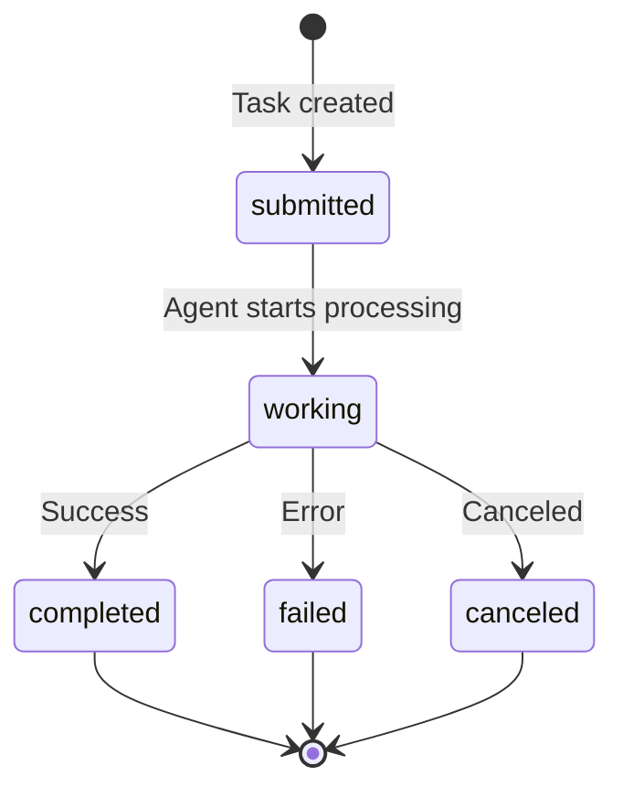

# A2A Protocol

## What is A2A?

The [Agent-to-Agent (A2A) protocol](https://developers.googleblog.com/en/a2a-a-new-era-of-agent-interoperability/) is an open standard by Google for inter-agent communication. It defines how agents discover each other, exchange messages, and track tasks — regardless of their underlying implementation.

Synapse A2A implements this protocol to enable CLI agents to communicate without modification.

## Core Concepts

### Agent Card

Every A2A agent publishes a discovery document at `/.well-known/agent.json`:

```json
{
  "name": "synapse-claude-8100",
  "description": "Claude Code agent managed by Synapse A2A",
  "url": "http://localhost:8100",
  "version": "0.8.1",
  "capabilities": {
    "streaming": false,
    "pushNotifications": false
  },
  "skills": [
    {
      "id": "synapse-a2a",
      "name": "Synapse A2A Communication",
      "description": "Inter-agent messaging and coordination"
    }
  ],
  "defaultInputModes": ["text"],
  "defaultOutputModes": ["text"],
  "provider": {
    "organization": "Synapse A2A",
    "url": "https://github.com/s-hiraoku/synapse-a2a"
  }
}
```

Synapse extends the Agent Card with `x-synapse-context` containing agent-specific metadata (agent ID, type, working directory, status).

### Message Format

A2A messages use the `Message/Part` structure:

```json
{
  "role": "user",
  "parts": [
    {
      "type": "text",
      "text": "Review this code for security issues"
    }
  ]
}
```

### Task Lifecycle

Tasks progress through defined states:



## Synapse's A2A Implementation

### Standard Endpoints

| Endpoint | Method | Description |
|----------|--------|-------------|
| `/.well-known/agent.json` | GET | Agent Card discovery |
| `/tasks/send` | POST | Send a message (standard A2A) |
| `/tasks/{id}` | GET | Get task status |
| `/tasks` | GET | List all tasks |
| `/tasks/{id}/cancel` | POST | Cancel a task |
| `/status` | GET | Agent status |

### Synapse Extensions

Synapse extends A2A with additional endpoints prefixed conceptually as extensions:

| Endpoint | Method | Description |
|----------|--------|-------------|
| `/tasks/send-priority` | POST | Priority-based message delivery (1-5) |
| `/tasks/create` | POST | Create task context without PTY delivery |
| `/reply-stack/*` | GET | Reply routing management |
| `/tasks/board/*` | GET/POST | Shared Task Board (B1) |
| `/team/start` | POST | Multi-agent team spawning (B6) |
| `/spawn` | POST | Single agent spawning |

## Protocol Compliance

Synapse A2A is approximately **70% compliant** with the Google A2A specification:

| Category | Status | Notes |
|----------|--------|-------|
| Agent Card | :material-check-circle:{ .status-ready } | Fully compliant with extensions |
| Task API | :material-check-circle:{ .status-ready } | Send, get, list, cancel |
| Message/Part | :material-check-circle:{ .status-ready } | Text parts supported |
| Task Lifecycle | :material-check-circle:{ .status-ready } | All states mapped |
| HTTP/REST | :material-check-circle:{ .status-ready } | FastAPI implementation |
| SSE Streaming | :material-close-circle:{ .status-shutdown } | Not yet implemented |
| Push Notifications | :material-close-circle:{ .status-shutdown } | Not yet implemented |
| JSON-RPC 2.0 | :material-close-circle:{ .status-shutdown } | Uses REST instead |

## Design Rationale

### Why PTY Wrapping?

Google A2A's core principle is **Opaque Execution** — agents operate without exposing internal state. Synapse satisfies this by:

1. **No agent modification**: CLI agents run unmodified inside a PTY
2. **External interface only**: The A2A server is the only external-facing component
3. **Bridge pattern**: Synapse acts as an adapter between CLI I/O and A2A protocol

```
┌─────────────────────────────────┐
│         A2A Interface           │  ← Standard endpoints
├─────────────────────────────────┤
│      Synapse Adapter Layer      │  ← Translation
├─────────────────────────────────┤
│        PTY + CLI Agent          │  ← Opaque execution
└─────────────────────────────────┘
```

### Comparison with Native Implementations

| Approach | A2A Understanding | Agent Modification | Cost |
|----------|:-:|:-:|:-:|
| Native SDK | Complete | Required | High |
| Framework (LangGraph) | High | Required | Medium |
| **Synapse (PTY Wrapper)** | **Adapter layer** | **None** | **Low** |

!!! note "Future Direction"
    As CLI tools add native A2A support, Synapse can transition from a PTY wrapper to a gateway/orchestrator role, connecting local CLI agents with external A2A agents.

## Context Sharing

Synapse shares context between agents using the A2A `x-synapse-context` extension in the Agent Card:

```json
{
  "x-synapse-context": {
    "agent_id": "synapse-claude-8100",
    "agent_type": "claude",
    "working_dir": "/path/to/project",
    "status": "READY",
    "name": "my-claude",
    "role": "code reviewer"
  }
}
```

This allows agents to discover each other's capabilities, working directory, and current status without direct communication.

## Google A2A Resources

- [Official Specification](https://github.com/google/a2a-spec)
- [Google Developer Blog: A2A Announcement](https://developers.googleblog.com/en/a2a-a-new-era-of-agent-interoperability/)
- [A2A Protocol Documentation](https://google.github.io/a2a-spec/)
