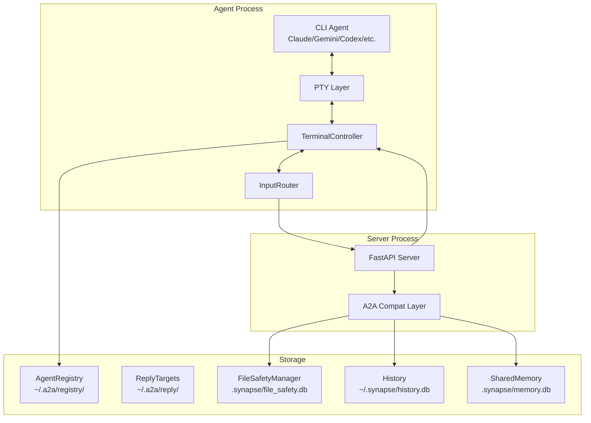
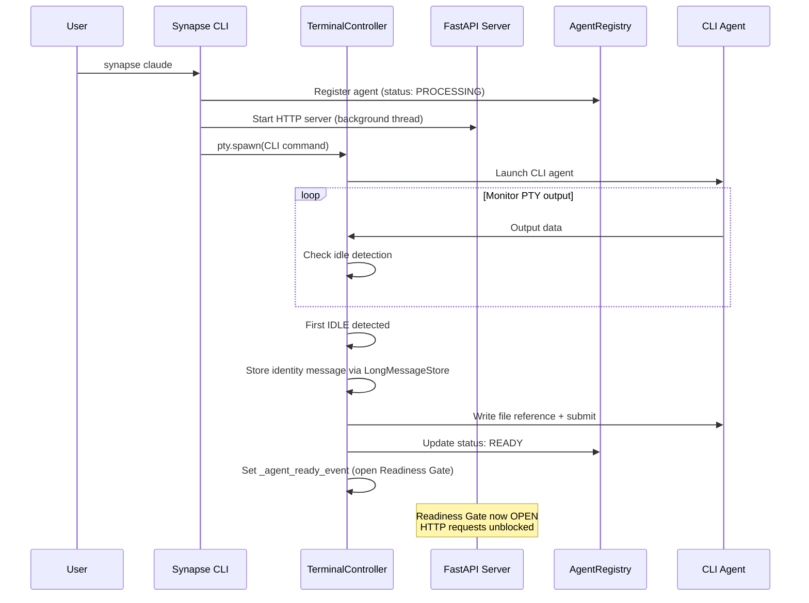
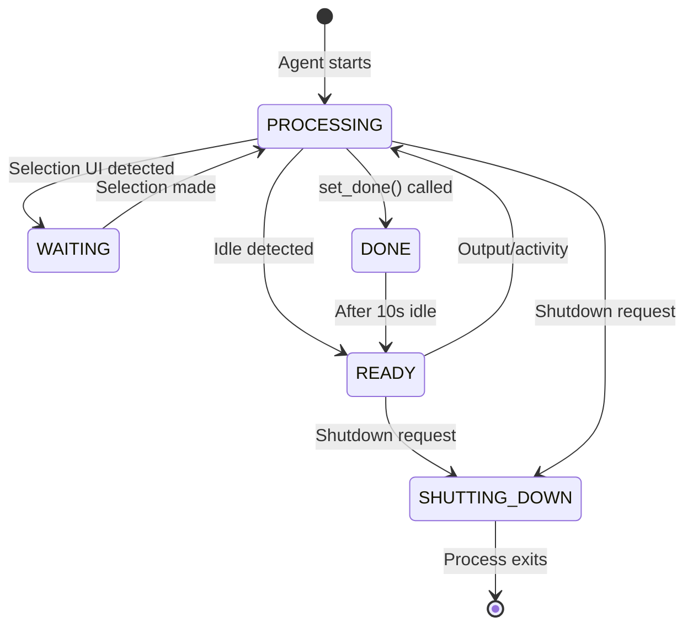
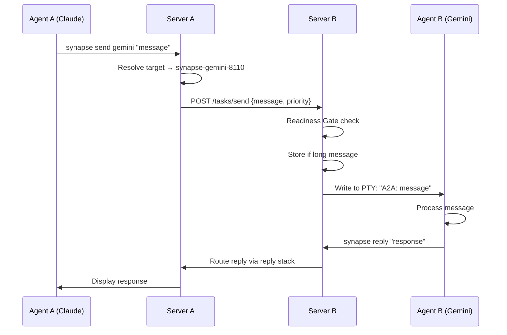

# Architecture

## System Overview

Synapse A2A wraps each CLI agent with a PTY layer and runs a FastAPI-based A2A server alongside it. Agents communicate over HTTP using the Google A2A protocol.



## Core Components

### TerminalController

The heart of Synapse — manages the PTY connection to the CLI agent.

**Responsibilities:**

- Spawn and manage the CLI process via `pty.spawn()`
- Detect agent states: READY, PROCESSING, WAITING, DONE, SHUTTING_DOWN
- Write messages to the PTY (with split-write strategy for Ink TUI apps)
- Strip ANSI escape sequences with three-stage removal (full sequences → orphaned SGR fragments → bare SGR fragments)
- Detect idle states using configurable strategies (pattern, timeout, hybrid)
- Collect PTY observations for the [Self-Learning Pipeline](../guide/self-learning.md)
- Send initial instructions on first idle
- Manage the Readiness Gate
- Adaptive paste echo wait for Copilot (polls PTY for TUI re-render before Enter)

**Key attributes:**

| Attribute | Purpose |
|-----------|---------|
| `status` | Current agent state (READY/PROCESSING/etc.) |
| `_agent_ready_event` | Threading event for Readiness Gate |
| `master_fd` | PTY file descriptor for I/O |
| `skill_set` | Active skill set name |

### InputRouter

Detects `@agent` patterns in PTY output and routes messages via A2A.

```
User types in Claude: @gemini Review this code
         ↓
InputRouter detects @gemini pattern
         ↓
A2AClient sends POST /tasks/send to Gemini
         ↓
Gemini receives: "A2A: Review this code"
```

### AgentRegistry

File-based service discovery using JSON files in `~/.a2a/registry/`.

- Each running agent writes a JSON file with its metadata (ID, port, type, status, working_dir)
- Atomic writes prevent partial JSON reads
- Dead processes are auto-cleaned on lookup
- File watcher (fsevents/inotify) enables real-time updates in `synapse list`

### FastAPI Server

HTTP server providing A2A-compatible endpoints.

- Runs in a background thread alongside the PTY process
- Serves the Agent Card at `/.well-known/agent.json`
- Handles `/tasks/send` and `/tasks/send-priority` with Readiness Gate
- Provides Spawn and Team Start APIs

### A2A Compatibility Layer

Translates between Synapse internals and the Google A2A protocol format.

- Converts incoming A2A messages to PTY writes
- Formats PTY output as structured A2A reply artifacts with content scoring to prefer richer responses over trivial PTY noise
- Cleans TUI artifacts (spinners, box-drawing, status bars, input echo) from all agent types before building reply artifacts
- Manages task lifecycle (submitted → working → completed/failed)
- Handles long message storage (>200 chars → file reference)

## Startup Sequence



## Agent Status System

Agents use a five-state status model:

| Status | Color | Description |
|--------|-------|-------------|
| **READY** | :material-circle:{ .status-ready } Green | Idle, waiting for input |
| **PROCESSING** | :material-circle:{ .status-processing } Yellow | Actively processing |
| **WAITING** | :material-circle:{ .status-waiting } Cyan | Showing selection UI |
| **DONE** | :material-circle:{ .status-done } Blue | Task completed (auto-clears after 10s) |
| **SHUTTING_DOWN** | :material-circle:{ .status-shutdown } Red | Graceful shutdown in progress |

**Transitions:**



### Compound Signal Detection

The PROCESSING-to-READY transition uses **compound signals** to avoid false positives. Even when PTY output has stopped (idle), the controller checks additional signals before transitioning to READY:

| Signal | Suppresses READY | Expires After |
|--------|:---:|---------------|
| **task_active** | Yes | `TASK_PROTECTION_TIMEOUT` (30 s default) |
| **File locks held** | Yes | Until locks are released |

- **task_active**: Set when the A2A layer injects a task into the PTY. Prevents the agent from appearing idle while the CLI tool is still processing the injected message internally.
- **File locks**: If the agent holds file locks via File Safety, it is assumed to still be working, even if PTY output has paused.

Both signals are checked together. If *either* signal is active (and not expired), the agent remains in PROCESSING. The WAITING and DONE states are not affected by compound signals.

### WAITING Detection

WAITING detection uses a **fresh-output-only** strategy: the regex pattern is matched only against newly received PTY data, not the entire output buffer. This eliminates false positives from old prompt patterns that remain in the scrollback. WAITING auto-expires when the pattern disappears from the visible buffer tail after `WAITING_EXPIRY_SECONDS` (10 s default).

## Readiness Gate

The Readiness Gate prevents messages from being lost during agent initialization.

- `/tasks/send` and `/tasks/send-priority` block until the agent completes initialization
- Timeout: 30 seconds (`AGENT_READY_TIMEOUT`)
- Returns HTTP 503 with `Retry-After: 5` if not ready
- **Bypasses**: Priority 5 (emergency) and reply messages skip the gate

## Idle Detection Strategies

Synapse supports three strategies for detecting when an agent is idle:

| Strategy | How It Works | Best For |
|----------|-------------|----------|
| **Pattern** | Regex match on recurring PTY output | Codex (consistent prompt character) |
| **Timeout** | No output for N seconds | Claude Code, OpenCode, Copilot |
| **Hybrid** | Pattern for first idle, timeout after | Gemini |

See [Agent Profiles](profiles.md) for per-agent configuration details.

## Thread Model

```
Main Thread          Server Thread        Monitor Thread
┌──────────┐        ┌──────────┐         ┌──────────┐
│ PTY I/O  │        │ FastAPI  │         │ Registry │
│ Idle Det │        │ A2A API  │         │ Watchdog │
│ Input    │        │ Spawn API│         │ Cleanup  │
│ Router   │        │ Memory   │         │          │
└──────────┘        └──────────┘         └──────────┘
```

- **Main Thread**: PTY read/write loop, idle detection, input routing
- **Server Thread**: HTTP API, A2A endpoints, WebSocket/SSE
- **Monitor Thread**: Registry file watching, stale process cleanup

## Data Flow

### Message Send Flow



## Storage Architecture

| Storage | Location | Purpose | Format |
|---------|----------|---------|--------|
| Registry | `~/.a2a/registry/` | Running agents | JSON files |
| Reply Targets | `~/.a2a/reply/` | Reply routing persistence | JSON files |
| External Agents | `~/.a2a/external/` | External A2A agents | JSON files |
| Settings (User) | `~/.synapse/settings.json` | User preferences | JSON |
| Settings (Project) | `.synapse/settings.json` | Project config | JSON |
| History | `~/.synapse/history.db` | Task history | SQLite |
| Shared Memory | `.synapse/memory.db` | Cross-agent knowledge sharing | SQLite (WAL) |
| File Safety | `.synapse/file_safety.db` | File locks/tracking | SQLite (WAL) |
| Saved Agents | `~/.synapse/agents/`, `.synapse/agents/` | Reusable agent definitions | JSON files |
| Observations | `.synapse/observations.db` | PTY observation data for self-learning | SQLite (WAL) |
| Instincts | `.synapse/instincts.db` | Learned patterns (trigger + action + confidence) | SQLite (WAL) |
| Logs | `~/.synapse/logs/` | Agent logs | Text files |
| Skills (Source) | `plugins/synapse-a2a/skills/` | Canonical skill definitions (source of truth); each skill uses Progressive Disclosure (`SKILL.md` + `references/` + optional `scripts/`) | Markdown |
| Skills (Central) | `~/.synapse/skills/` | Central skill store (SYNAPSE scope) | Markdown |
| Skills (Claude) | `.claude/skills/` | Claude Code project-local skills | Markdown |
| Skills (Agents) | `.agents/skills/` | Codex/OpenCode/Copilot/Gemini skills | Markdown |

!!! info "Skill Synchronization"
    `plugins/synapse-a2a/skills/` is the source of truth for published skills. Edit skills there, then run `sync-plugin-skills` to propagate changes to `.claude/skills/` and `.agents/skills/`. Never edit agent-specific skill directories directly. Dev-only skills (e.g., `synapse-docs`) are stored in `.agents/skills/`, and `.claude/skills/` may contain a reference entry when needed; they are not synced from `plugins/`.
