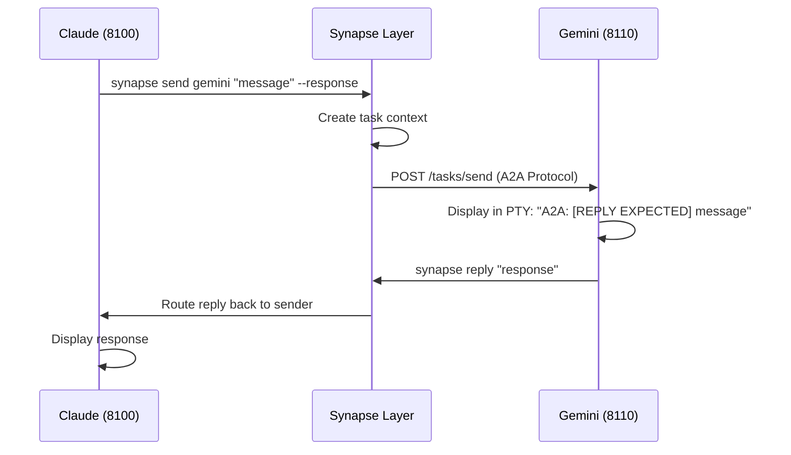

# Quick Start

Get two agents communicating in under 5 minutes.

## Step 1: Start Your First Agent

Open a terminal and start Claude Code with Synapse:

```bash
synapse claude
```

Synapse will:

1. Register the agent in the registry
2. Start an A2A server on port `8100`
3. Launch Claude Code in a PTY wrapper
4. Send initial instructions on first idle

!!! info "Interactive Setup"
    On first launch, you'll be prompted for an optional name and role.
    Press ++enter++ to skip, or provide values like `my-claude` and `code reviewer`.

## Step 2: Start a Second Agent

Open another terminal and start Gemini:

```bash
synapse gemini
```

Gemini will start on port `8110` and register itself.

## Step 3: Verify Both Are Running

In a third terminal:

```bash
synapse list
```

You'll see a Rich TUI table showing both agents:

```
┌────┬──────────────────────┬────────┬────────────┬─────────────┐
│ #  │ ID                   │ STATUS │ TYPE       │ PORT        │
├────┼──────────────────────┼────────┼────────────┼─────────────┤
│ 1  │ synapse-claude-8100  │ READY  │ claude     │ 8100        │
│ 2  │ synapse-gemini-8110  │ READY  │ gemini     │ 8110        │
└────┴──────────────────────┴────────┴────────────┴─────────────┘
```

!!! tip "Interactive Controls"
    - ++up++ / ++down++ or `1`-`9` to select an agent
    - ++enter++ or `j` to jump to that agent's terminal
    - `K` to kill an agent (with confirmation)
    - `/` to filter by type, name, or directory
    - ++esc++ to clear filter or selection
    - `q` to quit

## Step 4: Send a Message

From Claude's terminal, send a message to Gemini:

```bash
synapse send gemini "What are the best practices for error handling in Python?" \
  --response
```

- `--from` is auto-detected from `$SYNAPSE_AGENT_ID` (set at agent startup), so you can omit it
- `--response` waits for Gemini's reply (roundtrip mode)

Gemini will receive the message as:

```
A2A: [REPLY EXPECTED] What are the best practices for error handling in Python?
```

## Step 5: Reply

In Gemini's terminal, reply with:

```bash
synapse reply "Use specific exceptions, avoid bare except, use context managers..."
```

The reply is automatically routed back to Claude.

## What's Happening Under the Hood



## Common Patterns

### Fire-and-Forget (No Reply Needed)

```bash
synapse send codex "Refactor the auth module" --no-response
```

### Urgent Message (Priority 4)

```bash
synapse send gemini "Stop current task and check this" \
  --priority 4 --response
```

### Broadcast to All Agents

```bash
synapse broadcast "Status check — what are you working on?" --response
```

### Emergency Interrupt (Priority 5)

```bash
synapse interrupt claude "STOP — critical issue found"
```

!!! warning
    Priority 5 sends SIGINT to the agent first, then delivers the message. Use only for emergencies.

## Start a Team

Launch multiple agents at once with automatic pane creation:

```bash
synapse team start claude gemini codex --layout split
```

This opens each agent in a separate terminal pane (requires tmux, iTerm2, Terminal.app, Ghostty, or Zellij).

## Next Steps

- [Interactive Setup](setup.md) — Configure names, roles, and skill sets
- [Agent Management](../guide/agent-management.md) — Full lifecycle control
- [Communication](../guide/communication.md) — All messaging patterns
- [Agent Teams](../guide/agent-teams.md) — Team spawning and delegation
