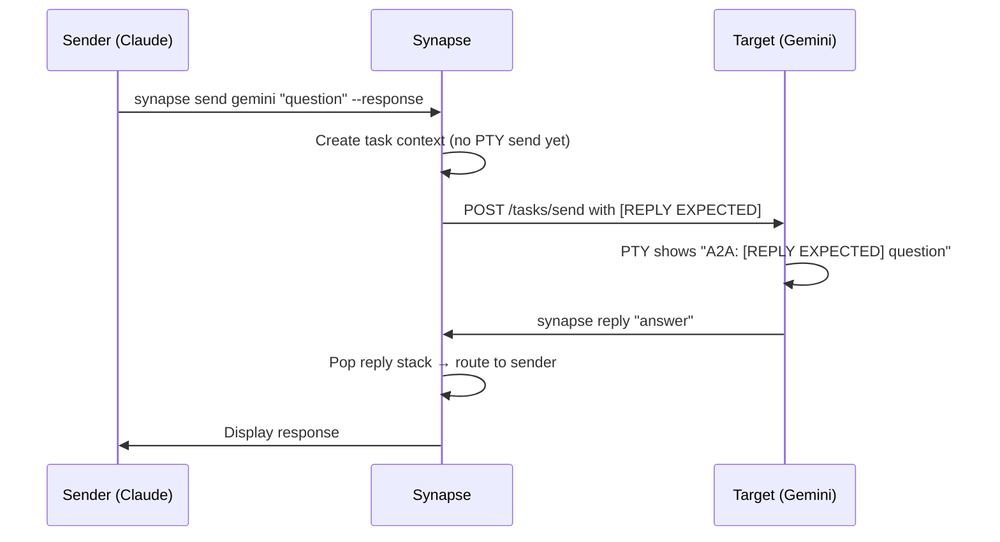

# Communication

## Overview

Synapse A2A provides three ways to send messages between agents:

| Method | Description | Best For |
|--------|-------------|----------|
| `synapse send` | Direct CLI command | Explicit agent-to-agent messaging |
| `synapse broadcast` | Send to all agents in same directory | Status checks, announcements |
| `@agent` pattern | Type in terminal | Quick inline mentions |

## Sending Messages

### Basic Send

```bash
synapse send <target> "<message>" \
  --from $SYNAPSE_AGENT_ID \
  --response          # Wait for reply
```

### Fire-and-Forget

```bash
synapse send codex "Refactor the auth module" \
  --from $SYNAPSE_AGENT_ID --no-response
```

### With Priority

```bash
synapse send gemini "Urgent: check this security issue" \
  --from $SYNAPSE_AGENT_ID --priority 4 --response
```

### All Options

```bash
synapse send <target> "<message>" \
  --from <sender_id> \
  --priority 1-5 \
  --response | --no-response \
  --message-file <path> \
  --stdin \
  --attach <file> \
  --force
```

| Option | Description |
|--------|-------------|
| `--from <sender_id>` | Sender identification |
| `--priority 1-5` | Priority level (default: 3) |
| `--response` / `--no-response` | Roundtrip or fire-and-forget |
| `--message-file <path>` | Read message from file |
| `--stdin` | Read message from stdin |
| `--attach <file>` | Attach file(s) — repeatable |
| `--force` | Bypass working_dir mismatch check |

## Receiving Messages

When a message arrives at an agent, it appears in the PTY as:

```
A2A: <message>                        # No reply needed
A2A: [REPLY EXPECTED] <message>       # Must reply with synapse reply
```

## Replying

### Basic Reply

```bash
synapse reply "Here are my findings..."
```

Reply automatically routes to the last sender.

### Reply to Specific Sender

When multiple senders are pending:

```bash
synapse reply --list-targets              # See who's waiting
synapse reply "Result" --to claude-8100   # Reply to specific sender
```

### Reply with Sender ID

For sandboxed environments (e.g., Codex):

```bash
synapse reply "Result" --from $SYNAPSE_AGENT_ID
```

## Priority Levels

| Level | Name | Use Case | Behavior |
|:-----:|------|----------|----------|
| 1-2 | Low | Background tasks | Normal delivery |
| **3** | **Normal** | **Default** | **Normal delivery** |
| 4 | Urgent | Follow-ups, status checks | Higher queue priority |
| 5 | Emergency | Critical issues | Sends SIGINT first, bypasses Readiness Gate |

!!! warning "Priority 5"
    Emergency priority (5) sends SIGINT to the agent before delivering the message. This interrupts whatever the agent is doing. Use only for genuine emergencies.

## Soft Interrupt

A convenience shorthand for priority-4 fire-and-forget messages:

```bash
synapse interrupt claude "Stop and review the current approach"

# Equivalent to:
synapse send claude "Stop and review" -p 4 --no-response --from $SYNAPSE_AGENT_ID
```

## Broadcast

Send a message to all agents in the current working directory:

```bash
synapse broadcast "Status check — what's everyone working on?" \
  --from $SYNAPSE_AGENT_ID --response

# Fire-and-forget broadcast
synapse broadcast "FYI: deploying to staging" --no-response
```

## Roundtrip Communication

When using `--response`, the full roundtrip flow is:



## Long Messages

Messages longer than ~100KB are automatically stored in temp files:

```bash
# Explicitly use file for large messages
synapse send claude --message-file /tmp/review.txt --no-response

# Read from stdin
echo "long message content" | synapse send claude --stdin --no-response

# '-' reads from stdin
synapse send claude --message-file - --no-response
```

The recipient sees a file reference:

```
A2A: [LONG MESSAGE - FILE ATTACHED]
The full message content is stored at: /tmp/synapse-a2a/messages/<task_id>.txt
Please read this file to get the complete message.
```

!!! info "Threshold"
    The auto-file threshold is configurable via `SYNAPSE_SEND_MESSAGE_THRESHOLD` (default: ~100KB).

## File Attachments

Attach files to messages:

```bash
synapse send claude "Review this" --attach src/main.py --no-response
synapse send claude "Review these" --attach src/a.py --attach src/b.py --no-response
```

## Working Directory Check

Synapse warns when the sender's working directory doesn't match the target's:

```
WARNING: Working directory mismatch
  Sender: /path/to/project-a
  Target: /path/to/project-b
Use --force to bypass this check.
```

Use `--force` to bypass:

```bash
synapse send claude "message" --from $SYNAPSE_AGENT_ID --force
```

## @Agent Pattern

Type directly in the agent's terminal:

```
@gemini Review this code for security issues
```

The InputRouter detects the `@agent` pattern and routes it via A2A.

## A2A Flow Configuration

Configure default communication behavior in settings:

| Mode | Behavior |
|------|----------|
| `roundtrip` | Always wait for reply (like `--response`) |
| `oneway` | Never wait (like `--no-response`) |
| `auto` | Decide based on context (default) |

Configure in `.synapse/settings.json`:

```json
{
  "a2a_flow": "auto"
}
```
