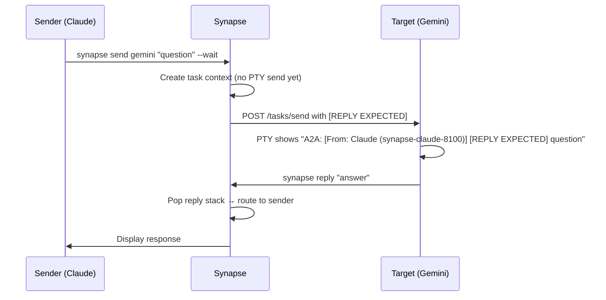

# Communication

## Overview

Synapse A2A provides three ways to send messages between agents:

| Method | Description | Best For |
|--------|-------------|----------|
| `synapse send` | Direct CLI command | Explicit agent-to-agent messaging |
| `synapse broadcast` | Send to all agents in same directory | Status checks, announcements |
| `@agent` pattern | Type in terminal | Quick inline mentions |

## Sending Messages

### Basic Send

```bash
synapse send <target> "<message>" \
  --wait          # Wait for reply
```

`--from` is auto-detected from `$SYNAPSE_AGENT_ID` (set at agent startup). You can omit it in most cases.

### Fire-and-Forget

```bash
synapse send codex "Refactor the auth module" --silent
```

!!! info "Completion Callback"
    Even in `--silent` mode, sender-side history is updated when the receiver completes the task. The receiver sends a best-effort callback (`POST /history/update`) to transition the sender's history record from `sent` to `completed`, `failed`, or `canceled`. If the callback cannot be delivered, the history record remains `sent`.

### With Priority

```bash
synapse send gemini "Urgent: check this security issue" \
  --priority 4 --wait
```

### All Options

```bash
synapse send <target> "<message>" \
  --from <sender_id> \
  --priority 1-5 \
  --wait | --notify | --silent \
  --message-file <path> \
  --stdin \
  --attach <file> \
  --force
```

| Option | Description |
|--------|-------------|
| `--from <sender_id>` | Sender identification (optional — auto-detected from `$SYNAPSE_AGENT_ID`) |
| `--priority 1-5` | Priority level (default: 3) |
| `--wait` / `--notify` / `--silent` | Wait for reply, async notify (default), or fire-and-forget |
| `--message-file <path>` | Read message from file |
| `--stdin` | Read message from stdin |
| `--attach <file>` | Attach file(s) — repeatable |
| `--task <id>` / `-T <id>` | Link message to a Task Board entry (auto-claim on receive, auto-complete on finalize) |
| `--force` | Bypass working_dir mismatch check |

!!! info "Sender Auto-Detection"
    The `--from` flag is resolved in the following order: (1) explicit `--from` value, (2) `SYNAPSE_AGENT_ID` environment variable (auto-set at startup), (3) PID ancestry matching against the registry. In most environments, you can omit `--from` entirely.

### Choosing Response Mode

Three response modes are available:

| Mode | Behavior | Use Case |
|------|----------|----------|
| `--notify` | Return immediately, PTY notification on completion (**default**) | Most use cases |
| `--wait` | Block until receiver replies | Questions, results needed before proceeding |
| `--silent` | Fire-and-forget, no notification | Pure notifications, delegated tasks |

!!! info "Structured Reply Artifacts"
    `--wait` and `--notify` produce structured A2A reply artifacts derived from the PTY output delta. TUI response cleaning runs for all agent types, stripping spinners, box-drawing borders, status bars, and input echo before finalization. A content scoring system selects the richest response context and drops trivial PTY noise (e.g., lone cursor movement characters).

```bash
# Default (--notify) — returns immediately, notifies on completion
synapse send gemini "Analyze this codebase"

# Synchronous wait — blocks until reply
synapse send gemini "What is the best approach for auth?" --wait

# Fire-and-forget — no completion notification
synapse send codex "Run the full test suite and fix any failures" --silent
```

### Name vs ID

**Targets (who you're talking to)** — use custom names. Names are resolved first, making them the easiest way to address agents:

```bash
synapse send my-claude "Review this code" --wait
synapse send Claud "Write the tests" --silent
```

**Sender (`--from`)** — always uses agent ID format (`synapse-<type>-<port>`). This is auto-detected, so you rarely need to specify it.

| Context | Use | Example |
|---------|-----|---------|
| Human → Agent | Custom name | `synapse send my-claude "..."` |
| Agent → Agent | Custom name or ID | `synapse send gemini "..."` |
| `--from` (sender) | Runtime ID (auto-detected) | `synapse-claude-8100` |

Target resolution priority: (1) Custom name → (2) Runtime ID → (3) Type-port → (4) Type only.
See [Agent Management](agent-management.md#target-resolution-priority) for details.

## Task-Linked Messaging

Link a message to a Task Board entry using `--task` / `-T`:

```bash
synapse send gemini "Implement the OAuth module" --task <task_id>
synapse send gemini "Implement the OAuth module" -T <task_id>
```

When the receiver accepts the message, the referenced task is **auto-claimed** (status moves to `in_progress`). When the receiver finalizes, the task is **auto-completed**. This removes the need for separate `synapse tasks assign` and `synapse tasks complete` calls.

See [Task Board -- Task-Linked Messaging](task-board.md#task-linked-messaging) for details on PTY display and schema integration.

## Receiving Messages

When a message arrives at an agent, it appears in the PTY with a prefix that includes optional sender identification and reply expectations:

```
A2A: [From: NAME (SENDER_ID)] [REPLY EXPECTED] <message content>
```

For task-linked messages, a task ID prefix is also shown:

```
A2A: [Task: a1b2c3d4] [From: NAME (SENDER_ID)] <message content>
```

- **From**: Identifies the sender's display name and unique agent ID. This helps you know who you are talking to.
- **REPLY EXPECTED**: Indicates that the sender is waiting for a response (blocking).

If sender information is not fully available, it falls back to:
- `A2A: [From: SENDER_ID] <message content>` (No name found in registry)
- `A2A: <message content>` (Backward-compatible format)

!!! info "Sender Identification"
    The name is retrieved from the agent registry based on the sender's PID or explicit `--from` ID. If an agent has a custom name (e.g., `Claud`), that name is shown for better context.

## Replying

### Basic Reply

```bash
synapse reply "Here are my findings..."
```

Reply automatically routes to the last sender.

### Reply to Specific Sender

When multiple senders are pending:

```bash
synapse reply --list-targets              # See who's waiting
synapse reply "Result" --to claude-8100   # Reply to specific sender
```

### Reply with Sender ID

For sandboxed environments (e.g., Codex):

```bash
synapse reply "Result" --from $SYNAPSE_AGENT_ID
```

## Priority Levels

| Level | Name | Use Case | Behavior |
|:-----:|------|----------|----------|
| 1-2 | Low | Background tasks | Normal delivery |
| **3** | **Normal** | **Default** | **Normal delivery** |
| 4 | Urgent | Follow-ups, status checks | Higher queue priority |
| 5 | Emergency | Critical issues | Sends SIGINT first, bypasses Readiness Gate |

!!! warning "Priority 5"
    Emergency priority (5) sends SIGINT to the agent before delivering the message. This interrupts whatever the agent is doing. Use only for genuine emergencies.

## Soft Interrupt

A convenience shorthand for priority-4 fire-and-forget messages:

```bash
synapse interrupt claude "Stop and review the current approach"

# Equivalent to:
synapse send claude "Stop and review" -p 4 --silent
```

## Broadcast

Send a message to all agents in the current working directory:

```bash
synapse broadcast "Status check — what's everyone working on?" --wait

# Fire-and-forget broadcast
synapse broadcast "FYI: deploying to staging" --silent
```

## Roundtrip Communication

When using `--wait`, the full roundtrip flow is:



## Long Messages

Messages longer than ~100KB are automatically stored in temp files:

```bash
# Explicitly use file for large messages
synapse send claude --message-file /tmp/review.txt --silent

# Read from stdin
echo "long message content" | synapse send claude --stdin --silent

# '-' reads from stdin
synapse send claude --message-file - --silent
```

The recipient sees a file reference:

```
A2A: [LONG MESSAGE - FILE ATTACHED]
The full message content is stored at: /tmp/synapse-a2a/messages/<task_id>.txt
Please read this file to get the complete message.
```

!!! info "Threshold"
    The auto-file threshold is configurable via `SYNAPSE_SEND_MESSAGE_THRESHOLD` (default: ~100KB).

## File Attachments

Attach files to messages:

```bash
synapse send claude "Review this" --attach src/main.py --silent
synapse send claude "Review these" --attach src/a.py --attach src/b.py --silent
```

## Working Directory Check

Synapse warns when the sender's working directory doesn't match the target's:

```
WARNING: Working directory mismatch
  Sender: /path/to/project-a
  Target: /path/to/project-b
Use --force to bypass this check.
```

Use `--force` to bypass:

```bash
synapse send claude "message" --force
```

## @Agent Pattern

Type directly in the agent's terminal:

```
@gemini Review this code for security issues
```

The InputRouter detects the `@agent` pattern and routes it via A2A.

## Advanced Patterns

### Priority Interruption

Interrupt a busy agent without killing it:

```bash
# High priority message (does not interrupt execution)
synapse send gemini "Status?" --priority 4 --wait

# Emergency interrupt (sends SIGINT first)
synapse send gemini "STOP - critical vulnerability in current path" --priority 5
```

!!! info "Readiness Gate Bypass"
    Priority 5 messages bypass the Readiness Gate, meaning they are delivered even if the agent hasn't finished its initial setup instructions.

### Cross-Project Messaging

Communicate with agents working in different directories using the `--force` flag:

```bash
# Warning: Target agent "worker" is in /path/to/project-b (Sender: /path/to/project-a)
synapse send worker "Can you check the API compatibility?" --force
```

This is especially common with worktree agents. For a detailed example using `--force` and `--message-file` to send instructions across worktree boundaries, see [Scenario 9: Cross-Worktree Knowledge Transfer](cross-agent-scenarios.md#scenario-9-cross-worktree-knowledge-transfer).

### Response Polling (Agent-to-Agent)

When an agent needs to check if a delegated task is done without blocking:

```bash
# Initial delegation
synapse send Worker "Fix bug" --silent

# Later, check status
synapse send Worker "Are you finished?" --wait
```

## Saved Workflows

For recurring multi-step sequences (e.g., review-then-test, security audit pipeline), save the steps as a YAML workflow and replay them with a single command:

```bash
synapse workflow run review-and-test
```

See [Workflows](workflow.md) for details on creating, managing, and running saved workflows.

## Collaboration Patterns

Beyond explicit messaging, the synapse-a2a skill teaches agents structured collaboration patterns for common situations.

### When You Receive a Task

1. If the message contains `[REPLY EXPECTED]`, complete the work and reply with `synapse reply`
2. **Verify the task board** -- check that a task board entry exists for your work. If the delegator forgot to create one, use the safety-net flow and keep the returned task ID for completion reporting:
   `synapse tasks list` then, if missing, `synapse tasks create "..." -d "..."`, note the returned `<new_task_id>`, and immediately `synapse tasks assign <new_task_id> $SYNAPSE_AGENT_ID`. Use that same `<new_task_id>` in Step 5 for `synapse tasks complete <task_id>` and the completion `synapse send`.
3. Identify independent work units and delegate them via `synapse spawn` + `synapse send --silent` to reduce your context and parallelize
4. Execute the remaining work yourself
5. Report completion: `synapse tasks complete <task_id>` then `synapse send <sender> "Done: <summary>" --silent`

### When You Need Help

1. For humans, run `synapse list` to check available agents (prefer same `WORKING_DIR`). For AI/scripts, use `synapse list --json` or the `list_agents` MCP tool instead of the interactive CLI output — see [MCP Setup](mcp-setup.md#list_agents).
2. Run `synapse memory search "<topic>"` to check shared knowledge first
3. If no suitable agent exists, spawn one: `synapse spawn <profile> --name <name> --role "<role>"`
4. Send the request: `synapse send <target> "<specific request>" --wait`

!!! tip "Cross-Model Preference"
    When spawning or delegating, prefer a **different model type** than your own. Different LLMs bring diverse strengths, and distributing token usage across providers avoids rate limits on any single model.

### Worker Autonomy

Even non-manager agents can and should proactively collaborate:

- **Spawn helpers** for independent subtasks
- **Request reviews** from other agents (different models catch different issues)
- **Delegate out-of-scope work** instead of doing everything yourself
- **Always clean up** -- kill agents you spawn when their work is done: `synapse kill <name> -f`

For the full collaboration decision framework, see [Proactive Collaboration](cross-agent-scenarios.md#proactive-collaboration-framework) in Cross-Agent Scenarios.

## A2A Flow Configuration

Configure default communication behavior in settings:

| Mode | Behavior |
|------|----------|
| `roundtrip` | Always wait for reply (like `--wait`) |
| `oneway` | Never wait (like `--silent`) |
| `auto` | Decide based on context (default) |

Configure in `.synapse/settings.json`:

```json
{
  "a2a_flow": "auto"
}
```
