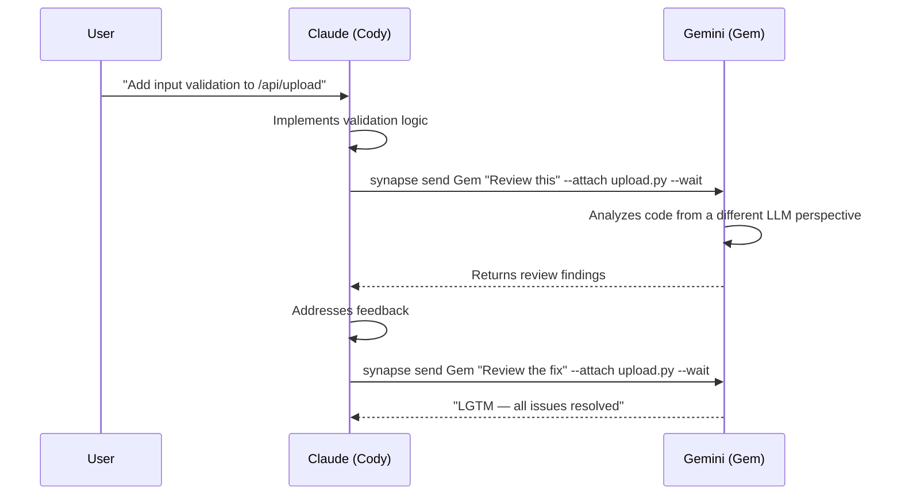
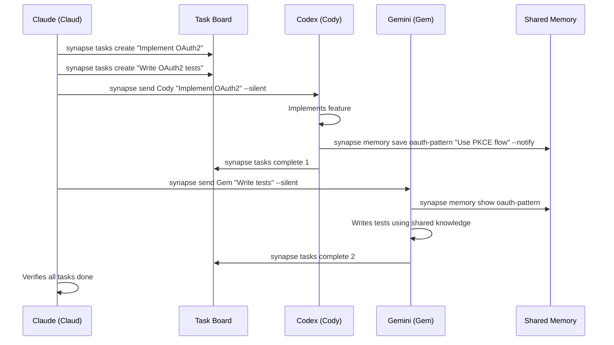
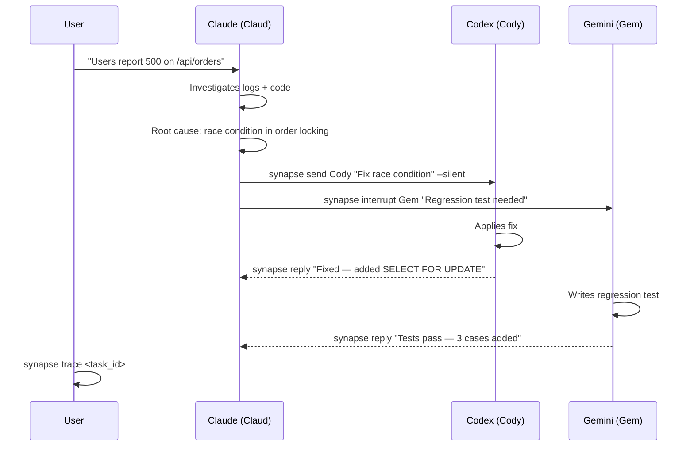
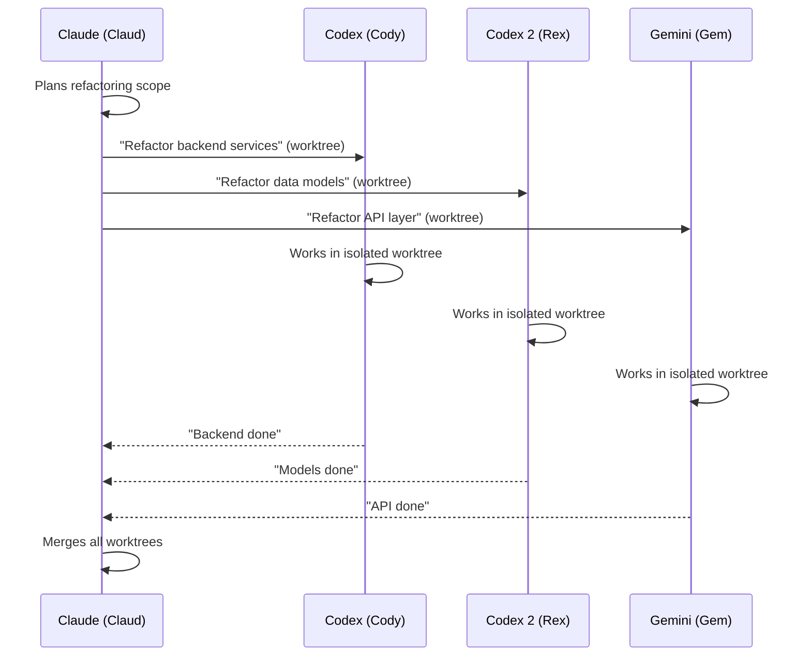
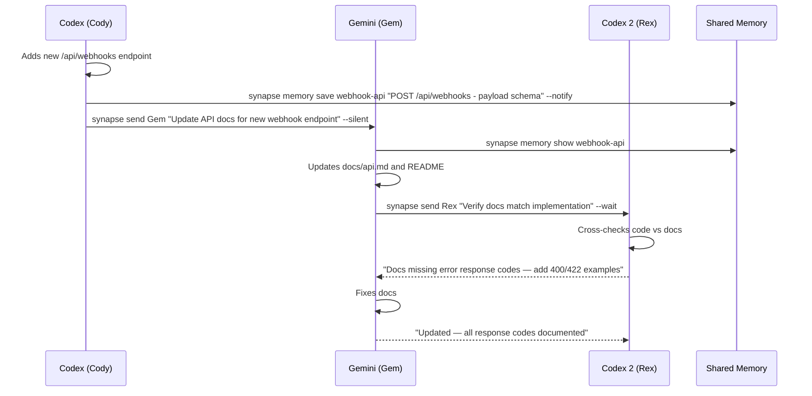
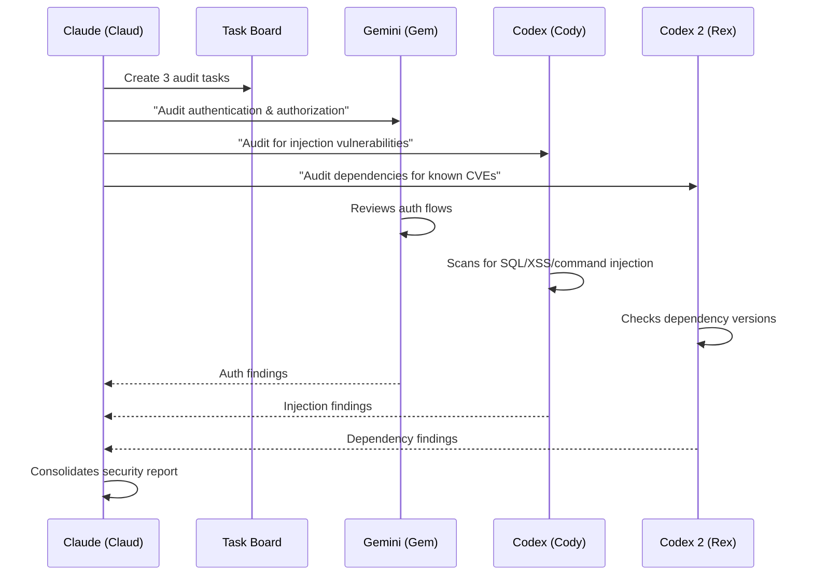
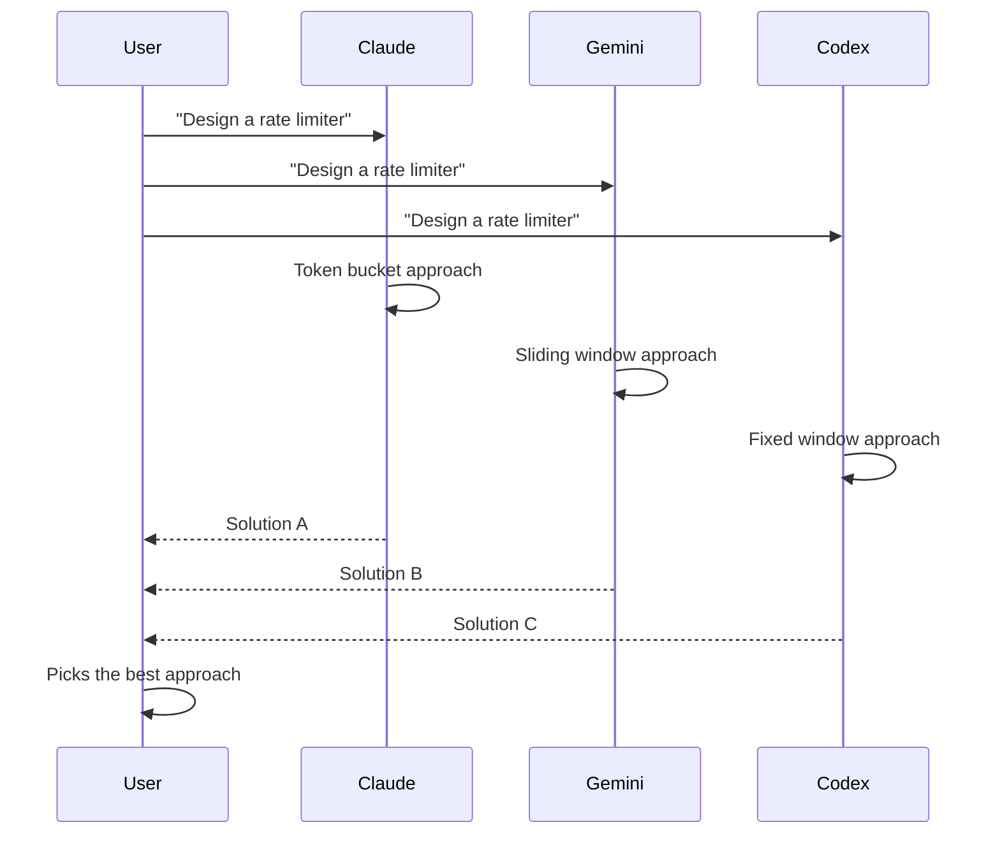
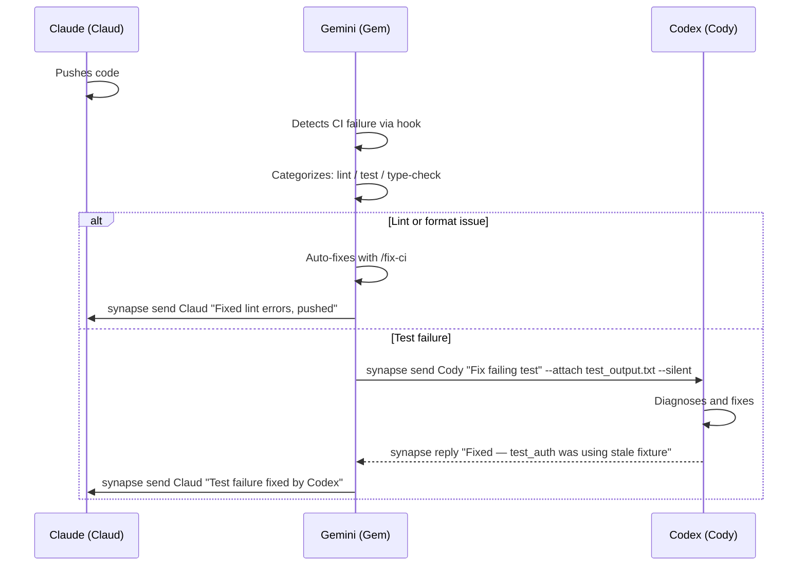

# Cross-Agent Scenarios

Real-world workflows where multiple agents collaborate — each leveraging its own LLM's strengths.

!!! tip "Prerequisites"
    Make sure you have at least two agents running. See [Quick Start](../getting-started/quickstart.md) to get started.

---

## Scenario 1: Cross-Review

**Claude implements, Gemini reviews** — different LLMs catch different classes of bugs.

### Why different agents?

Each LLM has distinct blind spots. Claude may optimize for readability while Gemini flags edge-case logic errors. Cross-review surfaces issues that a single model would miss.

### Steps



### Commands

**1. Start both agents:**

```bash
# Terminal 1
synapse claude --name Cody --role "feature implementation"

# Terminal 2
synapse gemini --name Gem --role "code reviewer"
```

**2. After Claude finishes implementation, request review:**

```bash
synapse send Gem "Review this file for security issues, edge cases, and error handling" \
  --attach src/api/upload.py --wait
```

**3. Gemini responds with findings. Claude fixes and re-requests:**

```bash
synapse send Gem "I've addressed your feedback. Please re-review" \
  --attach src/api/upload.py --wait
```

### Expected Result

```
Task synapse-gemini-8110-a1b2 → completed

Response:
## Review Findings

1. **Missing size limit** — `upload_file()` accepts any size. Add `MAX_UPLOAD_SIZE` check.
2. **Path traversal** — filename is used directly in `os.path.join()`. Use `secure_filename()`.
3. **No content-type validation** — MIME type is trusted from client. Verify with `python-magic`.

Severity: 2 high, 1 medium
```

!!! info "When to use `--wait` vs `--notify`"
    Use `--wait` for reviews where you need the result before continuing. Use `--notify` (default) if you want to keep working while the review happens in the background.

---

## Scenario 2: Delegation Chain

**Manager delegates implementation and testing to specialized agents** — each focused on what they do best.

### Why different agents?

A manager agent (Claude in delegate-mode) coordinates without editing files directly. Codex excels at focused implementation. Gemini provides independent test coverage. The Task Board tracks dependencies across the team.

### Steps



### Commands

**1. Start the team with names and roles:**

```bash
synapse team start \
  claude:Claud:synapse-manager:task-coordinator \
  codex:Cody::implementation \
  gemini:Gem::test-writer \
  --layout split
```

**2. Create tasks with dependencies:**

```bash
synapse tasks create "Implement OAuth2 with PKCE" \
  -d "Add OAuth2 authorization code flow with PKCE to /api/auth" --priority 4

synapse tasks create "Write OAuth2 integration tests" \
  -d "Cover token exchange, refresh, and error paths"
```

**3. Delegate to specialists:**

```bash
synapse send Cody "Implement the OAuth2 task. See task board for details." --silent
synapse send Gem "Write tests for the OAuth2 feature once implementation is done." --silent
```

**4. Codex shares learned patterns via Shared Memory:**

```bash
synapse memory save oauth-pkce \
  "Use PKCE with S256 challenge. Token endpoint: /oauth/token" \
  --tags auth,oauth --notify
```

**5. Monitor progress:**

```bash
synapse list                    # Agent status
synapse tasks list              # Task progress
synapse memory search "oauth"   # Shared knowledge
```

### Expected Result

```bash
$ synapse tasks list
┌────┬───────────────────────────────────┬───────────┬──────────┬──────────┐
│ ID │ Subject                           │ Status    │ Priority │ Assignee │
├────┼───────────────────────────────────┼───────────┼──────────┼──────────┤
│  1 │ Implement OAuth2 with PKCE        │ completed │    4     │ Codex    │
│  2 │ Write OAuth2 integration tests    │ completed │    3     │ Gemini   │
└────┴───────────────────────────────────┴───────────┴──────────┴──────────┘
```

---

## Scenario 3: Bug Hunt

**Production bug reported** — Claude diagnoses, Codex fixes, Gemini writes regression tests.

### Why different agents?

Time-critical bugs benefit from parallel investigation. Claude's reasoning strength identifies root causes. Codex applies targeted fixes. Gemini ensures the fix doesn't break anything else. `synapse interrupt` and priority levels coordinate urgent work.

### Steps



### Commands

**1. Agents are already running. Check status:**

```bash
synapse list
```

**2. Interrupt Gemini's current work (urgent):**

```bash
synapse interrupt Gem "Drop current work. Production bug: 500 errors on /api/orders. \
  Write regression tests for order creation and concurrent access."
```

**3. Claude identifies the root cause and delegates the fix:**

```bash
synapse send Cody "Fix race condition in src/orders/service.py:create_order(). \
  The issue: concurrent requests create duplicate orders because there's no row-level lock. \
  Solution: add SELECT FOR UPDATE in the transaction." --silent
```

**4. Attach relevant files for context:**

```bash
synapse send Cody "Here's the current implementation and the error log" \
  --attach src/orders/service.py \
  --attach /tmp/error-log-snippet.txt \
  --silent
```

**5. Track everything with trace:**

```bash
synapse trace <task_id>
```

### Expected Result

```bash
$ synapse trace abc123
┌─ Task abc123 ─────────────────────────────────────────┐
│ Subject: Fix race condition in order creation          │
│ Status:  completed                                     │
├────────────────────────────────────────────────────────┤
│ Timeline:                                              │
│  14:01  Claude → Codex: "Fix race condition..."        │
│  14:01  Claude → Gemini: interrupt "Drop current..."   │
│  14:03  Codex: modified src/orders/service.py          │
│  14:04  Codex → Claude: reply "Fixed"                  │
│  14:06  Gemini: created tests/test_order_race.py       │
│  14:07  Gemini → Claude: reply "Tests pass — 3 cases"  │
├────────────────────────────────────────────────────────┤
│ Files Modified:                                        │
│  src/orders/service.py (Codex)                         │
│  tests/test_order_race.py (Gemini)                     │
└────────────────────────────────────────────────────────┘
```

---

## Scenario 4: Parallel Refactoring

**Large-scale refactoring split across agents** — each handles a different module using worktree isolation.

### Why different agents?

A single agent refactoring a large codebase is slow and error-prone. Splitting by module lets agents work in parallel on isolated git worktrees, preventing merge conflicts. Each agent brings its strengths — Codex for mechanical refactoring, Claude for architectural decisions, Gemini for API surface changes.

### Steps



### Commands

**1. Spawn agents with worktree isolation:**

```bash
synapse spawn codex --worktree --name Cody --role "backend refactoring"
synapse spawn codex --worktree --name Rex --role "data model refactoring"
synapse spawn gemini --worktree --name Gem --role "API layer refactoring"
```

**2. Delegate each module:**

```bash
synapse send Cody "Refactor all service classes in src/services/ to use dependency injection. \
  Replace direct imports with constructor injection." --silent

synapse send Rex "Rename all SQLAlchemy models from CamelCase to snake_case table names. \
  Update foreign key references." --silent

synapse send Gem "Migrate all Flask routes in src/api/ to use APIRouter pattern. \
  Group by domain (users, orders, products)." --silent
```

**3. Monitor progress across all agents:**

```bash
synapse list
synapse broadcast "Status update — how far along are you?" --wait
```

**4. After all agents finish, merge worktree branches:**

```bash
git merge worktree-Cody
git merge worktree-Rex
git merge worktree-Gem
```

### Expected Result

Three agents work simultaneously in isolated worktrees under `.synapse/worktrees/`. No file conflicts during development. Manager merges the branches once all agents report completion.

---

## Scenario 5: Documentation Sweep

**Code changed, docs must follow** — Codex updates code, Gemini updates docs, Claude verifies consistency.

### Why different agents?

Documentation drift is one of the most common tech debt sources. By assigning a dedicated agent to docs, you guarantee that every code change has a corresponding doc update. Claude as verifier catches inconsistencies that neither the implementer nor the doc writer would notice alone.

### Steps



### Commands

**1. Start the team:**

```bash
synapse team start codex:Cody::implementation gemini:Gem::documentation codex:Rex::doc-verification --layout split
```

**2. After Codex implements the feature, share context:**

```bash
synapse memory save webhook-api \
  "New endpoint POST /api/webhooks. Accepts JSON payload with 'url', 'events[]', 'secret'. \
  Returns 201 with webhook ID. Errors: 400 invalid URL, 422 unknown event type." \
  --tags api,webhook --notify
```

**3. Delegate doc writing:**

```bash
synapse send Gem "New webhook endpoint added. Check shared memory for 'webhook-api'. \
  Update docs/api.md with endpoint reference and README.md with a usage example." --silent
```

**4. Request verification:**

```bash
synapse send Rex "Cross-check docs/api.md and src/api/webhooks.py. \
  Verify all endpoints, parameters, and error codes are documented." \
  --attach docs/api.md --attach src/api/webhooks.py --wait
```

### Expected Result

Documentation stays synchronized with code changes. The verifier catches mismatches before they reach production docs.

---

## Scenario 6: Security Audit Pipeline

**Multi-agent security review** — each agent audits a different attack surface.

### Why different agents?

Security audits benefit from diverse perspectives. One agent focuses on authentication, another on injection vulnerabilities, a third on dependency risks. Running them in parallel gives broad coverage quickly, and the results are consolidated via the Task Board.

### Steps



### Commands

**1. Create audit tasks:**

```bash
synapse tasks create "Audit authentication flows" \
  -d "Review login, session management, password reset, OAuth flows for vulnerabilities" --priority 4

synapse tasks create "Audit injection vulnerabilities" \
  -d "Scan for SQL injection, XSS, command injection, path traversal in all endpoints" --priority 4

synapse tasks create "Audit dependency vulnerabilities" \
  -d "Check all dependencies for known CVEs. Review lock file versions." --priority 4
```

**2. Assign agents to audit tasks:**

```bash
synapse send Gem "Audit all authentication and authorization code. \
  Check: session fixation, CSRF protection, password hashing, token expiry. \
  Report findings as HIGH/MEDIUM/LOW." --wait

synapse send Cody "Scan the codebase for injection vulnerabilities. \
  Check: raw SQL queries, unsanitized user input in templates, shell commands with user input. \
  Report findings as HIGH/MEDIUM/LOW." --wait

synapse spawn codex --name Rex --role "dependency security"
synapse send Rex "Review requirements.txt and uv.lock for known CVEs. \
  Flag any dependencies older than 6 months. Report findings." --wait
```

**3. Consolidate results:**

```bash
synapse memory save security-audit-2026-03 \
  "Auth: 2 HIGH, 1 MEDIUM. Injection: 1 HIGH. Deps: 3 MEDIUM (outdated packages)" \
  --tags security,audit --notify
```

### Expected Result

Three parallel audit streams complete faster than a single sequential review. Findings are saved to Shared Memory for the team to reference during remediation.

---

## Scenario 7: Competitive Analysis (LLM vs LLM)

**Same prompt, different models** — compare approaches from Claude, Gemini, and Codex side-by-side.

### Why different agents?

When you're unsure about the best approach for a complex problem, send the same prompt to multiple agents and compare their solutions. Different LLMs often take fundamentally different approaches — one may favor simplicity, another performance, another extensibility.

### Steps



### Commands

**1. Start all three agents:**

```bash
synapse team start claude gemini codex --all-new
```

**2. Broadcast the same design challenge:**

```bash
synapse broadcast "Design a rate limiter for our API. Requirements: \
  - 100 requests per minute per API key \
  - Must handle burst traffic gracefully \
  - Should work in a distributed environment (multiple servers) \
  Write the implementation in src/middleware/rate_limiter.py" --wait
```

**3. Compare results:**

```bash
# Check what each agent produced
synapse history list --agent claude --limit 1
synapse history list --agent gemini --limit 1
synapse history list --agent codex --limit 1

# Review the files each agent would create
git diff
```

!!! warning "File conflicts"
    When agents write to the same file, use worktree isolation (`--worktree`) to prevent conflicts. Without worktrees, the last agent to write wins.

### Expected Result

Three different implementations of the same feature, each reflecting the strengths of its underlying LLM. You pick the best approach or combine ideas from multiple solutions.

---

## Scenario 8: Continuous Integration Agent

**A dedicated agent monitors CI and auto-fixes failures** — the team never waits for a green build.

### Why different agents?

CI failures block the entire team. A dedicated CI agent can monitor GitHub Actions, diagnose failures, and either fix them directly or delegate to the right specialist. This keeps human developers (and other agents) focused on feature work instead of debugging flaky tests or lint errors.

### Steps



### Commands

**1. Start the CI monitor agent:**

```bash
synapse gemini --name Gem --role "CI monitoring and triage"
```

**2. When CI fails, the monitor triages:**

```bash
# Gem detects failure and categorizes it
synapse send Gem "CI failed on branch feature/auth. \
  Check GitHub Actions logs and determine the failure category." --wait
```

**3. For simple fixes (lint/format), auto-fix:**

```bash
# Gem runs the fix-ci skill
synapse send Gem "Run /fix-ci to auto-fix the lint failure" --silent
```

**4. For complex failures, delegate:**

```bash
synapse send Cody "Fix the failing test in tests/test_auth.py. \
  Error: 'fixture user_session not found'. The fixture was renamed in the last commit." \
  --attach tests/test_auth.py --silent
```

**5. Notify the developer:**

```bash
synapse send Claud "CI is green again. Codex fixed a stale fixture reference in test_auth.py." --silent
```

### Expected Result

CI failures are detected, categorized, and fixed automatically. The developer gets a notification only when the fix is complete — no context-switching to debug CI issues.

---

## Tips for Effective Cross-Agent Collaboration

| Tip | Details |
|-----|---------|
| **Name your agents** | `--name Rex` is clearer than `codex-8120` in team communication |
| **Use priority levels** | Normal work at 3, urgent follow-ups at 4, production emergencies at 5 |
| **Share knowledge** | `synapse memory save` lets one agent's discoveries help the whole team |
| **Track with Task Board** | `synapse tasks` provides a shared view of what's done and what's pending |
| **Trace for auditing** | `synapse trace <task_id>` shows the full history of a task across agents |
| **Choose response mode wisely** | `--wait` when you need the result, `--silent` for fire-and-forget delegation |
| **Use worktrees for parallel edits** | `--worktree` prevents file conflicts when agents modify the same files |
| **Broadcast for team coordination** | `synapse broadcast` reaches all agents at once for status checks or announcements |

## Related Pages

- [Communication](communication.md) — message sending, priority levels, reply tracking
- [Agent Teams](agent-teams.md) — team start, delegate mode, auto-spawn
- [Task Board](task-board.md) — task creation, dependencies, status tracking
- [Shared Memory](shared-memory.md) — cross-agent knowledge sharing
- [History & Tracing](history.md) — task history, trace, statistics
