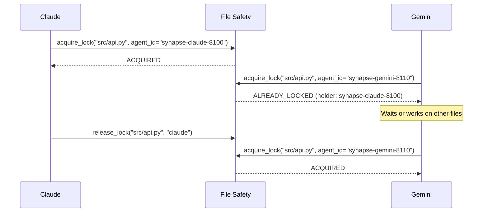
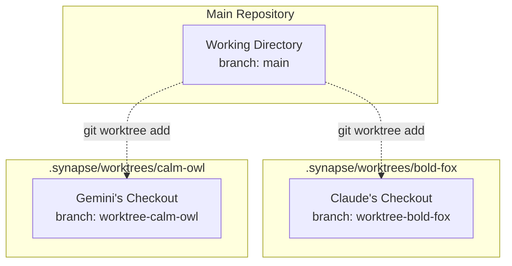

# File Safety

## Overview

File Safety prevents multi-agent file conflicts with exclusive locking, change tracking, and modification history. When multiple agents work on the same project, File Safety ensures they don't overwrite each other's changes.

## Enabling File Safety

```bash
# Via environment variable
export SYNAPSE_FILE_SAFETY_ENABLED=true
synapse claude

# Or in .synapse/settings.json
{
  "env": {
    "SYNAPSE_FILE_SAFETY_ENABLED": "true"
  }
}
```

Storage: `.synapse/file_safety.db` (project-local SQLite, WAL mode)

## File Locking

### Check Current Locks

```bash
synapse file-safety locks
synapse file-safety locks --file src/auth.py
synapse file-safety locks --agent claude
```

### Acquire a Lock

```bash
synapse file-safety lock src/auth.py claude \
  --intent "Refactoring authentication" \
  --duration 300    # 5 minutes (default: 300 seconds)
```

!!! danger "Always Lock Before Editing"
    Two agents editing the same file simultaneously causes **data loss**. Changes are overwritten without warning. Every edit needs a lock -- no exceptions.

### Release a Lock

```bash
synapse file-safety unlock src/auth.py claude
```

### Force Unlock

```bash
synapse file-safety unlock src/auth.py claude --force
```

## Change Tracking

### Record a Modification

```bash
synapse file-safety record src/auth.py claude task-123 \
  --type MODIFY \
  --intent "Added OAuth2 support"
```

Change types: `CREATE`, `MODIFY`, `DELETE`

### View File History

```bash
synapse file-safety history src/auth.py
synapse file-safety history src/auth.py --limit 10
```

### Recent Changes

```bash
synapse file-safety recent
synapse file-safety recent --agent claude --limit 20
```

## Complete Workflow

### Before Editing

```bash
# 1. Check if file is locked
synapse file-safety locks

# 2. Acquire lock
synapse file-safety lock src/auth.py claude --intent "Bug fix"

# 3. Verify lock
synapse file-safety locks
```

### After Editing

```bash
# 4. Record the modification
synapse file-safety record src/auth.py claude task-123 --type MODIFY

# 5. Release lock
synapse file-safety unlock src/auth.py claude
```

## Cleanup

### Stale Locks

Locks from dead processes (crashed agents):

```bash
synapse file-safety cleanup-locks              # Interactive
synapse file-safety cleanup-locks --force      # No confirmation
```

### Old Records

```bash
synapse file-safety cleanup --days 30          # Remove records older than 30 days
synapse file-safety cleanup --days 30 --force  # No confirmation
```

## Status and Debug

```bash
synapse file-safety status    # Overview statistics
synapse file-safety debug     # Database paths, schema version, details
```

## Python API

```python
from synapse.file_safety import FileSafetyManager, ChangeType, LockStatus

manager = FileSafetyManager.from_env()

# Acquire lock (use agent_id/agent_type keyword args)
agent = "synapse-claude-8100"
result = manager.acquire_lock(
    "src/auth.py", agent_id=agent, agent_type="claude",
    intent="Refactoring"
)
if result["status"] == LockStatus.ACQUIRED:
    # Edit file...
    manager.record_modification(
        "src/auth.py", agent, "task-123",
        change_type=ChangeType.MODIFY,
        intent="Added OAuth2"
    )
    manager.release_lock("src/auth.py", agent)

# Query
context = manager.get_file_context("src/auth.py", limit=5)
history = manager.get_file_history("src/auth.py", limit=20)
stats = manager.get_statistics()
```

## Conflict Resolution Scenarios

When multiple agents work on the same project, file conflicts are inevitable. This section covers common scenarios and the strategies to handle them.

### Scenario 1: Two Agents Editing the Same File

The most common conflict occurs when two agents attempt to edit the same file simultaneously.



**Resolution:** The second agent receives an `ALREADY_LOCKED` status and should either wait for the lock to be released or work on a different file. Use the `--wait` flag to block until the lock becomes available:

```bash
synapse file-safety lock src/api.py gemini --wait --wait-timeout 60
```

### Scenario 2: Agent Crashes While Holding a Lock

If an agent crashes or is force-killed, its file locks remain in the database. These are detected as "stale locks" because the holding process ID (PID) is no longer alive.

```bash
# Check for stale locks
synapse file-safety locks
# Output shows: Status = STALE for dead processes

# Clean up stale locks
synapse file-safety cleanup-locks
```

!!! warning "Stale Lock Detection"
    Stale locks are identified by checking if the PID that acquired the lock is still running. If the process has terminated, the lock is considered stale and can be safely removed. The `synapse list` command also displays stale lock warnings.

### Scenario 3: Overlapping Modifications to Related Files

Two agents may not edit the same file but edit tightly coupled files (e.g., a module and its tests). While File Safety allows this (different files = different locks), it can still cause logical conflicts.

**Best practices:**

1. **Use the Task Board for coordination.** Assign related files to the same agent when possible.
2. **Check file context before editing.** Use `get_file_context()` to see recent changes to related files.
3. **Record modification intent.** Always include an `--intent` so other agents understand what changed and why.

```bash
# Before editing tests, check if the module was recently changed
synapse file-safety history src/auth.py
synapse file-safety history tests/test_auth.py
```

### Resolution Strategies Summary

| Strategy | When to Use | Mechanism |
|----------|-------------|-----------|
| **Lock-based exclusion** | Same file, multiple agents | `acquire_lock` / `release_lock` |
| **Wait with timeout** | Agent can afford to block | `--wait --wait-timeout N` |
| **Task separation** | Large projects | Assign different files per agent via Task Board |
| **Sequential execution** | Critical shared files | Complete one agent's work before starting another |
| **Delegate mode** | Complex coordination | One coordinator assigns files to workers |

!!! tip "Preventing Conflicts Proactively"
    The best conflict resolution is conflict prevention. Design your multi-agent workflows so that each agent works on a distinct set of files. Use the Task Board to explicitly assign file ownership, and use Delegate Mode to have a coordinator manage file assignments.

## Worktree Integration

Synapse-native worktrees provide the strongest form of file isolation. Instead of relying on file-level locks, each agent gets its own complete copy of the repository through a Git worktree.

### How Worktrees Provide Isolation

When an agent is spawned with `--worktree`, Synapse creates a new Git worktree under `.synapse/worktrees/<name>/` with a dedicated branch. Each agent operates in its own checkout directory, completely eliminating the possibility of file conflicts at the filesystem level.



```bash
# Spawn agents with isolated worktrees
synapse spawn claude --worktree --name implementer
synapse spawn gemini --worktree --name tester

# Team start with worktrees for all agents
synapse team start claude gemini --worktree
```

### File Safety Across Worktrees

When agents run in separate worktrees, each agent has its own copy of every file. File Safety still plays a role in this setup:

- **Change tracking remains valuable.** Even in separate worktrees, recording what each agent modified helps when merging changes later.
- **Locks are less critical** because filesystem-level conflicts cannot occur. However, locks can still be used to coordinate logical ownership (e.g., "agent X owns the auth module design").
- **Context injection** helps agents understand what others have changed in their worktrees before merging.

!!! note "File Safety DB is Project-Local"
    The `.synapse/file_safety.db` lives in the main repository root. All worktrees share this database, so change tracking and lock state are visible across all agents regardless of which worktree they operate in.

### Merging Worktree Changes Safely

After agents complete their work in separate worktrees, their branches need to be merged. Follow this process to merge safely:

```bash
# 1. Check what each agent changed
synapse file-safety recent --agent claude
synapse file-safety recent --agent gemini

# 2. Review branches before merging
git log worktree-bold-fox --oneline
git log worktree-calm-owl --oneline

# 3. Merge one branch at a time
git merge worktree-bold-fox
git merge worktree-calm-owl    # Resolve conflicts if any

# 4. Clean up worktrees after merge
# (Synapse prompts for cleanup when agents exit)
```

!!! warning "Merge Conflicts"
    Worktrees eliminate runtime file conflicts but do not prevent Git merge conflicts. If two agents modified the same lines in their respective worktrees, you will need to resolve the conflict during the merge step. Use `/fix-conflict` skill or resolve manually.

### When to Use Worktrees vs. File Locks

| Factor | File Locks | Worktrees |
|--------|-----------|-----------|
| **Isolation level** | File-level | Full repository |
| **Setup overhead** | None | Creates a full checkout |
| **Merge step needed** | No | Yes (Git merge) |
| **Best for** | Small edits, sequential work | Large features, parallel work |
| **Disk usage** | Minimal | One checkout per agent |

!!! example "Recommended Approach"
    For teams of 3+ agents working on different features simultaneously, use worktrees. For 2 agents doing sequential edits to a shared codebase, file locks are simpler and sufficient.

## `synapse trace` Integration

The `synapse trace` command connects task history with file modification records, providing a complete audit trail of what an agent did during a task and which files were affected.

### Running a Trace

```bash
synapse trace <task_id>
```

This command queries two data sources:

1. **Task history** (from `.synapse/history.db` or the history manager): Shows the A2A message exchange, timestamps, agent involvement, and task status.
2. **File Safety records** (from `.synapse/file_safety.db`): Shows all file modifications associated with the given task ID.

### Reading Trace Output

A typical trace output looks like this:

```text
================================================================================
TASK DETAIL
================================================================================
Task ID:    a1b2c3d4-5678-9abc-def0-123456789abc
Agent:      synapse-claude-8100
Status:     completed
Created:    2026-03-05 10:30:00
Direction:  incoming

Message:    Refactor the authentication module to use OAuth2
Response:   Refactoring complete. Updated src/auth.py and tests/test_auth.py.

================================================================================
FILE MODIFICATIONS:
================================================================================

[2026-03-05 10:32:15] claude - MODIFY
  Intent: Replaced basic auth with OAuth2 flow
  File: src/auth.py

[2026-03-05 10:35:42] claude - MODIFY
  Intent: Updated tests for OAuth2
  File: tests/test_auth.py

[2026-03-05 10:36:01] claude - CREATE
  Intent: Added OAuth2 configuration
  File: src/oauth_config.py
```

### Use Cases for Trace

**Debugging unexpected changes:**

When a file has been modified in an unexpected way, trace the task that was responsible:

```bash
# Find which task modified a file
synapse file-safety history src/auth.py

# Trace the task to see the full context
synapse trace <task_id_from_history>
```

**Auditing agent work:**

After a multi-agent session, review what each agent accomplished:

```bash
# List all tasks by agent
synapse history list --agent gemini

# Trace each task to see file-level details
synapse trace <task_id>
```

**Cross-referencing task board and file changes:**

Combine Task Board task IDs with trace to verify that agents completed their assigned work correctly:

```bash
# Check the task board
synapse tasks list --status completed

# Trace a completed task to verify file modifications
synapse trace <task_id>
```

!!! tip "Enable Both Features"
    `synapse trace` requires both history tracking (enabled by default) and File Safety (`SYNAPSE_FILE_SAFETY_ENABLED=true`). Without File Safety enabled, the trace shows task history but not file modification details.

## Troubleshooting

| Issue | Solution |
|-------|----------|
| File locked by another agent | Wait, work on different files, or `synapse send` to coordinate |
| Stale locks (dead process) | `synapse file-safety cleanup-locks` |
| Database not found | Enable with `SYNAPSE_FILE_SAFETY_ENABLED=true` |
| Frequent conflicts | Separate tasks by file, shorten lock duration, or use worktrees |
| Merge conflicts after worktree work | Use `/fix-conflict` skill or resolve manually with `git merge` |
| Trace shows no file modifications | Ensure `SYNAPSE_FILE_SAFETY_ENABLED=true` is set |
| Lock wait times out | Increase `--wait-timeout` or check if the holding agent is stuck |
