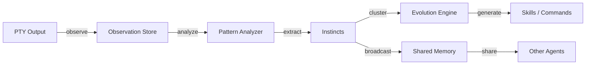
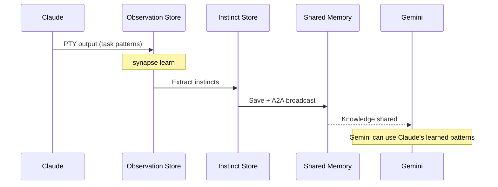

# Self-Learning Pipeline

## Overview

The Self-Learning Pipeline enables agents to automatically learn from their operations, extract reusable patterns as **instincts**, and evolve those instincts into skills and commands. Built on the PTY observation layer, this feature works with all supported CLI agents -- no agent-side hooks required.

The pipeline follows a three-stage flow:

```
Observe → Learn → Evolve
```



## How It Works

### Stage 1: Observation

The `ObservationCollector` in `controller.py` passively monitors PTY output from every running agent and records events to a local SQLite database.

**Observed events:**

| Event | Data Collected | Purpose |
|-------|---------------|---------|
| Task received | Message, sender, priority | Task pattern analysis |
| Task completed | Duration, status, output summary | Success pattern learning |
| Error occurred | Error type, recovery action | Error resolution patterns |
| Status change | From/to state, trigger | Workflow optimization |
| File operation | Path, operation type | Coding pattern detection |

Because observation happens at the PTY layer, it works identically across Claude Code, Codex, Gemini, OpenCode, and Copilot.

### Stage 2: Learn (Pattern Extraction)

The `synapse learn` command analyzes accumulated observations and extracts **atomic instincts** -- each consisting of one trigger and one action.

```bash
synapse learn
```

Each instinct is assigned a **confidence score** that evolves over time:

| Score | Meaning | Behavior |
|-------|---------|----------|
| 0.3 | Tentative | Suggestion only |
| 0.5 | Moderate | Apply when context matches |
| 0.7 | Strong | Auto-apply |
| 0.9 | Core | Fundamental behavior |

Confidence increases with repeated observation and user approval, and decreases when the user corrects or overrides the pattern.

### Stage 3: Evolve (Skill Generation)

When 2 or more related instincts accumulate, the evolution engine clusters them and generates skill or command candidates.

```bash
# Show candidates
synapse evolve

# Generate skill files automatically
synapse evolve --generate
```

Generated skills are output as `SKILL.md` files and can be automatically distributed to `.claude/skills/` and `.agents/skills/`, making them available to all agent types.

## Cross-Agent Knowledge Sharing

The key differentiator from single-agent learning systems: instincts are saved to Shared Memory and broadcast via A2A to all running agents. A pattern discovered by Claude can become a skill used by Codex or Gemini.



## Commands

### `synapse learn`

Analyze observations from the current session and extract instincts.

```bash
synapse learn
```

### `synapse instinct status`

Display all instincts ordered by confidence score.

```bash
synapse instinct status
```

### `synapse instinct list`

List instincts with filtering options.

```bash
synapse instinct [--scope project|global] [--domain DOMAIN] [--min-confidence N]
```

| Flag | Description |
|------|-------------|
| `--scope` | Filter by scope (`project` or `global`) |
| `--domain` | Filter by domain |
| `--min-confidence` | Minimum confidence threshold |
| `--limit N` | Maximum results (default: 50) |

### `synapse instinct promote`

Promote a project-scoped instinct to global scope.

```bash
synapse instinct promote <id>
```

### `synapse evolve`

Cluster related instincts and discover skill/command candidates.

```bash
synapse evolve                # Show candidates
synapse evolve --generate     # Generate skill files
```

| Flag | Description |
|------|-------------|
| `--generate` | Auto-generate `.md` skill files from candidates |
| `--output-dir DIR` | Output directory for generated files |

## Configuration

| Variable | Default | Description |
|----------|---------|-------------|
| `SYNAPSE_OBSERVATION_ENABLED` | `true` | Enable PTY observation collection |
| `SYNAPSE_OBSERVATION_DB_PATH` | `.synapse/observations.db` | Observation database path |

## Relationship to Other Features

- **Shared Memory**: Instincts are persisted to Shared Memory for cross-agent access
- **Skills System**: Evolved instincts become skills distributed via the existing skill pipeline
- **Proactive Mode**: When enabled, observation data is richer due to mandatory feature usage
