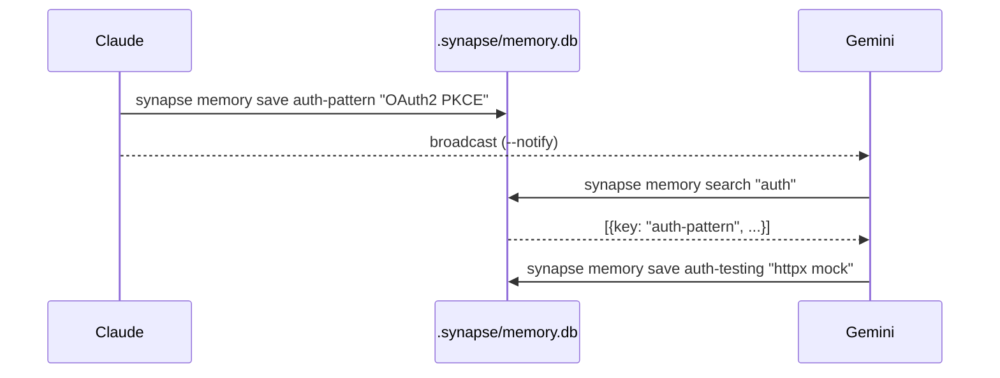

# Shared Memory

## Overview

Shared Memory provides a project-local knowledge base where agents can save, search, and share learned knowledge across sessions. When multiple agents collaborate on a project, Shared Memory enables them to persist decisions, patterns, and discoveries that any agent can later retrieve.

Storage: `.synapse/memory.db` (project-local SQLite, WAL mode for concurrent access)

## Enabling Shared Memory

Shared Memory is enabled by default. To configure it:

```bash
# Via environment variable
export SYNAPSE_SHARED_MEMORY_ENABLED=true
synapse claude

# Or in .synapse/settings.json
{
  "env": {
    "SYNAPSE_SHARED_MEMORY_ENABLED": "true",
    "SYNAPSE_SHARED_MEMORY_DB_PATH": ".synapse/memory.db"
  }
}
```

To disable:

```bash
SYNAPSE_SHARED_MEMORY_ENABLED=false synapse claude
```

## Saving Knowledge

```bash
synapse memory save <key> "<content>" [--tags tag1,tag2] [--notify]
```

Each memory entry has a unique **key**. Saving with an existing key updates the content (UPSERT semantics).

```bash
# Save a decision
synapse memory save auth-pattern "Use OAuth2 with PKCE flow for all auth"

# Save with tags for categorization
synapse memory save db-choice "PostgreSQL with UUID primary keys" \
  --tags architecture,database

# Save and notify other agents via broadcast
synapse memory save api-style "REST with OpenAPI 3.1" --notify
```

## Listing Memories

```bash
synapse memory list [--author <agent_id>] [--tags <tags>] [--limit <n>]
```

```bash
# List all memories
synapse memory list

# Filter by author agent
synapse memory list --author synapse-claude-8100

# Filter by tag (exact match)
synapse memory list --tags architecture

# Limit results
synapse memory list --limit 10
```

!!! info "Exact Tag Matching"
    Tag filtering uses exact matching. For example, `--tags auth` matches the tag `auth` but not `authentication`. This prevents false positives from partial matches.

## Viewing Details

```bash
synapse memory show <id_or_key>
```

```bash
# Show by key
synapse memory show auth-pattern

# Show by UUID
synapse memory show a1b2c3d4-e5f6-...
```

## Searching

Search across key, content, and tags fields (returns up to 100 results by default):

```bash
synapse memory search <query>
```

```bash
# Search for OAuth-related knowledge
synapse memory search "OAuth2"

# Search by tag content
synapse memory search "architecture"
```

## Deleting Memories

```bash
synapse memory delete <id_or_key> [--force]
```

```bash
# Delete with confirmation prompt
synapse memory delete auth-pattern

# Delete without confirmation
synapse memory delete auth-pattern --force
```

## Statistics

```bash
synapse memory stats
```

Shows total count, per-author breakdown, and per-tag breakdown.

## API Endpoints

Shared Memory is also accessible via the A2A REST API:

| Method | Endpoint | Description |
|:------:|----------|-------------|
| GET | `/memory/list` | List memories (query: `author`, `tags`, `limit`) |
| POST | `/memory/save` | Save or update a memory |
| GET | `/memory/search` | Search memories (query: `q`, default limit: 100) |
| GET | `/memory/{id_or_key}` | Get a specific memory |
| DELETE | `/memory/{id_or_key}` | Delete a memory |

### Save via API

```bash
curl -X POST http://localhost:8100/memory/save \
  -H "Content-Type: application/json" \
  -d '{
    "key": "auth-pattern",
    "content": "Use OAuth2 with PKCE flow",
    "author": "synapse-claude-8100",
    "tags": ["security", "auth"]
  }'
```

### Search via API

```bash
curl http://localhost:8100/memory/search?q=OAuth2
```

## Multi-Agent Workflow

A typical knowledge-sharing workflow between agents:

```bash
# Agent 1 (Claude) discovers a pattern and saves it
synapse memory save auth-pattern "OAuth2 with PKCE — see src/auth.py" \
  --tags security,auth --notify

# Agent 2 (Gemini) searches for relevant knowledge before starting work
synapse memory search "auth"

# Agent 2 retrieves the full details
synapse memory show auth-pattern

# Agent 2 saves additional findings
synapse memory save auth-testing "Use httpx mock for OAuth2 tests" \
  --tags testing,auth
```



## Python API

```python
from synapse.shared_memory import SharedMemory

# Create from environment variables
memory = SharedMemory.from_env()

# Save a memory (UPSERT on key)
result = memory.save(
    key="auth-pattern",
    content="Use OAuth2 with PKCE flow",
    author="synapse-claude-8100",
    tags=["security", "auth"],
)

# Get by key or ID
entry = memory.get("auth-pattern")

# List with filters (tags use exact matching)
entries = memory.list_memories(author="synapse-claude-8100", tags=["security"])

# Search across key, content, and tags (default limit: 100)
results = memory.search("OAuth2")
results = memory.search("OAuth2", limit=20)  # Custom limit

# Delete by key or ID
memory.delete("auth-pattern")

# Statistics
stats = memory.stats()
# {"total": 5, "by_author": {"claude": 3, "gemini": 2}, "by_tag": {"auth": 2}}
```

## Configuration

| Variable | Default | Description |
|----------|---------|-------------|
| `SYNAPSE_SHARED_MEMORY_ENABLED` | `true` | Enable shared memory |
| `SYNAPSE_SHARED_MEMORY_DB_PATH` | `.synapse/memory.db` | Database file path |

## Troubleshooting

| Issue | Solution |
|-------|----------|
| Memory not found | Check key spelling with `synapse memory list` |
| Database not created | Verify `SYNAPSE_SHARED_MEMORY_ENABLED=true` |
| Concurrent write errors | SQLite WAL mode handles this automatically |
| Stale knowledge | Use `synapse memory delete` to clean up outdated entries |
