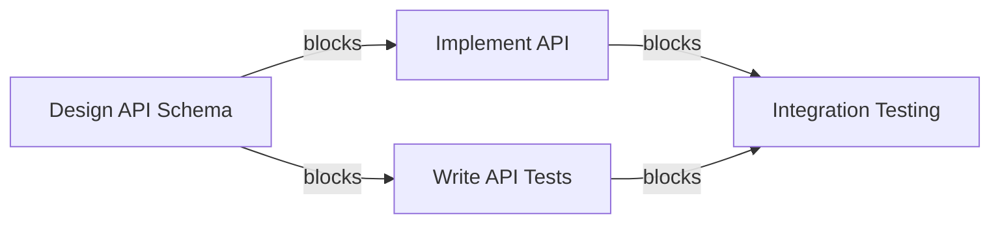
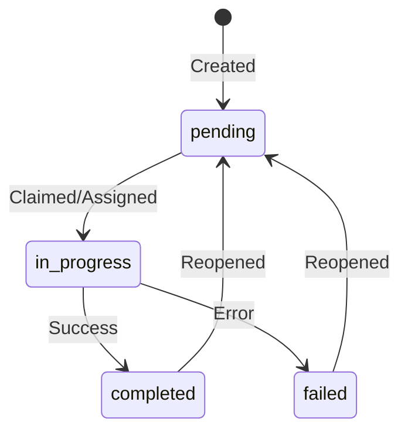

# Task Board

## Overview

The Shared Task Board is a SQLite-based coordination system that lets agents create, assign, track, and complete tasks with dependency management.

Storage: `.synapse/task_board.db` (project-local, SQLite WAL mode for concurrent access)

## Creating Tasks

```bash
synapse tasks create "Implement OAuth2 authentication" \
  -d "Add OAuth2 with JWT tokens to the API layer"

# With priority (1-5, default 3)
synapse tasks create "Fix critical security bug" \
  -d "SQL injection in login endpoint" --priority 5
```

## Listing Tasks

```bash
synapse tasks list                       # All tasks
synapse tasks list --status pending      # Filter by status
synapse tasks list --status in_progress  # In-progress tasks
```

## Assigning Tasks

```bash
synapse tasks assign <task_id> claude
```

Assignment atomically claims the task (prevents double-assignment via WAL mode).

## Completing Tasks

```bash
synapse tasks complete <task_id>
```

Completing a task automatically unblocks any dependent tasks.

## Failing Tasks

```bash
synapse tasks fail <task_id> --reason "Dependency not available"
```

Failed tasks preserve their assignee and do not unblock dependents.

## Reopening Tasks

```bash
synapse tasks reopen <task_id>
```

Reopened tasks return to `pending` status.

## Task Dependencies

Create tasks that depend on other tasks:

```bash
# Create parent task
synapse tasks create "Design API schema" -d "Define endpoints and models"
# Returns: task-abc123

# Create dependent task
synapse tasks create "Implement API" \
  -d "Build the API based on schema" \
  --blocked-by task-abc123
```

The dependent task cannot be claimed until all blocking tasks are completed.



## Plan Approval

For tasks that require human approval before implementation:

### Approve a Plan

```bash
synapse approve <task_id>
```

### Reject with Reason

```bash
synapse reject <task_id> --reason "Use OAuth instead of API keys"
```

## Task Board API

### List Tasks

```bash
curl http://localhost:8100/tasks/board
```

### Create Task

```bash
curl -X POST http://localhost:8100/tasks/board \
  -H "Content-Type: application/json" \
  -d '{
    "subject": "Implement feature",
    "description": "Details here",
    "priority": 4
  }'
```

### Claim Task

```bash
curl -X POST http://localhost:8100/tasks/board/<task_id>/claim \
  -H "Content-Type: application/json" \
  -d '{"agent_id": "synapse-claude-8100"}'
```

### Complete Task

```bash
curl -X POST http://localhost:8100/tasks/board/<task_id>/complete \
  -H "Content-Type: application/json" \
  -d '{"agent_id": "synapse-claude-8100"}'
```

## Task Status Flow



## Priority Levels

| Priority | Use Case |
|:--------:|----------|
| 1 | Low priority, background |
| 2 | Below normal |
| **3** | **Normal (default)** |
| 4 | High priority |
| 5 | Critical/urgent |

Higher priority tasks are served first when agents request available work.
