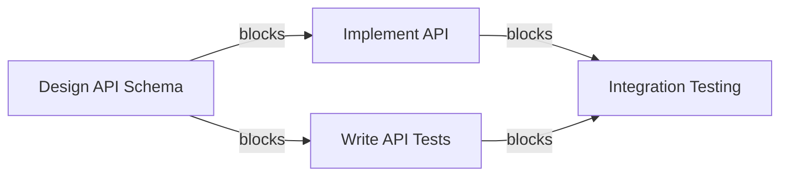
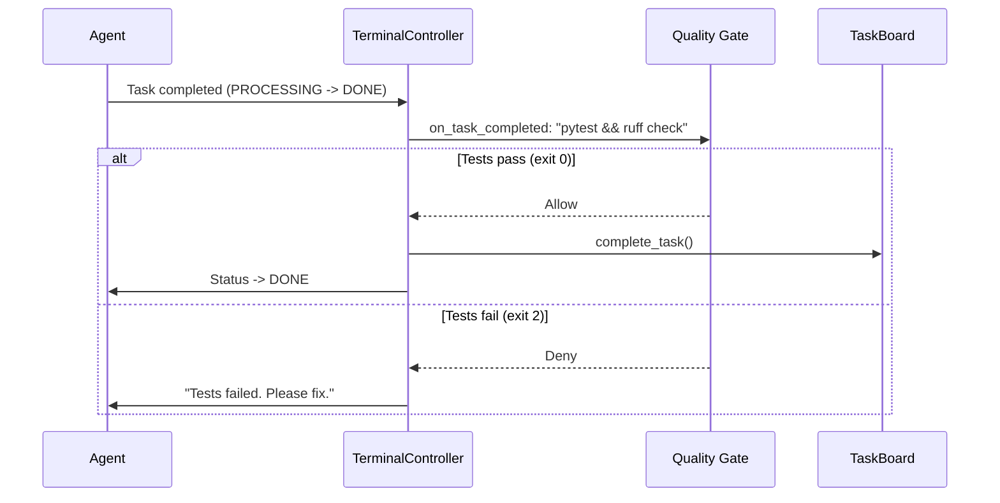
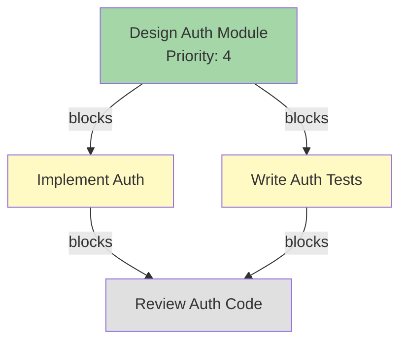
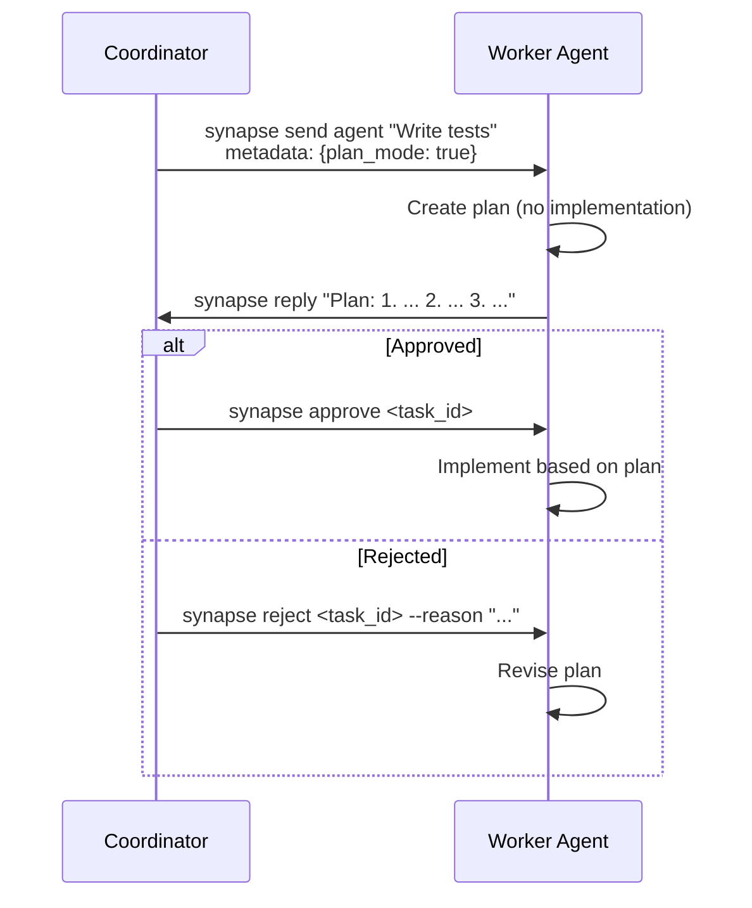
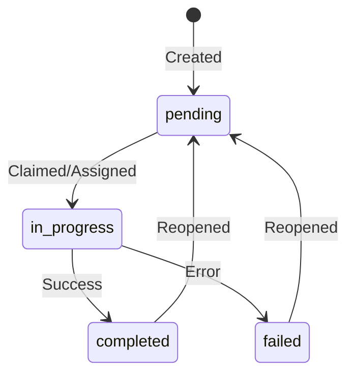
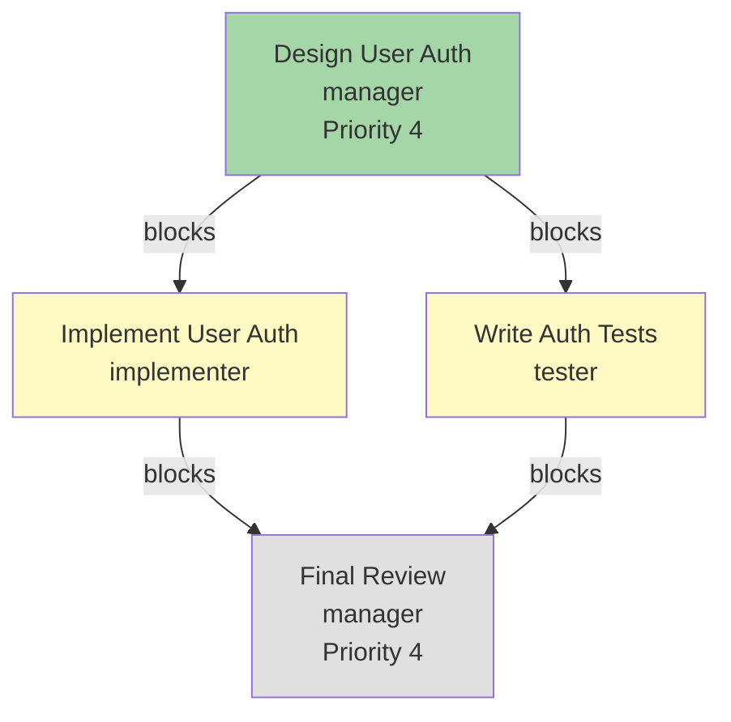

# Task Board

## Overview

The Shared Task Board is a SQLite-based coordination system that lets agents create, assign, track, and complete tasks with dependency management. It forms the foundation of Synapse's structured multi-agent collaboration, replacing ad-hoc message-based task delegation with a persistent, queryable task store.

Storage: `.synapse/task_board.db` (project-local, SQLite WAL mode for concurrent access)

!!! note "Enabled by Default"
    The Task Board is enabled by default. To disable it, set `SYNAPSE_TASK_BOARD_ENABLED=false` in your environment or `.synapse/settings.json`.

## Creating Tasks

```bash
synapse tasks create "Implement OAuth2 authentication" \
  -d "Add OAuth2 with JWT tokens to the API layer"

# With priority (1-5, default 3)
synapse tasks create "Fix critical security bug" \
  -d "SQL injection in login endpoint" --priority 5
```

## Listing Tasks

```bash
synapse tasks list                       # All tasks
synapse tasks list --status pending      # Filter by status
synapse tasks list --status in_progress  # In-progress tasks
```

## Assigning Tasks

```bash
synapse tasks assign <task_id> claude
```

Assignment atomically claims the task (prevents double-assignment via WAL mode).

## Completing Tasks

```bash
synapse tasks complete <task_id>
```

Completing a task automatically unblocks any dependent tasks.

## Failing Tasks

```bash
synapse tasks fail <task_id> --reason "Dependency not available"
```

Failed tasks preserve their assignee and do not unblock dependents.

## Reopening Tasks

```bash
synapse tasks reopen <task_id>
```

Reopened tasks return to `pending` status.

## Task Dependencies

Create tasks that depend on other tasks:

```bash
# Create parent task
synapse tasks create "Design API schema" -d "Define endpoints and models"
# Returns: task-abc123

# Create dependent task
synapse tasks create "Implement API" \
  -d "Build the API based on schema" \
  --blocked-by task-abc123
```

The dependent task cannot be claimed until all blocking tasks are completed.



## Quality Gates (Hooks)

Quality Gates are shell commands that run automatically at key lifecycle events during task processing. They enforce quality standards by allowing or denying status transitions based on exit codes.

### How Hooks Work

Hooks are triggered at specific points in an agent's status lifecycle:

| Hook | Trigger | Purpose |
|------|---------|---------|
| `on_idle` | `PROCESSING` to `READY` transition | Run checks when agent finishes work |
| `on_task_completed` | Task marked as completed | Verify quality before accepting completion |

The exit code determines the outcome:

| Exit Code | Meaning | Behavior |
|:---------:|---------|----------|
| 0 | Allow | Transition proceeds normally |
| 2 | Deny | Transition is blocked; agent must fix the issue |
| Other | Warning | Transition proceeds with a logged warning |



### Configuring Hooks

Hooks can be configured at the project level in `.synapse/settings.json` or per-agent in profile YAML files.

**Project-level configuration:**

```json
{
  "hooks": {
    "on_idle": "pytest tests/ --tb=short",
    "on_task_completed": "pytest tests/ && ruff check"
  }
}
```

**Per-agent profile override:**

```yaml
# synapse/profiles/claude.yaml
hooks:
  on_task_completed: "pytest tests/ --tb=short -x"
```

!!! tip "Profile Hooks Override Project Hooks"
    When both project-level and profile-level hooks are configured for the same event, the profile-level hook takes precedence. This lets you customize quality checks per agent type.

### Environment Variables in Hooks

When a hook executes, Synapse injects the following environment variables:

| Variable | Description | Example |
|----------|-------------|---------|
| `SYNAPSE_AGENT_ID` | Runtime ID | `synapse-claude-8100` |
| `SYNAPSE_AGENT_NAME` | Custom name (if set) | `my-claude` |
| `SYNAPSE_STATUS_FROM` | Status before transition | `PROCESSING` |
| `SYNAPSE_STATUS_TO` | Status after transition | `READY` |
| `SYNAPSE_LAST_TASK_ID` | Most recent task ID | `a1b2c3d4-...` |

### Hook Examples

**Run tests before allowing task completion:**

```json
{
  "hooks": {
    "on_task_completed": "pytest tests/ -x --tb=short"
  }
}
```

**Run linting and formatting checks:**

```json
{
  "hooks": {
    "on_task_completed": "ruff check && ruff format --check"
  }
}
```

**Custom script that checks for TODO markers:**

```bash
#!/bin/bash
# hooks/no-todos.sh
if grep -r "TODO" src/; then
  echo "ERROR: Unresolved TODOs found in source"
  exit 2  # Deny transition
fi
exit 0
```

```json
{
  "hooks": {
    "on_task_completed": "bash hooks/no-todos.sh"
  }
}
```

!!! warning "Hook Timeout"
    Hooks have a default timeout of 30 seconds. If a hook exceeds this timeout, the transition is allowed with a warning logged. Keep hooks fast to avoid blocking agent workflows.

## Multi-Task Dependency Pipeline

For complex projects, you can chain tasks with dependencies to build an execution pipeline. Agents pick up tasks in dependency order, and blocked tasks remain unavailable until their prerequisites are met.

### Creating a Pipeline

```bash
# Step 1: Design
synapse tasks create "Design authentication module" \
  -d "Define the API schema and data models" \
  --priority 4
# Returns: task-design-001

# Step 2: Implement (blocked by design)
synapse tasks create "Implement authentication" \
  -d "Build OAuth2 + JWT based on the design" \
  --blocked-by task-design-001
# Returns: task-impl-002

# Step 3: Write tests (blocked by design)
synapse tasks create "Write authentication tests" \
  -d "Unit and integration tests for auth module" \
  --blocked-by task-design-001
# Returns: task-test-003

# Step 4: Code review (blocked by implementation AND tests)
synapse tasks create "Review authentication code" \
  -d "Review implementation and test coverage" \
  --blocked-by task-impl-002 \
  --blocked-by task-test-003
# Returns: task-review-004
```



### How Blocked Tasks Are Handled

When a task has entries in its `blocked_by` list:

1. The task remains in `pending` status but cannot be claimed by any agent.
2. When a blocking task is completed, the system checks all pending tasks to see if any are now unblocked.
3. A task becomes available only when **all** of its blockers are completed.
4. Failed tasks do **not** unblock their dependents -- the blocker must be completed (or the dependent must be reopened without the blocker).

!!! example "Checking Available Tasks"
    The `get_available_tasks()` method returns only tasks that are pending, unassigned, and have no incomplete blockers. These are ordered by priority (highest first), then by creation time.

    ```bash
    # List tasks ready to be picked up
    synapse tasks list --status pending
    ```

### Priority-Based Task Ordering

When multiple tasks are available (unblocked and unassigned), agents receive them ordered by:

1. **Priority** (descending): Priority 5 tasks are served before priority 1.
2. **Creation time** (ascending): Among equal-priority tasks, older tasks are served first.

This ensures critical tasks are addressed promptly while maintaining fairness for tasks of the same priority level.

## Plan Approval Workflow

The Plan Approval workflow (B3) allows a coordinator to request that an agent create a plan before implementing anything. This prevents risky concurrent code edits and lets the coordinator verify the approach before execution begins.

### How It Works



### Approving a Plan

```bash
synapse approve <task_id>
```

Approval signals the agent that it may proceed with implementation based on its submitted plan.

### Rejecting a Plan

```bash
synapse reject <task_id> --reason "Use OAuth instead of API keys"
```

Rejection sends the reason back to the agent, which should revise its plan accordingly.

### Plan Mode Instructions

When plan mode is active, the agent receives an additional instruction appended to its context:

> **[PLAN MODE]**
> Create a detailed plan for the requested task.
> Do NOT implement anything -- only describe what you would do.
> Include: analysis, proposed changes, file list, and risks.
> Wait for explicit approval before proceeding with implementation.

### Using Plan Approval with Delegate Mode

Plan Approval works naturally with Delegate Mode (`--delegate-mode`). A coordinator running in delegate mode can:

1. Create tasks on the Task Board.
2. Send tasks to worker agents with `--plan-mode` to request plans first.
3. Review returned plans.
4. Approve or reject each plan before workers begin coding.

```bash
# Start coordinator in delegate mode
synapse claude --delegate-mode --name manager --role "project coordinator"

# From the coordinator, send a plan-mode task
synapse send gemini "Implement caching layer for the API" --plan-mode --wait

# After reviewing the plan
synapse approve <task_id>
# or
synapse reject <task_id> --reason "Use Redis instead of in-memory cache"
```

!!! note "Agent Compliance"
    Plan Approval relies on the agent following its instructions. Claude Code has high compliance with plan-mode instructions, but other agent types may vary. Test with your target agents before relying on this in production workflows.

## Python API

The `TaskBoard` class provides full programmatic access to the task board. This is useful for building custom tooling, automation scripts, or integrating with external systems.

### Initialization

```python
from synapse.task_board import TaskBoard

# From environment variables (recommended)
board = TaskBoard.from_env()

# Direct initialization
board = TaskBoard(db_path=".synapse/task_board.db", enabled=True)
```

!!! tip "Environment Variables"
    `TaskBoard.from_env()` reads two environment variables:

    - `SYNAPSE_TASK_BOARD_ENABLED`: Set to `"true"` or `"1"` to enable (default: `"true"`).
    - `SYNAPSE_TASK_BOARD_DB_PATH`: Path to the SQLite database file.

### Creating Tasks

```python
task_id = board.create_task(
    subject="Implement OAuth2",
    description="Add OAuth2 with JWT tokens",
    created_by="synapse-claude-8100",
    blocked_by=["task-design-001"],  # Optional dependency list
    priority=4,                       # 1-5 (default: 3)
)
print(f"Created task: {task_id}")
```

### Claiming and Completing Tasks

```python
# Atomically claim a task (fails if already claimed or blocked)
success = board.claim_task(task_id, agent_id="synapse-gemini-8110")

if success:
    # ... do the work ...

    # Complete the task and get list of newly unblocked task IDs
    unblocked = board.complete_task(task_id, agent_id="synapse-gemini-8110")
    print(f"Unblocked tasks: {unblocked}")
```

### Failing and Reopening Tasks

```python
# Mark a task as failed
board.fail_task(task_id, agent_id="synapse-gemini-8110", reason="Tests failing")

# Reopen a completed or failed task back to pending
board.reopen_task(task_id, agent_id="synapse-claude-8100")
```

### Querying Tasks

```python
# Get a single task
task = board.get_task(task_id)

# List tasks with optional filters
all_tasks = board.list_tasks()
pending = board.list_tasks(status="pending")
my_tasks = board.list_tasks(assignee="synapse-claude-8100")

# Get available (unblocked, unassigned, pending) tasks
# Ordered by priority DESC, then created_at ASC
available = board.get_available_tasks()
for task in available:
    print(f"[P{task['priority']}] {task['subject']}")
```

### Task Dictionary Structure

Every task is returned as a dictionary with the following keys:

| Key | Type | Description |
|-----|------|-------------|
| `id` | `str` | UUID of the task |
| `subject` | `str` | Task title |
| `description` | `str` | Task description |
| `status` | `str` | `pending`, `in_progress`, `completed`, or `failed` |
| `assignee` | `str` or `None` | Agent ID of the assignee |
| `created_by` | `str` | Agent ID of the creator |
| `blocked_by` | `list[str]` | List of blocking task IDs |
| `created_at` | `str` | ISO timestamp of creation |
| `updated_at` | `str` | ISO timestamp of last update |
| `completed_at` | `str` or `None` | ISO timestamp of completion |
| `priority` | `int` | Priority level (1-5) |
| `fail_reason` | `str` | Reason for failure (if failed) |

### Integration Example: Auto-Assign Available Tasks

```python
from synapse.task_board import TaskBoard

board = TaskBoard.from_env()

def auto_assign_next_task(agent_id: str) -> dict | None:
    """Pick the highest-priority available task and assign it."""
    available = board.get_available_tasks()
    for task in available:
        if board.claim_task(task["id"], agent_id):
            return task
    return None

# Usage
task = auto_assign_next_task("synapse-claude-8100")
if task:
    print(f"Assigned: {task['subject']} (priority {task['priority']})")
else:
    print("No tasks available")
```

## Task Board API

The Task Board is also accessible via REST endpoints on any running agent's A2A server.

### List Tasks

```bash
curl http://localhost:8100/tasks/board
```

### Create Task

```bash
curl -X POST http://localhost:8100/tasks/board \
  -H "Content-Type: application/json" \
  -d '{
    "subject": "Implement feature",
    "description": "Details here",
    "priority": 4
  }'
```

### Claim Task

```bash
curl -X POST http://localhost:8100/tasks/board/<task_id>/claim \
  -H "Content-Type: application/json" \
  -d '{"agent_id": "synapse-claude-8100"}'
```

### Complete Task

```bash
curl -X POST http://localhost:8100/tasks/board/<task_id>/complete \
  -H "Content-Type: application/json" \
  -d '{"agent_id": "synapse-claude-8100"}'
```

### Approve / Reject Plan

```bash
# Approve a plan
curl -X POST http://localhost:8100/tasks/<task_id>/approve

# Reject a plan with reason
curl -X POST http://localhost:8100/tasks/<task_id>/reject \
  -H "Content-Type: application/json" \
  -d '{"reason": "Use a different approach"}'
```

## Task Status Flow



## Priority Levels

| Priority | Use Case |
|:--------:|----------|
| 1 | Low priority, background |
| 2 | Below normal |
| **3** | **Normal (default)** |
| 4 | High priority |
| 5 | Critical/urgent |

Higher priority tasks are served first when agents request available work.

## Complete Workflow Example

This example demonstrates a full multi-agent pipeline using the Task Board with Quality Gates and Plan Approval.

```bash
# 1. Start a coordinator and two worker agents
synapse claude --delegate-mode --name manager --role "project coordinator"
synapse gemini --name implementer --role "code implementation"
synapse codex --name tester --role "test writer"

# 2. Create a task pipeline
synapse tasks create "Design user auth" -d "Define schema and flow" --priority 4
# Returns: task-aaa

synapse tasks create "Implement user auth" \
  -d "Build the auth module" --blocked-by task-aaa
# Returns: task-bbb

synapse tasks create "Write auth tests" \
  -d "Unit + integration tests" --blocked-by task-aaa
# Returns: task-ccc

synapse tasks create "Final review" \
  -d "Review implementation and tests" \
  --blocked-by task-bbb --blocked-by task-ccc --priority 4
# Returns: task-ddd

# 3. Assign the first task
synapse tasks assign task-aaa manager

# 4. When design is done, complete it -- task-bbb and task-ccc become available
synapse tasks complete task-aaa

# 5. Assign implementation and testing in parallel
synapse tasks assign task-bbb implementer
synapse tasks assign task-ccc tester

# 6. When both complete, task-ddd becomes available for review
synapse tasks complete task-bbb
synapse tasks complete task-ccc

# 7. Assign and complete the final review
synapse tasks assign task-ddd manager
synapse tasks complete task-ddd
```



!!! tip "Monitoring Progress"
    Use `synapse list` for real-time agent status and `synapse tasks list` to see the current state of all tasks on the board.
